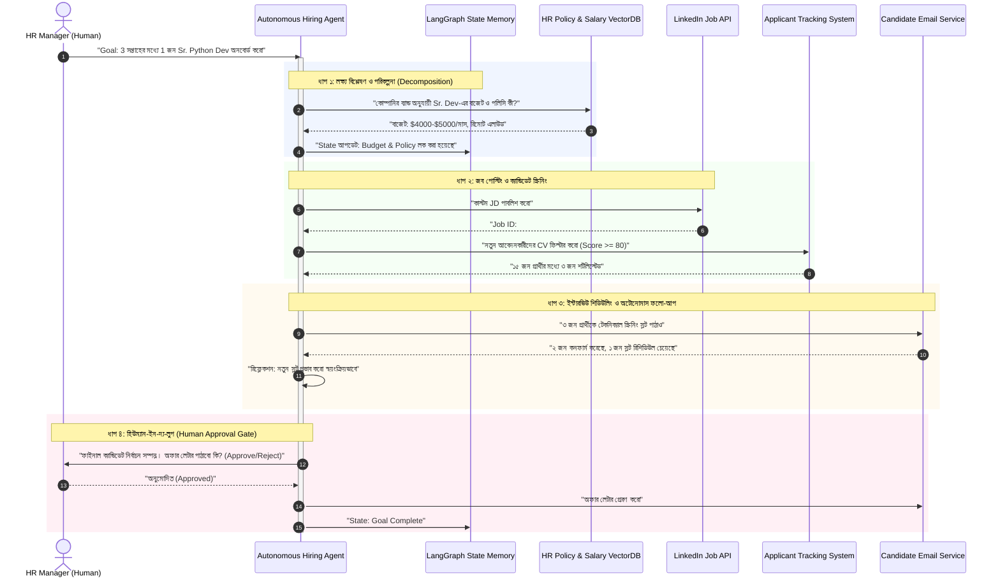

# Generative AI থেকে Agentic AI এর বিবর্তন (The Evolution of AI Systems)

> **Module 1: Foundations of Agentic AI**

---

## ১. What — এই অধ্যায়ে আমরা কী শিখছি?

কৃত্রিম বুদ্ধিমত্তার জগতে গত কয়েক বছরে যে রূপান্তর ঘটেছে, তা নিছক মডেলের সাইজ বৃদ্ধির গল্প নয়; এটি মূলত **মডেলের আচরণের রূপান্তর (Behavioral Shift)**। এই অধ্যায়ে আমরা একটি বাস্তবধর্মী **HR Talent Acquisition & Hiring Scenario** এর মাধ্যমে কৃত্রিম বুদ্ধিমত্তা ব্যবস্থার চারটি ধারাবাহিক প্রজন্ম (Generations) বিশ্লেষণ করব:

```
[Level 1: Pure Generative AI] 
       ↓ (যোগ হলো প্রাইভেট নলেজ)
[Level 2: RAG-based Chatbot] 
       ↓ (যোগ হলো বাইরের জগত প্রভাবিত করার ক্ষমতা)
[Level 3: Tool-Augmented Chatbot] 
       ↓ (যোগ হলো স্বায়ত্তশাসন, গোল-ওরিয়েন্টেশন ও সেলফ-রিফ্লেকশন)
[Level 4: Autonomous Agentic AI]
```

প্রতিটি স্তরে কী ধরণের সীমাবদ্ধতা তৈরি হয়েছিল এবং কেন ইন্ডাস্ট্রি কেবল টেক্সট জেনারেট করা থেকে বেরিয়ে **স্বায়ত্তশাসিত লক্ষ্য অর্জনকারী (Autonomous Goal-Driven)** এজেন্টের দিকে ঝুঁকছে, তার প্রযুক্তিগত ভিত্তি তৈরি করাই এই অধ্যায়ের উদ্দেশ্য।

---

## ২. Why — কেন এটি গুরুত্বপূর্ণ এবং Agentic AI পাইপলাইনে কোথায় ফিট করে?

সফটওয়্যার ইঞ্জিনিয়ারিংয়ে কোনো নতুন আর্কিটেকচার অ্যাডপ্ট করার আগে সবচেয়ে জরুরি প্রশ্ন হলো: **"আমার আগের প্রযুক্তি দিয়ে কি এই সমস্যা মেটানো যেত না?"**

1. **Generative AI একটি Capability, Agentic AI একটি Behavior:**
   - Large Language Model (LLM) টেক্সট প্রেডিক্ট করতে পারে, সামারি করতে পারে, কোড লিখতে পারে—এটি তার *ক্ষমতা (Capability)*।
   - কিন্তু সেই ক্ষমতাকে একটি নির্দিষ্ট ব্যবসায়িক লক্ষ্যে (Business Goal) রূপান্তরিত করা, ভুল হলে নিজে সংশোধন করা, এবং শুরু থেকে শেষ পর্যন্ত মাল্টি-স্টেপ কাজ সম্পন্ন করা হলো এজেন্টের *আচরণ (Behavior)*।

2. **LangGraph আর্কিটেকচারের ভিত্তিপ্রস্তর:**
   - LangGraph কোনো চ্যাটবট বানানোর সাধারণ লাইব্রেরি নয়। এটি একটি **Stateful, Cyclic, Multi-Actor Orchestration Framework**।
   - কেন সাইক্লিক গ্রাফ (Cyclic Graph) দরকার, কেন সাধারণ লিনিয়ার চেইন (Linear LCEL Chain) যথেষ্ট নয়—তার উত্তর লুকিয়ে আছে এই চার স্তরের সীমাবদ্ধতাগুলোর মধ্যে।

---

## ৩. Architecture & Evolution Diagrams

আমরা চারটি স্তরের আর্কিটেকচারাল পার্থক্য স্পষ্ট কালার-কোডেড ডায়াগ্রামের মাধ্যমে দেখব।

```
Color Palette Guide:
🟦 Blue (#2563EB)     : User & Agent Core (Cognitive Brain)
🟩 Green (#059669)    : Tools, Execution & Real World Actions
🟨 Amber (#D97706)    : Memory & Knowledge Retrieval (RAG/VectorDB)
🟪 Purple (#7C3AED)   : State Management & Decision Control
🟥 Red (#DC2626)      : Endpoints & Validation Gates
```

### ৩.১ চার প্রজন্মের স্থাপত্য তুলনা (Side-by-Side Architectural Evolution)

```mermaid
flowchart TB
    %% Styling Classes
    classDef userNode fill:#2563EB,color:#fff,stroke:#1E40AF,stroke-width:2px;
    classDef brainNode fill:#4338CA,color:#fff,stroke:#3730A3,stroke-width:2px;
    classDef ragNode fill:#D97706,color:#fff,stroke:#B45309,stroke-width:2px;
    classDef toolNode fill:#059669,color:#fff,stroke:#047857,stroke-width:2px;
    classDef agentNode fill:#7C3AED,color:#fff,stroke:#6D28D9,stroke-width:2px;

    subgraph GEN1["Level 1: Pure Generative AI (Reactive Text Generator)"]
        U1["User Prompt"]:::userNode -->|"Static Prompt"| LLM1["Foundation LLM<br/>(Frozen Weights)"]:::brainNode
        LLM1 -->|"Text Response"| O1["Static Output"]
    end

    subgraph GEN2["Level 2: RAG-based Chatbot (Knowledge Grounded)"]
        U2["User Prompt"]:::userNode -->|"Query"| RET2["Retriever"]:::ragNode
        VDB2[("Company Vector DB<br/>HR Policies")]:::ragNode -->|"Relevant Chunks"| RET2
        RET2 -->|"Prompt + Context"| LLM2["LLM with Context"]:::brainNode
        LLM2 -->|"Grounded Advice"| O2["Contextual Output"]
    end

    subgraph GEN3["Level 3: Tool-Augmented System (Action-Capable, Single-Turn)"]
        U3["User Prompt"]:::userNode -->|"Instruction"| LLM3["LLM with Function Calling"]:::brainNode
        LLM3 -->|"JSON Arguments"| T3["External APIs<br/>(LinkedIn, Email, Calendar)"]:::toolNode
        T3 -->|"API Response"| LLM3
        LLM3 -->|"Action Result"| O3["Executed Output"]
    end

    subgraph GEN4["Level 4: Autonomous Agentic AI (Stateful, Cyclic, Goal-Driven)"]
        U4["High-Level Goal"]:::userNode -->|"Goal State"| AG4["Agent Core<br/>(Planner & Reasoner)"]:::agentNode
        AG4 <-->|"Persistent State & History"| SM4[("State & Checkpoints")]:::agentNode
        AG4 -->|"Selected Action"| TC4["Tool Execution Node"]:::toolNode
        TC4 -->|"Observation / Feedback"| AG4
        AG4 -->|"Condition: Goal Accomplished?"| EVAL4{"Self-Evaluation"}:::ragNode
        EVAL4 -->|"No: Re-plan & Retry"| AG4
        EVAL4 -->|"Yes: Deliver Result"| O4["Autonomous Success"]
    end
```



---

### ৩.২ এইচআর রিক্রুটিং সিনারিও: একটি মাল্টি-স্টেপ এজেন্টের রিয়েল-টাইম এক্সিকিউশন সিকোয়েন্স

একটি বাস্তব সমস্যা বিবেচনা করা যাক: **"আমাদের টিমের জন্য একজন Senior Python Developer হায়ার করতে হবে।"**

নিচের `sequenceDiagram`-এ লক্ষ্য করুন কীভাবে লেভেল ৪ এজেন্ট মানুষের ক্রমাগত প্রম্পটিং ছাড়াই সম্পূর্ণ সাইকেল পরিচালনা করে:



---

## ৪. সম্পূর্ণ, চালানোর উপযোগী কোড উদাহরণ

নিচের পাইথন কোডটি লক্ষ্য করুন। এখানে আমরা ডেমোস্ট্রেট করব কীভাবে একটি **Tool-Augmented সিস্টেম (Level 3)** থেকে লুপ ও ডিসিশন যুক্ত করে একটি মিনি **Agentic Workflow (Level 4)** তৈরি করা যায়। 

আমরা `pydantic` এবং স্ট্যান্ডার্ড কন্ট্রোল ফ্লো দিয়ে কোনো ব্ল্যাক-বক্স ম্যাজিক ছাড়াই কোডের মেকানিজম সরাসরি দেখাব:

```python
"""
evolution_demo.py
Demonstration of Transition from Tool-Augmentation to Autonomous Agentic Loop
"""

import json
from typing import Dict, Any, List, Optional
from pydantic import BaseModel, Field


# ---------------------------------------------------------
# ১. টুলস লেয়ার (External Tools Simulation)
# ---------------------------------------------------------
class HRToolkit:
    """HR রিক্রুটমেন্টের বাহ্যিক সিস্টেমসমূহের মক ইন্টারফেস"""
    
    @staticmethod
    def get_salary_band(role: str) -> Dict[str, Any]:
        """RAG/কোম্পানি ডেটাবেজ থেকে স্যালারি রেঞ্জ যাচাই করে"""
        bands = {
            "senior_python_developer": {"min": 4000, "max": 5500, "currency": "USD"},
            "junior_python_developer": {"min": 1500, "max": 2500, "currency": "USD"}
        }
        return bands.get(role.lower().replace(" ", "_"), {"error": "Role not found in policy"})

    @staticmethod
    def screen_candidates(role: str, applicants: List[Dict[str, Any]]) -> List[Dict[str, Any]]:
        """প্রার্থীদের রেজুমি ফিল্টার ও স্কোরিং করে"""
        shortlisted = []
        for app in applicants:
            score = 0
            if "python" in app.get("skills", []):
                score += 40
            if app.get("experience_years", 0) >= 4:
                score += 40
            if app.get("expected_salary", 99999) <= 5000:
                score += 20
            
            if score >= 80:
                shortlisted.append({**app, "match_score": score})
        return shortlisted

    @staticmethod
    def send_interview_invitation(candidate_email: str, slot: str) -> Dict[str, str]:
        """প্রার্থীকে অটোমেটিক ইমেইল পাঠায়"""
        return {"status": "success", "sent_to": candidate_email, "slot": slot}


# ---------------------------------------------------------
# ২. স্টেট ম্যানেজমেন্ট (Agent State)
# ---------------------------------------------------------
class RecruitmentState(BaseModel):
    goal: str
    role: str
    budget_approved: bool = False
    salary_band: Optional[Dict[str, Any]] = None
    applicants_pool: List[Dict[str, Any]] = Field(default_factory=list)
    shortlisted_candidates: List[Dict[str, Any]] = Field(default_factory=list)
    invitations_sent: List[str] = Field(default_factory=list)
    human_approval_granted: bool = False
    execution_logs: List[str] = Field(default_factory=list)
    is_completed: bool = False


# ---------------------------------------------------------
# ৩. এজেন্ট কোর লুপ (Autonomous Agentic Workflow)
# ---------------------------------------------------------
class AutonomousHiringAgent:
    def __init__(self, state: RecruitmentState):
        self.state = state
        self.toolkit = HRToolkit()

    def log(self, step: str, message: str) -> None:
        log_entry = f"[{step.upper()}] -> {message}"
        self.state.execution_logs.append(log_entry)
        print(log_entry)

    def plan_and_validate_budget(self) -> None:
        """ধাপ ১: কোম্পানির পলিসি থেকে স্যালারি বাজেট নিশ্চিত করা"""
        self.log("Brain/Policy", f"Checking corporate salary limits for '{self.state.role}'")
        band = self.toolkit.get_salary_band(self.state.role)
        
        if "error" in band:
            self.log("Error", "Role definition invalid. Aborting goal.")
            self.state.is_completed = True
            return

        self.state.salary_band = band
        self.state.budget_approved = True
        self.log("Brain/Policy", f"Budget validated: {band['min']} - {band['max']} {band['currency']}")

    def filter_and_screen(self) -> None:
        """ধাপ ২: প্রার্থীদের স্ক্রিন করা এবং ব্যাকট্র্যাকিং/রিট্রাই ডিসিশন"""
        if not self.state.budget_approved:
            return

        self.log("Tool/Screening", f"Evaluating {len(self.state.applicants_pool)} applicant profiles")
        matches = self.toolkit.screen_candidates(self.state.role, self.state.applicants_pool)

        # রিফ্লেকশন / অভিযোজন (Adaptation Mechanism):
        if not matches:
            self.log("Self-Reflection", "কোনো প্রার্থী মানদণ্ড পূরণ করেনি! ক্রাইটেরিয়া শিথিল করার সুপারিশ...")
            self.state.is_completed = True
            return

        self.state.shortlisted_candidates = matches
        self.log("Tool/Screening", f"Found {len(matches)} qualified candidate(s).")

    def request_human_gate(self) -> None:
        """ধাপ ৩: Human-in-the-Loop Approval Gate"""
        top_candidate = self.state.shortlisted_candidates[0]
        self.log("Human-in-the-Loop", 
                 f"অনুমোদন প্রয়োজন: {top_candidate['name']} (Score: {top_candidate['match_score']}, "
                 f"Expected: ${top_candidate['expected_salary']}) কে কি ভাইভা স্লট দেওয়া হবে? [Y/N]")
        
        # বাস্তব অ্যাপ্লিকেশনে এটি ওয়েবহুক বা UI ইন্টারাপ্ট হয়; এখানে ডেমো ইনপুট:
        user_input = "Y"  # সিমুলেটেড হিউম্যান এপ্রুভাল
        if user_input.upper() == "Y":
            self.state.human_approval_granted = True
            self.log("Human-in-the-Loop", "Human Manager Approved.")
        else:
            self.state.human_approval_granted = False
            self.log("Human-in-the-Loop", "Action Rejected by Manager.")

    def dispatch_actions(self) -> None:
        """ধাপ ৪: অ্যাকশন এক্সিকিউশন ও সমাপ্তি"""
        if not self.state.human_approval_granted:
            self.log("Termination", "Approval denied. Halting execution.")
            self.state.is_completed = True
            return

        for candidate in self.state.shortlisted_candidates:
            res = self.toolkit.send_interview_invitation(candidate["email"], "Monday 10:00 AM UTC")
            self.state.invitations_sent.append(res["sent_to"])
            self.log("Tool/Action", f"ইন্টারভিউ ইনভাইট পাঠানো হয়েছে: {res['sent_to']}")

        self.state.is_completed = True
        self.log("Goal Complete", "লক্ষ্য সফলভাবে সমাপ্ত হয়েছে!")

    def run_until_complete(self, max_iterations: int = 5) -> None:
        """স্বায়ত্তশাসিত লুপ (Goal Execution Engine)"""
        iteration = 0
        while not self.state.is_completed and iteration < max_iterations:
            iteration += 1
            print(f"\n--- [AGENT CYCLE: ITERATION {iteration}] ---")
            
            if not self.state.budget_approved:
                self.plan_and_validate_budget()
            elif not self.state.shortlisted_candidates:
                self.filter_and_screen()
            elif not self.state.human_approval_granted:
                self.request_human_gate()
            else:
                self.dispatch_actions()


# ---------------------------------------------------------
# ৪. সিমুলেশন এক্সিকিউশন
# ---------------------------------------------------------
if __name__ == "__main__":
    sample_applicants = [
        {"name": "Rahim Ahmed", "email": "rahim@example.com", "skills": ["python", "fastapi"], "experience_years": 5, "expected_salary": 4500},
        {"name": "Tanvir Hasan", "email": "tanvir@example.com", "skills": ["javascript", "react"], "experience_years": 2, "expected_salary": 2000},
        {"name": "Sultana Begum", "email": "sultana@example.com", "skills": ["python", "docker", "django"], "experience_years": 4, "expected_salary": 4800}
    ]

    initial_state = RecruitmentState(
        goal="Senior Python Developer অনবোর্ড করার প্রাথমিক বাছাই শেষ করো",
        role="senior_python_developer",
        applicants_pool=sample_applicants
    )

    agent = AutonomousHiringAgent(state=initial_state)
    agent.run_until_complete()
```

### কোডের প্রতিটি অংশের গুরুত্ব ও বাংলা ব্যাখ্যা

1. **`HRToolkit` (Tools Layer):** এটি বাস্তব জীবনের থার্ড-পার্টি সার্ভিস (যেমন ATS API, Gmail, Calendar)। চ্যাটবটের মতো এজেন্ট কেবল কথা বলে না, এই মেথডগুলোর সাহায্যে বাস্তব পরিবেশের অবস্থা পরিবর্তন করে।
2. **`RecruitmentState` (Pydantic Schema):** এটি এজেন্টের **মেমোরি এবং ওয়ার্কস্পেস**। LangGraph-এর স্টেট মূলত এই ধরণের একটি সেন্ট্রালাইজড ডেটা স্ট্রাকচার, যার মাধ্যমে নোডগুলোর মাঝে ডেটা ট্র্যাভেল করে।
3. **`run_until_complete` (Autonomous Loop):** এটি লেভেল ৩ এবং লেভেল ৪ এর প্রধান পার্থক্য। লেভেল ৩ এ ব্যবহারকারীকে বারবার প্রম্পট পাঠাতে হতো। কিন্তু এখানে এজেন্ট নিজের স্টেট নিজে পরীক্ষা করে (`is_completed`), এবং লক্ষ্য অর্জিত না হওয়া পর্যন্ত স্বয়ংক্রিয়ভাবে পরবর্তী ডিসিশন ব্রাঞ্চে যেতে থাকে।
4. **`request_human_gate` (Human-in-the-Loop):** স্বায়ত্তশাসন মানেই অনিয়ন্ত্রিত স্বাধীনতা নয়। প্রোডাকশন এজেন্টদের সংবেদনশীল পদক্ষেপে (টাকা ট্রান্সফার, অফার লেটার প্রেরণ) মানুষের অনুমতি নেওয়ার জন্য গেটওয়ে রাখা হয়।

---

## ৫. Output / Execution উদাহরণ

উপরের কোডটি রান করলে টার্মিনালে নিচের মতো স্পষ্ট লাইফসাইকেল আউটপুট দেখা যাবে:

```bash
--- [AGENT CYCLE: ITERATION 1] ---
[BRAIN/POLICY] -> Checking corporate salary limits for 'senior_python_developer'
[BRAIN/POLICY] -> Budget validated: 4000 - 5500 USD

--- [AGENT CYCLE: ITERATION 2] ---
[TOOL/SCREENING] -> Evaluating 3 applicant profiles
[TOOL/SCREENING] -> Found 2 qualified candidate(s).

--- [AGENT CYCLE: ITERATION 3] ---
[HUMAN-IN-THE-LOOP] -> অনুমোদন প্রয়োজন: Rahim Ahmed (Score: 100, Expected: $4500) কে কি ভাইভা স্লট দেওয়া হবে? [Y/N]
[HUMAN-IN-THE-LOOP] -> Human Manager Approved.

--- [AGENT CYCLE: ITERATION 4] ---
[TOOL/ACTION] -> ইন্টারভিউ ইনভাইট পাঠানো হয়েছে: rahim@example.com
[TOOL/ACTION] -> ইন্টারভিউ ইনভাইট পাঠানো হয়েছে: sultana@example.com
[GOAL COMPLETE] -> লক্ষ্য সফলভাবে সমাপ্ত হয়েছে!
```

---

## ৬. Comparison Table — কৃত্রিম বুদ্ধিমত্তা ব্যবস্থার চার স্তর

| বৈশিষ্ট্য (Criteria) | Level 1: Generative AI | Level 2: RAG-based Chatbot | Level 3: Tool-Augmented | Level 4: Agentic AI |
| :--- | :--- | :--- | :--- | :--- |
| **মূল ভূমিকা (Primary Role)** | Content Creation (টেক্সট, কোড) | তথ্য অনুসন্ধান ও উত্তর তৈরি | নির্দিষ্ট একমুখী অ্যাকশন নেওয়া | স্বায়ত্তশাসিত লক্ষ্য (Goal) সম্পন্ন করা |
| **আচরণ (Behavior)** | Reactive (শুধু প্রম্পটের উত্তর দেয়) | Reactive (নলেজ বেস থেকে উত্তর দেয়) | Reactive Execution (ইউজার নির্দেশ দিলে টুল চালায়) | **Proactive & Autonomous** (নিজে পরিকল্পনা করে) |
| **বাহ্যিক জগত পরিবর্তন** | পারে না (No Tools) | পারে না (Read-only) | পারে (Single Action Call) | **সিস্টেমেটিকভাবে পারে (Multi-step Action Loop)** |
| **স্টেট ও মেমোরি** | Stateless / সেশন চ্যাট হিস্ট্রি | সেশন চ্যাট হিস্ট্রি + ভেক্টর চাঙ্ক | সীমিত কল-ব্যাক মেমোরি | **Persistent Dynamic State & Planning Memory** |
| **ভুল সংশোধন (Error Recovery)** | মানুষ ধরিয়ে না দিলে পারে না | ভুল তথ্য দিলে ব্যবহারকারীকে ঠিক করতে হয় | API এরর হলে ক্র্যাশ করে থেমে যায় | **Self-Reflection & Retry (ব্যর্থ হলে বিকল্প খোঁজে)** |
| **হিউম্যান ইন্টারভেনশন** | প্রতি লাইনে প্রম্পট দরকার | প্রতিটি প্রশ্নের জন্য প্রম্পট দরকার | প্রতি কাজের আগে প্রম্পট দরকার | **শুধু Approval Gate বা Exception-এ মানুষ লাগে** |

---

## ৭. VitePress Callouts

:::tip মনে রাখা জরুরি: Capability বনাম Behavior
LLM নিজে কোনো এজেন্ট নয়; LLM হলো এজেন্টের **রিজনিং ইঞ্জিন বা ব্রেন (Reasoning Engine)**। যখন আপনি LLM-কে একটি স্টেট গ্রাফ, এক্সটার্নাল টুলস এবং ফিডব্যাক লুপের সাথে যুক্ত করেন, তখন তা **Agentic Behavior** লাভ করে।
:::

:::warning লেভেল ৩ এর ফাঁদ: টুল কলিং মানেই এজেন্ট নয়!
অনেকে মনে করেন OpenAI বা Anthropic এর Function Calling ব্যবহার করলেই সেটা AI Agent হয়ে যায়। এটি একটি বড় ভুল ধারণা। যদি আপনার সিস্টেমে **বহুধাপী পরিকল্পনা (Planning), পর্যবেক্ষণ (Observation) এবং ফলাফলের ওপর ভিত্তি করে রিট্রাই (Feedback Loop)** না থাকে, তবে সেটি শুধুমাত্র একটি *Tool-Augmented Chatbot*, এজেন্ট নয়।
:::

:::danger স্বায়ত্তশাসনের ঝুঁকি (Unbounded Autonomy)
এজেন্টকে কখনো আনলিমিটেড হোয়াইল লুপ (`while True`) বা আনবাউন্ডেড রিকার্শন দিবেন না। কোনো থার্ড পার্টি API ফেইল করলে এজেন্ট ইনফিনিট লুপে পড়ে হাজার হাজার ডলার API খরচ করতে পারে। সবসময় `recursion_limit` এবং বাজেট নিয়ন্ত্রণ রাখুন।
:::

---

## ৮. Common Mistakes (সাধারণ ভুল ধারণা)

1. **কনভার্সেশনাল হিস্ট্রিকে স্টেট (State) মনে করা:**
   চ্যাটবটের `messages: [HumanMessage, AIMessage]` হলো শুধুমাত্র কথপোকথনের ইতিহাস। এজেন্টের স্টেটে এর বাইরেও থাকে: *বর্তমানে কোন কাজটি বাকি আছে, কোন টুলটি ফেইল করেছে, ভ্যালিডেশন ফ্ল্যাগ এবং পার্সিস্টেন্ট ভেরিয়েবলস*।
2. **Deterministic কাজের জন্য এজেন্ট তৈরি করা:**
   যে কাজটি সাধারণ `if/else` বা একটি সাধারণ লিনিয়ার স্ক্রিপ্ট দিয়েই ১০০% সফলভাবে করা সম্ভব, সেখানে অপ্রয়োজনে অটোনোমাস এজেন্ট বসালে সিস্টেমের লেটেন্সি ও কস্ট অযথা বৃদ্ধি পায়।
3. **Guardrails ছাড়া এক্সিকিউশন ছেড়ে দেওয়া:**
   প্রোডাকশনে এজেন্টদের ডাটাবেজ ডিলিট বা ইমেইল পাঠানোর মতো অপরিবর্তনীয় অ্যাকশন সরাসরি করতে দেওয়া মারাত্মক ঝুঁকি। ক্রিটিক্যাল অ্যাকশনের আগে হিউম্যান ভ্যালিডেশন গেটওয়ে না রাখা একটি অপেশাদার ডিজাইন।

---

## ৯. Best Practices (সেরা নিয়মাবলী)

1. **Bounded Autonomy (নিয়ন্ত্রিত স্বায়ত্তশাসন):**
   এজেন্ট কতবার চিন্তা করতে পারবে বা কতগুলো টুল কল করতে পারবে, তার জন্য একটি নির্দিষ্ট `max_iterations` বা `recursion_limit` সেট করুন।
2. **Observability ও Traceability নিশ্চিত করা:**
   এজেন্ট ব্যাকগ্রাউন্ডে কী সিদ্ধান্ত নিচ্ছে তা ট্রেস করার ব্যবস্থা রাখুন (যেমন LangSmith বা কাস্টম অডিট লগ)। এজেন্ট কোনো টুল কেন কল করল তার যৌক্তিক কারণ (Chain of Thought / Scratchpad) লগে রেকর্ড রাখুন।
3. **Graceful Fallback:**
   কোনো বহিরাগত টুল কাজ না করলে (যেমন LinkedIn API ডাউন) এজেন্ট যেন সম্পূর্ণ ফেইল না করে অল্টারনেটিভ পাথ (যেমন: "রেকর্ডটি স্থানীয় ফাইলে ড্রাফট হিসেবে সংরক্ষণ করো") বেছে নিতে পারে।

---

## ১০. Interview Questions & Answers

### প্রশ্ন ১: Generative AI এবং Agentic AI এর মূল পার্থক্য কী?
**উত্তর:** 
Generative AI মূলত একটি ক্যাপাবিলিটি, যা ব্যবহারকারীর প্রতিটি নির্দেশ বা প্রম্পটের বিপরীতে প্যাটার্ন শনাক্ত করে নতুন টেক্সট, কোড বা ছবি তৈরি করে (এটি পুরোপুরি Reactive)। অপরদিকে Agentic AI হলো একটি বিহেভিয়ারাল আর্কিটেকচার, যেখানে একটি নির্দিষ্ট লক্ষ্য (Goal) অর্জনের জন্য সিস্টেমটি নিজে পরিকল্পনা করে (Planning), বাহ্যিক টুল ব্যবহার করে একশন নেয় (Execution), ফলাফল পর্যবেক্ষণ করে (Observation) এবং প্রয়োজনে নিজের ভুল শুধরে পুনরায় চেষ্টা করে (Reflection & Self-correction)। এটি Proactive এবং মানুষের ক্রমাগত নির্দেশনা ছাড়াই স্বায়ত্তশাসিতভাবে কাজ সম্পন্ন করে।

### প্রশ্ন ২: RAG সিস্টেম থাকা সত্ত্বেও আমাদের Agentic RAG কেন দরকার হয়?
**উত্তর:**
সাধারণ RAG সিস্টেম হলো একমুখী বা লিনিয়ার (Deterministic Pipeline: Query → Embed → Vector Search → Context + LLM → Answer)। যদি ব্যবহারকারীর প্রশ্ন অস্পষ্ট হয়, অথবা প্রথমবারে ভুল বা অপ্রাসঙ্গিক তথ্য রিট্রিভ হয়, সাধারণ RAG-এর তা নিজে সংশোধন করার কোনো মেকানিজম নেই। 
Agentic RAG-এ রিট্রিভাল একটি "টুল" হিসেবে ব্যবহৃত হয়। এজেন্ট রিট্রিভ করা তথ্যের মান পরীক্ষা করে (Evaluate), তথ্য অপর্যাপ্ত মনে হলে কোয়েরি রি-রাইট (Query Rewrite) করে পুনরায় সার্চ করে, অথবা একাধিক ভিন্ন ভিন্ন সোর্স থেকে ডেটা একত্রিত করে সিদ্ধান্ত নেয়।

### প্রশ্ন ৩: Function Calling থাকলেই কেন একটি সিস্টেমকে পূর্ণাঙ্গ এজেন্ট বলা যায় না?
**উত্তর:**
Function Calling (বা Tool Augmentation) হলো মডেলের শুধু একটি টেকনিক্যাল ফিচার—যার মাধ্যমে LLM কোনো নির্দিষ্ট স্ট্রাকচার্ড আর্গুমেন্ট (যেমন JSON) জেনারেট করে জানাতে পারে যে সে কোন ফাংশনটি চালাতে চায়। কিন্তু এই ফাংশন এক্সিকিউট হওয়ার পর রিটার্ন আসা ডেটা দেখে পরবর্তীতে কী করতে হবে, সেই সিদ্ধান্ত গ্রহণের সাইক্লিক লুপ (Cyclic Feedback Loop) এবং পরিবর্তনশীল মেমোরি স্টেট যদি কোডে না থাকে, তবে সেটি এজেন্ট নয়; এটি শুধুই একটি সিঙ্গেল-টার্ন টুল-কলিং চ্যাটবট।

---

## ১১. Summary (সংক্ষেপ)

- **বিবর্তনের চার পর্যায়:** AI-এর বিবর্তন শুরু হয়েছে *Pure GenAI* (টেক্সট জেনারেশন) দিয়ে, এরপর এসেছে *RAG* (নিজস্ব নলেজ গ্রাউন্ডিং), তারপর *Tool-Augmented* (অ্যাকশন কলিং), এবং পরিশেষে *Agentic AI* (স্বায়ত্তশাসিত গোল এক্সিকিউশন)।
- **কোর উপাদান:** একটি ট্রু এজেন্টে মূলত চারটি মূল উপাদান থাকে—**Brain (LLM)**, **Planning & Self-Reflection**, **State Memory**, এবং **Tools**।
- **বাস্তব গুরুত্ব:** HR Hiring-এর মতো বাস্তব জীবনের জটিল এন্ড-টু-এন্ড ব্যবসায়িক প্রক্রিয়াগুলোকে স্বয়ংক্রিয় করতে সাধারণ চ্যাটবট ব্যর্থ; এর জন্য দরকার স্টেটফুল সাইক্লিক অর্কেস্ট্রেশন, যার শ্রেষ্ঠ ফ্রেমওয়ার্ক হলো **LangGraph**।

---

## ১২. পরবর্তী ধাপ (What's Next?)

পরবর্তী টিউটোরিয়ালে আমরা আলোচনা করব **Module 1 - Topic 2: Anatomy of an AI Agent (একটি এজেন্টের অভ্যন্তরীণ শারীরস্থান)**। সেখানে আমরা দেখব:
- কীভাবে একজন মানুষের মস্তিষ্কের মতো এজেন্টের **Perception, Working Memory, Long-term Memory, Planning Module, Action Engine** কাজ করে।
- এই আর্কিটেকচারটি কীভাবে LangGraph-এর স্টেট এবং নোড স্ট্রাকচারের সাথে সরাসরি মানানসই হয়।
