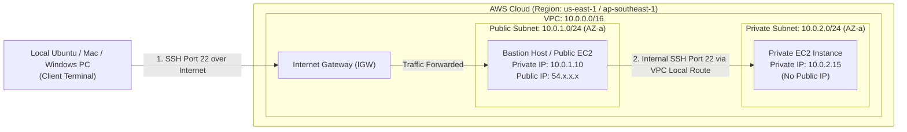
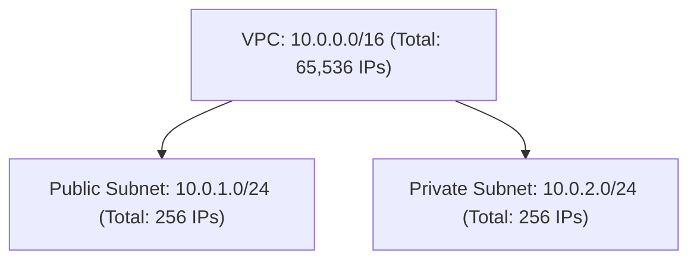
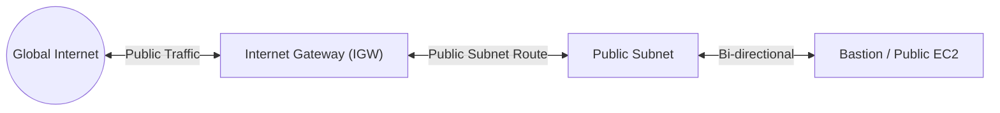
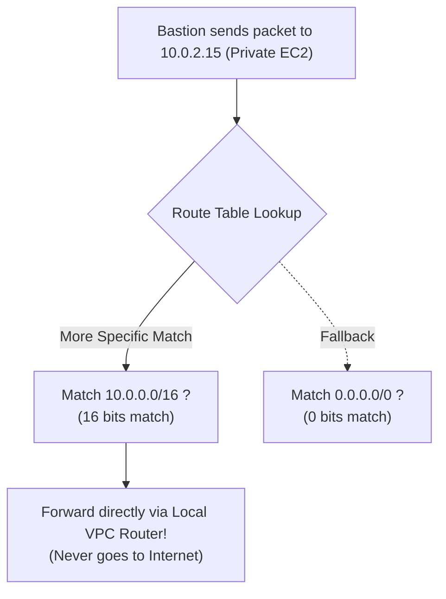
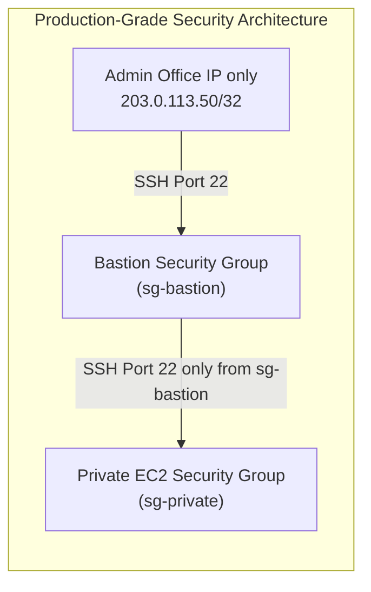
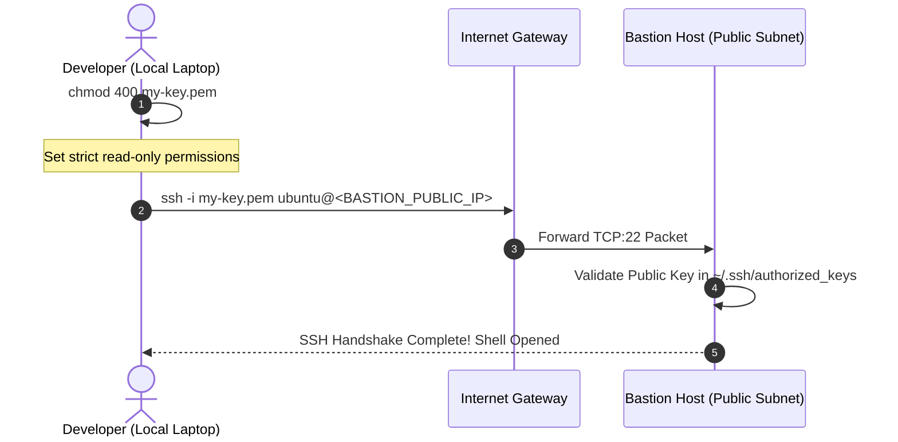
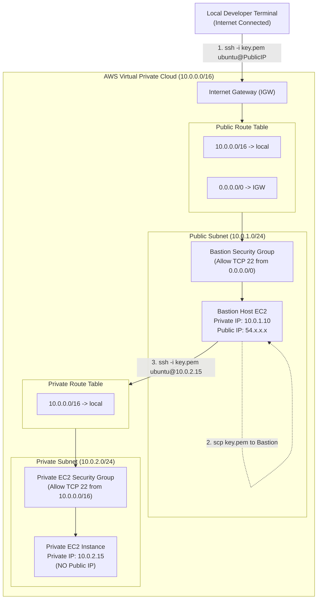

# AWS Basic Networking Lab

## 1. Introduction

ক্লাউড আর্কিটেকচার শেখার সবচেয়ে বড় এবং প্রথম মাইলফলক হলো **AWS Networking** আয়ত্ত করা। অধিকাংশ বিগিনার ক্লাউডে সার্ভার চালু করতে পারলেও বুঝতে পারে না ট্রাফিক কীভাবে চলাচল করে, কেন একটি সার্ভারে ইন্টারনেট পায় কিন্তু অন্যটিতে পায় না, কিংবা ডাটাবেজকে ইন্টারনেটের হাত থেকে গোপন রেখে কীভাবে নিরাপদ সংযোগ স্থাপন করতে হয়।

### What This Lab is About
এই ল্যাবে আমরা AWS-এ সম্পূর্ণ স্ক্র্যাচ থেকে একটি নিরাপদ ভার্চুয়াল নেটওয়ার্ক ডিজাইন করব। এখানে দুটি ভিন্ন সাবনেট থাকবে:
1. **Public Subnet**: যা ইন্টারনেটের সাথে সরাসরি যুক্ত থাকবে।
2. **Private Subnet**: যা ইন্টারনেট থেকে সম্পূর্ণ বিচ্ছিন্ন এবং সুরক্ষিত থাকবে।

### What We Are Going to Build
- একটি কাস্টম **VPC (Virtual Private Cloud)** যার CIDR রেঞ্জ `10.0.0.0/16`।
- একটি **Public Subnet** (`10.0.1.0/24`) যেখানে বসবে **Bastion Host (Public EC2)**।
- একটি **Private Subnet** (`10.0.2.0/24`) যেখানে বসবে ব্যাকএন্ড অ্যাপ্লিকেশন বা ডাটাবেজের প্রতিচ্ছবি হিসেবে **Private EC2**।
- একটি **Internet Gateway (IGW)** যা আমাদের Public Subnet-কে বৈশ্বিক ইন্টারনেটের সাথে যুক্ত করবে।
- দুটি আলাদা **Route Table** (একটি Public, একটি Private) যা নির্ধারণ করবে ট্রাফিক কোন দিক দিয়ে চলাচল করবে।
- **Security Groups** যা প্রতিটা সার্ভারের নিজস্ব ভার্চুয়াল ফায়ারওয়াল হিসেবে কাজ করবে।
- **Bastion Jump Host Workflow**: লোকাল কম্পিউটার থেকে প্রথমে Bastion-এ SSH করা এবং এরপর Bastion-এর ভেতর থেকে সম্পূর্ণ ইন্টারনাল নেটওয়ার্ক ব্যবহার করে Private EC2-তে SSH সেশন নেওয়া।

### Why This Architecture is Useful
বাস্তব প্রোডাকশন সিস্টেমে কোনো কোম্পানিই তাদের ডাটাবেজ বা কোর ব্যাকএন্ড API সার্ভারে সরাসরি পাবলিক আইপি (Public IP) দেয় না। পাবলিক আইপি দিলেই দুনিয়ার যেকোনো হ্যাকার বা বট পোর্ট স্ক্যান করে আক্রমণ চালাতে পারে। 

এই সমস্যার সমাধান হলো **Bastion Host (Jump Server)** আর্কিটেকচার। এখানে পুরো নেটওয়ার্কে ঢোকার জন্য একটি মাত্র সুরক্ষিত দরজা (Bastion Host) উন্মুক্ত থাকে, আর বাকি সব স্পর্শকাতর সার্ভার প্রাইভেট সাবনেটে নিরাপদে লুকিয়ে রাখা হয়।

---

## 2. Final Architecture

নিচে আমাদের ল্যাবের চূড়ান্ত আর্কিটেকচার ডায়াগ্রাম দেখানো হলো:



### Connection Explanation (সহজ ভাষায় প্রতিটি কানেকশন)
1. **Local PC → Bastion Host**: আপনার লোকাল কম্পিউটার ইন্টারনেটের মাধ্যমে ট্রাফিক পাঠায় Bastion-এর Public IP-তে। এই ট্রাফিকটি AWS-এর সীমানায় প্রবেশ করে **Internet Gateway (IGW)** হয়ে Public Subnet-এ থাকা Bastion EC2-তে পৌঁছায়।
2. **Bastion Host → Private EC2**: আপনি যখন Bastion-এর ভেতরে লগইন করে Private EC2-এর Private IP-তে SSH কমান্ড রান করেন, তখন এই ট্রাফিক **ইন্টারনেটে যায় না**। এটি VPC-এর ইন্টারনাল সফটওয়্যার রাউটার (`10.0.0.0/16 local`) দিয়ে সরাসরি Private Subnet-এ থাকা Private EC2-তে চলে যায়।

---

## 3. Architecture Philosophy

```
[Local Machine / Laptop]
          │
          │ (Internet + Public IP)
          ▼
   [Bastion Server]  (Public Subnet)
          │
          │ (Internal Network + Private IP)
          ▼
   [Private EC2]     (Private Subnet - No Internet Access)
```

এই আর্কিটেকচারের পেছনের মূল প্রকৌশল দর্শন (Engineering Philosophy) নিচে বিস্তারিত আলোচনা করা হলো:

- **লোকাল মেশিন কেন সরাসরি Private EC2-তে যেতে পারবে না?**
  Private EC2-এর কোনো Public IP নেই। ইন্টারনেটের রাউটারগুলো শুধু পাবলিক আইপি চিনতে পারে, RFC 1918 প্রাইভেট আইপি (যেমন `10.0.2.x`) ইন্টারনেটে রাউট হয় না। ফলে বিশ্বজগতের কোনো কম্পিউটার ইন্টারনেট দিয়ে সরাসরি প্রাইভেট সার্ভারে পৌঁছাতে পারে না। এটি আপনার ডাটাবেজ বা ব্যাকএন্ডকে ইন্টারনেটের সরাসরি সাইবার অ্যাটাক থেকে ১০০% নিরাপদ রাখে।

- **Bastion কেন পাবলিক?**
  সিস্টেম অ্যাডমিন বা ডেভেলপারদের সার্ভারে কাজ করার জন্য অন্তত একটি সুরক্ষিত প্রবেশের পথ দরকার। Bastion সার্ভারে পাবলিক আইপি দেওয়া থাকে যাতে বৈধ অ্যাডমিন ইন্টারনেটের মাধ্যমে এতে ঢুকতে পারেন। এটি ভবনের মূল নিরাপত্তারক্ষী (Security Guard)-এর মতো।

- **Private EC2-তে কেন পাবলিক আইপি নেই?**
  পাবলিক আইপি থাকা মানেই সার্ভারটি ইন্টারনেটে দৃশ্যমান (Exposed)। প্রাইভেট সার্ভারের দায়িত্ব হলো শুধু ইন্টারনাল রিকোয়েস্ট প্রসেস করা (যেমন ডাটাবেজ কোয়েরি)। তাই এতে পাবলিক আইপির কোনো প্রয়োজন নেই।

- **দুটি সার্ভার কীভাবে নিজেদের মধ্যে যোগাযোগ করে?**
  যেহেতু Bastion (`10.0.1.x`) এবং Private EC2 (`10.0.2.x`) একই VPC (`10.0.0.0/16`)-এর অন্তর্ভুক্ত, তাই AWS VPC-এর ডিফল্ট **Local Route** স্বয়ংক্রিয়ভাবে তাদের মধ্যে অভ্যন্তরীণ প্যাকেট আদান-প্রদান করতে দেয়।

- **Bastion থেকে Private EC2 কানেকশনে কি Internet Gateway ব্যবহৃত হয়?**
  **একদমই না!** ট্রাফিক ইন্টারনেটে যায় না এবং Internet Gateway-এর ধারেকাছেও যায় না। ট্রাফিকটি সম্পূর্ণ এডাব্লিউএস-এর ব্যাকবোন নেটওয়ার্কের ভেতরেই সীমাবদ্ধ থাকে।

---

## 4. AWS VPC (Virtual Private Cloud)

### What is a VPC?
**VPC (Virtual Private Cloud)** হলো AWS-এর গ্লোবাল ডেটাসেন্টারের ভেতরে আপনার সম্পূর্ণ নিজস্ব, বিচ্ছিন্ন (isolated) ভার্চুয়াল নেটওয়ার্ক। 

::: tip বাস্তব উপমা (Real-Life Analogy)
AWS হলো একটি বিশাল মহানগর। সেই মহানগরের ভেতরে আপনি একটি নির্দিষ্ট জমি কিনলেন এবং তার চারপাশে উঁচু সীমানা প্রাচীর দিয়ে দিলেন। এই সীমানা প্রাচীর ঘেরা নিজস্ব প্লটটিই হলো আপনার **VPC**। আপনার অনুমতি ও গেট ছাড়া বাইরের কেউ এই জমিতে পা রাখতে পারবে না।
:::

### CIDR Block — আইপি অ্যাড্রেসের হিসাব
VPC তৈরি করার সময় আমাদের একটি আইপি রেঞ্জ বলে দিতে হয়, যাকে বলা হয় **CIDR (Classless Inter-Domain Routing)** ব্লক।

আমাদের ল্যাবের VPC CIDR:
```text
10.0.0.0/16
```

#### `/16` এর অর্থ কী?
একটি IPv4 আইপি অ্যাড্রেসে মোট ৩২টি বিট (32 bits) থাকে।
- `/16` মানে প্রথম ১৬টি বিট নেটওয়ার্কের জন্য ফিক্সড (`10.0.x.x`)।
- বাকি $32 - 16 = 16$ টি বিট হোস্ট বা সার্ভারের আইপি তৈরির জন্য উন্মুক্ত।
- মোট আইপি সংখ্যা: $2^{16} = 65,536$ টি।



---

## 5. Subnets (Public vs Private)

VPC-কে ছোট ছোট ভাগে ভাগ করাকে বলা হয় **Subnet (Sub-Network)**। আপনার জমির ভেতরে বিভিন্ন রুম তৈরি করার মতো—যেমন ড্রয়িং রুম (পাবলিক) এবং বেডরুম (প্রাইভেট)।

```text
VPC: 10.0.0.0/16
 ├── Public Subnet:  10.0.1.0/24   (IP Range: 10.0.1.0 - 10.0.1.255)
 └── Private Subnet: 10.0.2.0/24   (IP Range: 10.0.2.0 - 10.0.2.255)
```

### Public Subnet (`10.0.1.0/24`)
- **কী এটি**: যে সাবনেটের সাথে ইন্টারনেটের সরাসরি যোগাযোগ থাকে।
- **কেন Bastion এখানে থাকে**: কারণ লোকাল ল্যাপটপ থেকে ইন্টারনেটের মাধ্যমে সংযোগ নেওয়ার জন্য সার্ভারটির একটি পাবলিক আইপি এবং ইন্টারনেট রুট প্রয়োজন।
- **Auto-assign Public IP**: এই সাবনেটে সার্ভার লঞ্চ করার সময় পাবলিক আইপি অন রাখতে হয়।

### Private Subnet (`10.0.2.0/24`)
- **কী এটি**: যে সাবনেটের কোনো সরাসরি ইন্টারনেট এক্সেস বা রুট নেই।
- **কেন Private EC2 এখানে থাকে**: যাতে বাইরের বিশ্ব থেকে সরাসরি কেউ সার্ভারটিকে দেখতে বা আক্রমণ করতে না পারে।
- **Auto-assign Public IP**: এখানে পাবলিক আইপি সম্পূর্ণ নিষ্ক্রিয় (Disabled) রাখা হয়।

### Public Subnet vs Private Subnet Comparison

| Feature | Public Subnet | Private Subnet |
| :--- | :--- | :--- |
| **Internet Facing** | হ্যাঁ (Directly Connected) | না (Completely Isolated) |
| **Route to IGW (`0.0.0.0/0`)** | হ্যাঁ (Route Table এ IGW Target থাকে) | না (IGW এর কোনো রুট থাকে না) |
| **Public IPv4 Address** | বরাদ্দ করা থাকে (Assigned) | কোনো পাবলিক আইপি থাকে না |
| **Typical Resources** | Bastion Host, Load Balancer (ALB), NAT Gateway | Backend Application Server, Database (RDS), Redis Cache |
| **Example in This Lab** | Bastion Host (`10.0.1.10`) | Private EC2 (`10.0.2.15`) |

::: danger অত্যন্ত গুরুত্বপূর্ণ কনসেপ্ট (Crucial Concept)
শুধু সাবনেটের নাম "Public" লিখে দিলেই একটি সাবনেট পাবলিক হয়ে যায় না! 
AWS-এ একটি সাবনেট তখনই **Public Subnet** হিসেবে গণ্য হয়, যখন তার সাথে সংযুক্ত **Route Table**-এ ইন্টারনেট ট্রাফিকের জন্য একটি **Internet Gateway (IGW)**-এর রুট ডিফাইন করা থাকে।
:::

### AWS Reserved IPs in Every Subnet
মনে রাখবেন, যেকোনো `/24` সাবনেটে মোট আইপি ২৫৬টি হলেও আপনি ২৫৬টি সার্ভার চালাতে পারবেন না। AWS প্রতি সাবনেট থেকে **৫টি আইপি সংরক্ষণ (Reserve)** করে রাখে:
1. `10.0.1.0` — **Network Address**
2. `10.0.1.1` — **VPC Router Address**
3. `10.0.1.2` — **Amazon DNS Server (Route 53 Resolver)**
4. `10.0.1.3` — **Future Use (AWS Reserved)**
5. `10.0.1.255` — **Network Broadcast Address** (AWS ব্রডকাস্ট সমর্থন না করলেও প্রথাগত নিয়মে রিজার্ভ রাখে)

সুতরাং ব্যবহারযোগ্য আইপি = $256 - 5 = 251$ টি।

---

## 6. Internet Gateway (IGW)

### What is an Internet Gateway?
**Internet Gateway (IGW)** হলো একটি অনুভূমিকভাবে স্কেলড, রিডান্ড্যান্ট এবং অত্যন্ত নির্ভরযোগ্য AWS ভিপিসি কম্পোনেন্ট, যা আপনার VPC এবং পাবলিক ইন্টারনেটের মধ্যে যোগাযোগের সেতু হিসেবে কাজ করে।



### Why Do We Need IGW?
1. এটি VPC-এর ভেতর থেকে বাইরের ইন্টারনেটে ট্রাফিক পাঠাতে এবং বাইরে থেকে ভেতরের পাবলিক সার্ভারে ট্রাফিক রিসিভ করতে দ্বিমুখী (bidirectional) সংযোগ দেয়।
2. এটি পাবলিক আইপি এবং প্রাইভেট আইপির মধ্যে **1:1 NAT (Network Address Translation)** সম্পাদন করে।

### The Default Route: `0.0.0.0/0 → Internet Gateway`
একটি পাবলিক সাবনেটের রাউট টেবিলে নিচের রুলটি বসানো বাধ্যতামূলক:
```text
Destination: 0.0.0.0/0    Target: igw-xxxxxxxx (Internet Gateway)
```

#### What does `0.0.0.0/0` mean?
কম্পিউটার নেটওয়ার্কিংয়ে `0.0.0.0/0` মানে হলো **Default Route** বা "জগতের যেকোনো আইপি অ্যাড্রেস"। 
সার্ভার যখন এমন কোনো আইপিতে প্যাকেট পাঠাতে চায় যা তার লোকাল ভিপিসির ভেতরে নেই (যেমন Google, GitHub বা আপনার বাসার ল্যাপটপ), তখন রাউটার এই রুল দেখে প্যাকেটটিকে সোজা Internet Gateway-এর দিকে পাঠিয়ে দেয়।

---

## 7. Route Table (The Traffic Road Map)

### What is a Route Table?
**Route Table** হলো একটি নেটওয়ার্কের ট্রাফিক রুট ম্যাপ (Traffic Road Map)। সাবনেটের ভেতরে থাকা যেকোনো সার্ভার যখন কোনো প্যাকেট পাঠায়, রাউটার প্রথমে এই টেবিলটি দেখে সিদ্ধান্ত নেয় প্যাকেটটি কোথায় পাঠানো হবে।

প্রতিটি রুটে দুটি জিনিস থাকে:
1. **Destination**: প্যাকেটটি কোথায় যেতে চায় (যেমন: কোনো নির্দিষ্ট আইপি বা সাবনেট রেঞ্জ)।
2. **Target**: প্যাকেটটিকে কার হাত দিয়ে পাঠাতে হবে (যেমন: `local` নাকি `igw`)।

### Public Route Table Configuration
আমাদের ল্যাবে Public Subnet-এর সাথে যুক্ত Route Table-এর কনফিগারেশন:

| Destination | Target | ব্যাখ্যা |
| :--- | :--- | :--- |
| `10.0.0.0/16` | `local` | VPC-এর ভেতরের যেকোনো আইপির জন্য প্যাকেট ভেতরেই থাকবে। |
| `0.0.0.0/0` | `igw-0123456789abcdef` | বাকি দুনিয়ার সমস্ত ট্রাফিক ইন্টারনেটে যাবে। |

### Private Route Table Configuration
Private Subnet-এর সাথে যুক্ত Route Table-এর কনফিগারেশন:

| Destination | Target | ব্যাখ্যা |
| :--- | :--- | :--- |
| `10.0.0.0/16` | `local` | শুধু VPC-এর ভেতরের ট্রাফিক চলাচল করতে পারবে। |

*(এখানে কোনো `0.0.0.0/0 → igw` নেই, তাই এটি সম্পূর্ণ প্রাইভেট।)*

### How Routing Lookup Works (Longest Prefix Match)
রাউটার যখন ট্রাফিক পায়, সে সবচেয়ে স্পেসিফিক রুলটি আগে মেনে চলে (Longest Prefix Match):



- যখন Bastion (`10.0.1.10`) ইন্টারনেটে (`8.8.8.8`) যেতে চায় → মিলে যায় `0.0.0.0/0` → ট্রাফিক যায় **Internet Gateway**-তে।
- যখন Bastion (`10.0.1.10`) Private EC2-তে (`10.0.2.15`) যেতে চায় → মিলে যায় `10.0.0.0/16` → ট্রাফিক যায় **Local VPC Router**-এ।

---

## 8. Security Group (Virtual Firewall)

### What is a Security Group?
**Security Group** হলো EC2 Instance লেভেলে কাজ করা একটি ভার্চুয়াল ফায়ারওয়াল (Virtual Firewall)। এটি ইনস্ট্যান্সে কোন ধরনের ট্রাফিক ঢুকতে পারবে (**Inbound**) এবং বের হতে পারবে (**Outbound**) তা নিয়ন্ত্রণ করে।

#### মূল বৈশিষ্ট্য:
1. **Stateful**: সিকিউরিটি গ্রুপ স্টেটফুল। অর্থাৎ, ইনবাউন্ড দিয়ে যদি কোনো ট্রাফিক আসার অনুমতি পায়, তার ফিরতি রেসপন্স স্বয়ংক্রিয়ভাবে আউটবাউন্ড দিয়ে বের হতে পারবে—আউটবাউন্ডে আলাদা করে কোনো রুল লিখতে হয় না।
2. **Default Behavior**: ডিফল্টভাবে সব ইনবাউন্ড ট্রাফিক ব্লক থাকে এবং সব আউটবাউন্ড ট্রাফিক এলাউ থাকে।

### Port 22 & SSH
- **Protocol**: TCP
- **Port**: 22
- **Purpose**: লিনাক্স সার্ভারে দূরবর্তী টার্মিনাল থেকে কমান্ড লাইনে লগইন করার স্ট্যান্ডার্ড এনক্রিপ্টেড প্রোটোকল হলো **SSH (Secure Shell)**।

---

### Lab Configuration (Source Lab)
আমাদের বর্তমান বেসিক ল্যাবে সহজভাবে শেখার জন্য নিচের রুল ব্যবহার করা হয়েছে:

#### Public EC2 (Bastion) Security Group
- **Inbound**:
  - Type: `SSH`
  - Protocol: `TCP`
  - Port Range: `22`
  - Source: `0.0.0.0/0` (Anywhere IPv4)
- **Outbound**:
  - Type: `All Traffic`
  - Destination: `0.0.0.0/0`

#### Private EC2 Security Group
- **Inbound**:
  - Type: `SSH`
  - Protocol: `TCP`
  - Port Range: `22`
  - Source: `0.0.0.0/0` (অথবা `10.0.0.0/16`)
- **Outbound**:
  - Type: `All Traffic`
  - Destination: `0.0.0.0/0`

---

### Production Security Improvement (অতিরিক্ত প্রফেশনাল জ্ঞান)
বাস্তব প্রোডাকশনে `0.0.0.0/0` থেকে SSH পোর্ট ওপেন রাখা একটি বড় ধরনের সিকিউরিটি ঝুঁকি (Critical Vulnerability)।



::: tip Production Hardening Rules
1. **Bastion Security Group**: SSH পোর্ট ২২ শুধুমাত্র আপনার নিজস্ব আইপিতে সীমাবদ্ধ রাখবেন (`My IP` যেমন: `203.0.113.50/32`)।
2. **Private EC2 Security Group**: Private EC2-তে কোনো আইপি রেঞ্জ দেবেন না! সোর্সে সরাসরি Bastion-এর Security Group ID রেফার করবেন (e.g., Source: `sg-0abc123bastion`)। এতে Bastion ছাড়া পৃথিবীর আর কোনো সার্ভার থেকে Private EC2-তে কানেক্ট হওয়া সম্ভব হবে না।
:::

---

## 9. EC2 (Elastic Compute Cloud)

**EC2 (Elastic Compute Cloud)** হলো AWS-এর ক্লাউড ভার্চুয়াল সার্ভার (Virtual Machine)। 

### Key Terminologies
- **AMI (Amazon Machine Image)**: সার্ভারের অপারেটিং সিস্টেম ও প্রি-ইনস্টল্ড সফটওয়্যারের টেমপ্লেট (যেমন: Ubuntu 22.04 LTS)।
- **Instance Type**: সার্ভারের হার্ডওয়্যার কনফিগারেশন—CPU ও RAM (যেমন: `t2.micro` - ১টি vCPU এবং ১ জিবি র‍্যাম, যা ফ্রি টিয়ারে পাওয়া যায়)।
- **Key Pair (`.pem`)**: সার্ভারে পাসওয়ার্ডবিহীন নিরাপদ ক্রিপ্টোগ্রাফিক অথেন্টিকেশনের জন্য ব্যবহৃত পাবলিক ও প্রাইভেট কি।
- **Public IP vs Private IP**: 
  - *Public IP*: ইন্টারনেটে রাউটেবল এবং পরিবর্তনশীল (স্টপ করে স্টার্ট করলে পরিবর্তন হয়)।
  - *Private IP*: VPC-এর ভেতরে স্থায়ী এবং শুধু ইন্টারনাল যোগাযোগের জন্য বরাদ্দ।

### Instances Comparison in This Lab

| কনফিগারেশন প্যারামিটার | Bastion Host (EC2-1) | Private Instance (EC2-2) |
| :--- | :--- | :--- |
| **Instance Name** | `bastion-host` / `public-ec2` | `private-backend-ec2` |
| **Subnet Placement** | Public Subnet (`10.0.1.0/24`) | Private Subnet (`10.0.2.0/24`) |
| **Auto-assign Public IP** | **Enabled** (e.g., `54.210.x.x`) | **Disabled** (No Public IP) |
| **Private IP Range** | `10.0.1.x` (e.g., `10.0.1.10`) | `10.0.2.x` (e.g., `10.0.2.15`) |
| **Security Group** | Bastion-SG (Port 22 from Internet) | Private-SG (Port 22 from Bastion/VPC) |
| **Key Pair** | `my-aws-key.pem` | `my-aws-key.pem` |

---

## 10. Bastion Server (Jump Host)

### What is a Bastion Server?
অনেকে মনে করেন Bastion Server বুঝি AWS-এর আলাদা কোনো সার্ভিস বা প্রোডাক্ট। 
**না! Bastion Server কোনো বিশেষ সার্ভিস নয়।** এটি সাধারণ একটি সাধারণ EC2 লিনাক্স সার্ভার, যা পাবলিক সাবনেটে স্থাপন করা হয় এবং ইন্টারনাল প্রাইভেট সার্ভারে ঢোকার জন্য একটি "সুরক্ষিত প্রবেশদ্বার" (Jump Host বা Gateway) হিসেবে ব্যবহৃত হয়।

```text
[ Developer Laptop ] 
         │
         │  Step 1: Jump into Bastion
         ▼
[ Bastion Jump Host ]
         │
         │  Step 2: Jump into Private Server
         ▼
[ Private Database / EC2 ]
```

### কেন একে Jump Server বলা হয়?
কারণ আপনি সরাসরি প্রাইভেট সার্ভারে লাফ দিতে পারেন না। প্রথমে লোকাল ল্যাপটপ থেকে জাম্প করে Bastion-এ বসেন, তারপর Bastion থেকে জাম্প করে প্রাইভেট সার্ভারে প্রবেশ করেন।

---

## 11. SSH (Secure Shell) — গভীর থেকে বিশ্লেষণ

SSH হলো একটি ক্রিপ্টোগ্রাফিক নেটওয়ার্ক প্রোটোকল যা আনসিকিউরড নেটওয়ার্কের ওপর দিয়ে দুটি কম্পিউটারের মধ্যে সম্পূর্ণ এনক্রিপ্টেড কমিউনিকেশন চ্যানেল তৈরি করে।

### কমান্ড ডিকনস্ট্রাকশন (Command Breakdown)
```bash
ssh -i key.pem ubuntu@54.210.45.12
```

আসুন কমান্ডটির প্রতিটি অংশ পুঙ্খানুপুঙ্খ বুঝি:
- `ssh`: লিনাক্সের Secure Shell ক্লায়েন্ট প্রোগ্রাম চালু করার কমান্ড।
- `-i`: Identity File ফ্ল্যাগ। এটি SSH-কে নির্দেশ দেয় এর ঠিক পরেই প্রাইভেট কি ফাইলের পাথ দেওয়া আছে।
- `key.pem`: আপনার AWS অ্যাকাউন্ট থেকে ডাউনলোড করা প্রাইভেট কি ফাইল। এটি মূলত ডিজিটাল চাবি।
- `ubuntu`: আপনি যে ইউজার হিসেবে সার্ভারে লগইন করছেন (Ubuntu AMI-এর ডিফল্ট ইউজার হলো `ubuntu`, Amazon Linux হলে হতো `ec2-user`)।
- `@`: সেপারেটর বা সংযোগকারী প্রতীক (User এবং Server Address-এর মাঝে বসে)।
- `54.210.45.12`: টার্গেট সার্ভারের আইপি অ্যাড্রেস। লোকাল থেকে কানেক্ট করার সময় এটি **Public IP**, কিন্তু ইন্টারনাল কানেকশনে এটি **Private IP**।

---

## 12. SSH Flow — Local → Bastion

লোকাল মেশিন থেকে পাবলিক Bastion সার্ভারে প্রবেশের ধাপ:



### Step 1: পারমিশন ফিক্স করা
```bash
chmod 400 my-key.pem
```
**Why?** লিনাক্স SSH ক্লায়েন্ট অত্যন্ত সংবেদনশীল। যদি কি ফাইলের পারমিশন বেশি উন্মুক্ত থাকে (যেমন অন্য ইউজাররা পড়তে পারে), তবে SSH ক্লায়েন্ট `Permissions are too open` বলে এরর ছুড়ে মারবে এবং কানেকশন রিজেক্ট করবে। `400` মানে হলো শুধুমাত্র ফাইলটির মালিক (Owner) ফাইলটি পড়তে (Read-only) পারবে, লিখতে বা এক্সিকিউট করতে পারবে না।

### Step 2: Bastion-এ SSH করা
```bash
ssh -i my-key.pem ubuntu@<BASTION_PUBLIC_IP>
```
**Why Public IP?** আপনার ল্যাপটপ এবং AWS-এর VPC সম্পূর্ণ ভিন্ন নেটওয়ার্কে অবস্থিত। বৈশ্বিক ইন্টারনেটের মধ্য দিয়ে ডাটা পাঠাতে হলে টার্গেট কম্পিউটারের একটি ইউনিক **Public IP** থাকতেই হবে।

---

## 13. SCP — Copy Key to Bastion

### What is SCP?
**SCP (Secure Copy Protocol)** হলো SSH প্রোটোকলের ওপর ভিত্তি করে তৈরি ফাইল ট্রান্সফার মেকানিজম। এটি নেটওয়ার্কের মধ্য দিয়ে নিরাপদে এক কম্পিউটার থেকে অন্য কম্পিউটারে ফাইল কপি করতে ব্যবহৃত হয়।

### কমান্ড ডিকনস্ট্রাকশন (Command Breakdown)
```bash
scp -i /path/to/my-key.pem /path/to/my-key.pem ubuntu@<BASTION_PUBLIC_IP>:~/.ssh/
```

- `-i /path/to/my-key.pem`: Bastion সার্ভারে অথেন্টিকেশন করার জন্য আপনার লোকাল কি ফাইল।
- `/path/to/my-key.pem`: যে ফাইলটি আপনি পাঠাতে চাচ্ছেন (Source Payload)।
- `ubuntu@<BASTION_PUBLIC_IP>`: রিমোট Bastion সার্ভারের লগইন পরিচয়।
- `:~/.ssh/`: Bastion সার্ভারের কোন ফোল্ডারে ফাইলটি জমা হবে (Destination Path)।

### এই ল্যাবে কি কেন Bastion-এ কপি করা হচ্ছে?
Bastion থেকে যখন আপনি Private EC2-তে SSH করতে যাবেন, তখন Private EC2 আপনার কাছে চাবি (Private Key) চাইবে। যেহেতু আপনি Bastion-এর ভেতর বসে কমান্ড দিচ্ছেন, তাই Bastion-এর হার্ডডিস্কে চাবিটি উপস্থিত থাকা আবশ্যক।

::: warning Security Alert — Production Alternative
বাস্তব প্রোডাকশনে Bastion সার্ভারে সরাসরি প্রাইভেট কি ফাইল সংরক্ষণ করা অনুচিত (কারণ Bastion হ্যাক হলে আপনার ইন্টারনাল চাবি ফাঁস হয়ে যাবে)। প্রোডাকশনে এর বদলে **SSH Agent Forwarding (`ssh -A`)** ব্যবহার করা হয়, যাতে চাবি লোকাল ল্যাপটপেই থাকে কিন্তু Bastion হয়ে প্রাইভেট সার্ভারে অথেন্টিকেট করা যায়।
:::

---

## 14. Bastion → Private EC2 (The Crucial Leap)

এটি পুরো ল্যাবের সবচেয়ে গুরুত্বপূর্ণ অংশ। অনেক বিগিনার মনে করেন দ্বিতীয় SSH কমান্ডটিও ল্যাপটপের আরেকটি উইন্ডোতে রান করতে হয়। **তা নয়!**

```
Local Laptop Terminal
     │
     │ ssh -i my-key.pem ubuntu@BASTION_PUBLIC_IP
     ▼
[ Logged inside Bastion Terminal ]  ubuntu@ip-10-0-1-10:~$
     │
     │ 1. chmod 400 ~/.ssh/my-key.pem
     │ 2. ssh -i ~/.ssh/my-key.pem ubuntu@10.0.2.15 (Private IP)
     ▼
[ Logged inside Private EC2 Terminal ] ubuntu@ip-10-0-2-15:~$
```

### ধাপে ধাপে নির্দেশনা:
1. **আপনি এখন Bastion সার্ভারের ভেতরে অবস্থান করছেন**: আপনার টার্মিনাল প্রম্পট দেখাবে `ubuntu@ip-10-0-1-x:~$`।
2. **কপি করা কি ফাইলের পারমিশন ঠিক করুন**:
   ```bash
   chmod 400 ~/.ssh/my-key.pem
   ```
3. **Private EC2-এর Private IP-তে SSH করুন**:
   ```bash
   ssh -i ~/.ssh/my-key.pem ubuntu@<PRIVATE_EC2_PRIVATE_IP>
   ```
4. **সফল সংযোগ**: আপনার প্রম্পট পরিবর্তিত হয়ে যাবে `ubuntu@ip-10-0-2-x:~$`! আপনি এখন ইন্টারনেটের হাত থেকে সম্পূর্ণ নিরাপদ ব্যাকএন্ড সার্ভারের ভেতর অবস্থান করছেন!

---

## 15. How Public → Private Connection Actually Works

প্যাকেট লেভেলে এই অভ্যন্তরীণ যোগাযোগ কীভাবে কাজ করে তা বোঝা একজন ক্লাউড ইঞ্জিনিয়ারের জন্য অপরিহার্য:

```text
[ Bastion Host ]                                          [ Private EC2 ]
IP: 10.0.1.10                                             IP: 10.0.2.15
      │                                                         ▲
      │ Packet: Source: 10.0.1.10 | Dest: 10.0.2.15:22          │
      ▼                                                         │
[ VPC Software-Defined Router ]                                 │
      │                                                         │
      ├─ Destination 10.0.2.15 matches "10.0.0.0/16 local"      │
      └─ Route internally through AWS Nitro Hypervisor Fabric ──┘
         (Direct Physical Host-to-Host Tunnel inside Datacenter)
```

### এটি কীভাবে কাজ করে?
1. Bastion (`10.0.1.10`) একটি TCP SYN প্যাকেট তৈরি করে যার গন্তব্য `10.0.2.15:22`।
2. সাবনেটের ভার্চুয়াল রাউটার প্যাকেটের গন্তব্য আইপি চেক করে।
3. রাউটার দেখে আইপিটি `10.0.0.0/16` রেঞ্জের মধ্যে পড়েছে, যার টার্গেট হলো `local`।
4. এডাব্লিউএস-এর নিজস্ব হাইপারভাইজার নেটওয়ার্ক দিয়ে প্যাকেটটি সরাসরি Private EC2-এর ভার্চুয়াল নেটওয়ার্ক ইন্টারফেসে (ENI) পৌঁছে যায়।

### যা কখনো ঘটে না:
$$\text{Bastion} \not\to \text{Internet Gateway} \not\to \text{Internet} \not\to \text{Private EC2}$$
ট্রাফিক কখনোই ইন্টারনেট বা ইন্টারনেট গেটওয়েতে যায় না। এটি সম্পূর্ণভাবে এডাব্লিউএসের ইন্টারনাল অপটিক্যাল ফাইবার নেটওয়ার্কের মধ্য দিয়ে পরিবাহিত হয়।

---

## 16. End-to-End Traffic Flow Architecture

নিচে পুরো ল্যাবের এন্ড-টু-এন্ড পূর্ণাঙ্গ ফ্লো চার্ট দেওয়া হলো:



---

## 17. Step-by-Step AWS Console Lab

এখন আমরা এডাব্লিউএস কনসোলে লগইন করে প্রতিটি রিসোর্স নিজ হাতে তৈরি করব:

### Step 1: Create Custom VPC
1. AWS Management Console-এ সার্চবারে লিখুন **VPC** এবং VPC ড্যাশবোর্ডে প্রবেশ করুন।
2. **Create VPC** বাটনে ক্লিক করুন।
3. সেটিংস কনফিগার করুন:
   - **Resources to create**: `VPC only` সিলেক্ট করুন (আমরা প্রতিটি উপাদান স্ক্র্যাচ থেকে আলাদা বানাব যাতে মেকানিজম শেখা যায়)।
   - **Name tag**: `my-custom-vpc`
   - **IPv4 CIDR block**: `IPv4 CIDR manual input` সিলেক্ট করুন।
   - **IPv4 CIDR**: `10.0.0.0/16`
   - **Tenancy**: `Default`
4. **Create VPC** বাটনে ক্লিক করুন।

### Step 2: Create Public Subnet
1. বাম পাশের মেন্যু থেকে **Subnets** এ ক্লিক করুন → **Create subnet**।
2. **VPC ID**: ড্রপডাউন থেকে আপনার তৈরি করা `my-custom-vpc` সিলেক্ট করুন।
3. সেটিংস:
   - **Subnet name**: `public-subnet-1`
   - **Availability Zone**: আপনার অঞ্চলের যেকোনো একটি জোন সিলেক্ট করুন (যেমন `us-east-1a`)।
   - **IPv4 subnet CIDR block**: `10.0.1.0/24`
4. **Create subnet** ক্লিক করুন।

### Step 3: Enable Auto-assign Public IP on Public Subnet
1. সাবনেট লিস্ট থেকে `public-subnet-1` সিলেক্ট করুন।
2. উপরে ডানদিকের **Actions** ড্রপডাউন থেকে **Edit subnet settings** এ ক্লিক করুন।
3. **Auto-assign IP settings** এর অধীনে **Enable auto-assign public IPv4 address** টিক দিয়ে দিন।
4. **Save** ক্লিক করুন।

### Step 4: Create Private Subnet
1. পুনরায় **Subnets** পেজে গিয়ে **Create subnet** ক্লিক করুন।
2. **VPC ID**: `my-custom-vpc` সিলেক্ট করুন।
3. সেটিংস:
   - **Subnet name**: `private-subnet-1`
   - **Availability Zone**: Public Subnet যে জোনে নিয়েছেন ঠিক সেই একই জোনে নিন (যেমন `us-east-1a`)।
   - **IPv4 subnet CIDR block**: `10.0.2.0/24`
4. **Create subnet** ক্লিক করুন। *(এটিতে Auto-assign public IP বন্ধই থাকবে।)*

### Step 5: Create Internet Gateway (IGW)
1. বাম পাশের মেন্যু থেকে **Internet Gateways** এ যান → **Create internet gateway**।
2. **Name tag**: `my-lab-igw`
3. **Create internet gateway** বাটনে ক্লিক করুন।

### Step 6: Attach Internet Gateway to VPC
1. তৈরি হওয়া `my-lab-igw` পেজে উপরে ডানদিকের **Actions** এ ক্লিক করুন।
2. **Attach to VPC** সিলেক্ট করুন।
3. **Available VPCs** থেকে আপনার `my-custom-vpc` বেছে নিয়ে **Attach internet gateway** বাটনে ক্লিক করুন।

### Step 7: Create Public Route Table
1. বাম পাশের মেন্যু থেকে **Route tables** এ ক্লিক করুন → **Create route table**।
2. **Name**: `public-route-table`
3. **VPC**: `my-custom-vpc` সিলেক্ট করুন।
4. **Create route table** ক্লিক করুন।

### Step 8: Add Internet Route to Public Route Table
1. তৈরি হওয়া `public-route-table` পেজে নিচে **Routes** ট্যাবে যান এবং **Edit routes** বাটনে ক্লিক করুন।
2. **Add route** ক্লিক করুন:
   - **Destination**: `0.0.0.0/0`
   - **Target**: `Internet Gateway` সিলেক্ট করে আপনার `my-lab-igw` বেছে নিন।
3. **Save changes** ক্লিক করুন।

### Step 9: Associate Public Route Table with Public Subnet
1. একই পেজে **Subnet associations** ট্যাবে যান → **Edit subnet associations**।
2. লিস্ট থেকে `public-subnet-1` সিলেক্ট করুন।
3. **Save associations** ক্লিক করুন। *(এখন আমাদের পাবলিক সাবনেট সম্পূর্ণ সক্রিয়!)*

### Step 10: Create Private Route Table & Associate
1. পুনরায় **Route tables** এ গিয়ে **Create route table** ক্লিক করুন।
2. **Name**: `private-route-table`
3. **VPC**: `my-custom-vpc` সিলেক্ট করে **Create** করুন।
4. **Subnet associations** ট্যাবে গিয়ে **Edit subnet associations** ক্লিক করে `private-subnet-1` সিলেক্ট করে **Save** করুন।
*(মনে রাখবেন: এই টেবিলে কোনো IGW রুট যোগ করবেন না!)*

### Step 11: Create Security Groups
1. বাম পাশের মেন্যু থেকে **Security Groups** এ যান → **Create security group**।
2. **Bastion Security Group**:
   - **Security group name**: `bastion-sg`
   - **Description**: `Allow SSH from anywhere`
   - **VPC**: `my-custom-vpc`
   - **Inbound rules**:
     - Type: `SSH` | Protocol: `TCP` | Port: `22` | Source: `Anywhere-IPv4` (`0.0.0.0/0`)
   - **Create security group** ক্লিক করুন।
3. **Private EC2 Security Group**:
   - **Security group name**: `private-ec2-sg`
   - **Description**: `Allow SSH from VPC`
   - **VPC**: `my-custom-vpc`
   - **Inbound rules**:
     - Type: `SSH` | Protocol: `TCP` | Port: `22` | Source: `Custom` (`10.0.0.0/16`)
   - **Create security group** ক্লিক করুন।

### Step 12: Launch Bastion / Public EC2
1. সার্চবারে **EC2** লিখে EC2 কনসোলে যান → **Launch instance** ক্লিক করুন।
2. **Name**: `bastion-host`
3. **Application and OS Images**: `Ubuntu 22.04 LTS` (Free tier eligible)
4. **Instance type**: `t2.micro`
5. **Key pair (login)**: আপনার থাকা একটি কি-পেয়ার সিলেক্ট করুন অথবা **Create new key pair** দিয়ে `my-aws-key.pem` ডাউনলোড করুন।
6. **Network settings** এ গিয়ে **Edit** ক্লিক করুন:
   - **VPC**: `my-custom-vpc`
   - **Subnet**: `public-subnet-1`
   - **Auto-assign public IP**: `Enable`
   - **Firewall (security groups)**: `Select existing security group` সিলেক্ট করে `bastion-sg` বেছে নিন।
7. **Launch instance** ক্লিক করুন।

### Step 13: Launch Private EC2
1. পুনরায় **Launch instance** ক্লিক করুন।
2. **Name**: `private-ec2`
3. **OS**: `Ubuntu 22.04 LTS` | **Type**: `t2.micro`
4. **Key pair**: একই `my-aws-key.pem` সিলেক্ট করুন।
5. **Network settings** এ **Edit** ক্লিক করুন:
   - **VPC**: `my-custom-vpc`
   - **Subnet**: `private-subnet-1`
   - **Auto-assign public IP**: `Disable`
   - **Firewall**: `Select existing security group` সিলেক্ট করে `private-ec2-sg` বেছে নিন।
6. **Launch instance** ক্লিক করুন।

---

## 18. Command Cheat Sheet

আপনার লোকাল টার্মিনাল এবং সার্ভারে চালানোর জন্য সব প্রয়োজনীয় কমান্ড নিচে এক নজরে দেওয়া হলো:

```bash
# ==========================================
# 1. LOCAL MACHINE TERMINAL COMMANDS
# ==========================================

# প্রাইভেট কি ফাইলের পারমিশন শুধু ওনারের পড়ার জন্য সীমাবদ্ধ করা
chmod 400 my-aws-key.pem

# পাবলিক Bastion সার্ভারে SSH এর মাধ্যমে প্রবেশ করা
ssh -i my-aws-key.pem ubuntu@<BASTION_PUBLIC_IP>

# লোকাল থেকে কি ফাইলটি Bastion সার্ভারের .ssh ফোল্ডারে কপি করে পাঠানো
scp -i my-aws-key.pem my-aws-key.pem ubuntu@<BASTION_PUBLIC_IP>:~/.ssh/


# ==========================================
# 2. INSIDE BASTION SERVER COMMANDS
# ==========================================

# Bastion সার্ভারের ভেতর কপি করা কি ফাইলের রিড পারমিশন সেট করা
chmod 400 ~/.ssh/my-aws-key.pem

# Bastion এর ভেতর থেকে Private EC2 এর প্রাইভেট আইপিতে লগইন করা
ssh -i ~/.ssh/my-aws-key.pem ubuntu@<PRIVATE_EC2_PRIVATE_IP>

# Private EC2 এর ভেতর ইন্টারনাল আইপি ভেরিফাই করা
hostname -I
```

---

## 19. Common Errors & Troubleshooting

ল্যাব করার সময় সচরাচর যে সমস্যাগুলো হয় এবং তার সমাধান:

### 1. Permission denied (publickey)
```text
Load key "my-aws-key.pem": Permission denied
ubuntu@54.x.x.x: Permission denied (publickey).
```
- **কারণ ১ (ভুল ইউজার)**: Ubuntu ইমেজের ডিফল্ট ইউজার `ubuntu`। আপনি যদি ভুল করে `root` বা `ec2-user` দিয়ে থাকেন তবে এই এরর আসবে।
- **কারণ ২ (ভুল কি)**: ইনস্ট্যান্স লঞ্চ করার সময় যে কি-পেয়ার সিলেক্ট করেছিলেন, কানেক্ট করার সময় অন্য কি-ফাইল ব্যবহার করছেন।
- **কারণ ৩ (পারমিশন)**: কি-ফাইলে `chmod 400` করা নেই।

### 2. Connection timed out
```text
ssh: connect to host 54.x.x.x port 22: Connection timed out
```
- **কারণ ১ (Security Group)**: Bastion-এর Security Group-এ পোর্ট 22 ইনবাউন্ডে এলাউ করা নেই।
- **কারণ ২ (Internet Gateway)**: VPC-এর সাথে IGW অ্যাটাচ করা হয়নি অথবা Route Table-এ `0.0.0.0/0 → igw` রুল নেই।
- **কারণ ৩ (Public IP)**: আপনি হয়তো পাবলিক আইপির বদলে ভুল করে প্রাইভেট আইপিতে আপনার লোকাল মেশিন থেকে পিং দিচ্ছেন।

### 3. Private EC2 cannot be reached from Bastion
```text
ssh: connect to host 10.0.2.15 port 22: Connection timed out
```
- **কারণ ১ (Security Group)**: Private EC2-এর Security Group-এ Bastion-এর আইপি রেঞ্জ (`10.0.1.0/24`) অথবা VPC রেঞ্জ (`10.0.0.0/16`) এলাউ করা নেই।
- **কারণ ২ (ভিন্ন VPC)**: নিশ্চিত করুন দুটি সার্ভারই একই VPC-এর ভেতরে লঞ্চ হয়েছে।

---

## 20. Security Best Practices (Production Improvements)

ল্যাব শেষ করার পর প্রোডাকশন আর্কিটেকচারের জন্য নিচের বিষয়গুলো জেনে রাখা আবশ্যক:

1. **কখনোই `0.0.0.0/0` এর জন্য SSH পোর্ট খোলা রাখবেন না**: প্রোডাকশনে সর্বদা আপনার নির্দিষ্ট অফিস বা হোম আইপি রেঞ্জ (`/32`) ব্যবহার করুন।
2. **Security Group Chaining ব্যবহার করুন**: Private EC2-এর ফায়ারওয়ালে কোনো আইপি না দিয়ে সোর্স হিসেবে Bastion-এর Security Group ID দিন।
3. **Bastion-এ Private Key স্টোর করবেন না**:
   - প্রোডাকশনে **SSH Agent Forwarding** ব্যবহার করুন:
     ```bash
     ssh-add my-aws-key.pem
     ssh -A ubuntu@<BASTION_PUBLIC_IP>
     # এরপর Bastion থেকে সরাসরি প্রাইভেট কি ছাড়াই Private EC2 তে যাওয়া যায়
     ssh ubuntu@<PRIVATE_EC2_PRIVATE_IP>
     ```
4. **AWS Systems Manager (SSM) Session Manager ব্যবহার করুন**:
   আধুনিক ক্লাউড আর্কিটেকচারে Bastion সার্ভারও ধীরে ধীরে বিলুপ্ত হচ্ছে। **AWS Systems Manager (SSM)** ব্যবহার করলে কোনো পাবলিক আইপি বা পোর্ট ২২ ছাড়াই সরাসরি ব্রাউজার বা AWS CLI দিয়ে সম্পূর্ণ প্রাইভেট সাবনেটে থাকা EC2-তে সিকিউর শেল নেওয়া যায়।

---

## 21. Common Confusions (বিভ্রান্তি ও সঠিক ধারণা)

| প্রচলিত ভুল ধারণা (Confusion) | সঠিক প্রযুক্তিগত বাস্তবতা (Correct Reality) |
| :--- | :--- |
| Bastion হলো AWS-এর আলাদা কোনো সার্ভিস। | **ভুল।** Bastion হলো সাধারণ একটি EC2 ইনস্ট্যান্স, যা জাম্প সার্ভার হিসেবে কনফিগার করা হয়। |
| সাবনেটের নাম "Public" দিলেই তাতে স্বয়ংক্রিয়ভাবে ইন্টারনেট পায়। | **ভুল।** সাবনেটের সাথে যুক্ত Route Table-এ `0.0.0.0/0 → IGW` কনফিগারেশন থাকলে তবেই তা পাবলিক হয়। |
| Private EC2 পাবলিক সাবনেটের সার্ভারের সাথে যোগাযোগ করতে পারে না। | **ভুল।** একই VPC-এর মধ্যে থাকায় ডিফল্ট `local` রুটের কারণে তারা নিজেদের মধ্যে সম্পূর্ণ যোগাযোগ করতে পারে। |
| VPC-এর ভেতরের সমস্ত ট্রাফিকের জন্যই Internet Gateway দরকার হয়। | **ভুল।** IGW শুধু ইন্টারনেটে যাওয়ার জন্য দরকার। ইন্টারনাল ট্রাফিকের জন্য IGW-এর কোনো ভূমিকা নেই। |
| সাবনেট আলাদা হলে প্রাইভেট আইপি দিয়ে একে অপরকে পাওয়া যায় না। | **ভুল।** একই VPC-এর ভেতর যেকোনো সাবনেটের প্রাইভেট আইপি একে অপরের সাথে রাউটেবল। |
| Bastion থেকে Private EC2-তে SSH কমান্ডটি লোকাল ল্যাপটপ থেকে দেওয়া হয়। | **ভুল।** প্রথম কমান্ডে Bastion-এ ঢোকার পর, দ্বিতীয় কমান্ডটি Bastion-এর কনসোলের ভেতর থেকে রান করা হয়। |

---

## 22. Exam / Interview Questions & Answers

#### Q1: What makes a subnet public or private in AWS VPC?
**Answer**: একটি সাবনেটের নিজস্ব কোনো পাবলিক বা প্রাইভেট আইডেন্টিটি নেই। সাবনেটের সাথে যে Route Table যুক্ত থাকে, তাতে যদি Internet Gateway-এর দিকে কোনো রুট (`0.0.0.0/0 → IGW`) থাকে, তবে সেটি **Public Subnet**। আর যদি IGW-এর কোনো রুট না থাকে, তবে সেটি **Private Subnet**।

#### Q2: What does `0.0.0.0/0` represent in a Route Table?
**Answer**: `0.0.0.0/0` হলো ডিফল্ট রুট (Default Route)। এটি ইন্টারনেটের যেকোনো আইপি অ্যাড্রেসকে রিপ্রেজেন্ট করে। রাউটার যখন কোনো রুটের স্পেসিফিক ম্যাচ পায় না, তখন ট্রাফিক এই ডিফল্ট গেটওয়ে দিয়ে বাইরে পাঠিয়ে দেয়।

#### Q3: Does Bastion to Private EC2 traffic go through the Internet Gateway?
**Answer**: না। এই ট্রাফিক কখনো ইন্টারনেটে বা ইন্টারনেট গেটওয়েতে যায় না। এটি VPC-এর ইন্টারনাল `local` রুটের মাধ্যমে এডাব্লিউএসের ব্যাকবোন নেটওয়ার্ক দিয়ে সরাসরি যায়।

#### Q4: Why do we use `chmod 400` on the PEM key?
**Answer**: লিনাক্স SSH ক্লায়েন্টের সিকিউরিটি রুল অনুযায়ী প্রাইভেট কি ফাইলে শুধুমাত্র ফাইলের মালিকের (Owner) পড়ার অধিকার থাকতে হবে। অতিরিক্ত উন্মুক্ত পারমিশন থাকলে SSH ক্লায়েন্ট কানেকশন রিজেক্ট করে।

#### Q5: How should you securely allow SSH to a Private EC2 in a production environment?
**Answer**: Private EC2-এর Security Group-এর ইনবাউন্ড রুলে পোর্ট ২২ এর জন্য কোনো IP CIDR না দিয়ে সরাসরি Bastion Host-এর Security Group ID সোর্স হিসেবে ব্যবহার করতে হবে।

---

## 23. Final Revision (5-Minute Quick Recap)

```text
       VPC (10.0.0.0/16)
              │
    ┌─────────┴─────────┐
    ▼                   ▼
Public Subnet       Private Subnet
(10.0.1.0/24)       (10.0.2.0/24)
    │                   │
    ├─ IGW Attached     └─ No IGW Route
    ├─ Public IP On     └─ No Public IP
    ▼                   ▼
Bastion Host        Private EC2
    │                   ▲
    │   Internal SSH    │
    └─── (Port 22) ─────┘
      via 10.0.0.0/16 local
```

### ৫ মিনিটে পুরো ল্যাবের সারসংক্ষেপ:
1. **VPC** হলো ক্লাউডের ভেতরে আপনার নিজস্ব নিরাপদ বাউন্ডারি (`10.0.0.0/16`)।
2. **Subnet** হলো VPC-কে ছোট ছোট ব্লকে ভাগ করা (`/24`)।
3. **Internet Gateway (IGW)** ভিপিসিকে ইন্টারনেটের সাথে যুক্ত করে।
4. **Route Table** নির্ধারণ করে প্যাকেট কোথায় যাবে (`0.0.0.0/0 → IGW` মানে পাবলিক, শুধুই `10.0.0.0/16 → local` মানে প্রাইভেট)।
5. **Security Group** হলো প্রতি ইনস্ট্যান্সের নিজস্ব ভার্চুয়াল ফায়ারওয়াল (Stateful)।
6. **Bastion Host** হলো পাবলিক সাবনেটে থাকা একটি জাম্প সার্ভার যার মাধ্যমে সুরক্ষিতভাবে প্রাইভেট সার্ভারে ঢোকা হয়।
7. **SSH** হলো পোর্ট ২২ দিয়ে লিনাক্স টার্মিনালে এনক্রিপ্টেড সংযোগ।
8. **SCP** দিয়ে লোকাল কম্পিউটার থেকে Bastion-এ চাবি কপি করা হয়।
9. Bastion থেকে Private EC2-তে কানেকশন সম্পূর্ণ **অভ্যন্তরীণ নেটওয়ার্কে (Local VPC Routing)** ঘটে, এতে কোনো ইন্টারনেটের প্রয়োজন নেই।
