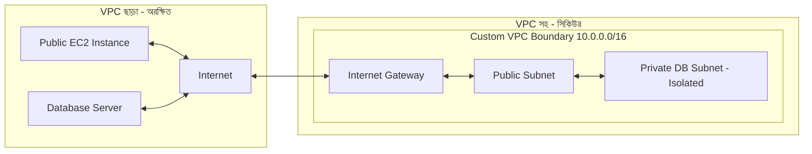
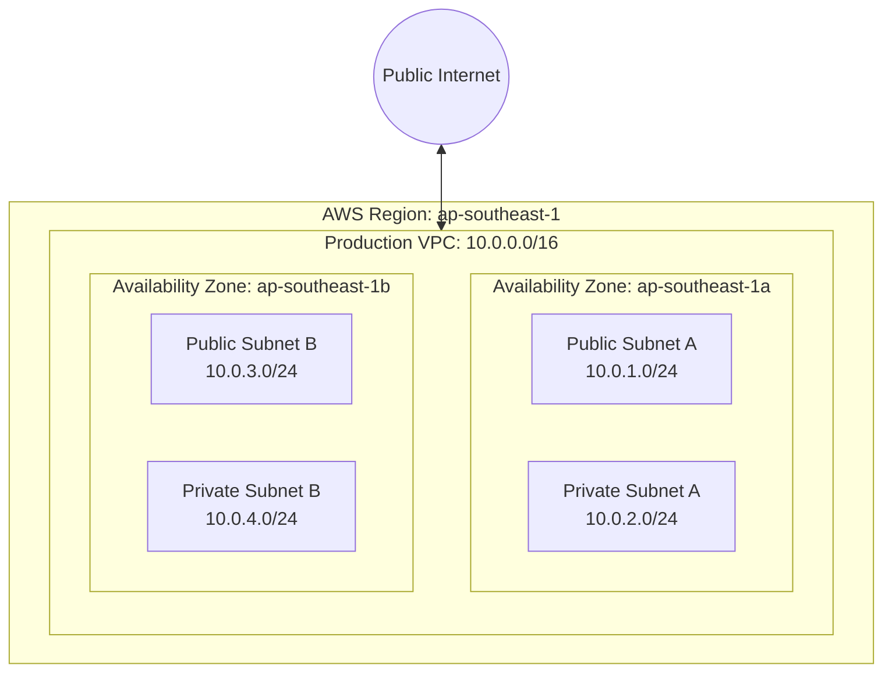

# Day 09: VPC Fundamentals (Virtual Private Cloud)

আজকের ক্লাসে আমরা AWS Networking এর মূল স্তম্ভ — **VPC (Virtual Private Cloud)** সম্পর্কে একদম গভীর থেকে শিখব। একটি সিকিউর, আইসোলেটেড ও স্কেলেবল ক্লাউড নেটওয়ার্ক কীভাবে ডিজাইন ও আর্কিটেক্ট করতে হয়, তার সব গাণিতিক হিসাব (CIDR Block) এবং প্র্যাকটিক্যাল হ্যান্ডস-অন আমরা কাভার করব।

---

## 1. What is VPC? — VPC কী?

**VPC (Virtual Private Cloud)** হলো AWS Cloud-এর ভেতরে আপনার অ্যাকাউন্টের জন্য তৈরি একটি সম্পূর্ণ লজিক্যালি আইসোলেটেড (Logical Isolated) ভার্চুয়াল নেটওয়ার্ক। 

সহজ কথায়, AWS-এর বিশাল পাবলিক ডেটাসেন্টারের ভেতরে এটি আপনার নিজস্ব প্রাইভেট নেটওয়ার্ক সীমানা (Network Boundary)। আপনার সমস্ত EC2 Instance, RDS Database, ECS Container বা Lambda Function এই VPC-এর ভেতরে নিরাপদে অবস্থান করে।

---

## 2. Why VPC is Essential? — কেন VPC দরকার?

VPC ছাড়া কোনো এন্টারপ্রাইজ ক্লাউড আর্কিটেকচার কল্পনাও করা যায় না। নিচে Before VPC এবং After VPC-এর একটি স্পষ্ট তুলনা দেওয়া হলো:

### Before VPC vs After VPC



| ফিচার | VPC ছাড়া (Traditional Cloud) | VPC সহ (Modern Production Cloud) |
|---|---|---|
| **Security Boundary** | সব সার্ভার ডিরেক্ট পাবলিক আইপিতে উন্মুক্ত থাকে | সম্পূর্ণ নিজস্ব আইসোলেটেড প্রাইভেট নেটওয়ার্ক সীমানা |
| **IP Management** | এলোমেলো আইপি অ্যাড্রেস ম্যানেজমেন্ট | নিজের পছন্দমতো প্রাইভেট IP Range (CIDR) নির্ধারণের সুবিধা |
| **Traffic Control** | নেটওয়ার্ক লেভেলে ফিল্টারিংয়ের সুযোগ সীমিত | Security Group & NACL দিয়ে প্যাকট-বাই-প্যাকেট ট্রাফিক ফিল্টারিং |
| **Hybrid Connectivity** | অন-প্রিমিস ডেটাসেন্টারের সাথে সিকিউর কানেকশন জটিল | VPN বা Direct Connect দিয়ে অন-প্রিমিসের সাথে সহজ ইন্টিগ্রেশন |

---

## 3. Real Life Analogy — বাস্তব জীবনের উপমা

চিন্তা করুন, আপনি একটি বিশাল শহরের (AWS Region) ভেতরে **একটি নিজস্ব জমি কিনে চারিদিকে উঁচু দেয়াল দিয়ে ঘিরে ফেললেন**।

- **AWS Region**: পুরো একটি বড় শহর (যেমন: Singapore বা Virginia)।
- **VPC**: সেই শহরের ভেতরে আপনার নিজস্ব বেড়াঘেরা প্লট বা জমি। আপনি অনুমতি না দিলে শহরের কেউ এই জমিতে ঢুকতে পারবে না।
- **CIDR Block (`10.0.0.0/16`)**: জমির মোট আয়তন। এটি নির্ধারণ করে আপনার জমিতে কয়টি বাড়ি বা রুম (IP Address) বানানো যাবে।
- **Subnet**: আপনার জমির ভেতরের আলাদা আলাদা রুম (যেমন: ড্রয়িং রুম = Public Subnet, মাস্টার বেডরুম = Private Subnet)।

---

## 4. How it Works / Internal Working & CIDR Mechanics

VPC তৈরি করার সময় সবচেয়ে গুরুত্বপূর্ণ বিষয় হলো **CIDR Block (Classless Inter-Domain Routing)** নির্ধারণ করা।

### CIDR Notation এর গাণিতিক হিসাব

একটি IPv4 Address এ মোট **32 bits** থাকে (যেমন: `10.0.0.0/16`)।
- `/16` মানে প্রথম ১৬ বিট নেটওয়ার্কের জন্য ফিক্সড (Network Prefix)।
- বাকি `32 - 16 = 16 bits` Host (IP address)-এর জন্য খালি থাকে।
- মোট সম্ভাব্য IP সংখ্যা: $2^{16} = 65,536$ টি IP অ্যাড্রেস।

::: tip CIDR Quick Reference Rule
- `/16` = $65,536$ টি IP (VPC-এর জন্য আদর্শ স্ট্যান্ডার্ড)
- `/24` = $256$ টি IP (Subnet-এর জন্য আদর্শ স্ট্যান্ডার্ড)
:::

### AWS Reserved IP Addresses (একটি গুরুত্বপূর্ণ বিষয়)

AWS যেকোনো Subnet এর মোট IP থেকে **৫টি IP সংরক্ষিত (Reserved)** রাখে। আপনি যদি `/24` (২৫৬ টি IP) সাবনেট তৈরি করেন, তবে ব্যবহার করতে পারবেন $256 - 5 = 251$ টি IP।

উদাহরণ হিসেবে `10.0.1.0/24` Subnet-এর জন্য Reserved IPs:
1. `10.0.1.0`: **Network Address** (নেটওয়ার্ক আইডেন্টিফায়ার)
2. `10.0.1.1`: **VPC Router** (ডিফল্ট গিটওয়ে)
3. `10.0.1.2`: **DNS Server** (AWS Provided DNS - Route 53 Resolver)
4. `10.0.1.3`: **Future Use** (AWS ভবিষ্যতের জন্য রিজার্ভ রাখে)
5. `10.0.1.255`: **Network Broadcast Address** (AWS বিটি ব্রডকাস্ট সাপোর্ট না করলেও রিজার্ভ রাখে)

---

## 5. Network Architecture Diagram

নিচে একটি প্রফেশনাল Custom VPC আর্কিটেকচারের Mermaid ডায়াগ্রাম দেওয়া হলো:



---

## 6. Hands-on Demo — AWS Console এ Custom VPC তৈরি

এখন আমরা AWS Management Console ব্যবহার করে স্টেপ-বাই-স্টেপ একটি প্রফেশনাল Custom VPC তৈরি করব।

### Step 1: VPC Dashboard এ প্রবেশ
1. AWS Console এ লগইন করে সার্চবারে টাইপ করুন **VPC** এবং VPC Service সিলেক্ট করুন।
2. বামপাশের মেনু থেকে **Your VPCs** এ ক্লিক করুন।
3. উপরে ডানপাশে থাকা **Create VPC** বাটনে ক্লিক করুন।

### Step 2: VPC Settings কনফিগারেশন
1. **Resources to create**: সিলেক্ট করুন `VPC only` (প্রফেশনালরা ম্যানুয়ালি সব কন্ট্রোল করতে VPC only ব্যবহার করেন)।
2. **Name tag**: দিন `prod-vpc`
3. **IPv4 CIDR manual input**: সিলেক্ট করুন `IPv4 CIDR manual input`
4. **IPv4 CIDR**: লিখুন `10.0.0.0/16`
5. **IPv6 CIDR block**: সিলেক্ট করুন `No IPv6 CIDR block` (আপাতত)
6. **Tenancy**: রাখুন `Default` (Dedicated এ সিলেক্ট করলে অতিরিক্ত হার্ডওয়্যার খরচ আসবে)

### Step 3: VPC Create সম্পন্নকরণ
1. **Create VPC** বাটনে ক্লিক করুন। 
2. আপনার VPC সফলভাবে তৈরি হয়ে যাবে এবং একটি অনন্য `vpc-xxxxxxxxx` ID তৈরি হবে।

### Step 4: DNS Hostnames Enable করা (খুবই জরুরি!)
::: warning DNS Hostname মিস কনফিগারেশন
নতুনরা প্রায়ই এই ভুলটি করে। VPC তৈরির পর EC2 ইনস্ট্যান্সে Public DNS Name (যেমন `ec2-xx-xx.compute.amazonaws.com`) পেতে হলে DNS Hostnames এনাবল করতে হয়।
:::
1. তৈরি করা `prod-vpc` টি সিলেক্ট করুন।
2. উপরে **Actions** ড্রেপডাউন থেকে **Edit VPC settings** এ ক্লিক করুন।
3. **Enable DNS hostnames** চেকবক্সে টিক দিন।
4. **Save changes** এ ক্লিক করুন।

---

## 7. AWS CLI Command — সমতুল্য কমান্ড

কন্সোলের পাশাপাশি প্রোডাকশন অটোমেশনে AWS CLI ব্যবহার করা হয়:

```bash
# ১. Custom VPC তৈরি করা
aws ec2 create-vpc \
    --cidr-block 10.0.0.0/16 \
    --tag-specifications 'ResourceType=vpc,Tags=[{Key=Name,Value=prod-vpc},{Key=Environment,Value=Production}]' \
    --region ap-southeast-1

# Output থেকে vpc-id নোট করুন (যেমন: vpc-0123456789abcdef0)

# ২. DNS Hostnames এনাবল করা
aws ec2 modify-vpc-attribute \
    --vpc-id vpc-0123456789abcdef0 \
    --enable-dns-hostnames '{"Value": true}'

# ৩. VPC ডিসক্রাইব করে ভেরিফাই করা
aws ec2 describe-vpcs --vpc-ids vpc-0123456789abcdef0
```

---

## 8. Comparison Table — Default VPC vs Custom VPC

| বৈশিষ্ট্য | Default VPC | Custom VPC (Production Standard) |
|---|---|---|
| **তৈরির মাধ্যম** | AWS অ্যাকাউন্ট খোলার সাথে সাথে স্বয়ংক্রিয়ভাবে থাকে | ইঞ্জিনিয়ার নিজ প্রয়োজনে ম্যানুয়ালি তৈরি করে |
| **CIDR Block** | ফিক্সড `172.31.0.0/16` | কাস্টমাইজড (যেমন: `10.0.0.0/16` বা `172.16.0.0/16`) |
| **Subnet টাইপ** | সবকটি Subnet-ই Public Subnet (Internet Open) | প্রয়োজন অনুযায়ী Public & Private Isolated Subnet |
| **Security Alignment** | দ্রুত টেস্টিংয়ের জন্য ভালো, Production এর জন্য ঝুঁকিপূর্ণ | সম্পূর্ণ সিকিউর Enterprise Grade Hardened Setup |
| **Internet Access** | অটোমেটিক Internet Gateway যুক্ত থাকে | ম্যানুয়ালি সাবনেট রাউটিং কনফিগার করতে হয় |

---

## 9. Real World Production Architecture Example

একটি রিয়েল-ওয়ার্ল্ড **Fintech / E-Commerce Application**-এ VPC কীভাবে ডিজাইন করা হয়:

- **CIDR Range**: `10.50.0.0/16` (কোম্পানির অন-প্রিমিস IP `192.168.0.0/16` এর সাথে কনফ্লিক্ট না করার জন্য)।
- **Public Subnet (`10.50.1.0/24`)**: শুধু Application Load Balancer (ALB) এবং Bastion Host রাখা হয়।
- **App Private Subnet (`10.50.10.0/24`)**: Microservices / EC2 Instance / ECS Container রাখা হয়, যা ইন্টারনেটে সরাসরি এক্সপোজড নয়।
- **DB Isolated Subnet (`10.50.20.0/24`)**: Multi-AZ RDS PostgreSQL/Aurora Database, যা আউটবাউন্ড ইন্টারনেট থেকেও সম্পূর্ণ ডিসকানেক্টেড।

---

## 10. Common Mistakes & Security Risks

::: danger নিরাপত্তা ও স্থাপত্য ভুলসমূহ
1. **ওভারল্যাপিং IP Range বেছে নেওয়া**: অন-প্রিমিস বা অন্য কোনো VPC-এর সাথে যদি IP range মিলে যায় (যেমন উভয় ক্ষেত্রে `10.0.0.0/16`), তবে ভবিষ্যতে **VPC Peering** বা **VPN/Direct Connect** করা অসম্ভব হয়ে পড়ে।
2. **ক্ষুদ্র CIDR সিলেক্ট করা**: যেমন VPC-এর জন্য `/28` (মাত্র ১৬টি IP) নেওয়া। পরবর্তীতে স্কেল করার সময় IP সংকটে পড়তে হয়।
3. **Default VPC-তে Production Workload চালানো**: Production অ্যাপ্লিকেশন ভুলবশত Default VPC-তে চালালে পাবলিক এক্সেসের ঝুঁকি থাকে।
:::

---

## 11. Best Practices

1. **RFC 1918 Private IP Range ব্যবহার করুন**: 
   - `10.0.0.0 - 10.255.255.255` (`10.0.0.0/8` prefix)
   - `172.16.0.0 - 172.31.255.255` (`172.16.0.0/12` prefix)
   - `192.168.0.0 - 192.168.255.255` (`192.168.0.0/16` prefix)
2. **ভবিষ্যতের কথা ভেবে CIDR প্ল্যান করুন**: পুরো অর্গানাইজেশনের জন্য একটি মাস্টার IP Address Management (IPAM) প্ল্যান তৈরি করুন।
3. **Multi-AZ Architecture বজায় রাখুন**: অন্তত ২টি Availability Zone-এ Subnet ছড়িয়ে দিন যেন একটি AZ ডাউন হলেও ড্রপ না করে।

---

## 12. Interview Questions & Answers

### Q1: AWS Subnet-এ মোট ২৫৬টি IP থাকলে আমরা কয়টি IP ব্যবহার করতে পারি এবং কেন?
**উত্তর**: আমরা ২৫১টি IP ব্যবহার করতে পারি। কারণ AWS প্রতিটা সাবনেট থেকে ৫টি IP (`.0`, `.1`, `.2`, `.3`, এবং `.255`) নিজস্ব রুট, ডিএনএস এবং নেটওয়ার্ক অপারেশনের জন্য সংরক্ষিত (Reserved) রাখে।

### Q2: তৈরির পর কি একটি VPC-এর Primary CIDR Block পরিবর্তন বা সাইজ ছোট/বড় করা যায়?
**উত্তর**: না, তৈরির পর প্রাথমিক CIDR block সোজাসুজি পরিবর্তন বা এডিট করা যায় না। তবে প্রয়োজনে Secondary CIDR block যুক্ত (Associate) করা যায়।

### Q3: Default VPC এবং Custom VPC-এর মধ্যে মূল পার্থক্য কী?
**উত্তর**: Default VPC-তে প্রতিটি সাবনেট বাই-ডিফল্ট পাবলিক থাকে এবং ইন্টারনেট গেইটওয়ে যুক্ত থাকে। অন্যদিকে Custom VPC-তে কোন সাবনেট বাই-ডিফল্ট পাবলিক থাকে না, সিকিউরিটির জন্য সবকিছু ম্যানুয়ালি আইসোলেট করে সাজাতে হয়।

---

## 13. Summary

- **VPC** হলো AWS-এ আপনার অ্যাকাউন্টের ভার্চুয়াল নেটওয়ার্ক সীমানা।
- **CIDR Notation** দিয়ে নেটওয়ার্কের মোট IP নির্ধারণ করা হয় (`/16` = 65,536 IPs)।
- AWS প্রতি সাবনেট থেকে **৫টি IP সংরক্ষিত** রাখে।
- প্রফেশনাল কাজের জন্য **DNS Hostnames** এনাবল করা আবশ্যক।

---

## 14. পরবর্তী ধাপ

পরবর্তী ক্লাসে আমরা শিখব **Subnets (Public vs Private Subnet)** — কীভাবে VPC-এর ভেতরে নেটওয়ার্ককে বিভিন্ন অংশে ভাগ করে সিকিউর রাখতে হয়!
