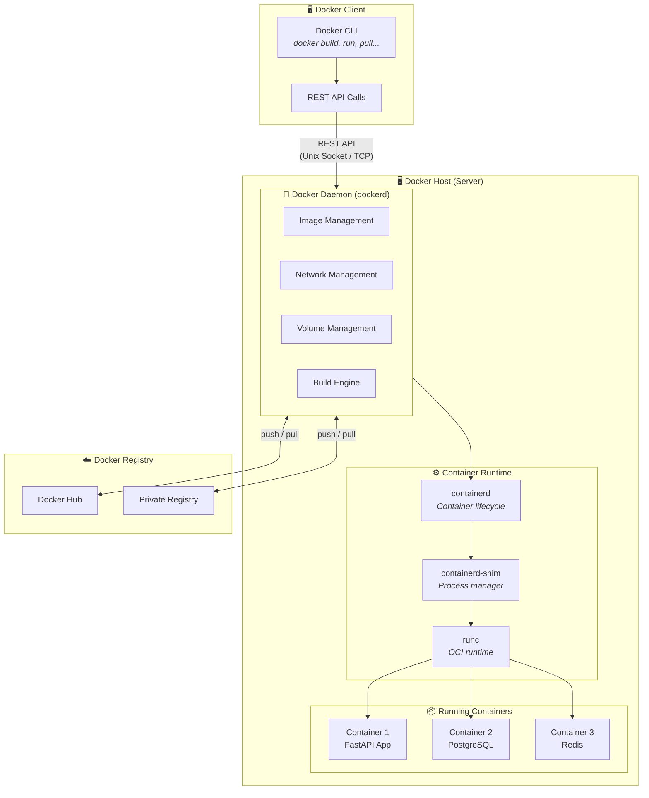
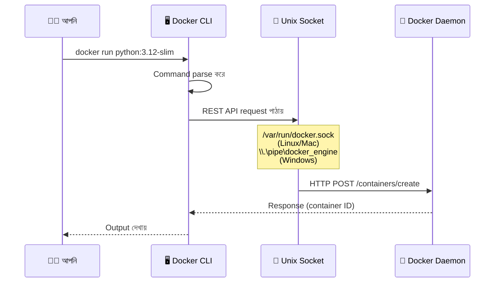
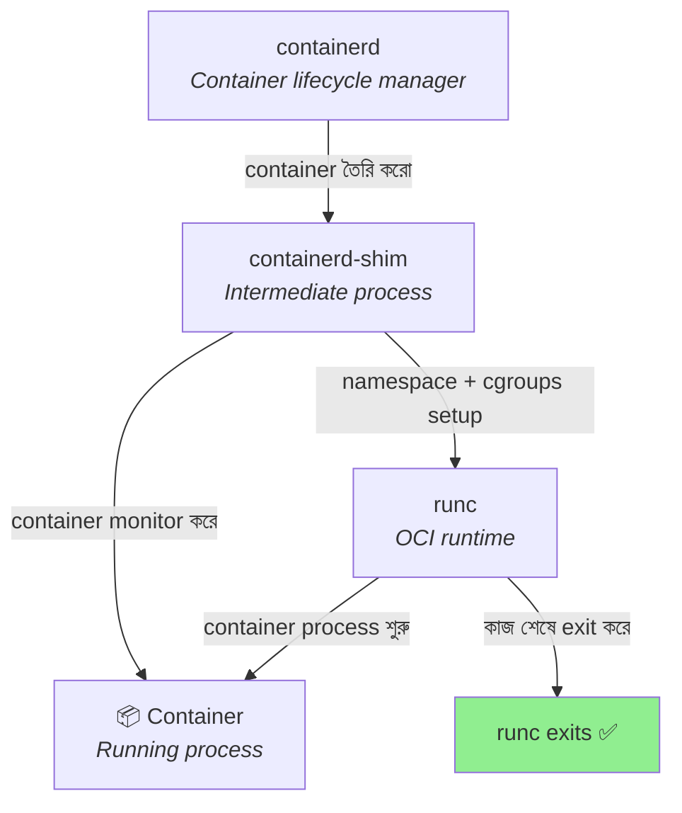
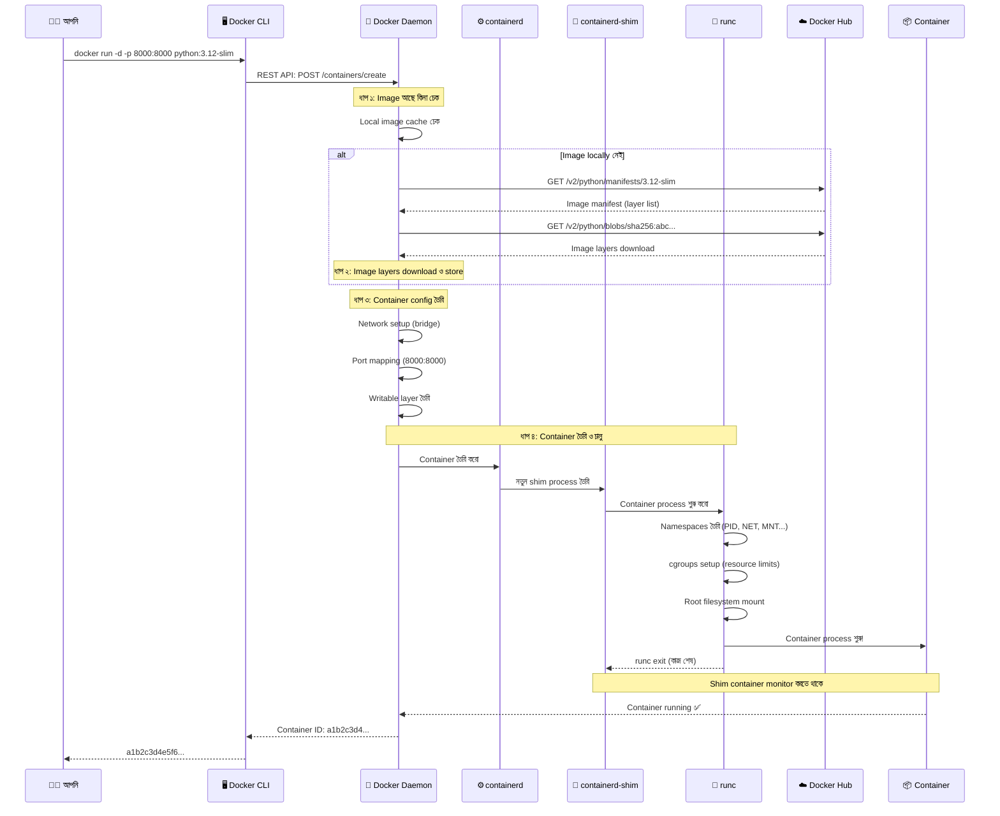
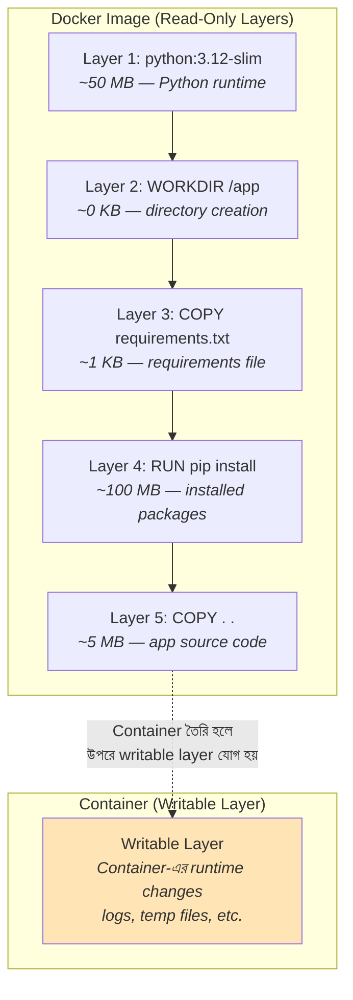
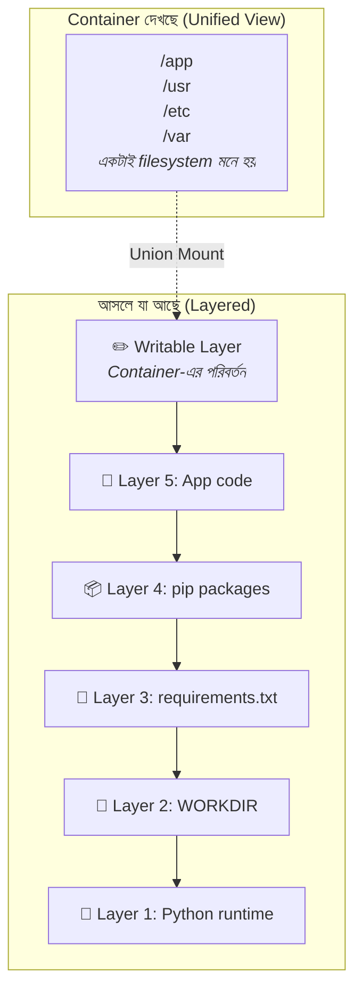
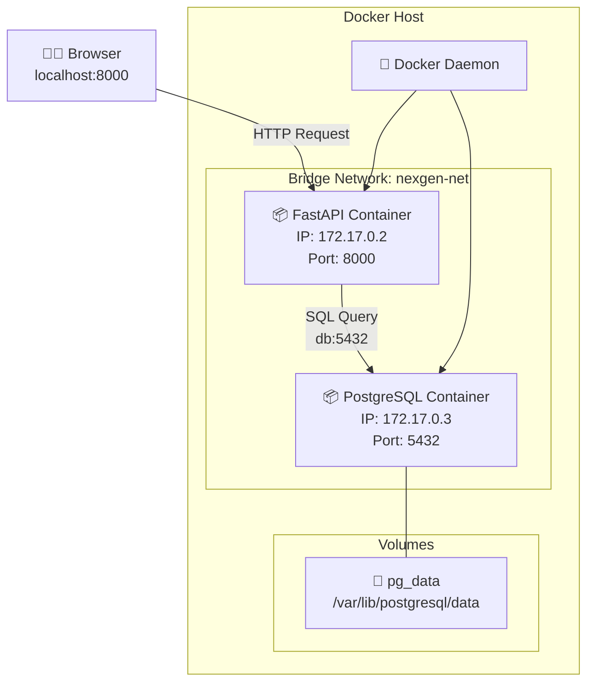
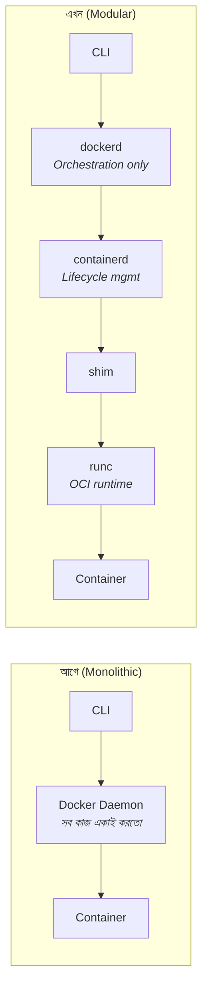

# 🏗️ Docker Architecture

## Docker Architecture কী? (What)

**Docker Architecture** হলো Docker-এর অভ্যন্তরীণ গঠন — অর্থাৎ Docker-এর বিভিন্ন component কীভাবে একসাথে কাজ করে container তৈরি, চালানো, এবং manage করে। Docker একটি **Client-Server architecture** অনুসরণ করে, যেখানে:

- **Client** (Docker CLI) — আপনি যে command দেন সেটা receive করে
- **Server** (Docker Daemon) — আসল কাজ করে (image build, container চালানো, ইত্যাদি)
- **Registry** (Docker Hub) — image সংরক্ষণ ও বিতরণ করে

সহজ কথায়: আপনি command দেন → Docker CLI সেটা Daemon-কে পাঠায় → Daemon কাজ করে → আপনাকে result দেখায়।

:::info কেন Architecture বুঝতে হবে?
অনেকেই শুধু `docker run` command শিখে Docker ব্যবহার শুরু করে। কিন্তু **ভিতরে কী ঘটছে** না বুঝলে debugging করতে পারবেন না, performance optimize করতে পারবেন না, এবং interview-তে advanced প্রশ্নের উত্তর দিতে পারবেন না। এই topic আপনাকে সেই গভীর জ্ঞান দেবে।
:::

---

## কেন Docker Architecture বুঝা দরকার? (Why)

```
❌ Architecture না বুঝলে (Before):
   - "docker run দিলাম, কিন্তু কাজ করছে না — কেন জানি না"
   - Image pull হচ্ছে না — কোথায় সমস্যা? Network? Daemon? Registry?
   - Container চলছে কিন্তু ধীর — কী optimize করব?
   - Docker Desktop বন্ধ করলে সব container মারা যায় — কেন?
   - Interview-তে "Docker internally কীভাবে কাজ করে?" — চুপ!

✅ Architecture বুঝলে (After):
   - Error message দেখেই বুঝবেন সমস্যাটা কোন layer-এ
   - Docker Daemon restart vs Docker CLI issue — distinguish করতে পারবেন
   - Image layer caching বুঝে build time কমাতে পারবেন
   - Production-এ container runtime পছন্দ করতে পারবেন
   - Interview-তে confidently internal working ব্যাখ্যা করতে পারবেন
```

---

## Analogy — রেস্তোরাঁর উপমা 🍽️

Docker Architecture বোঝার জন্য একটা রেস্তোরাঁর সাথে তুলনা করি:

| Docker Component | রেস্তোরাঁ equivalent | কাজ |
|---|---|---|
| **Docker CLI** (Client) | ওয়েটার | আপনার order নেয় এবং রান্নাঘরে পৌঁছায় |
| **Docker Daemon** (dockerd) | প্রধান রাঁধুনি (Head Chef) | Order receive করে, plan করে, কাজ ভাগ করে দেয় |
| **containerd** | সহকারী রাঁধুনি (Sous Chef) | আসল রান্নার কাজ manage করে |
| **runc** | চুলা (Stove/Oven) | আসলে রান্না হয় এখানে (container তৈরি ও চালায়) |
| **Docker Registry** | পাইকারি বাজার (Wholesale market) | কাঁচামাল (image) কিনে আনার জায়গা |
| **Image** | রেসিপি + উপকরণ | রান্নার blueprint |
| **Container** | পরিবেশিত খাবার | চূড়ান্ত running product |

```
আপনি (User): "একটা বিরিয়ানি দিন" (docker run)
    ↓
ওয়েটার (CLI): "ঠিক আছে!" → রান্নাঘরে order পাঠায়
    ↓
Head Chef (Daemon): রেসিপি (image) আছে কি না চেক করে
    ↓ (না থাকলে)
পাইকারি বাজার (Registry): রেসিপি + উপকরণ কিনে আনে (image pull)
    ↓
Sous Chef (containerd): রান্নার সব প্রস্তুতি নেয়
    ↓
চুলা (runc): আসল রান্না হয় (container তৈরি ও run)
    ↓
পরিবেশিত খাবার (Container): আপনার কাছে আসে! 🎉
```

---

## Docker Architecture — How it Works (Internal Working)

### High-Level Architecture Diagram



---

## প্রতিটা Component বিস্তারিত

### 1. Docker Client (CLI) — আপনার ও Docker-এর মধ্যে সেতু

**Docker Client** হলো command-line interface (CLI) tool যা আপনি terminal-এ ব্যবহার করেন। আপনি যখন `docker run`, `docker build`, `docker pull` — যেকোনো docker command দেন, সেটা আসলে Docker Client handle করে।

**Client কীভাবে কাজ করে:**



**গুরুত্বপূর্ণ তথ্য:**
- Docker CLI নিজে কোনো container চালায় না — শুধু Daemon-কে নির্দেশ দেয়
- CLI এবং Daemon **একই machine-এ** থাকতে পারে, আবার **আলাদা machine-এও** থাকতে পারে (remote Docker)
- CLI Daemon-এর সাথে **REST API** দিয়ে কথা বলে
- Communication হয় **Unix socket** (`/var/run/docker.sock`) বা **TCP socket** দিয়ে

**Unix Socket** হলো Linux/Mac-এ এক ধরনের inter-process communication (IPC) mechanism — একই machine-এর দুটো process-এর মধ্যে দ্রুত যোগাযোগের মাধ্যম। Docker CLI এই socket-এর মাধ্যমে Docker Daemon-এর সাথে কথা বলে।

```bash
# Docker CLI কোন Daemon-এর সাথে যুক্ত তা দেখুন
docker info

# আপনি চাইলে সরাসরি REST API call করতে পারেন
curl --unix-socket /var/run/docker.sock http://localhost/version
```

**Output:**
```json
{
  "Version": "27.0.3",
  "ApiVersion": "1.46",
  "Os": "linux",
  "Arch": "amd64",
  "KernelVersion": "5.15.0-76-generic"
}
```

:::tip Remote Docker
আপনি চাইলে আপনার laptop-এর CLI দিয়ে remote server-এর Docker Daemon control করতে পারেন। এজন্য `DOCKER_HOST` environment variable সেট করতে হয়:
```bash
export DOCKER_HOST=tcp://remote-server:2376
docker ps  # এখন remote server-এর containers দেখাবে
```
:::

---

### 2. Docker Daemon (dockerd) — Docker-এর মস্তিষ্ক 🧠

**Docker Daemon** (প্রায়ই `dockerd` নামে পরিচিত) হলো Docker-এর সবচেয়ে গুরুত্বপূর্ণ component — এটি একটি **background service (daemon process)** যা সার্বক্ষণিক চলতে থাকে এবং Docker-এর সব মূল কাজ সম্পাদন করে।

**Daemon** শব্দটি Unix/Linux জগতে এমন একটি program-কে বোঝায় যা background-এ চলে, কোনো terminal-এর সাথে সরাসরি যুক্ত থাকে না, এবং client-এর request-এর জন্য অপেক্ষা করে।

**Daemon এর দায়িত্ব:**

| দায়িত্ব | ব্যাখ্যা |
|---------|---------|
| **Image Management** | Image build, pull, push, tag, remove |
| **Container Management** | Container create, start, stop, restart, remove |
| **Network Management** | Docker network create, connect, disconnect |
| **Volume Management** | Data volume create, mount, remove |
| **API Server** | REST API endpoint হিসেবে CLI-র request receive করা |
| **Security** | Container isolation, user permissions |
| **Logging** | Container logs collect ও manage করা |

```bash
# Docker Daemon চলছে কিনা চেক করুন
# Linux:
sudo systemctl status docker

# Output:
# ● docker.service - Docker Application Container Engine
#    Loaded: loaded
#    Active: active (running)  ← এটা দেখলে Daemon চলছে
```

:::warning Docker Desktop ও Daemon
Windows/Mac-এ Docker Desktop application-ই Docker Daemon চালায়। Docker Desktop বন্ধ করলে Daemon-ও বন্ধ হয়, ফলে সব container বন্ধ হয়ে যায়। তাই Docker ব্যবহার করতে হলে Docker Desktop চালু রাখতে হবে।
:::

---

### 3. containerd — Container Lifecycle Manager

**containerd** (উচ্চারণ: "container-dee") হলো একটি **industry-standard container runtime** যা Docker Daemon-এর নিচে বসে container-এর সম্পূর্ণ lifecycle manage করে।

**কেন আলাদা containerd?**

আগে Docker Daemon নিজেই সরাসরি container তৈরি ও চালাতো। কিন্তু Docker community ঠিক করলো যে container runtime-টাকে আলাদা করা উচিত যাতে:
- অন্য tools-ও (যেমন Kubernetes) এটা ব্যবহার করতে পারে
- Docker Daemon restart করলেও running containers প্রভাবিত না হয়
- Modularity বাড়ে — প্রতিটা component নিজের কাজ করে

**containerd এর দায়িত্ব:**

| দায়িত্ব | ব্যাখ্যা |
|---------|---------|
| **Image Transfer** | Registry থেকে image pull ও push |
| **Image Storage** | Image layers disk-এ store করা |
| **Container Execution** | runc-কে দিয়ে container চালানো |
| **Supervision** | চলমান container-দের monitor করা |
| **Network Interface** | Container-এর network setup |
| **Storage Interface** | Container-এর filesystem setup |

:::info Kubernetes ও containerd
Kubernetes v1.24 থেকে Docker Daemon-কে বাদ দিয়ে **সরাসরি containerd** ব্যবহার করে container চালায়। এটা প্রমাণ করে containerd কতটা গুরুত্বপূর্ণ ও নির্ভরযোগ্য runtime। আপনি Docker শিখলে containerd-ও বুঝতে পারবেন, যা Kubernetes শেখায় কাজে আসবে।
:::

---

### 4. runc — আসল Container তৈরিকারী

**runc** হলো একটি **lightweight, portable container runtime** যা আসলে Linux kernel-এর namespaces ও cgroups ব্যবহার করে container তৈরি ও চালায়।

**runc** হলো সেই tool যা:
- Linux namespace তৈরি করে (PID, NET, MNT, ইত্যাদি)
- cgroups configure করে (CPU, Memory limits)
- Container-এর root filesystem সেটআপ করে
- Container process শুরু করে

runc হলো **OCI (Open Container Initiative) runtime specification** এর reference implementation। OCI হলো container format ও runtime-এর industry standard — যাতে সব container tool একই ভাবে container চালাতে পারে।



**containerd-shim** কী?

containerd-shim হলো containerd এবং runc-এর মাঝখানে থাকা একটি ছোট process। এর কাজ হলো:
- runc container তৈরি করে exit করার পর container-এর **parent process** হিসেবে থাকা
- Container-এর **STDIN/STDOUT** handle করা
- Container-এর **exit status** containerd-কে report করা
- **containerd restart** হলেও container যেন চলতে থাকে — এটা shim নিশ্চিত করে

---

### 5. Docker Registry — Image এর ভাণ্ডার

**Docker Registry** হলো Docker image সংরক্ষণ ও বিতরণের জায়গা। এটাকে ভাবুন code-এর জন্য যেমন GitHub, image-এর জন্য তেমন Docker Registry।

| Registry Type | উদাহরণ | ব্যবহার |
|---|---|---|
| **Public Registry** | Docker Hub (`hub.docker.com`) | Public ও official images — `python`, `postgres`, `redis` |
| **Private Registry** | AWS ECR, Google GCR, Azure ACR | কোম্পানির internal images |
| **Self-hosted** | Harbor, Docker Registry (self-hosted) | নিজের server-এ registry চালানো |

```bash
# Docker Hub থেকে image pull (default registry)
docker pull python:3.12-slim

# AWS ECR থেকে pull (private registry)
docker pull 123456789.dkr.ecr.ap-south-1.amazonaws.com/nexgen-api:latest

# Self-hosted registry থেকে pull
docker pull registry.mycompany.com/nexgen-api:v1.0
```

---

## `docker run` করলে ভিতরে কী ঘটে? — Step by Step

এটা Docker Architecture বোঝার সবচেয়ে গুরুত্বপূর্ণ অংশ। ধরি আপনি এই command দিলেন:

```bash
docker run -d -p 8000:8000 --name nexgen python:3.12-slim
```

**ভিতরে যা ঘটে:**



### প্রতিটা ধাপ ব্যাখ্যা:

**ধাপ ১: Image খোঁজা**
- Daemon প্রথমে local machine-এ image আছে কিনা দেখে
- থাকলে সরাসরি ধাপ ৩ তে যায়
- না থাকলে registry (default: Docker Hub) থেকে pull করে

**ধাপ ২: Image Pull (যদি দরকার হয়)**
- Registry থেকে image manifest download করে (কোন কোন layer দরকার)
- প্রতিটা layer আলাদাভাবে download হয়
- Layer গুলো locally cache হয় — পরের বার আর download লাগবে না

**ধাপ ৩: Container Configuration**
- একটি writable layer তৈরি হয় image-এর উপর (Union Filesystem)
- Network interface তৈরি হয় (default: bridge network)
- Port mapping configure হয় (host 8000 → container 8000)
- Environment variables, volumes — সব setup হয়

**ধাপ ৪: Container Creation ও Start**
- Daemon → containerd → containerd-shim → runc — এই chain-এ কাজ pass হয়
- runc Linux namespaces ও cgroups তৈরি করে
- Container-এর root filesystem mount করে
- Container process শুরু করে
- runc কাজ শেষে exit করে, shim parent process হিসেবে থাকে

---

## Docker Image Layers — Internal Structure

Docker image **layered filesystem** ব্যবহার করে। প্রতিটা Dockerfile instruction একটা নতুন layer তৈরি করে। এটা বোঝা খুবই গুরুত্বপূর্ণ — image size optimization ও build caching এর জন্য।

### NexGen AI Image-এর Layers

ধরি আমাদের NexGen AI এর Dockerfile এরকম:

```dockerfile
FROM python:3.12-slim          # Layer 1: Base Python image
WORKDIR /app                   # Layer 2: Working directory set
COPY requirements.txt .        # Layer 3: Requirements file copy
RUN pip install -r requirements.txt  # Layer 4: Dependencies install
COPY . .                       # Layer 5: App code copy
CMD ["uvicorn", "main:app"]    # Layer 6: Start command (metadata only)
```



### Layer Caching — কেন গুরুত্বপূর্ণ?

Docker image build করার সময় প্রতিটা layer **cache** হয়। যদি কোনো layer পরিবর্তন না হয়, Docker সেটা পুনরায় build না করে cache থেকে নেয়। **কিন্তু**, একটা layer পরিবর্তন হলে সেটা এবং তার পরের সব layers পুনরায় build হয়।

```
Build 1 (প্রথমবার):
Layer 1: python:3.12-slim  → ⏳ Download (50 MB)
Layer 2: WORKDIR /app      → ⏳ Build
Layer 3: COPY requirements → ⏳ Build
Layer 4: pip install       → ⏳ Build (slow! 100 MB)
Layer 5: COPY . .          → ⏳ Build
Total time: ~2 minutes

Build 2 (শুধু code পরিবর্তন):
Layer 1: python:3.12-slim  → ✅ Cache hit!
Layer 2: WORKDIR /app      → ✅ Cache hit!
Layer 3: COPY requirements → ✅ Cache hit! (requirements বদলায়নি)
Layer 4: pip install       → ✅ Cache hit! (dependencies একই)
Layer 5: COPY . .          → ⏳ Rebuild (code বদলেছে)
Total time: ~5 seconds! 🚀
```

:::tip এজন্যই requirements.txt আগে COPY করি
Dockerfile-এ আমরা `COPY requirements.txt .` এবং `RUN pip install` আগে রাখি, তারপর `COPY . .` করি। কারণ source code প্রায়ই বদলায় কিন্তু dependencies কম বদলায়। এভাবে রাখলে code পরিবর্তনে dependencies আবার install হয় না — শুধু শেষ layer rebuild হয়।
:::

---

## Union Filesystem (UnionFS) — Image ও Container এর Filesystem

Docker একটি **Union Filesystem** ব্যবহার করে যা একাধিক read-only layer এবং একটি writable layer-কে একসাথে জুড়ে একটি unified filesystem হিসেবে দেখায়।

**Union Filesystem** হলো এমন একটি filesystem technology যা একাধিক directory-কে (layer) একটি single directory হিসেবে merge করে দেখায়। Container-এর ভিতর থেকে দেখলে মনে হয় একটাই filesystem, কিন্তু আসলে অনেকগুলো layer stack করা আছে।



**Copy-on-Write (CoW) Strategy:**

Container-এ কিছু পরিবর্তন করলে (যেমন file edit, নতুন file তৈরি), Docker সেই পরিবর্তন শুধু **writable layer-এ** রাখে। Original image layers অপরিবর্তিত থাকে। এটাকে বলে **Copy-on-Write** — পড়ার সময় original layer থেকে পড়ে, লেখার সময় writable layer-এ copy করে সেখানে লেখে।

এর সুবিধা:
- একটা image থেকে ১০০টা container চালালেও image-এর layers সবাই **share** করে
- শুধু প্রতিটা container-এর writable layer আলাদা
- অনেক কম disk space লাগে

---

## Docker Architecture Comparison Table

| Component | পূর্ণ নাম | ধরন | কাজ | অপরিহার্য? |
|-----------|----------|------|------|-----------|
| **Docker CLI** | Docker Command Line Interface | Client | User command receive ও Daemon-এ পাঠানো | হ্যাঁ |
| **dockerd** | Docker Daemon | Daemon/Service | সব কিছু manage — image, container, network, volume | হ্যাঁ |
| **containerd** | Container Daemon | Container Runtime (High-level) | Container lifecycle management, image management | হ্যাঁ |
| **containerd-shim** | containerd Shim | Process Manager | Container parent process, stdout/stderr handle | হ্যাঁ |
| **runc** | Run Container | Container Runtime (Low-level) | Namespace/cgroup তৈরি, container process শুরু | হ্যাঁ |
| **Docker Hub** | Docker Hub Registry | Registry | Public image storage ও distribution | না (self-host সম্ভব) |

---

## বাস্তব উদাহরণ — NexGen AI এর Architecture

আমাদের NexGen AI প্রজেক্টে যখন আমরা `docker compose up` করব (Level 2 শেষে), তখন ভিতরে এটা ঘটবে:



**কী ঘটবে:**
1. Docker Daemon `python:3.12-slim` ও `postgres:16` image pull করবে (যদি locally না থাকে)
2. একটি bridge network তৈরি হবে (`nexgen-net`)
3. PostgreSQL container শুরু হবে, `pg_data` volume mount হবে
4. FastAPI container শুরু হবে, port 8000 host-এ map হবে
5. FastAPI container `db:5432` নামে PostgreSQL-কে খুঁজে পাবে (Docker DNS)
6. আপনি browser-এ `localhost:8000` গেলে FastAPI response পাবেন

---

## Docker Architecture এর বিবর্তন

Docker-এর architecture সময়ের সাথে অনেক পরিবর্তন হয়েছে:



| যুগ | Architecture | সমস্যা |
|------|-------------|--------|
| **Docker 0.x - 1.10** | Monolithic — Daemon সব করতো | Daemon restart করলে সব container মরে যেতো |
| **Docker 1.11+** | containerd আলাদা হলো | Daemon restart-এ container survive করে |
| **Docker 17.x+** | containerd-shim যোগ হলো | আরো ভালো container lifecycle management |
| **বর্তমান** | Fully modular | প্রতিটা component আলাদাভাবে upgrade সম্ভব |

---

## Common Mistakes — নতুনদের সাধারণ ভুল

### ১. Docker CLI আর Docker Daemon গুলিয়ে ফেলা
❌ **ভুল:** `docker run` command-ই container চালায়।
✅ **সঠিক:** `docker run` হলো CLI command — এটা শুধু Daemon-কে বলে "container চালাও"। আসল কাজটা Daemon → containerd → runc chain-এ হয়। CLI command fail হলে সমস্যাটা CLI-তে নাকি Daemon-এ তা বুঝতে হবে।

### ২. Docker Daemon বন্ধ থাকলে command কাজ না করার কারণ না বুঝা
❌ **ভুল:** "docker command দিচ্ছি কিন্তু কাজ করছে না, Docker ভেঙে গেছে!"
✅ **সঠিক:** বেশিরভাগ সময় Daemon চলছে না। Docker Desktop চালু আছে কিনা দেখুন। Linux-এ `sudo systemctl start docker` দিন। Error message-এ "Cannot connect to the Docker daemon" থাকলে এটাই সমস্যা।

```bash
# সাধারণ error:
# "Cannot connect to the Docker daemon at unix:///var/run/docker.sock"
# সমাধান:
sudo systemctl start docker    # Linux
# অথবা Docker Desktop চালু করুন   # Windows/Mac
```

### ৩. Image layer caching না বুঝে Dockerfile লেখা
❌ **ভুল:** Dockerfile-এ সব COPY instruction একসাথে লেখা:
```dockerfile
COPY . .
RUN pip install -r requirements.txt
```
✅ **সঠিক:** Frequently changing files পরে COPY করা:
```dockerfile
COPY requirements.txt .
RUN pip install -r requirements.txt
COPY . .    # এটা পরে — code পরিবর্তনে pip install আবার হবে না
```

### ৪. Docker socket expose করে security risk তৈরি করা
❌ **ভুল:** Docker socket (`/var/run/docker.sock`) container-এ mount করা বিপজ্জনক — কারণ যে container-এর কাছে socket access আছে সে host-এর Docker Daemon-কে control করতে পারে (পুরো host machine-এর access পেয়ে যায়)।
✅ **সঠিক:** শুধুমাত্র trusted containers-এ socket mount করুন এবং production-এ এটা এড়িয়ে চলুন।

---

## Best Practices

1. **Docker Desktop সবসময় আপডেট রাখুন** — নতুন version-এ security fix, performance improvement, এবং নতুন features থাকে। Daemon ও CLI version mismatch হলে সমস্যা হতে পারে।

2. **Layer caching maximize করুন** — Dockerfile-এ কম পরিবর্তনশীল instructions আগে রাখুন (base image, dependencies) এবং বেশি পরিবর্তনশীল instructions পরে (source code)। এতে build time অনেক কমবে।

3. **Docker system prune নিয়মিত করুন** — unused images, containers, volumes, networks মুছে disk space মুক্ত করুন:
   ```bash
   docker system prune -a
   ```

4. **Resource limits সেট করুন** — Production-এ container-এ CPU ও memory limit দিন, যাতে একটা container পুরো host-এর resource খেয়ে না ফেলে (এটা cgroups-এর মাধ্যমে হয়)।

5. **Docker Compose ব্যবহার করুন** — একাধিক container চালাতে হলে manual `docker run` command না দিয়ে Docker Compose ব্যবহার করুন। এটা reproducible, version-controlled, এবং team-friendly।

---

## Interview Questions ও Answers

### ১. Docker Architecture ব্যাখ্যা করুন।

**উত্তর:** Docker একটি Client-Server architecture অনুসরণ করে তিনটি মূল component নিয়ে:

**Docker Client (CLI)** — user-এর command receive করে REST API-র মাধ্যমে Docker Daemon-এ পাঠায়। Unix socket বা TCP-র মাধ্যমে communication হয়।

**Docker Daemon (dockerd)** — central management service যা image, container, network, volume সব manage করে। Client-এর API request process করে এবং containerd-কে দিয়ে container চালায়।

**Docker Registry** — image storage ও distribution service। Docker Hub হলো default public registry। Daemon image pull/push-এর জন্য registry-র সাথে communicate করে।

অতিরিক্তভাবে, container runtime stack-এ **containerd** (container lifecycle management), **containerd-shim** (container parent process), এবং **runc** (OCI-compliant low-level runtime যা namespaces ও cgroups ব্যবহার করে container process তৈরি করে) — এই তিনটি component ক্রমানুসারে কাজ করে।

---

### ২. Docker Daemon restart করলে running containers কি মারা যায়?

**উত্তর:** Docker-এর modern architecture-এ — **না**। এটা containerd ও containerd-shim-এর কারণে সম্ভব।

Docker Daemon (dockerd) container সরাসরি চালায় না — containerd চালায়। Daemon restart হলেও containerd independently চলতে থাকে। এবং containerd-shim প্রতিটা container-এর parent process হিসেবে থাকে, তাই containerd restart হলেও shim container-কে alive রাখে।

তবে Docker Desktop-এ Docker Desktop application বন্ধ করলে পুরো Docker environment (daemon, containerd সহ) বন্ধ হয়, তাই সেক্ষেত্রে containers বন্ধ হয়।

---

### ৩. containerd ও runc এর মধ্যে পার্থক্য কী?

**উত্তর:** **containerd** হলো high-level container runtime — এটা container-এর সম্পূর্ণ lifecycle manage করে (create, start, stop, delete), image pull/push করে, এবং storage/network interface handle করে। এটা একটি long-running daemon process।

**runc** হলো low-level OCI runtime — এটা শুধু Linux namespaces ও cgroups ব্যবহার করে container process তৈরি ও শুরু করে। Container শুরু করার পর runc exit করে যায় — এটা long-running process না।

সম্পর্ক: containerd runc-কে ব্যবহার করে container তৈরি করে। containerd হলো "manager", runc হলো "worker"।

---

### ৪. Docker-এ image layer caching কীভাবে কাজ করে এবং কেন গুরুত্বপূর্ণ?

**উত্তর:** Docker image build-এ Dockerfile-এর প্রতিটা instruction একটি layer তৈরি করে। Docker প্রতিটা layer-এর content-এর hash রাখে। পরবর্তী build-এ যদি কোনো layer-এর content এবং তার আগের সব layer অপরিবর্তিত থাকে, Docker cache থেকে সেই layer ব্যবহার করে — rebuild করে না।

এটা গুরুত্বপূর্ণ কারণ: build time ব্যাপকভাবে কমে (মিনিট থেকে সেকেন্ডে), CI/CD pipeline দ্রুত হয়, এবং bandwidth সাশ্রয় হয়। তাই Dockerfile-এ কম পরিবর্তনশীল instructions (যেমন `COPY requirements.txt` ও `RUN pip install`) আগে রাখা উচিত এবং বেশি পরিবর্তনশীল instructions (যেমন `COPY . .`) পরে রাখা উচিত।

---

## Summary

| বিষয় | বিবরণ |
|-------|-------|
| **Architecture** | Client-Server model — CLI → Daemon → containerd → runc |
| **Docker CLI** | User interface — command receive করে, REST API দিয়ে Daemon-এ পাঠায় |
| **Docker Daemon** | Central management — image, container, network, volume সব handle করে |
| **containerd** | High-level container runtime — container lifecycle management |
| **runc** | Low-level OCI runtime — namespace/cgroup দিয়ে container তৈরি করে |
| **containerd-shim** | Container parent process — Daemon restart-এ container survive করে |
| **Registry** | Image storage — Docker Hub (public), ECR/GCR (private) |
| **Image Layers** | Layered filesystem — caching দিয়ে build optimization |
| **Union Filesystem** | Multiple layers → unified view, Copy-on-Write strategy |

---

## পরবর্তী ধাপ

এখন আপনি Docker-এর ভিতরের architecture বুঝে গেছেন — কোন component কী করে, `docker run` করলে ভিতরে কী ঘটে, এবং image layers কীভাবে কাজ করে। পরবর্তী topic-এ আমরা **Docker Installation** করব — Windows, Mac, এবং Linux-এ Docker install করে আপনার প্রথম Docker command চালাবেন।
