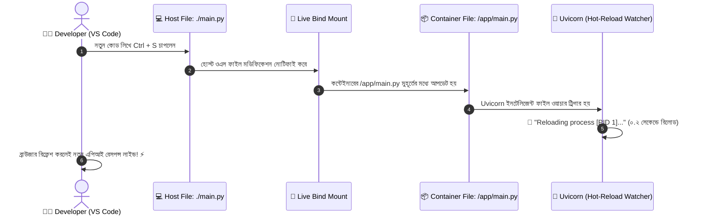

# 🔗 Bind Mounts

## Bind Mount কী? (What)

**Bind Mount** হলো এমন একটি স্টোরেজ কৌশল, যার মাধ্যমে হোস্ট মেশিনের (Host Machine) যেকোনো একটি নির্দিষ্ট ফিজিক্যাল ফাইল বা ডিরেক্টরিকে সরাসরি কন্টেইনারের ভেতরের একটি ডিরেক্টরির সাথে **হুবহু আয়নার মতো মিরর (Direct Mapping)** করে দেওয়া হয়।

সহজ ভাষায়: ডকার ভলিউমের ডাটা কোথায় জমা হবে তা ঠিক করে ডকার নিজে। কিন্তু **Bind Mount** এ আপনি নিজে বলে দেন— "আমার ল্যাপটপের `D:/projects/nexgen-api` ফোল্ডারটিকে কন্টেইনারের `/app` ফোল্ডারে জোড়া লাগিয়ে দাও।"

এর ফলে, আপনি আপনার লোকাল VS Code এ কোড এডিট ও সেভ করার সাথে সাথেই কন্টেইনারের ভেতরের কোড তৎক্ষণাৎ আপডেট হয়ে যায় — **ইমেজ পুনরায় বিল্ড করার কোনো প্রয়োজনই হয় না!**

:::info Hot-Reload এর চাবিকাঠি
লোকাল ডেভেলপমেন্টে কোড পরিবর্তন করে বারবার `docker build` দেওয়া অসম্ভব সময়সাপেক্ষ। **Bind Mount + Hot Reload** ডকারাইজড ডেভেলপমেন্টকে দেয় লোকাল ডেভেলপমেন্টের মতো মসৃণ ও দ্রুত অভিজ্ঞতা।
:::

---

## কেন Bind Mount ডেভেলপমেন্টে অপরিহার্য? (Why)

```
❌ Bind Mount ছাড়া ডেভেলপমেন্ট করলে (Nightmare ⏳):
   1. `main.py` ফাইলে একটি এপিআই এন্ডপয়েন্ট যোগ করলেন
   2. ডকার কন্টেইনার স্টপ করলেন
   3. `docker build -t app .` দিয়ে ২ মিনিট ধরে নতুন ইমেজ বিল্ড করলেন
   4. আবার `docker run` চালালেন
   5. 😱 সারাদিনে ১০০ বার কোড এডিট করলে ২০০ মিনিট (৩+ ঘণ্টা) শুধু বিল্ডেই নষ্ট!

✅ Bind Mount ব্যবহার করলে (Instant Magic ⚡):
   1. `-v $(pwd):/app` দিয়ে কন্টেইনার চালালেন
   2. VS Code এ কোড সেভ করলেন (Ctrl + S)
   3. 🚀 Uvicorn / FastAPI সাথে সাথে ফাইল পরিবর্তন ডিটেক্ট করে ০.১ সেকেন্ডে Hot-Reload করে নিল!
```

---

## Analogy — যাদুর কাচের জানালা ও শেয়ার্ড ড্রাইভ 🪟📂

Bind Mount-কে একটি **স্বচ্ছ কাচের জানালা বা শেয়ার্ড ক্লাউড ড্রপবক্স ফোল্ডার**-এর সাথে তুলনা করা যায়:

- **হোস্ট মেশিনের ফোল্ডার** = আপনার টেবিলের ওপর রাখা খাতা।
- **Docker Container** = পাশের রুমের একজন বন্ধু।
- **Bind Mount** = দেয়ালের মাঝে তৈরি করা একটি কাচের ড্রয়ার। 

আপনি আপনার খাতায় কিছু লিখলেই পাশের রুমের বন্ধু ড্রয়ারের ভেতর দিয়ে ঠিক সেই লেখাটাই রিয়েল-টাইমে পড়তে ও এডিট করতে পারে। আলাদা করে কোনো ফাইল কাউকে ইমেইল বা পেনড্রাইভে পাঠাতে হয় না।

---

## How it Works — Live Hot-Reloading Architecture



---

## Bind Mount সিনট্যাক্স — `-v` বনাম `--mount`

### ১. লিগ্যাসি শর্টকাট সিনট্যাক্স (`-v`):
```bash
-v <ABSOLUTE_HOST_PATH>:<CONTAINER_PATH>[:OPTIONS]
```
- **Linux / macOS:** `-v $(pwd):/app`
- **Windows PowerShell:** `-v ${PWD}:/app`
- **Windows CMD:** `-v %cd%:/app`

:::warning ফুল পাথ (Absolute Path) বাধ্যতামূলক
`-v` ব্যবহার করার সময় হোস্টের পাথ অবশ্যই **সম্পূর্ণ অ্যাবসোলিউট পাথ** হতে হবে (যেমন `/home/user/app` বা `$(pwd)`), শুধু রিলেটিভ পাথ `./` দিলে ডকার এটিকে ভলিউমের নাম মনে করে ভুল করবে।
:::

### ২. আধুনিক স্ট্রাকচার্ড সিনট্যাক্স (`--mount`):
```bash
--mount type=bind,source="$(pwd)",target=/app[,readonly]
```

---

## Hands-on: আমাদের NexGen AI প্রজেক্টে Live Hot-Reloading

চলুন বাস্তবে দেখি কীভাবে কোনো ইমেজ রিবিল্ড না করেই আমরা লাইভ কোডিং করব:

### ধাপ ১: Bind Mount এবং `--reload` ফ্ল্যাগ দিয়ে কন্টেইনার রান করা

```bash
# Linux / macOS:
docker container run -d \
  --name nexgen-live-dev \
  -p 8000:8000 \
  -v $(pwd):/app \
  nexgen-api:1.0.0 \
  uvicorn main:app --host 0.0.0.0 --port 8000 --reload

# Windows PowerShell:
docker container run -d `
  --name nexgen-live-dev `
  -p 8000:8000 `
  -v ${PWD}:/app `
  nexgen-api:1.0.0 `
  uvicorn main:app --host 0.0.0.0 --port 8000 --reload
```

```bash
# কন্টেইনারের লগ পরীক্ষা করি
docker logs -f nexgen-live-dev
```

**বাস্তব Output:**
```text
INFO:     Will watch for changes in these directories: ['/app']
INFO:     Uvicorn running on http://0.0.0.0:8000 (Press CTRL+C to quit)
INFO:     Started reloader process [1] using StatReload
INFO:     Started server process [7]
INFO:     Waiting for application startup.
INFO:     Application startup complete.
```

---

### ধাপ ২: লোকাল কোডে নতুন এন্ডপয়েন্ট যোগ করা

এখন আপনার লোকাল মেশিনের `main.py` ফাইলটি ওপেন করে নিচে এই নতুন কোডটি পেস্ট করে সেভ করুন:

```python
# main.py তে যোগ করুন:
@app.get("/api/v1/generate")
def generate_ai():
    return {
        "model": "NexGen-GPT-v1",
        "result": "⚡ Live Hot-Reloading worked without image rebuild!"
    }
```

---

### ধাপ ৩: Uvicorn লগে হট-রিলোডের ম্যাজিক দেখা

কন্টেইনারের লগে লক্ষ্য করুন:

```text
WARNING:  WatchFiles detected changes in 'main.py'. Reloading...
INFO:     Shutting down
INFO:     Waiting for application shutdown.
INFO:     Application shutdown complete.
INFO:     Finished server process [7]
INFO:     Started server process [15]
INFO:     Application startup complete.
```

```bash
# ব্রাউজারে বা curl দিয়ে টেস্ট করি
curl http://localhost:8000/api/v1/generate
```

**বাস্তব JSON Output:**
```json
{
  "model": "NexGen-GPT-v1",
  "result": "⚡ Live Hot-Reloading worked without image rebuild!"
}
```
*(অসাধারণ! ইমেজ আবার বিল্ড করতে হয়নি, কন্টেইনার রিস্টার্ট করতে হয়নি — চোখের পলকে লাইভ কোড আপডেট হয়ে গেছে!)*

---

### ধাপ ৪: নির্দিষ্ট কনফিগ ফাইল Read-Only মাউন্ট করা (`:ro`)

অনেক সময় হোস্টের একটি নির্দিষ্ট কনফিগ ফাইল (যেমন `nginx.conf`, `settings.json`) কন্টেইনারে শেয়ার করতে হয়, কিন্তু কন্টেইনার যেন সেই ফাইলে কোনো পরিবর্তন করতে না পারে:

```bash
# শুধুমাত্র একটি নির্দিষ্ট ফাইল রিড-অনলি হিসেবে মাউন্ট করা
docker run -d \
  --name nexgen-secure-config \
  -v $(pwd)/custom_settings.json:/app/config.json:ro \
  nexgen-api:1.0.0
```

---

## The Dependency Masking Trap — সাবধান! ⚠️

Bind Mount করার সময় নতুনদের সবচেয়ে বড় যে ফাঁদে পড়তে হয় তাকে বলে **Dependency Overwriting বা Masking**।

### সমস্যাটি কী?
ধরি আপনি ডকার বিল্ড করার সময় ইমেজের ভেতরে `/app` ফোল্ডারে `requirements.txt` থেকে প্যাকেজ ইনস্টল করেছেন। 
এখন যখন আপনি `-v $(pwd):/app` দিয়ে পুরো লোকাল ফোল্ডার কন্টেইনারের ওপর মাউন্ট করেন, তখন **হোস্টের ফোল্ডারটি কন্টেইনারের ভেতরের ফোল্ডারটিকে সম্পূর্ণ ঢেকে (Override) ফেলে!**

```mermaid
graph TB
    subgraph "The Masking Trap"
        Host["💻 Host Folder: ./<br/><i>(লোকালে virtualenv নেই)</i>"]
        Cont["📦 Container: /app<br/><i>(ভেতরে বিল্ড করা প্যাকেজ ছিল)</i>"]
        
        Host ===|"Bind Mount Overwrites!"| Cont
        Result["💥 Container loses its internal packages!<br/>ModuleNotFoundError!"]
    end

    style Result fill:#F8D7DA,stroke:#DC3545,stroke-width:2px
```



### সেরা সমাধান (The Professional Fix):
আমাদের মাল্টি-স্টেজ ডকারফাইলে আমরা প্যাকেজগুলো `/app` এর ভেতরে ইনস্টল না করে **`/opt/venv`** ফোল্ডারে আলাদাভাবে ইনস্টল করেছিলাম! 
ফলে আপনি যতবারই `-v $(pwd):/app` মাউন্ট করুন না কেন, পাইথনের ডিপেনডেন্সি `/opt/venv` এ সম্পূর্ণ সুরক্ষিত থাকে এবং কোনো конфликт হয় না।

---

## Comparison Table — Named Volume বনাম Bind Mount

| বৈশিষ্ট্য | Named Volume | Bind Mount |
|---|---|---|
| **হোস্ট পাথ** | ডকার দ্বারা নিয়ন্ত্রিত (`/var/lib/docker/...`) | আপনার ইচ্ছামতো যেকোনো ফোল্ডার (`$(pwd)`) |
| **ডকার ম্যানেজমেন্ট** | ✅ `docker volume ls` এ দেখা যায় ও ডকার কন্ট্রোল করে | ❌ ডকার CLI থেকে ভলিউম হিসেবে দেখা যায় না |
| **হোস্ট থেকে ফাইল এডিট** | ❌ জটিল (রুট প্রিভিলেজ লাগে) | 🌟 **অত্যন্ত সহজ (VS Code দিয়ে সরাসরি এডিট)** |
| **Hot-Reloadিং সাপোর্ট** | ❌ না | ⚡ **১০০% নিখুঁত লাইভ রিলোড** |
| **প্রোডাকশন পোর্টেবিলিটি** | ⭐⭐⭐⭐⭐ সর্বোচ্চ (যেকোনো ওএসে কাজ করে) | ⚠️ কম (হোস্ট ফাইল পাথের ওপর নির্ভরশীল) |
| **পারফরম্যান্স** | নেটিভ স্পিড | ম্যাক ও উইন্ডোজে সামান্য ফাইল-শেয়ারিং ওভারহেড |
| **ব্যবহারের ক্ষেত্র** | **ডাটাবেজ ও প্রোডাকশন স্টোরেজ** | **লোকাল ডেভেলপমেন্ট ও কনফিগ ইনজেকশন** |

---

## Common Mistakes — নতুনদের সাধারণ ভুল

### ১. রিলেটিভ পাথ দিয়ে `-v` কমান্ড চালানো
❌ **ভুল:** `docker run -v ./src:/app nexgen-api` (ডকার এটিকে লোকাল পাথ না ভেবে `src` নামের ভলিউম খোঁজার চেষ্টা করে এরর দেয়)।
✅ **সঠিক:** সবসময় ফুল পাথ বা ভেরিয়েবল ব্যবহার করুন: `-v $(pwd)/src:/app`।

### ২. প্রোডাকশনে Bind Mount কোড ব্যবহার করা
❌ **ভুল:** প্রোডাকশন সার্ভারে সোর্স কোড চালানোর জন্য Bind Mount ব্যবহার করা (এতে ইমেজের ইমিউটেবিলিটি নষ্ট হয়)।
✅ **সঠিক:** প্রোডাকশনে সবসময় স্বয়ংসম্পূর্ণ ইমেজ (`COPY . .` সহ) ডেপ্লয় করুন। Bind Mount শুধুমাত্র লোকাল ডেভেলপমেন্টের জন্য।

### ৩. লিনাক্সে ফাইল পারমিশন মিসম্যাচ
❌ **ভুল:** কন্টেইনার নন-রুট ইউজার (`appuser`) হিসেবে চলার কারণে হোস্টের ফাইলে রাইট পারমিশন না পাওয়া।
✅ **সঠিক:** হোস্টে ফোল্ডার পারমিশন ঠিক করুন অথবা ডেভেলপমেন্ট কন্টেইনারের ইউজার আইডি মিলিয়ে নিন।

---

## Best Practices

1. **লোকাল ডেভেলপমেন্টে Bind Mount + `--reload` ব্যবহার করুন**: এটি ডেভেলপমেন্ট স্পিড বহুগুণ বাড়িয়ে দেয়।
2. **প্রোডাকশনে শুধুমাত্র কনফিগ ফাইলের জন্য `:ro` Bind Mount ব্যবহার করুন**: যেমন SSL সার্টিফিকেট বা Nginx কনফিগ।
3. **প্যাকেজ ডিরেক্টরি আলাদা রাখুন**: পাইথন প্যাকেজ `/opt/venv` এ বা নোড প্যাকেজ `/app/node_modules` কে বেনামী ভলিউমে প্রটেক্ট করুন।
4. **ডকার কম্পোজে Bind Mount কনফিগার করুন**: বড় প্রজেক্টে টার্মিনালের লম্বা কমান্ডের চেয়ে `docker-compose.yml` এ বাইন্ড মাউন্ট ডিফাইন করা সবচেয়ে পরিচ্ছন্ন।

---

## Interview Questions ও Answers

### ১. Docker-এ Bind Mount কী এবং লোকাল ডেভেলপমেন্টে এর মূল সুবিধা কী?

**উত্তর:** Bind Mount হলো হোস্ট মেশিনের একটি নির্দিষ্ট লোকাল ডিরেক্টরি বা ফাইলকে কন্টেইনারের ভেতরের একটি ডিরেক্টরির সাথে সরাসরি পয়েন্ট বা মিরর করার মেকানিজম।
লোকাল ডেভেলপমেন্টে এর মূল সুবিধা হলো:
- ডেভেলপার তার হোস্ট মেশিনের পছন্দের কোড এডিটর (যেমন VS Code) দিয়ে সোর্স কোড এডিট করার সাথে সাথে কন্টেইনারের ভেতরের কোড রিয়েল-টাইমে আপডেট হয়ে যায়।
- ফ্রেমওয়ার্কের হট-রিলোড ওয়াচার (যেমন FastAPI Uvicorn `--reload` বা React Fast Refresh) স্বয়ংক্রিয়ভাবে কোড পরিবর্তন শনাক্ত করে অ্যাপ রিলোড করে। ফলে প্রতিবার কোড চেঞ্জের পর নতুন ইমেজ বিল্ড ও কন্টেইনার রিস্টার্ট করার সময় নষ্ট হয় না।

---

### ২. Docker Named Volume এবং Bind Mount এর মধ্যে মূল পার্থক্য কী?

**উত্তর:** 
- **Named Volume:** ডকার ইঞ্জিন নিজে হোস্ট ফাইলসিস্টেমের একটি ডেডিকেটেড সুরক্ষিত জায়গায় (`/var/lib/docker/volumes/`) এটি তৈরি ও পরিচালনা করে। হোস্টের ওএস বা ফাইলপাথের ওপর এটি নির্ভরশীল নয়। এটি প্রোডাকশন ডাটাবেজের পারসিস্টেন্ট ডেটা সংরক্ষণের জন্য সেরা।
- **Bind Mount:** হোস্ট মেশিনের যেকোনো নির্দিষ্ট ফাইলপাথ (যেমন `/home/user/project`) সরাসরি কন্টেইনারে মাউন্ট করা হয়। এটি পরিচালনা করে হোস্ট অপারেটিং সিস্টেম। এটি লোকাল সোর্স কোড শেয়ারিং এবং কনফিগ ফাইল ইনজেকশনের জন্য সেরা।

---

### ৩. Bind Mount ব্যবহারের সময় "Dependency Masking" বা ওভাররাইট সমস্যা কীভাবে সমাধান করা যায়?

**উত্তর:** যখন হোস্টের ডিরেক্টরি কন্টেইনারের ডিরেক্টরিতে মাউন্ট করা হয়, তখন হোস্টের ফোল্ডারটি কন্টেইনারের পূর্বের সমস্ত অভ্যন্তরীণ ফাইল ঢেকে দেয়। 
সমাধানের দুটি উপায়:
১. **প্যাকেজ ডিরেক্টরি পৃথক রাখা (Best Practice):** ডকারফাইলে অ্যাপ্লিকেশনের প্যাকেজ বা ভার্চুয়াল এনভায়রনমেন্ট সোর্স কোড ফোল্ডারের বাইরে অন্য কোথাও ইনস্টল করা (যেমন `/opt/venv`), যা হোস্টের মাউন্ট দ্বারা ওভাররাইট হয় না।
২. **Anonymous Volume Overlay:** কন্টেইনারের নির্দিষ্ট সাব-ফোল্ডারকে একটি বেনামী ভলিউম দিয়ে রক্ষা করা (যেমন `-v $(pwd):/app -v /app/node_modules`)।

---

### ৪. রিড-অনলি (`:ro`) Bind Mount কখন ব্যবহার করা উচিত?

**উত্তর:** যখন হোস্টের কোনো স্পর্শকাতর কনফিগারেশন ফাইল বা ডিরেক্টরি (যেমন SSL Certificates, `nginx.conf`, প্রোমিথিউস বা গ্রাফানা কনফিগ) কন্টেইনারের সাথে শেয়ার করার প্রয়োজন হয়, কিন্তু কন্টেইনারটি যেন কোনোভাবেই হোস্টের ঐ মূল ফাইলটিতে রাইট বা ডিলিট অপারেশন চালাতে না পারে তা নিশ্চিত করতে `:ro` (Read-Only) ফ্ল্যাগ ব্যবহার করা হয়।

---

## Summary

| বিষয় | সিনট্যাক্স | ভূমিকা |
|---|---|---|
| **Bind Mount** | `-v $(pwd):/app` | হোস্ট ও কন্টেইনারের লাইভ টু-ওয়ে সিঙ্ক |
| **Hot-Reload** | `uvicorn ... --reload` | কোড সেভ করলেই ইনস্ট্যান্ট অটো-রিলোড |
| **রিড-অনলি বাইন্ড** | `-v $(pwd)/cfg:/app/cfg:ro` | কন্টেইনারকে ফাইল এডিট থেকে ব্লক করে |
| **সেরা ক্ষেত্র** | লোকাল ডেভেলপমেন্ট | ইমেজ রিবিল্ড ছাড়া রিয়েল-টাইম কোডিং |

---

## পরবর্তী ধাপ

আমরা সফলভাবে ডকারের সমস্ত স্টোরেজ টেকনিক (Volumes ও Bind Mounts) শেষ করে ফেলেছি। এবার আমরা প্রবেশ করব ডকারের আরেকটি রোমাঞ্চকর অংশে — **নেটওয়ার্কিং (Networking)**! পরবর্তী টপিক হলো **Docker Networks** (`docker/networks.md`) — যেখানে শিখব কীভাবে ব্রিজ, হোস্ট ও নান নেটওয়ার্কের মাধ্যমে কন্টেইনারগুলোকে একে অপরের সাথে সুরক্ষিতভাবে কানেক্ট করতে হয়।
