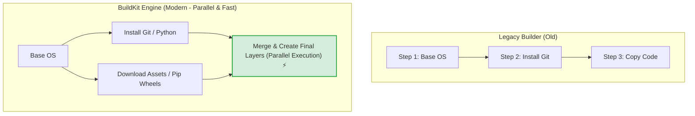
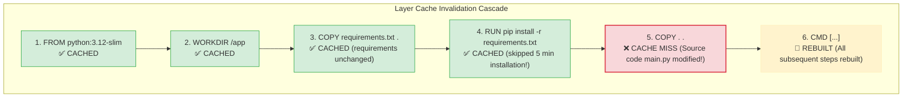

# 🔨 Building Images

## Image Building কী? (What)

**Image Building (ইমেজ বিল্ড করা)** হলো ডকারফাইলে লেখা সমস্ত নির্দেশিকা (`FROM`, `COPY`, `RUN`, `CMD`) এবং আপনার প্রজেক্টের সোর্স কোডকে প্রক্রিয়াজাত করে একটি স্বয়ংসম্পূর্ণ, লেয়ারভিত্তিক এবং এক্সিকিউটেবল **Docker Image** তৈরি করার স্বয়ংক্রিয় প্রক্রিয়া।

এর জন্য ব্যবহৃত মূল কমান্ডটি হলো:
```bash
docker build [OPTIONS] PATH | URL | -
```

সহজ ভাষায়: আপনার কোড এবং ডকারফাইল হলো কাঁচামাল, আর `docker build` হলো সেই কারখানা যা সমস্ত উপাদানকে নিখুঁতভাবে কম্পাইল করে ব্যবহারের উপযোগী একটি রেডিমেড প্যাকেজ বা ইমেজ প্রস্তুত করে।

---

## কেন Image Building মেকানিজম গভীরভাবে বোঝা দরকার? (Why)

```
❌ বিল্ড মেকানিজম না বুঝলে (Before):
   - কোডে মাত্র ১ লাইন পরিবর্তনের পর ইমেজ বিল্ড হতে প্রতিবার ৫-১০ মিনিট বসে থাকতে হয়
   - সিআই/সিডি পাইপলাইনে বিল্ড স্লো হওয়ার কারণে ডেপ্লয়মেন্টে বিলম্ব হয়
   - গিগাবাইট সাইজের অপ্রয়োজনীয় বিল্ড কনটেক্সট ডেমনে পাঠিয়ে মেমরি নষ্ট হয়
   - পুরোনো ক্যাশ আটকে থাকার কারণে নতুন কোডের পরিবর্তন ইমেজে আসে না

✅ বিল্ড মেকানিজম ভালোভাবে জানলে (After):
   - লেয়ার ক্যাশ টেকনিক খাটিয়ে বিল্ড টাইম ৫ মিনিট থেকে নামিয়ে ২ সেকেন্ডে আনা যায়
   - BuildKit এর প্যারালাল এক্সিকিউশন ও ক্যাশ মাউন্ট ব্যবহার করে বিল্ডের গতি ১০ গুণ বাড়ে
   - একাধিক পরিবেশের জন্য আলাদা ডকারফাইল (`Dockerfile.dev`, `Dockerfile.prod`) দিয়ে টার্গেটেড বিল্ড করা যায়
   - প্রোডাকশন ইমেজের সাইজ সর্বনিম্ন ও সিকিউর রাখা যায়
```

---

## Analogy — অটোমেটেড থ্রি-ডি প্রিন্টিং ও অ্যাসেম্বলি লাইন 🖨️🏭

Docker Build প্রসেসকে একটি **আধুনিক হাই-স্পিড 3D প্রিন্টার অথবা গাড়ি তৈরির স্বয়ংক্রিয় রোবোটিক অ্যাসেম্বলি লাইন**-এর সাথে তুলনা করা যায়:

- **Build Context (সোর্স কোড)** = থ্রি-ডি প্রিন্টারে সরবরাহ করা প্লাস্টিক ও কাঁচামাল।
- **Dockerfile** = থ্রি-ডি মডেলের CAD ব্লুপ্রিন্ট।
- **BuildKit Engine** = রোবোটিক প্রিন্টিং হেড।
- **Layer Caching** = প্রিন্টার যদি দেখে যে গাড়ির নিচের ফ্রেমটি আগের মডেলের মতোই হুবহু এক, তবে সে নতুন করে ফ্রেম তৈরি না করে গুদামে থাকা তৈরি ফ্রেমটি টেনে নিয়ে আসে এবং শুধু ওপরের রঙের কোটিংটি নতুন করে স্প্রে করে।

---

## How it Works — Build Context ও BuildKit আর্কিটেকচার

### ১. Build Context কী?
যখন আপনি `docker build -t app .` চালান, তখন কমান্ডের শেষের ডট (`.`) ডকারকে বলে দেয় যে বর্তমান ডিরেক্টরিটি হলো **Build Context**। 

ডকার CLI প্রথমে এই ডিরেক্টরির সমস্ত ফাইলকে একটি টেম্পোরারি `tar` আর্কিভে প্যাক করে ডকার ডেমনের কাছে পাঠায়। ডকার ডেমন শুধুমাত্র এই বিল্ড কনটেক্সটের ভেতরে থাকা ফাইলগুলোই `COPY` বা `ADD` করতে পারে। কনটেক্সটের বাইরের (যেমন `../parent_folder`) কোনো ফাইল ডকার এক্সেস করতে পারে না।

### ২. Docker BuildKit — আধুনিক বিল্ড ইঞ্জিন 🚀
ডকারের আধুনিক বিল্ডার হলো **BuildKit**। আগে ডকার একটার পর একটা ধাপ ধীরগতিতে রান করতো। BuildKit আসার পর:
- একাধিক স্বাধীন লেয়ার **একসাথে সমান্তরালে (Parallel)** বিল্ড হয়
- অব্যবহৃত কোড স্বয়ংক্রিয়ভাবে স্কিপ হয়
- সরাসরি প্যাকেজ ম্যানেজারের ক্যাশ মেমরিতে মাউন্ট করা যায় (`--mount=type=cache`)



---

## The Golden Rules of Layer Caching (ক্যাশ ইনভ্যালিডেশন রুলস) 🧠

ডকার বিল্ডের গতি বাড়ানোর সবচেয়ে বড় ট্রিক হলো **Layer Cache** কীভাবে নষ্ট (Invalidate) হয় তা বোঝা।



### ক্যাশ ধরে রাখা এবং নষ্ট হওয়ার ৩টি মৌলিক নিয়ম:

1. **ফাইল চেঞ্জ চেকিং (`COPY` / `ADD`):** ডকার ফাইলের মডিফিকেশন টাইম দেখে না; এটি ফাইলের ভেতরের কন্টেন্টের **Checksum (Hash)** মিলিয়ে দেখে। যদি ফাইলে ১টি ক্যারেক্টারও বদলায়, তবে ক্যাশ নষ্ট (Cache Miss) হয়।
2. **কমান্ড স্ট্রিং চেকিং (`RUN`):** `RUN apt-get update` এর ক্ষেত্রে ডকার ইন্টারনেটের রিপোজিটরির খবর দেখে না, সে দেখে ডকারফাইলের ঐ লাইনের টেক্সট পরিবর্তিত হয়েছে কিনা।
3. **ক্যাশ ক্যাসকেড ইফেক্ট (Cascade Rule):** যদি কোনো একটি লেয়ারে Cache Miss হয়, তবে তার **পরবর্তী সমস্ত লেয়ারের ক্যাশ স্বয়ংক্রিয়ভাবে অকেজো হয়ে যায়** এবং ডকার বাকি সব ধাপ নতুন করে এক্সিকিউট করে।

:::tip ক্যাশিংয়ের মূল মন্ত্র
ডকারফাইলে যে অংশগুলো **খুব কম পরিবর্তিত হয়** (যেমন বেস ইমেজ, সিস্টেম লাইব্রেরি, `requirements.txt`) সেগুলোকে সবসময় **ডকারফাইলের শুরুর দিকে** রাখুন। আর যে ফাইলগুলো **প্রতি মিনিটে পরিবর্তিত হয়** (আপনার সোর্স কোড) সেগুলোকে **একদম শেষ ধাপে** `COPY` করুন।
:::

---

## Hands-on: প্রয়োজনীয় সমস্ত Build Commands ও Flags

আমাদের **NexGen AI** প্রজেক্টের বিভিন্ন বাস্তব পরিস্থিতিতে বিল্ড কমান্ডগুলো কীভাবে চালাতে হয় তা দেখি:

### ১. সাধারণ বিল্ড ও মাল্টিপল ট্যাগ দেওয়া

একই সাথে ভার্সন ট্যাগ এবং `latest` ট্যাগ দিয়ে বিল্ড করা:

```bash
docker build \
  -t nexgen-api:1.0.0 \
  -t nexgen-api:latest \
  .
```

---

### ২. ভিন্ন নামের ডকারফাইল দিয়ে বিল্ড করা (`-f` বা `--file`)

প্রোডাকশন এবং ডেভেলপমেন্ট এনভায়রনমেন্টের জন্য আলাদা ফাইল থাকলে:

```bash
# Dockerfile.dev দিয়ে লোকাল ডেভেলপমেন্ট ইমেজ বিল্ড করা
docker build -f Dockerfile.dev -t nexgen-api:dev .

# Dockerfile.prod দিয়ে প্রোডাকশন ইমেজ বিল্ড করা
docker build -f Dockerfile.prod -t nexgen-api:prod .
```

---

### ৩. সম্পূর্ণ ফ্রেশ ক্লিন বিল্ড করা (`--no-cache`)

কখনো কখনো লাইব্রেরির নতুন সিকিউরিটি প্যাচ বা লিনাক্স প্যাকেজের একদম লেটেস্ট ভার্সন টানতে পুরোনো কোনো ক্যাশ ব্যবহার না করে স্ক্র্যাচ থেকে বিল্ড করতে হয়:

```bash
# কোনো ক্যাশ ব্যবহার না করে নতুন করে সব ডাউনলোড ও বিল্ড করা
docker build --no-cache -t nexgen-api:fresh .
```

---

### ৪. বেস ইমেজের আপডেট চেক করে বিল্ড করা (`--pull`)

ডকার হাবের বেস ইমেজে (`python:3.12-slim`) কোনো সিকিউরিটি প্যাচ আসলে তা স্বয়ংক্রিয়ভাবে নামিয়ে বিল্ড করা:

```bash
docker build --pull -t nexgen-api:secure .
```

---

### ৫. BuildKit Cache Mount — পাইথন প্যাকেজ ক্যাশিং ⚡

BuildKit-এর একটি অসাধারণ সুপারপাওয়ার হলো **`--mount=type=cache`**। এটি পাইথনের `pip` হুইল ক্যাশ ডকার হোস্টে ধরে রাখে। ফলে ডকারফাইলে কোনো নতুন লাইব্রেরি যোগ করলেও আগের পুরোনো লাইব্রেরিগুলো আর ইন্টারনেট থেকে রি-ডাউনলোড করতে হয় না!

```dockerfile
# Dockerfile (BuildKit Supercharged)
FROM python:3.12-slim
WORKDIR /app
COPY requirements.txt .

# pip ক্যাশ মেমরিতে মাউন্ট করে ইনস্টল (সুপার ফাস্ট!)
RUN --mount=type=cache,target=/root/.cache/pip \
    pip install -r requirements.txt

COPY . .
CMD ["uvicorn", "main:app", "--host", "0.0.0.0", "--port", "8000"]
```

```bash
# BuildKit এনেবল করে বিল্ড করি
DOCKER_BUILDKIT=1 docker build -t nexgen-api:fast .
```

---

## Comparison Table — বিল্ড টেকনিকসমূহের তুলনা

| প্যারামিটার | সাধারণ বিল্ড | `--no-cache` বিল্ড | BuildKit Cache Mount |
|---|---|---|---|
| **বিল্ডের গতি** | ⚡ খুব দ্রুত (ক্যাশ থাকলে) | ⏳ ধীরগতি (সবকিছু স্ক্র্যাচ থেকে ডাউনলোড) | 🚀 **সবচেয়ে দ্রুততম (Near Instant)** |
| **কখন ব্যবহার করবেন** | সাধারণ কোড ডেভেলপমেন্টের সময় | প্রোডাকশন রিলিজের সময় ফ্রেশ ডিপেন্ডেন্সির জন্য | সিআই/সিডি এবং প্যাকেজ ঘনঘন আপডেটের সময় |
| **ইন্টারনেট খরচ** | 0 MB (ক্যাশ হিট হলে) | সম্পূর্ণ প্যাকেজ সাইজ আবার খরচ হয় | শুধুমাত্র নতুন প্যাকেজের সাইজ |

---

## Common Mistakes — নতুনদের সাধারণ ভুল

### ১. অপ্রয়োজনে পুরো ডিরেক্টরি বিল্ড কনটেক্সটে পাঠানো
❌ **ভুল:** যেখানে বড় বড় ডেটাসেট (GBs) বা ভিডিও ফাইল আছে সেই ডিরেক্টরিতে `.dockerignore` ছাড়া `docker build` দেওয়া।
✅ **সঠিক:** বিল্ড কনটেক্সট যত ছোট হবে, বিল্ড তত দ্রুত শুরু হবে।

### ২. `RUN apt-get update` আলাদা লাইনে রাখা
❌ **ভুল:**
```dockerfile
RUN apt-get update
RUN apt-get install -y curl
```
(পরে যদি `curl` এর জায়গায় `wget` যোগ করেন, ডকার `apt-get update` রান না করে ক্যাশ ব্যবহার করবে, ফলে প্যাকেজ ইনস্টল ফেইল করবে)।
✅ **সঠিক:** সবসময় একই লাইনে চেইন করুন: `RUN apt-get update && apt-get install -y wget && rm -rf /var/lib/apt/lists/*`।

### ৩. একাধিক ডকারফাইল ম্যানেজ না করে একটাই ফাইল দিয়ে সব চালানো
❌ **ভুল:** ডেভেলপমেন্টের ডিবাগ টুলস (যেমন hot-reload, debugger) প্রোডাকশন ইমেজে ঢুকিয়ে দেওয়া।
✅ **সঠিক:** `Dockerfile.dev` এবং `Dockerfile.prod` আলাদা রাখুন অথবা মাল্টি-স্টেজ বিল্ড ব্যবহার করুন।

---

## Best Practices

1. **বিল্ড কনটেক্সট মিনিমাইজ করুন**: `.dockerignore` ফাইলে অপ্রয়োজনীয় সব ফাইল বাদ দিন।
2. **লেয়ার সিকোয়েন্স অপ্টিমাইজ করুন**: সবচেয়ে কম পরিবর্তিত ফাইল সবার ওপরে, সবচেয়ে বেশি পরিবর্তিত ফাইল সবার নিচে।
3. **BuildKit এনেবল রাখুন**: আধুনিক ডকারে এটি ডিফল্ট, তবে সিআই/সিডিতে নিশ্চিত করুন `DOCKER_BUILDKIT=1` সেট করা আছে।
4. **ট্যাগিংয়ে সুনির্দিষ্ট ভার্সন ব্যবহার করুন**: `v1.0.0`, গিট কমিট SHA দিয়ে ট্যাগ করুন।

---

## Interview Questions ও Answers

### ১. Docker-এ Build Context কী এবং এটি কেন গুরুত্বপূর্ণ?

**উত্তর:** Build Context হলো সেই লোকাল ফাইল ও ডিরেক্টরিগুলোর সমষ্টি যা `docker build` কমান্ড চালানোর সময় ডকার ক্লায়েন্ট দ্বারা ডকার ডেমন বা বিল্ড ইঞ্জিনে পাঠানো হয় (সাধারণত কমান্ডের শেষের পাথ যেমন `.` দ্বারা নির্ধারিত হয়)।
এটি গুরুত্বপূর্ণ কারণ:
- ডকারফাইলের `COPY` এবং `ADD` নির্দেশিকা শুধুমাত্র এই বিল্ড কনটেক্সটের ভেতরে থাকা ফাইলগুলোই ইমেজ তৈরিতে ব্যবহার করতে পারে।
- যদি বিল্ড কনটেক্সটে অপ্রয়োজনীয় বড় ফাইল (যেমন `node_modules`, `venv`, ভিডিও ফাইল) থাকে, তবে ডকার ডেমনকে গিগাবাইট সাইজের ডেটা ট্রান্সফার করতে হয় যা বিল্ডের গতি মারাত্মকভাবে কমিয়ে দেয়। `.dockerignore` দিয়ে এটি নিয়ন্ত্রণ করা হয়।

---

### ২. Docker Image Build-এ Cache Invalidation Cascade মেকানিজম কীভাবে কাজ করে?

**উত্তর:** ডকার বিল্ডার ডকারফাইলের নির্দেশিকাগুলোকে ক্রমানুসারে লেয়ার বাই লেয়ার প্রসেস করে। যদি কোনো একটি ধাপে পরিবর্তন ধরা পড়ে (যেমন `COPY . .` করার সময় সোর্স কোডে পরিবর্তন হয়েছে), তখন ডকার ঐ নির্দিষ্ট লেয়ারটিতে **Cache Miss** ঘোষণা করে এবং লেয়ারটি নতুন করে তৈরি করে।
ক্যাসকেড রুল অনুযায়ী, **যে লেয়ারটিতে প্রথম Cache Miss হয়, তার পরবর্তী সমস্ত লেয়ারের ক্যাশ স্বয়ংক্রিয়ভাবে অকেজো বা ইনভ্যালিড হয়ে যায়** এবং পরবর্তী সব ধাপ স্ক্র্যাচ থেকে নতুন করে রান হতে বাধ্য হয়। তাই কম পরিবর্তনশীল অংশ শুরুতে রাখা ডকারের মূল নিয়ম।

---

### ৩. `docker build --no-cache` কখন ব্যবহার করা উচিত?

**উত্তর:** 
১. যখন ডকারফাইলের কোনো নির্দেশিকা ক্যাশ হয়ে আছে কিন্তু তার পেছনের রিমোট রিসোর্স আপডেট হয়েছে (যেমন `RUN apt-get update` বা কোনো গিট রিপোজিটরি ক্লোন কমান্ড)।
২. প্রোডাকশন রিলিজের পূর্বে সম্পূর্ণ ফ্রেশ ডিপেনডেন্সি ও লেটেস্ট সিকিউরিটি প্যাচ নিশ্চিত করতে।
৩. ক্যাশ করাপশন জনিত কোনো অপ্রত্যাশিত বিল্ড এরর ডিবাগ করার সময়।

---

### ৪. Docker BuildKit সাধারণ লেগাসি বিল্ডারের চেয়ে কেন সেরা?

**উত্তর:** BuildKit ডকারের আধুনিক বিল্ড ইঞ্জিন যা বেশ কিছু বৈপ্লবিক সুবিধা দেয়:
১. **প্যারালাল বিল্ড:** ডকারফাইলের যেসব স্টেজ একে অপরের ওপর নির্ভরশীল নয় সেগুলোকে একসাথে সমান্তরালে এক্সিকিউট করে।
২. **বিল্ড সিক্রেট মাউন্টিং (`--secret`):** পাসওয়ার্ড বা এসএসএইচ কি ইমেজের লেয়ারে সেভ না করেই বিল্ড টাইমে সুরক্ষিতভাবে ব্যবহার করতে দেয়।
৩. **উন্নত ক্যাশিং (`--mount=type=cache`):** প্যাকেজ ম্যানেজারের (`pip`, `npm`, `apt`) ক্যাশ লোকাল হোস্টে সংরক্ষিত রেখে পরবর্তী বিল্ড চোখের পলকে শেষ করে।
৪. **অব্যবহৃত কোড স্কিপিং:** যেসব স্টেজ চূড়ান্ত ইমেজে প্রয়োজন নেই সেগুলোকে সম্পূর্ণ বাদ দিয়ে দেয়।

---

## Summary

| কমান্ড / কনসেপ্ট | সিনট্যাক্স | কী কাজ করে |
|---|---|---|
| **স্ট্যান্ডার্ড বিল্ড** | `docker build -t app:1.0 .` | কনটেক্সটের ডকারফাইল থেকে ইমেজ বানায় |
| **কাস্টম ফাইল বিল্ড** | `docker build -f Dockerfile.prod -t app .` | নির্দিষ্ট ডকারফাইল ব্যবহার করে |
| **নো-ক্যাশ বিল্ড** | `docker build --no-cache -t app .` | পূর্বের কোনো ক্যাশ ছাড়াই ফ্রেশ বিল্ড করে |
| **লেটেস্ট বেস চেক** | `docker build --pull -t app .` | বেস ইমেজের নতুন ভার্সন থাকলে নামিয়ে নেয় |
| **ক্যাশিং গোল্ডেন রুল** | কম পরিবর্তনশীল ➔ বেশি পরিবর্তনশীল | বিল্ডের গতি সেকেন্ডে নামিয়ে আনে |

---

## পরবর্তী ধাপ

আমরা ইমেজ বিল্ড করা এবং ক্যাশিং মাস্টারি অর্জন করেছি। পরবর্তী টপিকে আমরা দেখব ডকার অপ্টিমাইজেশনের সবচেয়ে শক্তিশালী টেকনিক — **Multi-Stage Builds** (`docker/multi-stage-builds.md`) — যেখানে শিখব কীভাবে ১ গিগাবাইটের একটি ভারী পাইথন/সি-বিল্ড ইমেজকে কাটছাঁট করে মাত্র ৫০ মেগাবাইটের অতি ক্ষুদ্র প্রোডাকশন ইমেজে রূপান্তর করা যায়।
