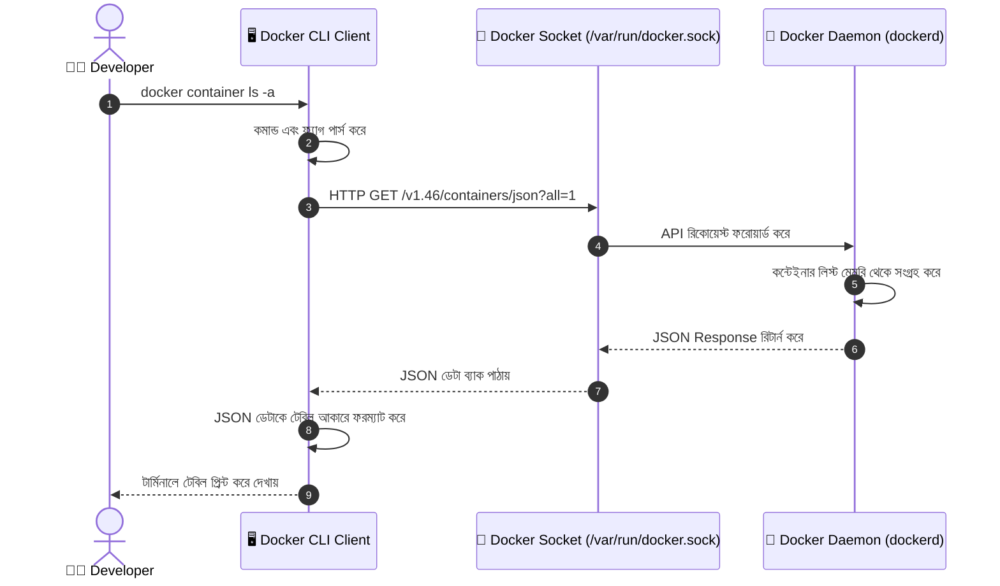

# ⌨️ Docker CLI Basics

## Docker CLI কী? (What)

**Docker CLI (Command Line Interface)** হলো টার্মিনালে টেক্সট কমান্ড লিখে Docker Engine বা Daemon-এর সাথে যোগাযোগ ও নিয়ন্ত্রণ করার মূল মাধ্যম। 

সহজ কথায়: আপনি যখন টার্মিনালে `docker` লিখে কোনো কমান্ড দেন, তখন এই CLI প্রোগ্রামটি আপনার নির্দেশকে বুঝে REST API কলের মাধ্যমে ব্যাকগ্রাউন্ডে চলা **Docker Daemon (dockerd)**-এর কাছে পাঠিয়ে দেয় এবং Daemon থেকে প্রাপ্ত ফলাফল টার্মিনালে সুন্দরভাবে প্রদর্শন করে।

:::info CLI Command-এর সাধারণ কাঠামো
Docker কমান্ডের আধুনিক ফরম্যাট দেখতে সাধারণত এমন হয়:
`docker <management-command> <sub-command> [OPTIONS] [ARGUMENTS]`
যেমন: `docker container run -d -p 8000:8000 python:3.12-slim`
:::

---

## কেন Docker CLI ভালোভাবে শেখা দরকার? (Why)

Docker Desktop-এ GUI (Graphical User Interface) থাকলেও বাস্তব জীবনে প্রফেশনাল DevOps এবং Backend ইঞ্জিনিয়ারদের **CLI জানতেই হয়**।

### GUI বনাম CLI-এর বাস্তব তুলনা

```
❌ শুধু GUI-তে নির্ভরশীল হলে (Before):
   - Remote Linux Production সার্ভারে কোনো GUI থাকে না — সেখানে কাজ করতে পারবেন না
   - CI/CD Pipeline (যেমন GitHub Actions) এ বাটনে ক্লিক করার উপায় নেই, স্ক্রিপ্ট লিখতে CLI লাগে
   - একসাথে অনেকগুলো কন্টেইনার ফিল্টার করা বা জটিল অটোমেশন করা অসম্ভব
   - কাজের গতি কম হয়

✅ Docker CLI আয়ত্তে থাকলে (After):
   - যেকোনো ক্লাউড সার্ভার (AWS EC2, DigitalOcean, VPS) এ কনফিডেন্টলি কাজ করা যায়
   - অটোমেশন ও ব্যাশ স্ক্রিপ্ট তৈরি করে সেকেন্ডে ১০০টি কন্টেইনার ম্যানেজ করা যায়
   - জটিল সমস্যা ফিক্স করার জন্য দ্রুত লগ দেখা ও ইনস্পেক্ট করা যায়
   - Production-ready DevOps ইঞ্জিনিয়ার হওয়ার পথ সুগম হয়
```

---

## Analogy — গাড়ি চালানোর উপমা 🚗

Docker CLI-কে একটি **আধুনিক গাড়ির ড্যাশবোর্ড ও স্টিয়ারিং হুইল**-এর সাথে তুলনা করা যায়:

- **গাড়ির ইঞ্জিন (Engine / Transmission)** = Docker Daemon (যেখানে আসল কাজ ও পাওয়ার জেনারেট হয়)
- **ড্যাশবোর্ড, স্টিয়ারিং ও প্যাডেল (Steering & Pedals)** = Docker CLI (যেটা ড্রাইভার অর্থাৎ আপনি স্পর্শ করেন নির্দেশ দেওয়ার জন্য)
- **CAN Bus / তারের সংযোগ** = Unix Socket / REST API (স্টিয়ারিং ঘোরানোর নির্দেশ ইঞ্জিনে পৌঁছানোর মাধ্যম)

আপনি স্টিয়ারিং ঘোরালে (CLI Command দিলে) মেকানিজমটি ইঞ্জিনে সিগন্যাল পাঠিয়ে চাকা ঘুরিয়ে দেয় (Daemon কন্টেইনার তৈরি করে)।

---

## Docker CLI কীভাবে কাজ করে? (How it Works)

যখন আপনি টার্মিনালে একটি কমান্ড চালান:



---

## CLI Command Syntax — Management Commands বনাম Legacy Commands

Docker CLI-তে কমান্ড লেখার দুটি স্টাইল রয়েছে। আধুনিক ডকারে **Management Commands** স্ট্যান্ডার্ড হিসেবে ব্যবহৃত হয়।

### সিনট্যাক্স পার্থক্য

| অবজেক্ট / কাজ | আধুনিক সিনট্যাক্স (Management Command) | পুরোনো সিনট্যাক্স (Legacy Command) |
|---|---|---|
| কন্টেইনার দেখা | `docker container ls` | `docker ps` |
| কন্টেইনার চালানো | `docker container run` | `docker run` |
| ইমেজ লিস্ট দেখা | `docker image ls` | `docker images` |
| ইমেজ ডিলিট করা | `docker image rm` | `docker rmi` |
| নেটওয়ার্ক দেখা | `docker network ls` | `docker network ls` |
| ভলিউম মুছে ফেলা | `docker volume rm` | `docker volume rm` |

:::tip দুটিই কি কাজ করে?
হ্যাঁ! ব্যাকওয়ার্ড কম্প্যাটিবিলিটির জন্য `docker ps` বা `docker run`-এর মতো পুরোনো শর্টকাটগুলোও সমানভাবে কাজ করে। তবে ইন্টারভিউতে এবং স্ক্রিপ্টে `docker container ...` বা `docker image ...` ব্যবহার করা বেস্ট প্র্যাকটিস হিসেবে ধরা হয়।
:::

---

## প্রাথমিক ও অতি প্রয়োজনীয় কমান্ডসমূহ (Hands-on)

চলুন আমাদের **NexGen AI** প্রজেক্টের ব্যাকগ্রাউন্ড মাথায় রেখে সবচেয়ে গুরুত্বপূর্ণ কমান্ডগুলো বাস্তবে দেখে নিই।

### ১. Docker Engine ও ক্লায়েন্ট তথ্য দেখা

```bash
# ক্লায়েন্ট ও সার্ভারের সংক্ষিপ্ত ভার্সন দেখা
docker version
```

**ব্যাখ্যা:**
- এই কমান্ডটি দেখায় আপনার Docker CLI এবং Docker Daemon দুটোই সফলভাবে রানিং আছে কিনা।

**বাস্তব Output:**
```text
Client: Docker Engine - Community
 Version:           27.1.1
 API version:       1.46
 Go version:        go1.21.12
 Git commit:        6312585
 Built:             Tue Jul 23 19:57:19 2024
 OS/Arch:           linux/amd64

Server: Docker Engine - Community
 Engine:
  Version:          27.1.1
  API version:      1.46 (minimum version 1.24)
  Go version:       go1.21.12
  Git commit:       cc13f95
  Built:            Tue Jul 23 19:57:19 2024
  OS/Arch:          linux/amd64
```

---

```bash
# সিস্টেমের সামগ্রিক রিসোর্স ও স্ট্যাটাস ইনফরমেশন দেখা
docker info
```

**ব্যাখ্যা:**
- মোট কতটি কন্টেইনার আছে (Running, Paused, Stopped), কয়টি ইমেজ ডাউনলোড করা আছে, কোন স্টোরেজ ড্রাইভার (`overlay2`) ব্যবহৃত হচ্ছে — তার সম্পূর্ণ অডিট রিপোর্ট দেয়।

---

### ২. কোনো কমান্ডের সাহায্য পাওয়া (`--help`)

Docker-এ হাজারো ফ্ল্যাগ আছে, সবকিছু মুখস্থ রাখার প্রয়োজন নেই। যেকোনো সময় `--help` ব্যবহার করুন:

```bash
# মূল ডকারের সব কমান্ডের তালিকা দেখতে
docker --help

# নির্দিষ্ট কোনো management command-এর হেল্প দেখতে
docker container --help

# নির্দিষ্ট কোনো সাব-কমান্ডের বিস্তারিত অপশন দেখতে
docker run --help
```

**Output উদাহরণ (`docker container --help`):**
```text
Usage:  docker container COMMAND

Manage containers

Commands:
  attach      Attach local standard input, output, and error streams to a running container
  commit      Create a new image from a container's changes
  cp          Copy files/folders between a container and the local filesystem
  create      Create a new container
  exec        Run a command in a running container
  kill        Kill one or more running containers
  logs        Fetch the logs of a container
  ls          List containers
  pause       Pause all processes within one or more containers
  restart     Restart one or more containers
  rm          Remove one or more containers
  run         Create and run a new container from an image
  start       Start one or more stopped containers
  stop        Stop one or more running containers
  top         Display the running processes of a container
```

---

### ৩. প্রথম ইন্টারঅ্যাক্টিভ পাইথন কন্টেইনার চালানো

আমাদের **NexGen AI** প্রজেক্টটি পাইথন ৩.১২ এবং FastAPI-ভিত্তিক। চলুন টেস্ট করার জন্য একটি লাইটওয়েট পাইথন কন্টেইনার রান করি:

```bash
docker container run -it --name nexgen-test python:3.12-slim python3
```

**কমান্ডের প্রতিটা ফ্ল্যাগের বাংলায় ব্যাখ্যা:**
- `docker container run`: নতুন একটি কন্টেইনার বানিয়ে সাথে সাথে চালু করার কমান্ড।
- `-i` (`--interactive`): কন্টেইনারের Standard Input (STDIN) খোলা রাখে, যাতে আমরা কিবোর্ড থেকে ইনপুট দিতে পারি।
- `-t` (`--tty`): একটি সুসজ্জিত টার্মিনাল স্ক্রিন (Pseudo-TTY) তৈরি করে। (`-i` এবং `-t` একসাথে `-it` লেখা হয়)।
- `--name nexgen-test`: কন্টেইনারটির একটি অর্থপূর্ণ নাম দেয় (নাম না দিলে ডকার র‍্যান্ডম ফানি নাম দেয়)।
- `python:3.12-slim`: ডকার ইমেজের নাম ও ট্যাগ।
- `python3`: কন্টেইনারের ভেতরে চলার জন্য নির্দেশিত কমান্ড (Python REPL ওপেন করবে)।

**বাস্তব Output:**
```text
Unable to find image 'python:3.12-slim' locally
3.12-slim: Pulling from library/python
ec7ef2489e21: Pull complete
0a6f3a763884: Pull complete
Digest: sha256:4f86d63bc3a2ef8b330366b577e8...
Status: Downloaded newer image for python:3.12-slim
Python 3.12.4 (main, Jun 12 2024, 19:20:15) [GCC 12.2.0] on linux
Type "help", "copyright", "credits" or "license" for more information.
>>> print("Hello from NexGen AI Container!")
Hello from NexGen AI Container!
>>> exit()
```

---

### ৪. কন্টেইনারের তালিকা দেখা (`ls` / `ps`)

```bash
# শুধুমাত্র রানিং (চলমান) কন্টেইনার দেখতে
docker container ls

# রানিং এবং বন্ধ (Stopped/Exited) সব কন্টেইনার দেখতে
docker container ls -a
```

**ফ্ল্যাগ ব্যাখ্যা:**
- `-a` (`--all`): যেসব কন্টেইনারের কাজ শেষ হয়ে বন্ধ হয়ে গেছে তাদেরও লিস্টে প্রদর্শন করে।

**বাস্তব Output:**
```text
CONTAINER ID   IMAGE              COMMAND     CREATED         STATUS                     PORTS     NAMES
a1b2c3d4e5f6   python:3.12-slim   "python3"   2 minutes ago   Exited (0) 1 minute ago              nexgen-test
```

**আউটপুট কলাম পরিচিতি:**
- **CONTAINER ID**: কন্টেইনারটির ইউনিক হেক্সাডেসিমেল আইডি (যেমন `a1b2c3d4e5f6`)।
- **IMAGE**: যে ইমেজ থেকে কন্টেইনারটি তৈরি হয়েছে।
- **COMMAND**: কন্টেইনারটি শুরু হওয়ার সময় ভেতরে চলা প্রধান প্রসেস।
- **CREATED**: কতক্ষণ আগে কন্টেইনারটি তৈরি করা হয়েছে।
- **STATUS**: কন্টেইনারের বর্তমান অবস্থা (`Up 5 minutes` বা `Exited (0)` — 0 মানে সফলভাবে বন্ধ হয়েছে)।
- **PORTS**: হোস্ট মেশিনের সাথে পোর্ট ফরওয়ার্ডিং কনফিগারেশন।
- **NAMES**: কন্টেইনারের কাস্টম নাম।

---

### ৫. ডিস্ক স্পেস ব্যবহার দেখা (`docker system df`)

Docker কতটুকু ডিস্ক স্পেস খরচ করছে তা পরীক্ষা করার চমৎকার কমান্ড:

```bash
docker system df
```

**বাস্তব Output:**
```text
TYPE            TOTAL     ACTIVE    SIZE      RECLAIMABLE
Images          2         0         154.2MB   154.2MB (100%)
Containers      1         0         0B        0B (0%)
Local Volumes   0         0         0B        0B
Build Cache     0         0         0B        0B
```

---

## Comparison Table — Top 10 Daily Docker Commands

প্রতিদিনের কাজের জন্য সবচেয়ে জরুরি ১০টি কমান্ড এক নজরে:

| ক্যাটাগরি | কমান্ড | কী কাজ করে |
|---|---|---|
| **Life-cycle** | `docker container run <image>` | ইমেজ থেকে কন্টেইনার বানিয়ে চালু করে |
| **Life-cycle** | `docker container stop <id/name>` | রানিং কন্টেইনারকে নিরাপদে (Gracefully) থামায় |
| **Life-cycle** | `docker container start <id/name>` | বন্ধ থাকা কন্টেইনারকে পুনরায় চালু করে |
| **Listing** | `docker container ls -a` | সব কন্টেইনারের লিস্ট দেখায় |
| **Listing** | `docker image ls` | লোকাল সব ডকার ইমেজের তালিকা দেখায় |
| **Cleanup** | `docker container rm <id/name>` | বন্ধ থাকা কন্টেইনার স্থায়ীভাবে ডিলিট করে |
| **Cleanup** | `docker image rm <image>` | অব্যবহৃত ইমেজ ডিস্ক থেকে মুছে দেয় |
| **Inspection** | `docker container logs <id/name>` | কন্টেইনারের ভেতরের কনসোল আউটপুট/লগ দেখে |
| **Debugging** | `docker container exec -it <id> sh` | রানিং কন্টেইনারের ভেতরে শেল/টার্মিনালে প্রবেশ করে |
| **Purge** | `docker system prune` | সব বন্ধ কন্টেইনার, আনট্যাগড ইমেজ এক ক্লিকে পরিষ্কার করে |

---

## Common Mistakes — নতুনদের সাধারণ ভুল

### ১. Legacy আর Modern কমান্ড একসাথে মিলিয়ে ফেলা
❌ **ভুল:** `docker container rmi python:3.12-slim` (ভুল কারণ `rmi` মূলত `docker rmi` বা `docker image rm`)।
✅ **সঠিক:** অবজেক্ট নির্দিষ্ট করে লিখুন: `docker image rm python:3.12-slim` অথবা সরাসরি শর্টকাট `docker rmi python:3.12-slim`।

### ২. `-a` ফ্ল্যাগ ছাড়া কন্টেইনার না দেখে বিভ্রান্ত হওয়া
❌ **ভুল:** `docker ps` দিয়ে কোনো কন্টেইনার না পেয়ে ভাবা যে কন্টেইনার ডিলিট হয়ে গেছে।
✅ **সঠিক:** অনেক কন্টেইনার কাজ শেষ করে Exit করে যায়। সেগুলো দেখতে সবসময় `docker ps -a` বা `docker container ls -a` দিন।

### ৩. রানিং কন্টেইনারকে সরাসরি `rm` করার চেষ্টা
❌ **ভুল:** রানিং অবস্থায় `docker container rm my-app` দিলে Error দেখাবে: `You cannot remove a running container`.
✅ **সঠিক:** আগে থামান `docker stop my-app`, তারপর `docker rm my-app` করুন। (অথবা ফোর্সফুলি ডিলিট করতে `-f` ফ্ল্যাগ দিন, যা প্রোডাকশনে সতর্কতার সাথে করা উচিত)।

---

## Best Practices

1. **কন্টেইনারের অর্থপূর্ণ নাম দিন (`--name`)**: ডকারের তৈরি করা স্বয়ংক্রিয় র‍্যান্ডম নাম (যেমন `cranky_bohr`, `nervous_pasteur`) ব্যবহার না করে প্রজেক্টের সাথে মিলিয়ে নাম দিন (যেমন `--name nexgen-api-dev`)। এতে পরবর্তীতে ম্যানেজ করা সহজ হয়।

2. **ম্যানেজমেন্ট কমান্ড ফরম্যাট ব্যবহার করার অভ্যাস করুন**: স্ক্রিপ্টিং বা ডকুমেন্টেশন লেখার সময় `docker container run`, `docker image ls` ফরম্যাট ব্যবহার করুন। এটি পড়তে স্পষ্ট এবং আধুনিক স্ট্যান্ডার্ড।

3. **`--help` দেখার অভ্যাস গড়ে তুলুন**: কোনো ফ্ল্যাগ ভুলে গেলে গুগলে সার্চ করার আগেই টার্মিনালে `docker run --help` চালিয়ে দেখে নিন।

4. **অব্যবহৃত কন্টেইনার জমিয়ে রাখবেন না**: টেস্ট শেষে স্টপ হওয়া কন্টেইনার রিমুভ করে ডিস্ক খালি রাখুন।

---

## Interview Questions ও Answers

### ১. `docker container run` এবং `docker container start`-এর মধ্যে পার্থক্য কী?

**উত্তর:** 
- **`docker container run`**: এটি একটি সম্পূর্ণ **নতুন কন্টেইনার তৈরি (Create) করে এবং সাথে সাথে চালু (Start) করে**। এটি একটি নির্দিষ্ট ইমেজ থেকে একদম ফ্রেশ কন্টেইনার ইন্সট্যান্স বানায়।
- **`docker container start`**: এটি পূর্বে তৈরি করা কিন্তু বর্তমানে বন্ধ (Stopped/Exited) অবস্থায় থাকা কোনো **বিদ্যমান কন্টেইনারকে পুনরায় চালু করে**। এটি নতুন কোনো কন্টেইনার বানায় না।

---

### ২. `docker ps` এবং `docker ps -a` কমান্ডের মধ্যে পার্থক্য কী?

**উত্তর:** 
- `docker ps` (বা `docker container ls`): শুধুমাত্র সেই কন্টেইনারগুলো দেখায় যেগুলো বর্তমানে সক্রিয়ভাবে চলছে (Running state-এ আছে)।
- `docker ps -a` (বা `docker container ls -a`): লোকাল মেশিনে থাকা সমস্ত কন্টেইনার দেখায় — তা সে রানিং হোক, পজ করা হোক বা এক্সিট (Stopped) হয়ে বন্ধ থাকা অবস্থায় থাকুক।

---

### ৩. Docker CLI-তে Management Commands আনার কারণ কী ছিল?

**উত্তর:** ডকারের শুরুর দিকে সব কমান্ড ফ্ল্যাট রুটে ছিল (যেমন `docker run`, `docker ps`, `docker images`, `docker rmi`, `docker build`)। কিন্তু ডকার যখন বড় হতে শুরু করে এবং Network, Volume, Plugin, Secret, Config ইত্যাদি নতুন ফিচার আসে, তখন প্রায় ৫০টির বেশি রুট কমান্ড তৈরি হয়ে যায় যা বিশৃঙ্খল ছিল। তাই ডকার ১.১৩ ভার্সন থেকে অবজেক্ট-ভিত্তিক কাঠামোগত সিনট্যাক্স চালু করা হয় (যেমন `docker container <action>`, `docker image <action>`, `docker network <action>`), যা কমান্ডগুলোকে সুশৃঙ্খল ও সহজে শেখার উপযোগী করে তোলে।

---

### ৪. Docker কন্টেইনারের স্ট্যাটাস কোড `Exited (0)` বনাম `Exited (1)` এর অর্থ কী?

**উত্তর:** 
- `Exited (0)`: বোঝায় কন্টেইনারের ভেতরের মূল প্রসেসটি কোনো সমস্যা বা ত্রুটি ছাড়াই সফলভাবে তার কাজ সম্পন্ন করে স্বাভাবিকভাবে বন্ধ হয়েছে (Linux Standard Success Exit Code 0)।
- `Exited (1)` (বা 0 ছাড়া অন্য যেকোনো কোড যেমন 137, 139): নির্দেশ করে যে কন্টেইনারের ভেতরের অ্যাপ্লিকেশন ক্র্যাশ করেছে, এক্সেপশন থ্রো করেছে বা মেমোরি লিমিটের কারণে অপারেটিং সিস্টেম দ্বারা জোরপূর্বক বন্ধ করা হয়েছে।

---

## Summary

| বিষয় | সারসংক্ষেপ |
|---|---|
| **Docker CLI** | Daemon-এর সাথে যোগাযোগ করার টেক্সট-বেসড ইন্টারফেস |
| **সিনট্যাক্স ফরম্যাট** | `docker <management-command> <sub-command> [flags]` |
| **হেল্প কমান্ড** | `docker --help` অথবা `docker <command> --help` |
| **কন্টেইনার দেখা** | `docker container ls` (রানিং), `docker container ls -a` (সব) |
| **কন্টেইনার রান** | `docker container run -it --name <name> <image>` |
| **তথ্য ও স্ট্যাটাস** | `docker version`, `docker info`, `docker system df` |

---

## পরবর্তী ধাপ

আমরা Docker CLI-এর বেসিক সিনট্যাক্স এবং মূল কমান্ডগুলো বুঝে নিয়েছি। পরবর্তী টপিকে আমরা **Working with Docker Images** (`docker/images.md`) নিয়ে আলোচনা করব — যেখানে শিখব ডকার ইমেজ কীভাবে তৈরি হয়, ইমেজ লেয়ার কী, ইমেজ ট্যাগিং এবং কীভাবে ডকার হাব থেকে সঠিক ইমেজ নির্বাচন করতে হয়।
