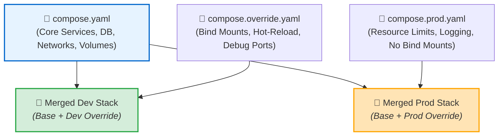

# 🚀 Compose Advanced Features

## ভূমিকা (Introduction)

সাধারণ ডকার কম্পোজ ফাইল ছোট প্রজেক্টের জন্য যথেষ্ট। কিন্তু বড় এন্টারপ্রাইজ প্রজেক্টে একই সাথে লোকাল ডেভেলপমেন্ট, টেস্টিং, স্টেজিং এবং প্রোডাকশন এনভায়রনমেন্ট পরিচালনা করতে হয়। 

প্রতিটি পরিবেশের জন্য সম্পূর্ণ আলাদা আলাদা বড় YAML ফাইল লিখলে কোড ডুপ্লিকেশন হয়। এই সমস্যা সমাধানের জন্য ডকার কম্পোজ বেশ কিছু **অ্যাডভান্সড প্রোডাকশন-গ্রেড ফিচার** সরবরাহ করে:
1. **Variable Interpolation** — ডায়নামিক ভেরিয়েবল ও ফলব্যাক হ্যান্ডলিং (`${VAR:-default}`)
2. **Multiple Compose Files & Overrides** — ফাইল মার্জিং টেকনিক (`compose.override.yaml`, `compose.prod.yaml`)
3. **Compose Profiles** — শর্তসাপেক্ষে টুলস চালু করা (`profiles: ["debug"]`)
4. **Extension Fields & YAML Anchors** — DRY (Don't Repeat Yourself) কোড রি-ইউজ (`&` এবং `<<: *`)

---

## কেন এই অ্যাডভান্সড ফিচারগুলো শেখা দরকার? (Why)

```
❌ অ্যাডভান্সড ফিচার না জানলে (Before):
   - Dev ও Prod এর জন্য ২টি আলাদা ৫০০ লাইনের YAML ফাইল লিখতে হয় (Maintenance Nightmare)
   - PGAdmin বা Debugger এর মতো ভারী টুলস সবসময় চলে প্রোডাকশন মেমরি অপচয় করে
   - এনভায়রনমেন্ট ভেরিয়েবল মিসিং থাকলে কোনো ওয়ার্নিং ছাড়াই সিস্টেম আনপ্রেডিক্টেবল আচরণ করে
   - ১০টি সার্ভিসের কমন কনফিগারেশন (Logging, Labels) বারবার কপি-পেস্ট করতে হয়

✅ অ্যাডভান্সড ফিচার আয়ত্ত করলে (After):
   - ১টি বেস ফাইল এবং ছোট ওভাররাইড ফাইল দিয়ে Dev, Staging ও Prod এক কমান্ডে ম্যানেজ করা যায়
   - Profiles ব্যবহার করে দরকার অনুযায়ী শুধুমাত্র ডেভেলপার মেশিনে PGAdmin চালু করা যায় (`--profile debug`)
   - `${VAR:?Error}` দিয়ে মিসিং ভেরিয়েবল থাকলে বিল্ড শুরুর আগেই এরর থ্রো করানো যায়
   - YAML Anchors (`&base_service`) দিয়ে কোড সাইজ ৬০% কমিয়ে আনা যায়
```

---

## ১. Variable Interpolation (ডায়নামিক ভেরিয়েবল ও ফলব্যাক) 🔤

কম্পোজ ফাইলে সরাসরি হার্ডকোড না করে `.env` ফাইল বা হোস্ট টার্মিনাল থেকে ডায়নামিক ভ্যালু রিড করার জন্য ডকার কম্পোজ ব্যাশ-স্টাইল ইন্টারপোলেশন সমর্থন করে:

| সিনট্যাক্স | অর্থ ও আচরণ | উদাহরণ |
|---|---|---|
| **`${VAR}`** | ভেরিয়েবলের আসল মান বসাবে (না থাকলে ফাঁকা) | `image: python:${PYTHON_VER}` |
| **`${VAR:-default}`** | ভেরিয়েবল আনসেট বা খালি থাকলে **ডিফল্ট মান** নেবে | `ports: ["${PORT:-8000}:8000"]` |
| **`${VAR-default}`** | শুধুমাত্র ভেরিয়েবল আনসেট থাকলে ডিফল্ট নেবে | `environment: [DEBUG=${DEBUG-False}]` |
| **`${VAR:?error_msg}`** | **বাধ্যতামূলক ভেরিয়েবল**: আনসেট থাকলে ডকার এক্সিকিউশন বাতিল করবে! | `POSTGRES_PASSWORD: ${DB_PASS:?DB_PASS is required!}` |

:::tip সিকিউরিটি টিপ
প্রোডাকশন পাসওয়ার্ডের ক্ষেত্রে সবসময় **`${SECRET_KEY:?SECRET_KEY must be set in production!}`** সিনট্যাক্স ব্যবহার করুন। এতে কেউ ভুলবশত পাসওয়ার্ড ছাড়া কম্পোজ রান করলে ডকার অবিলম্বে এরর দিয়ে থেমে যাবে।
:::

---

## ২. Multiple Compose Files & Overrides (পরিবেশ বিভাজন) 📄➕📄

প্রোডাকশন এবং ডেভেলপমেন্ট এনভায়রনমেন্টকে আলাদা করার সবচেয়ে মার্জিত উপায় হলো **Compose File Merging**।



### ক. ডিফল্ট লোকাল ওভাররাইড (`compose.override.yaml`)
ডকার কম্পোজ ডিফল্টভাবে একই ডিরেক্টরিতে থাকা `compose.yaml` এবং **`compose.override.yaml`** ফাইল দুটিকে স্বয়ংক্রিয়ভাবে মার্জ করে নেয়! 
- ডেভেলপার তার লোকাল মেশিনে `compose.override.yaml` ফাইলে Bind Mount ও এক্সট্রা পোর্ট লিখে রাখবে (যা `.gitignore` এ থাকবে)।

### খ. প্রোডাকশন ফাইল মার্জ করা (`-f` চেইনিং)
```bash
# বেস ফাইলের ওপর প্রোডাকশন কনফিগারেশন চাপিয়ে চালানো
docker compose -f compose.yaml -f compose.prod.yaml up -d
```

---

## ৩. Compose Profiles (শর্তসাপেক্ষে সার্ভিস রান করা) 🎭

অনেক সময় কিছু সার্ভিস সবসময় চালানোর দরকার হয় না (যেমন PGAdmin GUI, MailHog, Swagger Editor বা Data Seeder Script)।

`profiles:` অ্যাট্রিবিউট ব্যবহার করে সার্ভিসকে একটি প্রোফাইলের ট্যাগ দেওয়া যায়। সাধারণ `docker compose up` দিলে এই সার্ভিসগুলো চালু হবে না; শুধুমাত্র নির্দিষ্ট প্রোফাইল কল করলেই চালু হবে:

```yaml
services:
  # ১. সবসময় চলবে (Core Service)
  api:
    image: nexgen-api:1.0.0

  # ২. শুধুমাত্র ডিবাগিং প্রোফাইলে চলবে
  pgadmin:
    image: dpage/pgadmin4
    profiles:
      - debug
      - tools
    ports:
      - "5050:80"
```

### প্রোফাইল কমান্ডস:
```bash
# সাধারণ রান (শুধুমাত্র api চলবে, pgadmin বন্ধ থাকবে)
docker compose up -d

# ডিবাগ প্রোফাইল সহ রান (api + pgadmin উভয়ই চলবে!)
docker compose --profile debug up -d

# একাধিক প্রোফাইল এনভায়রনমেন্ট ভেরিয়েবল দিয়ে চালানো
COMPOSE_PROFILES=debug,tools docker compose up -d
```

---

## ৪. Extension Fields ও YAML Anchors (DRY কোড) ⚓

যদি আপনার কম্পোজ ফাইলে ১০টি সার্ভিস থাকে এবং সব সার্ভিসের লগ রোটেশন ও এনভায়রনমেন্ট একই হয়, তবে ডকারের **Extension Fields (`x-`)** এবং **YAML Anchors (`&` ও `<<: *`)** ব্যবহার করে কোড রি-ইউজ করুন:

```yaml
# টপ-লেভেলে কমন টেমপ্লেট ডিফাইন করি (x- দিয়ে শুরু)
x-common-logging: &default-logging
  logging:
    driver: "json-file"
    options:
      max-size: "10m"
      max-file: "3"

x-common-env: &default-env
  ENVIRONMENT: production
  LOG_LEVEL: info

services:
  api:
    image: nexgen-api:1.0.0
    environment:
      <<: *default-env # 🌟 কমন এনভায়রনমেন্ট ইনহেরিট করল
      PORT: 8000
    <<: *default-logging # 🌟 কমন লগিং কনফিগ ইনহেরিট করল

  worker:
    image: nexgen-worker:1.0.0
    environment:
      <<: *default-env
      QUEUE: high_priority
    <<: *default-logging
```

---

## Hands-on: আমাদের প্রজেক্টের সম্পূর্ণ প্রোডাকশন মাল্টি-এনভায়রনমেন্ট সেটআপ

### ১. মূল বেস ফাইল: `compose.yaml`

```yaml
# compose.yaml (Base Configuration)
x-logging: &prod-logging
  logging:
    driver: "json-file"
    options:
      max-size: "10m"
      max-file: "3"

services:
  # FastAPI Application
  api:
    build:
      context: .
      dockerfile: Dockerfile
    restart: unless-stopped
    ports:
      - "${PORT:-8000}:8000"
    environment:
      APP_NAME: "NexGen AI"
      DATABASE_URL: "postgresql://postgres:${DB_PASSWORD:?DB_PASSWORD is required}@db:5432/nexgendb"
    networks:
      - nexgen-net
    depends_on:
      db:
        condition: service_healthy
    <<: *prod-logging

  # PostgreSQL Database
  db:
    image: postgres:16-alpine
    restart: unless-stopped
    environment:
      POSTGRES_DB: nexgendb
      POSTGRES_USER: postgres
      POSTGRES_PASSWORD: ${DB_PASSWORD:?DB_PASSWORD is required}
    volumes:
      - pg_data:/var/lib/postgresql/data
    networks:
      - nexgen-net
    healthcheck:
      test: ["CMD-SHELL", "pg_isready -U postgres -d nexgendb"]
      interval: 10s
      timeout: 5s
      retries: 5
    <<: *prod-logging

  # PGAdmin (Debugging Profile Only)
  pgadmin:
    image: dpage/pgadmin4
    profiles:
      - debug
    environment:
      PGADMIN_DEFAULT_EMAIL: admin@nexgen.ai
      PGADMIN_DEFAULT_PASSWORD: adminpassword
    ports:
      - "5050:80"
    networks:
      - nexgen-net
    depends_on:
      - db

networks:
  nexgen-net:
    driver: bridge

volumes:
  pg_data:
```

---

### ২. প্রোডাকশন ওভাররাইড ফাইল: `compose.prod.yaml`

```yaml
# compose.prod.yaml (Production Hardening Overrides)
services:
  api:
    deploy:
      resources:
        limits:
          cpus: '2.0'
          memory: 1024M
    restart: always

  db:
    deploy:
      resources:
        limits:
          cpus: '4.0'
          memory: 4096M
    restart: always
```

---

### ৩. কনফিগারেশন ভ্যালিডেশন ও প্রোফাইল টেস্ট

```bash
# ১. মিসিং পাসওয়ার্ড দিয়ে টেস্ট করি (এরর দেবে!)
docker compose config
```

**বাস্তব Error Output:**
```text
invalid interpolation format for services.api.environment.DATABASE_URL: 
DB_PASSWORD is required.
```
*(চমৎকার! ভুলবশত পাসওয়ার্ড ছাড়া রান করা বন্ধ হয়ে গেল!)*

```bash
# ২. পাসওয়ার্ড এক্সপোর্ট করে প্রোফাইল ছাড়া রান করি
export DB_PASSWORD="StrongEnterprisePassword#2026"
docker compose up -d
```

**Output:**
```text
[+] Running 3/3
 ✔ Network nexgen-api_nexgen-net  Created
 ✔ Container nexgen-api-db-1      Healthy
 ✔ Container nexgen-api-api-1     Started
```
*(লক্ষ্য করুন: PGAdmin চালু হয়নি!)*

```bash
# ৩. এবার ডিবাগ মোডে PGAdmin সহ রান করি
docker compose --profile debug up -d
```

**Output:**
```text
[+] Running 1/1
 ✔ Container nexgen-api-pgadmin-1  Started
```
*(এখন ব্রাউজারে `http://localhost:5050` এ ঢুকলেই PGAdmin GUI পেয়ে যাবেন!)*

---

## Comparison Table — Advanced Features Cheat Sheet

| ফিচার | সিনট্যাক্স / মেথড | মূল সুবিধা |
|---|---|---|
| **ফলব্যাক ভেরিয়েবল** | `${VAR:-8000}` | মান না থাকলে স্বয়ংক্রিয় ডিফল্ট ভ্যালু নেয় |
| **বাধ্যতামূলক ভেরিয়েবল** | `${VAR:?Error}` | পাসওয়ার্ড মিসিং থাকলে ক্র্যাশ হওয়া বন্ধ করে |
| **প্রোফাইল সুইচ** | `profiles: ["debug"]` | ভারী টুলসকে অপশনাল রাখে (রিসোর্স বাঁচায়) |
| **মাল্টি-ফাইল মার্জ** | `-f base.yml -f prod.yml` | পরিবেশ অনুযায়ী কোড ওভাররাইড |
| **YAML Anchors** | `&anchor` এবং `<<: *anchor` | কোড ডুপ্লিকেশন সম্পূর্ণ বন্ধ করে (DRY) |

---

## Common Mistakes — নতুনদের সাধারণ ভুল

### ১. `compose.override.yaml` গিটহাবে পুশ করে ফেলা
❌ **ভুল:** ডেভেলপারের ব্যক্তিগত লোকাল সেটিংসযুক্ত `compose.override.yaml` গিট কমিট করা (অন্য টিম মেম্বারের কোড ভেঙে যায়)।
✅ **সঠিক:** `.gitignore` এ `compose.override.yaml` রাখুন।

### ২. প্রোফাইল সার্ভিসকে সাধারণ সার্ভিসের ডিপেনডেন্সিতে রাখা
❌ **ভুল:** `api` সার্ভিসে `depends_on: [pgadmin]` রাখা যেখানে `pgadmin` একটি প্রোফাইল সার্ভিস (প্রোফাইল ছাড়া চালালে এরর দেবে)।
✅ **সঠিক:** প্রোফাইল সার্ভিসকে কখনো নন-প্রোফাইল সার্ভিসের ডিপেনডেন্সিতে রাখবেন না।

### ৩. YAML Anchors অন্য ফাইলে ব্যবহার করার চেষ্টা
❌ **ভুল:** এক ফাইলে `&anchor` ডিফাইন করে অন্য ফাইলে `*anchor` কল করা (YAML অ্যাঙ্কর শুধুমাত্র একই ফাইলের ভেতর কাজ করে)।
✅ **সঠিক:** ফাইল ক্রস-শেয়ারিংয়ের জন্য কম্পোজ মার্জিং টেকনিক ব্যবহার করুন।

---

## Best Practices

1. **বাধ্যতামূলক সিক্রেটে `${VAR:?msg}` ব্যবহার করুন**: এটি প্রোডাকশন ভুল রোধের সবচেয়ে আধুনিক ফিল্টার।
2. **ভারী ডিবাগিং টুলসকে সর্বদা প্রোফাইলে রাখুন**: PGAdmin, Swagger, Mailpit, Redis Commander — এগুলোকে `profiles: ["dev", "debug"]` এ রাখুন।
3. **বেস ফাইল এবং ওভাররাইড ফাইল আলাদা রাখুন**: `compose.yaml` (Base), `compose.override.yaml` (Local Dev), `compose.prod.yaml` (Production)।
4. **কনফিগারেশন চেক করতে `docker compose config` চালান**: সমস্ত ভেরিয়েবল সঠিকভাবে রিজলভ হয়েছে কিনা তা নিশ্চিত হন।

---

## Interview Questions ও Answers

### ১. Docker Compose-এ `${VAR:-default}` এবং `${VAR:?error}` এর মধ্যে পার্থক্য কী?

**উত্তর:** 
- **`${VAR:-default}` (Fallback Syntax):** যদি হোস্ট বা `.env` ফাইলে `VAR` ভেরিয়েবলটি সংজ্ঞায়িত না থাকে বা ফাঁকা থাকে, তবে ডকার কম্পোজ কোনো এরর না দিয়ে কোলনের পরের ডিফল্ট মানটি ব্যবহার করে (যেমন পোর্ট ৮০৮০ না থাকলে ডিফল্ট ৮০০০ নেওয়া)।
- **`${VAR:?error}` (Mandatory Validation Syntax):** যদি `VAR` ভেরিয়েবলটি অনুপস্থিত বা ফাঁকা থাকে, তবে ডকার কম্পোজ অবিলম্বে এক্সিকিউশন বাতিল করে এবং কোলনের পরের কাস্টম এরর মেসেজটি টার্মিনালে প্রিন্ট করে। এটি প্রোডাকশনে পাসওয়ার্ড বা এপিআই কি মিসিং হওয়া প্রতিরোধে ব্যবহৃত হয়।

---

### ২. Compose Profiles কী এবং এটি কোন সমস্যার সমাধান করে?

**উত্তর:** Compose Profiles হলো কম্পোজ সার্ভিসের ওপর ট্যাগ যুক্ত করার একটি ফিচার (যেমন `profiles: ["debug"]` বা `profiles: ["monitoring"]`)। 
সাধারণভাবে `docker compose up` দিলে কম্পোজ ফাইলে থাকা সমস্ত সার্ভিস মেমরিতে স্টার্ট হয়ে যায়। কিন্তু কিছু ভারী সহায়ক সার্ভিস (যেমন PGAdmin, Grafana, Jaeger Tracing) সবসময় ব্যাকগ্রাউন্ডে চালিয়ে মেমরি নষ্ট করার প্রয়োজন নেই। Profiles ব্যবহার করলে এই সার্ভিসগুলো অপশনাল অবস্থায় থাকে এবং শুধুমাত্র যখন ডেভেলপার `--profile <name>` উল্লেখ করেন, তখনই সক্রিয় হয়।

---

### ৩. Docker Compose কীভাবে একাধিক Compose File মার্জ করে?

**উত্তর:** ডকার কম্পোজ যখন একাধিক ফাইল চেইন করে রান করা হয় (যেমন `-f compose.yaml -f compose.prod.yaml`), তখন এটি একটি হায়ারার্কিকাল মার্জিং নীতি অনুসরণ করে:
১. **ম্যাপ বা ডিকশনারি ফিল্ড (যেমন `environment`, `labels`):** দুটি ফাইলের কি-ভ্যালু জোড়াগুলো একসাথে মার্জ হয়। দ্বিতীয় ফাইলের মান প্রথম ফাইলের মানকে ওভাররাইড করে।
২. **অ্যারে বা লিস্ট ফিল্ড (যেমন `ports`, `volumes`, `networks`):** দ্বিতীয় ফাইলের নতুন এলিমেন্টগুলো মূল তালিকার সাথে যুক্ত হয়।
৩. **স্কেলার ভ্যালু (যেমন `image`, `restart`, `container_name`):** দ্বিতীয় ফাইলের মান প্রথম ফাইলের মানটিকে সম্পূর্ণ প্রতিস্থাপন করে।

---

### ৪. Docker Compose ফাইলে YAML Extension Fields (`x-`) কেন ব্যবহার করা হয়?

**উত্তর:** YAML স্ট্যান্ডার্ড অনুযায়ী যেসব টপ-লেভেল কি `x-` দিয়ে শুরু হয় (যেমন `x-logging`, `x-env`), ডকার কম্পোজ পার্সার সেগুলোকে কম্পোজের মূল অবজেক্ট না ভেবে কাস্টম টেমপ্লেট হিসেবে গণ্য করে। 
ডেভেলপাররা YAML Anchors (`&`) এবং Aliases (`<<: *`) ব্যবহার করে এই `x-` ব্লকে কমন কনফিগারেশন লিখে রাখেন এবং সার্ভিসগুলোর ভেতরে তা রি-ইউজ করেন। এটি কোড ডুপ্লিকেশন দূর করে এবং ডকার কম্পোজ ফাইলকে DRY (Don't Repeat Yourself) স্ট্যান্ডার্ডে রাখে।

---

## Summary

| ফিচার | উদাহরণ | ভূমিকা |
|---|---|---|
| **ফলব্যাক ভেরিয়েবল** | `${PORT:-8000}` | ডিফল্ট ভ্যালু অ্যাসাইনমেন্ট |
| **বাধ্যতামূলক ভেরিয়েবল** | `${PASS:?Required}` | মিসিং ভেরিয়েবল ব্লকার |
| **প্রোফাইলস** | `profiles: ["debug"]` | অন-ডিমান্ড সার্ভিস অ্যাক্টিভেশন |
| **ফাইল মার্জিং** | `-f base.yml -f prod.yml` | পরিবেশভিত্তিক ওভাররাইড |
| **YAML Anchors** | `&anchor` এবং `<<: *anchor` | DRY কোড রি-ইউজ |

---

## পরবর্তী ধাপ

আমরা সফলভাবে ডকার কম্পোজের সমস্ত অ্যাডভান্সড ফিচার শেষ করে ফেলেছি। পরবর্তী টপিকগুলোতে আমরা ডকার ডেপ্লয়মেন্টের দুটি অত্যন্ত গুরুত্বপূর্ণ স্তম্ভ শিখব — **Container Logs & Debugging** (`docker/container-logs.md`) এবং **Resource Management** (`docker/resource-management.md`)!
