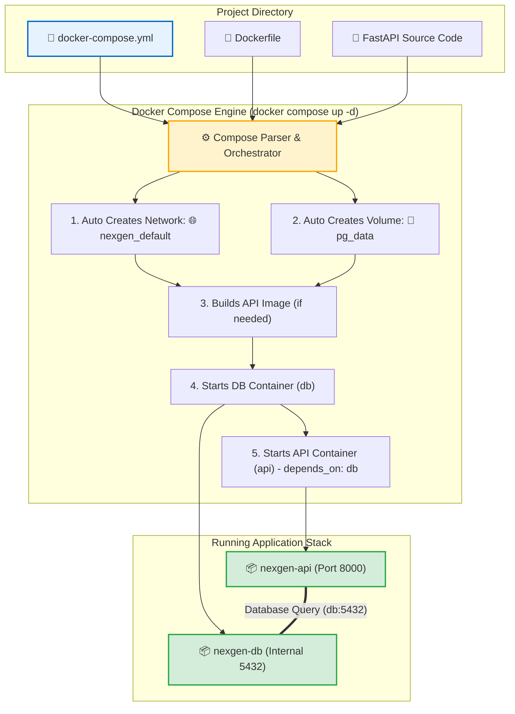

# 🐙 Docker Compose Basics

## Docker Compose কী? (What)

**Docker Compose** হলো একাধিক ডকার কন্টেইনার নিয়ে গঠিত একটি সম্পূর্ণ মাল্টি-কন্টেইনার অ্যাপ্লিকেশনকে (Multi-Container Application) একটি একক **YAML কনফিগারেশন ফাইল** (`docker-compose.yml` বা `compose.yaml`) এর মাধ্যমে এক ক্লিকে সংজ্ঞায়িত, তৈরি, চালানো এবং পরিচালনা করার অফিশিয়াল ডকার অর্কেস্ট্রেশন টুল।

সহজ ভাষায়: ডকারফাইল যেমন **একটিমাত্র ইমেজ** তৈরির রেসিপি, ডকার কম্পোজ হলো আপনার **পুরো প্রজেক্টের সব কন্টেইনার (FastAPI API + PostgreSQL Database + Redis Cache + Nginx + Volumes + Networks)** একসাথে পরিচালনা করার মাস্টার রিমোট কন্ট্রোল!

একটি মাত্র কমান্ডে:
```bash
docker compose up -d
```
আপনার প্রজেক্টের সমস্ত ডাটাবেজ, ভলিউম, ভার্চুয়াল নেটওয়ার্ক এবং ব্যাকএন্ড সার্ভিস নিজে নিজে সঠিক ক্রমে চালু হয়ে যায়।

---

## কেন Docker Compose অপরিহার্য? (Why)

### ট্র্যাডিশনাল CLI কমান্ড বনাম ডকার কম্পোজের তুলনা

```
❌ Docker Compose ছাড়া কাজ করলে (The CLI Nightmare 😩):
   1. নেটওয়ার্ক তৈরি: docker network create nexgen-net
   2. ভলিউম তৈরি: docker volume create nexgen_pgdata
   3. ডাটাবেজ রান: docker run -d --name db --network nexgen-net -v nexgen_pgdata:/var/lib/postgresql/data -e POSTGRES_PASSWORD=secret -e POSTGRES_DB=nexgen postgres:16-alpine
   4. ব্যাকএন্ড বিল্ড: docker build -t nexgen-api:1.0 .
   5. ব্যাকএন্ড রান: docker run -d --name api --network nexgen-net -p 8000:8000 -e DATABASE_URL=postgresql://postgres:secret@db:5432/nexgen nexgen-api:1.0
   6. ক্যাশ রান: docker run -d --name redis --network nexgen-net redis:alpine
   7. 😱 প্রতিবার কাজ শুরু করার সময় এই ৭-৮টি দীর্ঘ কমান্ড টাইপ করতে করতে developer exhausted!

✅ Docker Compose ব্যবহার করলে (Pure Bliss 🌟):
   1. সমস্ত কনফিগারেশন একবার `docker-compose.yml` ফাইলে লিখে রাখলেন
   2. টার্মিনালে লিখলেন: `docker compose up -d`
   3. 🚀 মাত্র ৩ সেকেন্ডে সমস্ত নেটওয়ার্ক, ভলিউম এবং কন্টেইনার স্বয়ংক্রিয়ভাবে চালু হয়ে গেল!
   4. কাজ শেষে সব বন্ধ করতে: `docker compose down`
```

---

## Analogy — সিম্ফনি অর্কেস্ট্রা কন্ডাক্টর ও মাস্টার আর্কিটেক্ট 🎼🏗️

Docker Compose-কে একটি **মিউজিক্যাল সিম্ফনি অর্কেস্ট্রার কন্ডাক্টর (Orchestra Conductor)**-এর সাথে তুলনা করা যায়:

- **Individual Musicians** = আলাদা আলাদা কন্টেইনার (বেহালাবাদক = FastAPI, ড্রামার = PostgreSQL, পিয়ানিস্ট = Redis)।
- **The Musical Score Sheet (স্বরলিপি)** = `docker-compose.yml` ফাইল (যেখানে লেখা আছে কে কখন কীভাবে বাজাবে)।
- **Orchestra Conductor (কন্ডাক্টর)** = Docker Compose।

কন্ডাক্টর তার কাঠি নাড়ালে (`docker compose up`) সমস্ত মিউজিশিয়ানরা একসাথে নিখুঁত সুরে গান গাওয়া শুরু করে। কাউকে আলাদা করে বলতে হয় না কখন শুরু করতে হবে।

---

## How it Works — Compose Orchestration Lifecycle



---

## Compose V1 বনাম Compose V2 (আধুনিক সিনট্যাক্স)

ডকার কম্পোজের দুটি প্রধান সংস্করণ রয়েছে:

| বৈশিষ্ট্য | Compose V1 (Legacy / Old) | Compose V2 (Modern / Current Standard) |
|---|---|---|
| **কমান্ড সিনট্যাক্স** | `docker-compose` (হাইফেন সহ) | **`docker compose` (স্পেস সহ - ডকার সিএলআই প্লাগইন)** |
| **ল্যাঙ্গুয়েজ** | পাইথনে লেখা (Python Standalone) | গো-ল্যাঙ্গুয়েজে (Go) লেখা (সরাসরি ডকার ইঞ্জিনের অংশ) |
| **গতি ও পারফরম্যান্স**| ধীরগতির | ⚡ **অবিশ্বাস্য দ্রুত ও অপ্টিমাইজড** |
| **স্ট্যাটাস** | ❌ Deprecated / বিলুপ্ত | 🌟 **একমাত্র অফিশিয়াল স্ট্যান্ডার্ড** |

:::tip হাইফেন ব্যবহার করবেন না
এখন থেকে টার্মিনালে সবসময় **`docker compose`** (স্পেস দিয়ে) ব্যবহার করবেন।
:::

---

## Hands-on: আমাদের NexGen AI প্রজেক্টের প্রথম `docker-compose.yml`

চলুন আমাদের সম্পূর্ণ **NexGen AI** অ্যাপ্লিকেশনের জন্য একটি প্রোডাকশন-রেডি ডকার কম্পোজ ফাইল তৈরি করি।

### প্রজেক্ট ফোল্ডার স্ট্রাকচার:
```text
nexgen-api/
├── main.py               # FastAPI কোড
├── requirements.txt      # পাইথন ডিপেনডেন্সি
├── Dockerfile            # আমাদের মাল্টি-স্টেজ ডকারফাইল
└── docker-compose.yml    # মাস্টার অর্কেস্ট্রেশন ফাইল
```

---

### `docker-compose.yml` কোড:

```yaml
# ====================================================
# 🐳 NexGen AI - Multi-Container Orchestration
# ====================================================

services:
  # ১. আমাদের FastAPI Backend সার্ভিস
  api:
    build:
      context: .
      dockerfile: Dockerfile
    container_name: nexgen-api-service
    restart: unless-stopped
    ports:
      - "8000:8000"
    environment:
      - APP_NAME=NexGen AI API
      - ENVIRONMENT=development
      - DATABASE_URL=postgresql://postgres:nexgenpassword123@db:5432/nexgendb
    volumes:
      - .:/app # ডেভেলপমেন্ট হট-রিলোডের জন্য বাইন্ড মাউন্ট
    depends_on:
      - db

  # ২. আমাদের PostgreSQL Database সার্ভিস
  db:
    image: postgres:16-alpine
    container_name: nexgen-db-service
    restart: unless-stopped
    environment:
      - POSTGRES_DB=nexgendb
      - POSTGRES_USER=postgres
      - POSTGRES_PASSWORD=nexgenpassword123
    volumes:
      - pg_data:/var/lib/postgresql/data # ডাটা পারসিস্টেন্সের জন্য ভলিউম

# ৩. পারসিস্টেন্ট ভলিউম ঘোষণা
volumes:
  pg_data:
```

#### কনফিগারেশনের প্রতিটি অংশের বাংলা ব্যাখ্যা:
- **`services`**: আমাদের অ্যাপ্লিকেশনের প্রতিটি কন্টেইনারকে সার্ভিস বলা হয় (এখানে `api` এবং `db`)।
- **`build`**: `api` সার্ভিসের জন্য বর্তমান ফোল্ডারের `Dockerfile` থেকে ইমেজ বিল্ড করবে।
- **`depends_on: [db]`**: ডকার নিশ্চিত করবে যে এপিআই চালু হওয়ার আগে যেন ডাটাবেজ কন্টেইনারটি আগে স্টার্ট হয়।
- **`DATABASE_URL`**: লক্ষ্য করুন হোস্ট হিসেবে আমরা সরাসরি সার্ভিসের নাম **`@db:5432`** লিখেছি! ডকার কম্পোজের বিল্ট-ইন DNS স্বয়ংক্রিয়ভাবে এটিকে রেজলভ করবে।
- **`volumes: [pg_data]`**: নিচে ঘোষিত `pg_data` ভলিউমে ডাটাবেজের সমস্ত ডেটা সুরক্ষিত থাকবে।

---

## কম্পোজ পরিচালনার ৫টি মৌলিক কমান্ড 🎮

### ১. সম্পূর্ণ স্ট্যাক ব্যাকগ্রাউন্ডে চালু করা (`up -d`)
```bash
docker compose up -d
```

**বাস্তব Output:**
```text
[+] Running 4/4
 ✔ Network nexgen-api_default      Created                                 0.1s 
 ✔ Volume "nexgen-api_pg_data"     Created                                 0.0s 
 ✔ Container nexgen-db-service     Started                                 0.4s 
 ✔ Container nexgen-api-service    Started                                 0.6s 
```

---

### ২. সমস্ত সার্ভিসের রানিং স্ট্যাটাস দেখা (`ps`)
```bash
docker compose ps
```

**বাস্তব Output:**
```text
NAME                 IMAGE                COMMAND                  SERVICE   CREATED          STATUS          PORTS
nexgen-api-service   nexgen-api-api       "uvicorn main:app --…"   api       30 seconds ago   Up 29 seconds   0.0.0.0:8000->8000/tcp
nexgen-db-service    postgres:16-alpine   "docker-entrypoint.s…"   db        30 seconds ago   Up 29 seconds   5432/tcp
```

---

### ৩. সমস্ত কন্টেইনারের রিয়েল-টাইম লাইভ লগ দেখা (`logs -f`)
```bash
docker compose logs -f
```

**বাস্তব কালারফুল লগ Output:**
```text
nexgen-db-service   | 2024-07-24 13:00:00.123 UTC [1] LOG:  database system is ready to accept connections
nexgen-api-service  | INFO:     Uvicorn running on http://0.0.0.0:8000 (Press CTRL+C to quit)
nexgen-api-service  | INFO:     🚀 NexGen AI Application startup complete.
nexgen-api-service  | INFO:     📦 Connected to PostgreSQL database (db:5432) successfully.
```
*(একটি মাত্র স্ক্রিনেই ডাটাবেজ এবং এপিআই উভয়ের লগ পাশাপাশি দেখা যায়!)*

---

### ৪. ইমেজ রিবিল্ড করে কম্পোজ চালু করা (`up --build`)
যখন আপনি কোড বা ডকারফাইলে কোনো বড় পরিবর্তন করবেন এবং নতুন ইমেজ বিল্ড করে চালাতে চান:
```bash
docker compose up -d --build
```

---

### ৫. সম্পূর্ণ স্ট্যাক নিরাপদে বন্ধ ও ডিলিট করা (`down`)
কাজ শেষে এক ক্লিকে সমস্ত কন্টেইনার ও নেটওয়ার্ক মুছে ফেলতে:
```bash
docker compose down
```

**বাস্তব Output:**
```text
[+] Running 3/3
 ✔ Container nexgen-api-service    Removed                                 0.3s 
 ✔ Container nexgen-db-service     Removed                                 0.2s 
 ✔ Network nexgen-api_default      Removed                                 0.1s 
```
*(লক্ষ্য করুন: কন্টেইনার ও নেটওয়ার্ক রিমুভ হলেও আপনার `pg_data` ভলিউম অক্ষত থাকে!)*

:::danger ভলিউম সহ ডিলিট করতে চাইলে (`-v`)
যদি ডাটাবেজের সমস্ত ডেটাও একেবারে মুছে ফ্রেশ করতে চান:
```bash
docker compose down -v
```
:::

---

## Comparison Table — `docker run` বনাম `docker compose`

| বৈশিষ্ট্য | `docker run` (CLI) | `docker compose` (YAML) |
|---|---|---|
| **কনফিগারেশন ধরন** | কমান্ড লাইনে লম্বা আর্গুমেন্ট (Imperative) | পরিষ্কার স্ট্রাকচার্ড YAML ফাইল (Declarative) |
| **মাল্টি-কন্টেইনার ম্যানেজমেন্ট** | ❌ খুব জটিল ও ভুল হওয়ার ঝুঁকি বেশি | 🌟 **অত্যন্ত সহজ ও এক কমান্ডে সব চলে** |
| **স্বয়ংক্রিয় নেটওয়ার্কিং** | ❌ ম্যানুয়ালি `network create` করতে হয় | ✅ প্রজেক্টের জন্য স্বয়ংক্রিয় ডিফল্ট নেটওয়ার্ক তৈরি করে |
| **ডিপেনডেন্সি অর্ডার** | ❌ ম্যানুয়ালি আগে-পরে স্টার্ট করতে হয় | ✅ `depends_on` দিয়ে স্টার্ট সিকোয়েন্স নিশ্চিত করে |
| **টিম শেয়ারিং** | কমান্ড কপি-পেস্ট করতে হয় | `docker-compose.yml` গিটহাবে শেয়ার করা যায় |

---

## Common Mistakes — নতুনদের সাধারণ ভুল

### ১. YAML ফাইলে ট্যাবের (Tab) ব্যবহার
❌ **ভুল:** YAML ফাইলে ইন্ডেন্টেশনের জন্য `Tab` কি প্রেস করা (YAML ফাইলে ট্যাব অবৈধ, সিনট্যাক্স এরর দেবে)।
✅ **সঠিক:** সবসময় **২টি স্পেস (Spaces)** ব্যবহার করুন। VS Code এ "Indent Using Spaces" অন রাখুন।

### ২. `depends_on` দিলে ডাটাবেজ রেডি হওয়া পর্যন্ত অপেক্ষা করবে ভাবা
❌ **ভুল:** ভাবা যে `depends_on: [db]` দিলে ডাটাবেজের ভেতরের সব টেবিল লোড হওয়া পর্যন্ত এপিআই অপেক্ষা করবে।
✅ **সঠিক:** `depends_on` শুধুমাত্র ডাটাবেজ কন্টেইনারটি স্টার্ট হওয়া নিশ্চিত করে, ডাটাবেজ সার্ভার সম্পূর্ণ রেডি হওয়া পর্যন্ত নয়। (এর জন্য Healthcheck condition ব্যবহার করতে হয়, যা আমরা পরবর্তী টপিকে শিখব)।

### ৩. ফাইলের নাম ভুল করা
❌ **ভুল:** `docker-compose.yaml.txt` বা `dockercompose.yml` লেখা।
✅ **সঠিক:** অফিশিয়াল স্ট্যান্ডার্ড নাম হলো `docker-compose.yml` অথবা আধুনিক `compose.yaml`।

---

## Best Practices

1. **গিটহাবে `docker-compose.yml` কমিট করুন**: এটি আপনার পুরো টিমের জন্য ওয়ান-ক্লিক ডেভেলপমেন্ট এনভায়রনমেন্ট সেটআপ তৈরি করে।
2. **সার্ভিসের নামগুলোকে DNS হোস্ট হিসেবে ব্যবহার করুন**: যেমন `http://api:8000` বা `postgresql://...db:5432`।
3. **এনভায়রনমেন্ট ভেরিয়েবলের জন্য `.env` ফাইল ব্যবহার করুন**: কম্পোজ ফাইলে পাসওয়ার্ড হার্ডকোড না করে `${DATABASE_PASSWORD}` লিখুন।
4. **নিয়মিত `docker compose logs -f` দিয়ে ডিবাগ করুন**: সমস্যা হলে লাইভ লগ দেখুন।

---

## Interview Questions ও Answers

### ১. Docker Compose কী এবং এটি ব্যবহারের প্রধান সুবিধা কী?

**উত্তর:** Docker Compose হলো ডকারের মাল্টি-কন্টেইনার অ্যাপ্লিকেশন তৈরি ও পরিচালনা করার একটি ডিক্লেয়ারেটিভ অর্কেস্ট্রেশন টুল। 
একটি একক `docker-compose.yml` ফাইলের ভেতরে অ্যাপ্লিকেশনের সমস্ত সার্ভিস (যেমন API, Database, Cache, Message Broker), তাদের পোর্ট ম্যাপিং, ভলিউম, এনভায়রনমেন্ট ভেরিয়েবল এবং নেটওয়ার্ক কনফিগারেশন সংজ্ঞায়িত করা থাকে। 
এর প্রধান সুবিধা হলো— একাধিক জটিল ডকার কমান্ড ম্যানুয়ালি না চালিয়ে মাত্র একটি কমান্ড `docker compose up -d` দিয়ে সম্পূর্ণ অ্যাপ্লিকেশন স্ট্যাক স্বয়ংক্রিয়ভাবে এবং সঠিক ক্রমে চালু করা যায়।

---

### ২. Compose V1 এবং Compose V2 এর মধ্যে পার্থক্য কী?

**উত্তর:** 
- **Compose V1:** এটি পাইথন প্রোগ্রামিং ল্যাঙ্গুয়েজে লেখা একটি আলাদা স্ট্যান্ডঅ্যালোন ইউটিলিটি ছিল এবং এটি চালাতে `docker-compose` (হাইফেন সহ) কমান্ড ব্যবহার করা হতো। এটি এখন সম্পূর্ণ ডেপ্রিকেটেড।
- **Compose V2:** এটি গো (Go) ল্যাঙ্গুয়েজে ডকার ইঞ্জিনের বিল্ট-ইন সিএলআই প্লাগইন হিসেবে পুনর্লিখন করা হয়েছে এবং এটি চালাতে `docker compose` (স্পেস সহ) কমান্ড ব্যবহৃত হয়। এটি অনেক দ্রুত, মেমোরি সাশ্রয়ী এবং ডকার সিএলআই-এর সাথে সম্পূর্ণ নিরবচ্ছিন্নভাবে ইন্টিগ্রেটেড।

---

### ৩. `docker compose down` এবং `docker compose down -v` এর মধ্যে পার্থক্য কী?

**উত্তর:** 
- `docker compose down`: এটি শুধুমাত্র কম্পোজ ফাইলে তৈরিকৃত সমস্ত চলমান বা বন্ধ থাকা কন্টেইনার এবং প্রজেক্টের কাস্টম নেটওয়ার্কগুলোকে নিরাপদে থামিয়ে মুছে ফেলে। কিন্তু ডেটাবেজের **ভলিউমগুলোকে সম্পূর্ণ অক্ষত রেখে দেয়** (যাতে ডেটা লস না হয়)।
- `docker compose down -v`: কন্টেইনার ও নেটওয়ার্কের পাশাপাশি কম্পোজ ফাইলে ডিক্লেয়ার করা সমস্ত **ভলিউম এবং ডাটাবেজের সমস্ত ডেটা স্থায়ীভাবে ডিস্ক থেকে মুছে ফেলে**। এটি সম্পূর্ণ ফ্রেশ স্টেট থেকে প্রজেক্ট রিস্টার্ট করার সময় ব্যবহৃত হয়।

---

### ৪. Docker Compose কীভাবে সার্ভিসগুলোর মধ্যে নেটওয়ার্কিং পরিচালনা করে?

**উত্তর:** যখন `docker compose up` চালানো হয়, ডকার কম্পোজ স্বয়ংক্রিয়ভাবে প্রজেক্ট ডিরেক্টরির নাম অনুযায়ী একটি ডেডিকেটেড ইউজার-ডিফাইন্ড ব্রিজ নেটওয়ার্ক (যেমন `<project_dir>_default`) তৈরি করে এবং কম্পোজ ফাইলের সমস্ত সার্ভিস কন্টেইনারকে সেই নেটওয়ার্কে যুক্ত করে।
এর ফলে সার্ভিসগুলো ডকারের ইন্টারনাল ডিএনএস সার্ভারের মাধ্যমে সরাসরি সার্ভিসের নাম (যেমন এপিআই থেকে `db:5432`) ব্যবহার করে কোনো পোর্ট ফরওয়ার্ডিং ছাড়াই একে অপরের সাথে সম্পূর্ণ সুরক্ষিতভাবে যোগাযোগ করতে পারে।

---

## Summary

| কমান্ড | কী কাজ করে |
|---|---|
| `docker compose up -d` | সমস্ত নেটওয়ার্ক, ভলিউম ও কন্টেইনার ব্যাকগ্রাউন্ডে চালু করে |
| `docker compose up -d --build` | নতুন ইমেজ বিল্ড করে সব কন্টেইনার চালু করে |
| `docker compose ps` | কম্পোজ সার্ভিসের স্ট্যাটাস তালিকা দেখে |
| `docker compose logs -f` | সমস্ত সার্ভিসের কম্বাইন্ড লাইভ লগ দেখে |
| `docker compose stop` | কন্টেইনারগুলো ডিলিট না করে শুধু সাময়িক থামায় |
| `docker compose down` | কন্টেইনার ও নেটওয়ার্ক রিমুভ করে (ভলিউম অক্ষত থাকে) |
| `docker compose down -v` | ভলিউম ও ডাটা সহ সব কিছু ডিলিট করে |

---

## পরবর্তী ধাপ

আমরা সফলভাবে ডকার কম্পোজের মূল কনসেপ্ট এবং মাল্টি-কন্টেইনার অর্কেস্ট্রেশন শিখে ফেলেছি। পরবর্তী টপিকে আমরা দেখব **Compose File Structure** (`docker/compose-file.md`) — যেখানে `docker-compose.yml` এর প্রতিটি সেকশন (`services`, `networks`, `volumes`, `configs`, `secrets`), পোর্ট সিনট্যাক্স এবং ভলিউম ডিক্লারেশনের সমস্ত গভীর রুলস শিখব।
