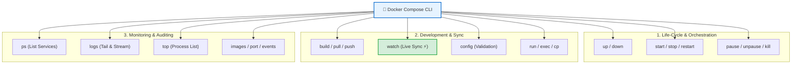

# 📖 Compose Commands Reference

## ভূমিকা (Introduction)

Docker Compose V2-তে আপনার মাল্টি-কন্টেইনার স্ট্যাক পরিচালনা করার জন্য ২০টিরও বেশি শক্তিশালী সাব-কমান্ড রয়েছে। 

এই অধ্যায়টি হলো আপনার প্রতিদিনের ডেভেলপমেন্ট, টেস্টিং এবং সিআই/সিডি পাইপলাইনে ব্যবহারের জন্য **Docker Compose Commands-এর একটি সম্পূর্ণ ও কার্যকরী বাংলা রেফারেন্স হ্যান্ডবুক**।

---

## Docker Compose Commands এর ক্যাটাগরি ম্যাপ 🗺️



---

## গ্লোবাল ফ্ল্যাগসমূহ (Global Project Flags)

যেকোনো কম্পোজ কমান্ডের শুরুতে এই ফ্ল্যাগগুলো ব্যবহার করা যায়:

| গ্লোবাল ফ্ল্যাগ | ব্যবহারিক উদাহরণ | কী কাজ করে |
|---|---|---|
| **`-f` / `--file`** | `docker compose -f compose.prod.yaml up -d` | ডিফল্ট ফাইলের বদলে নির্দিষ্ট কম্পোজ ফাইল ব্যবহার করে |
| **`-p` / `--project-name`** | `docker compose -p nexgen-staging up -d` | প্রজেক্টের কাস্টম প্রিফিক্স নাম নির্ধারণ করে |
| **`--env-file`** | `docker compose --env-file .env.prod up -d` | নির্দিষ্ট এনভায়রনমেন্ট ফাইল লোড করে |
| **`--profile`** | `docker compose --profile debug up -d` | নির্দিষ্ট প্রোফাইলের সার্ভিস চালু করে |

---

## ১. লাইফসাইকেল ও অর্কেস্ট্রেশন কমান্ডসমূহ 🚀

### `docker compose up`
সম্পূর্ণ অ্যাপ্লিকেশন স্ট্যাক তৈরি ও চালু করে।
```bash
# ব্যাকগ্রাউন্ডে চালু করা
docker compose up -d

# জোরপূর্বক ফ্রেশ ইমেজ বিল্ড করে চালু করা
docker compose up -d --build

# নির্দিষ্ট সার্ভিসগুলো ছাড়া চালু করা
docker compose up -d api db
```

---

### `docker compose down`
কন্টেইনার এবং নেটওয়ার্ক থামিয়ে মুছে ফেলে।
```bash
# সাধারণ স্টপ ও রিমুভ (ভলিউম অক্ষত থাকে)
docker compose down

# ভলিউম সহ সমস্ত ডাটা ডিলিট করা
docker compose down -v

# ব্যবহৃত ইমেজগুলো সহ ডিলিট করা
docker compose down --rmi all
```

---

### `docker compose start` / `stop` / `restart`
কন্টেইনার ডিলিট না করে শুধুমাত্র সার্ভিস চালু, বন্ধ বা রিস্টার্ট করা:
```bash
# সমস্ত সার্ভিস সাময়িক বন্ধ করা
docker compose stop

# শুধুমাত্র ডাটাবেজ বন্ধ করা
docker compose stop db

# এপিআই রিস্টার্ট করা
docker compose restart api
```

---

### `docker compose pause` / `unpause`
সার্ভিসগুলোকে মেমরিতে স্থগিত বা পুনরায় সচল করা:
```bash
docker compose pause api
docker compose unpause api
```

---

## ২. ডেভেলপমেন্ট ও ডিবাগিং কমান্ডসমূহ 🛠️

### `docker compose build`
কম্পোজ ফাইলের সমস্ত বা নির্দিষ্ট সার্ভিসের ইমেজ বিল্ড করে:
```bash
# সব সার্ভিসের ইমেজ বিল্ড করা
docker compose build

# কোনো ক্যাশ ছাড়া ফ্রেশ বিল্ড
docker compose build --no-cache api
```

---

### `docker compose config`
কম্পোজ ফাইলের সিনট্যাক্স ভ্যালিডেশন এবং ভেরিয়েবল প্রিভিউ দেখা:
```bash
# ভ্যালিডেট ও রিভল্ভড ফাইল দেখা
docker compose config

# শুধুমাত্র সার্ভিসের নামগুলো প্রিন্ট করা
docker compose config --services

# শুধুমাত্র ভলিউমের তালিকা দেখা
docker compose config --volumes
```

---

### `docker compose watch` (Compose V2 এর নতুন সুপারপাওয়ার ⚡)
Bind Mount ছাড়াই লোকাল কোড এডিট করার সাথে সাথে স্বয়ংক্রিয়ভাবে রানিং কন্টেইনারে ফাইল সিঙ্ক (File Sync) করার আধুনিক ফিচার:

```yaml
# compose.yaml এ কনফিগারেশন:
services:
  api:
    build: .
    develop:
      watch:
        - action: sync
          path: ./app
          target: /app/app
        - action: rebuild
          path: ./requirements.txt
```

```bash
# ফাইল ওয়াচার চালু করা
docker compose watch
```
*(এখন `./app` এ কোড এডিট করলেই ডকার ইনস্ট্যান্ট কন্টেইনারে ফাইল সিঙ্ক করে দেবে, আর `requirements.txt` পরিবর্তন হলে স্বয়ংক্রিয়ভাবে ইমেজ রিবিল্ড করবে!)*

---

### `docker compose exec` বনাম `docker compose run`
```bash
# রানিং কন্টেইনারের ভেতর লাইভ কমান্ড চালানো
docker compose exec db psql -U postgres -d nexgendb

# সম্পূর্ণ নতুন ওয়ান-অফ কন্টেইনার বানিয়ে মাইগ্রেশন চালানো (কাজ শেষে অটো রিমুভ)
docker compose run --rm api alembic upgrade head
```

---

### `docker compose cp`
হোস্ট এবং কম্পোজ সার্ভিসের মধ্যে ফাইল কপি করা:
```bash
# হোস্ট থেকে ডাটাবেজে SQL ফাইল কপি
docker compose cp ./dump.sql db:/tmp/dump.sql

# এপিআই থেকে লগ ফাইল হোস্টে নিয়ে আসা
docker compose cp api:/app/app.log ./local_app.log
```

---

## ৩. মনিটরিং ও অবজারভ্যাবিলিটি কমান্ডসমূহ 📊

### `docker compose ps`
চলমান সার্ভিসগুলোর স্ট্যাটাস, হেলথ ও পোর্ট ম্যাপিং দেখা:
```bash
# সব সার্ভিস দেখা (বন্ধ থাকা সহ)
docker compose ps -a

# শুধুমাত্র সার্ভিসগুলোর কন্টেইনার আইডি দেখা
docker compose ps -q
```

---

### `docker compose logs`
সার্ভিসগুলোর কনসোল আউটপুট লাইভ পর্যবেক্ষণ করা:
```bash
# সব সার্ভিসের লাইভ লগ ফলো করা
docker compose logs -f

# টাইমস্ট্যাম্প সহ নির্দিষ্ট সার্ভিসের শেষ ৫০ লাইন লগ দেখা
docker compose logs -f -t --tail=50 api
```

---

### `docker compose top`
কম্পোজ সার্ভিসের ভেতরে চলমান সমস্ত লিনাক্স ওএস প্রসেস ও মেমরি দেখা:
```bash
docker compose top
```

**বাস্তব Output:**
```text
nexgen-api-app
UID      PID       PPID      C   STIME   TTY   TIME       CMD
appuser  51201     51180     0   13:30   ?     00:00:02   uvicorn main:app --host 0.0.0.0 --port 8000

nexgen-db-postgres
UID      PID       PPID      C   STIME   TTY   TIME       CMD
postgres 51305     51280     0   13:30   ?     00:00:01   postgres
```

---

### `docker compose port`
কোনো সার্ভিসের ইন্টারনাল পোর্ট হোস্টের কোন পোর্টে ম্যাপ হয়েছে তা দ্রুত দেখা:
```bash
docker compose port api 8000
# Output: 0.0.0.0:8000
```

---

### `docker compose images`
কম্পোজ স্ট্যাকে ব্যবহৃত সমস্ত ডকার ইমেজের তালিকা ও সাইজ দেখা:
```bash
docker compose images
```

**বাস্তব Output:**
```text
CONTAINER            REPOSITORY          TAG          IMAGE ID       SIZE
nexgen-api-app       nexgen-api          latest       7f9a2b1c4e6d   134MB
nexgen-db-postgres   postgres            16-alpine    8b3b4f627bb5   379MB
nexgen-cache-redis   redis               7-alpine     2e3f4a5b6c7d   38MB
```

---

### `docker compose events`
সার্ভিসগুলোর ব্যাকগ্রাউন্ড ইভেন্ট (কন্টেইনার ক্রিয়েট, ডাই, স্টপ) রিয়েল-টাইমে স্ট্রিম করা:
```bash
docker compose events
```

---

## Cheat Sheet Table — Top 15 Compose Commands এক নজরে

| কাজ | কমান্ড | শর্ট ডেসক্রিপশন |
|---|---|---|
| **চালু করা** | `docker compose up -d` | সম্পূর্ণ স্ট্যাক ব্যাকগ্রাউন্ডে রান |
| **রিবিল্ড ও রান** | `docker compose up -d --build` | নতুন ইমেজ বিল্ড করে রিস্টার্ট |
| **সম্পূর্ণ বন্ধ** | `docker compose down` | কন্টেইনার ও নেটওয়ার্ক মুছে ফেলা |
| **ভলিউম সহ ক্লিন**| `docker compose down -v` | ডাটা সহ সম্পূর্ণ প্রজেক্ট রিসেট |
| **স্ট্যাটাস** | `docker compose ps` | সার্ভিসের স্বাস্থ্য ও পোর্ট দেখা |
| **লাইভ লগ** | `docker compose logs -f` | রিয়েল-টাইম কনসোল লগ স্ট্রিম |
| **একক রিস্টার্ট** | `docker compose restart <srv>` | নির্দিষ্ট সার্ভিস রিস্টার্ট |
| **লাইভ শেল** | `docker compose exec <srv> sh` | চলমান সার্ভিসের শেলে ঢোকা |
| **মাইগ্রেশন** | `docker compose run --rm <srv> <cmd>`| ওয়ান-টাইম টাস্ক এক্সেকিউশন |
| **ফাইল সিঙ্ক** | `docker compose watch` | লাইভ কোড ওয়াচ ও ইনস্ট্যান্ট সিঙ্ক |
| **কনফিগ চেক** | `docker compose config` | সিনট্যাক্স ভ্যালিডেশন |
| **ফাইল কপি** | `docker compose cp <src> <dest>`| হোস্ট ও কন্টেইনারে ফাইল স্থানান্তর |
| **প্রসেস অডিট** | `docker compose top` | ওএস প্রসেস ও মেমরি পর্যবেক্ষণ |
| **ইমেজ অডিট** | `docker compose images` | স্ট্যাকের সব ইমেজের সাইজ দেখা |
| **কাস্টম ফাইল** | `docker compose -f prod.yml up -d` | বিকল্প কম্পোজ ফাইল দিয়ে রান |

---

## Common Mistakes — নতুনদের সাধারণ ভুল

### ১. প্রজেক্ট ডিরেক্টরির বাইরে থেকে কম্পোজ কমান্ড চালানো
❌ **ভুল:** অন্য ফোল্ডারে বসে `docker compose ps` চালানো (এরর দেবে: `no configuration file provided`).
✅ **সঠিক:** প্রজেক্ট ফোল্ডারে ঢুকুন অথবা `-f /path/to/compose.yaml` ফ্ল্যাগ ব্যবহার করুন।

### ২. `stop` এবং `down` এর পার্থক্য না বোঝা
❌ **ভুল:** কন্টেইনার সাময়িক থামাতে `down` দেওয়া (এতে ভার্চুয়াল নেটওয়ার্ক মুছে যায় এবং আইপি নষ্ট হয়)।
✅ **সঠিক:** সাময়িক পজের জন্য `docker compose stop` এবং প্রজেক্টের কাজ শেষ হলে `docker compose down` ব্যবহার করুন।

### ৩. `docker compose build` দিয়ে ইমেজ বানিয়ে ভাবা যে কন্টেইনার আপডেট হয়েছে
❌ **ভুল:** শুধু `build` দিয়ে কন্টেইনার রিস্টার্ট না করা।
✅ **সঠিক:** নতুন বিল্ড কার্যকর করতে সবসময় **`docker compose up -d --build`** চালান।

---

## Best Practices

1. **সিআই/সিডি পাইপলাইনে `docker compose config -q` ব্যবহার করুন**: এটি কোনো আউটপুট না দিয়ে সাইলেন্টলি কম্পোজ ফাইলের সিনট্যাক্স এরর চেক করে।
2. **প্রোডাকশন ডেপ্লয়মেন্টে নির্দিষ্ট প্রোফাইল বা ফাইল ব্যবহার করুন**: `docker compose -f compose.prod.yaml up -d`।
3. **লগ স্প্যাম রোধে `--tail` ব্যবহার করুন**: `docker compose logs -f --tail=100` দিয়ে অপ্রয়োজনীয় পুরনো লগ বাদ দিন।

---

## Interview Questions ও Answers

### ১. `docker compose up` কমান্ডের পেছনের সম্পূর্ণ এক্সিকিউশন সিকোয়েন্স কী?

**উত্তর:** যখন `docker compose up -d` চালানো হয়:
১. কম্পোজ প্রথমে `compose.yaml` ফাইল পার্স ও ভ্যালিডেট করে।
২. সংজ্ঞায়িত ভলিউমগুলো (`volumes:`) এবং কাস্টম নেটওয়ার্কগুলো তৈরি না থাকলে তৈরি করে।
৩. যে সার্ভিসগুলোতে `build:` রয়েছে সেগুলোর ইমেজ বিল্ড করে (অথবা `image:` থেকে পুল করে)।
৪. `depends_on` এবং হেলথচেক কন্ডিশন অনুযায়ী সঠিক ক্রমানুসারে সার্ভিসগুলোর কন্টেইনার তৈরি করে ব্যাকগ্রাউন্ডে চালু করে।

---

### ২. Docker Compose V2-এর `docker compose watch` ফিচারের মূল সুবিধা কী?

**উত্তর:** `docker compose watch` হলো কম্পোজ ভি২ এর একটি আধুনিক ডেভেলপার এক্সপেরিয়েন্স ফিচার। 
এটি হোস্ট ফাইলের পরিবর্তন রিয়েল-টাইমে নজরদারি (Watch) করে এবং কোনো ফাইল এডিট হলে ডকার ভলিউম বা বাইন্ড মাউন্ট ছাড়াই সরাসরি কন্টেইনারের ভেতরের ফাইলের সাথে নিখুঁতভাবে **Sync** করে দেয়। এছাড়া ডিপেনডেন্সি ফাইলে পরিবর্তন আসলে এটি ব্যাকগ্রাউন্ডে স্বয়ংক্রিয়ভাবে ইমেজ **Rebuild** করে কন্টেইনার রিফ্রেশ করে।

---

### ৩. `docker compose -p <project_name>` ফ্ল্যাগ কেন ব্যবহার করা হয়?

**উত্তর:** ডিফল্টভাবে ডকার কম্পোজ প্রজেক্ট ডিরেক্টরির নামকে প্রজেক্ট নেমস্পেস হিসেবে ব্যবহার করে কন্টেইনার, ভলিউম এবং নেটওয়ার্কের নাম নির্ধারণ করে।
`-p` (Project Name) ফ্ল্যাগ ব্যবহারের মাধ্যমে ডেভেলপার একই মেশিনে এবং একই কম্পোজ ফাইল ব্যবহার করে সম্পূর্ণ আলাদা আইসোলেটেড একাধিক এনভায়রনমেন্ট (যেমন `nexgen-dev`, `nexgen-staging`, `nexgen-feature-branch`) সমান্তরালে কোনো নাম বা পোর্ট সংঘর্ষ ছাড়াই চালাতে পারেন।

---

### ৪. `docker compose down --volumes` বনাম `docker compose down --rmi all` এর কাজ কী?

**উত্তর:** 
- `--volumes` (বা `-v`): কন্টেইনার ও নেটওয়ার্কের পাশাপাশি কম্পোজ ফাইলের মাধ্যমে তৈরিকৃত পারসিস্টেন্ট ডেটা ভলিউমগুলো সম্পূর্ণ মুছে ফেলে।
- `--rmi all`: কন্টেইনার ডিলিট করার পাশাপাশি কম্পোজ ফাইলে ব্যবহৃত সমস্ত কাস্টম বিল্ড এবং ডকার হাব থেকে ডাউনলোড করা ইমেজ লোকাল ডিস্ক থেকে মুছে ফেলে সম্পূর্ণ ডিস্ক স্পেস খালি করে।

---

## Summary

| ক্যাটাগরি | প্রধান কমান্ডসমূহ |
|---|---|
| **স্ট্যাক ম্যানেজমেন্ট** | `up -d`, `down`, `down -v`, `restart` |
| **লাইভ অপারেশন** | `exec`, `run --rm`, `cp`, `watch` |
| **মনিটরিং** | `ps`, `logs -f`, `top`, `images`, `port` |
| **কনফিগ ও অডিট** | `config`, `build --no-cache`, `events` |

---

## পরবর্তী ধাপ

আমরা সফলভাবে ডকার কম্পোজের সমস্ত কমান্ড ও রেফারেন্স আয়ত্ত করে ফেলেছি। পরবর্তী টপিকে আমরা দেখব সম্পূর্ণ এন্ড-টু-এন্ড প্রজেক্ট ইমপ্লিমেন্টেশন — **Docker Compose with Python/FastAPI** (`docker/compose-node.md`) — যেখানে আমাদের **NexGen AI (FastAPI + PostgreSQL Database + Redis In-Memory Cache + Alembic Migration + Healthchecks)** প্রজেক্টটিকে একটি পূর্ণাঙ্গ, রিয়েল-ওয়ার্ল্ড ও প্রোডাকশন-রেডি সিস্টেমে দাঁড় করাব।
