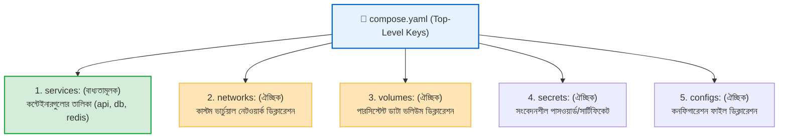
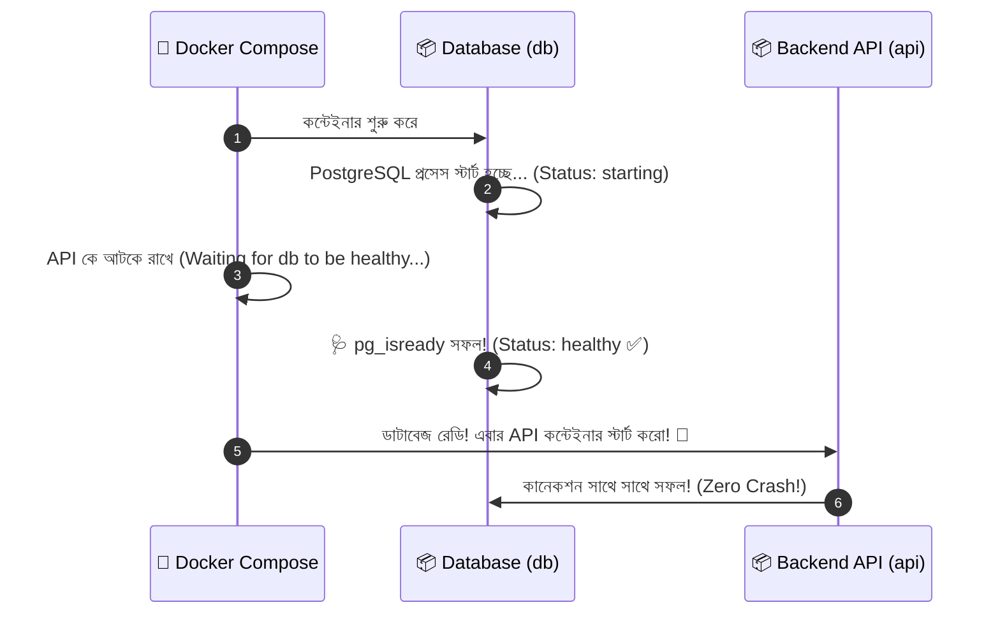

# 🏗️ Compose File Structure

## Compose File কী? (What)

**Compose File** হলো একটি সুসংগঠিত **YAML ফাইল** (ডিফল্ট নাম: `compose.yaml` বা `docker-compose.yml`), যা আধুনিক **The Compose Specification** স্ট্যান্ডার্ড অনুযায়ী একটি সম্পূর্ণ অ্যাপ্লিকেশনের সমস্ত সার্ভিস, নেটওয়ার্ক, ভলিউম, সিক্রেট এবং কনফিগারেশনকে কোড আকারে উপস্থাপন করে।

সহজ ভাষায়: ডকার কম্পোজ ফাইল হলো আপনার প্রজেক্টের **মাস্টার আর্কিটেকচারাল ব্লুপ্রিন্ট**। এতে কাঠামোগতভাবে লেখা থাকে— কোন সার্ভিস কোন ইমেজ থেকে চলবে, তাদের মধ্যে নেটওয়ার্ক সংযোগ কেমন হবে, কোন সার্ভিস কার ওপর নির্ভর করবে, এবং ডেটা কোথায় সেভ হবে।

:::info আধুনিক কম্পোজ ফাইলে `version` ট্যাগ প্রয়োজন নেই!
পূর্বে ডকার কম্পোজ ফাইলের শুরুতে `version: '3.8'` লেখা বাধ্যতামূলক ছিল। আধুনিক **Compose Specification** স্ট্যান্ডার্ডে এই `version:` কি সম্পূর্ণ **অবসলিট (Deprecated / অপ্রয়োজনীয়)** করা হয়েছে। সরাসরি `services:` দিয়ে শুরু করাই বর্তমান ইন্ডাস্ট্রি স্ট্যান্ডার্ড।
:::

---

## কেন Compose File-এর গভীর কাঠামো বোঝা দরকার? (Why)

```
❌ কম্পোজ ফাইলের গভীরতা না জানলে (Before):
   - ডাটাবেজ কন্টেইনার স্টার্ট হলেও ভেতরের PostgreSQL সার্ভার রেডি হওয়ার আগেই এপিআই ক্র্যাশ করে (Race Condition)
   - শর্ট সিনট্যাক্স ও লং সিনট্যাক্সের পার্থক্য না বুঝে জটিল মাউন্ট কনফিগার করতে না পারা
   - এনভায়রনমেন্ট ভেরিয়েবল ওভাররাইড ও `.env` ফাইলের সংযোগ গুলিয়ে ফেলা
   - ভুল ইন্ডেন্টেশনের কারণে `yaml: line 12: mapping values are not allowed` এরর পেয়ে আটকে থাকা

✅ কম্পোজ ফাইল নিখুঁতভাবে আয়ত্ত করলে (After):
   - `depends_on: condition: service_healthy` দিয়ে ডাটাবেজ ১০০% রেডি হওয়ার পরই এপিআই চালু করা যায়
   - সিকিউর মাল্টি-নেটওয়ার্ক আর্কিটেকচার এক ফাইলে সংজ্ঞায়িত করা যায়
   - `docker compose config` দিয়ে সিনট্যাক্স ভ্যালিডেট ও প্রিভিউ করা যায়
   - প্রোডাকশন-রেডি এন্টারপ্রাইজ মাইক্রোসার্ভিস স্ট্যাক ডিজাইন করা যায়
```

---

## Compose File Hierarchy (টপ-লেভেল কি-সমূহ) 🗺️

একটি সম্পূর্ণ Compose ফাইলের শীর্ষস্থানে মূলত **৫টি Top-Level Keys** থাকতে পারে:



---

## Services এর প্রতিটি গুরুত্বপূর্ণ অ্যাট্রিবিউট (Deep Dive)

`services:` সেকশনের অধীনে প্রতিটি সার্ভিসের জন্য নিচের কনফিগারেশনগুলো লেখা হয়:

### ১. `image` বনাম `build`
- **`image`**: ডকার হাব বা রেজিস্ট্রি থেকে রেডিমেড ইমেজ ব্যবহার করতে (যেমন `image: postgres:16-alpine`)।
- **`build`**: লোকাল ডকারফাইল থেকে কাস্টম ইমেজ বিল্ড করতে:
  ```yaml
  build:
    context: .
    dockerfile: Dockerfile
    target: runner
    args:
      APP_ENV: production
  ```

---

### ২. `ports` — শর্ট বনাম লং সিনট্যাক্স

| শর্ট সিনট্যাক্স (Short) | আধুনিক লং সিনট্যাক্স (Long) | সুবিধা |
|---|---|---|
| `ports:`<br>`  - "8000:8000"` | `ports:`<br>`  - target: 8000`<br>`    published: 8000`<br>`    protocol: tcp`<br>`    mode: host` | লং সিনট্যাক্সে প্রোটোকল ও মোড স্পষ্টভাবে নিয়ন্ত্রণ করা যায় |

---

### ৩. `volumes` — শর্ট বনাম লং সিনট্যাক্স

| শর্ট সিনট্যাক্স (Short) | আধুনিক লং সিনট্যাক্স (Long) |
|---|---|
| `volumes:`<br>`  - pg_data:/var/lib/postgresql/data`<br>`  - .:/app:ro` | `volumes:`<br>`  - type: volume`<br>`    source: pg_data`<br>`    target: /var/lib/postgresql/data`<br>`  - type: bind`<br>`    source: .`<br>`    target: /app`<br>`    read_only: true` |

---

### ৪. `environment` বনাম `env_file`
- **`environment`**: সরাসরি ইনলাইন ভেরিয়েবল সেট করতে:
  ```yaml
  environment:
    - DEBUG=True
    - PORT=8000
  ```
- **`env_file`**: `.env` ফাইল থেকে লোড করতে:
  ```yaml
  env_file:
    - .env
    - .env.production
  ```

---

### ৫. `depends_on` with `service_healthy` (The Game Changer 🌟)

সাধারণ `depends_on: [db]` শুধুমাত্র ডাটাবেজ কন্টেইনার স্টার্ট করে, কিন্তু ডাটাবেজ প্রসেসটি রেডি হতে ২-৩ সেকেন্ড সময় নেয়। এই সময়ের মধ্যে এপিআই কানেক্ট করতে গিয়ে ক্র্যাশ করে।

**প্রোডাকশন সমাধান:** ডাটাবেজে `healthcheck` ডিফাইন করে এপিআই-কে নির্দেশ দেওয়া— "যতক্ষণ ডাটাবেজের হেলথ স্ট্যাটাস **`healthy`** না হচ্ছে, ততক্ষণ অপেক্ষা করো":



```yaml
# এপিআই সার্ভিসে কনফিগারেশন:
depends_on:
  db:
    condition: service_healthy
```

---

## Hands-on: আমাদের NexGen AI-এর সম্পূর্ণ প্রোডাকশন `compose.yaml`

চলুন সমস্ত অ্যাট্রিবিউটকে একত্রিত করে আমাদের **NexGen AI (FastAPI + PostgreSQL + Redis + Custom Networks + Volumes + Healthchecks)** এর জন্য একটি এন্টারপ্রাইজ-গ্রেড কম্পোজ ফাইল লিখি:

```yaml
# ====================================================================
# 🐳 NexGen AI Core Architecture - Production Compose Specification
# ====================================================================

services:
  # ----------------------------------------------------
  # 1. FastAPI Application Backend Service
  # ----------------------------------------------------
  api:
    build:
      context: .
      dockerfile: Dockerfile
      target: runner
    container_name: nexgen-api-app
    restart: unless-stopped
    ports:
      - target: 8000
        published: 8000
        protocol: tcp
    environment:
      APP_NAME: "NexGen AI Enterprise Core"
      ENVIRONMENT: "production"
      PORT: 8000
      DATABASE_URL: "postgresql://postgres:nexgenpass123@db:5432/nexgendb"
      REDIS_URL: "redis://cache:6379/0"
    volumes:
      - type: bind
        source: .
        target: /app
    networks:
      - frontend-net
      - backend-net
    depends_on:
      db:
        condition: service_healthy
      cache:
        condition: service_started
    healthcheck:
      test: ["CMD", "curl", "-f", "http://localhost:8000/health"]
      interval: 30s
      timeout: 5s
      retries: 3
      start_period: 10s

  # ----------------------------------------------------
  # 2. PostgreSQL Relational Database Service
  # ----------------------------------------------------
  db:
    image: postgres:16-alpine
    container_name: nexgen-db-postgres
    restart: unless-stopped
    environment:
      POSTGRES_DB: nexgendb
      POSTGRES_USER: postgres
      POSTGRES_PASSWORD: nexgenpass123
    volumes:
      - type: volume
        source: pg_data
        target: /var/lib/postgresql/data
    networks:
      - backend-net
    healthcheck:
      test: ["CMD-SHELL", "pg_isready -U postgres -d nexgendb"]
      interval: 10s
      timeout: 5s
      retries: 5
      start_period: 5s

  # ----------------------------------------------------
  # 3. Redis In-Memory Cache Service
  # ----------------------------------------------------
  cache:
    image: redis:7-alpine
    container_name: nexgen-cache-redis
    restart: unless-stopped
    command: ["redis-server", "--appendonly", "yes"]
    volumes:
      - redis_data:/data
    networks:
      - backend-net

# ====================================================================
# 🌐 Networks Definition (Network Segmentation)
# ====================================================================
networks:
  frontend-net:
    driver: bridge
  backend-net:
    driver: bridge
    internal: true # বাইরের ট্রাফিক থেকে ডাটাবেজ ও ক্যাশ ১০০% আইসোলেটেড!

# ====================================================================
# 💾 Persistent Volumes Definition
# ====================================================================
volumes:
  pg_data:
    driver: local
  redis_data:
    driver: local
```

---

## কম্পোজ কনফিগারেশন ভ্যালিডেশন (`docker compose config`)

ফাইল রান করার আগে কোনো সিনট্যাক্স এরর বা এনভায়রনমেন্ট মিসিং আছে কিনা তা চেক করার সেরা কমান্ড:

```bash
docker compose config
```

**বাস্তব Output:**
```yaml
name: nexgen-api
services:
  api:
    build:
      context: /home/user/nexgen-api
      dockerfile: Dockerfile
      target: runner
    networks:
      backend-net: null
      frontend-net: null
    ...
```
*(এটি ভ্যালিডেশন সফল হলে সম্পূর্ণ রিভল্ভড কনফিগারেশন প্রিন্ট করে। কোনো সিনট্যাক্স এরর থাকলে লাইন নম্বরসহ এরর দেখায়।)*

---

## স্ট্যাক চালু ও হেলথ চেক পর্যবেক্ষণ

```bash
# স্ট্যাক চালু করি
docker compose up -d
```

**বাস্তব Output:**
```text
[+] Running 6/6
 ✔ Network nexgen-api_backend-net   Created                                 0.1s 
 ✔ Network nexgen-api_frontend-net  Created                                 0.1s 
 ✔ Volume "nexgen-api_pg_data"      Created                                 0.0s 
 ✔ Volume "nexgen-api_redis_data"   Created                                 0.0s 
 ✔ Container nexgen-db-postgres     Healthy                                 5.2s 
 ✔ Container nexgen-api-app         Started                                 5.4s 
```
*(লক্ষ্য করুন: ডকার ডাটাবেজ `Healthy` হওয়া পর্যন্ত অপেক্ষা করে তবেই `nexgen-api-app` স্টার্ট করেছে!)*

---

## Common Mistakes — নতুনদের সাধারণ ভুল

### ১. `internal: true` নেটওয়ার্কে এপিআই পোর্ট এক্সপোজ করার চেষ্টা
❌ **ভুল:** যে নেটওয়ার্ককে `internal: true` করা হয়েছে তাতে এপিআই পোর্ট দিয়ে বাইরে থেকে কানেক্ট হতে চাওয়া (ইন্টারনাল নেটওয়ার্ক বাইরের সাথে কানেকশন ব্লক করে)।
✅ **সঠিক:** এপিআই-কে পাবলিক `frontend-net` এবং প্রাইভেট `backend-net` উভয়েই রাখুন; ডাটাবেজকে শুধু `backend-net` এ রাখুন।

### ২. `depends_on` এ সাধারণ লিস্ট ব্যবহার করে ক্র্যাশ খাওয়া
❌ **ভুল:** `depends_on: [db]` লিখে ডাটাবেজ কানেকশন এরর পাওয়া।
✅ **সঠিক:** সবসময় `condition: service_healthy` ব্যবহার করুন।

### ৩. পাসওয়ার্ড কোটেশন ছাড়াই হার্ডকোড করা
❌ **ভুল:** পাসওয়ার্ডে বিশেষ ক্যারেক্টার (যেমন `#`, `:`) থাকলে কোটেশন না দেওয়া (YAML কমেন্ট হিসেবে ভুল পার্স করে)।
✅ **সঠিক:** সবসময় কোটেশন ব্যবহার করুন: `POSTGRES_PASSWORD: "mypass#123"`.

---

## Best Practices

1. **সর্বদা `docker compose config` দিয়ে সিনট্যাক্স টেস্ট করুন**: ডেপ্লয়মেন্টের পূর্বে এটি ত্রুটি দূর করে।
2. **ডাটাবেজের জন্য `pg_isready` হেলথচেক ব্যবহার করুন**: এটি রেস কন্ডিশন (Race Condition) বন্ধ করে।
3. **লং সিনট্যাক্স ব্যবহার করুন**: টিম প্রজেক্টে `ports` এবং `volumes` এর লং সিনট্যাক্স কোড রিডাবিলিটি বাড়ায়।
4. **প্রজেক্টের সার্ভিসগুলোর রোল অনুযায়ী নাম দিন**: যেমন `api`, `db`, `cache`, `worker`।

---

## Interview Questions ও Answers

### ১. Docker Compose ফাইলে `depends_on` এর সাথে `condition: service_healthy` কেন ব্যবহার করা আবশ্যক?

**উত্তর:** 
ডিফল্টভাবে `depends_on: [db]` শুধুমাত্র নির্দেশ করে যে এপিআই কন্টেইনারটি স্টার্ট হওয়ার পূর্বে ডাটাবেজ কন্টেইনারটি ওএস লেভেলে শুরু হতে হবে। কিন্তু কন্টেইনার শুরু হলেও ভেতরের PostgreSQL বা MySQL সার্ভার ইনিশিয়ালাইজ হতে এবং কানেকশন গ্রহণের জন্য প্রস্তুত হতে ৫-১০ সেকেন্ড সময় নেয়। এর ফলে এপিআই ডাটাবেজে কানেক্ট করতে গিয়ে `Connection Refused` এরর দিয়ে ক্র্যাশ করে।
`condition: service_healthy` ব্যবহার করলে ডকার কম্পোজ ডাটাবেজের `healthcheck` কমান্ড সফল (Healthy) না হওয়া পর্যন্ত এপিআই-কে আটকে রাখে। ডাটাবেজ ১০০% রেডি হলেই কেবল এপিআই স্টার্ট হয়, যা সার্ভিস ক্র্যাশ সম্পূর্ণ রোধ করে।

---

### ২. Docker Compose Specification এ শর্ট সিনট্যাক্স বনাম লং সিনট্যাক্সের সুবিধা কী?

**উত্তর:** 
- **শর্ট সিনট্যাক্স (যেমন `- "8000:8000"` বা `- pg_data:/data`):** এটি সংক্ষিপ্ত ও দ্রুত লেখার জন্য ভালো, তবে এতে সূক্ষ্ম প্যারামিটার কন্ট্রোল করা যায় না।
- **লং সিনট্যাক্স (যেমন `type: volume, source: ..., target: ...`):** এটি অনেক বেশি স্ট্রাকচার্ড এবং স্পষ্ট। এর মাধ্যমে মাউন্ট টাইপ (`bind`, `volume`, `tmpfs`), বাইন্ড প্রপাগেশন, রিড-অনলি মোড, পোর্ট প্রোটোকল (`tcp/udp`) এবং হোস্ট মোড অত্যন্ত নিখুঁতভাবে সংজ্ঞায়িত করা যায়।

---

### ৩. Compose ফাইলে `networks` এ `internal: true` ফ্ল্যাগের কাজ কী?

**উত্তর:** যখন কোনো কাস্টম নেটওয়ার্কে `internal: true` কনফিগার করা হয়, তখন ডকার ইঞ্জিন ঐ নেটওয়ার্কে কোনো ডিফল্ট গেটওয়ে বা এক্সটার্নাল রাউটিং তৈরি করে না। 
এর ফলে ঐ নেটওয়ার্কে যুক্ত কন্টেইনারগুলো (যেমন আমাদের ডাটাবেজ ও রেডিস) শুধুমাত্র নিজেদের মধ্যে যোগাযোগ করতে পারে, কিন্তু বাইরের ইন্টারনেটের সাথে বা হোস্টের বাইরের কোনো আইপির সাথে সরাসরি কোনো যোগাযোগ করতে পারে না। এটি ডাটাবেজের জন্য সর্বোচ্চ নিরাপত্তা নিশ্চিত করে।

---

### ৪. `docker compose config` কমান্ডটি মূলত কী কাজ করে?

**উত্তর:** `docker compose config` কমান্ডটি কম্পোজ ফাইলের সিনট্যাক্স ভ্যালিডেশন করে। 
এটি সমস্ত ডিক্লেয়ার করা ভেরিয়েবল ও `.env` ফাইলের মানগুলোকে প্রতিস্থাপন (Interpolate) করে কম্পোজ ফাইলের চূড়ান্ত রূপটি টার্মিনালে প্রদর্শন করে। কোনো ফিল্ড বা ইন্ডেন্টেশনে ভুল থাকলে এটি বিল্ড করার আগেই এরর নোটিফাই করে।

---

## Summary

| সেকশন / কি | ভূমিকা | উদাহরণ |
|---|---|---|
| **`services`** | কন্টেইনার সার্ভিসের তালিকা | `api`, `db`, `cache` |
| **`networks`** | কাস্টম নেটওয়ার্কিং ও সেগমেন্টেশন | `internal: true` |
| **`volumes`** | পারসিস্টেন্ট স্টোরেজ ডিক্লারেশন | `pg_data: driver: local` |
| **`depends_on`** | হেলথ-অ্যাওয়ার স্টার্ট সিকোয়েন্স | `condition: service_healthy` |
| **`healthcheck`** | সার্ভিসের আসল স্বাস্থ্য পরীক্ষা | `pg_isready` / `curl` |
| **ভ্যালিডেশন** | সিনট্যাক্স অডিট | `docker compose config` |

---

## পরবর্তী ধাপ

আমরা সফলভাবে ডকার কম্পোজ ফাইলের গভীর আর্কিটেকচার এবং প্রোডাকশন কনফিগারেশন শিখে ফেলেছি। পরবর্তী টপিকে আমরা দেখব **Multi-Container Management with Compose** (`docker/compose-multi.md`) — যেখানে শিখব কীভাবে রানিং কম্পোজ স্ট্যাক স্কেল করা (`--scale`), সার্ভিস রিস্টার্ট, নির্দিষ্ট সার্ভিসের ভেতর `exec` করা এবং প্রোডাকশন লগ অ্যানালাইসিস করতে হয়।
