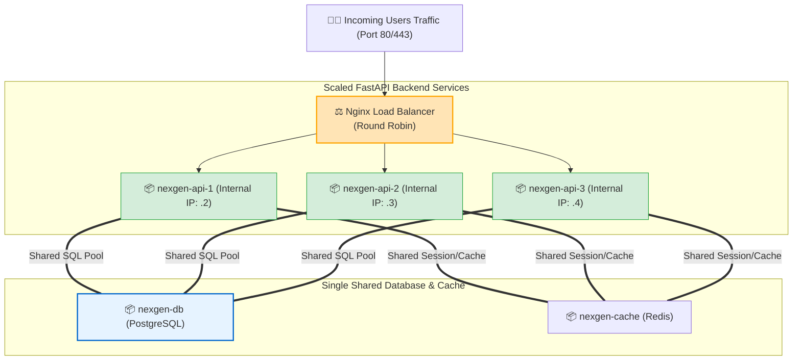

# 🤹 Multi-Container with Compose

## Multi-Container Management কী? (What)

**Multi-Container Management with Compose** হলো ডকার কম্পোজ স্ট্যাকের ভেতরের সার্ভিসগুলোকে একটি সম্পূর্ণ ইউনিট হিসেবে পরিচালনার পাশাপাশি **নির্দিষ্ট কোনো একটি সার্ভিসকে আলাদাভাবে স্কেল করা (Scaling), রিস্টার্ট করা, ডিবাগ করা বা ওয়ান-টাইম মাইগ্রেশন টাস্ক চালানোর** অ্যাডভান্সড অপারেশনাল কৌশল।

বাস্তব জীবনে যখন আমাদের **NexGen AI** অ্যাপ্লিকেশনে ট্রাফিক বেড়ে যায়, তখন আমরা পুরো ডাটাবেজ বা ক্যাশ না ছুঁয়ে শুধুমাত্র **FastAPI API সার্ভিসকে ১টি থেকে বাড়িয়ে ৩টি বা ৫টি কন্টেইনারে হরাইজন্টালি স্কেল (`--scale api=3`)** করি। অথবা ডাটাবেজ মাইগ্রেশন স্ক্রিপ্ট চালানোর জন্য একটি ওয়ান-অফ কন্টেইনার রান করি।

---

## কেন Multi-Container অপারেশন আয়ত্ত করা দরকার? (Why)

```
❌ বেসিক কম্পোজ কমান্ডে আটকে থাকলে (Before):
   - কোডে সামান্য পরিবর্তন হলে পুরো ডাটাবেজ ও ক্যাশ সহ সব সার্ভিস ডাউন করে আবার `up` দিতে হয় (Downtime!)
   - ট্রাফিক বাড়লে সার্ভিসের একাধিক কপি কীভাবে সমান্তরালে চালাতে হবে তা জানা থাকে না
   - ডাটাবেজ মাইগ্রেশন চালাতে গিয়ে লাইভ রানিং এপিআই সার্ভিসের সাথে কনফ্লিক্ট বাধে
   - পোর্ট কনফ্লিক্টের কারণে `--scale` কমান্ড ফেইল করে

✅ অ্যাডভান্সড মাল্টি-কন্টেইনার ম্যানেজমেন্ট জানলে (After):
   - `--no-deps` দিয়ে ডাটাবেজ বন্ধ না করেই শুধুমাত্র এপিআই সার্ভিস আপডেট ও রিবিল্ড করা যায়
   - `--scale api=3` দিয়ে পলকের মধ্যে ৩ গুণ ট্রাফিক হ্যান্ডল করার সক্ষমতা তৈরি হয়
   - `docker compose run --rm` দিয়ে নিরাপদে ওয়ান-টাইম ডাটাবেজ মাইগ্রেশন চালানো যায়
   - প্রোডাকশন সিস্টেমকে ২৪/৭ জিরো-ডাউনটাইমে রাখা যায়
```

---

## Horizontal Scaling Architecture — লোড ব্যালান্সিং প্যাটার্ন ⚖️

যখন আমরা `docker compose up -d --scale api=3` চালাই, কম্পোজ আমাদের `api` সার্ভিসের হুবহু ৩টি আলাদা কন্টেইনার (`api-1`, `api-2`, `api-3`) চালু করে। সামনে একটি Nginx লোড ব্যালান্সার বসিয়ে ট্রাফিক ৩টির মধ্যে সমানভাবে ভাগ করে দেওয়া হয়:



---

## Hands-on: মাল্টি-কন্টেইনার পরিচালনার গুরুত্বপূর্ণ কৌশলসমূহ

আমাদের **NexGen AI** প্রজেক্ট দিয়ে প্রতিটি বাস্তব অপারেশন ধাপে ধাপে অনুশীলন করি:

### ১. নির্দিষ্ট একটি সার্ভিস রিস্টার্ট বা আপডেট করা (`--no-deps`)

ধরুন আপনি `main.py` এপিআই কোডে পরিবর্তন করেছেন। আপনি চান ডাটাবেজ ও ক্যাশ অক্ষত থাকবে, শুধুমাত্র এপিআই সার্ভিসটি নতুন করে রিবিল্ড হয়ে রিস্টার্ট হবে:

```bash
# শুধুমাত্র 'api' সার্ভিসটি রিবিল্ড করে রিস্টার্ট করা (জিরো ডাটাবেজ ইন্টারাপশন)
docker compose up -d --no-deps --build api
```

**ফ্ল্যাগ ব্যাখ্যা:**
- `--no-deps`: ডকারকে নির্দেশ দেয় যে `api` এর সাথে যুক্ত ডিপেনডেন্ট সার্ভিসগুলো (`db`, `cache`) রিস্টার্ট করার দরকার নেই।

**বাস্তব Output:**
```text
[+] Running 1/1
 ✔ Container nexgen-api-app  Recreated                                0.6s
```

---

### ২. ওয়ান-টাইম টাস্ক ও ডাটাবেজ মাইগ্রেশন (`docker compose run`)

ডাটাবেজ মাইগ্রেশন স্ক্রিপ্ট (Alembic / Django Migrate) চালানোর জন্য রানিং সার্ভিসের ভেতর না ঢুকে একটি ওয়ান-অফ কন্টেইনার চালানো স্ট্যান্ডার্ড:

```bash
# Alembic ডাটাবেজ মাইগ্রেশন চালানো (কাজ শেষে অটো ডিলিট)
docker compose run --rm api python -m alembic upgrade head
```

```bash
# অথবা ওয়ান-টাইম ব্যাকআপ নেওয়া
docker compose run --rm api python -c "print('Testing one-off DB Connection')"
```

---

### ৩. রানিং সার্ভিসের ভেতরে ইন্টারঅ্যাকশন (`docker compose exec`)

ডকার কম্পোজে কন্টেইনারের লম্বা আইডি মুখস্থ রাখতে হয় না; সরাসরি **সার্ভিসের নাম** দিয়ে `exec` করা যায়:

```bash
# সরাসরি ডাটাবেজ সার্ভিসে psql ওপেন করা
docker compose exec db psql -U postgres -d nexgendb
```

```bash
# এপিআই সার্ভিসের ব্যাশ শেলে লগইন করা
docker compose exec api sh
```

```bash
# এক লাইনে সম্পূর্ণ ডাটাবেজ ব্যাকআপ নেওয়া (হোস্টে .sql ফাইলে)
docker compose exec -T db pg_dump -U postgres nexgendb > nexgen_compose_backup.sql
```
*(লক্ষ্য করুন: `-T` ফ্ল্যাগ TTY ডিসেবল করে, যা পাইপ করে ফাইলে ডাম্প করার জন্য পারফেক্ট!)*

---

### ৪. সার্ভিস হরাইজন্টাল স্কেলিং (`--scale`) 🚀

আমাদের এপিআই সার্ভিসকে ৩টি কন্টেইনারে স্কেল করার জন্য প্রথমে `compose.yaml` এ পোর্ট রেঞ্জ দিতে হয় (যাতে পোর্ট কনফ্লিক্ট না হয়):

```yaml
# compose.yaml এ পোর্ট ডাইনামিক রেঞ্জে রাখা:
services:
  api:
    build: .
    ports:
      - "8000-8005:8000" # হোস্টের 8000 থেকে 8005 পর্যন্ত যেকোনো পোর্টে বসবে
```

```bash
# এপিআই সার্ভিসকে ৩টি কন্টেইনারে স্কেল করি
docker compose up -d --scale api=3
```

**বাস্তব Output:**
```text
[+] Running 4/4
 ✔ Container nexgen-api_backend-net  Running                             0.0s 
 ✔ Container nexgen-api-api-1        Started                             0.5s 
 ✔ Container nexgen-api-api-2        Started                             0.6s 
 ✔ Container nexgen-api-api-3        Started                             0.7s 
```

```bash
# স্ট্যাটাস চেক করি
docker compose ps
```

**Output:**
```text
NAME                  SERVICE   STATUS    PORTS
nexgen-api-api-1      api       Up        0.0.0.0:8000->8000/tcp
nexgen-api-api-2      api       Up        0.0.0.0:8001->8000/tcp
nexgen-api-api-3      api       Up        0.0.0.0:8002->8000/tcp
nexgen-db-postgres    db        Up        5432/tcp
nexgen-cache-redis    cache     Up        6379/tcp
```
*(দেখলেন? সেকেন্ডের মধ্যে ৩টি এপিআই কন্টেইনার আলাদা আলাদা পোর্টে হোস্ট হয়ে সমান্তরালে লাইভ হয়ে গেছে!)*

---

### ৫. প্রসেস মনিটরিং ও ফিল্টারড লগ অ্যানালাইসিস

```bash
# সমস্ত কম্পোজ সার্ভিসের চলমান লিনাক্স প্রসেস ও PID এক নজরে দেখা
docker compose top
```

```bash
# শুধুমাত্র এপিআই সার্ভিসের শেষ ২০ লাইনের লাইভ লগ দেখা
docker compose logs -f --tail=20 api
```

---

## Comparison Table — `compose exec` বনাম `compose run`

| বৈশিষ্ট্য | `docker compose exec` | `docker compose run` |
|---|---|---|
| **উদ্দেশ্য** | ইতিমধ্যে **চলমান সার্ভিসে** কমান্ড চালানো | সম্পূর্ণ **নতুন ওয়ান-অফ কন্টেইনার** বানিয়ে চালানো |
| **সার্ভিস কি রানিং থাকা লাগে?** | ✅ হ্যাঁ, সার্ভিসটি অবশ্যই রানিং থাকতে হবে | ❌ না, সার্ভিস স্টপ থাকলেও নতুন কন্টেইনার বানিয়ে চলে |
| **পোর্ট এক্সপোজ** | বিদ্যমান কন্টেইনারের পোর্টেই কাজ করে | ডিফল্টভাবে কোনো পোর্ট হোস্ট করে না (কনফ্লিক্ট এড়াতে) |
| **ক্লিনআপ** | কমান্ড শেষ হলেও কন্টেইনার রানিং থাকে | `--rm` দিলে কাজ শেষে নিজে নিজে ধ্বংস হয়ে যায় |
| **সেরা ব্যবহারের ক্ষেত্র** | লাইভ ডিবাগিং ও SQL কুয়েরি | **ডাটাবেজ মাইগ্রেশন, টেস্ট সুইট, ওয়ান-টাইম স্ক্রিপ্ট** |

---

## Common Mistakes — নতুনদের সাধারণ ভুল

### ১. ফিক্সড সিঙ্গেল পোর্টে স্কেল করার চেষ্টা
❌ **ভুল:** কম্পোজ ফাইলে `ports: ["8000:8000"]` থাকা অবস্থায় `--scale api=3` চালানো (২য় কন্টেইনারটি হোস্টের 8000 পোর্ট ব্যস্ত পেয়ে ক্র্যাশ করবে)।
✅ **সঠিক:** পোর্ট রেঞ্জ দিন `ports: ["8000-8005:8000"]` অথবা কোনো পোর্ট না দিয়ে সামনে একটি Nginx রিভার্স প্রক্সি ব্যবহার করুন।

### ২. ডাটাবেজ মাইগ্রেশনের জন্য `compose exec` ব্যবহার করা
❌ **ভুল:** সিআই/সিডি পাইপলাইনে এপিআই সার্ভিস স্টার্ট হওয়ার আগেই `compose exec` দিয়ে মাইগ্রেশন চালানোর চেষ্টা করা (সার্ভিস রানিং না থাকায় ফেইল করবে)।
✅ **সঠিক:** মাইগ্রেশন ও ব্যাচ কাজের জন্য সবসময় **`docker compose run --rm api ...`** ব্যবহার করুন।

### ৩. একক সার্ভিস আপডেট করতে গিয়ে সম্পূর্ণ স্ট্যাক রিস্টার্ট করা
❌ **ভুল:** কোডের ছোট ফিক্সের জন্য `docker compose down && docker compose up` দেওয়া (এতে ডাটাবেজ অপ্রয়োজনে ডাউন হয়)।
✅ **সঠিক:** শুধুমাত্র ঐ সার্ভিসকে টার্গেট করুন: `docker compose up -d --no-deps --build api`।

---

## Best Practices

1. **ডাটাবেজ মাইগ্রেশনে `--rm` ভুলবেন না**: `docker compose run --rm api alembic upgrade head` দিয়ে ওয়ান-অফ কন্টেইনার ডিস্ক থেকে ক্লিন রাখুন।
2. **লগ দেখার সময় সার্ভিস নির্দিষ্ট করুন**: বড় প্রজেক্টে সব লগ একসাথে না দেখে `docker compose logs -f api` দিয়ে নির্দিষ্ট সার্ভিসের সমস্যা খুঁজুন।
3. **পাইপ অপারেশনে `-T` ফ্ল্যাগ ব্যবহার করুন**: `docker compose exec -T db pg_dump ... > dump.sql` দিয়ে সিআই/সিডি স্ক্রিপ্টে টার্মিনাল এরর এড়ান।
4. **মাইক্রোসার্ভিসের হেলথ নিয়মিত অডিট করুন**: `docker compose ps` দিয়ে দেখুন সব সার্ভিস সুস্থ আছে কিনা।

---

## Interview Questions ও Answers

### ১. `docker compose exec` এবং `docker compose run` এর মধ্যে মূল প্রযুক্তিগত পার্থক্য কী?

**উত্তর:** 
- **`docker compose exec`**: এটি কম্পোজ ফাইলে ইতিমধ্যে সক্রিয়ভাবে **চলমান কোনো কন্টেইনারের ভেতরে** একটি নতুন সাব-প্রসেস এক্সিকিউট করে। যদি সার্ভিসটি স্টপ থাকে তবে এটি কাজ করবে না। এটি লাইভ ডিবাগিংয়ের জন্য ব্যবহৃত হয়।
- **`docker compose run`**: এটি চলমান কন্টেইনারে কাজ করে না; বরং এটি কম্পোজ ফাইলের কনফিগারেশন ব্যবহার করে একটি সম্পূর্ণ **নতুন ওয়ান-অফ (One-off) কন্টেইনার ইন্সট্যান্স** তৈরি করে নির্দেশিত কমান্ডটি রান করে। কাজ শেষে এটি বন্ধ হয়ে যায়। এটি মূলত ডাটাবেজ মাইগ্রেশন, সিড ডেটা ইনসার্ট বা টেস্ট রানার চালানোর জন্য ব্যবহৃত হয়।

---

### ২. Docker Compose-এ সার্ভিস স্কেলিং (`--scale`) কীভাবে কাজ করে এবং পোর্ট কনফ্লিক্ট কীভাবে সমাধান করা যায়?

**উত্তর:** `--scale <service>=N` কমান্ড ডকার কম্পোজকে নির্দেশ দেয় একটি নির্দিষ্ট সার্ভিসের একাধিক প্রতিলিপি (Replicas) একই নেটওয়ার্কে সমান্তরালে চালু করতে। 
পোর্ট কনফ্লিক্ট সমাধানের দুটি কৌশল:
১. **ডাইনামিক পোর্ট রেঞ্জ:** কম্পোজ ফাইলে ফিক্সড পোর্টের জায়গায় পোর্ট রেঞ্জ দেওয়া হয় (যেমন `"8000-8010:8000"`), যাতে ডকার প্রতিটি স্কেলড কন্টেইনারকে আলাদা হোস্ট পোর্ট বরাদ্দ করতে পারে।
২. **রিভার্স প্রক্সি প্যাটার্ন (Industry Best Practice):** স্কেলড কন্টেইনারগুলোর কোনো পোর্টই হোস্টে এক্সপোজ করা হয় না। কম্পোজ নেটওয়ার্কের ভেতরে একটি Nginx বা Traefik লোড ব্যালান্সার বসিয়ে ইন্টারনাল ডিএনএস এর মাধ্যমে ট্রাফিক ডিস্ট্রিবিউট করা হয়।

---

### ৩. পুরো স্ট্যাক ডাউন না করে শুধুমাত্র একটি নির্দিষ্ট সার্ভিস কীভাবে আপডেট ও রিবিল্ড করা যায়?

**উত্তর:** 
```bash
docker compose up -d --no-deps --build <service_name>
```
এই কমান্ডের মাধ্যমে:
১. `--build` শুধুমাত্র নির্দেশিত সার্ভিসটির ডকারফাইল থেকে নতুন ফ্রেশ ইমেজ তৈরি করে।
২. `--no-deps` ডকারকে নির্দেশ করে যে এই সার্ভিসের সাথে যুক্ত অন্য কোনো ডিপেনডেন্ট সার্ভিস (যেমন ডাটাবেজ বা ক্যাশ) রিস্টার্ট বা রিমুভ করার প্রয়োজন নেই।
৩. ডকার শুধুমাত্র পুরনো কন্টেইনারটিকে নিমিষে বদলে নতুন কন্টেইনারটি আপগ্রেড করে দেয়, যার ফলে সিস্টেমে কোনো সামগ্রিক ডাউনটাইম তৈরি হয় না।

---

### ৪. `docker compose exec` দিয়ে ডাটাবেজ ব্যাকআপ নেওয়ার সময় `-T` ফ্ল্যাগ কেন দেওয়া হয়?

**উত্তর:** ডিফল্টভাবে `docker compose exec` একটি সিউডো-টার্মিনাল (Pseudo-TTY) বরাদ্দ করে। 
যখন আমরা ব্যাকআপ আউটপুটকে হোস্টের ফাইলে পাইপ বা রি-ডাইরেক্ট (`> backup.sql`) করতে চাই, তখন TTY চালু থাকলে আউটপুটে অপ্রয়োজনীয় কন্ট্রোল ক্যারেক্টার ও ক্যারেজ রিটার্ন (`\r\n`) চলে আসে যা ব্যাকআপ ফাইলকে করাপ্ট করে দিতে পারে। `-T` ফ্ল্যাগ TTY বন্ধ করে দেয় এবং শুধুমাত্র পিউর বাইনারি/টেক্সট ডাটা স্ট্রিমে পাঠায়।

---

## Summary

| অপারেশন | কমান্ড সিনট্যাক্স | ভূমিকা |
|---|---|---|
| **একক আপডেট** | `docker compose up -d --no-deps --build <service>` | ডাটাবেজ না থামিয়ে শুধু সার্ভিস আপডেট |
| **স্কেলিং** | `docker compose up -d --scale <service>=3` | সার্ভিসের একাধিক কপি চালু করে ট্রাফিক হ্যান্ডল |
| **মাইগ্রেশন** | `docker compose run --rm <service> <cmd>` | ওয়ান-অফ কন্টেইনার চালিয়ে মাইগ্রেশন রান |
| **লাইভ কুয়েরি** | `docker compose exec <service> <cmd>` | রানিং সার্ভিসের ভেতর কমান্ড এক্সিকিউট |
| **লগ ফিল্টার** | `docker compose logs -f --tail=50 <service>` | নির্দিষ্ট সার্ভিসের লাইভ লগ দেখা |
| **প্রসেস মনিটর**| `docker compose top` | সব সার্ভিসের রানিং প্রসেস অডিট |

---

## পরবর্তী ধাপ

আমরা সফলভাবে মাল্টি-কন্টেইনার স্কেলিং ও অ্যাডভান্সড অপারেশন শিখে ফেলেছি। পরবর্তী টপিকে আমরা দেখব **Compose Commands Reference** (`docker/compose-commands.md`) — যেখানে ডকার কম্পোজের সমস্ত দরকারী কমান্ডসমূহ (`build`, `config`, `create`, `cp`, `events`, `images`, `kill`, `pause`, `port`, `pull`, `push`) এর একটি সম্পূর্ণ হ্যান্ডবুক ও রেফারেন্স পাব।
