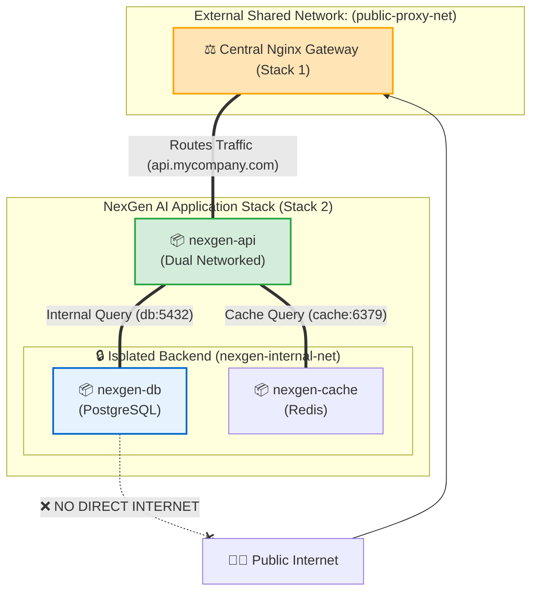

# 🌐 Compose Networks & Volumes

## ভূমিকা (Introduction)

একটি ডকার কম্পোজ ফাইলে শুধুমাত্র ডিফল্ট নেটওয়ার্ক ও ভলিউম ব্যবহার করলে চলে না। বাস্তব জীবনে এন্টারপ্রাইজ মাইক্রোসার্ভিস স্ট্যাকে প্রায়শই কম্পোজ ফাইলের বাইরে পূর্বে তৈরিকৃত শেয়ার্ড নেটওয়ার্কের সাথে যুক্ত হতে হয় (**`external: true`**), ডাটাবেজের জন্য সম্পূর্ণ বিচ্ছিন্ন ইন্টারনাল নেটওয়ার্ক বানাতে হয় (**`internal: true`**), অথবা ক্লাউড NFS স্টোরেজ মাউন্ট করতে হয়।

এই অধ্যায়ে আমরা ডকার কম্পোজের **Networks ও Volumes সেকশনের সমস্ত অ্যাডভান্সড ও এন্টারপ্রাইজ প্যাটার্ন** শিখব।

---

## কেন Networks & Volumes এর অ্যাডভান্সড কনফিগারেশন দরকার? (Why)

```
❌ বেসিক নেটওয়ার্ক ও ভলিউমে সীমাবদ্ধ থাকলে (Before):
   - ভিন্ন ভিন্ন টিমের তৈরি করা দুটি আলাদা কম্পোজ প্রজেক্ট একে অপরের সাথে কানেক্ট হতে পারে না
   - ডকার কম্পোজ ডাউন (`down`) দিলে নতুন নেটওয়ার্ক ও ভলিউম নেমস্পেস কনফ্লিক্ট করে
   - ডাটাবেজ ইন্টারনেটের সাথে যুক্ত থাকায় সাইবার অ্যাটাকের ঝুঁকি থাকে
   - এনএফএস (NFS) বা ক্লাউড স্টোরেজ কম্পোজ ফাইলের ভেতর থেকে সরাসরি মাউন্ট করা যায় না

✅ অ্যাডভান্সড নেটওয়ার্ক ও ভলিউম জানলে (After):
   - `external: true` দিয়ে সেন্ট্রাল Nginx রিভার্স প্রক্সির সাথে যেকোনো কম্পোজ স্ট্যাক এক সেকেন্ডে প্লাগ-ইন করা যায়
   - `internal: true` দিয়ে ডাটাবেজকে ইন্টারনেটের সমস্ত বহির্মুখী ট্রাফিক থেকে ১০০% বিচ্ছিন্ন রাখা যায়
   - কাস্টম `ipam` সাবনেট দিয়ে আইপি অ্যাড্রেস নিজের পূর্ণ নিয়ন্ত্রণে রাখা যায়
   - মাল্টিপল কম্পোজ স্ট্যাকের মধ্যে একটিমাত্র সেন্ট্রাল ডাটাবেজ বা স্টোরেজ শেয়ার করা যায়
```

---

## Multi-Stack Cross-Network Architecture 🗺️

নিচের আর্কিটেকচারে দেখুন কীভাবে একটি সেন্ট্রাল রিভার্স প্রক্সি স্ট্যাক এবং আমাদের **NexGen AI** প্রজেক্ট একটি এক্সটার্নাল নেটওয়ার্কের মাধ্যমে একে অপরের সাথে যুক্ত, অথচ ডাটাবেজ সম্পূর্ণ প্রাইভেটে সুরক্ষিত:



---

## ১. External Networks (`external: true`) 🌐

### What & Why
যদি কোনো নেটওয়ার্ক এই কম্পোজ ফাইল তৈরি করার আগেই সিএলআই (`docker network create`) দিয়ে বা অন্য কোনো কম্পোজ স্ট্যাকের মাধ্যমে তৈরি হয়ে থাকে, তবে কম্পোজকে নির্দেশ দিতে হয়— "তুমি নতুন কোনো নেটওয়ার্ক বানাবে না; বাইরে পূর্বে তৈরি হওয়া নেটওয়ার্কটিতে যুক্ত হও।"

### সিনট্যাক্স:
```yaml
networks:
  # বাইরে ইতিমধ্যে তৈরি থাকা নেটওয়ার্ক
  public-proxy-net:
    external: true
```

:::warning আগে নেটওয়ার্ক তৈরি থাকতে হবে
যদি হোস্টে `public-proxy-net` তৈরি না থাকে এবং আপনি `docker compose up` দেন, তবে ডকার এরর দেবে: `network public-proxy-net declared as external, but could not be found`.
:::

---

## ২. Isolated Networks (`internal: true`) 🔒

### What & Why
কোনো নেটওয়ার্কে `internal: true` লিখলে ডকার কার্নেল ঐ নেটওয়ার্কে কোনো ডিফল্ট গেটওয়ে বসায় না। ফলে কন্টেইনারগুলো নিজেদের মধ্যে কথা বলতে পারলেও **বাইরের ইন্টারনেটে কোনো রিকোয়েস্ট পাঠাতে পারে না এবং বাইরে থেকেও কোনো ট্রাফিক ঢুকতে পারে না**।

ডাটাবেজ ও ক্যাশের জন্য এটি সর্বোচ্চ জিরো-ট্রাস্ট সিকিউরিটি প্রদান করে।

```yaml
networks:
  nexgen-internal-net:
    driver: bridge
    internal: true # 🌟 সম্পূর্ণ অফলাইন প্রাইভেট নেটওয়ার্ক
```

---

## ৩. কাস্টম IPAM (IP Address Management) 🎯

যদি আপনার নেটওয়ার্কে নির্দিষ্ট সাবনেট রেঞ্জ ও গেটওয়ে বরাদ্দ করতে চান:

```yaml
networks:
  custom-enterprise-net:
    driver: bridge
    ipam:
      driver: default
      config:
        - subnet: 172.30.0.0/16
          gateway: 172.30.0.1
```

---

## ৪. External Volumes (`external: true`) 💾

একইভাবে, যদি আগে থেকে তৈরি হওয়া কোনো প্রোডাকশন ভলিউম (যেমন `corporate_db_data`) বর্তমান কম্পোজ ফাইলে মাউন্ট করতে চান যাতে `docker compose down -v` দিলেও এই ভলিউম কখনো ডিলিট না হয়:

```yaml
services:
  db:
    image: postgres:16-alpine
    volumes:
      - corporate_db_data:/var/lib/postgresql/data

volumes:
  corporate_db_data:
    external: true # 🌟 এটি ডকার কম্পোজের অংশ নয়, বাইরে সুরক্ষিত থাকবে
```

---

## ৫. Network Aliases in Compose Services 🏷️

একটি কন্টেইনারকে তার সার্ভিসের নাম ছাড়াও বিকল্প কোনো নামে (Alias) নেটওয়ার্কে পরিচিত করাতে:

```yaml
services:
  api:
    image: nexgen-api:1.0.0
    networks:
      public-proxy-net:
        aliases:
          - ai-backend
          - api.nexgen.internal
```

---

## Hands-on: আমাদের প্রজেক্টের অ্যাডভান্সড মাল্টি-নেটওয়ার্ক `compose.yaml`

চলুন পূর্বে তৈরি করা একটি এক্সটার্নাল প্রক্সি নেটওয়ার্কের সাথে আমাদের **NexGen AI** প্রজেক্ট কানেক্ট করি:

### ধাপ ১: টার্মিনালে এক্সটার্নাল নেটওয়ার্ক ও ভলিউম তৈরি

```bash
# বাইরে একটি সেন্ট্রাল প্রক্সি নেটওয়ার্ক তৈরি করি
docker network create central-proxy-net

# বাইরে একটি সুরক্ষিত স্থায়ী ভলিউম তৈরি করি
docker volume create nexgen_master_pgdata
```

---

### ধাপ ২: সম্পূর্ণ `compose.yaml` কনফিগারেশন

```yaml
# ====================================================================
# 🐳 NexGen AI - Enterprise Multi-Network & Storage Architecture
# ====================================================================

services:
  # ----------------------------------------------------
  # 1. FastAPI Application
  # ----------------------------------------------------
  api:
    build:
      context: .
      dockerfile: Dockerfile
    container_name: nexgen-api-core
    restart: unless-stopped
    environment:
      DATABASE_URL: "postgresql://postgres:masterpass@db:5432/nexgendb"
      REDIS_URL: "redis://cache:6379/0"
    networks:
      # দুটি নেটওয়ার্কে যুক্ত: বাইরের প্রক্সি এবং ভেতরের ডাটাবেজ
      central-proxy-net:
        aliases:
          - nexgen-api-service
      nexgen-backend-net:
    depends_on:
      db:
        condition: service_healthy

  # ----------------------------------------------------
  # 2. PostgreSQL Database (100% Isolated)
  # ----------------------------------------------------
  db:
    image: postgres:16-alpine
    container_name: nexgen-db-isolated
    restart: unless-stopped
    environment:
      POSTGRES_DB: nexgendb
      POSTGRES_USER: postgres
      POSTGRES_PASSWORD: masterpass
    volumes:
      - nexgen_master_pgdata:/var/lib/postgresql/data
    networks:
      - nexgen-backend-net # 🌟 শুধুমাত্র ইন্টারনাল নেটওয়ার্কে যুক্ত!
    healthcheck:
      test: ["CMD-SHELL", "pg_isready -U postgres -d nexgendb"]
      interval: 10s
      timeout: 5s
      retries: 5

  # ----------------------------------------------------
  # 3. Redis In-Memory Cache
  # ----------------------------------------------------
  cache:
    image: redis:7-alpine
    container_name: nexgen-cache-isolated
    restart: unless-stopped
    networks:
      - nexgen-backend-net

# ====================================================================
# 🌐 Networks Definition
# ====================================================================
networks:
  # ১. বাইরে পূর্বে তৈরিকৃত শেয়ার্ড নেটওয়ার্ক
  central-proxy-net:
    external: true

  # ২. প্রজেক্টের নিজস্ব ১০০% আইসোলেটেড ইন্টারনাল নেটওয়ার্ক
  nexgen-backend-net:
    driver: bridge
    internal: true
    ipam:
      driver: default
      config:
        - subnet: 172.29.0.0/16

# ====================================================================
# 💾 Volumes Definition
# ====================================================================
volumes:
  # বাইরে পূর্বে তৈরিকৃত পারসিস্টেন্ট মাস্টার ভলিউম
  nexgen_master_pgdata:
    external: true
```

---

## স্ট্যাক রান ও নেটওয়ার্ক ইন্টারফেস টেস্ট

```bash
docker compose up -d
```

**বাস্তব Output:**
```text
[+] Running 4/4
 ✔ Network nexgen-api_nexgen-backend-net  Created                         0.1s 
 ✔ Container nexgen-db-isolated           Healthy                         5.1s 
 ✔ Container nexgen-cache-isolated        Started                         0.3s 
 ✔ Container nexgen-api-core              Started                         5.3s 
```

```bash
# এপিআই কন্টেইনারের নেটওয়ার্ক ইন্টারফেস চেক করি
docker exec nexgen-api-core ip addr
```

**বাস্তব Output:**
```text
1: lo: <LOOPBACK> mtu 65536
2: eth0@if12: inet 172.20.0.3/16 (central-proxy-net)
3: eth1@if14: inet 172.29.0.2/16 (nexgen-backend-net)
```
*(দেখলেন? `nexgen-api-core` কন্টেইনারে দুটি পৃথক ইথারনেট কার্ড `eth0` এবং `eth1` সক্রিয় হয়েছে!)*

---

## Comparison Table — Network & Volume Types

| কনফিগারেশন টাইপ | `external: false` (Default) | `external: true` | `internal: true` (Network Only) |
|---|---|---|---|
| **তৈরি করে কে?** | ডকার কম্পোজ নিজে স্বয়ংক্রিয়ভাবে তৈরি করে | কম্পোজের বাইরে পূর্বে তৈরি থাকতে হয় | ডকার কম্পোজ তৈরি করে |
| **`down` দিলে কী হয়?** | কন্টেইনারের সাথে নেটওয়ার্ক ডিলিট হয়ে যায় | 🛡️ **কখনোই ডিলিট হয় না (অক্ষত থাকে)** | ডিলিট হয়ে যায় |
| **অন্য স্ট্যাক শেয়ার** | ❌ শুধুমাত্র বর্তমান কম্পোজ ফাইলের জন্য | 🌟 **একাধিক কম্পোজ প্রজেক্ট শেয়ার করতে পারে** | শুধুমাত্র নিজস্ব স্ট্যাকের ভেতর |
| **ইন্টারনেট অ্যাক্সেস**| সাধারণ স্বাভাবিক গেটওয়ে থাকে | হোস্টের রাউটিং অনুযায়ী | ❌ **কোনো ইন্টারনেট ট্রাফিক ঢুকতে বা বের হতে পারে না** |

---

## Common Mistakes — নতুনদের সাধারণ ভুল

### ১. এক্সটার্নাল নেটওয়ার্ক না বানিয়েই `compose up` দেওয়া
❌ **ভুল:** `external: true` লিখে রাখা কিন্তু টার্মিনালে `docker network create` না করা (ফলাফল: সাথে সাথে বিল্ড ক্র্যাশ)।
✅ **সঠিক:** কম্পোজ আপ দেওয়ার আগেই এক্সটার্নাল নেটওয়ার্ক ও ভলিউম তৈরি নিশ্চিত করুন।

### ২. ডাটাবেজকে এক্সটার্নাল নেটওয়ার্কে উন্মুক্ত করা
❌ **ভুল:** ডাটাবেজ কন্টেইনারকে `central-proxy-net` এ যুক্ত করে ফেলা।
✅ **সঠিক:** ডাটাবেজকে সর্বদা `internal: true` যুক্ত প্রাইভেট নেটওয়ার্কে সীমাবদ্ধ রাখুন।

### ৩. `external: true` ভলিউমকে `down -v` দিয়ে মোছার চেষ্টা
❌ **ভুল:** ভাবা যে `docker compose down -v` দিলে এক্সটার্নাল ভলিউম ডিলিট হয়ে যাবে।
✅ **সঠিক:** কম্পোজ শুধুমাত্র নিজের তৈরি ভলিউম মোছে, এক্সটার্নাল ভলিউম মুছতে হলে ম্যানুয়ালি `docker volume rm` দিতে হয়।

---

## Best Practices

1. **সেন্ট্রাল প্রক্সি প্যাটার্ন ব্যবহার করুন**: সমস্ত মাইক্রোসার্ভিসের জন্য একটি কমন `public-proxy-net` তৈরি করে রাখুন।
2. **ডাটাবেজ সাবনেট ফিক্সড রাখুন**: `ipam` দিয়ে সুনির্দিষ্ট প্রাইভেট সাবনেট রেঞ্জ ডিক্লেয়ার করুন।
3. **প্রোডাকশন ডাটাবেজের জন্য External Volume ব্যবহার করুন**: এতে অসাবধানতাবশত `docker compose down -v` চালালেও ডাটাবেজ সুরক্ষিত থাকে।
4. **সার্ভিস অ্যালিয়াস দিন**: মাইক্রোসার্ভিসের ইন্টারনাল ডিএনএস নাম ছোট ও অর্থপূর্ণ রাখতে `aliases:` ব্যবহার করুন।

---

## Interview Questions ও Answers

### ১. Docker Compose-এ `external: true` নেটওয়ার্কের মূল ব্যবহারের ক্ষেত্র কোনটি?

**উত্তর:** যখন একাধিক স্বাধীন ডকার কম্পোজ প্রজেক্ট বা স্ট্যাককে (যেমন একটি প্রজেক্টে Nginx Reverse Proxy / SSL Gateway এবং অন্য প্রজেক্টে FastAPI Microservice) একই ভার্চুয়াল নেটওয়ার্কে একে অপরের সাথে সংযুক্ত করতে হয়, তখন `external: true` ব্যবহৃত হয়। 
এটি কম্পোজকে নির্দেশ করে যে নেটওয়ার্কটি প্রজেক্টের লোকাল স্কোপে নতুন করে তৈরি না করে হোস্টের পূর্বে তৈরিকৃত সেন্ট্রাল শেয়ার্ড নেটওয়ার্কের সাথে যুক্ত হতে হবে।

---

### ২. Compose ফাইলে `internal: true` কেন ডাটাবেজ সিকিউরিটির জন্য একটি গোল্ডেন রুল?

**উত্তর:** `internal: true` ডিক্লেয়ার করলে ডকার ঐ নেটওয়ার্কে কোনো ডিফল্ট রাউটিং গেটওয়ে বা এক্সটার্নাল NAT রুল তৈরি করে না। 
এর ফলে:
- নেটওয়ার্কের কন্টেইনারগুলো (যেমন PostgreSQL ডাটাবেজ) বাইরের ইন্টারনেটের কোনো আইপিতে ডেটা পাঠাতে পারে না।
- বাইরের ইন্টারনেট থেকেও কোনো আক্রমণকারী ডাটাবেজে পৌঁছাতে পারে না।
- এটি ডেটা লিক ও সাইবার ব্রিচ প্রতিরোধে জিরো-ট্রাস্ট সিকিউরিটি নিশ্চিত করে।

---

### ৩. Docker Compose-এ Custom IPAM Subnet কনফিগার করার সুবিধা কী?

**উত্তর:** ডিফল্টভাবে ডকার যেকোনো একটি র‍্যান্ডম লোকাল সাবনেট (যেমন `172.17.0.0` বা `172.18.0.0`) বরাদ্দ করে। 
কাস্টম IPAM (IP Address Management) সাবনেট কনফিগার করলে:
১. এন্টারপ্রাইজ ফায়ারওয়াল এবং ভিপিএন রাউটিং টেবিলের সাথে ডকার সাবনেটের কনফ্লিক্ট এড়ানো যায়।
২. কন্টেইনারগুলোর প্রাইভেট আইপি রেঞ্জ পূর্বে থেকেই প্রেডিক্ট করা ও মনিটর করা সম্ভব হয়।

---

### ৪. `external: true` ভলিউম ব্যবহার করলে ডেটা সুরক্ষার ক্ষেত্রে কী অতিরিক্ত সুবিধা পাওয়া যায়?

**উত্তর:** যখন একটি ভলিউমকে `external: true` ঘোষণা করা হয়, তখন ডকার কম্পোজ সেই ভলিউমটির মালিকানা দাবি করে না। 
এর সবচেয়ে বড় সুবিধা হলো— কোনো ডেভেলপার ভুলবশত যদি **`docker compose down -v`** (ভলিউম ডিলিট ফ্ল্যাগ) কমান্ডও চালিয়ে ফেলে, ডকার কম্পোজ এক্সটার্নাল ভলিউমটিকে স্পর্শও করবে না। ফলে ডাটাবেজের সমস্ত ডেটা ১০০% অক্ষত ও সুরক্ষিত থাকবে।

---

## Summary

| বৈশিষ্ট্য | সিনট্যাক্স | ভূমিকা |
|---|---|---|
| **এক্সটার্নাল নেটওয়ার্ক** | `networks: name: external: true` | মাল্টি-স্ট্যাক মাইক্রোসার্ভিস ইন্টিগ্রেশন |
| **ইন্টারনাল নেটওয়ার্ক** | `networks: name: internal: true` | ডাটাবেজের জন্য ১০০% অফলাইন সিকিউরিটি |
| **কাস্টম সাবনেট** | `ipam: config: subnet: 172.29.0.0/16` | নির্দিষ্ট আইপি রেঞ্জ কনফিগারেশন |
| **এক্সটার্নাল ভলিউম** | `volumes: name: external: true` | `down -v` থেকেও ডেটা সুরক্ষিত রাখা |
| **সার্ভিস অ্যালিয়াস** | `central-net: aliases: [my-api]` | কাস্টম ডিএনএস নাম নির্ধারণ |

---

## পরবর্তী ধাপ

আমরা সফলভাবে ডকার কম্পোজের নেটওয়ার্কিং ও ভলিউমসের সমস্ত এন্টারপ্রাইজ প্যাটার্ন শিখে ফেলেছি। পরবর্তী টপিকে আমরা দেখব **Compose Advanced Features** (`docker/compose-advanced.md`) — যেখানে শিখব পরিবেশ ভেরিয়েবল ইন্টারপোলেশন (`${VAR:-default}`), মাল্টিপল ফাইল মার্জিং (`-f docker-compose.yml -f docker-compose.prod.yml`), এবং কম্পোজ প্রোফাইলস (`profiles: [debug]`)।
