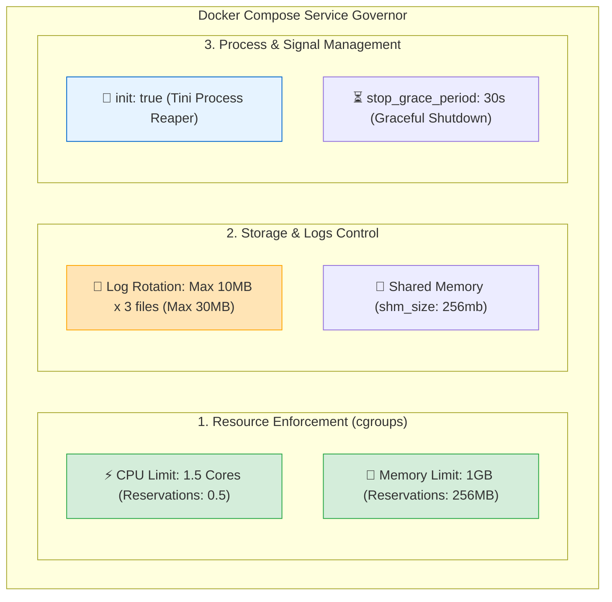

# ⚙️ Compose Services Deep Dive

## ভূমিকা (Introduction)

একটি সাধারণ `docker-compose.yml` ফাইলে শুধু `image` এবং `ports` লিখে কন্টেইনার চালানো যায়। কিন্তু প্রোডাকশন গ্রেড এন্টারপ্রাইজ সিস্টেমে প্রতিটি সার্ভিসের রিসোর্স নিয়ন্ত্রণ (CPU/Memory limits), ডিস্ক ভরা রোধে লগ রোটেশন (Log Rotation), জম্বি প্রসেস মুক্ত রাখতে `init` সিস্টেম, এবং সুরক্ষিত গ্রেসফুল শাটডাউন কনফিগার করা অপরিহার্য।

এই অধ্যায়ে আমরা ডকার কম্পোজ সার্ভিসের **উন্নত ও হার্ডেন্ড প্রোডাকশন অ্যাট্রিবিউটগুলো** গভীরভাবে শিখব।

---

## কেন Services Deep Dive কনফিগারেশন দরকার? (Why)

```
❌ বেসিক কনফিগারেশনে ছেড়ে দিলে (Disaster in Production 💥):
   - মেমরি লিকের কারণে ১টি কন্টেইনার পুরো সার্ভারের ১৬ জিবি র‍্যাম খেয়ে সব ক্র্যাশ করিয়ে দেয় (Noisy Neighbor)
   - কন্টেইনারের লগ ফাইল জমে ২০-৩০ জিবি ডিস্ক স্পেস নষ্ট করে সার্ভার লক করে ফেলে
   - ডিপ্লয়মেন্টের সময় ডাটাবেজ বন্ধ হতে ১০ সেকেন্ডের বেশি সময় নিলে কম্পোজ তাকে জোর করে মেরে ডাটা করাপ্ট করে
   - পাইথন সাব-প্রসেসগুলো জম্বি প্রসেস (Zombie Processes) হয়ে মেমরি লিক করে

✅ প্রোডাকশন সার্ভিসেস কনফিগার করলে (Rock Solid 🛡️):
   - প্রতিটি সার্ভিসে CPU (যেমন 0.5 Cores) ও Memory (512MB) হার্ড লিমিট দেওয়া থাকে
   - Log Rotation পলিসির কারণে কন্টেইনারের লগ কখনোই ৩০ মেগাবাইটের বেশি ডিস্ক স্পেস নিতে পারে না
   - `stop_grace_period: 30s` দিয়ে ডাটাবেজকে নিরাপদে বন্ধ হওয়ার পর্যাপ্ত সময় দেওয়া যায়
   - `init: true` দিয়ে সব জম্বি প্রসেস স্বয়ংক্রিয়ভাবে কার্নেলে ক্লিন হয়ে যায়
```

---

## How it Works — সার্ভিস প্রোডাকশন আর্কিটেকচার



---

## ১. Resource Management — CPU ও Memory লিমিটেশন 🛡️

Compose V2-তে `deploy.resources` ব্লকের মাধ্যমে প্রতিটি সার্ভিসের জন্য সর্বোচ্চ ও সর্বনিম্ন রিসোর্স বরাদ্দ করা হয়:

```yaml
services:
  api:
    image: nexgen-api:1.0.0
    deploy:
      resources:
        limits:
          cpus: '1.5'          # কন্টেইনার সর্বোচ্চ ১.৫টি CPU কোর ব্যবহার করতে পারবে
          memory: 1024M        # কন্টেইনার সর্বোচ্চ ১ জিবি র‍্যামের বেশি নিতে পারবে না
        reservations:
          cpus: '0.25'         # কন্টেইনারের জন্য ন্যূনতম ০.২৫ কোর সংরক্ষিত থাকবে
          memory: 256M         # ন্যূনতম ২৫৬ এমবি র‍্যাম রিজার্ভ থাকবে
```

:::warning মেমরি লিমিট ছাড়া কন্টেইনার চালাবেন না!
মেমরি লিমিট না থাকলে পাইথনের মেমরি লিক বা মেমরি-হেভি কোয়েরি পুরো হোস্ট ওএসের সমস্ত র‍্যাম দখল করে সার্ভার অচল করে দেয়।
:::

---

## ২. Log Rotation — ডিস্ক স্পেস রক্ষা করা 📜

ডিফল্টভাবে ডকার কন্টেইনারের সমস্ত আউটপুট JSON ফাইলে হোস্ট ডিস্কে জমা হতে থাকে এবং এর কোনো সাইজ লিমিট থাকে না। 

**প্রোডাকশন সমাধান:** লগ ড্রাইভার কনফিগার করে সর্বোচ্চ ফাইল সাইজ ও ফাইলের সংখ্যা ফিক্সড করে দেওয়া:

```yaml
services:
  api:
    logging:
      driver: "json-file"
      options:
        max-size: "10m"    # প্রতিটি লগ ফাইল সর্বোচ্চ ১০ মেগাবাইট হবে
        max-file: "3"      # সর্বোচ্চ ৩টি ফাইল রোল হবে (মোট ৩০ মেগাবাইটের বেশি কখনো হবে না!)
```

---

## ৩. `init: true` — জম্বি প্রসেস রিমুভার 👶

পাইথন ব্যাকএন্ড, Celery ওয়ার্কার বা ক্রোমিয়াম ব্রাউজার কন্টেইনার যখন সাব-প্রসেস তৈরি করে, তখন মূল প্রসেস বন্ধ হওয়ার পর সাব-প্রসেসগুলো সিস্টেমে **Zombie Processes (মৃত কিন্তু মেমরিতে আটকে থাকা প্রসেস)** হিসেবে জমা হতে পারে।

`init: true` দিলে ডকার কন্টেইনারের ভেতরে একটি অতি ক্ষুদ্র `Tini` ইনিট প্রসেসকে PID 1 হিসেবে রান করে, যা সমস্ত চাইল্ড প্রসেসের সিগন্যাল সঠিকভাবে ফরোয়ার্ড করে এবং জম্বি প্রসেসগুলোকে স্বয়ংক্রিয়ভাবে ক্লিন (Reap) করে দেয়।

```yaml
services:
  api:
    init: true # Enables lightweight Tini init process
```

---

## ৪. `stop_grace_period` — কাস্টম গ্রেস পিরিয়ড ⏳

ডিফল্টভাবে `docker compose down` বা `stop` দিলে ডকার ১০ সেকেন্ড অপেক্ষা করে। কিন্তু পোস্টগ্রেসের মতো বড় ডাটাবেজে ডাটাবেজ মেমরি থেকে ডিস্কে ডাটা ফ্ল্যাশ করতে ২০-৩০ সেকেন্ড সময় লাগতে পারে।

`stop_grace_period` দিয়ে আপনি ডকারকে বলে দেন কতক্ষণ অপেক্ষা করতে হবে:

```yaml
services:
  db:
    image: postgres:16-alpine
    stop_grace_period: 30s # ১০ সেকেন্ডের জায়গায় ৩০ সেকেন্ড সময় পাবে
```

---

## ৫. `shm_size` — শেয়ার্ড মেমরি সাইজ (AI/ML এর জন্য) 🧠

ডকার কন্টেইনারের ডিফল্ট লিনাক্স শেয়ার্ড মেমরি (`/dev/shm`) সাইজ থাকে মাত্র **64MB**। 

আপনি যদি PyTorch, OpenCV, বা কোনো AI/LLM ডেটা লোডার ব্যবহার করেন, তবে এই ৬৪ এমবি মেমরি সেকেন্ডে শেষ হয়ে `Bus error (core dumped)` দিয়ে অ্যাপ ক্র্যাশ করবে।

```yaml
services:
  ai-engine:
    image: nexgen-ai-engine:latest
    shm_size: '2gb' # শেয়ার্ড মেমরি বাড়িয়ে ২ জিবি করা হলো
```

---

## Hands-on: সম্পূর্ণ এন্টারপ্রাইজ হার্ডেন্ড `compose.yaml`

চলুন আমাদের **NexGen AI** প্রজেক্টের সার্ভিসগুলোকে সমস্ত প্রোডাকশন ফিচার দিয়ে হার্ডেনিং করি:

```yaml
# ====================================================================
# 🐳 NexGen AI - Production Hardened Compose Stack
# ====================================================================

services:
  # ----------------------------------------------------
  # 1. FastAPI Application Backend
  # ----------------------------------------------------
  api:
    build:
      context: .
      dockerfile: Dockerfile
      target: runner
    container_name: nexgen-api-prod
    restart: unless-stopped
    init: true                          # 🌟 জম্বি প্রসেস ক্লিনআপ
    stop_grace_period: 15s              # 🌟 গ্রেসফুল শাটডাউন
    ports:
      - "8000:8000"
    environment:
      DATABASE_URL: "postgresql://postgres:securepass123@db:5432/nexgendb"
      REDIS_URL: "redis://cache:6379/0"
    deploy:
      resources:
        limits:
          cpus: '1.0'                   # 🌟 সর্বোচ্চ ১ কোর CPU
          memory: 512M                  # 🌟 সর্বোচ্চ ৫১২ এমবি র‍্যাম
        reservations:
          cpus: '0.2'
          memory: 128M
    logging:
      driver: "json-file"
      options:
        max-size: "10m"                 # 🌟 সর্বোচ্চ ১০ এমবি লগ ফাইল
        max-file: "3"
    networks:
      - app-net
    depends_on:
      db:
        condition: service_healthy

  # ----------------------------------------------------
  # 2. PostgreSQL Relational Database
  # ----------------------------------------------------
  db:
    image: postgres:16-alpine
    container_name: nexgen-db-prod
    restart: unless-stopped
    stop_grace_period: 30s              # 🌟 ডাটাবেজের ডাটা সেভের জন্য ৩০ সেকেন্ড গ্রেস
    environment:
      POSTGRES_DB: nexgendb
      POSTGRES_USER: postgres
      POSTGRES_PASSWORD: securepass123
    volumes:
      - pg_data:/var/lib/postgresql/data
    deploy:
      resources:
        limits:
          cpus: '2.0'
          memory: 2048M                 # 🌟 ডাটাবেজের জন্য ২ জিবি র‍্যাম
        reservations:
          memory: 512M
    healthcheck:
      test: ["CMD-SHELL", "pg_isready -U postgres -d nexgendb"]
      interval: 10s
      timeout: 5s
      retries: 5
    logging:
      driver: "json-file"
      options:
        max-size: "20m"
        max-file: "5"
    networks:
      - app-net

networks:
  app-net:
    driver: bridge

volumes:
  pg_data:
```

---

## সার্ভিস রিসোর্স মনিটরিং (`docker stats`)

স্ট্যাক চালু করার পর প্রতিটি কন্টেইনারের লাইভ রিসোর্স ব্যবহার পরীক্ষা করার কমান্ড:

```bash
docker compose up -d
docker stats
```

**বাস্তব লাইভ ড্যাশবোর্ড Output:**
```text
CONTAINER ID   NAME              CPU %     MEM USAGE / LIMIT     MEM %     NET I/O          BLOCK I/O
a1b2c3d4e5f6   nexgen-api-prod   0.15%     64.2MiB / 512MiB      12.54%    1.2kB / 850B     0B / 0B
7f8a9b0c1d2e   nexgen-db-prod    0.05%     48.5MiB / 2GiB        2.37%     850B / 1.2kB     12MB / 0B
```
*(দেখলেন? প্রতিটি সার্ভিসের মেমরি তাদের নির্ধারিত লিমিট (512MiB এবং 2GiB) এর মধ্যে সম্পূর্ণ সুরক্ষিত ও নিয়ন্ত্রিত!)*

---

## Comparison Table — Basic Service বনাম Hardened Production Service

| কনফিগারেশন | Basic Service Definition | Hardened Production Service |
|---|---|---|
| **CPU ও RAM** | ❌ কোনো লিমিট নেই (সার্ভার ক্র্যাশের ঝুঁকি) | 🛡️ `deploy.resources.limits` দিয়ে নিয়ন্ত্রিত |
| **লগ সাইজ** | ❌ আনলিমিটেড (ডিস্ক ফুল হওয়ার ঝুঁকি) | 🛡️ `logging.options.max-size: 10m` |
| **প্রসেস সিগন্যাল** | ⚠️ সরাসরি পাইথন প্রসেস (জম্বি প্রসেসের ভয়) | 🛡️ `init: true` দিয়ে Tini সিগন্যাল হ্যান্ডলার |
| **শাটডাউন টাইম** | ডিফল্ট ১০ সেকেন্ড | 🛡️ `stop_grace_period: 30s` দিয়ে ডাটা সেফ |
| **ডাটাবেজ ডিপেনডেন্সি**| `depends_on: [db]` (ক্র্যাশ হতে পারে) | 🛡️ `condition: service_healthy` |

---

## Common Mistakes — নতুনদের সাধারণ ভুল

### ১. ডাটাবেজের স্টার্টআপ মেমরির চেয়ে কম মেমরি লিমিট দেওয়া
❌ **ভুল:** PostgreSQL কন্টেইনারে `memory: 64M` লিমিট দেওয়া (পোস্টগ্রেস চালু হওয়ার সময় মেমরি না পেয়ে সাথে সাথে OOMKilled হবে)।
✅ **সঠিক:** ডাটাবেজের জন্য ন্যূনতম ২৫৬-৫১২ এমবি বা তার বেশি মেমরি বরাদ্দ করুন।

### ২. লগ রোটেশন ভুলে গিয়ে সার্ভার ডিস্ক ফুল করা
❌ **ভুল:** প্রোডাকশনে ডকার কম্পোজ ফাইলে `logging` ব্লক কনফিগার না করা।
✅ **সঠিক:** সবসময় `max-size: 10m` এবং `max-file: 3` সেট করুন।

### ৩. AI/ML পাইপলাইনে ডিফল্ট `shm_size` রেখে ক্র্যাশ খাওয়া
❌ **ভুল:** PyTorch DataLoader চালাতে গিয়ে বাস এরর খাওয়া।
✅ **সঠিক:** `shm_size: 2gb` বা তদূর্ধ্ব দিয়ে শেয়ার্ড মেমরি বাড়িয়ে দিন।

---

## Best Practices

1. **প্রোডাকশন কম্পোজ ফাইলে সবসময় Resource Limits দিন**: এটি একটি সার্ভিসের বাগ বা মেমরি লিক থেকে পুরো সার্ভারকে রক্ষা করে।
2. **লগ সাইজ সর্বোচ্চ ২০-৫০ মেগাবাইটে সীমাবদ্ধ রাখুন**: ক্লাউড সার্ভারের ডিস্ক সবসময় নিরাপদ থাকবে।
3. **ডাটাবেজের জন্য `stop_grace_period` বাড়ান**: ডাটা করাপশন রোধ করতে ২০-৩০ সেকেন্ড সময় দিন।
4. **নিয়মিত `docker stats` দিয়ে সার্ভিস বেঞ্চমার্ক করুন**: পিক টাইমে মেমরি ইউসেজ পর্যবেক্ষণ করে লিমিট অ্যাডজাস্ট করুন।

---

## Interview Questions ও Answers

### ১. Docker Compose-এ Service Resource Limits কনফিগার করা কেন অত্যন্ত জরুরি?

**উত্তর:** ডিফল্টভাবে ডকার কন্টেইনারের কোনো রিসোর্স লিমিট থাকে না এবং এটি হোস্ট সিস্টেমের ১০০% CPU ও RAM ব্যবহার করতে পারে। 
যদি কোনো কন্টেইনারে কোডের বাগ, ইনফিনিট লুপ বা মেমরি লিক থাকে, তবে সেই একক কন্টেইনারটি পুরো হোস্ট সার্ভারের সমস্ত মেমরি দখল করে নেবে। এর ফলে লিনাক্স কার্নেলের OOM Killer সিস্টেমের অন্যান্য ক্রিটিকাল সার্ভিস বা ডাটাবেজ ক্র্যাশ করিয়ে পুরো সার্ভার ডাউন করে দেয় (Noisy Neighbor Problem)। 
`deploy.resources.limits` এর মাধ্যমে প্রতিটি কন্টেইনারের জন্য সর্বোচ্চ CPU এবং মেমরি বাউন্ডারি নির্ধারণ করে দিলে এই ঝুঁকি সম্পূর্ণ নির্মূল হয়।

---

### ২. Docker Compose-এ `init: true` ফ্ল্যাগের কাজ কী?

**উত্তর:** `init: true` ফ্ল্যাগ ডকার ইঞ্জিনকে নির্দেশ দেয় কন্টেইনারের ভেতরে একটি অত্যন্ত ক্ষুদ্র ও আধুনিক **Tini Init System** কে PID 1 হিসেবে চালাতে। 
এর মূল দুটি কাজ:
১. **সিগন্যাল ফরোয়ার্ডিং:** এটি ডকার ডেমন থেকে আসা `SIGTERM`/`SIGINT` সিগন্যালগুলোকে নিখুঁতভাবে কন্টেইনারের সমস্ত চাইল্ড প্রসেসে ফরোয়ার্ড করে।
২. **Zombie Process Reaping:** কন্টেইনারের ভেতরে তৈরি হওয়া কোনো সাব-প্রসেস যদি কাজ শেষ করে ডেড হয়ে যায় কিন্তু প্যারেন্ট প্রসেস তাকে ক্লিন না করে, তবে Tini স্বয়ংক্রিয়ভাবে কার্নেল থেকে সেই জম্বি প্রসেসগুলোকে ডিলিট করে মেমরি রিলিজ করে দেয়।

---

### ৩. ডকারে Log Rotation কনফিগার না করলে কী ঝুঁকি তৈরি হয়?

**উত্তর:** ডকার কন্টেইনারের সমস্ত কনসোল আউটপুট (`stdout`/`stderr`) ডিফল্ট `json-file` ড্রাইভার দিয়ে হোস্ট ডিস্কের `/var/lib/docker/containers/<id>/<id>-json.log` ফাইলে জমা হয়। 
লগ রোটেশন কনফিগার না করলে দীর্ঘ সময় ধরে চলা প্রোডাকশন অ্যাপ্লিকেশনের লগ ফাইলটি বৃদ্ধি পেতে পেতে ২০-৫০ গিগাবাইট ছাড়িয়ে যায় এবং হোস্ট সার্ভারের সম্পূর্ণ ডিস্ক স্পেস ফুল করে ফেলে। ডিস্ক ফুল হয়ে গেলে সমস্ত ডাটাবেজ রাইট অপারেশন ব্লক হয়ে যায় এবং পুরো প্রোডাকশন ইনফ্রাস্ট্রাকচার ক্র্যাশ করে। `max-size` এবং `max-file` দিয়ে এটি প্রতিরোধ করা হয়।

---

### ৪. `stop_grace_period` নির্দেশিকা কখন এবং কেন ব্যবহার করা উচিত?

**উত্তর:** `stop_grace_period` নির্ধারণ করে যখন একটি কন্টেইনার স্টপ বা ডাউন করা হয়, তখন ডকার `SIGTERM` সিগন্যাল পাঠানোর পর `SIGKILL` সিগন্যাল পাঠানোর আগে কন্টেইনারটির জন্য সর্বোচ্চ কত সময় অপেক্ষা করবে (ডিফল্ট: ১০ সেকেন্ড)।
এটি ব্যবহার করা উচিত:
- **PostgreSQL / MySQL ডাটাবেজে:** যেখানে মেমরি বাফারে থাকা ডেটা ডিস্কে নিরাপদে ফ্ল্যাশ ও কমিট করতে ১০ সেকেন্ডের বেশি সময় লাগতে পারে।
- **Celery / RabbitMQ কিউ ওয়ার্কার্সে:** যেখানে দীর্ঘ চলমান ব্যাকগ্রাউন্ড টাস্ক বা ফাইল প্রসেসিং মাঝপথে কেটে না দিয়ে নিরাপদে শেষ করার সুযোগ দেওয়া প্রয়োজন।

---

## Summary

| অ্যাট্রিবিউট | সিনট্যাক্স | ভূমিকা |
|---|---|---|
| **রিসোর্স লিমিট** | `deploy.resources.limits` | CPU ও RAM এর সর্বোচ্চ ক্যাপ নির্ধারণ |
| **লগ রোটেশন** | `logging.options.max-size: 10m` | লগ ফাইল ডিস্ক ফুল হওয়া বন্ধ করে |
| **ইনিট সিস্টেম** | `init: true` | জম্বি প্রসেস ক্লিনআপ ও সিগন্যাল ফরোয়ার্ড |
| **গ্রেস পিরিয়ড** | `stop_grace_period: 30s` | ডাটাবেজকে নিরাপদে ডাটা সেভ করার সময় দেয় |
| **শেয়ার্ড মেমরি** | `shm_size: 2gb` | AI/ML ও ডেটা সায়েন্স প্রজেক্টের ক্র্যাশ রোধ |

---

## পরবর্তী ধাপ

আমরা সফলভাবে ডকার কম্পোজ সার্ভিস হার্ডেনিং শিখে ফেলেছি। পরবর্তী টপিকে আমরা দেখব **Compose Networks & Volumes** (`docker/compose-networks-volumes.md`) — যেখানে শিখব কীভাবে কম্পোজ ফাইলে কাস্টম ড্রাইভার, এক্সটার্নাল পূর্বে তৈরিকৃত নেটওয়ার্ক ও ভলিউম ইন্টিগ্রেশন, এবং নেটওয়ার্ক আইসোলেশন নিখুঁতভাবে করতে হয়।
