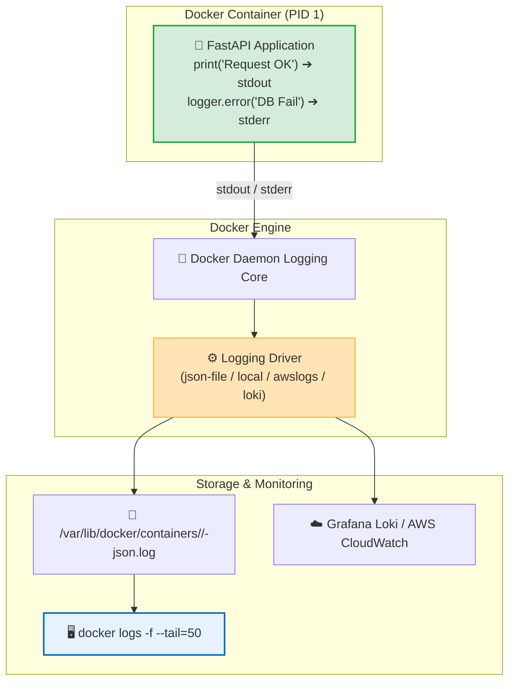
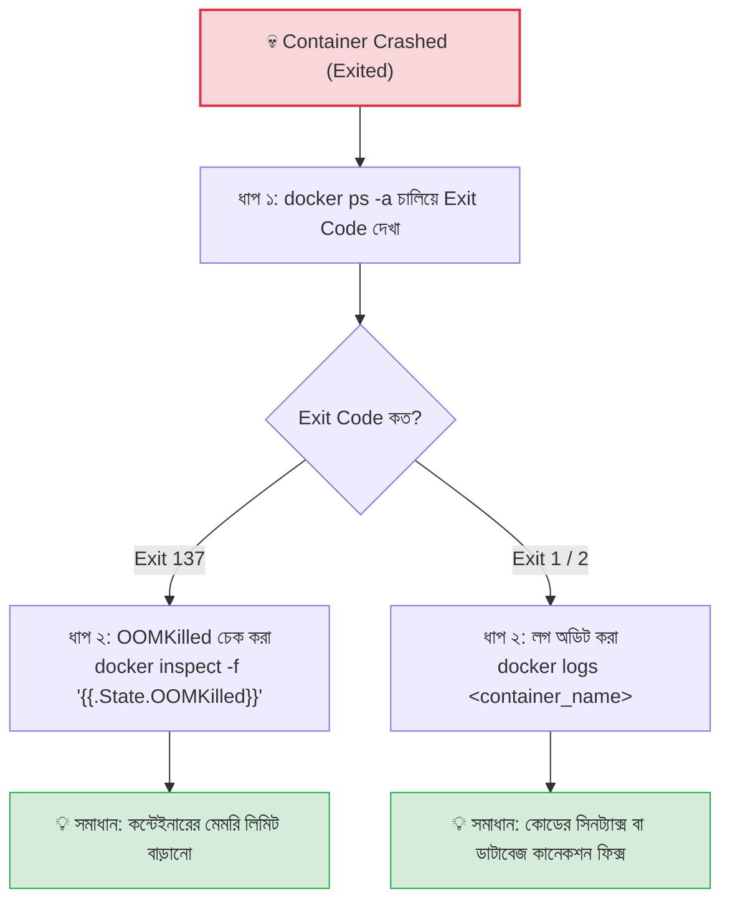

# 🩺 Container Logs & Debugging

## Container Logs ও Debugging কী? (What)

**Container Logs & Debugging** হলো ডকার কন্টেইনারের ভেতরের স্বাস্থ্য, কর্মক্ষমতা, কনসোল আউটপুট এবং ক্র্যাশ বা ত্রুটির কারণ বিশ্লেষণ ও সমাধান করার সার্বিক কৌশল।

ডকার ইঞ্জিন কন্টেইনারের মূল প্রসেসের (PID 1) **Standard Output (`stdout`)** এবং **Standard Error (`stderr`)** স্ট্রিমগুলোকে স্বয়ংক্রিয়ভাবে ইন্টারসেপ্ট (ক্যাপচার) করে একটি নির্দিষ্ট লগিং ড্রাইভারের মাধ্যমে সংরক্ষণ করে। `docker logs` কমান্ডের মাধ্যমে ডেভেলপাররা হোস্ট টার্মিনাল থেকেই রিয়েল-টাইমে সেই সমস্ত লগ পর্যবেক্ষণ করতে পারেন।

:::info ডকার লগিংয়ের গোল্ডেন রুল
ডকারে কোনো ফাইলে লগ লেখার প্রয়োজন নেই। আপনার পাইথন কোডে সাধারণ `print()` বা `logging.info()` লিখলেই তা সরাসরি `stdout` এ চলে যায় এবং ডকার তা নিখুঁতভাবে সংরক্ষণ করে।
:::

---

## কেন Logging ও Debugging মাস্টারি দরকার? (Why)

```
❌ লগ ও ডিবাগিং মেকানিজম না জানলে (Before):
   - কন্টেইনার চালুর সাথে সাথে বন্ধ হয়ে গেলে কেন বন্ধ হলো বোঝার কোনো উপায় থাকে না
   - প্রোডাকশনে ৫ লাখ লাইনের বিশাল লগ ফাইল থেকে আজকের ত্রুটি খুঁজে বের করতে ঘণ্টার পর ঘণ্টা নষ্ট হয়
   - কন্টেইনার ওওএম (Out of Memory) ক্র্যাশ করলে কোডের বাগ মনে করে ভুল জায়গায় সময় নষ্ট হয়
   - পাইথন বা নোড অ্যাপ কোনো ফাইলে লগ লিখে রাখলে `docker logs` সম্পূর্ণ খালি দেখায়

✅ প্রো-লেভেল ডিবাগিং আয়ত্ত করলে (After):
   - `--since 10m` দিয়ে গত ১০ মিনিটের এরর লগ মুহূর্তে ফিল্টার করা যায়
   - টাইমস্ট্যাম্প (`-t`) ও লাইভ ফলো (`-f`) দিয়ে রিয়েল-টাইম রিকোয়েস্ট ট্রেস করা যায়
   - `docker inspect` দিয়ে এক সেকেন্ডে বের করা যায় কন্টেইনার ওওএম (OOMKilled) হয়ে মারা গেছে কিনা
   - সেন্ট্রালাইজড লগ ড্রাইভার ব্যবহার করে এন্টারপ্রাইজ মনিটরিং নিশ্চিত করা যায়
```

---

## Analogy — বিমানের ব্ল্যাক বক্স ও ইসিজি মনিটর ✈️📈

Container Logs ও Debugging-কে একটি **বিমানের ব্ল্যাক বক্স (Flight Recorder) এবং হাসপাতালের আইসিইউ ইসিজি মনিটর**-এর সাথে তুলনা করা যায়:

- **Docker Container** = মাঝ আকাশে উড়তে থাকা একটি বিমান।
- **`stdout` / `stderr`** = বিমানের ককপিটের পাইলটের ভয়েস রেকর্ড ও সেন্সর ডাটা।
- **Docker Logging Driver** = ব্ল্যাক বক্স যা বিমানের সমস্ত ইভেন্ট সেকেন্ড বাই সেকেন্ড রেকর্ড করে রাখে।
- **`docker logs`** = কোনো বিপর্যয় বা ক্র্যাশ ঘটলে তদন্তকারী দল ব্ল্যাক বক্স ওপেন করে যে অডিও ও ডাটা লগ শুনে দুর্ঘটনার কারণ বের করে।

---

## How it Works — ডকার লগিং আর্কিটেকচার 🔬



---

## প্রধান ডকার লগিং ড্রাইভারসমূহ (Logging Drivers)

ডকার ইঞ্জিনে বেশ কয়েকটি প্লাগেবল লগিং ড্রাইভার রয়েছে:

| লগিং ড্রাইভার | বিবরণ | সুবিধা | ব্যবহারের ক্ষেত্র |
|---|---|---|---|
| **`json-file` (Default)** | প্রতিটি কন্টেইনারের জন্য JSON ফাইলে লগ সংরক্ষণ করে | সহজ, `docker logs` কাজ করে | লোকাল ও স্ট্যান্ডার্ড প্রোডাকশন |
| **`local`** | বাইনারি ফরম্যাটে উচ্চগতির অপ্টিমাইজড লগিং | ডিস্ক ফুল হওয়া রোধে স্বয়ংক্রিয় রোটেশন | হাই-পারফরম্যান্স লিনাক্স সার্ভার |
| **`awslogs`** | সরাসরি AWS CloudWatch Logs-এ স্ট্রিম করে | ক্লাউডে সেন্ট্রালাইজড ম্যানেজমেন্ট | AWS ECS / EC2 প্রোডাকশন |
| **`fluentd` / `loki`** | Grafana / ELK স্ট্যাকে লগ পাঠায় | রিয়েল-টাইম অ্যালার্ট ও ভিজ্যুয়ালাইজেশন | এন্টারপ্রাইজ মাইক্রোসার্ভিস ক্লাস্টার |
| **`none`** | কন্টেইনারের সমস্ত লগ বন্ধ করে দেয় | জিরো ডিস্ক ও সিপিইউ ওভারহেড | সিকিউর ক্রিপ্টো ও সেনসিটিভ টাস্ক |

---

## Hands-on: অ্যাডভান্সড `docker logs` ফিল্টারিং কমান্ডসমূহ

আমাদের **NexGen AI** প্রজেক্টের লাইভ কন্টেইনার দিয়ে বাস্তব লগ ফিল্টারিং অনুশীলন করি:

### ১. লাইভ লগ ফলো ও শেষ নির্দিষ্ট লাইন দেখা (`-f` ও `--tail`)

```bash
# এপিআই কন্টেইনারের শেষ ৫০ লাইন দেখা এবং লাইভ লগ স্ট্রিম করা
docker logs -f --tail=50 nexgen-api-app
```

**বাস্তব Output:**
```text
INFO:     172.18.0.1:45210 - "GET /health HTTP/1.1" 200 OK
INFO:     172.18.0.1:45212 - "POST /api/v1/generate HTTP/1.1" 200 OK
INFO:     Generated response for Prompt ID: 42 in 0.12s
```

---

### ২. টাইমস্ট্যাম্প সহ লগ দেখা (`-t` বা `--timestamps`)

পোস্টমর্টেম ও ইনসিডেন্ট অ্যানালাইসিসে কোন এরর ঠিক কয়টায় ঘটেছিল তা জানার জন্য:

```bash
docker logs -t --tail=5 nexgen-api-app
```

**বাস্তব Output:**
```text
2024-07-24T14:15:30.123456789Z INFO:     Application startup complete.
2024-07-24T14:16:02.987654321Z INFO:     Connected to PostgreSQL on db:5432
```

---

### ৩. টাইম-রেঞ্জ ফিল্টারিং (`--since` এবং `--until`) ⏱️

নির্দিষ্ট সময়সীমার ভেতরের লগ বের করার চমৎকার ফিল্টার:

```bash
# ১. গত ১৫ মিনিটের লগ দেখতে
docker logs --since 15m nexgen-api-app

# ২. নির্দিষ্ট তারিখ ও সময় থেকে শুরু করে দেখা
docker logs --since "2024-07-24T14:00:00" nexgen-api-app

# ৩. নির্দিষ্ট সময়ের মধ্যবর্তী লগ ফিল্টার করা
docker logs --since "2024-07-24T13:00:00" --until "2024-07-24T14:00:00" nexgen-api-app
```

---

### ৪. শুধুমাত্র এরর লগ (`stderr`) ফিল্টার করা

পাইপ ও রি-ডাইরেকশন ব্যবহার করে শুধুমাত্র এরর লগ আলাদা ফাইলে সেভ করা:

```bash
# শুধুমাত্র stderr লগ টার্মিনালে ফিল্টার করা
docker logs nexgen-api-app 2>&1 1>/dev/null | grep -i "error"
```

---

## ক্র্যাশ হওয়া কন্টেইনার ডিবাগ করার স্টেপ-বাই-স্টেপ গাইড 🔍

ধরি আপনার কন্টেইনার চালুর সাথে সাথে এক্সিট বা ক্র্যাশ হয়ে গেছে। কীভাবে কারণ খুঁজে বের করবেন?



### ধাপ ১: এক্সিট কোড ও স্ট্যাটাস দেখা
```bash
docker ps -a --filter "name=nexgen-api-app"
# Status দেখাল: Exited (137)
```

### ধাপ ২: এটি কি Out-of-Memory (OOM) ক্র্যাশ ছিল কিনা তা নিশ্চিত হওয়া
```bash
docker inspect --format 'OOMKilled: {{.State.OOMKilled}} | ExitCode: {{.State.ExitCode}} | Error: {{.State.Error}}' nexgen-api-app
```

**বাস্তব Output:**
```text
OOMKilled: true | ExitCode: 137 | Error: 
```
*(ধরা পড়ে গেছে! কন্টেইনারটি মেমরি লিমিট অতিক্রম করার কারণে লিনাক্স কার্নেল তাকে মেরে ফেলেছে। সমাধান হলো মেমরি বাড়িয়ে দেওয়া।)*

---

### ধাপ ৩: কন্টেইনার ক্র্যাশ লুপে থাকলে শেলের ভেতর ডিবাগ করা
যদি কন্টেইনার চালু হওয়ার সাথে সাথে বন্ধ হয়ে যায়, তবে তার এন্ট্রি পয়েন্ট ওভাররাইড করে একটি স্লিপ শেলের ভেতর ঢুকে ডিবাগ করুন:

```bash
docker run -it --rm --entrypoint sh nexgen-api:1.0.0
# এখন কন্টেইনারের ভেতরে বসে ফাইল, এনভায়রনমেন্ট ও কোড ম্যানুয়ালি রান করে টেস্ট করুন!
```

---

## রিয়েল-টাইম সিস্টেম ডিবাগিং কমান্ডস

```bash
# ১. সমস্ত কন্টেইনারের লাইভ ইভেন্ট (Start, Stop, Die, Kill) মনিটর করা
docker events

# ২. সমস্ত কন্টেইনারের লাইভ CPU, মেমরি ও নেটওয়ার্ক I/O পর্যবেক্ষণ
docker stats --no-stream
```

---

## Common Mistakes — নতুনদের সাধারণ ভুল

### ১. ফাইলে লগ লিখে `docker logs` এ কিছু না পাওয়া
❌ **ভুল:** পাইথনে `logging.basicConfig(filename='/app/app.log')` লিখে ফাইলে লগ লেখা (এতে `docker logs` সম্পূর্ণ ফাঁকা থাকে)।
✅ **সঠিক:** ক্লাউড-নেটিভ নিয়মে সবসময় কনসোলে (`stdout`/`stderr`) লগ প্রিন্ট করুন। ডকার ইঞ্জিন নিজে তা ক্যাপচার করবে।

### ২. ক্র্যাশ হওয়া কন্টেইনার সাথে সাথে ডিলিট করে ফেলা
❌ **ভুল:** ক্র্যাশ করার সাথে সাথে `docker rm` দিয়ে কন্টেইনার মুছে ফেলা (এতে ক্র্যাশের লগ ও মেটাডেটা চিরতরে হারিয়ে যায়)।
✅ **সঠিক:** আগে `docker logs` এবং `docker inspect` দিয়ে তদন্ত করুন, তারপর ক্লিন করুন।

### ৩. লাইভ লগে টাইমস্ট্যাম্প না দেখা
❌ **ভুল:** টাইমস্ট্যাম্প ছাড়া লগ দেখে বিভ্রান্ত হওয়া যে এটি আজকের লগ নাকি গতকালের।
✅ **সঠিক:** সবসময় `docker logs -f -t` ব্যবহার করুন।

---

## Best Practices

1. **Structured JSON Logging ব্যবহার করুন**: পাইথনে `structlog` বা `json` ফরম্যাটে লগ প্রিন্ট করুন, যা সেন্ট্রালাইজড সিস্টেমে পার্স করা খুব সহজ।
2. **লগ রোটেশন কনফিগার করুন**: `max-size: 10m` এবং `max-file: 3` ব্যবহার করে ডিস্ক স্পেস সুরক্ষিত রাখুন।
3. **হেলথচেক লগ ট্র্যাক করুন**: কন্টেইনারের হেলথ ফেইলিউর হিস্ট্রি দেখতে `docker inspect --format '{{json .State.Health}}' <container>` ব্যবহার করুন।
4. **ইনসিডেন্টে `--since` ব্যবহার করুন**: সমস্যা তৈরি হওয়ার নির্দিষ্ট টাইম উইন্ডো ফিল্টার করে দ্রুত রুট কজ (Root Cause) বের করুন।

---

## Interview Questions ও Answers

### ১. Docker কীভাবে কন্টেইনারের লগ ক্যাপচার করে এবং 12-Factor App লগিং রুল কী?

**উত্তর:** ডকার ইঞ্জিন কন্টেইনারের মূল প্রসেসের (PID 1) স্ট্যান্ডার্ড আউটপুট (`stdout`) এবং স্ট্যান্ডার্ড এরর (`stderr`) স্ট্রিমগুলোকে ইন্টারসেপ্ট বা ক্যাপচার করে এবং নির্ধারিত লগিং ড্রাইভারের মাধ্যমে হোস্টের ডিস্কে বা সেন্ট্রালাইজড সিস্টেমে ফরোয়ার্ড করে।
**12-Factor App লগিং রুল:** "Treat logs as event streams" — অর্থাৎ অ্যাপ্লিকেশন কোনো নির্দিষ্ট লগ ফাইলে বা রাউটিং লজিকে মাথা ঘামাবে না; অ্যাপ্লিকেশন কেবলমাত্র আনবাফার্ডভাবে কনসোলে (`stdout`) ইভেন্ট স্ট্রিম প্রিন্ট করবে এবং এক্সিকিউশন এনভায়রনমেন্ট (ডকার) সেই লগ সংগ্রহ ও রাউটের দায়িত্ব পালন করবে।

---

### ২. Docker-এ Exit Code 137 এবং OOMKilled এর পেছনের মেকানিজম কী এবং কীভাবে তা সনাক্ত করা যায়?

**উত্তর:** যখন একটি কন্টেইনার তার নির্ধারিত মেমরি লিমিটের চেয়ে বেশি র‍্যাম খরচ করে ফেলে, তখন হোস্ট লিনাক্স কার্নেলের **Out-Of-Memory (OOM) Killer** সাবসিস্টেম সক্রিয় হয়ে সিস্টেমকে ক্র্যাশ থেকে বাঁচাতে মেমরি খাদক প্রসেসটিকে `SIGKILL` (Signal 9) সিগন্যাল পাঠিয়ে মেরে ফেলে। সিগন্যাল ৯ এর কারণে এক্সিট কোড হয় $128 + 9 = 137$।
এটি সনাক্ত করার উপায়:
```bash
docker inspect --format '{{.State.OOMKilled}}' <container_name>
```
যদি আউটপুট `true` আসে, তবে নিশ্চিত হওয়া যায় যে কন্টেইনারটি মেমরি লিমিট লঙ্ঘনের কারণে কার্নেল দ্বারা নিহত হয়েছে।

---

### ৩. `docker logs` এ `--since` ফ্ল্যাগ কীভাবে সময় ফিল্টারিংয়ে সাহায্য করে?

**উত্তর:** `--since` ফ্ল্যাগ একটি নির্দিষ্ট সময়সীমার পূর্বের সমস্ত পুরনো লগ বাদ দিয়ে শুধুমাত্র সাম্প্রতিক লগগুলো প্রদর্শন করে। এটি দুই ফরম্যাটে কাজ করে:
১. **রিলেটিভ টাইম:** যেমন `--since 10m` (গত ১০ মিনিটের লগ) অথবা `--since 2h` (গত ২ ঘণ্টার লগ)।
২. **অ্যাবসোলিউট টাইমস্ট্যাম্প (ISO 8601):** যেমন `--since "2024-07-24T14:30:00Z"`।
এটি প্রোডাকশনের কোটি লাইনের বিশাল লগ ফাইল থেকে ইনসিডেন্টের সুনির্দিষ্ট সময়ের লগ তাৎক্ষণিকভাবে ফিল্টার করতে সাহায্য করে।

---

### ৪. `json-file` লগিং ড্রাইভারের বিকল্প হিসেবে `local` ড্রাইভার ব্যবহারের সুবিধা কী?

**উত্তর:** `json-file` ড্রাইভার টেক্সট আকারে JSON ফাইল লেখে এবং ডিফল্টভাবে এতে কোনো সাইজ লিমিট থাকে না, ফলে ডিস্ক ফুল হওয়ার ঝুঁকি থাকে। 
অন্যদিকে `local` লগিং ড্রাইভার একটি অপ্টিমাইজড বাইনারি ফরম্যাটে লগ লেখে যা অনেক কম ডিস্ক স্পেস ও সিপিইউ ব্যবহার করে এবং এতে বাই-ডিফল্ট স্বয়ংক্রিয় লগ রোটেশন (প্রতি ফাইল ১০০MB, সর্বোচ্চ ৫টি ফাইল) চালু থাকে। ফলে এটি ডিস্ক সুরক্ষিত রাখে এবং পারফরম্যান্স বাড়ায়।

---

## Summary

| কমান্ড / অপশন | উদাহরণ | ভূমিকা |
|---|---|---|
| **লাইভ ফলো** | `docker logs -f <name>` | রিয়েল-টাইম লগ স্ট্রিম করে |
| **নির্দিষ্ট লাইন** | `docker logs --tail=50 <name>` | শুধুমাত্র শেষ ৫০ লাইন দেখে |
| **টাইমস্ট্যাম্প** | `docker logs -t <name>` | প্রতি লাইনে সময় প্রদর্শন করে |
| **টাইম ফিল্টার**| `docker logs --since 15m <name>` | গত ১৫ মিনিটের লগ ফিল্টার করে |
| **OOM চেক** | `docker inspect -f '{{.State.OOMKilled}}'` | মেমরি ক্র্যাশ তদন্ত করে |
| **লাইভ ইভেন্ট** | `docker events` | কন্টেইনার স্টপ/ডাই ইভেন্ট দেখে |

---

## পরবর্তী ধাপ

আমরা সফলভাবে ডকার লগিং এবং প্রোডাকশন ডিবাগিংয়ের সমস্ত কৌশল শিখে ফেলেছি। এবার আমরা পৌঁছে গেছি **Level 2: Intermediate এর চূড়ান্ত সমাপনী টপিকে** — **Resource Management** (`docker/resource-management.md`) — যেখানে শিখব কীভাবে ডকার কন্টেইনারে CPU কোটা, Memory হার্ড/সফট লিমিট, এবং OOM Score অ্যাডজাস্ট করে এন্টারপ্রাইজ স্ট্যাবিলিটি নিশ্চিত করতে হয়!
