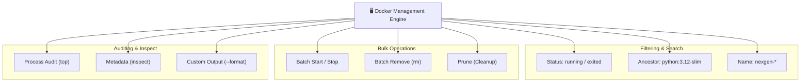

# 📋 Container Management

## Container Management কী? (What)

**Container Management** হলো আপনার সিস্টেমে বা ক্লাউড সার্ভারে চলমান ও বন্ধ থাকা অসংখ্য কন্টেইনারকে সুশৃঙ্খলভাবে তদারকি ও পরিচালনা করার সামগ্রিক প্রক্রিয়া।

এর মধ্যে রয়েছে নির্দিষ্ট শর্ত দিয়ে কন্টেইনার খুঁজে বের করা (**Filtering**), টার্মিনাল আউটপুট নিজের মতো সাজানো (**Custom Formatting**), কন্টেইনারের নাম পরিবর্তন করা (**Renaming**), কন্টেইনারের ভেতরের রানিং প্রসেস পর্যবেক্ষণ করা (**Process Auditing**), একসাথে সব কন্টেইনার বন্ধ বা ডিলিট করার মতো **ব্যাচ অপারেশন (Batch Operations)**, এবং সিস্টেম ক্লিনআপ।

:::info ম্যানেজমেন্টের মূল উদ্দেশ্য
একটি বা দুটি কন্টেইনার চালানো সহজ। কিন্তু যখন একই সার্ভারে ২৫-৩০টি মাইক্রোসার্ভিস (FastAPI, PostgreSQL, Redis, Celery, Nginx) চলতে থাকে, তখন অ্যাডভান্সড ম্যানেজমেন্ট কমান্ড ছাড়া কাজ করা অসম্ভব হয়ে পড়ে।
:::

---

## কেন Container Management আয়ত্ত করা দরকার? (Why)

```
❌ বেসিক কমান্ডে আটকে থাকলে (Before):
   - ৩০টি কন্টেইনারের মধ্য থেকে কাঙ্ক্ষিত কন্টেইনার খুঁজতে চোখ দিয়ে স্ক্রল করতে করতে ক্লান্ত
   - সব কন্টেইনার বন্ধ করতে একটা একটা করে আইডি কপি-পেস্ট করে `docker stop` দেওয়া (১০ মিনিট নষ্ট)
   - কোন কন্টেইনার কতক্ষণ ধরে এক্সিট হয়ে আছে তা ফিল্টার করতে না পারা
   - অপ্রয়োজনীয় কন্টেইনার জমতে জমতে সার্ভারের ডিস্ক ও পোর্ট ব্লক হয়ে যাওয়া

✅ অ্যাডভান্সড ম্যানেজমেন্ট জানলে (After):
   - `--filter` দিয়ে এক পলকে শুধুমাত্র ক্র্যাশ হওয়া বা নির্দিষ্ট ইমেজের কন্টেইনার খুঁজে পাওয়া যায়
   - এক লাইনের ব্যাচ কমান্ড দিয়ে সেকেন্ডের মধ্যে সব স্টপড কন্টেইনার ডিলিট করা যায়
   - `--format` দিয়ে স্ক্রিপ্ট ও মনিটরিংয়ের জন্য পরিচ্ছন্ন কাস্টম টেবিল বানানো যায়
   - `docker container top` দিয়ে হোস্ট থেকেই কন্টেইনারের প্রসেস অডিট করা যায়
```

---

## Analogy — এয়ার ট্রাফিক কন্ট্রোল ও গুদাম ব্যবস্থাপনা ✈️📦

কন্টেইনার ম্যানেজমেন্টকে একটি **আন্তর্জাতিক বিমানবন্দরের এয়ার ট্রাফিক কন্ট্রোল (ATC) অথবা আমাজন ওয়্যারহাউস**-এর সাথে তুলনা করা যায়:

- **এয়ার ট্রাফিক কন্ট্রোলার** = DevOps ইঞ্জিনিয়ার / আপনি
- **রাডারের স্ক্রিন** = `docker container ls`
- **নির্দিষ্ট এয়ারলাইন্সের ফ্লাইট ফিল্টার করা** = `docker container ls --filter "ancestor=postgres"`
- **রানওয়ে খালি করার কমান্ড** = `docker container prune`
- **জরুরি অবস্থায় সব ফ্লাইট গ্রাউন্ডেড করা** = ব্যাচ অপারেশন `docker stop $(docker ps -q)`

কন্ট্রোলার যদি একটা একটা প্লেনের দিকে না তাকিয়ে কম্পিউটার স্ক্রিনের ফিল্টার দিয়ে সব ম্যানেজ করেন, কাজ নিখুঁত হয়।

---

## How it Works — Management Architecture



---

## Hands-on: অ্যাডভান্সড কন্টেইনার ম্যানেজমেন্ট কমান্ডসমূহ

আমাদের **NexGen AI** প্রজেক্টের বিভিন্ন সার্ভিস (FastAPI API, PostgreSQL Database, Redis Cache) ধরে বাস্তব কমান্ডগুলো শিখি:

### ১. অ্যাডভান্সড ফিল্টারিং (`--filter`)

হাজারো কন্টেইনারের ভেতর থেকে সুনির্দিষ্ট কন্টেইনার খুঁজে বের করার জন্য `--filter` (বা `-f`) ফ্ল্যাগ ব্যবহার করা হয়।

#### ক. স্ট্যাটাস অনুযায়ী ফিল্টার করা:
```bash
# শুধুমাত্র এক্সিট (বন্ধ) হওয়া কন্টেইনারগুলো দেখা
docker container ls -a --filter "status=exited"

# শুধুমাত্র রানিং কন্টেইনারগুলো দেখা
docker container ls --filter "status=running"
```

#### খ. ইমেজের উৎস (Ancestor) অনুযায়ী ফিল্টার:
```bash
# PostgreSQL ইমেজ থেকে তৈরি সমস্ত কন্টেইনার খুঁজে বের করা
docker container ls -a --filter "ancestor=postgres:16-alpine"
```

#### গ. নাম (Name) অনুযায়ী ওয়াইল্ডকার্ড ফিল্টার:
```bash
# 'nexgen' দিয়ে শুরু হওয়া সমস্ত কন্টেইনার দেখা
docker container ls -a --filter "name=nexgen"
```

#### ঘ. নির্দিষ্ট এক্সিট কোড দিয়ে ফিল্টার (ক্র্যাশ ডিবাগিং):
```bash
# যে সমস্ত কন্টেইনার এরর বা ক্র্যাশ (Exit Code != 0) করে বন্ধ হয়েছে
docker container ls -a --filter "exited=1" --filter "exited=137"
```

**বাস্তব Output:**
```text
CONTAINER ID   IMAGE                COMMAND                  CREATED          STATUS                       PORTS     NAMES
a1b2c3d4e5f6   python:3.12-slim     "python3 main.py"        10 minutes ago   Exited (1) 8 minutes ago               nexgen-api-broken
```

---

### ২. কাস্টম টেবিল ফরম্যাটিং (`--format`)

ডিফল্ট `docker ps` এর আউটপুট অনেক সময় স্ক্রিনের ডানে ভেঙে যায়। Go Template ব্যবহার করে আপনি শুধু আপনার প্রয়োজনীয় কলামগুলো পরিচ্ছন্নভাবে দেখতে পারেন:

```bash
# শুধুমাত্র ID, Name, Status এবং Ports একটি সুন্দর ট্যাবুলেটেড টেবিলে দেখা
docker container ls -a --format "table {{.ID}}\t{{.Names}}\t{{.Status}}\t{{.Ports}}"
```

**বাস্তব Output:**
```text
CONTAINER ID   NAMES               STATUS          PORTS
8b9f3a12e4c7   nexgen-postgres     Up 2 hours      0.0.0.0:5432->5432/tcp
f4e3d2c1b0a9   nexgen-api          Up 15 minutes   0.0.0.0:8000->8000/tcp
e5a4d3c2b1f0   nexgen-debug        Exited (0)      
```

:::tip বারবার বড় ফরম্যাট না লিখে Alias তৈরি করুন
Bash / Zsh-এ আপনার `~/.bashrc` বা `~/.zshrc` ফাইলে একটি শর্টকাট লিখে রাখুন:
```bash
alias dps='docker container ls --format "table {{.Names}}\t{{.Status}}\t{{.Ports}}\t{{.Image}}"'
```
এখন শুধু `dps` লিখলেই সুন্দর পরিচ্ছন্ন টেবিল দেখতে পাবেন!
:::

---

### ৩. কন্টেইনারের নাম পরিবর্তন করা (`docker container rename`)

যদি কোনো কন্টেইনারের নাম ভুল দেন বা পরবর্তীতে আপডেট করতে চান:

```bash
# সিনট্যাক্স: docker container rename <OLD_NAME> <NEW_NAME>

docker container rename nexgen-postgres nexgen-db-primary
```

```bash
# ভেরিফাই করি:
docker container ls --filter "name=nexgen-db-primary"
```

---

### ৪. কন্টেইনারের রানিং প্রসেস দেখা (`docker container top`)

কন্টেইনারের ভেতরে না ঢুকেই হোস্ট মেশিন থেকে কন্টেইনারের ভেতরে কোন কোন লিনাক্স প্রসেস, কত PID এবং কত মেমরি নিয়ে চলছে তা দেখার দারুণ কমান্ড:

```bash
docker container top nexgen-db-primary
```

**বাস্তব Output:**
```text
UID      PID       PPID      C   STIME   TTY   TIME       CMD
systemd+ 45120     45098     0   10:30   ?     00:00:01   postgres
systemd+ 45180     45120     0   10:30   ?     00:00:00   postgres: checkpointer
systemd+ 45181     45120     0   10:30   ?     00:00:00   postgres: background writer
systemd+ 45183     45120     0   10:30   ?     00:00:00   postgres: walwriter
systemd+ 45184     45120     0   10:30   ?     00:00:00   postgres: autovacuum launcher
```

---

### ৫. ব্যাচ অপারেশন — একসাথে একাধিক কন্টেইনার পরিচালনা ⚡

প্রফেশনাল ডেভেলপাররা কখনোই এক এক করে কন্টেইনার বন্ধ বা ডিলিট করেন না। Command Substitution (`-q` অর্থাৎ Quiet Mode - শুধু Container ID রিটার্ন করে) ব্যবহার করে ব্যাচ অপারেশন করা হয়।

#### ক. সমস্ত রানিং কন্টেইনার একসাথে বন্ধ করা:
```bash
# Linux / macOS Bash:
docker container stop $(docker container ls -q)

# Windows PowerShell:
docker container stop (docker container ls -q)
```

#### খ. সমস্ত বন্ধ (Exited) কন্টেইনার একসাথে মুছে ফেলা:
```bash
# Linux / macOS Bash:
docker container rm $(docker container ls -a -q --filter "status=exited")

# Windows PowerShell:
docker container rm (docker container ls -a -q --filter "status=exited")
```

#### গ. একটি নির্দিষ্ট প্রজেক্টের সমস্ত কন্টেইনার এক লাইনে ফোর্স রিমুভ করা:
```bash
# 'nexgen' নামের সব কন্টেইনার মুছে দেওয়া
docker container rm -f $(docker container ls -a -q --filter "name=nexgen")
```

---

### ৬. কন্টেইনার ক্লিনআপ ফিল্টার সহ (`docker container prune`)

সব বন্ধ থাকা কন্টেইনার ডিলিট করার অফিশিয়াল সেফ কমান্ড:

```bash
# ২৪ ঘণ্টার বেশি পুরনো সমস্ত বন্ধ কন্টেইনার ডিলিট করা
docker container prune --filter "until=24h"
```

**বাস্তব Output:**
```text
WARNING! This will remove all stopped containers older than 24h.
Are you sure you want to continue? [y/N] y
Deleted Containers:
e5a4d3c2b1f0
3e4f5a6b7c8d

Total reclaimed space: 12.45MB
```

---

## Comparison Table — Management Techniques

| অপারেশন | ট্র্যাডিশনাল / ম্যানুয়াল পদ্ধতি | আধুনিক প্রো-পদ্ধতি (Pro Technique) |
|---|---|---|
| **কন্টেইনার খোঁজা** | `docker ps -a` চালিয়ে স্ক্রল করা | `docker ps --filter "name=nexgen" --filter "status=running"` |
| **সব বন্ধ করা** | এক এক করে `docker stop id1 id2 id3` | `docker stop $(docker ps -q)` |
| **আউটপুট দেখা** | লম্বা লাইন ভেঙে যাওয়া টেবিল | `docker ps --format "table {{.Names}}\t{{.Status}}\t{{.Ports}}"` |
| **প্রসেস পর্যবেক্ষণ** | কন্টেইনারে `exec` করে ঢুকে `ps aux` দেওয়া | সরাসরি হোস্ট থেকে `docker container top <name>` |
| **স্টপড কন্টেইনার সাফ** | এক এক করে `docker rm <id>` | `docker container prune --filter "until=24h"` |

---

## Common Mistakes — নতুনদের সাধারণ ভুল

### ১. খালি ব্যাচ কমান্ড চালিয়ে এরর খাওয়া
❌ **ভুল:** কোনো রানিং কন্টেইনার না থাকা অবস্থায় `docker stop $(docker ps -q)` চালালে এরর আসা: `docker stop requires at least 1 argument`.
✅ **সঠিক:** এটি স্বাভাবিক ওয়ার্নিং কারণ `docker ps -q` খালি আউটপুট দিয়েছে। স্ক্রিপ্টে ব্যবহারের সময় শর্ত দিয়ে বা `docker stop $(docker ps -q) 2>/dev/null || true` ব্যবহার করুন।

### ২. প্রোডাকশনে অসাবধানতাবশত `rm -f $(docker ps -a -q)` চালানো
❌ **ভুল:** সব কন্টেইনার একবারে ডিলিট করার মোহে প্রোডাকশন ডাটাবেজ সহ সব সার্ভিস সেকেন্ডে উড়িয়ে দেওয়া!
✅ **সঠিক:** প্রোডাকশন সার্ভারে কখনোই গ্লোবাল ব্যাচ রিমুভ কমান্ড চালাবেন না। নির্দিষ্ট ফিল্টার (যেমন `--filter "name=staging"`) ব্যবহার করুন।

### ৩. কন্টেইনারের নাম আপডেট করতে গিয়ে নতুন কন্টেইনার বানিয়ে ফেলা
❌ **ভুল:** নাম বদলাতে কন্টেইনার ডিলিট করে আবার `docker run` দেওয়া (এতে ভেতরের আনসেভড ডাটা হারিয়ে যেতে পারে)।
✅ **সঠিক:** সরাসরি `docker container rename <old> <new>` ব্যবহার করুন।

---

## Best Practices

1. **সর্বদা লেবেলিং ও নেমিং কনভেনশন মেনে চলুন**: সব কন্টেইনারের নামে এনভায়রনমেন্ট উল্লেখ করুন (যেমন `nexgen-api-prod`, `nexgen-api-staging`, `nexgen-db-dev`)।
2. **ডকার ইনস্পেক্ট ফিল্টারিং ব্যবহার করুন**: নির্দিষ্ট আইপি বা স্টেট দেখতে পুরো JSON না পড়ে `--format` ব্যবহার করুন:
   ```bash
   # কন্টেইনারের IP Address বের করা
   docker container inspect --format '{{range .NetworkSettings.Networks}}{{.IPAddress}}{{end}}' nexgen-db-primary
   ```
3. **নিয়মিত শিডিউলড প্রুন (Prune) চালান**: সিআই/সিডি রানার বা ডেভ সার্ভারে ক্রনজব দিয়ে প্রতি সপ্তাহে `docker container prune -f --filter "until=168h"` সেট করে রাখুন।

---

## Interview Questions ও Answers

### ১. `docker container ls` এর আউটপুট কীভাবে `--format` ফ্ল্যাগ দিয়ে কাস্টমাইজ করা যায়?

**উত্তর:** ডকার CLI আউটপুট ফরম্যাট করার জন্য **Go Templates** সিনট্যাক্স সমর্থন করে। `--format` ফ্ল্যাগের সাথে `table` কিওয়ার্ড এবং প্লেসহোল্ডার যেমন `{{.ID}}`, `{{.Names}}`, `{{.Image}}`, `{{.Status}}`, `{{.Ports}}` ইত্যাদি ব্যবহার করা হয়।
উদাহরণ:
```bash
docker container ls --format "table {{.Names}}\t{{.Status}}\t{{.Ports}}"
```
এটি অপ্রয়োজনীয় বড় বড় কলাম বাদ দিয়ে শুধুমাত্র কাঙ্ক্ষিত তথ্যের একটি পরিচ্ছন্ন ট্যাব-সেপারেটেড টেবিল প্রদর্শন করে।

---

### ২. ডকারে সব স্টপড কন্টেইনার একসাথে ডিলিট করার দুটি ভিন্ন উপায় কী কী?

**উত্তর:** 
১. **অফিশিয়াল প্রুন কমান্ড:** 
   ```bash
   docker container prune -f
   ```
   এটি সমস্ত এক্সিটেড/স্টপড কন্টেইনার এক ক্লিকে মুছে দেয়। ফিল্টার দিয়ে সময়ও নির্ধারণ করা যায় (যেমন `--filter until=24h`)।
২. **কমান্ড সাবস্টিটিউশন পদ্ধতি:** 
   ```bash
   docker container rm $(docker container ls -a -q --filter "status=exited")
   ```
   এটি ফিল্টার করা আইডিগুলো ধরে ব্যাচ আকারে ডিলিট করে।

---

### ৩. `docker container top` কমান্ডের কার্যকারিতা কী?

**উত্তর:** `docker container top <container_name>` কমান্ডের মাধ্যমে কন্টেইনারের ভেতরে প্রবেশ না করেই সরাসরি হোস্ট টার্মিনাল থেকে ঐ কন্টেইনারের ভেতরে বর্তমানে কোন কোন লিনাক্স প্রসেস চলছে তা পর্যবেক্ষণ করা যায়। 
এটি প্রতিটি প্রসেসের হোস্ট PID, কন্টেইনার ইউজার, CPU টাইম এবং এক্সিকিউটেবল কমান্ড প্রিন্ট করে। সার্ভারে কোনো কন্টেইনার অতিরিক্ত সিপিইউ নিচ্ছে কিনা বা অপ্রত্যাশিত কোনো ব্যাকগ্রাউন্ড প্রসেস চলছে কিনা তা দ্রুত ডায়াগনসিস করতে এটি অত্যন্ত কার্যকরী।

---

### ৪. `docker inspect` থেকে শুধুমাত্র কন্টেইনারের আইপি অ্যাড্রেস বা স্ট্যাটাস ফিল্টার করার উপায় কী?

**উত্তর:** `docker inspect` এর সাথে `--format` বা `-f` ফ্ল্যাগ ব্যবহার করে সরাসরি নেস্টেড JSON পাথ থেকে ডেটা বের করা যায়:
- **কন্টেইনারের IP Address দেখতে:**
  ```bash
  docker inspect -f '{{.NetworkSettings.IPAddress}}' nexgen-postgres
  ```
- **কন্টেইনার রানিং কিনা (Boolean) দেখতে:**
  ```bash
  docker inspect -f '{{.State.Running}}' nexgen-postgres
  ```

---

## Summary

| বিষয় | কমান্ড / ফ্ল্যাগ | কী কাজ করে |
|---|---|---|
| **স্ট্যাটাস ফিল্টার** | `--filter "status=exited"` | নির্দিষ্ট অবস্থার কন্টেইনার খোঁজে |
| **ইমেজ ফিল্টার** | `--filter "ancestor=<image>"` | নির্দিষ্ট ইমেজ থেকে তৈরি কন্টেইনার খোঁজে |
| **কাস্টম টেবিল** | `--format "table {{.Names}}\t{{.Status}}"` | পরিচ্ছন্ন কাস্টম কলামের টেবিল তৈরি করে |
| **নাম পরিবর্তন** | `docker container rename <old> <new>` | কন্টেইনারের নাম আপডেট করে |
| **প্রসেস অডিট** | `docker container top <name>` | কন্টেইনারের রানিং প্রসেস লিস্ট দেখে |
| **ব্যাচ স্টপ** | `docker stop $(docker ps -q)` | সব রানিং কন্টেইনার একসাথে থামায় |
| **টাইম-ফিল্টার প্রুন** | `docker container prune --filter "until=24h"` | নির্দিষ্ট সময়ের পুরনো কন্টেইনার ডিলিট করে |

---

## পরবর্তী ধাপ

আমরা সফলভাবে কন্টেইনার ফিল্টারিং, ব্যাচ অপারেশন এবং অ্যাডভান্সড ম্যানেজমেন্ট শিখে ফেলেছি। পরবর্তী টপিকে আমরা দেখব **Container Interaction** (`docker/interaction.md`) — যেখানে একটি রানিং কন্টেইনারের ভেতরে প্রবেশ করা (`exec`), ফাইল আদান-প্রদান করা (`cp`), কনসোল অ্যাটাচ করা (`attach`) এবং লাইভ লগ পর্যবেক্ষণ করার ট্রিকস শিখব।
