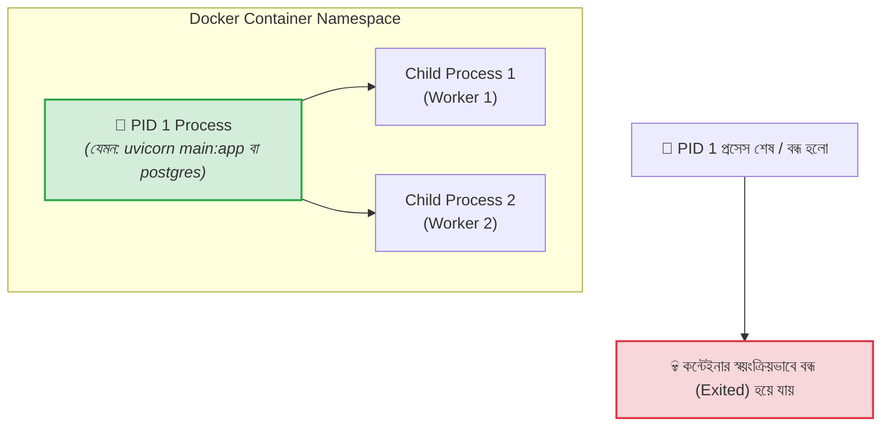
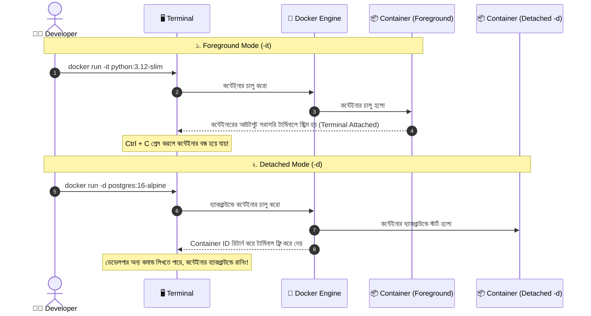

# 🚀 Running Containers

## Container চালানো কী? (What)

**Running a Container** মানে হলো একটি ডকার ইমেজ (রিড-অনলি ব্লুপ্রিন্ট) থেকে একটি সম্পূর্ণ বিচ্ছিন্ন ও সক্রিয় **লাইভ প্রসেস ইন্সট্যান্স** চালু করা। 

যখন আপনি `docker container run` কমান্ড দেন, ডকার ইঞ্জিন হোস্ট অপারেটিং সিস্টেমের কার্নেল ব্যবহার করে কন্টেইনারের জন্য আলাদা **Namespace** (আইসোলেশন), **cgroups** (রিসোর্স লিমিট), এবং ইমেজের ওপরে একটি পাতলা **Thin Writable Layer** তৈরি করে আপনার নির্দিষ্ট অ্যাপ্লিকেশনটি এক্সিকিউট করা শুরু করে।

:::info `docker run` এর মূল সিনট্যাক্স
```bash
docker container run [OPTIONS] IMAGE [COMMAND] [ARG...]
```
শর্টকাট হিসেবে `docker run [OPTIONS] IMAGE [COMMAND] [ARG...]` সমার্থকভাবে কাজ করে।
:::

---

## কেন Container সঠিকভাবে রান করা গুরুত্বপূর্ণ? (Why)

```
❌ ভুলভাবে কন্টেইনার রান করলে (Before):
   - ব্যাকগ্রাউন্ডে সার্ভার চালাতে গিয়ে টার্মিনাল লক হয়ে বসে থাকে
   - টার্মিনাল বন্ধ করলেই বা নেটওয়ার্ক ডিসকানেক্ট হলেই লাইভ এপিআই ক্র্যাশ করে
   - শত শত টেস্ট কন্টেইনার বন্ধ হয়ে ডিস্কে আবর্জনা হিসেবে জমা হয়
   - সার্ভার রিস্টার্ট হলে ডাটাবেজ নিজে নিজে স্টার্ট হয় না

✅ সঠিক ফ্ল্যাগ ও পলিসি দিয়ে রান করলে (After):
   - Detached Mode (`-d`) দিয়ে ব্যাকগ্রাউন্ডে নিরবচ্ছিন্ন সার্ভার চালানো যায়
   - `--rm` ফ্ল্যাগ দিয়ে ওয়ান-টাইম স্ক্রিপ্ট শেষ হওয়ার সাথে সাথে অটো-ক্লিন হয়ে যায়
   - `--restart unless-stopped` দিয়ে প্রোডাকশন সার্ভার রিবুট হলেও ডাটাবেজ অটো রিস্টার্ট হয়
   - প্রতিটি সার্ভিসকে নিজস্ব সুন্দর নামে (`--name nexgen-api`) চেনা ও ম্যানেজ করা যায়
```

---

## Analogy — হোটেল রুম ও ক্যাপসুল পডের উপমা 🏨

কন্টেইনার রান করাকে একটি **সম্পূর্ণ ফার্নিশড হোটেল রুম বা ক্যাপসুল পড ভাড়া নেওয়ার মতো** ভাবা যায়:

- **Docker Image** = হোটেল রুমের স্ট্যান্ডার্ড আর্কিটেকচারাল ডিজাইন (বেড, লাইট, এসি কোথায় থাকবে)।
- **`docker run`** = হোটেলের রিসিপশনে চাবি নিয়ে রুমে প্রবেশ করা এবং এসি/টিভি অন করা।
- **Foreground Mode (`-it`)** = আপনি নিজে রুমে বসে আছেন এবং সরাসরি টিভি দেখছেন। আপনি রুম থেকে বের হয়ে গেলেই টিভি বন্ধ হয়ে যায়।
- **Detached Mode (`-d`)** = রুমে ওয়াশিং মেশিনে কাপড় ধুতে দিয়ে চাবি লক করে আপনি বাইরে কাজে চলে গেছেন (ব্যাকগ্রাউন্ডে ওয়াশিং মেশিন চলছে)।
- **`--rm` ফ্ল্যাগ** = চেকআউট করার সাথে সাথে হোটেল স্টাফ এসে রুমটি একদম আগের মতো পরিষ্কার করে ফেলা।

---

## How it Works — PID 1 ও কন্টেইনারের এক্সিকিউশন মেকানিজম

কন্টেইনারের সবচেয়ে গুরুত্বপূর্ণ ইন্টারনাল কনসেপ্ট হলো **PID 1 (Process ID 1)**।

হোস্ট লিনাক্স সিস্টেমে যেমন `systemd` বা `init` হলো সব প্রসেসের পিতা (PID 1), ঠিক তেমনি প্রতিটা ডকার কন্টেইনারের ভেতরে যে মূল কমান্ডটি (`CMD` বা `ENTRYPOINT`) চলে, সেটি ঐ কন্টেইনারের জন্য **PID 1 প্রসেস** হিসেবে কাজ করে।



:::warning গোল্ডেন রুল (Golden Rule of Containers)
**"A container lives only as long as its PID 1 process lives."**
যদি আপনার কন্টেইনারের ভেতরের মূল প্রসেসটি (PID 1) কোনো কারণে কাজ শেষ করে বা ক্র্যাশ করে, তবে কন্টেইনারটি সাথে সাথে বন্ধ (Stopped / Exited) হয়ে যাবে।
:::

---

## Foreground বনাম Detached Mode (Background)

কন্টেইনার মূলত দুটি মোডে রান করা যায়:



---

## Hands-on: কন্টেইনার চালানোর গুরুত্বপূর্ণ কমান্ড ও ফ্ল্যাগসমূহ

আমাদের **NexGen AI** প্রজেক্টের ব্যাকএন্ড এবং ডাটাবেজ মাথায় রেখে বাস্তব কমান্ডগুলো অনুশীলন করি:

### ১. ফোরগ্রাউন্ডে ওয়ান-টাইম টাস্ক চালানো (`--rm` সহ)

যখন কোনো কুইক স্ক্রিপ্ট, ডাটাবেজ মাইগ্রেশন টেস্ট বা পাইথন কমান্ড চালাতে চান যা কাজ শেষ হলে আর প্রয়োজন নেই:

```bash
# একটি পাইথন কন্টেইনারে সরাসরি এক লাইনের কোড টেস্ট করা
docker container run --rm python:3.12-slim python3 -c "print('🚀 NexGen AI Engine Initialized successfully!')"
```

**ফ্ল্যাগ ব্যাখ্যা:**
- `--rm`: কন্টেইনারটির কাজ শেষ হয়ে বন্ধ হওয়ার সাথে সাথে স্বয়ংক্রিয়ভাবে ডিস্ক থেকে কন্টেইনার মেটাডেটা মুছে ফেলবে। (ডিস্ক ক্লিন রাখার জন্য দারুণ ফ্ল্যাগ)।
- `python3 -c "..."`: ইমেজের ডিফল্ট কমান্ডকে ওভাররাইড করে সরাসরি পাইথন কোড এক্সিকিউট করা।

**বাস্তব Output:**
```text
🚀 NexGen AI Engine Initialized successfully!
```
*(কমান্ড শেষ হওয়ার পর `docker ps -a` দিলে এই কন্টেইনারের কোনো চিহ্ন থাকবে না, কারণ `--rm` একে ক্লিন করে দিয়েছে।)*

---

### ২. ব্যাকগ্রাউন্ডে কন্টেইনার চালানো (Detached Mode `-d`)

ডাটাবেজ বা এপিআই সার্ভার সবসময় ব্যাকগ্রাউন্ডে চালু রাখতে হয় যাতে টার্মিনাল ব্লক না হয়:

```bash
# আমাদের NexGen AI এর PostgreSQL ডাটাবেজ ব্যাকগ্রাউন্ডে চালু করা
docker container run -d \
  --name nexgen-postgres \
  -e POSTGRES_DB=nexgendb \
  -e POSTGRES_USER=postgres \
  -e POSTGRES_PASSWORD=nexgenpassword123 \
  -p 5432:5432 \
  postgres:16-alpine
```

**কমান্ডের প্রতিটা ফ্ল্যাগের বাংলায় ব্যাখ্যা:**
- `-d` (`--detach`): কন্টেইনারকে ব্যাকগ্রাউন্ডে রান করে এবং টার্মিনালে সম্পূর্ণ লং কন্টেইনার আইডি রিটার্ন করে।
- `--name nexgen-postgres`: কন্টেইনারটির একটি নির্দিষ্ট অর্থপূর্ণ নাম দেয়।
- `-e` (`--env`): কন্টেইনারের ভেতরে এনভায়রনমেন্ট ভেরিয়েবল পাস করে (ডাটাবেজের নাম, ইউজার ও পাসওয়ার্ড)।
- `-p 5432:5432`: হোস্ট মেশিনের 5432 পোর্টের সাথে কন্টেইনারের 5432 পোর্ট ম্যাপ করে (আমরা পোর্ট ম্যাপিং টপিকে এটি আরও গভীরভাবে দেখব)।
- `postgres:16-alpine`: আমাদের লাইটওয়েট ডাটাবেজ ইমেজ।

**বাস্তব Output:**
```text
8b9f3a12e4c7d05f6e8b7a9c1d2e3f4a5b6c7d8e9f0a1b2c3d4e5f6a7b8c9d0e
```

```bash
# স্ট্যাটাস চেক করি:
docker container ls
```

**Output:**
```text
CONTAINER ID   IMAGE                COMMAND                  CREATED          STATUS          PORTS                    NAMES
8b9f3a12e4c7   postgres:16-alpine   "docker-entrypoint.s…"   10 seconds ago   Up 9 seconds    0.0.0.0:5432->5432/tcp   nexgen-postgres
```

---

### ৩. ইন্টারঅ্যাক্টিভ ব্যাশ শেল প্রবেশ (`-it`)

কন্টেইনারের ভেতরে ঢুকে কমান্ড চালিয়ে পরীক্ষা করতে চাইলে:

```bash
# একটি নতুন উবুন্টু/পাইথন কন্টেইনারে ঢুকে লাইভ কাজ করা
docker container run -it --name nexgen-debug --rm python:3.12-slim bash
```

**বাস্তব Output (কন্টেইনারের ভেতরের প্রম্পট):**
```text
root@e5a4d3c2b1f0:/# python3 --version
Python 3.12.4
root@e5a4d3c2b1f0:/# pip list
Package Version
------- -------
pip     24.0
root@e5a4d3c2b1f0:/# exit
exit
```

:::tip কন্টেইনার বন্ধ না করে বের হওয়ার সিক্রেট শর্টকাট
যদি `-it` মোডে কোনো কন্টেইনারে থাকেন এবং কন্টেইনারটিকে **রানিং রেখেই টার্মিনাল থেকে বের হতে চান**, তবে `exit` না লিখে কিবোর্ডে চাপুন:
**`Ctrl + P` এবং তারপর `Ctrl + Q`** (Detach Sequence)।
কন্টেইনার ব্যাকগ্রাউন্ডে চলতে থাকবে!
:::

---

### ৪. Restart Policies — স্বয়ংক্রিয়ভাবে কন্টেইনার রিস্টার্ট কনফিগারেশন

প্রোডাকশন সার্ভারে পাওয়ার চলে গেলে বা অ্যাপ্লিকেশন ক্র্যাশ করলে আপনি নিশ্চয়ই ম্যানুয়ালি গিয়ে কন্টেইনার স্টার্ট করতে চাইবেন না। এজন্য ডকারে **Restart Policies** রয়েছে:

```bash
# সার্ভার রিবুট হলেও ডাটাবেজ যেন অটো চালু হয়:
docker container run -d \
  --name nexgen-db-prod \
  --restart unless-stopped \
  -e POSTGRES_PASSWORD=securepass \
  postgres:16-alpine
```

---

## Comparison Table — Restart Policies এর গভীর তুলনা

| পলিসি | সিনট্যাক্স | অ্যাপ ক্র্যাশ করলে কি রিস্টার্ট হবে? | ডকার/সার্ভার রিবুট হলে রিস্টার্ট হবে? | কখন ব্যবহার করবেন |
|---|---|---|---|---|
| **no** | `--restart no` (Default) | ❌ না | ❌ না | ওয়ান-টাইম টেস্ট বা লোকাল স্ক্রিপ্ট |
| **on-failure** | `--restart on-failure[:max-retries]` | ✅ হ্যাঁ (যদি Exit Code ≠ 0 হয়) | ❌ না (যদি স্বাভাবিকভাবে বন্ধ ছিল) | ব্যাকগ্রাউন্ড ক্রন জব বা কিউ ওয়ার্কার |
| **always** | `--restart always` | ✅ হ্যাঁ | ✅ হ্যাঁ (এমনকি ম্যানুয়ালি স্টপ করলেও রিবুটে স্টার্ট হয়) | ক্রিটিকাল সিস্টেম প্রসেস |
| **unless-stopped** | `--restart unless-stopped` | ✅ হ্যাঁ | ✅ হ্যাঁ (যদি না আপনি নিজে ম্যানুয়ালি `docker stop` করে রাখেন) | ⭐ **প্রোডাকশন ডাটাবেজ ও ওয়েব সার্ভারের জন্য সেরা (Recommended)** |

:::tip `always` বনাম `unless-stopped` এর সূক্ষ্ম পার্থক্য
ধরুন আপনি মেইনটেনেন্সের জন্য `docker stop nexgen-postgres` দিয়ে ডাটাবেজ থামিয়ে রেখেছেন। 
এখন যদি হোস্ট সার্ভার রিস্টার্ট হয়:
- `always` পলিসি থাকলে: ডকার জোর করে ডাটাবেজ **চালু করে দেবে** (যা আপনি চাননি)।
- `unless-stopped` পলিসি থাকলে: ডকার মনে রাখবে আপনি নিজে থামিয়েছিলেন, তাই সেটিকে **বন্ধই রাখবে**। এজন্য `unless-stopped` সবচেয়ে জনপ্রিয়।
:::

---

## Common Mistakes — নতুনদের সাধারণ ভুল

### ১. নাম ছাড়া কন্টেইনার চালানো
❌ **ভুল:** `docker run -d postgres:16-alpine` (নাম না দিলে ডকার `agitated_morse` বা `flamboyant_turing` এর মতো অদ্ভুত নাম দেয়, যা দিয়ে স্ক্রিপ্টে রেফারেন্স করা অসম্ভব)।
✅ **সঠিক:** সবসময় `--name` ফ্ল্যাগ ব্যবহার করুন: `docker run -d --name nexgen-db postgres:16-alpine`।

### ২. কন্টেইনার সাথে সাথে Exit হয়ে যাওয়া না বোঝা
❌ **ভুল:** `docker run -d ubuntu` দেওয়ার পর কন্টেইনার চালু না থাকা।
✅ **সঠিক:** উবুন্টু ইমেজের ডিফল্ট কমান্ড হলো `/bin/bash`। ব্যাকগ্রাউন্ডে ইনপুট ছাড়া ব্যাশের কোনো কাজ না থাকায় সে সাথে সাথে exit করে যায়। কন্টেইনার ব্যাকগ্রাউন্ডে চলতে হলে তাকে কোনো অ্যাক্টিভ সার্ভিস (যেমন `uvicorn`, `postgres`, `nginx`) বা স্লিপ লুপে থাকতে হবে।

### ৩. `-d` এবং `--rm` একসাথে সতর্কতাহীন ব্যবহার
❌ **ভুল:** ব্যাকগ্রাউন্ডে চলা কন্টেইনারে `--rm` দিয়ে পরে লগ না পেয়ে বিপাকে পড়া।
✅ **সঠিক:** যদি ডিবাগিংয়ের জন্য পরে কন্টেইনারের লগ দেখার প্রয়োজন থাকে, তবে `--rm` দেওয়া থেকে বিরত থাকুন।

---

## Best Practices

1. **প্রোডাকশন কন্টেইনারে `--restart unless-stopped` ব্যবহার করুন**: এতে সার্ভার ক্র্যাশ বা রিবুটের পর সার্ভিস ডাউন-টাইম ন্যূনতম হয়।
2. **কন্টেইনারের নাম প্রজেক্ট প্রিফিক্স দিয়ে রাখুন**: যেমন `nexgen-api-backend`, `nexgen-api-db`, `nexgen-api-redis`।
3. **টেস্টিং ও মাইগ্রেশন স্ক্রিপ্টে `--rm` ব্যবহার করুন**: এতে লোকাল সিস্টেমে অপ্রয়োজনীয় স্টপড কন্টেইনার জমা হয়ে ডিস্ক নষ্ট করে না।
4. **কনফিগারেশন এনভায়রনমেন্ট ভেরিয়েবলে রাখুন (`-e`)**: ডাটাবেজ ক্রেডেনশিয়াল সরাসরি ইমেজে হার্ডকোড না করে `docker run -e` দিয়ে পাস করুন।

---

## Interview Questions ও Answers

### ১. `docker create`, `docker start` এবং `docker run` এর মধ্যে সম্পর্ক কী?

**উত্তর:** 
- `docker create`: ইমেজ থেকে শুধুমাত্র কন্টেইনারের লেয়ার ও কনফিগারেশন তৈরি করে রাখে, কিন্তু প্রসেস চালু করে না (স্ট্যাটাস: `Created`)।
- `docker start`: পূর্বে তৈরি হওয়া বা বন্ধ থাকা কন্টেইনারের প্রসেস শুরু করে (স্ট্যাটাস: `Running`)।
- **`docker run` = `docker create` + `docker start`**। এটি এক কমান্ডেই ইমেজ না থাকলে পুল করে, কন্টেইনার তৈরি করে এবং প্রসেস এক্সিকিউট করে চালু করে দেয়।

---

### ২. কেন `docker run -d ubuntu` দিলে কন্টেইনার সাথে সাথে বন্ধ হয়ে যায়?

**উত্তর:** ডকার কন্টেইনারের অস্তিত্ব সম্পূর্ণরূপে তার **PID 1 প্রসেসের** ওপর নির্ভরশীল। `ubuntu` ইমেজের ডিফল্ট কমান্ড হলো `/bin/bash`। Detached Mode (`-d`) এ যখন কোনো কন্টেইনার রান করা হয় কিন্তু কোনো ইন্টারঅ্যাক্টিভ ইনপুট স্ট্রিম (`-i`) বা লং-রানিং প্রসেস দেওয়া হয় না, তখন `bash` দেখে যে তার করার মতো কোনো কাজ নেই। তাই সে অবিলম্বে 0 এক্সিট কোড দিয়ে বন্ধ হয়ে যায়। PID 1 প্রসেস শেষ হয়ে যাওয়ার কারণে ডকার ইঞ্জিনও কন্টেইনারটিকে বন্ধ করে দেয়।

---

### ৩. Docker Restart Policies এর মধ্যে `always` এবং `unless-stopped` এর মূল পার্থক্য কী?

**উত্তর:** মূল পার্থক্য হলো ম্যানুয়ালি বন্ধ করার পর সিস্টেম রিবুট হওয়ার সময়ের আচরণে।
- যদি কোনো কন্টেইনারে `--restart always` থাকে এবং ডেভেলপার নিজে `docker stop` দিয়ে সেটি বন্ধ করে দেন, তবুও পরবর্তীতে পুরো সার্ভার বা ডকার ডেমন রিস্টার্ট হলে ডকার স্বয়ংক্রিয়ভাবে কন্টেইনারটিকে পুনরায় চালু করে দেবে।
- অন্যদিকে `--restart unless-stopped` থাকলে, ম্যানুয়ালি স্টপ করা কন্টেইনারকে ডকার রিবুটের পরও বন্ধই রাখবে। এটি তখনই স্বয়ংক্রিয়ভাবে রিস্টার্ট হবে যদি সার্ভার রিবুটের পূর্বে সেটি সক্রিয়ভাবে রানিং অবস্থায় ছিল।

---

### ৪. কন্টেইনারে `--rm` ফ্ল্যাগ কী কাজ করে এবং কেন এটি গুরুত্বপূর্ণ?

**উত্তর:** `--rm` ফ্ল্যাগ ডকার ইঞ্জিনকে নির্দেশ দেয় যে কন্টেইনারটি যখনই তার মূল কাজ শেষ করে Exit করবে, সাথে সাথে তার সমস্ত কন্টেইনার মেটাডেটা ও রাইটেবল লেয়ার লোকাল ডিস্ক থেকে স্বয়ংক্রিয়ভাবে স্থায়ীভাবে মুছে ফেলতে হবে।
এটি CI/CD পাইপলাইনে অটোমেটেড টেস্ট চালানো, ডাটাবেজ মাইগ্রেশন স্ক্রিপ্ট চালানো বা অস্থায়ী ডিবাগিংয়ের জন্য অত্যন্ত গুরুত্বপূর্ণ, কারণ এটি সিস্টেমে শত শত পরিত্যক্ত স্টপড কন্টেইনার জমা হতে দেয় না।

---

## Summary

| ফ্ল্যাগ / কনসেপ্ট | ব্যবহার | বিবরণ |
|---|---|---|
| `-d` (`--detach`) | `docker run -d <image>` | ব্যাকগ্রাউন্ডে কন্টেইনার চালায় (টার্মিনাল ফ্রি থাকে) |
| `-it` | `docker run -it <image> bash` | ইন্টারঅ্যাক্টিভ টার্মিনাল মোডে প্রবেশ করে |
| `--name` | `docker run --name my-app <image>` | কন্টেইনারের কাস্টম অর্থপূর্ণ নাম নির্ধারণ করে |
| `--rm` | `docker run --rm <image>` | কন্টেইনার স্টপ হওয়ার সাথে সাথে অটো-ডিলিট করে দেয় |
| `-e` | `docker run -e KEY=VAL <image>` | কন্টেইনারের ভেতরে Environment Variable পাস করে |
| `--restart` | `--restart unless-stopped` | ক্র্যাশ বা রিবুটের পর অটো রিস্টার্ট পলিসি ঠিক করে |
| **PID 1** | মূল আর্কিটেকচার | কন্টেইনারের প্রধান প্রসেস; এটি মরলে কন্টেইনারও মরে |

---

## পরবর্তী ধাপ

আমরা সফলভাবে বিভিন্ন ফ্ল্যাগ এবং পলিসি ব্যবহার করে কন্টেইনার চালানো শিখেছি। পরবর্তী টপিকে আমরা দেখব **Container Lifecycle** (`docker/lifecycle.md`) — যেখানে একটি কন্টেইনারের জন্ম থেকে মৃত্যু পর্যন্ত সমস্ত স্ট্যাটাস (Created, Running, Paused, Stopped, Dead) এবং তাদের মধ্যকার ট্রানজিশন ডায়াগ্রাম গভীরভাবে বুঝব।
