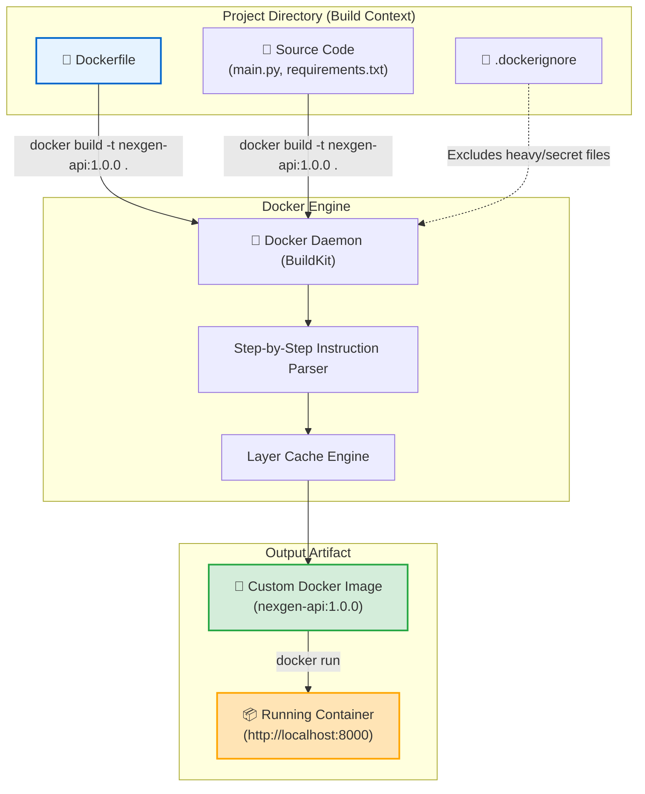

# 📜 Dockerfile Basics

## Dockerfile কী? (What)

**Dockerfile** হলো একটি সাধারণ প্লেইন-টেক্সট কনফিগারেশন ফাইল (Plain Text File), যাতে ধাপে ধাপে কিছু নির্দিষ্ট নির্দেশিকা (Instructions) লেখা থাকে, যার ওপর ভিত্তি করে ডকার ইঞ্জিন স্বয়ংক্রিয়ভাবে একটি কাস্টম **Docker Image** তৈরি (Build) করে।

সহজ ভাষায়: ডকারফাইল হলো আপনার অ্যাপ্লিকেশনের জন্য একটি **রেসিপি বা স্বয়ংক্রিয় রান্নার নির্দেশিকা**। এতে লেখা থাকে— কোন অপারেটিং সিস্টেম বেস হিসেবে ব্যবহার হবে, কোন কোন প্যাকেজ বা লাইব্রেরি ইনস্টল হবে, কোন সোর্স কোডগুলো কপি করতে হবে, এবং কন্টেইনার চালু হওয়ার সময় কোন কমান্ডটি রান করতে হবে।

:::info ফাইলের সঠিক নাম
ডকারফাইলের কোনো ফাইল এক্সটেনশন (যেমন `.txt`, `.sh`, `.yml`) থাকে না। এর নাম সবসময় হুবহু **`Dockerfile`** (বড়হাতের D দিয়ে শুরু) হতে হয়।
:::

---

## কেন Dockerfile অপরিহার্য? (Why)

ডকারফাইল আসার আগে কন্টেইনারের ইমেজ তৈরি করার ট্র্যাডিশনাল উপায় ছিল **`docker commit`** — অর্থাৎ একটি খালি কন্টেইনারে ঢুকে ম্যানুয়ালি প্যাকেজ ইনস্টল করে সেটির স্ন্যাপশট নেওয়া।

### ম্যানুয়াল পদ্ধতি (`docker commit`) বনাম ডকারফাইল (`Dockerfile`)

```
❌ ম্যানুয়াল স্ন্যাপশট পদ্ধতি (Before):
   - কন্টেইনারের ভেতরে ঢুকে ম্যানুয়ালি `apt update`, `pip install` ইত্যাদি চালাতে হতো
   - কোনো লিখিত হিস্ট্রি থাকতো না যে কন্টেইনারের ভেতরে ঠিক কী কী পরিবর্তন করা হয়েছে
   - ইমেজ নতুন করে রিবিল্ড করা ছিল প্রায় অসম্ভব (Black Box Image)
   - গিট বা ভার্সন কন্ট্রোলে ট্র্যাক করা যেত না

✅ Dockerfile ব্যবহার করলে (After):
   - Infrastructure as Code (IaC): সমস্ত সেটআপ লিখিত কোড আকারে থাকে
   - সম্পূর্ণ অটোমেটেড: এক ক্লিকে `docker build` দিলে সেকেন্ডে ফ্রেশ ইমেজ তৈরি হয়
   - গিটহাবে সোর্স কোডের সাথে Dockerfile ভার্সন কন্ট্রোল করা যায়
   - টিম মেম্বারদের সাথে সহজে শেয়ার ও সিআই/সিডি অটোমেশনে যুক্ত করা যায়
```

---

## Analogy — কেক তৈরির রেসিপি কার্ড ও আর্কিটেক্ট ব্লুপ্রিন্ট 🎂🏗️

Dockerfile-কে একটি **কেক তৈরির সিক্রেট রেসিপি কার্ড**-এর সাথে তুলনা করা যায়:

- **Dockerfile** = রেসিপি কার্ড (যাতে লেখা আছে: ২ কাপ ময়দা নাও, ১ কাপ চিনি দাও, ওভেনে ১৮০ ডিগ্রিতে ৩০ মিনিট বেক করো)।
- **`docker build`** = শেফ যিনি রেসিপি কার্ড পড়ে নিখুঁতভাবে উপাদানগুলো মিশিয়ে কেক বানাচ্ছেন।
- **Docker Image** = তৈরি হওয়া ফ্রোজেন কেক (যা বাক্সে প্যাক করা)।
- **Docker Container** = কেকের বাক্স খুলে টেবিলের ওপর প্লেটে পরিবেশন করা লাইভ খাবার।

রেসিপি কার্ড থাকলে পৃথিবীর যেকোনো শেফ ঠিক একই স্বাদের কেক বারবার বানিয়ে দিতে পারবেন।

---

## How it Works — Image Build Pipeline



---

## Dockerfile-এর অ্যানাটমি ও নির্দেশিকা কাঠামো

একটি ডকারফাইলের প্রতিটি লাইন সাধারণত এই ফরম্যাটে লেখা হয়:

```text
INSTRUCTION argument
```

- **INSTRUCTION**: ডকারের কীওয়ার্ড (কনভেনশন অনুযায়ী সর্বদা **ALL CAPS / বড়হাতে** লেখা হয়, যেমন `FROM`, `WORKDIR`, `COPY`, `RUN`, `CMD`)।
- **argument**: ঐ নির্দেশিকার সাথে সম্পর্কিত প্যারামিটার বা কমান্ড।

### প্রধান ৫টি প্রাথমিক নির্দেশিকা (Core Instructions):

| নির্দেশিকা | কী কাজ করে | সহজ উপমা |
|---|---|---|
| **`FROM`** | বেস ইমেজ নির্ধারণ করে (ডকারফাইলের প্রথম লাইন) | রান্নার মূল কাঁচামাল নির্বাচন |
| **`WORKDIR`** | কন্টেইনারের ভেতরের কাজের ডিরেক্টরি সেট করে | রান্নার জন্য কিচেন টেবিল প্রস্তুত করা |
| **`COPY`** | হোস্টের সোর্স কোড কন্টেইনারের ভেতরে কপি করে | উপাদানগুলো টেবিলে এনে রাখা |
| **`RUN`** | ইমেজ তৈরির সময় প্যাকেজ বা ডিপেনডেন্সি ইনস্টল করে | উপাদানগুলো রান্না / প্রসেস করা |
| **`CMD`** | কন্টেইনার চালু হওয়ার সময় মূল অ্যাপ্লিকেশন রান করে | রান্না শেষে সার্ভ করার প্লেট দেওয়া |

---

## Hands-on: আমাদের NexGen AI প্রজেক্টের প্রথম Dockerfile

চলুন আমাদের **NexGen AI** (FastAPI + Python 3.12) প্রজেক্টের জন্য একটি সম্পূর্ণ প্রোডাকশন-রেডি ডকারফাইল লিখি।

### প্রজেক্ট ফোল্ডার স্ট্রাকচার:
```text
nexgen-api/
├── main.py               # FastAPI কোড
├── requirements.txt      # পাইথন ডিপেনডেন্সি
├── .dockerignore         # অপ্রয়োজনীয় ফাইল এক্সক্লুড লিস্ট
└── Dockerfile            # আমাদের বিল্ড ব্লুপ্রিন্ট
```

---

### ধাপ ১: `main.py` ফাইল তৈরি (FastAPI কোড)

```python
# main.py
from fastapi import FastAPI

app = FastAPI(
    title="NexGen AI API",
    description="Next-Generation AI Backend powered by FastAPI & Docker",
    version="1.0.0"
)

@app.get("/")
def read_root():
    return {
        "status": "online",
        "project": "NexGen AI Core",
        "message": "🚀 Welcome to Dockerized FastAPI Application!"
    }

@app.get("/health")
def health_check():
    return {"status": "healthy", "database": "connected"}
```

---

### ধাপ ২: `requirements.txt` ফাইল তৈরি

```text
fastapi>=0.111.0
uvicorn[standard]>=0.30.0
pydantic>=2.7.0
```

---

### ধাপ ৩: `.dockerignore` ফাইল তৈরি (অত্যন্ত গুরুত্বপূর্ণ) 🚫

যেমন গিটহাবে অপ্রয়োজনীয় ফাইল বাদ দিতে `.gitignore` ব্যবহার করা হয়, ঠিক তেমনি ডকার ইমেজ বিল্ড করার সময় লোকাল ভার্চুয়াল এনভায়রনমেন্ট (`venv`), গিট ফোল্ডার বা গোপন `.env` ফাইল যাতে ডকার ডেমনে না যায়, সেজন্য `.dockerignore` তৈরি করতে হয়:

```text
# .dockerignore
__pycache__/
*.pyc
*.pyo
*.pyd
.Python
env/
venv/
.venv/
.git/
.gitignore
.env
.DS_Store
*.md
```

:::warning কেন `.dockerignore` ছাড়া বিল্ড করবেন না?
যদি `.dockerignore` না থাকে, তবে আপনার লোকাল মেশিনের ২ জিবি সাইজের `venv/` বা `.git/` ফোল্ডার ডকার ডেমনে কপি হবে। ফলে বিল্ড টাইম ৫ মিনিট লেগে যাবে এবং ইমেজের সাইজ অকারণে কয়েক গিগাবাইট বড় হয়ে যাবে!
:::

---

### ধাপ ৪: `Dockerfile` লেখা ✍️

এখন আমরা আমাদের প্রজেক্ট রুটে `Dockerfile` তৈরি করব:

```dockerfile
# ১. অফিশিয়াল লাইটওয়েট পাইথন বেস ইমেজ নির্বাচন
FROM python:3.12-slim

# ২. পাইথন আউটপুট বাফারিং বন্ধ রাখা (রিয়েল-টাইম লগ দেখার জন্য)
ENV PYTHONUNBUFFERED=1 \
    PYTHONDONTWRITEBYTECODE=1

# ৩. কন্টেইনারের ভেতরে কাজের ডিরেক্টরি সেট করি
WORKDIR /app

# ৪. প্রথমে শুধুমাত্র requirements.txt কপি করি (লেয়ার ক্যাশিং সুবিধার জন্য)
COPY requirements.txt .

# ৫. ডিপেনডেন্সি ইনস্টল করি (নো-ক্যাশ ফ্ল্যাগ দিয়ে সাইজ ছোট রাখা)
RUN pip install --no-cache-dir -r requirements.txt

# ৬. বাকি সম্পূর্ণ প্রজেক্টের সোর্স কোড কপি করি
COPY . .

# ৭. কন্টেইনার কোন পোর্টে চলবে তা ডকুমেন্ট করি
EXPOSE 8000

# ৮. কন্টেইনার স্টার্ট হওয়ার ডিফল্ট কমান্ড
CMD ["uvicorn", "main:app", "--host", "0.0.0.0", "--port", "8000"]
```

#### ডকারফাইলের প্রতিটি লাইনের বিস্তারিত বাংলা ব্যবচ্ছেদ:

1. **`FROM python:3.12-slim`**: ডকার হাব থেকে অফিশিয়াল পাইথন ৩.১২ স্লিম ইমেজটি বেস ওএস ও রানটাইম হিসেবে নামিয়ে নেয়।
2. **`ENV PYTHONUNBUFFERED=1`**: পাইথনের কনসোল লগ যেন মেমরিতে আটকে না থেকে সরাসরি টার্মিনালে দেখা যায় তা নিশ্চিত করে।
3. **`WORKDIR /app`**: কন্টেইনারের ভেতরে `/app` নামের ফোল্ডার বানিয়ে সেখানে ঢুকে পড়ে। পরবর্তী সব নির্দেশিকা এই ফোল্ডারের ভেতরে কার্যকর হবে।
4. **`COPY requirements.txt .`**: হোস্টের `requirements.txt` ফাইলটি কন্টেইনারের বর্তমান ডিরেক্টরিতে (`/app`) নিয়ে আসে।
5. **`RUN pip install --no-cache-dir ...`**: ইমেজ বিল্ড হওয়ার সময় পাইথন প্যাকেজগুলো ইনস্টল করে এবং ইনস্টলেশন ক্যাশ মুছে সাইজ অপ্টিমাইজ রাখে।
6. **`COPY . .`**: বর্তমান লোকাল ফোল্ডারের সমস্ত কোড কন্টেইনারের `/app` এ পেস্ট করে।
7. **`EXPOSE 8000`**: ডকুমেন্টেশন হিসেবে উল্লেখ করে যে অ্যাপ্লিকেশনটি ৮০০০ পোর্টে লিসেন করবে।
8. **`CMD ["uvicorn", ...]`**: কন্টেইনার চালু হওয়ার সময় Uvicorn ওয়েব সার্ভার দিয়ে FastAPI অ্যাপ চালু করে।

---

### ধাপ ৫: ইমেজ বিল্ড করা (`docker build`)

এখন আমরা আমাদের ডকারফাইল থেকে কাস্টম ইমেজ বিল্ড করব:

```bash
# সিনট্যাক্স: docker build -t <IMAGE_NAME>:<TAG> <BUILD_CONTEXT_PATH>

docker build -t nexgen-api:1.0.0 .
```

**ফ্ল্যাগ ও প্যারামিটার ব্যাখ্যা:**
- `-t` (`--tag`): ইমেজের নাম ও ভার্সন ট্যাগ দেয় (`nexgen-api:1.0.0`)।
- `.` (ডট): **Build Context** নির্ধারণ করে — অর্থাৎ বর্তমান ডিরেক্টরির ফাইলগুলো ডকার ডেমনে পাঠানো হবে।

**বাস্তব Output (BuildKit Engine):**
```text
[+] Building 8.4s (10/10) FINISHED                                docker:default
 => [internal] load build definition from Dockerfile                        0.0s
 => => transferring dockerfile: 521B                                        0.0s
 => [internal] load metadata for docker.io/library/python:3.12-slim         1.2s
 => [internal] load .dockerignore                                           0.0s
 => => transferring context: 142B                                           0.0s
 => [1/5] FROM docker.io/library/python:3.12-slim@sha256:4f86d63...        0.0s
 => [internal] load build context                                           0.1s
 => => transferring context: 4.82kB                                         0.0s
 => [2/5] WORKDIR /app                                                      0.1s
 => [3/5] COPY requirements.txt .                                          0.0s
 => [4/5] RUN pip install --no-cache-dir -r requirements.txt                5.8s
 => [5/5] COPY . .                                                          0.1s
 => exporting to image                                                      0.8s
 => => exporting layers                                                     0.8s
 => => writing image sha256:7f9a2b1c4e6d8a0b...                             0.0s
 => => naming to docker.io/library/nexgen-api:1.0.0                         0.0s
```

```bash
# বিল্ড হওয়া নতুন ইমেজটি পরীক্ষা করি
docker image ls nexgen-api
```

**Output:**
```text
REPOSITORY   TAG       IMAGE ID       CREATED          SIZE
nexgen-api   1.0.0     7f9a2b1c4e6d   45 seconds ago   184MB
```

---

### ধাপ ৬: কন্টেইনার রান ও এপিআই টেস্ট করা

আমাদের বিল্ড করা ইমেজ থেকে এখন লাইভ কন্টেইনার চালু করি:

```bash
docker container run -d \
  --name nexgen-api-app \
  -p 8000:8000 \
  nexgen-api:1.0.0
```

```bash
# ব্রাউজারে অথবা curl দিয়ে এপিআই টেস্ট করি
curl http://localhost:8000
```

**বাস্তব JSON Output:**
```json
{
  "status": "online",
  "project": "NexGen AI Core",
  "message": "🚀 Welcome to Dockerized FastAPI Application!"
}
```

```bash
# হেলথ চেক এন্ডপয়েন্ট টেস্ট
curl http://localhost:8000/health
```

**JSON Output:**
```json
{"status": "healthy", "database": "connected"}
```

:::tip সোয়াগার ডকস ব্রাউজ করুন! 🎉
আপনার ব্রাউজারে `http://localhost:8000/docs` ওপেন করলে FastAPI-র দৃষ্টিনন্দন **Interactive Swagger UI Documentation** লাইভ দেখতে পাবেন!
:::

---

## Comparison Table — `docker build` বনাম `docker commit`

| বৈশিষ্ট্য | Dockerfile (`docker build`) | `docker commit` (Manual) |
|---|---|---|
| **পদ্ধতি** | স্বয়ংক্রিয় ও কোড-ভিত্তিক (Declarative) | সম্পূর্ণ ম্যানুয়াল ও কমান্ড লাইন ভিত্তিক (Imperative) |
| **পুনরাবৃত্তিযোগ্যতা (Reproducibility)** | 🌟 **১০০% নিখুঁত** (যেকোনো সময় হুবহু একই ইমেজ তৈরি সম্ভব) | ❌ খুবই কম (কী কী প্যাকেজ দেওয়া হয়েছিল ভুলে যাওয়ার ঝুঁকি) |
| **ভার্সন কন্ট্রোল** | ✅ গিটহাবে ডকারফাইল কমিট করা যায় | ❌ বাইনারি মেমরি স্ন্যাপশট হওয়ায় গিটে রাখা যায় না |
| **লেয়ার অপ্টিমাইজেশন** | ✅ প্রতিটি লেয়ার ক্যাশিং ও অপ্টিমাইজ করা যায় | ❌ একটি ভারী ও অস্বচ্ছ লেয়ার তৈরি করে |
| **ইন্ডাস্ট্রি স্ট্যান্ডার্ড** | ⭐⭐⭐⭐⭐ একমাত্র প্রোডাকশন স্ট্যান্ডার্ড | ⚠️ শুধু ইমার্জেন্সি ডিবাগিং ছাড়া পরিত্যাজ্য |

---

## Common Mistakes — নতুনদের সাধারণ ভুল

### ১. ফাইলে এক্সটেনশন যোগ করা
❌ **ভুল:** উইন্ডোজে `Dockerfile.txt` বা `dockerfile.yaml` নামে ফাইল সেভ করা (ডকার এটি খুঁজে পায় না)।
✅ **সঠিক:** কোনো এক্সটেনশন ছাড়া শুধু `Dockerfile` রাখুন।

### ২. `COPY . .` নির্দেশিকা `pip install` এর আগে লেখা
❌ **ভুল:**
```dockerfile
COPY . .
RUN pip install -r requirements.txt
```
(এতে কোডে মাত্র ১ লাইনের স্পেস পরিবর্তন করলেও ডকার সম্পূর্ণ `pip install` নতুন করে শুরু করে ৫ মিনিট সময় নষ্ট করবে)।
✅ **সঠিক:**
```dockerfile
COPY requirements.txt .
RUN pip install -r requirements.txt
COPY . .
```
(এতে কোড পরিবর্তন হলেও ডিপেনডেন্সি লেয়ার ক্যাশ থেকে সেকেন্ডে চলে আসে)।

### ৩. `.dockerignore` তৈরি না করা
❌ **ভুল:** লোকাল `venv` ফোল্ডার ডকার ডেমনে কপি করে বিল্ড সাইজ গিগাবাইট করে ফেলা।
✅ **সঠিক:** প্রজেক্টের শুরুতেই একটি আদর্শ `.dockerignore` ফাইল বানিয়ে নিন।

---

## Best Practices

1. **Build Context সর্বদা ছোট রাখুন**: `.dockerignore` ব্যবহার করে শুধুমাত্র প্রয়োজনীয় কোড ফাইলগুলো ডকার ডেমনে পাঠান।
2. **কম পরিবর্তনশীল লেয়ারগুলো আগে রাখুন**: বেস ইমেজ ও প্যাকেজ ইনস্টলেশন আগে করুন, সোর্স কোড কপি পরে করুন।
3. **`--no-cache-dir` ফ্ল্যাগ ব্যবহার করুন**: পাইথন প্যাকেজ ইনস্টলের সময় `pip install --no-cache-dir` দিলে ইমেজ সাইজ ৫০-৭০ এমবি কমে যায়।
4. **অফিসিয়াল স্লিম ইমেজ ব্যবহার করুন**: `python:3.12-slim` সাইজ ও সিকিউরিটির মধ্যে সেরা ভারসাম্য দেয়।

---

## Interview Questions ও Answers

### ১. Dockerfile কী এবং কেন একে Infrastructure as Code (IaC) বলা হয়?

**উত্তর:** Dockerfile হলো একটি প্লেইন টেক্সট ফাইল যা ধাপে ধাপে নির্দেশিকা লিখে একটি ডকার ইমেজ তৈরি করার সম্পূর্ণ প্রক্রিয়াকে অটোমেট করে। 
একে **Infrastructure as Code (IaC)** বলা হয় কারণ— ট্র্যাডিশনাল সিস্টেমে যেখানে ম্যানুয়ালি ওএস সেটআপ ও সফটওয়্যার ইনস্টল করতে হতো, ডকারফাইলে সম্পূর্ণ অপারেটিং সিস্টেম রানটাইম, ডিপেনডেন্সি এবং নেটওয়ার্ক কনফিগারেশন সফটওয়্যার কোডের মতো টেক্সট আকারে লেখা থাকে। এটি গিটহাবে ভার্সন কন্ট্রোল করা যায়, কোড রিভিউ করা যায় এবং সিআই/সিডি অটোমেশনে হুবহু রিপ্রোডিউস করা যায়।

---

### ২. `.dockerignore` ফাইল কী এবং এটি কেন গুরুত্বপূর্ণ?

**উত্তর:** `.dockerignore` হলো এমন একটি কনফিগ ফাইল যা ডকার বিল্ড শুরু করার সময় হোস্ট মেশিন থেকে কোন কোন ফাইল ও ফোল্ডার **Build Context** হিসেবে ডকার ডেমনে পাঠানো যাবে না তা নির্ধারণ করে (যেমন `.git`, `venv/`, `__pycache__/`, `.env`)।
এর গুরুত্ব:
১. **বিল্ডের গতি বৃদ্ধি:** অপ্রয়োজনীয় বড় ফোল্ডার ট্রান্সফার না হওয়ায় বিল্ড দ্রুত শেষ হয়।
২. **ইমেজ সাইজ হ্রাস:** লোকাল আবর্জনা ইমেজে ঢুকে সাইজ বড় করে না।
৩. **নিরাপত্তা:** লোকাল সিক্রেট কি বা পাসওয়ার্ড সম্বলিত `.env` ফাইল দুর্ঘটনাবশত ইমেজের ভেতর কপি হওয়া রোধ করে।

---

### ৩. Dockerfile-এ `COPY requirements.txt .` কেন `COPY . .` এর আগে লেখা হয়?

**উত্তর:** এটি ডকারের **Layer Caching Optimization** এর জন্য করা হয়। 
ডকার প্রতিটি নির্দেশিকাকে ক্রমানুসারে ক্যাশ করে। প্রজেক্টের সোর্স কোড ঘনঘন পরিবর্তিত হয়, কিন্তু লাইব্রেরি বা ডিপেনডেন্সি (`requirements.txt`) খুব কম পরিবর্তিত হয়। 
যদি `requirements.txt` এবং `pip install` আগে রাখা হয়, তবে সোর্স কোড পরিবর্তন হলেও ডকার `pip install` লেয়ারটি ক্যাশ থেকে লোড করে। ফলে কোড পরিবর্তনের পর নতুন ইমেজ বিল্ড হতে ৫ মিনিটের জায়গায় মাত্র ২ সেকেন্ড সময় লাগে।

---

### ৪. `docker build` কমান্ডের শেষের ডট (`.`) চিহ্নটির অর্থ কী?

**উত্তর:** `docker build -t app .` কমান্ডের শেষের ডট (`.`) হলো **Build Context Path**। এটি নির্দেশ করে যে বর্তমান ডিরেক্টরিটি হলো বিল্ড কনটেক্সট এবং ডকার ডেমন এই ডিরেক্টরির ফাইলসিস্টেম থেকেই ফাইলগুলো (যেমন `COPY` নির্দেশিকায়) কন্টেইনার ইমেজে যুক্ত করবে।

---

## Summary

| বিষয় | বিবরণ |
|---|---|
| **Dockerfile** | কাস্টম ইমেজ বিল্ড করার টেক্সট রেসিপি (IaC) |
| **ফাইলের নাম** | কোনো এক্সটেনশন ছাড়া হুবহু `Dockerfile` |
| **Build Context** | ডকার ডেমনে পাঠানো সোর্স ডিরেক্টরি |
| **.dockerignore** | অপ্রয়োজনীয় ফাইল বিল্ড থেকে বাদ দেওয়ার ফিল্টার |
| **বিল্ড কমান্ড** | `docker build -t <name>:<tag> .` |
| **ক্যাশিং কৌশল** | `requirements.txt` আগে কপি ও ইনস্টল, কোড পরে কপি |
| **রান কমান্ড** | `docker run -d -p 8000:8000 <image>` |

---

## পরবর্তী ধাপ

আমরা সফলভাবে আমাদের প্রথম প্রোডাকশন-রেডি ডকারফাইল লিখে অ্যাপ্লিকেশন ইমেজ বিল্ড ও রান করা শিখে ফেলেছি। পরবর্তী টপিকে আমরা দেখব **Dockerfile Instructions (Part 1)** (`docker/dockerfile-instructions-p1.md`) — যেখানে `FROM`, `WORKDIR`, `COPY`, `RUN`, এবং `CMD` নির্দেশিকাগুলোর খুঁটিনাটি ইন্টারনাল মেকানিজম, Shell বনাম Exec ফর্ম এবং তাদের জটিল ব্যবহার গভীরভাবে শিখব।
