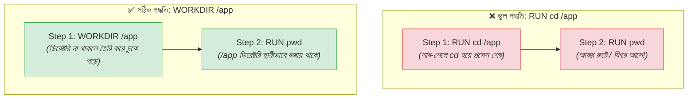

# 📑 Dockerfile Instructions (Part 1)

## ভূমিকা (Introduction)

একটি ডকারফাইল মূলত বিভিন্ন নির্দেশিকার (Instructions) একটি সুশৃঙ্খল ক্রম। ডকার ইঞ্জিনের বিল্ডার প্রতিটি নির্দেশিকাকে এক্সিকিউট করে একটির ওপর আরেকটি রিড-অনলি লেয়ার সাজিয়ে চূড়ান্ত ইমেজ তৈরি করে।

এই পর্বে আমরা ডকারফাইলের সবচেয়ে মৌলিক এবং সর্বাধিক ব্যবহৃত **৫টি কোর নির্দেশিকা** গভীরভাবে বিশ্লেষণ করব:
1. **`FROM`** — বেস ইমেজ নির্বাচন
2. **`WORKDIR`** — কাজের ডিরেক্টরি নির্ধারণ
3. **`COPY`** — ফাইল ও ফোল্ডার কন্টেইনারে স্থানান্তর
4. **`RUN`** — বিল্ড টাইমে প্যাকেজ ও ডিপেনডেন্সি ইনস্টলেশন
5. **`CMD`** — কন্টেইনার রানটাইমের মূল এক্সিকিউশন কমান্ড

---

## ১. `FROM` — ভিত্তিপ্রস্তর স্থাপন 🏗️

### What & Why
`FROM` হলো প্রতিটি বৈধ ডকারফাইলের **প্রথম নির্দেশিকা** (শুধুমাত্র `ARG` এর আগে বসতে পারে)। এটি নির্ধারণ করে আপনার কাস্টম ইমেজটি কোন প্রাথমিক ইমেজের (Base Image) ওপর তৈরি হবে।

### সিনট্যাক্স:
```dockerfile
FROM [--platform=<platform>] <image>[:<tag>] [AS <name>]
```

### উদাহরণ ও ব্যবহার:
```dockerfile
# সাধারণ ব্যবহার
FROM python:3.12-slim

# মাল্টি-প্ল্যাটফর্ম বিল্ডের জন্য
FROM --platform=linux/amd64 python:3.12-slim

# মাল্টি-স্টেজ বিল্ডে নাম নির্ধারণ (Level 2 তে বিস্তারিত শিখব)
FROM python:3.12-slim AS builder

# শূন্য থেকে ইমেজ তৈরির বিশেষ বেস (Go/Rust বাইনারির জন্য)
FROM scratch
```

:::tip বেস্ট প্র্যাকটিস
সর্বদা অফিসিয়াল এবং নির্দিষ্ট ট্যাগসহ বেস ইমেজ ব্যবহার করুন (যেমন `python:3.12.4-slim-bookworm`), কখনো শুধু `FROM python` বা `:latest` ব্যবহার করবেন না।
:::

---

## ২. `WORKDIR` — কাজের ডিরেক্টরি সেট করা 📁

### What & Why
`WORKDIR` কন্টেইনারের ফাইলসিস্টেমে কাজের বর্তমান ডিরেক্টরি (Working Directory) নির্ধারণ করে। এরপর ডকারফাইলে লেখা সমস্ত `RUN`, `CMD`, `ENTRYPOINT`, এবং `COPY` নির্দেশিকা এই ডিরেক্টরির সাপেক্ষে কার্যকর হয়।

### কেন `RUN cd /app` কাজ করে না?
নতুনদের একটি কমন ভুল হলো লিনাক্স স্টাইলে `RUN cd /app` লেখা। এটি কাজ করে না কারণ: ডকারফাইলে প্রতিটি `RUN` নির্দেশিকা একটি নতুন সাব-শেলে ও আলাদা টেম্পোরারি কন্টেইনারে চলে। তাই `RUN cd /app` শেষ হওয়ার সাথে সাথে সেই শেল বন্ধ হয়ে যায় এবং পরবর্তী লাইন আবার ডিফল্ট রুট (`/`) ডিরেক্টরিতে ফিরে যায়।



### বিশেষ বৈশিষ্ট্য:
- ডিরেক্টরিটি কন্টেইনারে আগে থেকে তৈরি না থাকলেও `WORKDIR` সেটি স্বয়ংক্রিয়ভাবে তৈরি (Create) করে নেয়।
- রিলেটিভ পাথ ব্যবহার করলে তা পূর্বের `WORKDIR` এর সাথে যুক্ত হয়:
```dockerfile
WORKDIR /app
WORKDIR src
WORKDIR api
# এখন বর্তমান ডিরেক্টরি: /app/src/api
```

---

## ৩. `COPY` — লোকাল সোর্স কোড কন্টেইনারে নেওয়া 📦

### What & Why
`COPY` নির্দেশিকা হোস্ট মেশিনের বিল্ড কনটেক্সট থেকে ফাইল বা ডিরেক্টরি কন্টেইনারের ফাইলসিস্টেমে কপি করে।

### সিনট্যাক্স:
```dockerfile
COPY [--chown=<user>:<group>] <src>... <dest>
```

### ব্যবহারিক উদাহরণ:
```dockerfile
# ১. একক ফাইল কপি করা
COPY requirements.txt /app/

# ২. বর্তমান ডিরেক্টরির সব ফাইল কপি করা
COPY . /app/

# ৩. ওয়াইল্ডকার্ড (Wildcard) প্যাটার্ন ব্যবহার
COPY *.py /app/src/

# ৪. নন-রুট ইউজারের মালিকানা (Ownership) সহ কপি করা (সিকিউরিটি বেস্ট প্র্যাকটিস)
COPY --chown=appuser:appgroup . /app
```

---

## ৪. `RUN` — বিল্ড টাইমে প্যাকেজ ইনস্টল করা ⚙️

### What & Why
`RUN` নির্দেশিকা ইমেজ **বিল্ড হওয়ার সময় (Build Time)** এক্সিকিউট হয়। এর কাজ হলো নতুন সফটওয়্যার ইনস্টল করা, লিনাক্স প্যাকেজ আপডেট করা বা ডিরেক্টরি তৈরি করে নতুন একটি রিড-অনলি লেয়ার তৈরি করা।

### সিনট্যাক্স ফরম্যাট:
1. **Shell Form (ডিফল্ট):** `RUN <command>`
   - এটি ইন্টারনালি `/bin/sh -c` এর মাধ্যমে চলে।
   - উদাহরণ: `RUN apt-get update && apt-get install -y curl`
2. **Exec Form:** `RUN ["executable", "param1", "param2"]`
   - এটি সরাসরি এক্সিকিউটেবল রান করে।

### লেয়ার মিনিমাইজেশন টেকনিক (Chaining Commands):
ডকারফাইলে প্রতিটি `RUN` একটি করে নতুন ইমেজ লেয়ার তৈরি করে। একাধিক ছোট ছোট `RUN` না লিখে `&&` এবং ব্যাকস্ল্যাশ (`\`) দিয়ে কমান্ড চেইন করা উচিত:

```dockerfile
# ❌ খারাপ অভ্যাস: ৩টি আলাদা লেয়ার তৈরি করবে (সাইজ বড় হবে)
RUN apt-get update
RUN apt-get install -y git
RUN rm -rf /var/lib/apt/lists/*

# ✅ সেরা অভ্যাস: ১টি মাত্র লেয়ারে কাজ শেষ ও ক্যাশ ক্লিন
RUN apt-get update && apt-get install -y --no-install-recommends \
    git \
    curl \
    && rm -rf /var/lib/apt/lists/*
```

---

## ৫. `CMD` — কন্টেইনার স্টার্টআপ কমান্ড 🚀

### What & Why
`CMD` নির্দেশিকা ইমেজ বিল্ড করার সময় রান হয় না। এটি নির্ধারণ করে যখন এই ইমেজ থেকে একটি কন্টেইনার চালু (`docker run`) করা হবে, তখন কন্টেইনারের ভেতরে **ডিফল্টভাবে কোন অ্যাপ্লিকেশনটি রান করবে**।

### সিনট্যাক্স ফরম্যাট:

| ফরম্যাট | সিনট্যাক্স | কীভাবে চলে | সিগন্যাল হ্যান্ডলিং |
|---|---|---|---|
| **Exec Form (Recommended)** | `CMD ["uvicorn", "main:app", "--host", "0.0.0.0"]` | সরাসরি বাইনারি প্রসেস রান করে (PID 1) | ✅ `SIGTERM` পায়, গ্রেসফুল শাটডাউন হয় |
| **Shell Form** | `CMD uvicorn main:app --host 0.0.0.0` | `/bin/sh -c "uvicorn..."` এর চাইল্ড হিসেবে চলে | ❌ সিগন্যাল পায় না, ক্র্যাশ করে |

```mermaid
graph TB
    subgraph "Exec Form (Best Practice): CMD [\"uvicorn\", ...]"
        D1["Docker Daemon"] -->|"SIGTERM"| P1["🎯 PID 1: uvicorn<br/><i>(সরাসরি সিগন্যাল পায় ও ডাটা সেভ করে বন্ধ হয়)</i>"]
    end

    subgraph "Shell Form (Dangerous): CMD uvicorn ..."
        D2["Docker Daemon"] -->|"SIGTERM"| S1["🎯 PID 1: /bin/sh<br/><i>(সিগন্যাল চাইল্ড প্রসেসে পাঠায় না!)</i>"]
        S1 --> P2["PID 7: uvicorn<br/><i>(সিগন্যাল না পেয়ে ১০ সে. পর ফোর্সবশত কিল হয়)</i>"]
    end

    style P1 fill:#D4EDDA,stroke:#28A745,stroke-width:2px
    style S1 fill:#F8D7DA,stroke:#DC3545,stroke-width:2px
```

:::warning গোল্ডেন রুল
ডকারফাইলে একাধিক `CMD` থাকলে শুধুমাত্র **সর্বশেষ `CMD` নির্দেশিকাটি কার্যকর হয়**, আগেরগুলো বাতিল হয়ে যায়। `docker run` করার সময় কোনো কমান্ড পাস করলে তা `CMD` কে ওভাররাইড করে দেয়।
:::

---

## Hands-on: NexGen AI-এর পূর্ণাঙ্গ অপ্টিমাইজড Dockerfile

চলুন এই ৫টি নির্দেশিকাকে একত্রিত করে আমাদের **NexGen AI** FastAPI অ্যাপ্লিকেশনের জন্য একটি সম্পূর্ণ ডকারফাইল লিখি:

```dockerfile
# ১. অফিশিয়াল লাইটওয়েট পাইথন বেস ইমেজ
FROM python:3.12-slim

# ২. কাজের ডিরেক্টরি সেট করা
WORKDIR /app

# ৩. সিস্টেম ও পাইথন ডিপেনডেন্সি ইনস্টলেশন (চেইনিং মেথড)
COPY requirements.txt .
RUN pip install --no-cache-dir -r requirements.txt

# ৪. সোর্স কোড কপি করা
COPY . .

# ৫. কন্টেইনার স্টার্টআপ কমান্ড (Exec Form)
CMD ["uvicorn", "main:app", "--host", "0.0.0.0", "--port", "8000"]
```

---

## Comparison Table — `COPY` বনাম `ADD`

অনেক সময় `COPY` এর জায়গায় `ADD` দেখতে পাওয়া যায়। দুটির পার্থক্য কী?

| বৈশিষ্ট্য | `COPY` | `ADD` |
|---|---|---|
| **লোকাল ফাইল কপি** | ✅ হ্যাঁ (সহজ, স্পষ্ট ও নিরাপদ) | ✅ হ্যাঁ |
| **অটোমেটিক `.tar` এক্সট্রাক্ট** | ❌ না | ✅ হ্যাঁ (লোকাল tar ফাইল নিজে নিজে আনপ্যাক করে দেয়) |
| **রিমোট URL থেকে ডাউনলোড** | ❌ না | ✅ হ্যাঁ (`http://...` থেকে ফাইল নামায়) |
| **অফিশিয়াল রেকমেন্ডেশন** | 🌟 **সর্বদা রেকমেন্ডেড (Best Practice)** | ⚠️ শুধুমাত্র লোকাল tar অটো-আনপ্যাক করার কাজে ব্যবহার্য |

:::tip কেন `ADD` এড়িয়ে চলবেন?
`ADD` ব্যাকগ্রাউন্ডে ম্যাজিকের মতো tar আনপ্যাক করে বা ইউআরএল ডাউনলোড করে যা ইমেজের সাইজ অকারণে বাড়িয়ে দিতে পারে। সাধারণ ফাইল স্থানান্তরের জন্য সবসময় **`COPY`** ব্যবহার করা ডকারের অফিশিয়াল নিয়ম।
:::

---

## Common Mistakes — নতুনদের সাধারণ ভুল

### ১. `CMD` তে Shell Form ব্যবহার করা
❌ **ভুল:** `CMD uvicorn main:app --port 8000` (এতে `uvicorn` PID 1 হয় না, ফলে কন্টেইনার স্টপ করার সময় ১০ সেকেন্ড আটকে থাকে)।
✅ **সঠিক:** সবসময় Exec Form ব্যবহার করুন: `CMD ["uvicorn", "main:app", "--port", "8000"]`।

### ২. একাধিক `CMD` লিখে আশা করা যে সব চলবে
❌ **ভুল:**
```dockerfile
CMD ["python3", "worker.py"]
CMD ["uvicorn", "main:app"]
```
(প্রথম `CMD` টি ডকার সম্পূর্ণ ইগনোর করবে, শুধু দ্বিতীয়টি চলবে)।
✅ **সঠিক:** একটি কন্টেইনারে একটাই প্রাইমারি প্রসেস চালান।

### ৩. `WORKDIR` ব্যবহার না করে সব রুটে রাখা
❌ **ভুল:** রুটে (`/`) সব সোর্স কোড ঢেলে দেওয়া (লিনাক্স সিস্টেম ফাইল নষ্ট হওয়ার ঝুঁকি থাকে)।
✅ **সঠিক:** সবসময় `WORKDIR /app` বা নির্দিষ্ট ফোল্ডারে কাজ করুন।

---

## Best Practices

1. **`RUN` কমান্ডগুলোকে চেইন করুন**: `&&` এবং `\ ` ব্যবহার করে একাধিক কমান্ডকে একটি `RUN` এ আনুন যাতে অপ্রয়োজনীয় লেয়ার না বাড়ে।
2. **`COPY` আগে ও পরে সাজিয়ে ক্যাশ বাঁচান**: সোর্স কোডের আগে `requirements.txt` কপি করুন।
3. **সর্বদা Exec Form (`[...]`) ব্যবহার করুন**: `CMD` এবং `ENTRYPOINT` এ সবসময় JSON অ্যারে ফরম্যাট ব্যবহার করুন।
4. **বেস ইমেজে ডায়নামিক ট্যাগ এড়িয়ে চলুন**: ফিক্সড ট্যাগ ব্যবহার করুন।

---

## Interview Questions ও Answers

### ১. Dockerfile-এ Exec Form এবং Shell Form এর মধ্যে পার্থক্য কী এবং কেন Exec Form সুপারিশ করা হয়?

**উত্তর:** 
- **Shell Form (`CMD command param`):** ডকার এই কমান্ডটিকে সাব-শেলের মাধ্যমে চালায় (`/bin/sh -c "command param"` হিসেবে)। ফলে শেলের প্রসেসটি PID 1 হয় এবং আসল অ্যাপ্লিকেশনটি চাইল্ড প্রসেস হিসেবে চলে। এতে ডকার ডেমন যখন `docker stop` দেওয়ার সময় `SIGTERM` সিগন্যাল পাঠায়, শেল সেটি আসল অ্যাপ্লিকেশনে ফরোয়ার্ড করে না। ফলে অ্যাপ্লিকেশন গ্রেসফুল শাটডাউনের সুযোগ পায় না এবং ১০ সেকেন্ড পর জোরপূর্বক নিহত হয়।
- **Exec Form (`CMD ["command", "param"]`):** এটি কোনো শেল র‍্যাপার ছাড়াই সরাসরি নির্দেশিত অ্যাপ্লিকেশনটিকে কন্টেইনারের **PID 1 প্রসেস** হিসেবে রান করে। ফলে অ্যাপ্লিকেশনটি সরাসরি অপারেটিং সিস্টেমের সিগন্যাল গ্রহণ করে ডাটাবেজ কানেকশন নিরাপদে ক্লোজ করতে পারে। এজন্য Exec Form ইন্ডাস্ট্রি স্ট্যান্ডার্ড।

---

### ২. `COPY` এবং `ADD` নির্দেশিকার মধ্যে মূল পার্থক্য কী?

**উত্তর:** 
- `COPY` শুধুমাত্র হোস্টের বিল্ড কনটেক্সট থেকে নির্দিষ্ট ফাইল বা ডিরেক্টরি কন্টেইনারের ভেতরে হুবহু কপি করে নিয়ে আসে। এটি স্বচ্ছ এবং সম্পূর্ণ প্রেডিক্টেবল।
- `ADD` এর দুটি অতিরিক্ত জাদুকরী ক্ষমতা রয়েছে: (১) এটি লোকাল কোনো সংকুচিত আর্কাইভ ফাইলকে (যেমন `app.tar.gz`) কন্টেইনারের ভেতর কপি করার সময় স্বয়ংক্রিয়ভাবে এক্সট্রাক্ট বা আনপ্যাক করে দেয়, (২) এটি রিমোট ইউআরএল থেকে ফাইল ডাউনলোড করে কন্টেইনারে রাখতে পারে।
তবে অফিশিয়াল ডকার বেস্ট প্র্যাকটিস অনুযায়ী সাধারণ সব ফাইল ট্রান্সফারের জন্য সর্বদা `COPY` ব্যবহার করা উচিত।

---

### ৩. Dockerfile-এ একাধিক `RUN` নির্দেশিকা ব্যবহারের ক্ষতি কী এবং কীভাবে তা রোধ করা যায়?

**উত্তর:** ডকারফাইলের প্রতিটি `RUN` নির্দেশিকা একটি নতুন রিড-অনলি ফাইলসিস্টেম লেয়ার তৈরি করে। যদি ১০টি আলাদা `RUN` দিয়ে প্যাকেজ ইনস্টল বা আপডেট করা হয়, তবে ইমেজের লেয়ার সংখ্যা বৃদ্ধি পায় এবং প্রতিটি লেয়ারের টেম্পোরারি মেটাডেটার কারণে চূড়ান্ত ইমেজের সাইজ অনেক ভারী হয়ে যায়।
প্রতিকার: লিনাক্স অপারেটর `&&` এবং লাইন কন্টিনিউয়েশন স্ল্যাশ (`\`) ব্যবহার করে সমস্ত সম্পর্কিত কমান্ডকে একটি একক `RUN` নির্দেশিকায় চেইন করতে হয় এবং একই লেয়ারের শেষে টেম্পোরারি ক্যাশ (যেমন `rm -rf /var/lib/apt/lists/*`) ডিলিট করতে হয়।

---

### ৪. `RUN` এবং `CMD` এর মধ্যে মূল পার্থক্য কী?

**উত্তর:** 
- **`RUN` (Build Time):** এটি ডকার ইমেজ বিল্ড হওয়ার সময় কার্যকর হয়। এটি বিভিন্ন প্যাকেজ ইনস্টল করে ইমেজের নতুন স্থায়ী লেয়ার তৈরি করে।
- **`CMD` (Runtime):** এটি ইমেজ বিল্ডের সময় কোনো কাজ করে না। এটি শুধুমাত্র কন্টেইনার যখন প্রথমবার স্টার্ট করা হয় (`docker run`), তখন ভেতরে কোন মূল অ্যাপ্লিকেশন প্রসেসটি চলবে তার ডিফল্ট নির্দেশ দেয়।

---

## Summary

| নির্দেশিকা | কার্যকর হওয়ার সময় | কাজ |
|---|---|---|
| **`FROM`** | বিল্ড টাইম | বেস ওএস ও রানটাইম নির্বাচন করে |
| **`WORKDIR`** | বিল্ড ও রানটাইম | কাজের বর্তমান ডিরেক্টরি সেট করে (স্বয়ংক্রিয় ফোল্ডার তৈরি করে) |
| **`COPY`** | বিল্ড টাইম | হোস্ট থেকে ফাইল কন্টেইনারে আনে |
| **`RUN`** | বিল্ড টাইম | প্যাকেজ ইনস্টল ও ইমেজ লেয়ার তৈরি করে |
| **`CMD`** | রানটাইম | কন্টেইনার চালুর ডিফল্ট এক্সিকিউশন কমান্ড (Exec Form সেরা) |

---

## পরবর্তী ধাপ

আমরা সফলভাবে ডকারফাইলের প্রথম ৫টি মূল নির্দেশিকা আয়ত্ত করে ফেলেছি। পরবর্তী টপিকে আমরা দেখব **Dockerfile Instructions (Part 2)** (`docker/dockerfile-instructions-p2.md`) — যেখানে `ENTRYPOINT` বনাম `CMD` এর ঐতিহাসিক যুদ্ধ, `EXPOSE`, `ENV`, `ARG`, এবং সিকিউরিটির জন্য `USER` ও `LABEL` নির্দেশিকাগুলো শিখব।
