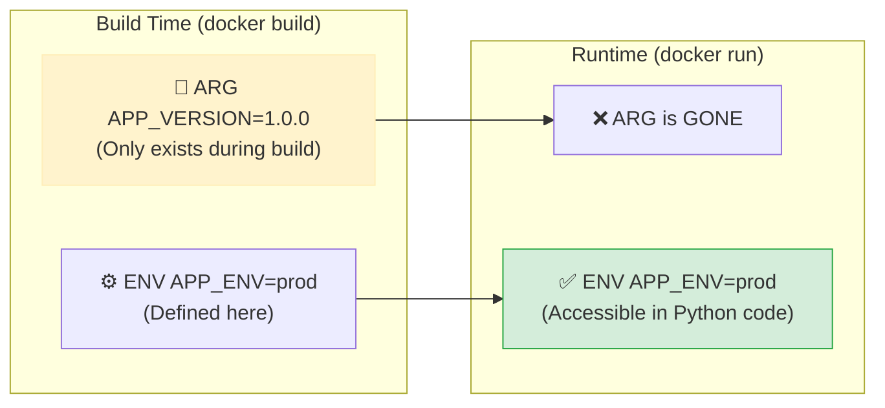
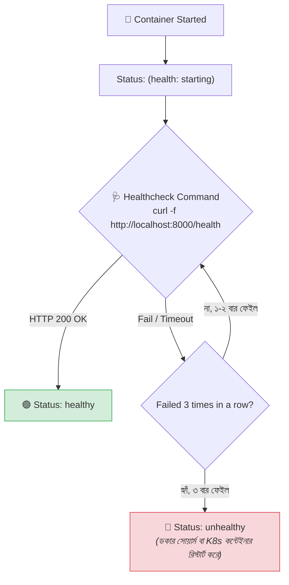

# 📜 Dockerfile Instructions (Part 2)

## ভূমিকা (Introduction)

আগের পর্বে আমরা ডকারফাইলের ৫টি কোর নির্দেশিকা শিখেছি। এই পর্বে আমরা ডকারফাইলের বাকি **অ্যাডভান্সড ও প্রোডাকশন-গ্রেড নির্দেশিকাগুলো** শিখব যা একটি কন্টেইনারকে সিকিউর, কনফিগারেবল এবং সেলফ-হিলিং করতে অপরিহার্য:

1. **`ENTRYPOINT`** — কন্টেইনারের অনমনীয় বা স্থায়ী এক্সিকিউটেবল
2. **`ENTRYPOINT` vs `CMD`** — এদের ঐতিহাসিক সম্পর্ক ও কম্বিনেশন ম্যাট্রিক্স
3. **`ARG`** — বিল্ড-টাইম ডায়নামিক ভেরিয়েবল
4. **`ENV`** — রানটাইম এনভায়রনমেন্ট ভেরিয়েবল
5. **`USER`** — নন-রুট ইউজার সিকিউরিটি হার্ডেনিং
6. **`HEALTHCHECK`** — কন্টেইনারের স্বয়ংক্রিয় স্বাস্থ্য পরীক্ষা
7. **`LABEL`** — ইমেজের মেটাডেটা ও ডকুমেন্টেশন

---

## ১. `ENTRYPOINT` — স্থায়ী এক্সিকিউটেবল 🎯

### What & Why
`ENTRYPOINT` নির্দেশিকা একটি কন্টেইনারের প্রধান এক্সিকিউটেবল কমান্ডকে **স্থায়ীভাবে ফিক্সড** করে দেয়। কন্টেইনারটি তখন একটি স্ট্যান্ডঅ্যালোন CLI টুলের মতো আচরণ করে।

যখন আপনি `ENTRYPOINT` এবং `CMD` একসাথে ব্যবহার করেন:
- **`ENTRYPOINT`** = প্রধান প্রোগ্রাম (যা পরিবর্তন হবে না, যেমন: `uvicorn`)
- **`CMD`** = প্রোগ্রামের ডিফল্ট আর্গুমেন্টস (যা ইউজার চাইলে `docker run` এর সময় ওভাররাইড করতে পারে)

### সিনট্যাক্স:
```dockerfile
ENTRYPOINT ["executable", "param1", "param2"]
```

---

## ২. `ENTRYPOINT` বনাম `CMD` — ঐতিহাসিক তুলনা ⚔️

ডকার শেখার ক্ষেত্রে ডেভেলপারদের সবচেয়ে বেশি কনফিউশন তৈরি হয় `ENTRYPOINT` এবং `CMD` এর পার্থক্য নিয়ে।

```mermaid
graph TB
    subgraph "Container Startup Command Composition"
        EP["🎯 ENTRYPOINT: [\"uvicorn\", \"main:app\"]<br/><i>(Fixed Executable)</i>"]
        CMD_DEF["📝 Default CMD: [\"--port\", \"8000\"]<br/><i>(Default Parameters)</i>"]
        RUN_PARAM["⌨️ docker run ... --port 9000<br/><i>(User Override Parameters)</i>"]

        Final1["🚀 Final Command:<br/>uvicorn main:app --port 8000"]
        Final2["🚀 Final Command:<br/>uvicorn main:app --port 9000"]

        EP --> Final1
        CMD_DEF --> Final1

        EP --> Final2
        RUN_PARAM -->|"Overrides CMD"| Final2
    end

    style EP fill:#D4EDDA,stroke:#28A745,stroke-width:2px
    style CMD_DEF fill:#E6F3FF,stroke:#0066CC
    style Final2 fill:#FFE4B5,stroke:#FFA500,stroke-width:2px
```

### বাস্তব উদাহরণ:

```dockerfile
# Dockerfile
FROM python:3.12-slim
WORKDIR /app
COPY requirements.txt .
RUN pip install -r requirements.txt
COPY . .

# ENTRYPOINT হলো ফিক্সড প্রোগ্রাম
ENTRYPOINT ["uvicorn", "main:app", "--host", "0.0.0.0"]

# CMD হলো ডিফল্ট আর্গুমেন্ট
CMD ["--port", "8000"]
```

#### দৃশ্যপট ক: ডিফল্টভাবে রান করলে
```bash
docker run -p 8000:8000 nexgen-api
# আসলে যা রান হবে: uvicorn main:app --host 0.0.0.0 --port 8000
```

#### দৃশ্যপট খ: ইউজার রানটাইমে আর্গুমেন্ট ওভাররাইড করলে
```bash
docker run -p 9000:9000 nexgen-api --port 9000 --reload
# আসলে যা রান হবে: uvicorn main:app --host 0.0.0.0 --port 9000 --reload
```
*(দেখলেন? ইউজারকে পুরো `uvicorn main:app` লিখতে হয়নি, শুধু পেছনের আর্গুমেন্ট পরিবর্তন করেছে!)*

### `ENTRYPOINT` এবং `CMD` এর কম্বিনেশন ম্যাট্রিক্স:

| Dockerfile কনফিগারেশন | `docker run my-image` | `docker run my-image custom_arg` |
|---|---|---|
| শুধুমাত্র `CMD ["echo", "Hello"]` | `echo Hello` | `custom_arg` (পুরো CMD মুছে যাবে) |
| শুধুমাত্র `ENTRYPOINT ["echo"]` | `echo` | `echo custom_arg` |
| `ENTRYPOINT ["echo"]` + `CMD ["Hello"]` | `echo Hello` | `echo custom_arg` (শুধুমাত্র CMD ওভাররাইড হবে) |

:::tip ENTRYPOINT ওভাররাইড করার নিয়ম
যদি কখনো প্রয়োজন হয় তবে `ENTRYPOINT` ও ওভাররাইড করা যায় `--entrypoint` ফ্ল্যাগ দিয়ে:
```bash
docker run -it --entrypoint sh nexgen-api
```
:::

---

## ৩. `ARG` বনাম `ENV` — বিল্ড-টাইম বনাম রানটাইম 🔄

| বৈশিষ্ট্য | `ARG` (Build-time Variable) | `ENV` (Runtime Environment Variable) |
|---|---|---|
| **কখন কার্যকর হয়** | 🔨 শুধুমাত্র `docker build` চলাকালীন | 🚀 বিল্ড টাইম এবং কন্টেইনার রানটাইম উভয় সময়েই |
| **কন্টেইনারের ভেতর পাওয়া যায়?** | ❌ না, কন্টেইনার স্টার্ট হলে হারিয়ে যায় | ✅ হ্যাঁ (`os.getenv()` দিয়ে পড়া যায়) |
| **ওভাররাইড করার উপায়** | `docker build --build-arg KEY=val` | `docker run -e KEY=val` |
| **মূল ব্যবহারের ক্ষেত্র** | ডিপেনডেন্সির ভার্সন বা বিল্ড ফ্ল্যাগ পাস করা | ডাটাবেজ ইউআরএল, পোর্ট, সিক্রেট কি |



### ব্যবহারিক কোড:
```dockerfile
# বিল্ডের সময় পাইথন ভার্সন নির্ধারণ
ARG PYTHON_VERSION=3.12-slim
FROM python:${PYTHON_VERSION}

# বিল্ড আর্গুমেন্ট পড়া
ARG BUILD_NUMBER=1

# রানটাইম এনভায়রনমেন্ট সেট করা
ENV ENVIRONMENT=production \
    APP_BUILD=${BUILD_NUMBER}
```

```bash
# বিল্ডের সময় আর্গুমেন্ট পাস করা:
docker build --build-arg BUILD_NUMBER=42 -t nexgen-api:v42 .
```

---

## ৪. `USER` — নন-রুট ইউজার সিকিউরিটি হার্ডেনিং 🛡️

### What & Why
ডিফল্টভাবে ডকার কন্টেইনারের ভেতরের সমস্ত প্রসেস **`root` ইউজার** হিসেবে চলে। যদি আপনার অ্যাপ্লিকেশনে কোনো সিকিউরিটি ত্রুটি থাকে, তবে হ্যাকার কন্টেইনারের রুট প্রিভিলেজ ব্যবহার করে হোস্ট সিস্টেমে আক্রমণ (Container Escape) করতে পারে।

`USER` নির্দেশিকা কন্টেইনারের জন্য একটি নিরাপদ **নন-রুট (Non-Root) ইউজার** নির্ধারণ করে।

```dockerfile
# ১. একটি নতুন ইউজার ও গ্রুপ তৈরি করি
RUN addgroup --system appgroup && adduser --system --ingroup appgroup appuser

WORKDIR /app

# ২. ফাইলগুলো appuser এর মালিকানায় কপি করি
COPY --chown=appuser:appgroup . /app

# ৩. ইউজার পরিবর্তন করি (এরপর থেকে সমস্ত প্রসেস appuser হিসেবে চলবে)
USER appuser
```

:::danger সিকিউরিটি রুল
প্রোডাকশন ডকারফাইলে কখনো `USER root` এ অ্যাপ্লিকেশন চালাবেন না। সর্বদা একটি ডেডিকেটেড নন-রুট ইউজার বানিয়ে `USER <username>` সেট করুন।
:::

---

## ৫. `HEALTHCHECK` — স্বয়ংক্রিয় স্বাস্থ্য পরীক্ষা 🩺

### What & Why
ডকার শুধুমাত্র দেখে কন্টেইনারের PID 1 প্রসেসটি জীবিত আছে কিনা। কিন্তু এমন হতে পারে যে আপনার FastAPI অ্যাপ ডেডলকে আটকে গেছে বা ডাটাবেজ কানেকশন হারিয়ে কোনো রিকোয়েস্টের উত্তর দিচ্ছে না (500 Error)।

`HEALTHCHECK` নির্দেশিকা ডকারকে বলে দেয় কীভাবে প্রতি ৩০ সেকেন্ড পর পর অ্যাপ্লিকেশনের স্বাস্থ্য পরীক্ষা করতে হবে।



### সিনট্যাক্স ও প্যারামিটার:
```dockerfile
HEALTHCHECK [--interval=TIME] [--timeout=TIME] [--start-period=TIME] [--retries=N] \
  CMD <command>
```

- **`--interval=30s`**: প্রতি ৩০ সেকেন্ড পর পর টেস্ট রান হবে।
- **`--timeout=5s`**: টেস্ট কমান্ডটি ৫ সেকেন্ডের মধ্যে উত্তর না দিলে ফেইল ধরা হবে।
- **`--start-period=10s`**: অ্যাপ চালু হওয়ার প্রথম ১০ সেকেন্ড পর্যন্ত কোনো ফেইলিউরকে কাউন্ট করবে না (ওয়ার্ম-আপ টাইম)।
- **`--retries=3`**: টানা ৩ বার ফেইল করলে কন্টেইনারের স্ট্যাটাস `unhealthy` মার্ক করবে।

### ব্যবহারিক উদাহরণ:
```dockerfile
HEALTHCHECK --interval=30s --timeout=3s --start-period=5s --retries=3 \
  CMD curl -f http://localhost:8000/health || exit 1
```

---

## ৬. `LABEL` — মেটাডেটা ও ডকুমেন্টেশন 🏷️

`LABEL` নির্দেশিকা ইমেজের ভেতরে কি-ভ্যালু আকারে মেটাডেটা যুক্ত করে (যেমন রিলিজ ভার্সন, মেইনটেইনারের ইমেইল, লাইসেন্স)।

```dockerfile
LABEL org.opencontainers.image.title="NexGen AI API" \
      org.opencontainers.image.description="FastAPI Backend for NexGen AI" \
      org.opencontainers.image.version="1.0.0" \
      org.opencontainers.image.authors="ashraf@example.com" \
      maintainer="Ashraful Islam"
```

---

## Hands-on: সম্পূর্ণ এন্টারপ্রাইজ-গ্রেড Dockerfile

চলুন সবগুলো নির্দেশিকা একত্রিত করে আমাদের **NexGen AI** এর একটি সম্পূর্ণ প্রোডাকশন-রেডি, সিকিউর ও অপ্টিমাইজড ডকারফাইল লিখি:

```dockerfile
# ==========================================
# 🐳 NexGen AI - Enterprise Production Dockerfile
# ==========================================

# ১. বিল্ড আর্গুমেন্টস
ARG PYTHON_VERSION=3.12-slim
FROM python:${PYTHON_VERSION}

# ২. মেটাডেটা লেবেলিং
LABEL maintainer="Ashraful Islam <ashraf@example.com>" \
      version="1.0.0" \
      description="NexGen AI Production API"

# ৩. রানটাইম এনভায়রনমেন্ট
ENV PYTHONUNBUFFERED=1 \
    PYTHONDONTWRITEBYTECODE=1 \
    PORT=8000

# ৪. ডিপেনডেন্সি ও কার্ল ইনস্টলেশন (হেলথচেকের জন্য)
RUN apt-get update && apt-get install -y --no-install-recommends \
    curl \
    && rm -rf /var/lib/apt/lists/*

# ৫. কাজের ডিরেক্টরি
WORKDIR /app

# ৬. ডিপেনডেন্সি ক্যাশিং
COPY requirements.txt .
RUN pip install --no-cache-dir -r requirements.txt

# ৭. নন-রুট সিকিউরিটি ইউজার তৈরি
RUN addgroup --system appgroup && adduser --system --ingroup appgroup appuser

# ৮. সোর্স কোড কপি ও পারমিশন অ্যাসাইন
COPY --chown=appuser:appgroup . /app

# ৯. নন-রুট ইউজারে সুইচ
USER appuser

# ১০. পোর্ট এক্সপোজ
EXPOSE 8000

# ১১. স্বয়ংক্রিয় হেলথচেক কনফিগারেশন
HEALTHCHECK --interval=30s --timeout=5s --start-period=5s --retries=3 \
  CMD curl -f http://localhost:8000/health || exit 1

# ১২. এন্ট্রি পয়েন্ট ও ডিফল্ট সিএমডি
ENTRYPOINT ["uvicorn", "main:app", "--host", "0.0.0.0"]
CMD ["--port", "8000"]
```

---

## বিল্ড ও হেলথ স্ট্যাটাস টেস্ট

```bash
# ইমেজ বিল্ড করি
docker build -t nexgen-api:enterprise .

# কন্টেইনার রান করি
docker run -d --name nexgen-prod -p 8000:8000 nexgen-api:enterprise
```

```bash
# কন্টেইনার স্ট্যাটাসে হেলথ চেক দেখি (কিছুক্ষণ পর)
docker ps
```

**বাস্তব Output:**
```text
CONTAINER ID   IMAGE                  COMMAND                  CREATED          STATUS                    PORTS                    NAMES
a1b2c3d4e5f6   nexgen-api:enterprise  "uvicorn main:app --…"   35 seconds ago   Up 34 seconds (healthy)   0.0.0.0:8000->8000/tcp   nexgen-prod
```
*(লক্ষ্য করুন: স্ট্যাটাসে **`(healthy)`** দেখাচ্ছে! ডকার স্বয়ংক্রিয়ভাবে নিশ্চিত করেছে যে এপিআই ঠিকঠাক কাজ করছে।)*

---

## Common Mistakes — নতুনদের সাধারণ ভুল

### ১. রুট ইউজারেই কন্টেইনার ডেপ্লয় করা
❌ **ভুল:** ডকারফাইলে `USER` সেট না করা (সিকিউরিটি অডিটে ফেইল করে)।
✅ **সঠিক:** সবসময় নন-রুট ইউজার বানিয়ে `USER appuser` ডিফাইন করুন।

### ২. `ENTRYPOINT` এ Shell Form ব্যবহার করা
❌ **ভুল:** `ENTRYPOINT uvicorn main:app` (এতে `CMD` থেকে আসা কোনো আর্গুমেন্ট কাজ করে না)।
✅ **সঠিক:** সবসময় Exec Form ব্যবহার করুন: `ENTRYPOINT ["uvicorn", "main:app"]`।

### ৩. `ARG` দিয়ে পাসওয়ার্ড পাস করে ভাবা যে এটি সুরক্ষিত
❌ **ভুল:** `docker build --build-arg DB_PASS=123` দেওয়া (ইমেজের হিস্ট্রিতে বিল্ড আর্গুমেন্টও দেখা যায়)।
✅ **সঠিক:** সিক্রেট মাউন্টিংয়ের জন্য BuildKit Secret (`--secret`) ব্যবহার করুন।

---

## Best Practices

1. **`ENTRYPOINT` + `CMD` প্যাটার্ন অনুসরণ করুন**: স্থায়ী এক্সিকিউটেবলকে `ENTRYPOINT` এ এবং ডিফল্ট ফ্ল্যাগগুলোকে `CMD` তে রাখুন।
2. **সর্বদা `HEALTHCHECK` লিখুন**: প্রোডাকশনে কন্টেইনার ক্র্যাশ শনাক্ত ও অটো-রিকভারির জন্য হেলথচেক অত্যন্ত গুরুত্বপূর্ণ।
3. **নন-রুট ইউজারের জন্য `--chown` ব্যবহার করুন**: `COPY --chown=appuser:appgroup` দিয়ে ফাইল কপি করলে পারমিশন জনিত সমস্যা হয় না।
4. **লেবেলে OCI স্ট্যান্ডার্ড মেনে চলুন**: `org.opencontainers.image.*` কনভেনশন অনুসরণ করুন।

---

## Interview Questions ও Answers

### ১. Dockerfile-এ `ENTRYPOINT` এবং `CMD` এর যৌথ ব্যবহারের সুবিধা কী?

**উত্তর:** যখন `ENTRYPOINT` এবং `CMD` একসাথে ব্যবহার করা হয়, তখন `ENTRYPOINT` কন্টেইনারের স্থায়ী এক্সিকিউটেবল হিসেবে কাজ করে এবং `CMD` তার ডিফল্ট প্যারামিটার হিসেবে কাজ করে।
এর ফলে কন্টেইনারটি একটি কমান্ড-লাইন টুলের মতো আচরণ করে। ডেভেলপার `docker run` করার সময় পুরো কমান্ডটি আবার না লিখে শুধুমাত্র নতুন প্যারামিটার পাস করলেই ডকার `CMD` কে ওভাররাইড করে নতুন প্যারামিটারগুলো `ENTRYPOINT` এর পেছনে যুক্ত করে দেয়।

---

### ২. `ARG` এবং `ENV` এর মধ্যে মূল পার্থক্য কী?

**উত্তর:** 
- **`ARG` (Build Argument):** এটি শুধুমাত্র ইমেজ বিল্ড করার সময় (`docker build`) সক্রিয় থাকে। ইমেজ তৈরি শেষ হয়ে গেলে এটি মুছে যায় এবং কন্টেইনারের ওএস রানটাইমে এর কোনো অস্তিত্ব থাকে না।
- **`ENV` (Environment Variable):** এটি ইমেজ বিল্ড এবং কন্টেইনার রানটাইম উভয় সময়েই কন্টেইনারের এনভায়রনমেন্ট ভেরিয়েবল হিসেবে স্থায়ীভাবে সংরক্ষিত থাকে এবং অ্যাপ্লিকেশনের ভেতরে `os.environ` দিয়ে পড়া যায়।

---

### ৩. কেন প্রোডাকশন ডকার ইমেজে `USER` নির্দেশিকা দিয়ে নন-রুট ইউজার ব্যবহার করা আবশ্যক?

**উত্তর:** ডিফল্টভাবে ডকার কন্টেইনার `root` ইউজার হিসেবে রান করে। কন্টেইনারের প্রসেস হোস্ট কার্নেলের নেমস্পেস শেয়ার করে। যদি কোনো হ্যাকার অ্যাপ্লিকেশনের কোনো ত্রুটির (যেমন Remote Code Execution) সুযোগ নিয়ে কন্টেইনারের ভেতরে শেল অ্যাক্সেস পায় এবং কন্টেইনারটি রুট ইউজার হিসেবে চলে, তবে হ্যাকারের পক্ষে **Container Breakout** ঘটিয়ে হোস্ট সার্ভারের ফাইলসিস্টেমে রুট প্রিভিলেজ নিয়ে সম্পূর্ণ সার্ভার হাইজ্যাক করা সম্ভব হয়। নন-রুট ইউজার ব্যবহার করলে প্রিভিলেজ এসকেলেশন প্রতিরোধ করা যায়।

---

### ৪. `HEALTHCHECK` নির্দেশিকা কীভাবে কাজ করে এবং এর স্ট্যাটাসগুলো কী কী?

**উত্তর:** `HEALTHCHECK` নির্দেশিকা নিয়মিত ব্যবধানে (যেমন প্রতি ৩০ সেকেন্ডে) কন্টেইনারের ভেতরে একটি নির্দিষ্ট কমান্ড (যেমন `curl http://localhost:8000/health`) চালায়। 
কমান্ডের এক্সিট কোডের ওপর ভিত্তি করে ডকার ৩টি স্ট্যাটাস নির্ধারণ করে:
- `0: success` ➔ কন্টেইনার **`healthy`**
- `1: unhealthy` ➔ কন্টেইনারটি কাজ করছে না এবং পর পর নির্ধারিত সংখ্যকবার ফেইল করলে **`unhealthy`** মার্ক হয়।
- স্টার্ট পিরিয়ড চলাকালীন স্ট্যাটাস থাকে **`starting`**।
ডকার সোয়ার্ম বা কুবারনেটিস এই স্ট্যাটাস দেখে আনহেলদি কন্টেইনার স্বয়ংক্রিয়ভাবে রিস্টার্ট করে।

---

## Summary

| নির্দেশিকা | ভূমিকা | মূল সিনট্যাক্স |
|---|---|---|
| **`ENTRYPOINT`** | স্থায়ী এক্সিকিউটেবল নির্ধারণ | `ENTRYPOINT ["uvicorn", "main:app"]` |
| **`ARG`** | বিল্ড টাইমের জন্য ভেরিয়েবল | `ARG VERSION=1.0` (`--build-arg`) |
| **`ENV`** | রানটাইমের জন্য ভেরিয়েবল | `ENV PORT=8000` |
| **`USER`** | নন-রুট সিকিউরিটি ইউজার | `USER appuser` |
| **`HEALTHCHECK`** | অটোমেটিক স্বাস্থ্য পরীক্ষা | `HEALTHCHECK CMD curl -f ...` |
| **`LABEL`** | মেটাডেটা ও ডকুমেন্টেশন | `LABEL version="1.0"` |

---

## পরবর্তী ধাপ

আমরা সফলভাবে ডকারফাইলের সমস্ত মৌলিক ও অ্যাডভান্সড নির্দেশিকা শিখে ফেলেছি। পরবর্তী টপিকে আমরা দেখব **Building Images** (`docker/build-images.md`) — যেখানে শিখব Docker BuildKit এর গভীর মেকানিজম, অ্যাডভান্সড ক্যাশ ম্যানেজমেন্ট, বিল্ড অপ্টিমাইজেশন এবং ডকার বিল্ডের গতি ১০ গুণ বাড়ানোর কৌশল।
