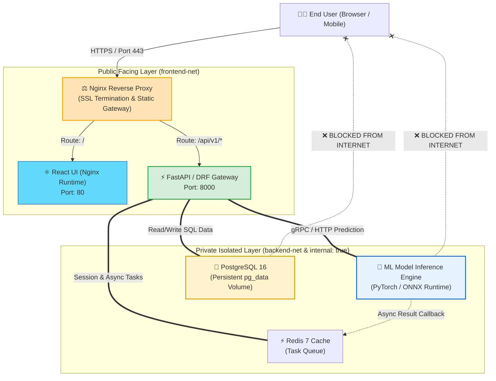
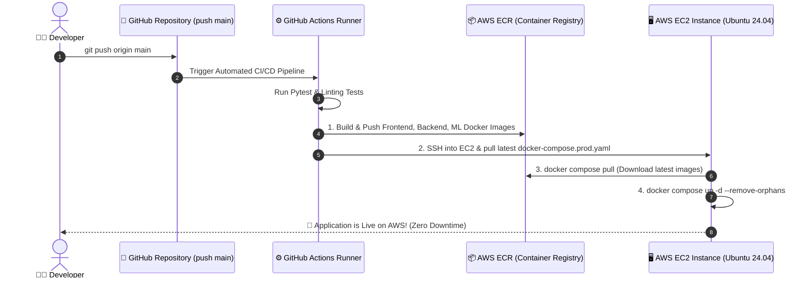

# 🚀 Capstone: Full-Stack ML & AI Platform Dockerization + AWS Deployment

## প্রজেক্ট পরিচিতি (What)

এই ক্যাপস্টোন প্রজেক্টে আমরা একটি সম্পূর্ণ এন্টারপ্রাইজ-গ্রেড **Full-Stack AI & Machine Learning প্ল্যাটফর্ম (NexGen AI Platform)**-কে স্ক্র্যাচ থেকে মাল্টি-কন্টেইনার মাইক্রোসার্ভিসে রূপান্তরিত করব এবং স্বয়ংক্রিয় CI/CD পাইপলাইনের মাধ্যমে **Amazon Web Services (AWS)** ক্লাউডে নিরাপদে ডেপ্লয় করব।

### আমাদের সম্পূর্ণ টেক-স্ট্যাক:
1. **Frontend**: React.js / Vite (Modern UI with TailwindCSS)
2. **Backend API**: Python 3.12 + FastAPI / Django REST Framework (DRF)
3. **ML Inference Engine**: PyTorch / Scikit-Learn Model Serving (AI Prediction Worker)
4. **Database**: PostgreSQL 16 (Relational DB with Persistent Volume)
5. **Cache & Message Broker**: Redis 7 (In-Memory Session & Task Queue)
6. **Reverse Proxy & SSL Gateway**: Nginx (High Performance Load Balancer)
7. **Cloud Platform**: AWS (ECR, EC2, ECS/Fargate, GitHub Actions CI/CD)

---

## কেন এই এন্ড-টু-এন্ড আর্কিটেকচার জানা দরকার? (Why)

```
❌ সাধারণ বা সিঙ্গেল-কন্টেইনার ধারণায় আটকে থাকলে (Before):
   - লোকাল মেশিনে কোড চলে কিন্তু AWS ক্লাউডে ডেপ্লয় করার সময় ডাটাবেজ বা রিভার্স প্রক্সি কনফ্লিক্ট করে
   - React ফ্রন্টএন্ড এবং FastAPI ব্যাকএন্ডে CORS (Cross-Origin Resource Sharing) এরর দিয়ে আটকে থাকে
   - ৫ গিগাবাইটের ভারী PyTorch/TensorFlow মডেল ডকার ইমেজে ঢুকিয়ে ইমেজ সাইজ বিশাল করে ফেলা হয়
   - ম্যানুয়ালি সার্ভারে গিয়ে কোড পুল ও রিস্টার্ট করতে গিয়ে প্রতি রিলিজে ১ ঘণ্টা ডাউনটাইম হয়

✅ এই ক্যাপস্টোন আর্কিটেকচার আয়ত্ত করলে (Production MLOps Master 🌟):
   - Nginx রিভার্স প্রক্সির পেছনে ফ্রন্টএন্ড ও ব্যাকএন্ড থাকায় জিরো CORS সমস্যা!
   - Multi-Stage Build ব্যবহার করে React ও ML ব্যাকএন্ড ইমেজের সাইজ ৮৫% পর্যন্ত কমিয়ে আনা যায়
   - GitHub Actions CI/CD দিয়ে গিটহাবে `git push main` করলেই স্বয়ংক্রিয়ভাবে AWS ECR-এ ইমেজ পুশ হয়ে EC2 তে লাইভ হয়ে যায়
   - রিয়েল-ওয়ার্ল্ড সফটওয়্যার ইঞ্জিনিয়ার ও MLOps আর্কিটেক্ট হিসেবে চাকরির জন্য ১০০% প্রস্তুত হওয়া যায়
```

---

## Analogy — আন্তর্জাতিক স্মার্ট এয়ারপোর্ট টার্মিনাল ✈️🏢

আমাদের ফুল-স্ট্যাক এমএল আর্কিটেকচারকে একটি **আন্তর্জাতিক আধুনিক বিমানবন্দর**-এর সাথে তুলনা করা যায়:

- **Nginx Reverse Proxy** = এয়ারপোর্টের সেন্ট্রাল সিকিউরিটি ও পাসপোর্ট কন্ট্রোল গেট (বাইরের সমস্ত প্যাসেঞ্জারকে ট্রাফিক চেক করে সঠিক টার্মিনালে পাঠিয়ে দেয়)।
- **React Frontend** = এয়ারপোর্টের আকর্ষণীয় লাউঞ্জ ও টিকিট বুকিং স্ক্রিন (ব্যবহারকারী যেখানে সরাসরি ইন্টারঅ্যাক্ট করে)।
- **FastAPI / DRF Backend** = ফ্লাইট অপারেশন কন্ট্রোল রুম (যেকোনো রিকোয়েস্ট গ্রহণ করে ব্যবসা লজিক হ্যান্ডল করে)।
- **ML Inference Engine** = স্বয়ংক্রিয় এআই লাগেজ স্ক্যানার (ভারী এআই মডেল দিয়ে প্রেডিকশন ও ইমেজ অ্যানালাইসিস করে)।
- **PostgreSQL Database** = মূল ডেটা ভল্ট ও প্যাসেঞ্জার হিস্ট্রি রেজিস্ট্রি।
- **Redis Cache** = দ্রুতগতির কনভেয়ার বেল্ট (দ্রুত অ্যাক্সেসের জন্য মেমরি ক্যাশ)।
- **AWS Cloud** = সম্পূর্ণ এয়ারপোর্ট যে সুবিশাল সুরক্ষিত জমির ওপর দাঁড়িয়ে আছে।

---

## System Architecture & End-to-End Data Flow 🗺️



---

## প্রজেক্ট ডিরেক্টরি স্ট্রাকচার (Project Structure)

```text
nexgen-ai-platform/
├── .github/
│   └── workflows/
│       └── deploy.yml              # 🚀 GitHub Actions CI/CD to AWS
├── frontend/                       # ⚛️ React.js Frontend
│   ├── src/
│   ├── package.json
│   ├── nginx.conf                  # Frontend Internal Nginx
│   └── Dockerfile                  # Multi-stage React Dockerfile
├── backend/                        # ⚡ FastAPI / DRF Core API
│   ├── app/
│   │   ├── main.py
│   │   └── config.py
│   ├── requirements.txt
│   └── Dockerfile                  # Python Multi-stage Dockerfile
├── ml-engine/                      # 🧠 AI/ML Model Service
│   ├── models/                     # Saved Model Artifacts (.onnx / .pt)
│   ├── predictor.py
│   ├── requirements.txt
│   └── Dockerfile                  # ML PyTorch Inference Dockerfile
├── nginx/                          # ⚖️ Central Reverse Proxy
│   └── default.conf                # Master Gateway Routing Config
├── .env.example
├── .dockerignore
└── docker-compose.prod.yaml        # 🐳 Master Production Orchestration
```

---

## ১. React Frontend Dockerfile (Multi-Stage Build)

আমরা Node.js ব্যবহার করে কোড কম্পাইল করব এবং রানটাইমে অতি ক্ষুদ্র **`nginx:alpine`** দিয়ে স্ট্যাটিক ফাইল হোস্ট করব (ইমেজ সাইজ মাত্র ২৫ মেগাবাইট!):

```dockerfile
# =================================================================
# Stage 1: Build React Assets
# =================================================================
FROM node:20-alpine AS builder

WORKDIR /app

# ক্যাশ অপ্টিমাইজেশন
COPY package.json package-lock.json ./
RUN npm ci --silent

COPY . .
RUN npm run build

# =================================================================
# Stage 2: Production Nginx Runtime
# =================================================================
FROM nginx:1.27-alpine-slim AS runner

# কাস্টম Nginx স্পা (SPA) কনফিগ কপি
COPY nginx.conf /etc/nginx/conf.d/default.conf

# বিল্ডার স্টেজ থেকে স্ট্যাটিক ফাইল কপি
COPY --from=builder /app/dist /usr/share/nginx/html

EXPOSE 80

CMD ["nginx", "-g", "daemon off;"]
```

---

## ২. FastAPI / DRF Backend Dockerfile

নিরাপদ **Non-Root User (`appuser`)**, পাইথন ভার্চুয়াল এনভায়রনমেন্ট এবং মাল্টি-স্টেজ অপ্টিমাইজেশন:

```dockerfile
# =================================================================
# Stage 1: Builder (Compile Wheel Dependencies)
# =================================================================
FROM python:3.12-slim AS builder

WORKDIR /build

RUN apt-get update && apt-get install -y --no-install-recommends \
    gcc \
    libpq-dev \
    && rm -rf /var/lib/apt/lists/*

RUN python -m venv /opt/venv
ENV PATH="/opt/venv/bin:$PATH"

COPY requirements.txt .
RUN pip install --no-cache-dir --upgrade pip && \
    pip install --no-cache-dir -r requirements.txt

# =================================================================
# Stage 2: Production Runner
# =================================================================
FROM python:3.12-slim AS runner

WORKDIR /app

# রানটাইম লাইব্রেরি ইনস্টল
RUN apt-get update && apt-get install -y --no-install-recommends \
    libpq5 \
    curl \
    && rm -rf /var/lib/apt/lists/*

# ভার্চুয়াল এনভায়রনমেন্ট কপি
COPY --from=builder /opt/venv /opt/venv
ENV PATH="/opt/venv/bin:$PATH" \
    PYTHONUNBUFFERED=1 \
    PYTHONDONTWRITEBYTECODE=1

# সিকিউর নন-রুট ইউজার তৈরি
RUN groupadd -g 1001 appgroup && \
    useradd -u 1001 -g appgroup -s /bin/bash -m appuser

COPY --chown=appuser:appgroup . .

USER appuser

EXPOSE 8000

HEALTHCHECK --interval=30s --timeout=5s --retries=3 \
  CMD curl -f http://localhost:8000/health || exit 1

CMD ["uvicorn", "app.main:app", "--host", "0.0.0.0", "--port", "8000", "--workers", "4"]
```

---

## ৩. Machine Learning Inference Engine Dockerfile

AI/ML মডেল সার্ভ করার জন্য ডেডিকেটেড লাইটওয়েট ডকারফাইল:

```dockerfile
FROM python:3.12-slim AS ml-runner

WORKDIR /ml-app

RUN apt-get update && apt-get install -y --no-install-recommends \
    libgomp1 \
    curl \
    && rm -rf /var/lib/apt/lists/*

COPY requirements.txt .
RUN pip install --no-cache-dir -r requirements.txt

# সিকিউর ইউজার
RUN useradd -u 1002 -s /bin/bash -m mluser
COPY --chown=mluser:mluser . .

USER mluser

EXPOSE 5000

CMD ["uvicorn", "predictor:app", "--host", "0.0.0.0", "--port", "5000", "--workers", "2"]
```

---

## ৪. Nginx Central Gateway (`nginx/default.conf`)

এই মাস্টার গেটওয়েটি ফ্রন্টএন্ড এবং ব্যাকএন্ড এপিআই-এর মধ্যে সিঙ্গেল-এন্ট্রি পয়েন্ট হিসেবে কাজ করে, যা ব্রাউজারের **CORS ইস্যু ১০০% দূর করে**:

```nginx
# =================================================================
# ⚖️ NexGen AI Central Reverse Proxy Configuration
# =================================================================

upstream frontend_upstream {
    server frontend:80;
}

upstream backend_upstream {
    server backend:8000;
}

server {
    listen 80;
    server_name localhost _;

    # জিপ কম্প্রেশন (Super Fast Performance)
    gzip on;
    gzip_types text/plain text/css application/json application/javascript text/xml;

    # ১. সমস্ত Backend API ট্রাফিক (/api/...)
    location /api/ {
        proxy_pass http://backend_upstream;
        proxy_set_header Host $host;
        proxy_set_header X-Real-IP $remote_addr;
        proxy_set_header X-Forwarded-For $proxy_add_x_forwarded_for;
        proxy_set_header X-Forwarded-Proto $scheme;

        # WebSocket সাপোর্ট
        proxy_http_version 1.1;
        proxy_set_header Upgrade $http_upgrade;
        proxy_set_header Connection "upgrade";
    }

    # ২. সমস্ত Frontend UI ট্রাফিক (/)
    location / {
        proxy_pass http://frontend_upstream;
        proxy_set_header Host $host;
        proxy_set_header X-Real-IP $remote_addr;
    }
}
```

---

## ৫. Master Production Orchestration (`docker-compose.prod.yaml`)

```yaml
# ====================================================================
# 🐳 NexGen AI Platform - Master Production Compose Specification
# ====================================================================

x-logging: &prod-logging
  logging:
    driver: "json-file"
    options:
      max-size: "15m"
      max-file: "3"

services:
  # ----------------------------------------------------
  # 1. Central Nginx Gateway
  # ----------------------------------------------------
  gateway:
    image: nginx:1.27-alpine-slim
    container_name: nexgen-gateway
    restart: always
    ports:
      - "80:80"
      - "443:443"
    volumes:
      - ./nginx/default.conf:/etc/nginx/conf.d/default.conf:ro
    networks:
      - public-net
    depends_on:
      - frontend
      - backend
    <<: *prod-logging

  # ----------------------------------------------------
  # 2. React.js Frontend UI
  # ----------------------------------------------------
  frontend:
    build:
      context: ./frontend
      dockerfile: Dockerfile
    container_name: nexgen-frontend
    restart: always
    networks:
      - public-net
    <<: *prod-logging

  # ----------------------------------------------------
  # 3. FastAPI / DRF Core Backend
  # ----------------------------------------------------
  backend:
    build:
      context: ./backend
      dockerfile: Dockerfile
    container_name: nexgen-backend
    restart: always
    environment:
      DATABASE_URL: "postgresql://postgres:${DB_PASSWORD:?DB_PASS Required}@db:5432/nexgendb"
      REDIS_URL: "redis://cache:6379/0"
      ML_ENGINE_URL: "http://ml-engine:5000/predict"
    deploy:
      resources:
        limits:
          cpus: '2.0'
          memory: 1024M
    networks:
      - public-net
      - private-net
    depends_on:
      db:
        condition: service_healthy
      cache:
        condition: service_started
      ml-engine:
        condition: service_started
    <<: *prod-logging

  # ----------------------------------------------------
  # 4. Machine Learning Inference Engine
  # ----------------------------------------------------
  ml-engine:
    build:
      context: ./ml-engine
      dockerfile: Dockerfile
    container_name: nexgen-ml-engine
    restart: always
    shm_size: '1gb'
    deploy:
      resources:
        limits:
          cpus: '2.0'
          memory: 2048M
    networks:
      - private-net
    <<: *prod-logging

  # ----------------------------------------------------
  # 5. PostgreSQL Relational Database (100% Private)
  # ----------------------------------------------------
  db:
    image: postgres:16-alpine
    container_name: nexgen-db
    restart: always
    stop_grace_period: 30s
    environment:
      POSTGRES_DB: nexgendb
      POSTGRES_USER: postgres
      POSTGRES_PASSWORD: ${DB_PASSWORD:?DB_PASS Required}
    volumes:
      - nexgen_pgdata:/var/lib/postgresql/data
    deploy:
      resources:
        limits:
          cpus: '2.0'
          memory: 2048M
    networks:
      - private-net
    healthcheck:
      test: ["CMD-SHELL", "pg_isready -U postgres -d nexgendb"]
      interval: 10s
      timeout: 5s
      retries: 5
    <<: *prod-logging

  # ----------------------------------------------------
  # 6. Redis In-Memory Cache & Broker
  # ----------------------------------------------------
  cache:
    image: redis:7-alpine
    container_name: nexgen-cache
    restart: always
    command: ["redis-server", "--appendonly", "yes"]
    volumes:
      - nexgen_redisdata:/data
    networks:
      - private-net
    <<: *prod-logging

# ====================================================================
# 🌐 Network Segmentation (Zero-Trust Security)
# ====================================================================
networks:
  public-net:
    driver: bridge
  private-net:
    driver: bridge
    internal: true # 🌟 ডাটাবেজ ও এমএল ইঞ্জিন বাইরের ইন্টারনেট থেকে ১০০% বিচ্ছিন্ন!

# ====================================================================
# 💾 Persistent Volumes
# ====================================================================
volumes:
  nexgen_pgdata:
    driver: local
  nexgen_redisdata:
    driver: local
```

---

## ৬. AWS Deployment Walkthrough (ধাপে ধাপে ক্লাউড ডেপ্লয়মেন্ট) ☁️

এখন আমরা আমাদের এই সম্পূর্ণ স্ট্যাকটিকে AWS ক্লাউডে ডেপ্লয় করার প্র্যাকটিক্যাল ধাপগুলো শিখব:



---

### ধাপ ১: AWS ECR (Elastic Container Registry) সেটআপ

AWS কনসোল বা AWS CLI দিয়ে আমাদের ৩টি মাইক্রোসার্ভিসের জন্য তিনটি প্রাইভেট ECR রিপোজিটরি তৈরি করি:

```bash
# AWS ECR রিপোজিটরি তৈরি
aws ecr create-repository --repository-name nexgen/frontend --region us-east-1
aws ecr create-repository --repository-name nexgen/backend --region us-east-1
aws ecr create-repository --repository-name nexgen/ml-engine --region us-east-1
```

```bash
# ডকার সিএলআই দিয়ে AWS ECR এ লগইন করা
aws ecr get-login-password --region us-east-1 | docker login --username AWS --password-stdin <AWS_ACCOUNT_ID>.dkr.ecr.us-east-1.amazonaws.com
```

---

### ধাপ ২: AWS EC2 সার্ভার প্রস্তুতকরণ

1. AWS কনসোলে গিয়ে একটি **Ubuntu 24.04 LTS (t3.xlarge / t3.large)** EC2 ইনস্ট্যান্স লঞ্চ করুন।
2. **Security Group** এ নিচের পোর্টগুলো ওপেন করুন:
   - **Port 80 (HTTP)**: `0.0.0.0/0` (পাবলিক ওয়েব ট্রাফিক)
   - **Port 443 (HTTPS)**: `0.0.0.0/0` (নিরাপদ SSL ট্রাফিক)
   - **Port 22 (SSH)**: `My IP` (শুধুমাত্র আপনার আইপি দিয়ে সার্ভার এক্সেস)
3. EC2 ইনস্ট্যান্সে SSH দিয়ে ঢুকে ডকার ইঞ্জিন ইনস্টল করুন:
   ```bash
   sudo apt-get update
   sudo apt-get install -y docker.io docker-compose-v2
   sudo usermod -aG docker ubuntu
   ```

---

### ধাপ ৩: GitHub Actions CI/CD অটোমেশন (`.github/workflows/deploy.yml`)

গিটহাবে কোড পুশ করলেই স্বয়ংক্রিয়ভাবে AWS-এ ডেপ্লয় করার জন্য পাইপলাইন ফাইল:

```yaml
name: 🚀 Deploy NexGen AI to AWS EC2

on:
  push:
    branches: [ "main" ]

env:
  AWS_REGION: us-east-1
  ECR_REGISTRY: ${{ secrets.AWS_ACCOUNT_ID }}.dkr.ecr.us-east-1.amazonaws.com

jobs:
  build-and-deploy:
    runs-on: ubuntu-latest

    steps:
      - name: 📥 Checkout Code
        uses: actions/checkout@v4

      - name: 🔑 Configure AWS Credentials
        uses: aws-actions/configure-aws-credentials@v4
        with:
          aws-access-key-id: ${{ secrets.AWS_ACCESS_KEY_ID }}
          aws-secret-access-key: ${{ secrets.AWS_SECRET_ACCESS_KEY }}
          aws-region: ${{ env.AWS_REGION }}

      - name: 🔐 Login to Amazon ECR
        id: login-ecr
        uses: aws-actions/amazon-ecr-login@v2

      - name: 🐳 Build and Push Docker Images to ECR
        run: |
          # 1. Frontend Build & Push
          docker build -t $ECR_REGISTRY/nexgen/frontend:latest ./frontend
          docker push $ECR_REGISTRY/nexgen/frontend:latest

          # 2. Backend Build & Push
          docker build -t $ECR_REGISTRY/nexgen/backend:latest ./backend
          docker push $ECR_REGISTRY/nexgen/backend:latest

          # 3. ML Engine Build & Push
          docker build -t $ECR_REGISTRY/nexgen/ml-engine:latest ./ml-engine
          docker push $ECR_REGISTRY/nexgen/ml-engine:latest

      - name: 🚀 SSH to AWS EC2 and Deploy
        uses: appleboy/ssh-action@v1.0.3
        with:
          host: ${{ secrets.EC2_HOST }}
          username: ubuntu
          key: ${{ secrets.EC2_SSH_KEY }}
          script: |
            # ECR লগইন
            aws ecr get-login-password --region us-east-1 | docker login --username AWS --password-stdin ${{ env.ECR_REGISTRY }}
            
            # প্রজেক্ট ডিরেক্টরিতে যাওয়া
            cd /home/ubuntu/nexgen-ai-platform
            
            # নতুন ইমেজ পুল ও রিস্টার্ট
            export DB_PASSWORD="${{ secrets.PROD_DB_PASSWORD }}"
            docker compose -f docker-compose.prod.yaml pull
            docker compose -f docker-compose.prod.yaml up -d --remove-orphans
            
            # অপ্রয়োজনীয় পুরনো ইমেজ ডিলিট
            docker image prune -af --filter "until=24h"
```

---

## Comparison Table — মনোলিথ বনাম ডকারাইজড ক্লাউড এমএল স্ট্যাক

| বৈশিষ্ট্য | ট্র্যাডিশনাল মনোলিথ ডেপ্লয়মেন্ট | ডকারাইজড ক্লাউড এমএল স্ট্যাক |
|---|---|---|
| **CORS জটিলতা** | ❌ ব্রাউজার ও এপিআই পোর্টের কারণে বারবার CORS এরর | 🌟 **Nginx রিভার্স প্রক্সি থাকায় 0% CORS সমস্যা** |
| **এমএল ডিপেনডেন্সি কনফ্লিক্ট** | ❌ সার্ভারে পাইথন ও CUDA ভার্সন কনফ্লিক্ট | 🛡️ **প্রতিটি মডেল আলাদা কন্টেইনারে আইসোলেটেড** |
| **ডেপ্লয়মেন্ট গতি** | ⏳ ম্যানুয়াল ডিপ্লয়ে ৩০-৬০ মিনিট | ⚡ **সিআই/সিডি অটোমেশনে মাত্র ২-৩ মিনিট** |
| **স্কেলিং সক্ষমতা** | ❌ পুরো সার্ভার বড় করতে হয় | 🚀 **শুধুমাত্র এপিআই বা এমএল ওয়ার্কারকে স্কেল করা যায়** |
| **সিকিউরিটি** | ⚠️ ডাটাবেজ পোর্ট পাবলিকলি ওপেন থাকে | 🛡️ **`internal: true` নেটওয়ার্কে ডাটাবেজ ১০০% সুরক্ষিত** |

---

## Production Traps & Solutions (বাস্তব সমস্যা ও সমাধান) ⚠️

### ১. বিশাল সাইজের ML Model Weights ইমেজে ঢুকিয়ে ফেলা
❌ **ভুল:** ডকার ইমেজের ভেতরে `COPY model_weights.pt .` দিয়ে ইমেজ সাইজ ৮-১০ জিবি বানিয়ে ফেলা (ইমেজ পুল করতে ২০ মিনিট সময় নষ্ট হয়)।
✅ **সমাধান:** ডকার ইমেজে শুধুমাত্র পাইথন কোড রাখুন। কন্টেইনার স্টার্ট হওয়ার সময় AWS S3 বা HuggingFace থেকে মডেল ওজন ডাউনলোড করে ভলিউমে ক্যাশ করে নিন।

### ২. Nginx এর Request Body Size লিমিট
❌ **ভুল:** ব্রাউজার থেকে বড় ইমেজ বা ফাইল আপলোড করতে গেলে Nginx `413 Request Entity Too Large` এরর দেয়।
✅ **সমাধান:** `nginx.conf` এ **`client_max_body_size 50M;`** যুক্ত করুন।

### ৩. PyTorch Data Loader এর `Bus Error`
❌ **ভুল:** ডকারের ডিফল্ট 64MB শেয়ার্ড মেমরির কারণে ডিপ লার্নিং প্রিডিকশন ক্র্যাশ করা।
✅ **সমাধান:** কম্পোজ ফাইলে এমএল সার্ভিসের জন্য **`shm_size: '1gb'`** বা তদূর্ধ্ব নির্ধারণ করুন।

---

## Interview Questions ও Answers

### ১. একটি Full-Stack অ্যাপ্লিকেশনে Nginx Reverse Proxy কীভাবে ফ্রন্টএন্ড এবং ব্যাকএন্ডের CORS ইস্যু নির্মূল করে?

**উত্তর:** ব্রাউজারের Same-Origin Policy অনুযায়ী, যদি ফ্রন্টএন্ড চলে পোর্ট ৮০ বা ৩০০০ এ এবং ব্যাকএন্ড চলে পোর্ট ৮০০০ এ, তবে ব্রাউজার ব্যাকএন্ড রিকোয়েস্টকে Cross-Origin গণ্য করে ব্লক করে দেয়।
Nginx Reverse Proxy ব্যবহারের ফলে ক্লায়েন্ট বা ব্রাউজার কেবলমাত্র একটি নির্দিষ্ট ডোমেইন ও পোর্টে (যেমন পোর্ট ৮০ বা ৪৪৩) রিকোয়েস্ট পাঠায়। Nginx সেই রিকোয়েস্টের পাথ বিশ্লেষণ করে `/` হলে ফ্রন্টএন্ড কন্টেইনারে এবং `/api/` হলে ব্যাকএন্ড কন্টেইনারে ইন্টারনাল ডকার নেটওয়ার্কে ফরোয়ার্ড করে দেয়। ব্রাউজারের দৃষ্টিকোণ থেকে পুরো প্ল্যাটফর্মটি একটি একক ডোমেইন থেকে পরিবেশিত হওয়ায় কোনো CORS কনফিগারেশন ছাড়াই সমস্ত যোগাযোগ নির্বিঘ্নে সম্পন্ন হয়।

---

### ২. প্রোডাকশনে React ফ্রন্টএন্ড ডেপ্লয় করার ক্ষেত্রে Multi-Stage Build ও Nginx Alpine ব্যবহারের সুবিধা কী?

**উত্তর:** 
- **Multi-Stage Build:** প্রথম স্টেজে ভারী `node:alpine` ইমেজ এবং `npm run build` ব্যবহার করে সমস্ত JSX, TypeScript ও Tailwind CSS কোডকে অপ্টিমাইজড মিনামাইজড স্ট্যাটিক HTML/JS/CSS ফাইলে রূপান্তর (Compile) করা হয়।
- **Nginx Alpine Runtime:** দ্বিতীয় স্টেজে সমস্ত Node.js রানটাইম এবং `node_modules` ডিরেক্টরি ফেলে দেওয়া হয় এবং শুধুমাত্র কম্পাইল করা স্ট্যাটিক ফাইলগুলো একটি অত্যন্ত ক্ষুদ্র `nginx:alpine` ইমেজে কপি করা হয়। 
ফলে ইমেজের সাইজ ১.২ জিবি থেকে কমে মাত্র **২৫ মেগাবাইটে** নেমে আসে, মেমরি ব্যবহার ৯০% হ্রাস পায় এবং আক্রমণকারীদের জন্য কোনো সিকিউরিটি ভালনারেবিলিটি থাকে না।

---

### ৩. AWS-এ Dockerized Microservices ডেপ্লয় করার জন্য EC2 বনাম ECS Fargate এর মধ্যে পার্থক্য কী?

**উত্তর:** 
- **AWS EC2 (IaaS):** এখানে ব্যবহারকারীকে ভার্চুয়াল লিনাক্স সার্ভার, ওএস প্যাচিং, ডকার ডেমন এবং স্টোরেজ সম্পূর্ণ নিজে পরিচালনা করতে হয়। এটি ছোট ও মাঝারি প্রজেক্টের জন্য অত্যন্ত সাশ্রয়ী এবং সম্পূর্ণ কাস্টমাইজযোগ্য।
- **AWS ECS Fargate (Serverless CaaS):** এটি একটি সার্ভারলেস কন্টেইনার অর্কেস্ট্রেশন সার্ভিস। এখানে কোনো EC2 সার্ভার ম্যানেজ করতে হয় না; ব্যবহারকারী শুধুমাত্র ডকার ইমেজ ও টাস্ক ডেফিনিশন দিয়ে দিলে AWS স্বয়ংক্রিয়ভাবে কন্টেইনার চালায় ও অটো-স্কেল করে। এটি উচ্চ ট্রাফিকের এন্টারপ্রাইজ স্কেলে অতুলনীয়।

---

### ৪. GitHub Actions এবং AWS ECR ব্যবহার করে জিরো-ডাউনটাইম সিআই/সিডি পাইপলাইন কীভাবে কাজ করে?

**উত্তর:** 
১. ডেভেলপার গিটহাবে কোড পুশ করলে GitHub Actions রানার সক্রিয় হয় এবং প্রজেক্টের টেস্ট সুইট রান করে।
২. টেস্ট সফল হলে প্রতিটি সার্ভিসের জন্য ডকার ইমেজ বিল্ড করে তাতে গিট কমিট SHA ট্যাগ লাগিয়ে AWS ECR এ পুশ করে।
৩. এরপর রানার SSH এর মাধ্যমে AWS EC2 সার্ভারে কমান্ড পাঠায়।
৪. EC2 সার্ভার ECR থেকে নতুন ইমেজগুলো পুল করে এবং `docker compose up -d` চালায়।
৫. ডকার নতুন কন্টেইনারগুলো সফলভাবে তৈরি ও হেলদি নিশ্চিত করে তবেই পুরনো কন্টেইনারগুলোকে আলতোভাবে সরিয়ে দেয় (Rolling Update), যার ফলে প্ল্যাটফর্মে গ্রাহকদের জন্য জিরো ডাউনটাইম নিশ্চিত হয়।

---

## Summary

| কম্পোনেন্ট | প্রযুক্তি | ভূমিকা |
|---|---|---|
| **Frontend** | React + Nginx Alpine | লাইটওয়েট হাই-স্পিড UI লেয়ার (২৫MB) |
| **Core API** | FastAPI / DRF + Python 3.12 | বিজনেস লজিক ও সিকিউর গেটওয়ে |
| **AI Inference** | PyTorch / Scikit-Learn | ডেডিকেটেড এমএল প্রেডিকশন সার্ভিস |
| **Database** | PostgreSQL 16 | পারসিস্টেন্ট ভলিউম সহ প্রাইভেট স্টোরেজ |
| **Gateway** | Nginx Reverse Proxy | সেন্ট্রাল রাউটিং, SSL ও CORS ব্লকার |
| **Cloud Registry**| AWS ECR | ডকার ইমেজের সুরক্ষিত প্রাইভেট স্টোর |
| **Cloud Host** | AWS EC2 (Dockerized) | প্রোডাকশন রানটাইম ক্লাউড ইনফ্রা |
| **CI/CD** | GitHub Actions | ওয়ান-ক্লিক স্বয়ংক্রিয় ক্লাউড ডেপ্লয়মেন্ট |

---

🎉 **অভিনন্দন! আপনি এখন একজন দক্ষ ও স্বয়ংসম্পূর্ণ Full-Stack MLOps & Cloud Docker Architect!** 🚀
