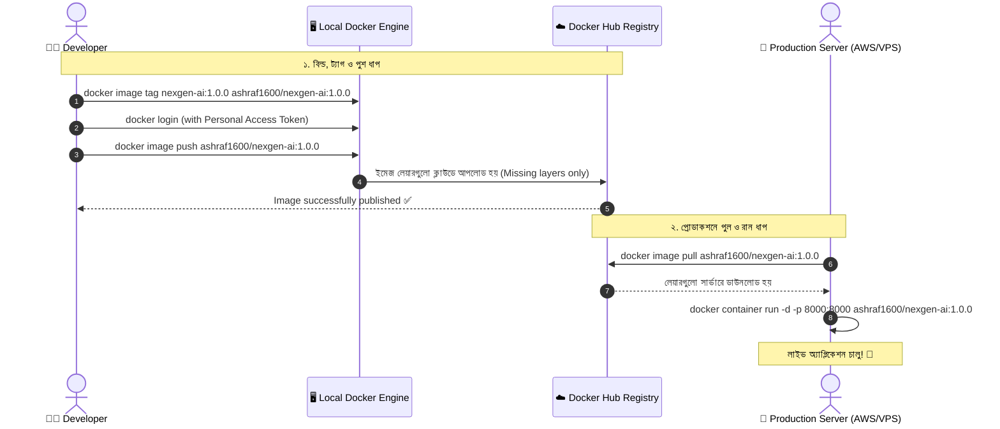

# ☁️ Docker Hub

## Docker Hub কী? (What)

**Docker Hub** হলো ডকারের অফিশিয়াল ক্লাউড-ভিত্তিক **ইমেজ রেজিস্ট্রি সার্ভিস (Container Registry)**, যেখানে বিশ্বজুড়ে ডেভেলপার এবং কোম্পানিগুলো তাদের তৈরি করা ডকার ইমেজ সংরক্ষণ (Store), সংস্করণ নিয়ন্ত্রণ (Version), শেয়ার এবং বিতরণ (Distribute) করে।

সহজ ভাষায়: আপনার সোর্স কোড শেয়ার ও ব্যাকআপ রাখার জন্য যেমন **GitHub**, ঠিক তেমনি আপনার তৈরি করা রেডিমেড ডকার ইমেজ অনলাইনে হোস্ট ও বিশ্বব্যাপী শেয়ার করার প্ল্যাটফর্ম হলো **Docker Hub** (`hub.docker.com`)।

:::info রেজিস্ট্রি বনাম রিপোজিটরি
- **Registry (রেজিস্ট্রি):** সম্পূর্ণ সার্ভিস বা প্ল্যাটফর্ম যেখানে লাখ লাখ ইমেজ জমা থাকে (যেমন Docker Hub, AWS ECR, GitHub Container Registry)।
- **Repository (রিপোজিটরি):** রেজিস্ট্রির ভেতরে আপনার নির্দিষ্ট একটি প্রজেক্ট বা ইমেজের কালেকশন (যেমন `ashraf1600/nexgen-ai`)।
:::

---

## কেন Docker Hub দরকার? (Why)

```
❌ ডকার হাব ছাড়া ইমেজ শেয়ার করলে (Before):
   - ১ গিগাবাইটের `.tar` ফাইল বানিয়ে গুগল ড্রাইভ বা পেনড্রাইভে পাঠাতে হতো
   - কোনো নতুন আপডেট আসলে আবার পুরো ১ জিবি নতুন করে আপলোড/ডাউনলোড লাগতো
   - ভার্সন ট্র্যাকিং ও পাবলিকলি শেয়ার করার কোনো সেন্ট্রাল ব্যবস্থা ছিল না
   - সিআই/সিডি অটোমেশনে ইমেজ বিল্ড করে ক্লাউডে অটো ডেপ্লয় করা অসম্ভব ছিল

✅ Docker Hub ব্যবহার করলে (After):
   - একটি মাত্র কমান্ডে `docker push` এবং `docker pull`
   - লেয়ার রি-ইউজ: শুধুমাত্র পরিবর্তিত কয়েক মেগাবাইট আপডেট আপলোড হয়
   - পাবলিকলি যে কেউ আপনার ওপেনসোর্স প্রজেক্ট এক লাইনে রান করতে পারে
   - গিটহাব অ্যাকশন বা জেনকিন্স দিয়ে স্বয়ংক্রিয়ভাবে ইমেজ বিল্ড ও পুশ করা যায়
```

---

## Analogy — গিটহাব ও মোবাইল অ্যাপ স্টোরের উপমা 📱🛒

Docker Hub-কে **Google Play Store / Apple App Store অথবা GitHub**-এর সাথে তুলনা করা যায়:

- **Git Repository / Android APK** = আপনার ডকার ইমেজ (`nexgen-ai:1.0.0`)।
- **Google Play Store / GitHub** = Docker Hub প্ল্যাটফর্ম।
- **`docker push`** = অ্যাপ স্টোরে নিজের তৈরি করা অ্যাপ পাবলিশ করা।
- **`docker pull`** = ব্যবহারকারীর মোবাইল থেকে অ্যাপ স্টোর সার্চ করে এক ক্লিকে ইনস্টল করে নেওয়া।

---

## How it Works — Image Push ও Pull এর সম্পূর্ণ পাইপলাইন



---

## Hands-on: ডকার হাবে ইমেজ পুশ করার স্টেপ-বাই-স্টেপ গাইড

আমাদের **NexGen AI** প্রজেক্টের ইমেজ ডকার হাবে আপলোড করার সম্পূর্ণ প্রক্রিয়াটি অনুসরণ করি:

### ধাপ ১: ডকার হাবে ফ্রি অ্যাকাউন্ট তৈরি
1. ব্রাউজারে [hub.docker.com](https://hub.docker.com) এ যান।
2. একটি ফ্রি অ্যাকাউন্ট সাইন আপ করুন। 
3. আপনার একটি ইউনিক **Docker ID (Username)** নির্বাচন করুন (যেমন `ashraf1600`)।

---

### ধাপ ২: Personal Access Token (PAT) তৈরি (বেস্ট প্র্যাকটিস) 🔑

ডকার হাবে সরাসরি পাসওয়ার্ড দিয়ে লগইন করার চেয়ে **Personal Access Token (PAT)** ব্যবহার করা বহুগুণ নিরাপদ।

1. Docker Hub-এ লগইন করে ওপরের ডানপাশে আপনার প্রোফাইল ছবিতে ক্লিক করুন।
2. **Account Settings** ➔ **Security** ➔ **New Access Token** এ ক্লিক করুন।
3. টোকেনের নাম দিন (যেমন: `laptop-cli-token`) এবং পারমিশন দিন **Read & Write**।
4. **Generate** চাপুন এবং টোকেনটি কপি করে সুরক্ষিত জায়গায় সেভ রাখুন (এটি আর দ্বিতীয়বার দেখা যাবে না)।

---

### ধাপ ৩: টার্মিনালে ডকার হাবে লগইন করা (`docker login`)

```bash
docker login -u ashraf1600
```

**বাস্তব Output:**
```text
Password: [এখানে আপনার কপি করা Personal Access Token পেস্ট করুন]
Login Succeeded
```

:::tip টোকেন নিরাপদে পাস করার প্রো-টিপ
কমান্ড লাইনে পাসওয়ার্ড না লিখে পাইপ করে লগইন করতে পারেন:
```bash
echo "YOUR_PAT_TOKEN" | docker login -u ashraf1600 --password-stdin
```
:::

---

### ধাপ ৪: ইমেজকে ডকার হাবের ফরম্যাটে ট্যাগ করা (`docker image tag`)

ডকার হাবে পুশ করতে হলে ইমেজের নামের শুরুতে আপনার **Docker ID / Username** থাকা বাধ্যতামূলক:

```text
সিনট্যাক্স: <DOCKER_USERNAME>/<REPOSITORY_NAME>:<TAG>
```

```bash
# আমাদের পাইথন বেস ইমেজকে NexGen AI এর ভার্সন 1.0.0 হিসেবে ট্যাগ করি
docker image tag python:3.12-slim ashraf1600/nexgen-ai:1.0.0

# একই সাথে একটি 'latest' ট্যাগও তৈরি করি (স্ট্যান্ডার্ড কনভেনশন)
docker image tag ashraf1600/nexgen-ai:1.0.0 ashraf1600/nexgen-ai:latest
```

```bash
# লোকাল ইমেজ তালিকা দেখি
docker image ls --filter "reference=ashraf1600/nexgen-ai"
```

**বাস্তব Output:**
```text
REPOSITORY             TAG       IMAGE ID       CREATED        SIZE
ashraf1600/nexgen-ai   1.0.0     c8d88e0cfb88   3 weeks ago    154MB
ashraf1600/nexgen-ai   latest    c8d88e0cfb88   3 weeks ago    154MB
```

---

### ধাপ ৫: ডকার হাবে ইমেজ পুশ করা (`docker image push`)

```bash
# ভার্সন 1.0.0 পুশ করি
docker image push ashraf1600/nexgen-ai:1.0.0
```

**বাস্তব Output:**
```text
The push refers to repository [docker.io/ashraf1600/nexgen-ai]
a0ec3e9e2f69: Pushed 
361730d12e83: Pushed 
0a6f3a763884: Pushed 
ec7ef2489e21: Pushed 
1.0.0: digest: sha256:4f86d63bc3a2ef8b330366b577e8... size: 1158
```

```bash
# latest ট্যাগটিও পুশ করি
docker image push ashraf1600/nexgen-ai:latest
```
*(লক্ষ্য করবেন, `latest` পুশ করার সময় সেকেন্ডের মধ্যে `Layer already exists` দেখিয়ে শেষ হয়ে যাবে, কারণ লেয়ারগুলো ইতিমধ্যে আপলোড হয়ে গেছে!)*

---

### ধাপ ৬: যেকোনো মেশিন থেকে ইমেজ পুল ও রান করা (`docker image pull`)

এখন পৃথিবীর যেকোনো কম্পিউটার থেকে আপনার তৈরি করা ইমেজ এক ক্লিকে চালানো যাবে:

```bash
# ইমেজ পুল করা
docker image pull ashraf1600/nexgen-ai:1.0.0

# কন্টেইনার রান করা
docker container run -d --name my-nexgen-api -p 8000:8000 ashraf1600/nexgen-ai:1.0.0
```

---

### ধাপ ৭: কাজ শেষে লগআউট করা (`docker logout`)

```bash
docker logout
```

**Output:**
```text
Removing login credentials for https://index.docker.io/v1/
```

---

## Public বনাম Private Repositories 🔒

ডকার হাবে দুই ধরনের রিপোজিটরি তৈরি করা যায়:

| বৈশিষ্ট্য | Public Repository (পাবলিক) | Private Repository (প্রাইভেট) |
|---|---|---|
| **কারা দেখতে পারে** | পৃথিবীর যেকোনো মানুষ | শুধুমাত্র আপনি এবং আপনার ইনভাইট করা টিম |
| **পুল করার জন্য লগইন** | ❌ লগইন ছাড়াই যে কেউ পুল করতে পারে | ✅ অবশ্যই অথেনটিকেটেড ইউজার হতে হবে |
| **খরচ (Docker Free Tier)** | 🌟 **সম্পূর্ণ আনলিমিটেড ফ্রি** | ১টি ফ্রি প্রাইভেট রিপোজিটরি |
| **ব্যবহারের ক্ষেত্র** | ওপেনসোর্স লাইব্রেরি, বেস ইমেজ | কোম্পানির নিজস্ব ক্লায়েন্ট কোড ও বাণিজ্যিক প্রজেক্ট |

---

## Comparison Table — পপুলার ডকার রেজিস্ট্রিগুলোর তুলনা

ডকার হাব ছাড়াও ইন্ডাস্ট্রিতে আরও কিছু জনপ্রিয় রেজিস্ট্রি ব্যবহৃত হয়:

| রেজিস্ট্রি | কোম্পানি | প্রধান সুবিধা | সেরা ব্যবহারের ক্ষেত্র |
|---|---|---|---|
| 🐳 **Docker Hub** | Docker Inc. | অফিশিয়াল ও ডিফল্ট রেজিস্ট্রি, বিশাল ওপেনসোর্স লাইব্রেরি | ব্যক্তিগত প্রজেক্ট ও ওপেনসোর্স |
| 📦 **GitHub Container Registry (GHCR)** | GitHub / Microsoft | গিটহাব রিপোজিটরির সাথে সরাসরি ইন্টিগ্রেটেড (`ghcr.io`) | GitHub Actions CI/CD পাইপলাইন |
| ☁️ **AWS ECR** | Amazon Web Services | AWS IAM ও ECS/EKS এর সাথে নিখুঁত সিকিউরিটি | AWS ক্লাউডে এন্টারপ্রাইজ ডেপ্লয়মেন্ট |
| 🛡️ **Google Artifact Registry** | Google Cloud (GCP) | জিকেসি (GKE) ও ক্লাউড রানের জন্য দ্রুততম | GCP ভিত্তিক মাইক্রোসার্ভিস |
| 🏠 **Harbor** | CNCF / Open Source | সেলফ-হোস্টেড প্রাইভেট রেজিস্ট্রি উইথ ভালনারেবিলিটি স্ক্যানার | ব্যাংকিং ও সিকিউর অন-প্রিমিসেস সার্ভার |

---

## Docker Hub Rate Limits (ডাউনলোড লিমিট)

ডকার হাব ফ্রি ইউজারদের জন্য একটি ডাউনলোড লিমিট নির্ধারণ করেছে:

- **Anonymous User (লগইন ছাড়া):** প্রতি ৬ ঘণ্টায় সর্বোচ্চ **১০০টি ইমেজ পুল** (আইপি প্রতি)।
- **Authenticated Free User (লগইন করা ফ্রি অ্যাকাউন্ট):** প্রতি ৬ ঘণ্টায় সর্বোচ্চ **২০০টি ইমেজ পুল**।
- **Pro / Team Plan (পেইড):** সম্পূর্ণ **আনলিমিটেড ইমেজ পুল**।

:::tip সিআই/সিডি টিপ
গিটহাব অ্যাকশন বা জেনকিন্স বিল্ড সার্ভারে সবসময় `docker login` করে ইমেজ পুল করবেন, যাতে আনঅথেনটিকেটেড ১০০ পুল লিমিটের এরর (`toomanyrequests`) না আসে।
:::

---

## Common Mistakes — নতুনদের সাধারণ ভুল

### ১. ইউজারনেম ছাড়া লোকাল ইমেজ পুশ করার চেষ্টা
❌ **ভুল:** `docker push nexgen-ai:1.0.0` দিয়ে এরর পাওয়া: `denied: requested access to the resource is denied`.
✅ **সঠিক:** ডকার জানে না এটি কার অ্যাকাউন্টে যাবে। সবসময় ইউজারনেম দিয়ে ট্যাগ করুন: `docker push ashraf1600/nexgen-ai:1.0.0`।

### ২. পাসওয়ার্ড সম্বলিত ইমেজ পাবলিক রিপোজিটরিতে পুশ করা
❌ **ভুল:** `.env` বা এপিআই কি সম্বলিত ইমেজ ডকার হাবে পাবলিক করে দেওয়া (মুহূর্তের মধ্যে পুরো সিকিউরিটি ব্রিচ)।
✅ **সঠিক:** সবসময় ডকারফাইল ও বিল্ড কনটেক্সট চেক করুন যেন কোনো সিক্রেট ইমেজে বেক না থাকে।

### ৩. পাসওয়ার্ড দিয়ে লগইন করা (PAT ব্যবহার না করা)
❌ **ভুল:** সিআই/সিডি স্ক্রিপ্টে বা টার্মিনালে আসল ডকার হাব পাসওয়ার্ড হার্ডকোড করা।
✅ **সঠিক:** সবসময় ডকার হাব সেটিংস থেকে একটি Personal Access Token (PAT) তৈরি করে সেটি ব্যবহার করুন, যা যেকোনো সময় রিভোক করা যায়।

---

## Best Practices

1. **সর্বদা Dual Tagging করুন**: প্রতিটি রিলিজের সময় একটি নির্দিষ্ট সিম্যান্টিক ভার্সন (`v1.0.0`) এবং একটি `latest` ট্যাগ একসাথে পুশ করুন:
   ```bash
   docker tag my-app:v1.0.0 ashraf/my-app:v1.0.0
   docker tag my-app:v1.0.0 ashraf/my-app:latest
   docker push ashraf/my-app:v1.0.0
   docker push ashraf/my-app:latest
   ```
2. **ডকার হাব রিপোজিটরিতে সুন্দর `README.md` যুক্ত করুন**: কীভাবে আপনার ইমেজ রান করতে হবে তার ডকার রান কমান্ড ও এনভায়রনমেন্ট ভেরিয়েবলের বিবরণ ডকার হাব পেজে লিখে রাখুন।
3. **Docker Scout এনেবল রাখুন**: ডকার হাবে ইমেজ পুশ করার পর স্বয়ংক্রিয় ইমেজ ভালনারেবিলিটি স্ক্যানিং রিপোর্ট দেখুন।

---

## Interview Questions ও Answers

### ১. Docker Registry এবং Docker Repository এর মধ্যে পার্থক্য কী?

**উত্তর:** 
- **Docker Registry:** এটি একটি সম্পূর্ণ সেন্ট্রালাইজড ক্লাউড বা অন-প্রিমিসেস স্টোরেজ ও অথেনটিকেশন সার্ভিস যা ডকার ইমেজ সংরক্ষণ ও হোস্ট করে (যেমন Docker Hub, AWS ECR, Quay.io)।
- **Docker Repository:** এটি একটি নির্দিষ্ট রেজিস্ট্রির অধীনে থাকা একটি সুনির্দিষ্ট অ্যাপ্লিকেশনের সমস্ত সম্পর্কিত ইমেজ ও ভার্সন ট্যাগের কালেকশন (যেমন `ashraf1600/nexgen-ai` হলো একটি রিপোজিটরি, যার ভেতরে `1.0.0`, `1.1.0`, `latest` ইত্যাদি ট্যাগ থাকে)।

---

### ২. `docker login` এ সাধারণ পাসওয়ার্ডের বদলে Personal Access Token (PAT) কেন ব্যবহার করা উচিত?

**উত্তর:** 
১. **লিস্ট প্রিভিলেজ (Least Privilege):** PAT তৈরি করার সময় নির্দিষ্ট পারমিশন (যেমন শুধুমাত্র Read-Only বা Read-Write) নির্ধারণ করা যায়।
২. **নিরাপত্তা ও অডিট:** আসল পাসওয়ার্ড পরিবর্তন না করেই নির্দিষ্ট সার্ভার বা সিআই/সিডির জন্য তৈরি টোকেন যেকোনো সময় ডিলিট বা রিভোক (Revoke) করে ফেলা যায়।
৩. **2FA সাপোর্ট:** অ্যাকাউন্টে Two-Factor Authentication (2FA) চালু থাকলে টার্মিনাল সিএলআই থেকে লগইন করার জন্য PAT ব্যবহার করা বাধ্যতামূলক।

---

### ৩. `docker push` করার সময় ডকার কীভাবে ব্যান্ডউইথ ও সময় বাঁচায়?

**উত্তর:** ডকার ইমেজ একটি স্তরভিত্তিক (Layered) আর্কিটেকচার। যখন `docker push` কমান্ড দেওয়া হয়, ডকার ক্লায়েন্ট প্রথমে ডকার হাব রেজিস্ট্রির সাথে যোগাযোগ করে প্রতিটি লেয়ারের SHA256 ডাইজেস্ট মিলিয়ে দেখে। যেসব লেয়ার ইতিমধ্যে রেজিস্ট্রিতে বিদ্যমান আছে (যেমন `python:3.12-slim` বেস ওএস লেয়ার), ডকার হাব সেগুলোকে **"Layer already exists"** হিসেবে স্কিপ করে। ফলে ডকার শুধুমাত্র নতুন তৈরিকৃত অ্যাপ্লিকেশনের পরিবর্তিত লেয়ারগুলো আপলোড করে, যা ব্যান্ডউইথ ও আপলোড টাইম ৯৫% পর্যন্ত কমিয়ে দেয়।

---

### ৪. `docker push` দেওয়ার পর "access to the resource is denied" এরর আসার কারণ কী?

**উত্তর:** এর প্রধান দুটি কারণ:
১. **অথেনটিকেশন মিসিং:** ব্যবহারকারী টার্মিনালে `docker login` করেননি অথবা সেশন এক্সপায়ার হয়ে গেছে।
২. **ভুল নেইমিং কনভেনশন:** ইমেজের নামের শুরুতে ডকার হাব ইউজারনেম নেই (যেমন শুধু `my-app:latest` পুশ করার চেষ্টা করা, যা ডকার অফিশিয়াল লাইব্রেরিতে পুশ করতে গিয়ে পারমিশন এরর দেয়)। সমাধান হলো `docker tag my-app:latest username/my-app:latest` দিয়ে ট্যাগ করে পুশ করা।

---

## Summary

| কনসেপ্ট / কমান্ড | সিনট্যাক্স | কী কাজ করে |
|---|---|---|
| **লগইন** | `docker login -u <user>` | ডকার হাবে সিকিউর টোকেন দিয়ে অথেনটিকেশন করে |
| **লগআউট** | `docker logout` | লোকাল মেশিন থেকে ডকার ক্রেডেনশিয়াল মুছে দেয় |
| **ইমেজ ট্যাগ** | `docker tag app:1.0 user/app:1.0` | ডকার হাব রিপোজিটরি ফরম্যাটে ট্যাগ তৈরি করে |
| **ইমেজ পুশ** | `docker push user/app:1.0` | ক্লাউডে ইমেজ আপলোড ও পাবলিশ করে |
| **ইমেজ পুল** | `docker pull user/app:1.0` | ক্লাউড থেকে ইমেজ লোকাল মেশিনে ডাউনলোড করে |
| **পাবলিক রিপো** | আনলিমিটেড ফ্রি | ওপেনসোর্স ও গ্লোবাল ডিস্ট্রিবিউশন |

---

# 🎓 LEVEL 1: FOUNDATION সমাপ্ত! 🏆

**অভিনন্দন!** আপনি সফলভাবে **Level 1: Foundation-এর সমস্ত ১৪টি টপিক** সম্পন্ন করেছেন। 

এখন আপনি:
- কন্টেইনারাইজেশন ও ভার্চুয়ালাইজেশনের মূল পার্থক্য বোঝেন
- ডকার ইঞ্জিন, ডেমন, containerd ও runc এর ইন্টারনাল আর্কিটেকচার জানেন
- লোকাল মেশিনে ডকার ইনস্টল ও CLI মাস্টারি অর্জন করেছেন
- ডকার ইমেজ, লেয়ারিং, UnionFS এবং সঠিক পাইথন বেস ইমেজ সিলেক্ট করতে পারেন
- কন্টেইনার রান, লাইফসাইকেল, সিগন্যাল হ্যান্ডলিং (`stop` vs `kill`) এবং স্টেট ম্যানেজমেন্টে পারদর্শী
- পোর্ট ম্যাপিং ও এনভায়রনমেন্ট ভেরিয়েবল দিয়ে ক্লাউড-নেটিভ কনফিগারেশন করতে পারেন
- এবং নিজের তৈরি ইমেজ ডকার হাবে বিশ্বব্যাপী পাবলিশ করতে পারেন!

---

## পরবর্তী ধাপ (LEVEL 2: INTERMEDIATE শুরু!)

ভিত্তি মজবুত হয়েছে, এবার আসল প্রো-লেভেলের কাজ শুরু! 

পরবর্তী টপিক থেকে শুরু হচ্ছে **Level 2: Intermediate** — যেখানে প্রথম টপিক হলো **Dockerfile Basics** (`docker/dockerfile-basics.md`)। এখানে আমরা শিখব কীভাবে স্ক্র্যাচ থেকে একটি প্রোডাকশন-রেডি ডকারফাইল লিখতে হয় আমাদের **NexGen AI** FastAPI অ্যাপ্লিকেশনের জন্য।

চলুন শুরু করি! 🚀
