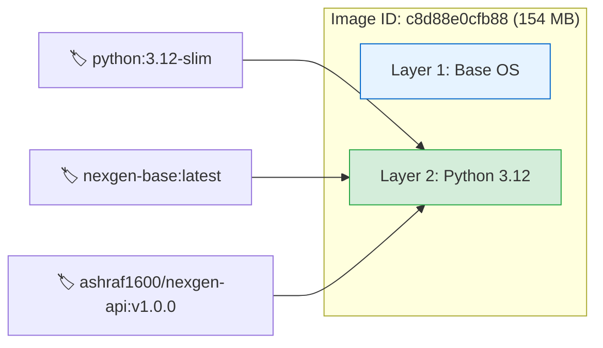
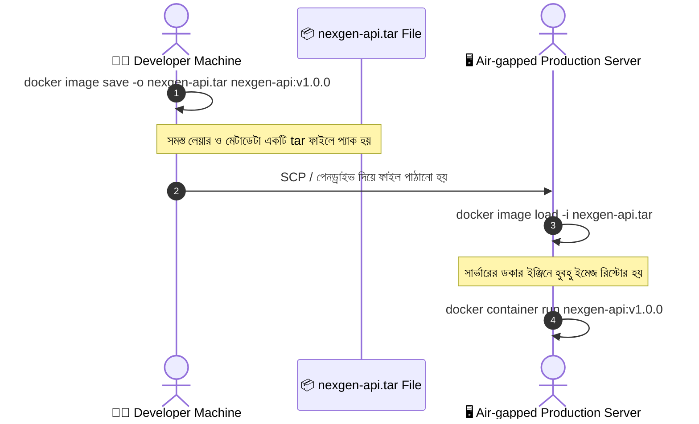
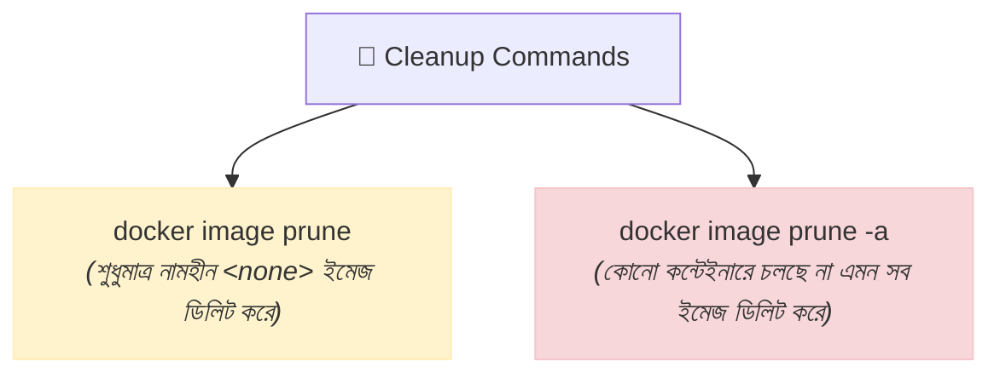

# 🛠️ Docker Image Commands

## Docker Image Commands কী? (What)

**Docker Image Commands** হলো Docker CLI-এর সেই সমস্ত সাব-কমান্ড যার মাধ্যমে লোকাল মেশিনে থাকা ডকার ইমেজগুলোর জীবনচক্র পরিচালনা (Manage) করা হয়। এর মধ্যে রয়েছে ইমেজের নতুন নাম ও ভার্সন ট্যাগ দেওয়া (`tag`), ইমেজের প্রতিটি লেয়ারের ইতিহাস দেখা (`history`), অব্যবহৃত ইমেজ মুছে ডিস্ক খালি করা (`rm` / `prune`), এবং ইন্টারনেট ছাড়া পেনড্রাইভ বা ফাইলের মাধ্যমে ইমেজ ট্রান্সফার করার জন্য আর্কাইভ তৈরি ও লোড করা (`save` / `load`)।

:::info কমান্ড সিনট্যাক্স
আধুনিক ডকারে ইমেজ সংক্রান্ত সমস্ত কমান্ড `docker image <action>` ফরম্যাটে লেখা হয়:
```bash
docker image <COMMAND> [OPTIONS] [ARGUMENTS]
```
:::

---

## কেন Image Commands নিখুঁতভাবে জানা দরকার? (Why)

```
❌ ইমেজ কমান্ড না জানলে (Before):
   - কিছুদিন কাজ করার পরেই লোকাল ডিস্কে 40-50 GB জায়গা ডকার ইমেজে ভরে যাবে
   - CI/CD পাইপলাইনে কোন ইমেজে কোন ভার্সন ট্যাগ লাগাতে হবে বুঝতে জটিলতা হবে
   - কোন লেয়ারটি বেশি সাইজ খরচ করছে তা বিশ্লেষণ করা যাবে না
   - সিকিউর বা Air-gapped সার্ভারে (যেখানে ইন্টারনেট নেই) ইমেজ নেওয়া অসম্ভব মনে হবে

✅ ইমেজ কমান্ড ভালোভাবে জানলে (After):
   - `docker image prune` দিয়ে সেকেন্ডে গিগাবাইট ডিস্ক স্পেস খালি করা যায়
   - প্রোডাকশন রিলিজের জন্য সিম্যান্টিক ভার্সনিং (`v1.0.0`) ও রেজিস্ট্রি ট্যাগিং করা যায়
   - `docker image history` দিয়ে ডকারফাইলের অপ্টিমাইজেশন পয়েন্ট খুঁজে বের করা যায়
   - `save` এবং `load` দিয়ে সহজে অফলাইনে ইমেজ ব্যাকআপ ও ট্রান্সফার করা যায়
```

---

## Analogy — বই প্রকাশনা ও লাইব্রেরির উপমা 📚

Docker Image Commands-কে একটি **বই প্রকাশনা ও লাইব্রেরি সিস্টেম**-এর সাথে তুলনা করা যায়:

- **`docker image tag`** = একটি বইয়ের নতুন এডিশন স্টিকার বা বারকোড লাগানো (মূল বই একটাই, কিন্তু রেফারেন্স নতুন)।
- **`docker image history`** = বইটির সূচিপত্র ও পেছনের পাতার ড্রাফট দেখা (কোন চ্যাপ্টারে কত পৃষ্ঠা যোগ হয়েছে)।
- **`docker image rm`** = লাইব্রেরির তাক থেকে নির্দিষ্ট একটি পুরনো বই ফেলে দেওয়া।
- **`docker image prune`** = নষ্ট, ছেঁড়া বা নামহীন সব খসড়া কাগজ রিসাইকেল বিনে পাঠানো।
- **`docker image save`** = পুরো বইটিকে একটি পার্সেল বক্সে প্যাক করে কুরিয়ারে পাঠানোর জন্য রেডি করা।
- **`docker image load`** = পার্সেল বক্স খুলে বইটি লাইব্রেরির তাকে সাজিয়ে রাখা।

---

## How it Works — Image Tagging ও Layer Management

### ১. ইমেজ ট্যাগিংয়ের অভ্যন্তরীণ মেকানিজম (Aliasing)

যখন আপনি কোনো ইমেজকে নতুন ট্যাগ দেন (`docker image tag`), তখন ডকার কিন্তু নতুন করে কোনো ফাইল বা মেমোরি কপি করে না। এটি কেবল **একই Image ID-র দিকে নির্দেশকারী একটি নতুন পয়েন্টার (Alias)** তৈরি করে।



### ২. অফলাইন ইমেজ ট্রান্সফার পাইপলাইন (`save` ও `load`)



---

## Hands-on: প্রয়োজনীয় সমস্ত Image Commands

আমাদের **NexGen AI** প্রজেক্টের প্রেক্ষাপটে প্রতিটি কমান্ড বাস্তবে দেখে নিই:

### ১. ইমেজ ট্যাগ করা (`docker image tag`)

ডকার হাব বা ক্লাউড রেজিস্ট্রিতে (AWS ECR / GitHub Packages) ইমেজ পুশ করার আগে আপনার ইউজারনেম এবং নির্দিষ্ট ভার্সনসহ ট্যাগ দিতে হয়।

```bash
# সিনট্যাক্স: docker image tag <SOURCE_IMAGE>[:TAG] <TARGET_IMAGE>[:TAG]

# python:3.12-slim কে আমাদের প্রজেক্টের বেস হিসেবে একটি নতুন লোকাল ট্যাগ দিই
docker image tag python:3.12-slim nexgen-base:v1.0

# ডকার হাবে আপলোড করার উপযোগী ট্যাগ তৈরি
docker image tag python:3.12-slim ashraf1600/nexgen-ai:1.0.0
```

**কমান্ডের পর ইমেজ তালিকা দেখুন (`docker image ls`):**
```text
REPOSITORY               TAG         IMAGE ID       CREATED        SIZE
ashraf1600/nexgen-ai     1.0.0       c8d88e0cfb88   3 weeks ago    154MB
nexgen-base              v1.0        c8d88e0cfb88   3 weeks ago    154MB
python                   3.12-slim   c8d88e0cfb88   3 weeks ago    154MB
```

:::tip লক্ষ্য করুন (Image ID ও ডিস্ক স্পেস)
তিনটি এন্ট্রিরই **IMAGE ID (`c8d88e0cfb88`) হুবহু এক** এবং ডিস্কে এরা মাত্র **একবারই (154MB)** জায়গা নিচ্ছে, তিনবার নয়!
:::

---

### ২. ইমেজের লেয়ার হিস্ট্রি দেখা (`docker image history`)

কোন লেয়ারটি তৈরি হতে কত সময় ও সাইজ লেগেছে তা বিশ্লেষণ করার জন্য এই কমান্ডটি অত্যন্ত কার্যকর:

```bash
docker image history python:3.12-slim
```

**বাস্তব Output:**
```text
IMAGE          CREATED        CREATED BY                                      SIZE      COMMENT
c8d88e0cfb88   3 weeks ago    CMD ["python3"]                                 0B        buildkit.dockerfile.v0
<missing>      3 weeks ago    RUN /bin/sh -c set -eux; apt-get update; ...    13.4MB    buildkit.dockerfile.v0
<missing>      3 weeks ago    ENV PYTHON_GET_PIP_SHA256=...                   0B        buildkit.dockerfile.v0
<missing>      3 weeks ago    ENV PYTHON_GET_PIP_URL=...                      0B        buildkit.dockerfile.v0
<missing>      3 weeks ago    ENV PYTHON_PIP_VERSION=24.0                     0B        buildkit.dockerfile.v0
<missing>      3 weeks ago    RUN /bin/sh -c set -eux; apt-get update; ...    66.1MB    buildkit.dockerfile.v0
<missing>      3 weeks ago    ENV PYTHON_VERSION=3.12.4                       0B        buildkit.dockerfile.v0
<missing>      3 weeks ago    COPY dir:sha256:a0ec3e9e... in /                74.5MB    
```

:::tip ইমেজ সাইজ কমানোর সিক্রেট
যদি দেখেন কোনো `RUN` লেয়ারে ভুলবশত ১০০ এমবি সাইজ বেড়ে গেছে, তবে আপনি সাথে সাথে ডকারফাইল সংশোধন করে অপ্রয়োজনীয় ফাইল ডিলিট বা ক্যাশ ক্লিন করতে পারবেন।
:::

---

### ৩. নির্দিষ্ট ইমেজ মুছে ফেলা (`docker image rm` / `docker rmi`)

```bash
# ট্যাগ নাম দিয়ে ইমেজ রিমুভ
docker image rm nexgen-base:v1.0
```

**বাস্তব Output:**
```text
Untagged: nexgen-base:v1.0
```

:::info "Untagged" বনাম "Deleted"
যদি একটি Image ID-তে একাধিক ট্যাগ থাকে, তবে `docker image rm` দিলে শুধু ঐ ট্যাগটি মুছে যায় (**Untagged**)। কিন্তু যখন একটি ইমেজের আর কোনো ট্যাগ অবশিষ্ট থাকে না, তখন ডকার মূল লেয়ারগুলো ডিস্ক থেকে সম্পূর্ণ মুছে ফেলে (**Deleted**)।
:::

```bash
# Image ID ব্যবহার করে ইমেজ ডিলিট
docker image rm 8b3b4f627bb5

# যদি কন্টেইনার ব্যবহার করার কারণে রিমুভ না হতে চায়, তবে ফোর্সফুলি রিমুভ করতে:
docker image rm -f ashraf1600/nexgen-ai:1.0.0
```

---

### ৪. অপ্রয়োজনীয় ও ড্যাংলিং ইমেজ ক্লিন করা (`docker image prune`)

ডকার ইমেজ বিল্ড বা আপডেট করতে করতে অনেক নামহীন ইমেজ তৈরি হয়, যাদের `<none>:<none>` বলে। এগুলোকে **Dangling Images** বলা হয়।



```bash
# শুধুমাত্র ড্যাংলিং (<none>:<none>) ইমেজ ডিলিট করা
docker image prune
```

**বাস্তব Output:**
```text
WARNING! This will remove all dangling images.
Are you sure you want to continue? [y/N] y
Total reclaimed space: 0B
```

```bash
# কোনো চলমান বা বন্ধ কন্টেইনারে ব্যবহৃত হচ্ছে না এমন সমস্ত অব্যবহৃত ইমেজ এক ক্লিকে মুছে ফেলা
docker image prune -a
```

**বাস্তব Output:**
```text
WARNING! This will remove all images without at least one container associated to them.
Are you sure you want to continue? [y/N] y
Deleted Images:
untagged: postgres:16-alpine
deleted: sha256:8b3b4f627bb5a5b1c...
deleted: sha256:7a4c5e3d1b9f2e...

Total reclaimed space: 379.2MB
```

:::warning প্রোডাকশন সার্ভারে সতর্কতা
`docker image prune -a` খুব সাবধানে চালাবেন! এটি আপনার বেস ইমেজগুলোও ডিলিট করে দেবে যদি এই মুহূর্তে সেগুলো দিয়ে কোনো কন্টেইনার তৈরি না থাকে।
:::

---

### ৫. অফলাইনে ইমেজ সেভ ও লোড করা (`docker image save` ও `load`)

যখন ক্লাউড সার্ভারে কোনো ইন্টারনেট সংযোগ থাকে না বা প্রাইভেট নেটওয়ার্কে পেনড্রাইভ/SCP দিয়ে ইমেজ পাঠাতে হয়:

#### ধাপ ক: ইমেজকে `.tar` ফাইলে এক্সপোর্ট করা

```bash
# python:3.12-slim ইমেজকে একটি tar ফাইলে সেভ করি
docker image save -o python-3.12-slim.tar python:3.12-slim
```

**ফ্ল্যাগ ব্যাখ্যা:**
- `-o` (`--output`): আউটপুট ফাইলের নাম ও পাথ নির্ধারণ করে।

```bash
# ফাইলের সাইজ চেক করুন
ls -lh python-3.12-slim.tar
# Output: -rw-r--r-- 1 user user 155M Jul 24 10:30 python-3.12-slim.tar
```

#### ধাপ খ: অন্য সার্ভারে `.tar` ফাইল থেকে ইমেজ লোড করা

```bash
# tar ফাইল থেকে ইমেজ ডকার ইঞ্জিনে ইমপোর্ট করা
docker image load -i python-3.12-slim.tar
```

**ফ্ল্যাগ ব্যাখ্যা:**
- `-i` (`--input`): যে tar ফাইলটি লোড করতে হবে তার পাথ।

**বাস্তব Output:**
```text
Loaded image: python:3.12-slim
```

---

### ৬. ডকার হাবে ইমেজ খোঁজা (`docker search`)

টার্মিনাল থেকেই ডকার হাবের অফিসিয়াল ও পপুলার ইমেজ সার্চ করতে পারেন:

```bash
# পোস্টগ্রেস সংক্রান্ত ইমেজ সার্চ এবং সর্বোচ্চ ৫টি স্টারড রেজাল্ট দেখা
docker search --limit 5 postgres
```

**বাস্তব Output:**
```text
NAME                     DESCRIPTION                                     STARS     OFFICIAL
postgres                 The PostgreSQL object-relational database ...   13450     [OK]
bitnami/postgresql       Bitnami PostgreSQL Docker Image                450       
circleci/postgres        PostgreSQL is an open-source database...        80        
cimg/postgres            CircleCI PostgreSQL Convenience Image           15        
ubuntu/postgres          Charmed PostgreSQL                             12        
```

---

## Comparison Table — Save/Load বনাম Export/Import

নতুনদের মধ্যে সবচেয়ে বেশি কনফিউশন তৈরি হয় এই চারটা কমান্ড নিয়ে:

| বৈশিষ্ট্য | `docker image save` / `load` | `docker container export` / `import` |
|---|---|---|
| **মূল অবজেক্ট** | **Docker Image** (ইমেজ) | **Docker Container** (কন্টেইনার) |
| **লেয়ার হিস্ট্রি** | ✅ সমস্ত লেয়ার ও মেটাডেটা সংরক্ষিত থাকে | ❌ সমস্ত লেয়ার ফ্ল্যাট হয়ে একটি ফাইলে পরিণত হয় |
| **এনভায়রনমেন্ট ও CMD** | ✅ `CMD`, `ENV`, `ENTRYPOINT` অক্ষত থাকে | ❌ সমস্ত মেটাডেটা হারিয়ে যায় |
| **আকার** | প্রতিটি লেয়ার থাকার কারণে কিছুটা বড় | তুলনামূলক কিছুটা ছোট (Flat filesystem) |
| **মূল উদ্দেশ্য** | হুবহু ইমেজ ব্যাকআপ ও অফলাইন ট্রান্সফার | লাইভ কন্টেইনারের ফাইলসিস্টেম স্ন্যাপশট নেওয়া |

---

## Common Mistakes — নতুনদের সাধারণ ভুল

### ১. কন্টেইনার থাকা অবস্থায় ইমেজ ডিলিট করার চেষ্টা
❌ **ভুল:** `docker rmi python:3.12-slim` দেওয়ার পর Error আসা: `conflict: unable to delete (must be forced) - image is being used by stopped container`.
✅ **সঠিক:** আগে সেই কন্টেইনারটিকে রিমুভ করুন (`docker rm <container_id>`), তারপর ইমেজ ডিলিট করুন। অথবা কোনো ডিপেনডেন্ট কন্টেইনার না রেখে ক্লিন করুন।

### ২. `save` করার সময় ট্যাগ উল্লেখ না করে Image ID ব্যবহার করা
❌ **ভুল:** `docker save -o app.tar c8d88e0cfb88` (ইমেজ আইডি দিলে লোড করার পর নাম `<none>:<none>` হয়ে যায়)।
✅ **সঠিক:** সবসময় নাম ও ট্যাগসহ সেভ করুন: `docker save -o app.tar python:3.12-slim`। এতে লোড করার পর স্বয়ংক্রিয়ভাবে আসল নামটি পেয়ে যায়।

### ৩. অপ্রয়োজনে `-f` (Force) ফ্ল্যাগ দিয়ে ইমেজ ডিলিট করা
❌ **ভুল:** সব সময় অভ্যাসবশত `docker rmi -f` চালানো।
✅ **সঠিক:** এরর আসার কারণ বুঝে সমাধান করা ভালো, কারণ ফোর্স ডিলিট করলে চলমান কন্টেইনারের সাথে রেফারেন্স ভেঙে মিসম্যাচ তৈরি হতে পারে।

---

## Best Practices

1. **Semantic Versioning ব্যবহার করুন**: আপনার FastAPI অ্যাপ্লিকেশনের ইমেজ ট্যাগিংয়ে সিম্যান্টিক ভার্সনিং মেনে চলুন (যেমন `nexgen-api:1.0.0`, `nexgen-api:1.0.1`, `nexgen-api:1.1.0`)।
2. **গিট কমিট হ্যাশ দিয়ে ট্যাগ যুক্ত করুন**: CI/CD পাইপলাইনে ইমেজের নামের সাথে গিট কমিট আইডি যোগ করুন (যেমন `nexgen-api:sha-a1b2c3d`)। এতে প্রোডাকশনে কোন কমিটের কোড চলছে তা এক পলকে বোঝা যায়।
3. **নিয়মিত `docker image prune` চালান**: ডেভেলপমেন্ট মেশিনে সপ্তাহে একবার `docker image prune` চালিয়ে অপ্রয়োজনীয় ড্যাংলিং ইমেজ মুক্ত রাখুন।
4. **ইমেজ সাইজ নিয়মিত অডিট করুন**: `docker image history` চালিয়ে বড় সাইজের লেয়ারগুলোকে চিহ্নিত করে ডকারফাইল অপ্টিমাইজ করুন।

---

## Interview Questions ও Answers

### ১. `docker image prune` এবং `docker image prune -a` এর মধ্যে পার্থক্য কী?

**উত্তর:** 
- **`docker image prune`**: শুধুমাত্র **Dangling Images** ডিলিট করে। ড্যাংলিং ইমেজ হলো সেইসব ইমেজ যেগুলোর কোনো নাম বা ট্যাগ নেই (লিস্টে `<none>:<none>` হিসেবে দেখায়)। এগুলো সাধারণত নতুন ভার্সন বিল্ড করার পর পুরনো ওভাররাইট হওয়া লেয়ার।
- **`docker image prune -a`**: ড্যাংলিং ইমেজের পাশাপাশি লোকাল মেশিনে থাকা এমন সমস্ত ইমেজ মুছে ফেলে যেগুলোর সাথে বর্তমানে কোনো চলমান (Running) বা বন্ধ (Stopped) কন্টেইনার যুক্ত নেই।

---

### ২. `docker image save` এবং `docker container export` এর মধ্যে টেকনিক্যাল পার্থক্য কী?

**উত্তর:** 
- `docker image save` একটি ডকার ইমেজকে তার সমস্ত হিস্ট্রি, লেয়ার, ট্যাগ, এনভায়রনমেন্ট ভেরিয়েবল এবং `CMD`/`ENTRYPOINT` মেটাডেটা সহ অক্ষত অবস্থায় `.tar` ফাইলে সংরক্ষণ করে। এটি পরবর্তীতে `docker image load` করলে পূর্বাবস্থায় ফিরে আসে।
- `docker container export` একটি কন্টেইনারের তৎকালীন ফাইলসিস্টেমের একটি ফ্ল্যাট (Flat) স্ন্যাপশট তৈরি করে। এতে ইমেজের লেয়ারিং হিস্ট্রি এবং ডকার মেটাডেটা (যেমন কোন কমান্ডে অ্যাপ চলবে) সম্পূর্ণ মুছে যায়।

---

### ৩. একটি ইমেজে নতুন ট্যাগ দিলে কি মেমোরি দ্বিগুণ খরচ হয়?

**উত্তর:** **না, মেমোরি দ্বিগুণ খরচ হয় না।** 
Docker-এ ট্যাগিং হলো কেবল একটি আলিয়াস (Alias) বা রেফারেন্স পয়েন্টার। নতুন ট্যাগ দিলে ডকার একই Image ID এবং একই ফিজিক্যাল লেয়ারগুলোর দিকে নতুন একটি ট্যাগ নেম ম্যাপ করে দেয়। ফলে হার্ডডিস্কে কোনো অতিরিক্ত স্পেস খরচ হয় না।

---

### ৪. `docker image history` কমান্ড থেকে কী কী গুরুত্বপূর্ণ তথ্য পাওয়া যায়?

**উত্তর:** `docker image history` কমান্ড একটি ইমেজের প্রতিটি লেয়ারের বিস্তারিত তথ্য দেয়:
1. কোন ডকারফাইল নির্দেশিকার (`RUN`, `COPY`, `ENV`, `CMD`) কারণে লেয়ারটি তৈরি হয়েছিল।
2. কোন নির্দিষ্ট লেয়ারটি ডিস্কে কত মেগাবাইট বা গিগাবাইট সাইজ নিয়েছে।
3. কোন লেয়ারটি বিল্ড করার সময় তৈরি হয়েছিল এবং এর ক্রিয়েশন টাইমস্ট্যাম্প।
এই তথ্যের ওপর ভিত্তি করে ডেভেলপাররা বুঝতে পারেন কোন স্টেপে অপ্রয়োজনীয় ফাইল জমা হয়েছে এবং ডকারফাইল অপ্টিমাইজ করতে পারেন।

---

## Summary

| কমান্ড | কী কাজ করে |
|---|---|
| `docker image tag <src> <target>` | ইমেজকে নতুন নাম বা ভার্সন ট্যাগ দেয় (Alias তৈরি) |
| `docker image history <image>` | ইমেজের প্রতিটি লেয়ারের সাইজ ও কমান্ডের ইতিহাস দেখে |
| `docker image rm <image>` | লোকাল ডিস্ক থেকে নির্দিষ্ট ইমেজ মুছে ফেলে |
| `docker image prune` | নামহীন ড্যাংলিং (`<none>`) ইমেজগুলো ডিলিট করে |
| `docker image prune -a` | কন্টেইনারে ব্যবহৃত হচ্ছে না এমন সব ইমেজ মুছে দেয় |
| `docker image save -o file.tar <image>` | অফলাইনে ব্যবহারের জন্য ইমেজকে tar ফাইলে প্যাক করে |
| `docker image load -i file.tar` | tar ফাইল থেকে ইমেজ ডকার ইঞ্জিনে রিস্টোর করে |
| `docker search <term>` | ডকার হাব থেকে কাঙ্ক্ষিত ইমেজ খুঁজে বের করে |

---

## পরবর্তী ধাপ

আমরা সফলভাবে ডকার ইমেজের সমস্ত হ্যান্ডস-অন কমান্ড আয়ত্ত করেছি। পরবর্তী টপিকে আমরা প্রবেশ করব ডকারের প্রাণকেন্দ্রে — **Running Containers** (`docker/containers.md`) — যেখানে শিখব কীভাবে ব্যাকগ্রাউন্ডে (Detached Mode) কন্টেইনার চালাতে হয়, কন্টেইনারের নাম দিতে হয়, এবং পোর্ট এক্সপোজ করতে হয়।
