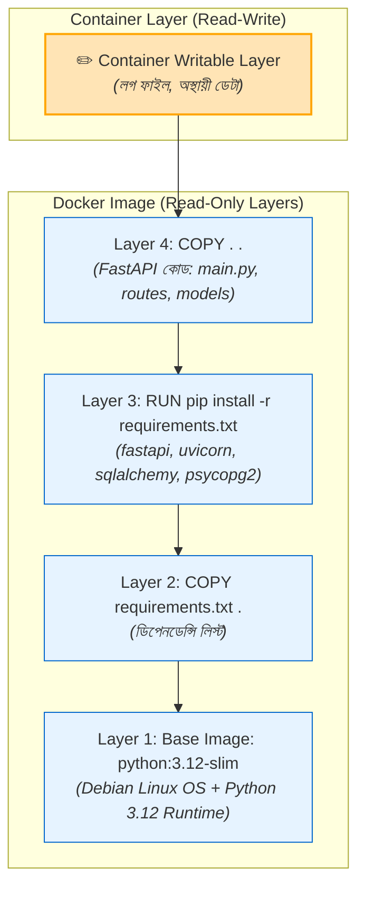
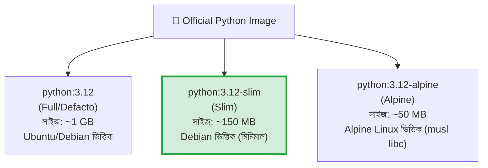

# 📀 Working with Docker Images

## Docker Image কী? (What)

**Docker Image** হলো একটি **Read-Only (অপরিবর্তনীয়) বাইনারি প্যাকেজ বা ব্লুপ্রিন্ট**, যার মধ্যে একটি অ্যাপ্লিকেশন সফলভাবে চলার জন্য প্রয়োজনীয় সমস্ত উপাদান থাকে — যেমন অপারেটিং সিস্টেমের ফাইলসিস্টেম, প্রোগ্রামিং ল্যাঙ্গুয়েজ রানটাইম (যেমন Python 3.12), প্রয়োজনীয় লাইব্রেরি, ডিপেনডেন্সি এবং কনফিগারেশন মেটাডেটা।

সহজ ভাষায়: ডকার ইমেজ হলো আপনার অ্যাপ্লিকেশনের একটি **হিমায়িত স্ন্যাপশট (Frozen Snapshot)**। এই ইমেজটি নিজে কখনো পরিবর্তিত হয় না; কিন্তু এই ইমেজকে ব্যবহার করে যত খুশি কন্টেইনার (লাইভ রানিং অ্যাপ্লিকেশন) তৈরি করা যায়।

:::info ইমেজের মূল বৈশিষ্ট্য
- **Immutable (অপরিবর্তনীয়):** একবার একটি ইমেজ বিল্ড হয়ে গেলে তার ভেতরের ফাইল পরিবর্তন করা যায় না।
- **Layered (স্তরভিত্তিক):** একাধিক রিড-অনলি লেয়ারের সমন্বয়ে একটি ইমেজ গঠিত হয়।
- **Portable (বহনযোগ্য):** যেকোনো প্ল্যাটফর্ম বা ক্লাউডে হুবহু একইভাবে চলে।
:::

---

## কেন Docker Image এত গুরুত্বপূর্ণ? (Why)

### ট্র্যাডিশনাল ডিপ্লয়মেন্ট বনাম ডকার ইমেজ

```
❌ ডকার ইমেজ ছাড়া (Before):
   - সার্ভার সেটআপ করার জন্য বড় Shell Script বা Ansible প্লেবুক চালাতে হতো
   - ডিপেনডেন্সি ডাউনলোড করার সময় কোনো সাইট ডাউন থাকলে ডিপ্লয়মেন্ট ফেইল করতো
   - ভিন্ন ভিন্ন সার্ভারে সামান্য লাইব্রেরি মিসম্যাচ হলেও রানটাইম ক্র্যাশ করতো
   - পুরনো ভার্সনে রোলব্যাক করা ছিল এক দুঃস্বপ্ন (Manual Reinstallation)

✅ ডকার ইমেজ ব্যবহার করলে (After):
   - সম্পূর্ণ অ্যাপ একটি সেলফ-কনটেইন্ড ফাইলে প্যাকড থাকে
   - "Build Once, Run Anywhere" — লোকাল, টেস্ট এবং প্রোডাকশনে হুবহু একই বাইনারি রান হয়
   - ইমেজ রেজিস্ট্রিতে সেভ থাকে, সেকেন্ডের মধ্যে ডাউনলোড ও রান করা যায়
   - নতুন ভার্সনে বাগ আসলে পূর্বের ইমেজ ট্যাগে (যেমন `v1.0.0`) সাথে সাথে ইনস্ট্যান্ট রোলব্যাক সম্ভব
```

---

## Analogy — বাস্তব জীবনের উপমা 🏗️

Docker Image এবং Container-এর সম্পর্ক বোঝার জন্য সবচেয়ে দারুণ তিনটি উপমা:

| উপমা ক্ষেত্র | Docker Image (ইমেজ) | Docker Container (কন্টেইনার) |
|---|---|---|
| **স্থাপত্য** | বাড়ির ব্লুপ্রিন্ট / নকশা (Blueprint) | সেই নকশা দেখে তৈরি করা আসল বাড়ি (Physical House) |
| **প্রোগ্রামিং** | একটি Class (ক্লাস সংজ্ঞা) | Class থেকে তৈরি হওয়া Object / Instance |
| **ফটোকপি** | মূল মাস্টার কপি বা ডাই (Master Stamp) | সেই মাস্টার কপি দিয়ে তৈরি হাজারো স্ট্যাম্প |
| **রান্না** | বিরিয়ানির রেসিপি ও মসলার প্যাকেট | সেই রেসিপি দিয়ে রান্না করা আসল বিরিয়ানি |

ব্লুপ্রিন্ট (Image) নিজে কিন্তু বাড়ি নয় — এতে শুধু বাড়ি বানানোর নির্দেশ ও উপাদান সংজ্ঞায়িত থাকে। আপনি একটি মাত্র ব্লুপ্রিন্ট ব্যবহার করে একই রকম ১০০টি বাড়ি (Containers) তৈরি করতে পারেন।

---

## Docker Image কীভাবে কাজ করে? (How it Works — Layers & UnionFS)

ডকার ইমেজের সবচেয়ে বড় শক্তি হলো এর **Layered Architecture (স্তরভিত্তিক স্থাপত্য)**।

যখন কোনো ইমেজ তৈরি হয়, তখন এটি একটি একক বড় ফাইলের মতো থাকে না। বরং এটি বেশ কয়েকটি ছোট ছোট **Read-Only Layers** এর স্তুপ আকারে তৈরি হয়। ডকার ইঞ্জিন **Overlay2** স্টোরেজ ড্রাইভার এবং **Union Filesystem (UnionFS)** ব্যবহার করে এই সব লেয়ারকে একত্রিত করে ব্যবহারকারীকে একটি একক ডিরেক্টরি হিসেবে দেখায়।

### NexGen AI ইমেজের লেয়ার কাঠামো



### লেয়ারিংয়ের ৩টি বিরাট সুবিধা:

1. **Storage Optimization (ডিস্ক স্পেস সাশ্রয়):** যদি আপনার সার্ভারে ১০টি ভিন্ন ভিন্ন FastAPI প্রজেক্ট চলে এবং সবাই `python:3.12-slim` বেস ইমেজ ব্যবহার করে, তবে ডকার `python:3.12-slim` লেয়ারটি **মাত্র একবারই** ডাউনলোড ও ডিস্কে সংরক্ষণ করবে। বাকি সব ইমেজ সেই লেয়ারটি শেয়ার করবে!
2. **Faster Downloads & Uploads:** ইমেজ আপডেট করার সময় ডকার শুধুমাত্র পরিবর্তিত লেয়ারগুলো ডাউনলোড/আপলোড করে, পুরো ইমেজ নয়।
3. **Build Caching:** যে লেয়ারে পরিবর্তন হয়নি, ইমেজ বিল্ডের সময় ডকার সেই লেয়ারের ক্যাশ ব্যবহার করে সেকেন্ডের মধ্যে বিল্ড শেষ করে।

---

## Docker Image Naming Structure ও Tags

একটি ডকার ইমেজের পূর্ণ নাম দেখতে কেমন হয়? চলুন এর অ্যানাটমি বুঝি:

```text
docker.io/library/python:3.12-slim
│         │       │      │
│         │       │      └─ Tag (ভার্সন বা ভ্যারিয়েন্ট)
│         │       └──────── Image Name / Repository (ইমেজের নাম)
│         └──────────────── Namespace / User (ইউজার বা অর্গানাইজেশন)
└────────────────────────── Registry Host (রেজিস্ট্রি ডোমেন)
```

### ইমেজের উপাদানসমূহের ব্যাখ্যা:
- **Registry Host:** ইমেজটি কোথায় সংরক্ষিত আছে (ডিফল্ট: `docker.io` অর্থাৎ Docker Hub)।
- **Namespace / Username:** ইমেজ তৈরিকারীর নাম (অফিসিয়াল ইমেজের ক্ষেত্রে এটি `library`, সাধারণ ইউজারের ক্ষেত্রে ইউজারনেম যেমন `ashraf1600`)।
- **Repository / Image Name:** ইমেজের মূল নাম (যেমন `python`, `postgres`, `nexgen-api`)।
- **Tag:** ইমেজের নির্দিষ্ট ভার্সন বা টাইপ (যেমন `3.12`, `3.12-slim`, `latest`)।

:::warning `:latest` ট্যাগের ঝুঁকি
যদি কোনো কমান্ডে ট্যাগ উল্লেখ না করেন (যেমন `docker pull python`), ডকার স্বয়ংক্রিয়ভাবে `python:latest` ট্যাগ ধরে নেয়। প্রোডাকশন এনভায়রনমেন্টে **কখনো `:latest` ব্যবহার করবেন না**! কারণ `latest` পরিবর্তনশীল — আজ যা latest, কাল নতুন আপডেটে কোড ভেঙে যেতে পারে। সবসময় নির্দিষ্ট ট্যাগ যেমন `python:3.12.4-slim` ব্যবহার করুন।
:::

---

## Python Image Variants — Slim বনাম Alpine বনাম Full

FastAPI বা Python প্রজেক্টের জন্য ডকার হাব থেকে ইমেজ সিলেক্ট করার সময় আপনি বেশ কয়েকটি ভ্যারিয়েন্ট দেখতে পাবেন। কোনটা বেছে নেবেন?



### ভ্যারিয়েন্টসমূহের গভীর তুলনা:

| বৈশিষ্ট্য | Full (`python:3.12`) | Slim (`python:3.12-slim`) | Alpine (`python:3.12-alpine`) |
|---|---|---|---|
| **ইমেজ সাইজ** | ~1 GB (অনেক ভারী) | ~150 MB (লাইটওয়েট) | ~50 MB (অত্যন্ত ক্ষুদ্র) |
| **C-বিল্ড টুলস (gcc, make)** | ডিফল্ট ইনস্টল থাকে | থাকে না (দরকার হলে ইনস্টলযোগ্য) | থাকে না |
| **C Library** | `glibc` (স্ট্যান্ডার্ড) | `glibc` (স্ট্যান্ডার্ড) | `musl libc` (নন-স্ট্যান্ডার্ড) |
| **FastAPI/PostgreSQL সাপোর্ট** | সম্পূর্ণ সহজ | সম্পূর্ণ সহজ ও দ্রুত | `psycopg2`, `cryptography` বিল্ডে সমস্যা হয় |
| **বিল্ডের গতি** | মাঝারি | খুব দ্রুত | ধীর (হুইল প্যাকেজ না থাকায় কম্পাইল লাগে) |
| **আমাদের রেকমেন্ডেশন** | ❌ অপ্রয়োজনীয় ভারী | ✅ **সেরা ও ব্যালান্সড (Recommended)** | ⚠️ সতর্কতার সাথে ব্যবহার্য |

:::tip কেন আমরা NexGen AI-তে `python:3.12-slim` ব্যবহার করছি?
`python:3.12-slim` ইমেজটি Debian-এর উপর তৈরি এবং এতে স্ট্যান্ডার্ড `glibc` রয়েছে। ফলে FastAPI-র সাথে PostgreSQL (`psycopg2-binary` বা `asyncpg`), `pydantic` ইত্যাদি C-extensions যুক্ত লাইব্রেরিগুলো কোনো কম্পাইলেশন ঝামেলা ছাড়াই চোখের পলকে ইনস্টল হয়ে যায়, অথচ সাইজ থাকে মাত্র ১৫০ মেগাবাইট!
:::

---

## Hands-on: ইমেজ নিয়ে কাজ করার প্রাথমিক কমান্ডসমূহ

### ১. ইমেজ পুল করা (`docker image pull`)

ডকার হাব থেকে আমাদের প্রজেক্টের জন্য প্রয়োজনীয় পাইথন এবং পোস্টগ্রেস ইমেজ ডাউনলোড করি:

```bash
# Python 3.12 slim ইমেজ ডাউনলোড
docker image pull python:3.12-slim
```

**বাস্তব Output:**
```text
3.12-slim: Pulling from library/python
ec7ef2489e21: Pull complete 
0a6f3a763884: Pull complete 
361730d12e83: Pull complete 
a0ec3e9e2f69: Pull complete 
Digest: sha256:4f86d63bc3a2ef8b330366b577e8e6ab232490b4d4715ec3510e14a1a3641dd1
Status: Downloaded newer image for python:3.12-slim
docker.io/library/python:3.12-slim
```

```bash
# আমাদের ডাটাবেজের জন্য PostgreSQL 16 ইমেজ ডাউনলোড
docker image pull postgres:16-alpine
```

---

### ২. লোকাল ইমেজের তালিকা দেখা (`docker image ls`)

```bash
# ডাউনলোড করা সমস্ত ইমেজ তালিকাভুক্ত করা
docker image ls
```

**বাস্তব Output:**
```text
REPOSITORY   TAG           IMAGE ID       CREATED        SIZE
postgres     16-alpine     8b3b4f627bb5   2 weeks ago    379MB
python       3.12-slim     c8d88e0cfb88   3 weeks ago    154MB
```

**কলাম পরিচিতি:**
- **REPOSITORY**: ইমেজের নাম।
- **TAG**: ইমেজের ভার্সন।
- **IMAGE ID**: প্রথম ১২ ডিজিটের ইউনিক আইডেন্টিফায়ার।
- **CREATED**: অফিসিয়াল ইমেজটি কত দিন আগে তৈরি হয়েছে।
- **SIZE**: ডিস্কে ইমেজটি কতটুকু জায়গা নিচ্ছে।

---

### ৩. ইমেজের বিস্তারিত তথ্য বিশ্লেষণ (`docker image inspect`)

একটি ইমেজের ভেতরে কোন পোর্ট এক্সপোজ করা আছে, কোন এনভায়রনমেন্ট ভেরিয়েবল সেট করা আছে বা কী ওএস ব্যবহৃত হচ্ছে তা দেখার জন্য:

```bash
# পাইথন ইমেজের মেটাডেটা দেখা
docker image inspect python:3.12-slim
```

**আউটপুট থেকে গুরুত্বপূর্ণ কিছু অংশ (JSON Snippet):**
```json
[
    {
        "Id": "sha256:c8d88e0cfb8849b2512a8069695d35a8bc3...",
        "RepoTags": [
            "python:3.12-slim"
        ],
        "Architecture": "amd64",
        "Os": "linux",
        "Config": {
            "Env": [
                "PATH=/usr/local/bin:/usr/local/sbin:/usr/local/bin:/usr/sbin:/usr/bin:/sbin:/bin",
                "PYTHON_VERSION=3.12.4",
                "PYTHON_PIP_VERSION=24.0"
            ],
            "Cmd": [
                "python3"
            ]
        },
        "RootFS": {
            "Type": "layers",
            "Layers": [
                "sha256:ec7ef2489e2187f589253457a170566373e...",
                "sha256:0a6f3a7638848f1bcf5a06ec38f293be4e9...",
                "sha256:361730d12e83e60fc3cbb147614d0263f35...",
                "sha256:a0ec3e9e2f69ec6d8174f8846c433c4672e..."
            ]
        }
    }
]
```

:::tip সরাসরি নির্দিষ্ট ফিল্ড ফিল্টার করা (`--format`)
পুরো বড় JSON না দেখে নির্দিষ্ট ফিল্ড দেখতে Go Template ফরম্যাট ব্যবহার করতে পারেন:
```bash
# পাইথন ইমেজের ডিফল্ট কমান্ড কী তা দেখা
docker image inspect --format '{{.Config.Cmd}}' python:3.12-slim
# Output: [python3]
```
:::

---

## Comparison Table — Official বনাম Verified Publisher বনাম Community Images

ডকার হাব থেকে ইমেজ ব্যবহারের সময় সিকিউরিটির জন্য এই পার্থক্য জানা অতি জরুরি:

| ব্যাজ / ধরন | উদাহরণ | কে তৈরি করে | সিকিউরিটি ও নির্ভরযোগ্যতা |
|---|---|---|---|
| 🐳 **Docker Official Image** | `python`, `postgres`, `redis`, `nginx` | Docker Curated Team ও সংশ্লিষ্ট ওপেনসোর্স টিম | ⭐⭐⭐⭐⭐ সর্বোচ্চ নিরাপদ ও নিয়মিত প্যাচ করা |
| 🛡️ **Verified Publisher** | `bitnami/postgresql`, `mongodb/mongodb-community-server` | স্বনামধন্য কোম্পানি (Bitnami, MongoDB Inc.) | ⭐⭐⭐⭐ অত্যন্ত নির্ভরযোগ্য ও ভেরিফায়েড |
| 👤 **Community Image** | `ashraf1600/nexgen-api`, `someuser/python-fastapi` | ব্যক্তিগত ডেভেলপার বা কমিউনিটি সদস্য | ⭐⭐ যাচাই করে নেওয়া দরকার (Vulnerability থাকতে পারে) |

---

## Common Mistakes — নতুনদের সাধারণ ভুল

### ১. ইমেজ এবং কন্টেইনার গুলিয়ে ফেলা
❌ **ভুল:** ভাবা যে ইমেজ ডিলিট করলে রানিং কন্টেইনার বন্ধ হয়ে যাবে।
✅ **সঠিক:** ইমেজ হলো ব্লুপ্রিন্ট। কন্টেইনার তৈরি হয়ে গেলে সে ইমেজ ব্যবহার করতে থাকে। রানিং কন্টেইনার যে ইমেজ ব্যবহার করছে, সেই ইমেজ সরাসরি ডিলিট করা যায় না।

### ২. প্রোডাকশনে Alpine ইমেজে অচিন্তিতভাবে নির্ভর করা
❌ **ভুল:** সাইজ ছোট করার জন্য পাইথন ডেটা সায়েন্স বা FastAPI অ্যাপে `python:alpine` ব্যবহার করা এবং `gcc` বা `musl-libc` এরর পেয়ে ঘন্টার পর ঘন্টা সময় নষ্ট করা।
✅ **সঠিক:** পাইথন প্রজেক্টের জন্য সবসময় **`python:3.12-slim`** ব্যবহার করা নিরাপদ ও দ্রুততম।

### ৩. অকারণে ফুল (Full) ইমেজ ব্যবহার করে সাইজ বাড়ানো
❌ **ভুল:** সাধারণ FastAPI অ্যাপের জন্য ১ জিবি সাইজের ডিফল্ট `python:3.12` ইমেজ ব্যবহার করা।
✅ **সঠিক:** স্লিম ভ্যারিয়েন্ট ব্যবহার করে ইমেজ সাইজ ১৫০ এমবি-র মধ্যে সীমাবদ্ধ রাখা।

---

## Best Practices

1. **সর্বদা নির্দিষ্ট ট্যাগ ব্যবহার করুন**: `python:3.12.4-slim-bookworm` এর মতো নির্দিষ্ট ট্যাগ ব্যবহার করলে ভবিষ্যতে যেকোনো সময় ঠিক একই ডিপেনডেন্সি পাওয়া নিশ্চিত হয়।
2. **অফিসিয়াল বেস ইমেজ বেছে নিন**: সিকিউরিটি ও মেইনটেনেন্স সুবিধার জন্য ডকার হাবের অফিশিয়াল ইমেজ (`docker.io/library/...`) বেস হিসেবে ব্যবহার করুন।
3. **নিয়মিত ইমেজ আপডেট ও সিকিউরিটি স্ক্যান করুন**: ডকারের বিল্ট-ইন টুল `docker scout` ব্যবহার করে ইমেজে কোনো সিকিউরিটি ত্রুটি (CVE) আছে কিনা তা যাচাই করুন।
4. **অব্যবহৃত ইমেজ নিয়মিত ক্লিন করুন**: লোকাল মেশিনে ডিস্ক স্পেস বাঁচাতে `docker image prune` ব্যবহার করুন।

---

## Interview Questions ও Answers

### ১. Docker Image-এর Layered File System কীভাবে কাজ করে?

**উত্তর:** Docker Image কতগুলো রিড-অনলি লেয়ারের সমন্বয়ে গঠিত হয়। ডকারফাইল-এর প্রতিটি নির্দেশিকা (যেমন `FROM`, `COPY`, `RUN`) একটি করে নতুন লেয়ার তৈরি করে। ডকার ইঞ্জিন **Overlay2** স্টোরেজ ড্রাইভারের মাধ্যমে এই সমস্ত লেয়ারকে নিচের থেকে ওপরের দিকে স্তুপ করে **UnionFS** দিয়ে একটি একক ভার্চুয়াল ফাইলসিস্টেম হিসেবে মাউন্ট করে। 

ইমেজ থেকে যখন একটি কন্টেইনার চালু করা হয়, তখন এই সমস্ত রিড-অনলি লেয়ারের একদম শীর্ষে একটি পাতলা **Thin Writable Layer (Container Layer)** যোগ করা হয়। কন্টেইনারের ভেতরের যেকোনো নতুন ফাইল তৈরি বা পরিবর্তন শুধুমাত্র এই রাইটেবল লেয়ারে জমা হয়, নিচের মূল ইমেজ লেয়ারগুলো সম্পূর্ণ অক্ষত থাকে (Copy-on-Write কৌশল)।

---

### ২. `python:3.12-slim` এবং `python:3.12-alpine` এর মধ্যে মূল পার্থক্য কী এবং কোনটি কখন ব্যবহার করা উচিত?

**উত্তর:** 
- **`python:3.12-slim`**: এটি Debian Linux ভিত্তিক একটি মিনিমাল ইমেজ যা স্ট্যান্ডার্ড সি-লাইব্রেরি **`glibc`** ব্যবহার করে। সাইজ প্রায় ১৫০ এমবি। পাইথনের জটিল সি-এক্সটেনশনযুক্ত প্যাকেজ (যেমন `psycopg2`, `pydantic-core`, `numpy`, `cryptography`) প্রি-কম্পাইল্ড হুইল (Wheel) বাইনারি থেকে সরাসরি ও নির্বিঘ্নে ইনস্টল হয়ে যায়। এটি ব্যাকএন্ড এপিআই-এর জন্য সেরা পছন্দ।
- **`python:3.12-alpine`**: এটি অত্যন্ত ক্ষুদ্রাকৃতির Alpine Linux ভিত্তিক ইমেজ যা **`musl libc`** ব্যবহার করে। সাইজ মাত্র ৫০ এমবি। কিন্তু যেহেতু অধিকাংশ পাইথন হুইল `glibc` এর জন্য তৈরি, তাই Alpine-এ প্যাকেজ ইনস্টল করতে গেলে সোর্স থেকে কম্পাইল করতে হয়, যা ইমেজ বিল্ড টাইম অনেক বাড়িয়ে দেয় এবং প্রায়শই কম্পাইলেশন এরর তৈরি করে।

---

### ৩. Docker Image ID এবং Image Digest-এর মধ্যে পার্থক্য কী?

**উত্তর:** 
- **Image ID**: এটি ইমেজটির কনফিগারেশন এবং লেয়ার হিস্ট্রির ওপর ভিত্তি করে তৈরি একটি লোকাল ইউনিক SHA256 হ্যাশ (যেমন `c8d88e0cfb88`)।
- **Image Digest**: এটি ইমেজটির সম্পূর্ণ কন্টেন্ট বা ম্যানিফেস্টের একটি ক্রিপ্টোগ্রাফিক হ্যাশ (যেমন `sha256:4f86d63bc3a2ef...`), যা ইমেজটি যখন কোনো রেজিস্ট্রিতে (যেমন Docker Hub) পুশ করা হয় তখন রেজিস্ট্রি দ্বারা তৈরি হয়। ডাইজেস্ট নিশ্চিত করে যে ইমেজের কন্টেন্টে কোনো টেম্পারিং বা পরিবর্তন হয়নি (Content-Addressable Identifiers)।

---

### ৪. একই ইমেজ থেকে একাধিক কন্টেইনার রান করলে ডিস্কে মেমোরি কীভাবে ম্যানেজ হয়?

**উত্তর:** ডকার **Copy-on-Write (CoW)** স্ট্র্যাটেজি ব্যবহার করে। যদি একই `python:3.12-slim` ইমেজ থেকে ১০টি কন্টেইনার চালানো হয়, তবে মূল ইমেজের সমস্ত রিড-অনলি লেয়ার মেমরি এবং ডিস্কে একবারই লোড থাকে এবং ১০টি কন্টেইনারই তা শেয়ার করে। প্রতিটি কন্টেইনারের জন্য শুধুমাত্র নিজস্ব কয়েক কিলোবাইটের একটি Writable Layer তৈরি হয়। ফলে অতিরিক্ত ডিস্ক স্পেস খরচ হয় না।

---

## Summary

| বিষয় | সারসংক্ষেপ |
|---|---|
| **Docker Image** | অ্যাপ্লিকেশনের সমস্ত ডিপেনডেন্সিসহ রিড-অনলি ব্লুপ্রিন্ট |
| **আর্কিটেকচার** | একাধিক রিড-অনলি লেয়ারের ওপর গঠিত (Overlay2 / UnionFS) |
| **নামকরণ** | `registry/namespace/repository:tag` |
| **Python ইমেজ সিলেকশন** | `python:3.12-slim` (সেরা ব্যালান্স ও পারফরম্যান্স) |
| **মূল কমান্ডসমূহ** | `docker image pull`, `docker image ls`, `docker image inspect` |
| **নিরাপত্তা কৌশল** | অফিসিয়াল ইমেজ ব্যবহার করা এবং নির্দিষ্ট ভার্সন ট্যাগ পিন করা |

---

## পরবর্তী ধাপ

আমরা ডকার ইমেজের অভ্যন্তরীণ মেকানিজম এবং সঠিক বেস ইমেজ নির্বাচন শিখে ফেলেছি। পরবর্তী টপিকে আমরা **Docker Image Commands** (`docker/image-commands.md`) নিয়ে বিস্তারিত আলোচনা করব — যেখানে ইমেজ ট্যাগিং (`tag`), রিমুভ (`rm`), হিস্ট্রি দেখা (`history`), প্রুন করা (`prune`), এবং অফলাইনে ইমেজ সেভ ও লোড (`save`/`load`) করার হ্যান্ডস-অন কমান্ডগুলো আয়ত্ত করব।
