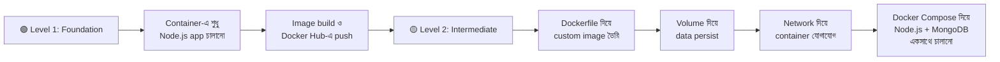
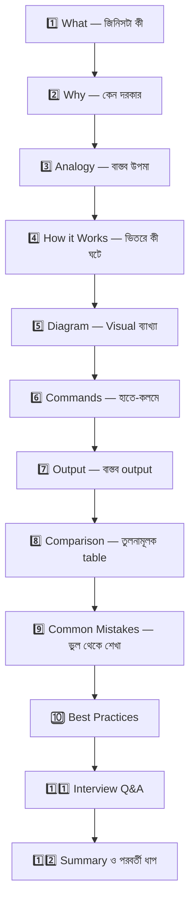

# 🐳 Docker — সম্পূর্ণ বাংলা গাইড

## এই ডকুমেন্টেশন কী? (What)

এটি Docker নিয়ে একটি **সম্পূর্ণ, গভীর, এবং ধারাবাহিক বাংলা ডকুমেন্টেশন**। এখানে আপনি একদম শূন্য থেকে শুরু করে production-ready Docker skills অর্জন করবেন। প্রতিটা concept-ই বাস্তব উদাহরণ, command, output, diagram, এবং best practices সহ ব্যাখ্যা করা হয়েছে।

এই ডকুমেন্টেশন শুধু "Docker কী" তা শেখায় না — এটা শেখায় **কেন Docker দরকার, ভিতরে কী ঘটছে, এবং বাস্তব প্রজেক্টে কীভাবে ব্যবহার করবেন।**

---

## কেন এই ডকুমেন্টেশন? (Why)

### সমস্যা যা আমরা সবাই ফেস করি

আপনি যদি কখনো এই পরিস্থিতিগুলোর মুখোমুখি হয়ে থাকেন, তাহলে এই ডকুমেন্টেশন আপনার জন্য:

```
❌ Docker ছাড়া (Before):
   - "আমার মেশিনে তো চলছে!" — কিন্তু সার্ভারে deploy করলে কাজ করে না
   - Node.js v18 লোকালে, সার্ভারে v14 — code ভাঙে
   - নতুন developer team-এ join করলে environment সেটআপে ২-৩ দিন চলে যায়
   - Python, Node.js, PostgreSQL, Redis সব আলাদা আলাদা install ও configure
   - "আমি Ubuntu ব্যবহার করি, তুমি Windows" — আলাদা setup guide দরকার
   - Production-এ একটু ভুল হলে পুরো সার্ভার ক্র্যাশ

✅ Docker দিয়ে (After):
   - সব জায়গায় exact same environment — laptop, staging, production
   - একটা command দিলেই পুরো application + database + cache চালু
   - নতুন developer? `docker compose up` — ব্যস, ৫ মিনিটে ready
   - OS independent — যেকোনো মেশিনে একইভাবে চলে
   - প্রতিটা service isolated — একটা ভাঙলে বাকিগুলো ঠিক থাকে
```

### বাংলায় গভীর Docker resource এর অভাব

ইংরেজিতে Docker এর resource প্রচুর আছে, কিন্তু বাংলায় গভীর, ধারাবাহিক, এবং production-oriented Docker ডকুমেন্টেশন খুবই কম। বেশিরভাগ বাংলা tutorial শুধু basic command শেখায়, কিন্তু **কেন সেই command কাজ করে, ভিতরে কী ঘটছে** — এটা ব্যাখ্যা করে না। এই ডকুমেন্টেশন সেই gap পূরণ করবে।

---

## কাদের জন্য? (Target Audience)

| আপনি কে | এখান থেকে কী পাবেন |
|---|---|
| **Junior Developer** | শূন্য থেকে Docker শিখবেন, ভয় কেটে যাবে |
| **Backend Developer** | আপনার app Docker-এ deploy করতে পারবেন |
| **DevOps শেখা শুরু করেছেন** | Containerization এর solid foundation তৈরি হবে |
| **Job Interview প্রস্তুতি** | প্রতিটা topic-এ interview questions ও answers আছে |
| **Team Lead / Senior** | নতুন team member-কে এই resource দিয়ে onboard করাতে পারবেন |

---

## পূর্বশর্ত (Prerequisites)

এই ডকুমেন্টেশন follow করার জন্য আপনার যা জানা থাকলে ভালো হয়:

- **Linux Terminal / Command Line** — basic commands (`cd`, `ls`, `mkdir`, `cat`) জানলেই যথেষ্ট
- **যেকোনো একটা programming language** — JavaScript (Node.js) বা Python হলে সবচেয়ে ভালো, কারণ আমাদের উদাহরণগুলো Node.js-ভিত্তিক
- **Web development এর basic ধারণা** — HTTP, API, server কী এসব বুঝলেই হবে
- **Git** — basic `git clone`, `git commit` জানলে চলবে

:::tip পূর্বশর্ত নিয়ে চিন্তা নেই
উপরের সবগুলো না জানলেও সমস্যা নেই। Docker শেখার পাশাপাশি এগুলোও ধীরে ধীরে শিখে ফেলবেন। আমরা প্রতিটা step এত বিস্তারিতভাবে ব্যাখ্যা করেছি যে একদম নতুনরাও follow করতে পারবে।
:::

---

## আমাদের ধারাবাহিক প্রজেক্ট: NexGen AI 🚀

পুরো ডকুমেন্টেশন জুড়ে আমরা **একটাই প্রজেক্ট** ধাপে ধাপে তৈরি করব — **NexGen AI**। এটি একটি Node.js + Express.js ভিত্তিক REST API, যেটার সাথে MongoDB database থাকবে।

### কেন একটাই প্রজেক্ট?

বেশিরভাগ tutorial প্রতিটা topic-এ নতুন নতুন উদাহরণ দেয়। ফলে পাঠক বুঝতে পারে না পুরো জিনিসটা কীভাবে একসাথে কাজ করে। আমরা সেই ভুল করব না।

```
📁 nexgen-api/
├── package.json          # Node.js dependencies
├── server.js             # Express.js API server
├── routes/
│   └── ai.js             # AI-related API routes
├── models/
│   └── Prompt.js         # MongoDB model
├── .env                  # Environment variables
├── Dockerfile            # Docker image build instructions
├── .dockerignore         # Docker ignore file
└── docker-compose.yml    # Multi-container orchestration
```

### প্রজেক্টটি কীভাবে বড় হবে



:::info প্রজেক্ট Journey
**Level 1 (Foundation):** প্রথমে Docker কী, কেন, কীভাবে কাজ করে বুঝবেন। তারপর basic command শিখে existing image দিয়ে container চালাবেন।

**Level 2 (Intermediate):** নিজে Dockerfile লিখে NexGen AI এর custom image বানাবেন। Volume দিয়ে data save করবেন, Network দিয়ে container-এ container যোগাযোগ করাবেন, এবং সবশেষে Docker Compose দিয়ে পুরো multi-container application (Node.js + MongoDB) একটা command-এ চালাবেন।
:::

---

## ডকুমেন্টেশন Structure — কী কী শিখবেন

### 🟢 Level 1: Foundation — ভিত্তি তৈরি

এই level-এ Docker-এর মূল ধারণাগুলো শক্ত করবেন। কোনো shortcut নেই — foundation মজবুত না হলে বাকি সব ভেঙে পড়বে।

| # | Topic | কী শিখবেন |
|---|-------|-----------|
| 1 | **Containerization Fundamentals** | Virtual Machine vs Container, containerization কেন দরকার |
| 2 | **Docker Introduction** | Docker কী, কেন industry standard, Docker এর ইতিহাস |
| 3 | **Docker Architecture** | Docker Engine, Client-Server model, Docker Daemon, Registry |
| 4 | **Docker Installation** | Windows, Mac, Linux-এ Docker install করা |
| 5 | **Docker CLI Basics** | প্রথম Docker command, `docker run`, `docker ps` |
| 6 | **Working with Docker Images** | Image কী, layers, Docker Hub থেকে pull |
| 7 | **Docker Image Commands** | `pull`, `inspect`, `tag`, `rmi`, `history` |
| 8 | **Running Containers** | Container চালানো, foreground vs background, naming |
| 9 | **Container Lifecycle** | Created → Running → Paused → Stopped → Deleted |
| 10 | **Container Management** | `start`, `stop`, `restart`, `rm`, `prune` |
| 11 | **Container Interaction** | `exec`, `attach`, `cp` — container-এর ভিতরে ঢোকা |
| 12 | **Port Mapping** | Host ↔ Container port forwarding, `-p` flag |
| 13 | **Environment Variables** | `--env`, `.env` file, config management |
| 14 | **Docker Hub** | Image push/pull, public/private repo, tags |

### 🟡 Level 2: Intermediate — দক্ষতা বাড়ানো

Foundation শক্ত হলে এখন আসল কাজ শুরু — নিজের image বানানো, data manage করা, networking, এবং multi-container orchestration।

| # | Topic | কী শিখবেন |
|---|-------|-----------|
| 15 | **Dockerfile Basics** | Dockerfile কী, কেন, প্রথম Dockerfile লেখা |
| 16 | **Dockerfile Instructions (Part 1)** | `FROM`, `WORKDIR`, `COPY`, `RUN`, `CMD` |
| 17 | **Dockerfile Instructions (Part 2)** | `ENTRYPOINT`, `EXPOSE`, `ENV`, `ARG`, `LABEL` |
| 18 | **Building Images** | `docker build`, build context, caching, `.dockerignore` |
| 19 | **Multi-Stage Builds** | Image size optimization, production vs development builds |
| 20 | **Docker Volumes** | Data persistence, Named Volumes, Volume lifecycle |
| 21 | **Volume Commands** | `create`, `inspect`, `ls`, `rm`, `prune` |
| 22 | **Bind Mounts** | Host directory mount, development workflow |
| 23 | **Docker Networks** | Bridge, Host, None — container networking fundamentals |
| 24 | **Network Commands** | `create`, `connect`, `disconnect`, `inspect` |
| 25 | **Container Networking** | Container-to-container communication, DNS resolution |
| 26 | **Docker Compose Intro** | Compose কী, কেন, YAML basics |
| 27 | **Compose File Structure** | `services`, `volumes`, `networks`, `version` |
| 28 | **Compose Commands** | `up`, `down`, `build`, `logs`, `ps`, `exec` |
| 29 | **Compose Services** | Multi-service configuration, depends_on, healthcheck |
| 30 | **Compose Networks & Volumes** | Service discovery, shared volumes, external networks |
| 31 | **Compose Advanced** | Profiles, override files, environment management |
| 32 | **Container Logs** | `docker logs`, log drivers, debugging techniques |
| 33 | **Resource Management** | CPU/Memory limits, `docker stats`, resource optimization |

---

## এই ডকুমেন্টেশন কীভাবে পড়বেন

### 🔤 ক্রম অনুসরণ করুন

এই ডকুমেন্টেশন **sequential** — অর্থাৎ একটার পর একটা পড়ার জন্য ডিজাইন করা। Level 1 শেষ না করে Level 2 তে যাবেন না। প্রতিটা topic আগের topic-এর উপর নির্ভরশীল।

### ✋ Hands-on করুন

শুধু পড়লে হবে না। **প্রতিটা command নিজে চালান।** প্রতিটা Dockerfile নিজে লিখুন। Docker শেখার একমাত্র উপায় হলো **করা** (learning by doing)।

### 📝 Callout গুলো পড়ুন

আমরা বিভিন্ন ধরনের callout ব্যবহার করেছি গুরুত্বপূর্ণ তথ্য highlight করতে:

:::tip টিপস 💡
সময় বাঁচানোর কৌশল, শর্টকাট, বা ভালো practice — এই ধরনের তথ্য এখানে থাকবে।
:::

:::warning সতর্কতা ⚠️
এটা না জানলে সমস্যায় পড়তে পারেন — এমন তথ্য এখানে থাকবে।
:::

:::danger বিপদ 🚫
এটা করলে data loss, security breach, বা system crash হতে পারে — এমন critical সতর্কতা এখানে থাকবে।
:::

:::info তথ্য ℹ️
অতিরিক্ত context, ব্যাকগ্রাউন্ড তথ্য, বা রেফারেন্স এখানে থাকবে।
:::

---

## প্রতিটা Topic-এর Structure

প্রতিটা page-এ আপনি এই structure পাবেন, যাতে শেখাটা consistent এবং সম্পূর্ণ হয়:



---

## Development Environment প্রস্তুতি

পরবর্তী topic-গুলোতে Docker install করবেন, কিন্তু তার আগে নিশ্চিত করুন আপনার কাছে আছে:

| Tool | কেন দরকার | ন্যূনতম Version |
|------|-----------|----------------|
| **Code Editor** | Code ও Dockerfile লেখার জন্য | VS Code (recommended) |
| **Terminal** | Docker command চালানোর জন্য | যেকোনো terminal |
| **Git** | প্রজেক্ট clone ও version control | Git 2.x+ |
| **Node.js** | NexGen AI প্রজেক্ট locally test করতে | Node.js 18+ (Docker install এর পর এটা ছাড়াই চলবে!) |
| **Internet** | Docker image download, Docker Hub | Stable connection |

:::tip VS Code Extension
VS Code ব্যবহার করলে **Docker extension** (`ms-azuretools.vscode-docker`) install করুন। এটা Dockerfile syntax highlighting, container management, এবং image browsing-এর জন্য অসাধারণ কাজে দেয়।
:::

---

## Comparison: এই ডকুমেন্টেশন vs অন্যান্য Resource

| বৈশিষ্ট্য | সাধারণ Tutorial | এই ডকুমেন্টেশন |
|-----------|----------------|-----------------|
| **ভাষা** | ইংরেজি | সম্পূর্ণ বাংলা (technical terms ইংরেজি) |
| **গভীরতা** | Surface-level command শেখানো | কেন, কীভাবে কাজ করে — internal mechanism সহ |
| **উদাহরণ** | প্রতি topic-এ আলাদা random উদাহরণ | একটাই ধারাবাহিক প্রজেক্ট (NexGen AI) |
| **Diagram** | কদাচিৎ বা নেই | প্রতিটা complex topic-এ Mermaid diagram |
| **Interview** | আলাদা resource খুঁজতে হয় | প্রতিটা topic-এ interview Q&A built-in |
| **Best Practices** | সাধারণত বাদ পড়ে | প্রতিটা topic-এ industry best practices |
| **Mistakes** | শেখানো হয় না | Common mistakes ও সমাধান সহ |

---

## Interview Questions ও Answers

### ১. Docker কেন শিখব? একজন developer হিসেবে Docker আমার কী কাজে আসবে?

**উত্তর:** Docker developer হিসেবে আপনার ৩টা বড় সমস্যার সমাধান করে:

প্রথমত, **environment consistency** — "আমার মেশিনে চলছে" এই সমস্যা আর থাকে না, কারণ Docker container সব জায়গায় একই environment নিশ্চিত করে।

দ্বিতীয়ত, **isolation** — প্রতিটা application আলাদা container-এ চলে, তাই একটার dependency আরেকটাকে প্রভাবিত করে না। আপনি একই মেশিনে Node.js 18 আর Node.js 20 দুটোই চালাতে পারবেন conflict ছাড়া।

তৃতীয়ত, **deployment simplicity** — Docker image বানিয়ে ফেললে সেটা যেকোনো server-এ, cloud-এ, বা Kubernetes-এ deploy করা সহজ হয়ে যায়।

---

### ২. Docker ছাড়া কি DevOps বা Backend development করা সম্ভব?

**উত্তর:** সম্ভব, কিন্তু এখনকার industry-তে Docker ছাড়া চলা অত্যন্ত কঠিন। আজকের প্রায় সব CI/CD pipeline, cloud deployment (AWS ECS, Google Cloud Run, Azure Container Apps), এবং Kubernetes — সবকিছু container-based। Job posting-এ Docker এখন almost mandatory skill। তাই career growth-এর জন্য Docker শেখা অপরিহার্য।

---

### ৩. এই ডকুমেন্টেশন follow করলে আমি কতটুকু শিখতে পারব?

**উত্তর:** এই ডকুমেন্টেশন শেষ করার পর আপনি:
- যেকোনো application-এর জন্য Dockerfile লিখতে পারবেন
- Multi-container application Docker Compose দিয়ে orchestrate করতে পারবেন
- Docker networking ও volume management বুঝবেন
- Production-ready Docker best practices জানবেন
- Docker-related interview questions confidently answer করতে পারবেন

---

### ৪. Docker শিখতে কতদিন লাগবে?

**উত্তর:** আপনি যদি প্রতিদিন ১-২ ঘণ্টা করে practice করেন, তাহলে:
- **Level 1 (Foundation):** ১-২ সপ্তাহ — basic concepts ও commands
- **Level 2 (Intermediate):** ২-৩ সপ্তাহ — Dockerfile, Volume, Network, Compose

মোটামুটি **৪-৫ সপ্তাহে** আপনি confident Docker user হয়ে যাবেন। তবে মনে রাখবেন, Docker একটা practical skill — শুধু পড়লে শেখা হবে না, **নিজে হাতে করতে হবে।**

---

## Summary

| বিষয় | বিবরণ |
|-------|-------|
| **কী** | Docker নিয়ে সম্পূর্ণ বাংলা ডকুমেন্টেশন |
| **কার জন্য** | Junior থেকে Senior — যেকোনো Bangladeshi developer |
| **Levels** | Foundation (১৪ topics) → Intermediate (১৯ topics) |
| **প্রজেক্ট** | NexGen AI — Node.js + MongoDB REST API |
| **বিশেষত্ব** | গভীর ব্যাখ্যা, diagram, interview Q&A, best practices, common mistakes |
| **ভাষা** | বাংলা (technical terms ইংরেজি) |

---

## পরবর্তী ধাপ

এখন আপনি জানেন এই ডকুমেন্টেশন কী, কেন, এবং কীভাবে পড়বেন। পরবর্তী topic-এ আমরা **Containerization Fundamentals** নিয়ে কথা বলব — Docker বোঝার আগে containerization কী এবং কেন এটা modern software development-এ এত গুরুত্বপূর্ণ, সেটা শক্ত করে বুঝব।

চলুন শুরু করি! 🚀
