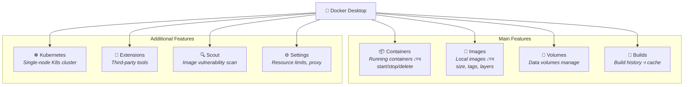

# ⚙️ Docker Installation

## Docker Installation কী? (What)

**Docker Installation** হলো আপনার machine-এ Docker software সেটআপ করার প্রক্রিয়া, যাতে আপনি container build, run, ও manage করতে পারেন। Operating System ভেদে installation প্রক্রিয়া কিছুটা আলাদা, কিন্তু install হয়ে গেলে Docker commands সব জায়গায় **একই**।

মূলত দুটো উপায়ে Docker install করা যায়:

| পদ্ধতি | কার জন্য | কী পাবেন |
|--------|----------|---------|
| **Docker Desktop** | Windows, macOS, Linux (GUI চাইলে) | GUI + CLI + Compose + Kubernetes |
| **Docker Engine (CLI only)** | Linux server, headless environment | শুধু CLI + Daemon (lightweight) |

---

## কেন সঠিকভাবে Install করা দরকার? (Why)

```
❌ ভুলভাবে install করলে:
   - "docker command not found" — PATH সেট হয়নি
   - "Cannot connect to Docker daemon" — Daemon চলছে না
   - Permission denied — user docker group-এ নেই (Linux)
   - WSL2 সমস্যা (Windows) — Virtualization enabled নয়
   - পুরোনো version install — নতুন features পাওয়া যাচ্ছে না

✅ সঠিকভাবে install করলে:
   - একটা command-এ Docker ready
   - সব OS-এ consistent experience
   - Docker Compose built-in (আলাদা install দরকার নেই)
   - VS Code Docker extension কাজ করে
   - NexGen AI প্রজেক্ট শুরু করার জন্য প্রস্তুত
```

---

## Analogy — রান্নাঘর প্রস্তুত করা 🍳

Docker install করা হলো **রান্নাঘর সেটআপ করার মতো**:
- **Docker Engine** = চুলা (stove) — এটা ছাড়া রান্না (container) চালানো সম্ভব না
- **Docker CLI** = রান্নার tools (হাতা, ছুরি) — এগুলো দিয়ে কাজ করবেন
- **Docker Desktop** = সম্পূর্ণ modular kitchen — চুলা + tools + oven + fridge সব একসাথে
- **Docker Compose** = recipe book — একসাথে অনেক dish (container) manage করার guide

আজ আমরা রান্নাঘর (Docker) সেটআপ করব, যাতে পরবর্তী topic থেকে আসল "রান্না" (container চালানো) শুরু করতে পারি।

---

## System Requirements — আপনার Machine কি Ready?

### Windows Requirements

| Requirement | বিবরণ |
|---|---|
| **OS Version** | Windows 10 (Build 19045+) বা Windows 11 |
| **Architecture** | 64-bit |
| **RAM** | ন্যূনতম 4 GB (8 GB+ recommended) |
| **Virtualization** | BIOS-এ Hardware Virtualization (VT-x/AMD-V) enabled থাকতে হবে |
| **WSL 2** | Windows Subsystem for Linux 2 installed থাকতে হবে |
| **Disk Space** | ন্যূনতম 20 GB free space |

### macOS Requirements

| Requirement | বিবরণ |
|---|---|
| **OS Version** | macOS 12 (Monterey) বা newer |
| **Architecture** | Apple Silicon (M1/M2/M3) বা Intel |
| **RAM** | ন্যূনতম 4 GB (8 GB+ recommended) |
| **Disk Space** | ন্যূনতম 20 GB free space |

### Linux Requirements

| Requirement | বিবরণ |
|---|---|
| **Distro** | Ubuntu 20.04+, Debian 11+, Fedora 38+, CentOS 9+ |
| **Architecture** | 64-bit (x86_64 / amd64, arm64) |
| **Kernel** | 3.10+ (5.x+ recommended) |
| **RAM** | ন্যূনতম 2 GB (4 GB+ recommended) |

:::warning Virtualization চেক করুন
Windows-এ Docker চালাতে হলে **Hardware Virtualization** enabled থাকা বাধ্যতামূলক। এটা BIOS/UEFI settings-এ enable করতে হয়। Task Manager → Performance → CPU tab-এ "Virtualization: Enabled" দেখা যাবে।
:::

---

## Installation Guide — Step by Step

## 🪟 Windows Installation

### ধাপ ১: WSL 2 Install করুন

WSL 2 (Windows Subsystem for Linux 2) হলো Windows-এর ভিতরে lightweight Linux kernel চালানোর ব্যবস্থা। Docker Desktop Windows-এ WSL 2-এর মাধ্যমে Linux containers চালায়।

PowerShell **Administrator হিসেবে** খুলে চালান:

```powershell
# WSL install করুন (এটা Ubuntu-ও install করে দেবে default হিসেবে)
wsl --install
```

:::tip একটা command-এই হয়ে যাবে
`wsl --install` command WSL 2 enable করে, Linux kernel install করে, এবং default হিসেবে Ubuntu distribution install করে — সব একটা command-এ। আগে এগুলো আলাদা আলাদা করতে হতো।
:::

**Output:**
```
Installing: Virtual Machine Platform
Installing: Windows Subsystem for Linux
Installing: Ubuntu
The requested operation is successful.
Changes will not be effective until the system is restarted.
```

```powershell
# Computer restart করুন
# Restart-এর পর WSL version চেক করুন:
wsl --list --verbose
```

**Output:**
```
  NAME      STATE           VERSION
* Ubuntu    Running         2        ← VERSION 2 দেখতে হবে
```

:::danger VERSION 1 দেখালে?
WSL version 1 দেখালে Docker Desktop ঠিকমতো কাজ করবে না। Version 2 তে upgrade করুন:
```powershell
wsl --set-default-version 2
wsl --set-version Ubuntu 2
```
:::

### ধাপ ২: Docker Desktop Download ও Install

1. [Docker Desktop for Windows](https://www.docker.com/products/docker-desktop/) page-এ যান
2. **"Download for Windows"** button click করুন
3. Downloaded `Docker Desktop Installer.exe` file run করুন
4. Installation wizard-এ:
   - ✅ "Use WSL 2 instead of Hyper-V" — **চেক করুন**
   - ✅ "Add shortcut to desktop" — ঐচ্ছিক
5. **Install** click করুন
6. Installation শেষে **"Close and restart"** click করুন

### ধাপ ৩: Docker Desktop চালু ও Verify

```powershell
# Computer restart-এর পর Docker Desktop চালু করুন (Start Menu থেকে)
# Docker icon system tray-তে দেখা যাবে (🐳)

# Terminal খুলুন এবং verify করুন:
docker --version
```

**Output:**
```
Docker version 27.1.1, build 6312585
```

```powershell
# Docker Compose version চেক:
docker compose version
```

**Output:**
```
Docker Compose version v2.29.1
```

```powershell
# সম্পূর্ণ Docker info দেখুন:
docker info
```

**Output (সংক্ষিপ্ত):**
```
Client:
 Version:    27.1.1
 Context:    default

Server:
 Containers: 0
  Running: 0
  Paused: 0
  Stopped: 0
 Images: 0
 Server Version: 27.1.1
 Storage Driver: overlay2
 Operating System: Docker Desktop
 OSType: linux
 Architecture: x86_64
```

---

## 🍎 macOS Installation

### ধাপ ১: Docker Desktop Download

1. [Docker Desktop for Mac](https://www.docker.com/products/docker-desktop/) page-এ যান
2. আপনার chip অনুযায়ী download করুন:
   - **Apple Silicon (M1/M2/M3/M4)** — "Download for Mac - Apple Silicon"
   - **Intel** — "Download for Mac - Intel Chip"

:::warning সঠিক version download করুন
Apple Silicon (M1/M2/M3) chip-এ Intel version install করলে Rosetta 2 emulation-এ চলবে — performance খারাপ হবে। Terminal-এ `uname -m` command দিয়ে chip type জানতে পারবেন: `arm64` = Apple Silicon, `x86_64` = Intel।
:::

### ধাপ ২: Install

```bash
# Downloaded .dmg file open করুন
# Docker icon-কে Applications folder-এ drag করুন
# Applications থেকে Docker চালু করুন
# macOS permission dialog-এ "OK" দিন
```

### ধাপ ৩: Verify

```bash
# Terminal খুলুন:
docker --version
```

**Output:**
```
Docker version 27.1.1, build 6312585
```

```bash
docker compose version
```

**Output:**
```
Docker Compose version v2.29.1
```

---

## 🐧 Linux Installation (Ubuntu/Debian)

Linux-এ Docker Desktop ব্যবহার করতে পারেন, তবে বেশিরভাগ Linux user **Docker Engine (CLI only)** install করে — এটা lightweight এবং server-friendly।

### ধাপ ১: পুরোনো Docker version remove করুন (যদি থাকে)

```bash
# পুরোনো বা unofficial Docker packages remove করুন
# এটা নিরাপদ — যদি installed না থাকে তাহলে "not installed" বলবে
sudo apt-get remove docker docker-engine docker.io containerd runc
```

**Output (যদি আগে install না থাকে):**
```
Reading package lists... Done
E: Unable to locate package docker-engine
```

### ধাপ ২: Docker Repository সেটআপ

```bash
# প্রয়োজনীয় packages install করুন
sudo apt-get update
sudo apt-get install ca-certificates curl gnupg
```

```bash
# Docker-এর official GPG key যোগ করুন
# GPG key হলো package-এর authenticity verify করার digital signature
sudo install -m 0755 -d /etc/apt/keyrings
curl -fsSL https://download.docker.com/linux/ubuntu/gpg | sudo gpg --dearmor -o /etc/apt/keyrings/docker.gpg
sudo chmod a+r /etc/apt/keyrings/docker.gpg
```

```bash
# Docker repository যোগ করুন apt sources-এ
echo \
  "deb [arch=$(dpkg --print-architecture) signed-by=/etc/apt/keyrings/docker.gpg] https://download.docker.com/linux/ubuntu \
  $(. /etc/os-release && echo "$VERSION_CODENAME") stable" | \
  sudo tee /etc/apt/sources.list.d/docker.list > /dev/null
```

### ধাপ ৩: Docker Engine Install

```bash
# Package index update করুন
sudo apt-get update

# Docker Engine, CLI, Compose plugin, containerd install করুন
sudo apt-get install docker-ce docker-ce-cli containerd.io docker-buildx-plugin docker-compose-plugin
```

**প্রতিটা package কী করে:**

| Package | কাজ |
|---------|------|
| `docker-ce` | Docker Engine (Community Edition) — Daemon |
| `docker-ce-cli` | Docker CLI — command line tool |
| `containerd.io` | containerd — container runtime |
| `docker-buildx-plugin` | BuildX — advanced image building |
| `docker-compose-plugin` | Docker Compose — multi-container orchestration |

### ধাপ ৪: sudo ছাড়া Docker ব্যবহার করুন

By default, Linux-এ Docker command চালাতে `sudo` দরকার হয়। এটা প্রতিবার দেওয়া বিরক্তিকর। `docker` group-এ আপনার user-কে যোগ করলে `sudo` ছাড়াই Docker ব্যবহার করতে পারবেন।

```bash
# docker group তৈরি করুন (ইতিমধ্যে থাকতে পারে)
sudo groupadd docker

# আপনার user-কে docker group-এ যোগ করুন
sudo usermod -aG docker $USER

# Group পরিবর্তন apply করতে logout ও login করুন
# অথবা এই command দিন:
newgrp docker
```

**Output (verify):**
```bash
# sudo ছাড়া test করুন:
docker run hello-world
```

:::danger Security সতর্কতা
`docker` group-এর member-রা root-equivalent access পায় — কারণ Docker Daemon root হিসেবে চলে। শুধু trusted user-দেরকে docker group-এ যোগ করুন। Production server-এ সাবধানে ব্যবহার করুন।
:::

### ধাপ ৫: Docker Daemon auto-start করুন

```bash
# Docker service enable করুন (boot-এ automatically start হবে)
sudo systemctl enable docker.service
sudo systemctl enable containerd.service

# Docker service চালু করুন
sudo systemctl start docker
```

### ধাপ ৬: Verify

```bash
docker --version
```

**Output:**
```
Docker version 27.1.1, build 6312585
```

```bash
docker compose version
```

**Output:**
```
Docker Compose version v2.29.1
```

---

## 🧪 Installation Verify — প্রথম Docker Command!

Docker সঠিকভাবে install হয়েছে কিনা verify করতে আমরা একটি special "hello-world" container চালাব। এটা Docker-এর official test image।

```bash
docker run hello-world
```

**এটা কী করে:**
1. Docker locally `hello-world` image খোঁজে → পায় না
2. Docker Hub থেকে `hello-world` image pull করে (download)
3. সেই image থেকে একটি container তৈরি ও run করে
4. Container একটি message print করে ও exit করে

**Output:**
```
Unable to find image 'hello-world:latest' locally
latest: Pulling from library/hello-world
c1ec31eb5944: Pull complete
Digest: sha256:d211f485f2dd1dee407a80973c8f129f00d54604d2c90732e8e320e5038a0348
Status: Downloaded newer image for hello-world:latest

Hello from Docker!
This message shows that your installation appears to be working correctly.

To generate this message, Docker took the following steps:
 1. The Docker client contacted the Docker daemon.
 2. The Docker daemon pulled the "hello-world" image from the Docker Hub.
    (amd64)
 3. The Docker daemon created a new container from that image which runs the
    executable that produces the output you are currently reading.
 4. The Docker daemon streamed that output to the Docker client, which sent it
    to your terminal.

To try something more adventurous, you can run an Ubuntu container with:
 $ docker run -it ubuntu bash

Share images, automate workflows, and more with a free Docker ID:
 https://hub.docker.com/

For more examples and ideas, visit:
 https://docs.docker.com/get-started/
```

:::tip "Hello from Docker!" দেখলে সফল! 🎉
এই message দেখলে মানে আপনার Docker installation সম্পূর্ণ সফল — CLI, Daemon, containerd, networking, এবং Docker Hub connectivity — সব ঠিকঠাক কাজ করছে।
:::

---

## আরো কিছু Verify Command

```bash
# Docker Engine, CLI, containerd-এর সম্পূর্ণ version info
docker version
```

**Output:**
```
Client:
 Version:           27.1.1
 API version:       1.46
 Go version:        go1.21.12
 Git commit:        6312585
 Built:             Tue Jun 18 15:45:51 2024
 OS/Arch:           linux/amd64

Server: Docker Engine - Community
 Engine:
  Version:          27.1.1
  API version:      1.46 (minimum version 1.24)
  Go version:       go1.21.12
  Git commit:       cc13f95
  Built:            Tue Jun 18 15:45:51 2024
  OS/Arch:          linux/amd64
 containerd:
  Version:          1.7.19
 runc:
  Version:          1.1.13
 docker-init:
  Version:          0.19.0
```

```bash
# সিস্টেমের সম্পূর্ণ Docker info
docker info | head -20
```

```bash
# আরেকটা test — Ubuntu container চালিয়ে দেখুন
docker run -it ubuntu cat /etc/os-release
```

**Output:**
```
PRETTY_NAME="Ubuntu 24.04 LTS"
NAME="Ubuntu"
VERSION_ID="24.04"
VERSION="24.04 LTS (Noble Numbat)"
```

---

## Docker Desktop Tour — কী কী আছে?

Docker Desktop install করলে আপনি একটি GUI application পাবেন। এটা দিয়ে CLI ছাড়াও অনেক কিছু করা যায়:



### Docker Desktop Settings — গুরুত্বপূর্ণ সেটিংস

Docker Desktop → Settings (⚙️) এ কিছু গুরুত্বপূর্ণ সেটিংস:

| Setting | Default | Recommendation | কেন |
|---------|---------|---------------|------|
| **CPUs** | অর্ধেক | 2-4 cores | বেশি দিলে host slow হতে পারে |
| **Memory** | 2 GB | 4-8 GB | Database container-এ বেশি memory দরকার |
| **Disk image size** | 64 GB | 64-100 GB | Images ও volumes-এর জন্য |
| **Start Docker Desktop when you sign in** | ON | ON | Docker সবসময় ready থাকবে |
| **Use WSL 2 based engine** (Windows) | ON | ON | Hyper-V-এর চেয়ে ভালো performance |

:::tip Resource Allocation
শুরুতে default settings-ই যথেষ্ট। পরে যখন NexGen AI + PostgreSQL একসাথে চালাবেন, তখন Memory 4 GB+ করতে পারেন। খুব বেশি resource Docker-কে দিলে আপনার host machine (browser, editor) ধীর হয়ে যাবে।
:::

---

## VS Code Docker Extension Setup

VS Code ব্যবহার করলে Docker extension install করা highly recommended:

```bash
# VS Code terminal থেকে install:
code --install-extension ms-azuretools.vscode-docker
```

**Extension কী কী করে:**

| Feature | বিবরণ |
|---------|-------|
| **Dockerfile syntax** | Dockerfile-এ syntax highlighting ও auto-complete |
| **Compose syntax** | docker-compose.yml-এ IntelliSense |
| **Container explorer** | Sidebar থেকে container দেখা, start/stop/delete |
| **Image explorer** | Local images দেখা, tag, push |
| **Log viewer** | Container logs GUI-তে দেখা |
| **Shell access** | Container-এ terminal attach করা |

---

## Comparison Table — Installation পদ্ধতি

| বৈশিষ্ট্য | Docker Desktop (Win/Mac) | Docker Desktop (Linux) | Docker Engine (Linux CLI) |
|-----------|------------------------|----------------------|--------------------------|
| **GUI** | ✅ হ্যাঁ | ✅ হ্যাঁ | ❌ না |
| **CLI** | ✅ হ্যাঁ | ✅ হ্যাঁ | ✅ হ্যাঁ |
| **Compose** | ✅ Built-in | ✅ Built-in | ✅ Plugin হিসেবে |
| **Kubernetes** | ✅ Built-in | ✅ Built-in | ❌ আলাদা install |
| **Auto-update** | ✅ হ্যাঁ | ✅ হ্যাঁ | ❌ Manual |
| **Resource GUI** | ✅ CPU/RAM set | ✅ CPU/RAM set | ❌ Config file |
| **দাম** | Free (small teams) | Free (small teams) | সম্পূর্ণ Free |
| **Production** | ❌ Dev only | ❌ Dev only | ✅ Production ready |
| **Performance** | VM overhead আছে | Native-like | Native performance |

---

## Troubleshooting — সাধারণ সমস্যা ও সমাধান

### ১. "Docker daemon is not running"

```bash
# Error:
# Cannot connect to the Docker daemon at unix:///var/run/docker.sock.
# Is the docker daemon running?

# সমাধান (Linux):
sudo systemctl start docker

# সমাধান (Windows/Mac):
# Docker Desktop application চালু করুন
```

### ২. "Permission denied" (Linux)

```bash
# Error:
# Got permission denied while trying to connect to the Docker daemon socket

# সমাধান:
sudo usermod -aG docker $USER
newgrp docker
# অথবা logout করে আবার login করুন
```

### ৩. "WSL 2 installation is incomplete" (Windows)

```powershell
# Error:
# WSL 2 installation is incomplete

# সমাধান:
wsl --update
# Computer restart করুন
```

### ৪. "Virtualization must be enabled" (Windows)

```
# Error:
# Hardware assisted virtualization and data execution protection
# must be enabled in the BIOS

# সমাধান:
# 1. Computer restart করুন
# 2. BIOS/UEFI settings-এ ঢুকুন (usually F2, F10, DEL key)
# 3. "Intel VT-x" বা "AMD-V" / "SVM Mode" enable করুন
# 4. Save ও restart করুন
```

### ৫. Docker Desktop slow (Windows/Mac)

```
# সমাধান:
# Docker Desktop → Settings → Resources
# - Memory: 4 GB (বাড়ান)
# - CPUs: 2+ (বাড়ান)
# - Disk image size: 64 GB+ (বাড়ান)

# Unused resources পরিষ্কার করুন:
docker system prune -a
```

---

## Common Mistakes — নতুনদের সাধারণ ভুল

### ১. Docker Desktop install না করে শুধু Docker CLI install করা (Windows/Mac)
❌ **ভুল:** Windows/Mac-এ `brew install docker` বা `choco install docker-cli` দিয়ে শুধু CLI install করা।
✅ **সঠিক:** Windows/Mac-এ Docker Desktop install করুন — এটা CLI, Daemon, Compose, এবং VM (Linux kernel চালানোর জন্য) সব একসাথে দেয়। শুধু CLI install করলে Daemon থাকবে না, তাই কোনো command কাজ করবে না।

### ২. Docker Desktop চালু না করে command দেওয়া
❌ **ভুল:** Docker Desktop বন্ধ রেখে terminal-এ `docker run` দেওয়া।
✅ **সঠিক:** Docker Desktop চালু আছে কিনা দেখুন — system tray-তে 🐳 icon দেখা যাচ্ছে কিনা। Docker Desktop চালু না থাকলে Daemon চলবে না, ফলে কোনো docker command কাজ করবে না।

### ৩. Linux-এ sudo ছাড়া Docker চালানোর চেষ্টা (group add না করে)
❌ **ভুল:** `docker ps` দিলে "permission denied" — হতাশ হয়ে `sudo` দিয়ে সব command চালানো।
✅ **সঠিক:** একবার `sudo usermod -aG docker $USER` করে logout/login করলে এরপর থেকে আর কখনো `sudo` দরকার হবে না।

### ৪. পুরোনো Docker version ব্যবহার করা
❌ **ভুল:** Ubuntu-এর default repository থেকে `sudo apt install docker.io` — এটা অনেক পুরোনো version দেয়।
✅ **সঠিক:** Docker-এর official repository (`download.docker.com`) থেকে install করুন — সবসময় latest stable version পাবেন।

---

## Best Practices

1. **Docker Desktop সবসময় update রাখুন** — Security patches ও নতুন features পেতে auto-update চালু রাখুন। Docker Desktop → Settings → Software Updates → "Always download updates" enable করুন।

2. **Docker system prune নিয়মিত করুন** — Docker ব্যবহার করতে করতে unused images, containers, ও build cache জমে disk ভরে যায়:
   ```bash
   # সব unused resources মুছুন (confirmation চাইবে)
   docker system prune -a
   
   # কতটুকু space ব্যবহার হচ্ছে দেখুন
   docker system df
   ```

3. **Resource limits ঠিক করুন** — Docker Desktop-এ আপনার machine-এর অর্ধেক RAM ও CPU দেওয়া উচিত, বেশি নয়। নাহলে host machine ধীর হবে।

4. **VS Code Docker extension ব্যবহার করুন** — GUI-তে container ও image manage করা সহজ, এবং Dockerfile/Compose file লেখার সময় IntelliSense পাবেন।

5. **Firewall/Antivirus-এ Docker allow করুন** — কিছু antivirus Docker-এর network traffic block করে। Docker Desktop ও Docker processes-কে whitelist করুন।

---

## Interview Questions ও Answers

### ১. Docker Desktop আর Docker Engine এর মধ্যে পার্থক্য কী?

**উত্তর:** **Docker Engine** হলো Docker-এর core — Docker Daemon (dockerd), containerd, runc, এবং CLI নিয়ে গঠিত। এটা সম্পূর্ণ free, open-source, এবং শুধু Linux-এ native ভাবে চলে। Production server-এ এটাই ব্যবহৃত হয়।

**Docker Desktop** হলো Docker Engine-এর উপর built একটি complete application যেটা Windows, macOS, ও Linux-এ GUI সহ Docker ব্যবহার করতে দেয়। এটা Docker Engine-এর সাথে Compose, Kubernetes, Extensions, Docker Scout, ও resource management GUI দেয়। ছোট কোম্পানি ও ব্যক্তিগত ব্যবহারের জন্য free, বড় কোম্পানির জন্য paid subscription model আছে।

---

### ২. Windows-এ Docker কীভাবে Linux container চালায়?

**উত্তর:** Windows-এ Docker **WSL 2 (Windows Subsystem for Linux 2)** ব্যবহার করে Linux container চালায়। WSL 2 হলো Windows-এর ভিতরে একটি lightweight virtual machine যা real Linux kernel চালায়। Docker Daemon এই WSL 2 environment-এ চলে, তাই Linux containers native-like performance-এ চলতে পারে।

আগে Docker Windows-এ **Hyper-V** VM ব্যবহার করতো, যেটা ভারী ও ধীর ছিলো। WSL 2 অনেক lightweight, দ্রুত, এবং Windows-এর সাথে ভালোভাবে integrated।

---

### ৩. Docker install করার পর কীভাবে verify করবেন যে সব ঠিক আছে?

**উত্তর:** তিনটি ধাপে verify করতে পারি:

**প্রথমত**, `docker --version` দিয়ে CLI সঠিকভাবে install হয়েছে কিনা দেখি।

**দ্বিতীয়ত**, `docker info` দিয়ে Daemon চলছে কিনা এবং Server details (storage driver, OS, architecture) সঠিক কিনা দেখি।

**তৃতীয়ত**, `docker run hello-world` দিয়ে সম্পূর্ণ pipeline test করি — CLI → Daemon → Docker Hub → image pull → container run। "Hello from Docker!" message দেখলে সব ঠিক আছে — networking, registry connectivity, container runtime সব কাজ করছে।

---

### ৪. Linux-এ Docker install করার পর "permission denied" error আসলে কী করবেন?

**উত্তর:** এই error আসে কারণ Docker Daemon root হিসেবে চলে এবং Docker socket (`/var/run/docker.sock`) root-owned। সমাধান হলো current user-কে `docker` group-এ যোগ করা:

```bash
sudo usermod -aG docker $USER
```

তারপর logout করে আবার login করতে হবে যাতে group membership effective হয়। এরপর `sudo` ছাড়াই Docker commands চলবে।

তবে মনে রাখতে হবে, `docker` group-এর member-রা effective root access পায়, তাই production server-এ সাবধানে ব্যবহার করা উচিত।

---

## Summary

| বিষয় | বিবরণ |
|-------|-------|
| **Windows** | WSL 2 install → Docker Desktop install → verify |
| **macOS** | Docker Desktop download (chip অনুযায়ী) → install → verify |
| **Linux** | Official repo add → Docker Engine install → docker group → verify |
| **Verify** | `docker --version`, `docker info`, `docker run hello-world` |
| **Docker Desktop** | GUI + CLI + Compose + K8s — developer workstation-এর জন্য |
| **Docker Engine** | CLI only — lightweight, production server-এর জন্য |
| **Troubleshooting** | Daemon not running, permission denied, WSL 2 issue, virtualization |

---

## পরবর্তী ধাপ

🎉 **অভিনন্দন!** আপনার machine-এ Docker install ও verify হয়ে গেছে। আপনি ইতিমধ্যে প্রথম container (`hello-world`) চালিয়ে ফেলেছেন! পরবর্তী topic-এ আমরা **Docker CLI Basics** শিখব — Docker-এর সবচেয়ে বেশি ব্যবহৃত commands, কীভাবে help দেখবেন, এবং Docker CLI-র structure বুঝব। এখান থেকেই আসল hands-on শুরু!
