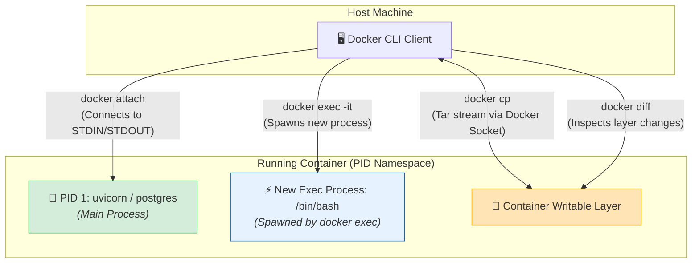
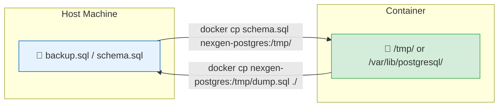

# 🔌 Container Interaction

## Container Interaction কী? (What)

**Container Interaction** হলো একটি সক্রিয় ও চলমান (Running) ডকার কন্টেইনারের ভেতরের পরিবেশের সাথে হোস্ট মেশিন থেকে সরাসরি যোগাযোগ, ডিবাগিং এবং ফাইল আদান-প্রদান করার কৌশল।

এর মাধ্যমে আপনি:
- কন্টেইনার বন্ধ না করেই তার ভেতরে নতুন কোনো কমান্ড চালাতে পারেন (`docker exec`)
- কন্টেইনারের মূল টার্মিনাল কনসোলে যুক্ত হতে পারেন (`docker attach`)
- হোস্ট মেশিন এবং কন্টেইনারের মধ্যে ফাইল ও ফোল্ডার কপি করতে পারেন (`docker cp`)
- কন্টেইনারের ফাইলসিস্টেমে কী কী নতুন ফাইল তৈরি বা পরিবর্তিত হয়েছে তা দেখতে পারেন (`docker diff`)

:::info ইন্টারঅ্যাকশনের প্রয়োজনীয়তা
কন্টেইনার কোনো ব্ল্যাক বক্স নয়। প্রোডাকশনে বা লোকাল ডেভেলপমেন্টে ডাটাবেজে ঢুকে সরাসরি SQL কুয়েরি চালানো, কনফিগ ফাইল চেক করা, বা বাগ ডিবাগ করার জন্য এই কমান্ডগুলো একজন ইঞ্জিনিয়ারের প্রতিদিনের হাতিয়ার।
:::

---

## কেন Container Interaction শেখা জরুরি? (Why)

```
❌ ইন্টারঅ্যাকশন কমান্ড না জানলে (Before):
   - ডাটাবেজের টেবিল চেক করতে পুরো কন্টেইনার থামিয়ে নতুন করে রান করতে হতো
   - কন্টেইনারের ভেতরে ফাইল কপি করতে SSH সার্ভার বা FTP ইনস্টল করার মতো বাজে ভুল করা হতো
   - কন্টেইনারের মূল প্রসেস বন্ধ না করে ভেতরে ঢুকে এনভায়রনমেন্ট ভেরিয়েবল চেক করা যেত না
   - `Ctrl+C` চেপে ভুলে প্রোডাকশন কন্টেইনার ক্র্যাশ করিয়ে দেওয়া হতো

✅ ইন্টারঅ্যাকশন কমান্ড আয়ত্তে থাকলে (After):
   - `docker exec -it` দিয়ে নিমেষে PostgreSQL বা FastAPI কন্টেইনারের শেলের ভেতর ঢোকা যায়
   - `docker cp` দিয়ে কোনো SSH ছাড়া সেকেন্ডের মধ্যে ডাটাবেজ ব্যাকআপ (.sql) ফাইলে ডাম্প করা যায়
   - `docker diff` দিয়ে দেখা যায় অ্যাপ্লিকেশনের কোন অংশ অতিরিক্ত ক্যাশ ফাইল তৈরি করছে
   - কন্টেইনারকে সম্পূর্ণ বিচ্ছিন্ন রেখেও নিরাপদে সমস্ত অ্যাডমিন টাস্ক সম্পন্ন করা যায়
```

---

## Analogy — স্পেসশিপ ও ল্যাপারোস্কোপিক সার্জারির উপমা 🚀🔬

Container Interaction-কে একটি **মহাকাশ স্টেশন বা ল্যাপারোস্কোপিক সার্জারি**-র সাথে তুলনা করা যায়:

- **Docker Container** = একটি সম্পূর্ণ সিল করা মহাকাশ স্টেশন (Sealed Spaceship)।
- **`docker exec`** = মহাকাশ স্টেশনের মেইন হ্যাচ না খুলে একটি আলাদা প্রবেশদ্বার দিয়ে একজন রোবট বা ইঞ্জিনিয়ার ভেতরে পাঠিয়ে লাইভ কাজ করানো। (মূল পাইলট অক্ষত থাকে)।
- **`docker attach`** = মূল পাইলটের চেয়ারের পেছনে গিয়ে তার স্ক্রিন সরাসরি দেখা। (পাইলটকে ধাক্কা দিলে পুরো স্পেসশিপ ক্র্যাশ করবে!)
- **`docker cp`** = এয়ারলক (Airlock) দিয়ে ভেতর থেকে নমুনা বাইরে আনা বা বাইরে থেকে খাবার ভেতরে পাঠানো।
- **`docker diff`** = স্পেসশিপে ওঠার পর কোন কোন কার্গো পরিবর্তন হয়েছে তার এক্স-রে স্ক্যান।

---

## How it Works — Interaction Architecture



---

## Hands-on: প্রয়োজনীয় সমস্ত Interaction Commands

আমাদের **NexGen AI** প্রজেক্টের ব্যাকএন্ড (FastAPI) এবং ডাটাবেজ (PostgreSQL) ধরে কমান্ডগুলো বাস্তবে অনুশীলন করি।

ধরে নিই আমাদের ডাটাবেজ কন্টেইনারটি ব্যাকগ্রাউন্ডে চলছে:
```bash
docker container run -d \
  --name nexgen-postgres \
  -e POSTGRES_DB=nexgendb \
  -e POSTGRES_USER=postgres \
  -e POSTGRES_PASSWORD=secretpassword \
  -p 5432:5432 \
  postgres:16-alpine
```

---

### ১. কন্টেইনারের ভেতরে নতুন কমান্ড চালানো (`docker container exec`)

`docker exec` হলো সবচেয়ে বেশি ব্যবহৃত কমান্ড। এটি কন্টেইনারের চলমান PID 1 প্রসেসকে বিরক্ত না করে একটি **নতুন সাব-প্রসেস** হিসেবে কন্টেইনারের ভেতরে ঢুকে কাজ করে।

#### ক. ভেতরে না ঢুকেই এক লাইনে কমান্ড চালানো:
```bash
# কন্টেইনারের ওএস রিলিজ ভার্সন দেখা
docker container exec nexgen-postgres cat /etc/os-release
```

**বাস্তব Output:**
```text
NAME="Alpine Linux"
ID=alpine
VERSION_ID=3.20.1
PRETTY_NAME="Alpine Linux v3.20"
```

#### খ. সরাসরি ইন্টারঅ্যাক্টিভ PostgreSQL CLI (`psql`) এ প্রবেশ:
```bash
# কন্টেইনারের ভেতরে psql ক্লায়েন্ট ওপেন করি
docker container exec -it nexgen-postgres psql -U postgres -d nexgendb
```

**বাস্তব Output (PostgreSQL Interactive Prompt):**
```sql
psql (16.3)
Type "help" for help.

nexgendb=# CREATE TABLE prompts (id SERIAL PRIMARY KEY, prompt_text TEXT, created_at TIMESTAMP DEFAULT CURRENT_TIMESTAMP);
CREATE TABLE
nexgendb=# INSERT INTO prompts (prompt_text) VALUES ('Explain Docker in Bangla');
INSERT 0 1
nexgendb=# SELECT * FROM prompts;
 id |       prompt_text        |         created_at         
----+--------------------------+----------------------------
  1 | Explain Docker in Bangla | 2024-07-24 11:15:32.123456
(1 row)

nexgendb=# \q
```
*(দেখলেন কত সহজে কন্টেইনারের ডাটাবেজে ঢুকে টেবিল বানিয়ে ডাটা ইনসার্ট করা গেল!)*

#### গ. কন্টেইনারের ব্যাশ বা শেল-এ লগইন করা:
```bash
# Alpine বেসড ইমেজে bash থাকে না, তাই sh দিতে হয়
docker container exec -it nexgen-postgres sh
```

**কন্টেইনারের ভেতরের প্রম্পট:**
```text
/ # whoami
postgres
/ # df -h
Filesystem                Size      Used Available Use% Mounted on
overlay                  58.4G     12.3G     43.1G  22% /
/ # exit
```

:::tip Root ইউজার হিসেবে প্রবেশ করা (`-u 0` / `--user root`)
অনেক ইমেজে ডিফল্ট নন-রুট ইউজার থাকে। কোনো প্যাকেজ ইনস্টল বা পারমিশন ফিক্স করতে রুট হিসেবে ঢুকতে চাইলে:
```bash
docker container exec -it -u 0 nexgen-postgres sh
```
:::

---

### ২. ফাইল আদান-প্রদান করা (`docker container cp`)

হোস্ট মেশিন এবং কন্টেইনারের মধ্যে ফাইল বা ফোল্ডার কপি করার জন্য `docker cp` ব্যবহৃত হয়। কন্টেইনারটি **চালু বা বন্ধ — যেকোনো অবস্থাতেই** এটি কাজ করে এবং এর জন্য কোনো SSH বা নেটওয়ার্ক কনফিগারেশনের প্রয়োজন হয় না!



#### ক. হোস্ট থেকে কন্টেইনারের ভেতরে ফাইল কপি করা:
ধরি আমাদের হোস্টে একটি `schema.sql` ফাইল আছে:
```bash
# হোস্টের ফাইলকে কন্টেইনারের /tmp/ ফোল্ডারে কপি করি
docker container cp ./schema.sql nexgen-postgres:/tmp/schema.sql
```

#### খ. কন্টেইনারের ভেতর থেকে ফাইল হোস্টে নিয়ে আসা:
```bash
# কন্টেইনারের ভেতর থেকে ডাটাবেজ কনফিগ ফাইল হোস্টে কপি করা
docker container cp nexgen-postgres:/var/lib/postgresql/data/postgresql.conf ./my-postgres.conf
```

```bash
# চেক করি হোস্টে ফাইলটি এসেছে কিনা
ls -lh my-postgres.conf
# Output: -rw-r--r-- 1 user user 29K Jul 24 11:20 my-postgres.conf
```

:::tip ডাটাবেজ ব্যাকআপ নেওয়ার জাদু ট্রিক
`docker exec` এবং `docker cp` একসাথে পাইপ করে এক লাইনে পুরো ডাটাবেজ হোস্টে ব্যাকআপ নেওয়া যায়:
```bash
docker exec nexgen-postgres pg_dump -U postgres nexgendb > nexgendb_backup.sql
```
:::

---

### ৩. ফাইলসিস্টেম পরিবর্তন পর্যবেক্ষণ (`docker container diff`)

ইমেজ রান করার পর কন্টেইনারের Writable Layer-এ কী কী পরিবর্তন হয়েছে তা দেখার কমান্ড হলো `docker diff`।

```bash
docker container diff nexgen-postgres
```

**বাস্তব Output:**
```text
C /tmp
A /tmp/schema.sql
C /var
C /var/lib
C /var/lib/postgresql
C /var/lib/postgresql/data
A /var/lib/postgresql/data/base
A /var/lib/postgresql/data/global
```

**আউটপুট প্রিফিক্স এর অর্থ:**
- **`A` (Added)**: নতুন ফাইল বা ফোল্ডার তৈরি হয়েছে।
- **`C` (Changed)**: বিদ্যমান কোনো ফাইল বা ডিরেক্টরি মডিফাই করা হয়েছে।
- **`D` (Deleted)**: ইমেজ থেকে কোনো ফাইল মুছে ফেলা হয়েছে।

---

### ৪. কনসোলে যুক্ত হওয়া (`docker container attach`) ⚠️

`docker attach` কমান্ডটি কন্টেইনারের মূল **PID 1 প্রসেসের সাথে আপনার টার্মিনালকে সরাসরি জোড়া লাগিয়ে দেয়**।

```bash
# কন্টেইনারের কনসোলে সরাসরি অ্যাটাচ করা
docker container attach nexgen-postgres
```

:::danger মারাত্মক সতর্কতা (Ctrl+C বিপদ!)
`docker attach` অবস্থায় যদি আপনি টার্মিনাল বন্ধ করার জন্য **`Ctrl + C`** চাপেন, তাহলে সিগন্যালটি সরাসরি PID 1 প্রসেসে চলে যায় এবং **পুরো কন্টেইনারটি ক্র্যাশ করে বন্ধ হয়ে যায়!**
কন্টেইনারটি রানিং রেখেই আন-অ্যাটাচ হতে চাইলে অবশ্যই চাপুন:
**`Ctrl + P` এবং তারপর `Ctrl + Q`** (Detach Key Sequence)।
:::

---

## Comparison Table — `exec` বনাম `attach` বনাম `run`

| বৈশিষ্ট্য | `docker exec` | `docker attach` | `docker run` |
|---|---|---|---|
| **উদ্দেশ্য** | চলমান কন্টেইনারে নতুন কমান্ড চালানো | চলমান কন্টেইনারের মূল স্ক্রিন দেখা | নতুন কন্টেইনার তৈরি করে চালানো |
| **প্রসেস তৈরি** | ✅ হ্যাঁ (নতুন সাব-প্রসেস তৈরি করে) | ❌ না (PID 1 প্রসেসে যুক্ত হয়) | ✅ হ্যাঁ (সম্পূর্ণ নতুন PID 1 প্রসেস) |
| **কন্টেইনারের স্টেট** | কন্টেইনারকে অবশ্যই **Running** হতে হবে | কন্টেইনারকে অবশ্যই **Running** হতে হবে | নতুন কন্টেইনার জন্ম নেয় |
| **`Ctrl + C` চাপলে** | শুধুমাত্র ঐ সাব-শেল বন্ধ হয় | ⚠️ **পুরো কন্টেইনার বন্ধ হয়ে যায়!** | পুরো কন্টেইনার বন্ধ হয়ে যায় |
| **নিরাপত্তা** | ⭐⭐⭐⭐⭐ সম্পূর্ণ নিরাপদ ডিবাগিং | ⚠️ ঝুঁকিপূর্ণ | ⭐⭐⭐⭐⭐ নিরাপদ |

---

## Common Mistakes — নতুনদের সাধারণ ভুল

### ১. `docker attach` দিয়ে লগ দেখতে গিয়ে কন্টেইনার মেরে ফেলা
❌ **ভুল:** লগ দেখার জন্য `docker attach` চালিয়ে পরে বের হওয়ার জন্য `Ctrl+C` দিয়ে প্রোডাকশন সার্ভার বন্ধ করে দেওয়া।
✅ **সঠিক:** কন্টেইনারের লগ দেখার নিরাপদ কমান্ড হলো **`docker container logs -f <name>`** (আমরা এটি ডেডিকেটেড টপিকে শিখব), অথবা আন-অ্যাটাচ করতে `Ctrl+P, Ctrl+Q` চাপুন।

### ২. `exec` দিয়ে ফাইলে পরিবর্তন করে ভাবা যে এটি ইমেজে সেভ হয়ে গেছে
❌ **ভুল:** `docker exec` দিয়ে কন্টেইনারের ভেতরে কোড এডিট করা এবং কন্টেইনার রিস্টার্ট/রিক্রিয়েট করার পর কোড হারিয়ে ফেলা।
✅ **সঠিক:** কন্টেইনারের ভেতরে করা পরিবর্তন ক্ষণস্থায়ী। পার্মানেন্ট কোড পরিবর্তন করতে হলে ডকারফাইল আপডেট করে নতুন ইমেজ বিল্ড করতে হয় অথবা ভলিউম ব্যবহার করতে হয়।

### ৩. Alpine ইমেজে `bash` খোঁজা
❌ **ভুল:** `docker exec -it nexgen-postgres bash` দিয়ে এরর পাওয়া: `executable file not found in $PATH`.
✅ **সঠিক:** Alpine Linux এ ডিফল্টভাবে `bash` থাকে না, `sh` থাকে। তাই কমান্ড দিন: `docker exec -it nexgen-postgres sh`।

---

## Best Practices

1. **ডিবাগিংয়ের জন্য সবসময় `docker exec` ব্যবহার করুন**: এটি সবচেয়ে নিরাপদ এবং কোনোভাবেই মূল সার্ভারকে প্রভাবিত করে না।
2. **নন-রুট ইউজার কন্টেইনারে ট্রাবলশুটিং**: প্রোডাকশনে কন্টেইনার নন-রুট ইউজারে চললেও অ্যাডমিন কাজের জন্য `docker exec -u 0 -it <container> sh` দিয়ে রুট শেলের সুবিধা নিন।
3. **ক্লিনআপ স্ক্রিপ্ট চালান**: `docker cp` দিয়ে টেম্পোরারি ফাইল ইনজেক্ট করার পর কাজ শেষে কন্টেইনারের `/tmp` থেকে ফাইল মুছে দিন।
4. **`docker diff` দিয়ে ফাইল বৃদ্ধি মনিটর করুন**: অ্যাপ্লিকেশন কোনো মেমরি লিক বা অতিরিক্ত টেম্প ফাইল বানাচ্ছে কিনা তা জানতে নিয়মিত `docker diff` চেক করুন।

---

## Interview Questions ও Answers

### ১. `docker exec` এবং `docker attach` এর মধ্যে মূল প্রযুক্তিগত পার্থক্য কী?

**উত্তর:** 
- **`docker exec`**: এটি একটি চলমান কন্টেইনারের বিদ্যমান নেমস্পেস এবং cgroups বাউন্ডারির ভেতরে একটি সম্পূর্ণ **নতুন প্রসেস (New Sub-process)** স্পন করে। ফলে এটি এক্সিট করলে বা `Ctrl+C` দিলে শুধুমাত্র ঐ সাব-প্রসেসটি বন্ধ হয়, কন্টেইনারের মূল অ্যাপ্লিকেশন অক্ষত থাকে।
- **`docker attach`**: এটি নতুন কোনো প্রসেস তৈরি করে না। এটি সরাসরি কন্টেইনারের মূল **PID 1 প্রসেসের স্ট্যান্ডার্ড ইনপুট/আউটপুট (STDIN/STDOUT/STDERR) স্ট্রিমের সাথে** বর্তমান টার্মিনালকে যুক্ত করে। ফলে এতে কোনো ইন্টারাপ্ট সিগন্যাল (`SIGINT` বা `Ctrl+C`) গেলে সরাসরি PID 1 প্রসেসটি বন্ধ হয়ে পুরো কন্টেইনারটি ক্র্যাশ করে।

---

### ২. SSH ইনস্টল না করেই কীভাবে হোস্ট এবং কন্টেইনারের মধ্যে ফাইল ট্রান্সফার করা যায়?

**উত্তর:** `docker container cp` কমান্ডের মাধ্যমে কোনো SSH সার্ভার, ওপেন পোর্ট বা নেটওয়ার্ক ক্রেডেনশিয়াল ছাড়াই সরাসরি ফাইল ট্রান্সফার করা যায়। 
ডকার ডেমন ইন্টারনালি ডকার সকেটের মাধ্যমে ফাইলগুলোকে একটি `tar` স্ট্রিমে রূপান্তর করে কন্টেইনারের ফাইলসিস্টেম লেয়ারে রিড/রাইট করে। 
সিনট্যাক্স:
- হোস্ট থেকে কন্টেইনারে: `docker cp <host_path> <container_id>:<container_path>`
- কন্টেইনার থেকে হোস্টে: `docker cp <container_id>:<container_path> <host_path>`

---

### ৩. `docker diff` কমান্ড থেকে কী কী স্টেটাস পাওয়া যায় এবং তাদের অর্থ কী?

**উত্তর:** `docker diff` কমান্ড একটি কন্টেইনার তৈরি হওয়ার পর থেকে তার Writable Layer-এ হওয়া ফাইলসিস্টেম পরিবর্তনের তালিকা দেয়। এটি ৩টি স্ট্যাটাস কোড প্রদর্শন করে:
1. **`A` (Added)**: কন্টেইনার চালু হওয়ার পর নতুন কোনো ফাইল বা ডিরেক্টরি যোগ করা হয়েছে।
2. **`C` (Changed)**: ইমেজের পূর্বের কোনো বিদ্যমান ফাইল বা ডিরেক্টরি পরিবর্তন বা মডিফাই করা হয়েছে।
3. **`D` (Deleted)**: ইমেজের কোনো ফাইল কন্টেইনারের ভেতর থেকে মুছে ফেলা হয়েছে।

---

### ৪. কোনো রানিং কন্টেইনারে `docker exec` চালালে সেটি কোন ইউজার হিসেবে রান করে?

**উত্তর:** ডিফল্টভাবে `docker exec` ঐ কন্টেইনারের ডকারফাইলে সংজ্ঞায়িত `USER` নির্দেশিকার ইউজার হিসেবে রান করে (যদি ডকারফাইলে কিছু উল্লেখ না থাকে, তবে ডিফল্ট `root` ইউজার হিসেবে চলে)। 
তবে `-u` বা `--user` ফ্ল্যাগ ব্যবহার করে যেকোনো সময় স্পেসিফিক ইউজার বা রুট হিসেবে কমান্ড চালানো যায় (যেমন `docker exec -u 0 -it my-app sh` দিয়ে রুট ইউজার হিসেবে প্রবেশ)।

---

## Summary

| কমান্ড | সিনট্যাক্স উদাহরণ | কী কাজ করে |
|---|---|---|
| **Exec (Shell)** | `docker exec -it <name> sh` | কন্টেইনারে ইন্টারঅ্যাক্টিভ শেল খোলে |
| **Exec (Command)** | `docker exec <name> psql ...` | ভেতরে না ঢুকে সরাসরি কমান্ড চালায় |
| **File Copy In** | `docker cp file.txt <name>:/tmp/` | হোস্ট থেকে কন্টেইনারে ফাইল পাঠায় |
| **File Copy Out** | `docker cp <name>:/app/log.txt ./` | কন্টেইনার থেকে হোস্টে ফাইল আনে |
| **File Diff** | `docker diff <name>` | ফাইলসিস্টেমের পরিবর্তন ট্র্যাক করে (A/C/D) |
| **Attach** | `docker attach <name>` | মূল কনসোলে জোড়া লাগায় (`Ctrl+P, Ctrl+Q` আন-অ্যাটাচ) |

---

## পরবর্তী ধাপ

আমরা কন্টেইনারের ভেতরে প্রবেশ করা, ডাটাবেজ কোয়েরি চালানো এবং ফাইল ট্রান্সফার করার সমস্ত কমান্ড শিখে নিয়েছি। পরবর্তী টপিকে আমরা ডকার নেটওয়ার্কিংয়ের সবচেয়ে গুরুত্বপূর্ণ ভিত্তি — **Port Mapping** (`docker/ports.md`) নিয়ে আলোচনা করব — যেখানে শিখব কীভাবে হোস্টের পোর্টকে কন্টেইনারের পোর্টের সাথে ব্রিজ করে ব্রাউজার বা ক্লায়েন্ট থেকে আমাদের FastAPI ও PostgreSQL অ্যাক্সেস করতে হয়।
