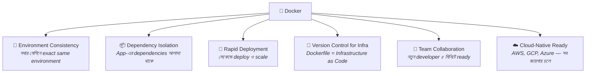
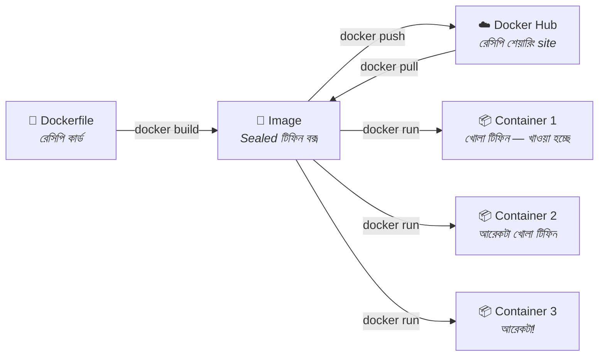
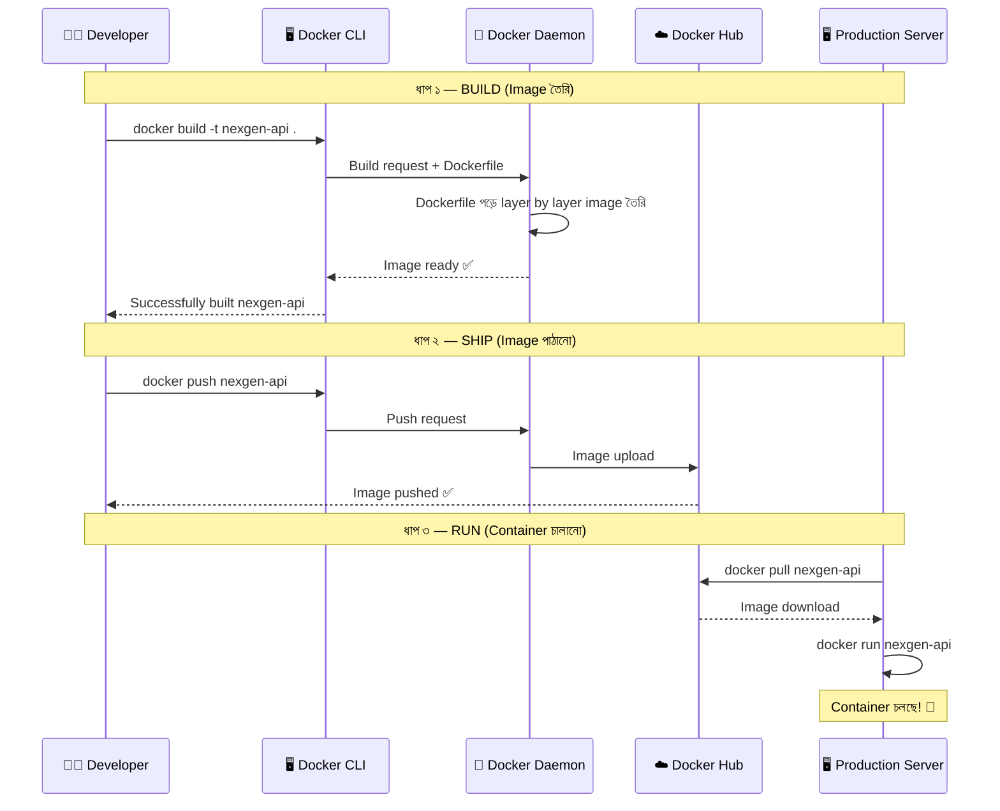
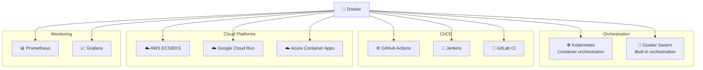

# 🐳 Docker Introduction

## Docker কী? (What)

**Docker** হলো একটি **open-source containerization platform** যা developers এবং system administrators-দের application তৈরি (build), পাঠানো (ship), এবং চালানো (run) সহজ করে — container ব্যবহার করে।

সহজ ভাষায়: Docker এমন একটি tool যেটা দিয়ে আপনি আপনার application এবং তার সব dependencies-কে একটি **container**-এর মধ্যে pack করতে পারেন, এবং সেই container যেকোনো machine-এ — laptop, server, বা cloud — একইভাবে চলবে।

:::info Docker এর Official সংজ্ঞা
Docker হলো এমন একটি platform যা **OS-level virtualization** ব্যবহার করে software কে **container** নামক package-এ deliver করে। প্রতিটা container নিজস্ব software, libraries, এবং configuration files বহন করে এবং well-defined channels-এর মাধ্যমে অন্য container-এর সাথে যোগাযোগ করতে পারে।
:::

---

## কেন Docker দরকার? (Why)

আগের topic-এ আমরা শিখেছি containerization কী এবং কেন দরকার। কিন্তু containerization concept আগে থেকেই ছিলো (LXC, FreeBSD Jails)। তাহলে Docker কেন আলাদা? কেন Docker-ই industry standard হয়ে গেলো?

### Containerization ছিলো, কিন্তু কঠিন ছিলো

```
❌ Docker-এর আগে (LXC/manual containerization):
   - Container তৈরি করতে low-level Linux knowledge দরকার ছিলো
   - Namespace, cgroups manually configure করতে হতো
   - কোনো standard format ছিলো না — এক machine-এর container অন্য machine-এ নাও চলতে পারে
   - Image share করার সহজ উপায় ছিলো না
   - Developer-friendly tool ছিলো না — শুধু Linux sysadmin-রা পারতো
   - Documentation ও community support কম ছিলো

✅ Docker দিয়ে (After):
   - একটা Dockerfile লিখলেই image তৈরি — low-level knowledge দরকার নেই
   - `docker run` — একটা command-এই container চালু
   - Standard image format — যেকোনো Docker-supported machine-এ চলে
   - Docker Hub — এক click-এ image share ও download
   - Developer-friendly CLI — backend developer-ও সহজে ব্যবহার করতে পারে
   - বিশাল community, documentation, ও ecosystem
```

### Docker যে ৬টা বড় সমস্যা সমাধান করে



---

## Analogy — Docker কে বোঝার উপমা

### 🍱 Bento Box (টিফিন ক্যারিয়ার) উপমা

Docker-কে ভাবুন একটা **bento box / টিফিন ক্যারিয়ার** এর মতো।

**Dockerfile** = রেসিপি কার্ড 📝
- কী কী উপকরণ লাগবে, কোন ক্রমে রান্না করবে — সব step-by-step লেখা

**Docker Image** = প্যাকেজড টিফিন বক্স (sealed) 📀
- রেসিপি অনুযায়ী তৈরি, seal করা — এখনও খোলা হয়নি
- ফ্রিজে রাখতে পারেন, বন্ধুকে দিতে পারেন, courier করতে পারেন

**Docker Container** = খোলা টিফিন বক্স (খাওয়া হচ্ছে) 📦
- Image থেকে "open" করা, এখন আসলে ব্যবহার হচ্ছে (running)
- একটা image থেকে যতগুলো খুশি ততগুলো container (টিফিন) বানানো যায়

**Docker Hub** = একটা বিশাল রেসিপি শেয়ারিং website ☁️
- অন্যদের বানানো image download করতে পারেন
- নিজের image upload করে share করতে পারেন



---

## Docker এর ইতিহাস (History)

Docker-এর পেছনের গল্পটা জানলে technology-টাকে আরো ভালো appreciate করতে পারবেন।

### জন্ম কাহিনী

| সাল | ঘটনা |
|------|-------|
| **2010** | **Solomon Hykes** এবং তার দল **dotCloud** নামে একটি PaaS (Platform as a Service) কোম্পানি শুরু করেন Paris-এ |
| **2013 (March)** | dotCloud তাদের internal container technology **Docker** নামে open-source করে **PyCon** conference-এ। মাত্র ৫ মিনিটের lightning talk-এ Docker পরিচিত হয় |
| **2013 (Oct)** | dotCloud কোম্পানির নাম পরিবর্তন করে রাখা হয় **Docker, Inc.** |
| **2014** | Docker 1.0 release — production-ready ঘোষণা। Google, Microsoft, Amazon সবাই Docker support ঘোষণা করে |
| **2014 (June)** | Google **Kubernetes** (K8s) open-source করে — Docker container orchestration এর জন্য |
| **2015** | **Open Container Initiative (OCI)** প্রতিষ্ঠিত হয় — container format ও runtime এর industry standard তৈরি |
| **2017** | Docker Enterprise Edition launch। **Moby Project** — Docker-এর open-source component আলাদা হয় |
| **2019** | Docker Hub-এ 100 billion+ image pull |
| **2020** | Docker Desktop subscription model শুরু |
| **2024+** | Docker AI tools (Docker Scout, Docker Init), Docker Desktop enhanced — AI/ML workload support |

:::tip ৫ মিনিটে ইতিহাস বদলে গেলো
Solomon Hykes-এর PyCon 2013-এর ঐ ৫ মিনিটের talk সম্ভবত software industry-র সবচেয়ে প্রভাবশালী lightning talk গুলোর একটি। সেই একটি demo থেকে আজ Docker বিশ্বের প্রায় সব tech company ব্যবহার করে।
:::

---

## Docker কীভাবে কাজ করে? (How it Works — Overview)

Docker একটি **Client-Server architecture** অনুসরণ করে। পরবর্তী topic-এ (Docker Architecture) আমরা এটা গভীরভাবে দেখব, তবে এখন high-level overview দেখি:

### মূল ৩টি ধাপ: Build → Ship → Run



### Build → Ship → Run ব্যাখ্যা

**1. Build (তৈরি করা)**
- আপনি একটি `Dockerfile` লেখেন যেখানে বলে দেন কীভাবে আপনার app-এর image তৈরি হবে
- `docker build` command দিলে Docker সেই Dockerfile পড়ে একটি **image** তৈরি করে
- Image-এ আপনার code, dependencies, runtime — সবকিছু pack হয়ে থাকে

**2. Ship (পাঠানো)**
- তৈরি image-কে **Docker Hub** বা অন্য কোনো registry-তে `docker push` করে upload করেন
- এখন বিশ্বের যেকোনো জায়গা থেকে এই image download করা যাবে

**3. Run (চালানো)**
- যেকোনো server-এ `docker pull` করে image নামিয়ে `docker run` করলেই container শুরু
- আপনার app হুবহু সেইভাবেই চলবে যেভাবে আপনার laptop-এ চলছিলো

---

## Docker Ecosystem — কী কী আছে?

Docker শুধু একটি tool নয়, এটি একটি সম্পূর্ণ **ecosystem**। এই ecosystem-এর প্রতিটি component আলাদা আলাদা সমস্যা সমাধান করে:

### Core Components

| Component | কী করে | আমাদের ডকুমেন্টেশনে কোথায় |
|-----------|--------|---------------------------|
| **Docker Engine** | Container চালানোর মূল engine — CLI, API, এবং daemon | Docker Architecture topic |
| **Docker CLI** | Terminal command দিয়ে Docker control করা | Docker CLI Basics topic |
| **Docker Desktop** | Windows/Mac-এ GUI-সহ Docker ব্যবহার | Docker Installation topic |
| **Dockerfile** | Image তৈরির instruction file | Dockerfile Basics topic |
| **Docker Compose** | একাধিক container একসাথে manage করা | Compose Intro topic |
| **Docker Hub** | Cloud-based image registry — image share ও download | Docker Hub topic |

### Extended Ecosystem

| Tool | কী করে | কখন দরকার |
|------|--------|-----------|
| **Docker Scout** | Image-এর security vulnerabilities scan করে | Production deployment-এ security audit |
| **Docker Init** | Project-এর জন্য automatically Dockerfile generate করে | নতুন project শুরু করতে |
| **Docker Build Cloud** | Cloud-এ image build করে (দ্রুত) | বড় image, CI/CD pipeline |
| **Docker Extensions** | Docker Desktop-এ third-party tools যোগ করা | Debugging, monitoring |

### Docker-এর সাথে কাজ করে এমন জনপ্রিয় Tools



:::info Kubernetes নিয়ে চিন্তা নয়
আপনি হয়তো শুনেছেন "Kubernetes শিখতে হবে"। হ্যাঁ, কিন্তু **আগে Docker শিখুন**। Kubernetes হলো অনেক container manage করার tool — Docker ছাড়া Kubernetes অর্থহীন। প্রথমে container বানানো ও চালানো শিখুন, তারপর Kubernetes শেখা সহজ হবে।
:::

---

## Docker দিয়ে NexGen AI — প্রথম ঝলক

এখনো আমরা Docker install করিনি বা command শিখিনি, কিন্তু একটা preview দেখি — পরবর্তী topic-গুলো শেষে আমরা exactly এটাই করব:

### ধাপ ১: Dockerfile লেখা (Level 2 তে শিখবেন)

```dockerfile
# Python এর official image ব্যবহার করছি base হিসেবে
FROM python:3.12-slim

# Container-এর ভিতরে কাজ করার directory
WORKDIR /app

# প্রথমে dependency file copy করি (caching এর জন্য)
COPY requirements.txt .

# Dependencies install করি
RUN pip install --no-cache-dir -r requirements.txt

# বাকি সব project files copy করি
COPY . .

# App কোন port-এ চলবে তা জানিয়ে দিই
EXPOSE 8000

# App চালু করার command
CMD ["uvicorn", "main:app", "--host", "0.0.0.0", "--port", "8000"]
```

### ধাপ ২: Docker Compose file (Level 2 শেষে)

```yaml
# docker-compose.yml
services:
  api:
    build: .
    ports:
      - "8000:8000"
    environment:
      - DATABASE_URL=postgresql://postgres:password@db:5432/nexgen
    depends_on:
      - db

  db:
    image: postgres:16
    environment:
      - POSTGRES_DB=nexgen
      - POSTGRES_PASSWORD=password
    volumes:
      - pg_data:/var/lib/postgresql/data

volumes:
  pg_data:
```

### ধাপ ৩: একটা command-এ সব চালু!

```bash
docker compose up
```

**Output (preview):**
```
[+] Running 3/3
 ✔ Network nexgen-api_default     Created
 ✔ Container nexgen-api-db-1      Started
 ✔ Container nexgen-api-api-1     Started
 
nexgen-api-db-1   | PostgreSQL init process complete; ready for start up.
nexgen-api-db-1   | LOG:  database system is ready to accept connections
nexgen-api-api-1  | INFO:     Uvicorn running on http://0.0.0.0:8000
nexgen-api-api-1  | INFO:     🚀 NexGen AI API started successfully
nexgen-api-api-1  | INFO:     📦 Connected to PostgreSQL database
```

:::warning এটা এখনই চালাবেন না!
উপরের code গুলো শুধু preview — আপনাকে দেখানোর জন্য যে আমরা কোথায় পৌঁছাব। Docker install, CLI basics, Image, Container — সব step-by-step শিখে তারপর এখানে আসবেন। Shortcut নেওয়ার চেষ্টা করলে confusion-ই বাড়বে।
:::

---

## কারা Docker ব্যবহার করে?

Docker শুধু DevOps engineers-এর জন্য নয়। আজ প্রায় সব ধরনের tech professional Docker ব্যবহার করে:

| কে ব্যবহার করে | কেন ব্যবহার করে |
|----------------|----------------|
| **Backend Developer** | Local development environment, API deployment |
| **Frontend Developer** | Full-stack app locally চালানো (API + DB), consistent environment |
| **DevOps Engineer** | CI/CD pipeline, deployment automation, infrastructure management |
| **Data Scientist / ML Engineer** | ML model training environment, model serving (MLflow, FastAPI) |
| **QA / Tester** | Consistent test environment, parallel testing |
| **Database Admin** | Database instances দ্রুত তৈরি ও পরীক্ষা |
| **Tech Lead / Architect** | Microservices architecture implementation |

### Industry Adoption

বিশ্বের বড় বড় কোম্পানিগুলো Docker ব্যবহার করে:

- **Google** — প্রতি সপ্তাহে billions of containers চালায়
- **Netflix** — সম্পূর্ণ microservices architecture Docker-based
- **Spotify** — Deployment ও testing-এ Docker ব্যবহার করে
- **PayPal** — VM থেকে container-এ migrate করে 50% cost বাঁচিয়েছে
- **ADP** — 20,000+ developers Docker ব্যবহার করে
- **বাংলাদেশের Startups** — Pathao, Chaldal, ShopUp সহ অনেকেই Docker ব্যবহার করছে

---

## Comparison Table — Docker vs অন্যান্য Container Tools

Docker-ই একমাত্র container tool নয়। তবে এটা সবচেয়ে জনপ্রিয়। চলুন তুলনা দেখি:

| বৈশিষ্ট্য | Docker | Podman | containerd | LXC |
|-----------|--------|--------|------------|-----|
| **Developer Experience** | ⭐⭐⭐⭐⭐ Excellent | ⭐⭐⭐⭐ Good | ⭐⭐⭐ Medium | ⭐⭐ Basic |
| **Daemon Required** | হ্যাঁ (dockerd) | না (daemonless) | হ্যাঁ | হ্যাঁ |
| **Root Required** | Default: হ্যাঁ (rootless mode আছে) | না (rootless by default) | হ্যাঁ | হ্যাঁ |
| **Docker Compose Support** | Built-in | `podman-compose` দিয়ে | নেই | নেই |
| **OCI Compatible** | হ্যাঁ | হ্যাঁ | হ্যাঁ | না |
| **GUI (Desktop App)** | Docker Desktop | Podman Desktop | নেই | নেই |
| **Kubernetes Integration** | ভালো | ভালো | Kubernetes default runtime | না |
| **Community & Ecosystem** | সবচেয়ে বড় | বাড়ছে | বড় (K8s focused) | ছোট |
| **Learning Resources** | প্রচুর | মাঝারি | কম | কম |
| **Use Case** | সব ধরনের development ও deployment | Security-focused, Red Hat ecosystem | Kubernetes runtime | System containers |

:::tip কেন Docker দিয়ে শুরু?
**Podman** ভালো tool — daemonless, rootless, এবং Docker-compatible। কিন্তু শেখার জন্য Docker দিয়ে শুরু করাই সবচেয়ে ভালো কারণ:
1. সবচেয়ে বেশি learning resource আছে
2. Job posting-এ Docker-ই চাওয়া হয়
3. Docker শিখলে Podman-এ switch করা সহজ (commands প্রায় একই)
4. Docker Desktop GUI নতুনদের জন্য সহায়ক
:::

---

## Docker Editions — কোনটা আপনার জন্য?

Docker-এর দুটি প্রধান edition আছে:

| বৈশিষ্ট্য | Docker Engine (CE) | Docker Desktop |
|-----------|-------------------|----------------|
| **দাম** | সম্পূর্ণ বিনামূল্যে | ব্যক্তিগত ব্যবহার ও ছোট কোম্পানি (≤250 জন) — বিনামূল্যে। বড় কোম্পানি — paid |
| **Platform** | শুধু Linux | Windows, macOS, Linux |
| **GUI** | নেই (শুধু CLI) | হ্যাঁ (GUI + CLI) |
| **Compose** | আলাদা install | Built-in |
| **Kubernetes** | আলাদা setup | Built-in single-node K8s |
| **Extensions** | নেই | হ্যাঁ |
| **কার জন্য** | Linux server, production | Developer workstation |

:::info আমরা কোনটা ব্যবহার করব?
এই ডকুমেন্টেশনে আমরা **Docker Desktop** ব্যবহার করব (Windows/Mac user-দের জন্য)। Linux user-রা Docker Engine CLI ব্যবহার করবেন। Commands দুই ক্ষেত্রেই একই — শুধু installation process আলাদা, যেটা পরবর্তী topic-এ (Docker Installation) বিস্তারিত দেখব।
:::

---

## Docker-এর সীমাবদ্ধতা — কী কী Docker করতে পারে না

Docker অসাধারণ, কিন্তু সবকিছুর জন্য নয়। সীমাবদ্ধতাগুলো জানা থাকলে সঠিক জায়গায় সঠিক tool ব্যবহার করতে পারবেন:

| সীমাবদ্ধতা | ব্যাখ্যা |
|------------|---------|
| **GUI Applications** | Docker মূলত CLI/server applications-এর জন্য। GUI app চালানো সম্ভব কিন্তু জটিল |
| **Different OS Kernel** | Linux container Linux kernel দরকার। Windows-এ Docker internally VM ব্যবহার করে Linux kernel চালায় |
| **Persistent Storage** | Container ephemeral — Volume ছাড়া data হারিয়ে যায়। Database container-এ Volume বাধ্যতামূলক |
| **Complex Orchestration** | অনেক container manage করতে Docker alone যথেষ্ট নয় — Kubernetes বা Docker Swarm দরকার |
| **Bare-metal Performance** | Container-এ সামান্য performance overhead আছে, যদিও VM-এর তুলনায় অনেক কম |
| **Windows Native Apps** | .NET Framework (legacy) app containerize করা যায় কিন্তু শুধু Windows container-এ |
| **Security** | Container-রা kernel share করে, তাই VM-level isolation পাওয়া যায় না |

---

## Common Mistakes — নতুনদের সাধারণ ভুল

### ১. Docker আর Kubernetes গুলিয়ে ফেলা
❌ **ভুল:** Docker আর Kubernetes একই জিনিস, অথবা Kubernetes Docker-এর replacement।
✅ **সঠিক:** Docker **container তৈরি ও চালায়**। Kubernetes **অনেকগুলো container manage ও orchestrate করে**। Kubernetes-এ container চালাতে Docker (বা অন্য runtime) দরকার। দুটো complementary tool, competitor নয়।

### ২. সবকিছু এক container-এ ঢুকানো
❌ **ভুল:** একটা container-এ FastAPI + PostgreSQL + Redis + Nginx সব একসাথে চালানো।
✅ **সঠিক:** প্রতিটা service আলাদা container-এ চালান (one process per container)। Docker Compose দিয়ে এগুলো connect করুন। এতে debugging, scaling, ও maintenance সহজ হয়।

### ৩. Docker মানে শুধু DevOps ভাবা
❌ **ভুল:** Docker শুধু DevOps engineer-দের tool, আমি developer — আমার দরকার নেই।
✅ **সঠিক:** Docker modern developer-দের জন্য একটি **essential skill**। Local development, testing, debugging — সব ক্ষেত্রে Docker ব্যবহৃত হয়। চাকরির বাজারেও Docker জানা প্রায় বাধ্যতামূলক।

### ৪. Docker শিখতে Linux expert হতে হবে মনে করা
❌ **ভুল:** Docker শিখতে হলে আগে Linux master হতে হবে।
✅ **সঠিক:** Basic terminal command জানলেই Docker শেখা যায়। Docker Desktop Windows/Mac-এ GUI দেয়। Docker ব্যবহার করতে করতেই Linux-এর অনেক কিছু শিখে যাবেন।

---

## Best Practices

1. **Docker দিয়ে local development শুরু করুন** — Production-এ deploy এর আগে locally Docker ব্যবহার শুরু করুন। এতে Docker শেখাও হবে, development workflow-ও improve হবে।

2. **Official Images ব্যবহার করুন** — Docker Hub-এ `node`, `python`, `mongo`, `postgres` — এগুলো official, maintained, ও secure image। Random user-এর image ব্যবহার এড়িয়ে চলুন।

3. **Dockerfile-কে version control করুন** — Dockerfile, docker-compose.yml, .dockerignore — এগুলো Git-এ রাখুন। এরা আপনার infrastructure-এর code।

4. **ছোট image ব্যবহার করুন** — `python:3.12-slim` ব্যবহার করুন `python:3.12` এর বদলে। Slim/Alpine-based image অনেক ছোট (আমরা এটা Dockerfile topic-এ বিস্তারিত দেখব)।

5. **Docker documentation পড়ুন** — [docs.docker.com](https://docs.docker.com) হলো Docker-এর official documentation — অত্যন্ত ভালো ও updated।

---

## Interview Questions ও Answers

### ১. Docker কী এবং এটা কোন সমস্যা সমাধান করে?

**উত্তর:** Docker হলো একটি open-source containerization platform যা application-কে container নামক isolated, portable package-এ build, ship, এবং run করতে দেয়।

Docker মূলত ৩টি সমস্যা সমাধান করে: **Environment inconsistency** — "works on my machine" সমস্যা দূর করে, কারণ container সব জায়গায় একই environment নিশ্চিত করে। **Dependency conflict** — প্রতিটা app আলাদা container-এ থাকায় একটার dependency অন্যটাকে প্রভাবিত করে না। **Slow deployment** — container সেকেন্ডে শুরু হয় এবং image-based deployment reproducible ও দ্রুত।

---

### ২. Docker Image আর Docker Container এর মধ্যে পার্থক্য কী?

**উত্তর:** **Docker Image** হলো একটি read-only template যাতে application চালানোর সব instructions ও files আছে — এটাকে একটা class-এর সাথে তুলনা করা যায়। Image immutable — তৈরি হলে পরিবর্তন হয় না।

**Docker Container** হলো image-এর running instance — এটা class থেকে তৈরি object-এর মতো। Container-এ application আসলে execute হয়। Container writable — আপনি ভিতরে file তৈরি/পরিবর্তন করতে পারেন (যদিও container মুছলে সেসব পরিবর্তনও মুছে যায়)। একটা image থেকে অনেকগুলো container তৈরি করা যায়।

---

### ৩. Docker Engine এর মূল components কী কী?

**উত্তর:** Docker Engine তিনটি মূল component নিয়ে গঠিত:

**Docker CLI (Client)** — user যে commands দেয় (`docker run`, `docker build`) সেগুলো handle করে এবং Docker Daemon-এ REST API-র মাধ্যমে পাঠায়।

**Docker Daemon (dockerd)** — মূল background service যা images, containers, networks, volumes — সব manage করে। Client-এর request receive করে কাজ করে।

**containerd** — low-level container runtime যা আসলে container তৈরি ও চালায়। Docker Daemon এটাকে internally ব্যবহার করে।

(এটা আমরা পরবর্তী topic "Docker Architecture"-এ আরো গভীরভাবে দেখব।)

---

### ৪. Docker কেন VM-এর চেয়ে দ্রুত?

**উত্তর:** তিনটি কারণে Docker VM-এর চেয়ে দ্রুত:

**প্রথমত**, Docker-এ আলাদা Guest OS boot হয় না — container host OS-এর kernel directly ব্যবহার করে, তাই startup time seconds-এ।

**দ্বিতীয়ত**, Docker container-এ শুধু application-এর libraries থাকে (MBs), পূর্ণ OS নয় (GBs) — তাই image download ও build দ্রুত হয়।

**তৃতীয়ত**, Docker hardware emulation করে না (VM-এর মতো Hypervisor layer নেই) — container direct system calls করে, তাই near-native performance পায়।

---

## Summary

| বিষয় | বিবরণ |
|-------|-------|
| **Docker** | Open-source containerization platform — build, ship, run |
| **তৈরি** | Solomon Hykes, 2013 (dotCloud → Docker, Inc.) |
| **মূল কাজ** | Application + dependencies → container → যেকোনো জায়গায় চলে |
| **Workflow** | Build (Dockerfile → Image) → Ship (Docker Hub) → Run (Container) |
| **Ecosystem** | Docker Engine, CLI, Desktop, Compose, Hub, Scout, Init |
| **Editions** | Docker Engine (free, Linux) ও Docker Desktop (free for small teams) |
| **Industry** | Google, Netflix, Spotify, PayPal সহ বিশ্বব্যাপী ব্যবহৃত |
| **সীমাবদ্ধতা** | GUI apps, different OS kernel, complex orchestration |

---

## পরবর্তী ধাপ

এখন আপনি জানেন Docker কী, কে তৈরি করেছে, ecosystem-এ কী কী আছে, এবং কেন Docker industry standard। পরবর্তী topic-এ আমরা **Docker Architecture** নিয়ে deep dive করব — Docker Engine এর internal components (CLI, Daemon, containerd, runc), Client-Server model, এবং image pull/container run করলে ভিতরে ভিতরে কী ঘটে — সেটা বিস্তারিত দেখব।
