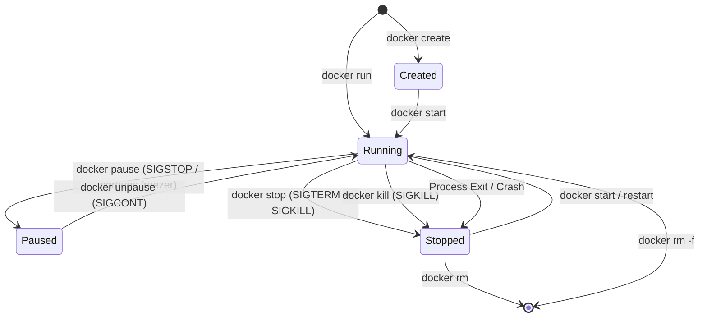
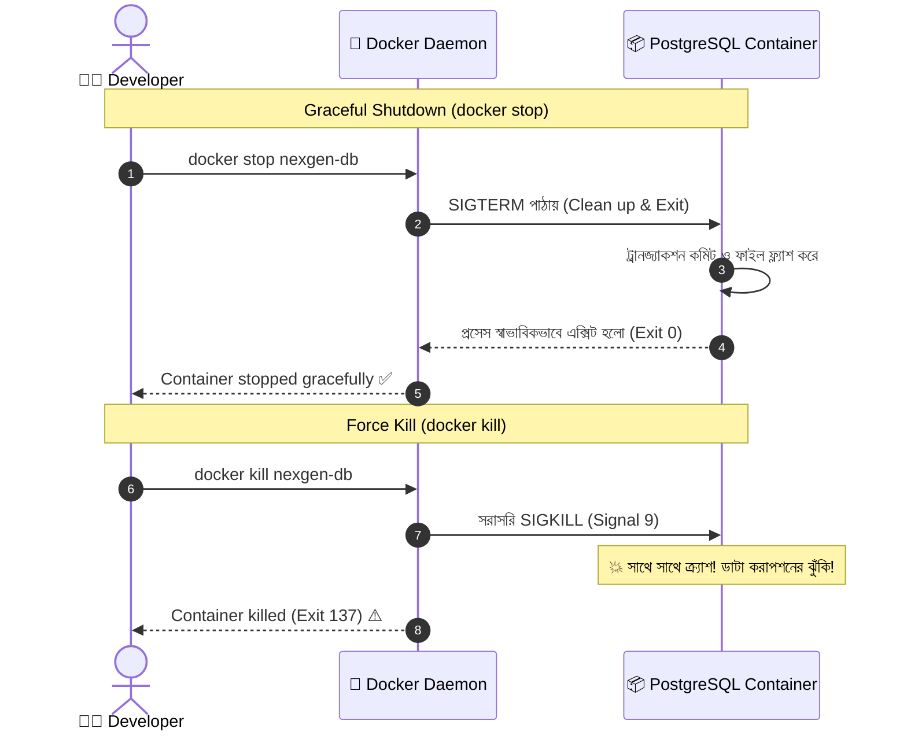

# 🔄 Container Lifecycle

## Container Lifecycle কী? (What)

**Container Lifecycle (কন্টেইনারের জীবনচক্র)** হলো একটি ডকার কন্টেইনারের জন্ম (তৈরি হওয়া) থেকে শুরু করে এর বিভিন্ন কর্মাবস্থা এবং চূড়ান্ত ধ্বংস (মুছে যাওয়া) পর্যন্ত যে ধাপ বা অবস্থাগুলোর (States) মধ্য দিয়ে সে অতিক্রম করে তার সামগ্রিক প্রবাহ।

একটি ডকার কন্টেইনার মূলত নিম্নলিখিত **৫টি প্রধান স্টেটের** যেকোনো একটিতে অবস্থান করতে পারে:
1. **Created**: কন্টেইনারের ফাইলসিস্টেম ও কনফিগারেশন তৈরি হয়েছে, কিন্তু প্রসেস চালু হয়নি।
2. **Running**: কন্টেইনারের ভেতরের মূল অ্যাপ্লিকেশন প্রসেস সক্রিয়ভাবে কাজ করছে।
3. **Paused**: প্রসেসকে মেমরিতে সাময়িকভাবে ফ্রিজ (স্থগিত) করে রাখা হয়েছে।
4. **Stopped / Exited**: প্রসেসের কাজ শেষ বা বন্ধ হয়ে গেছে, তবে ফাইলসিস্টেমের পরিবর্তনগুলো ডিস্কে সংরক্ষিত আছে।
5. **Dead / Removed**: কন্টেইনারটি মেমরি ও ডিস্ক থেকে সম্পূর্ণ নিশ্চিহ্ন হয়ে গেছে।

---

## কেন Lifecycle গভীরভাবে বোঝা দরকার? (Why)

```
❌ Lifecycle না বুঝলে (Before):
   - ডাটাবেজ কন্টেইনার বন্ধ করতে গিয়ে `kill` মেরে ডাটাবেজ করাপ্ট (Data Corruption) করে ফেলা
   - কন্টেইনার কেন `Exit 137` দিয়ে বন্ধ হয়ে গেল বুঝতে না পেরে অন্ধকারে হাতড়ানো
   - ব্যাকআপ নেওয়ার সময় অ্যাপ্লিকেশন প্রসেস সাময়িক বন্ধ করতে গিয়ে পুরো কন্টেইনার অফলাইন করা
   - মেমরিতে স্থগিত (`Paused`) কন্টেইনার আর বন্ধ (`Stopped`) কন্টেইনারের পার্থক্য না বোঝা

✅ Lifecycle পরিষ্কার থাকলে (After):
   - Graceful Shutdown নিশ্চিত করে ডাটাবেজ (PostgreSQL) এবং FastAPI কানেকশন নিরাপদে বন্ধ করা যায়
   - Exit Code দেখেই এক সেকেন্ডে বোঝা যায় কেন সার্ভিস ক্র্যাশ করেছে (যেমন Out-of-Memory)
   - `pause`/`unpause` দিয়ে কোনো রিসোর্স নষ্ট না করে সেকেন্ডে ট্রাফিক হ্যান্ডল বা স্ন্যাপশট নেওয়া যায়
   - প্রোডাকশন ইনফ্রাস্ট্রাকচারের স্ট্যাবিলিটি বহুগুণ বৃদ্ধি পায়
```

---

## Analogy — মানুষের জীবনের বিভিন্ন পর্যায় ও ভিডিও প্লেয়ারের উপমা 🎬

কন্টেইনারের জীবনচক্রকে একটি **ইউটিউব বা ভিডিও প্লেয়ার**-এর সাথে তুলনা করা সবচেয়ে সহজ:

```
[ভিডিও ডাউনলোড হলো কিন্তু প্লে হয়নি]  ➜  CREATED
[ভিডিও চলছে ও সাউন্ড আসছে]             ➜  RUNNING
[Pause বাটনে চাপ দিলেন - স্ক্রিন ফ্রিজ]  ➜  PAUSED (প্রসেস মেমরিতে আটকে থাকে)
[Stop বাটন চাপলেন - প্লেয়ার বন্ধ]      ➜  STOPPED / EXITED
[ভিডিও ফাইলটি ডিলিট করে দিলেন]         ➜  REMOVED
```

---

## How it Works — State Machine ও ট্রানজিশন ডায়াগ্রাম

ডকার ইঞ্জিনের ভেতরে কন্টেইনারের স্টেট কীভাবে পরিবর্তিত হয় তা নিচের স্টেট মেশিনে নিখুঁতভাবে দেখানো হলো:



---

## সিগন্যাল হ্যান্ডলিং — `docker stop` বনাম `docker kill`

একটি রানিং কন্টেইনারকে বন্ধ করার জন্য ডকার দুটি ভিন্ন লিনাক্স সিগন্যাল (Linux Signals) ব্যবহার করে:

### ১. `docker stop` (Graceful Shutdown)
- ডকার প্রথমে কন্টেইনারের PID 1 প্রসেসকে **`SIGTERM` (Signal 15)** পাঠায়।
- এর অর্থ: "তোমাকে বন্ধ হতে হবে, তোমার চলমান ডাটাবেজ ট্রানজ্যাকশন সেভ করো এবং নেটওয়ার্ক কানেকশন ক্লোজ করো।"
- ডকার ডিফল্টভাবে **১০ সেকেন্ড** অপেক্ষা করে।
- যদি এই সময়ের মধ্যে প্রসেস বন্ধ না হয়, তখন ডকার বাধ্য হয়ে **`SIGKILL` (Signal 9)** পাঠিয়ে প্রসেসটিকে জোরপূর্বক মেরে ফেলে।

### ২. `docker kill` (Forceful Termination)
- ডকার কোনো সময় নষ্ট না করে সরাসরি **`SIGKILL` (Signal 9)** পাঠায়।
- প্রসেস কোনো ডাটা সেভ বা ক্লিনআপ করার সুযোগ পায় না; সাথে সাথে নিহত হয়।



---

## ডকার এক্সিট কোডস (Exit Codes) ডিকোড করা 🔍

কন্টেইনার যখন বন্ধ হয় (`Stopped/Exited`), তখন ডকার একটি স্ট্যাটাস এক্সিট কোড প্রদান করে। এই কোড দেখেই ইঞ্জিনিয়াররা সমস্যা শনাক্ত করেন:

| Exit Code | অর্থ | কারণ ও ব্যাখ্যা |
|---|---|---|
| **0** | Success (স্বাভাবিক সমাপ্তি) | প্রসেস তার কাজ সফলভাবে শেষ করে স্বাভাবিকভাবে বন্ধ হয়েছে। |
| **1** | Application Error | কোডে বাগ, এক্সেপশন বা কনফিগারেশন ভুলের কারণে ক্র্যাশ। |
| **137** | Terminated by `SIGKILL` | **(128 + 9)** — `docker kill` করা হয়েছে অথবা **OOMKilled** (Out of Memory - র‍্যাম শেষ হয়ে কার্নেল মেরে ফেলেছে)। |
| **139** | Segmentation Fault | **(128 + 11)** — সি-লাইব্রেরি বা মেমরি অ্যাক্সেস ভায়োলেশন। |
| **143** | Terminated by `SIGTERM` | **(128 + 15)** — `docker stop` দেওয়ার পর প্রসেসটি নিরাপদে সিগন্যাল মেনে বন্ধ হয়েছে। |

:::tip 128 এর রহস্য
লিনাক্সে কোনো প্রসেস যদি সিগন্যাল পেয়ে বন্ধ হয়, তার এক্সিট কোড হয়: **`128 + Signal Number`**।
যেমন: `SIGKILL` হলো সিগন্যাল 9 ➔ $128 + 9 = 137$। `SIGTERM` হলো সিগন্যাল 15 ➔ $128 + 15 = 143$।
:::

---

## Hands-on: কন্টেইনারের প্রতিটি লাইফসাইকেল টেস্ট

আমাদের **NexGen AI** প্রজেক্টের ডাটাবেজ ও এপিআই দিয়ে প্রতিটি স্টেট বাস্তবে তৈরি ও পর্যবেক্ষণ করি:

### ১. কন্টেইনার তৈরি করা কিন্তু চালু না করা (`docker create`)

```bash
# শুধুমাত্র কন্টেইনারের কাঠামো তৈরি করি (স্ট্যাটাস: Created)
docker container create --name nexgen-db-lifecycle -e POSTGRES_PASSWORD=secret postgres:16-alpine
```

```bash
# স্ট্যাটাস চেক করি
docker container ls -a --filter "name=nexgen-db-lifecycle"
```

**বাস্তব Output:**
```text
CONTAINER ID   IMAGE                COMMAND                  CREATED         STATUS    PORTS     NAMES
3e4f5a6b7c8d   postgres:16-alpine   "docker-entrypoint.s…"   5 seconds ago   Created             nexgen-db-lifecycle
```

---

### ২. কন্টেইনার স্টার্ট করা (`docker start`)

```bash
# Created কন্টেইনারকে রানিং স্টেটে নেওয়া
docker container start nexgen-db-lifecycle
```

```bash
# স্ট্যাটাস চেক
docker container ls --filter "name=nexgen-db-lifecycle"
```

**বাস্তব Output:**
```text
CONTAINER ID   IMAGE                COMMAND                  CREATED          STATUS         PORTS      NAMES
3e4f5a6b7c8d   postgres:16-alpine   "docker-entrypoint.s…"   20 seconds ago   Up 2 seconds   5432/tcp   nexgen-db-lifecycle
```

---

### ৩. কন্টেইনার সাময়িক স্থগিত করা (`docker pause` ও `unpause`)

কন্টেইনারের প্রসেসকে মেমরিতে ফ্রিজ করে রাখা (CPU খরচ 0% হয়ে যাবে):

```bash
# কন্টেইনার পজ করি
docker container pause nexgen-db-lifecycle
```

```bash
docker container ls --filter "name=nexgen-db-lifecycle"
```

**বাস্তব Output:**
```text
CONTAINER ID   IMAGE                COMMAND                  CREATED          STATUS                   PORTS      NAMES
3e4f5a6b7c8d   postgres:16-alpine   "docker-entrypoint.s…"   40 seconds ago   Up 22 seconds (Paused)   5432/tcp   nexgen-db-lifecycle
```

```bash
# পুনরায় সচল করি
docker container unpause nexgen-db-lifecycle
```

---

### ৪. গ্রেসফুল শাটডাউন ও কাস্টম টাইমআউট (`docker stop -t`)

পোস্টগ্রেসের মতো বড় ডাটাবেজে ডাটা যাতে নিরাপদে ডিস্কে সেভ হতে পারে, সেজন্য ১০ সেকেন্ডের জায়গায় ১৫ সেকেন্ড গ্রেস পিরিয়ড দেওয়া:

```bash
# ১৫ সেকেন্ড সময় দিয়ে নিরাপদে কন্টেইনার বন্ধ করা
docker container stop -t 15 nexgen-db-lifecycle
```

**বাস্তব Output:**
```text
nexgen-db-lifecycle
```

```bash
# কন্টেইনারের এক্সিট কোড ও স্ট্যাটাস ইন্সপেক্ট করা
docker container inspect --format 'Status: {{.State.Status}} | ExitCode: {{.State.ExitCode}}' nexgen-db-lifecycle
```

**Output:**
```text
Status: exited | ExitCode: 0
```

---

### ৫. কন্টেইনার ডিলিট করা (`docker rm`)

```bash
# স্টপড কন্টেইনার পার্মানেন্টলি ডিলিট করা
docker container rm nexgen-db-lifecycle
```

---

## Comparison Table — Stop বনাম Kill বনাম Pause

| বৈশিষ্ট্য | `docker stop` | `docker kill` | `docker pause` |
|---|---|---|---|
| **প্রেরিত সিগন্যাল** | `SIGTERM` (১০ সে. পর `SIGKILL`) | সরাসরি `SIGKILL` | `SIGSTOP` (Freezer cgroup) |
| **ক্লিনআপ সুযোগ** | ✅ হ্যাঁ, ডাটা সেভ করার সময় পায় | ❌ কোনো সুযোগ নেই | ⏸️ প্রসেস মেমরিতে ফ্রিজ থাকে |
| **CPU ব্যবহার** | 0% (প্রসেস বন্ধ) | 0% (প্রসেস বন্ধ) | 0% (সম্পূর্ণ রিলিজ) |
| **RAM মেমরি** | মেমরি সম্পূর্ণ খালি হয়ে যায় | মেমরি সম্পূর্ণ খালি হয়ে যায় | ⚠️ মেমরি দখল করে রাখে |
| **পুনরায় চালুর গতি** | সাধারণ (Restart হতে হয়) | সাধারণ (Re-boot হতে হয়) | ⚡ চোখের পলকে (Instant Unpause) |
| **ডাটা সেফটি** | ⭐⭐⭐⭐⭐ সম্পূর্ণ নিরাপদ | ⚠️ ডাটা করাপশনের ঝুঁকি | ⭐⭐⭐⭐⭐ নিরাপদ |

---

## Common Mistakes — নতুনদের সাধারণ ভুল

### ১. ডাটাবেজ বন্ধ করার জন্য অধৈর্য হয়ে `docker kill` দেওয়া
❌ **ভুল:** ডাটাবেজ স্টপ হতে ২-৩ সেকেন্ড সময় নিলেই বিরক্ত হয়ে `docker kill` চালানো।
✅ **সঠিক:** ডাটাবেজকে `SIGTERM` হ্যান্ডল করে বাফার মেমরি থেকে ডিস্কে ডাটা ফ্ল্যাশ করতে দিন। `docker stop` ব্যবহার করুন।

### ২. মেমরি খালি করার জন্য `docker pause` ব্যবহার করা
❌ **ভুল:** র‍্যাম বাঁচাতে কন্টেইনার পজ করে রাখা।
✅ **সঠিক:** `docker pause` শুধুমাত্র CPU এক্সিকিউশন বন্ধ করে, কিন্তু কন্টেইনারের সম্পূর্ণ র‍্যাম মেমরি ব্লক করে রাখে। র‍্যাম খালি করতে কন্টেইনার `stop` করতে হবে।

### ৩. Exit 137 দেখলেই ভাবা যে কেউ কিল করেছে
❌ **ভুল:** `Exit 137` দেখলে শুধু ইউজারের দোষ দেওয়া।
✅ **সঠিক:** কন্টেইনার যদি তার নির্ধারিত মেমরি লিমিটের চেয়ে বেশি র‍্যাম খরচ করে ফেলে, তখন লিনাক্স কার্নেলের **OOM (Out Of Memory) Killer** নিজে থেকেই `SIGKILL` পাঠিয়ে কন্টেইনারকে মেরে ফেলে। `docker inspect` দিয়ে `OOMKilled: true` কিনা চেক করুন।

---

## Best Practices

1. **FastAPI-তে Graceful Shutdown ইভেন্ট লিখুন**:
   FastAPI-র লাইফস্প্যান হ্যান্ডলার ব্যবহার করে `SIGTERM` আসার সাথে সাথে ডাটাবেজ পুল ও ওপেন কানেকশন ক্লোজ করার কোড লিখুন:
   ```python
   from contextlib import asynccontextmanager
   from fastapi import FastAPI

   @asynccontextmanager
   async def lifespan(app: FastAPI):
       # Startup
       print("🚀 Starting up database connection pool...")
       yield
       # Shutdown (SIGTERM পেলেই এটি এক্সিকিউট হবে)
       print("🛑 Closing database connections safely...")

   app = FastAPI(lifespan=lifespan)
   ```

2. **প্রয়োজনে Stop Timeout বাড়িয়ে দিন**: বড় সার্ভিস বা মাইগ্রেশন সার্ভিসের জন্য `docker stop -t 30` ব্যবহার করুন।

3. **নিয়মিত স্টপড কন্টেইনার ক্লিন করুন**: `docker container prune` দিয়ে কাজ শেষ হওয়া কন্টেইনার ডিলিট করুন।

---

## Interview Questions ও Answers

### ১. `docker stop` এবং `docker kill` এর মধ্যে অভ্যন্তরীণ পার্থক্য কী?

**উত্তর:** 
- `docker stop` একটি গ্রেসফুল শাটডাউন কমান্ড। এটি কন্টেইনারের প্রধান প্রসেসকে (PID 1) প্রথমে লিনাক্স সিগন্যাল `SIGTERM` (Signal 15) পাঠায়। অ্যাপ্লিকেশনটি তখন চলমান কানেকশন বন্ধ ও ডাটা সেভ করার জন্য ডিফল্ট ১০ সেকেন্ড সময় পায়। ১০ সেকেন্ডে বন্ধ না হলে ডকার `SIGKILL` পাঠায়।
- `docker kill` কোনো গ্রেস পিরিয়ড বা ক্লিনআপের সুযোগ না দিয়ে সরাসরি `SIGKILL` (Signal 9) পাঠিয়ে কার্নেল লেভেলে প্রসেসটিকে তৎক্ষণাৎ বন্ধ করে দেয়। ফলে ডাটা লস বা ফাইল করাপশনের ঝুঁকি থাকে।

---

### ২. Docker-এ Exit Code 137 এর পেছনের দুটি কারণ কী কী?

**উত্তর:** 
Exit Code 137 ($128 + 9 = 137$) নির্দেশ করে যে প্রসেসটি `SIGKILL` সিগন্যালের কারণে নিহত হয়েছে। এর প্রধান দুটি কারণ:
1. **ম্যানুয়াল কিল:** ব্যবহারকারী বা কোনো মনিটরিং স্ক্রিপ্ট সরাসরি `docker kill` অথবা `docker rm -f` চালিয়েছে।
2. **OOM Killer (Out of Memory):** কন্টেইনারটি হোস্ট সিস্টেম বা তার নির্ধারিত মেমরি লিমিট (যেমন 512MB) অতিক্রম করেছে। ফলে লিনাক্স কার্নেল সিস্টেমকে ক্র্যাশ থেকে বাঁচাতে মেমরি খাদক প্রসেসটিকে `SIGKILL` দিয়ে মেরে ফেলেছে।

---

### ৩. `docker pause` মেমরি ও সিপিইউ-র ওপর কী প্রভাব ফেলে?

**উত্তর:** `docker pause` লিনাক্স কার্নেলের **cgroups freezer subsystem** ব্যবহার করে। এটি কন্টেইনারের ভেতরে চলা সমস্ত প্রসেসের থ্রেড শিডিউলিং সম্পূর্ণ স্থগিত করে দেয়। ফলে:
- **CPU ব্যবহার অবিলম্বে ০% এ নেমে আসে।**
- কিন্তু কন্টেইনারের প্রসেসগুলো মেমরি (RAM) থেকে মুছে যায় না; **র‍্যামে তাদের স্টেট হুবহু অক্ষত থাকে।** 
- পরবর্তীতে `docker unpause` করলে কোনো রিবুট ছাড়াই মিলিসেকেন্ডের মধ্যে যেখান থেকে পজ হয়েছিল সেখান থেকেই প্রসেস আবার চলা শুরু করে।

---

### ৪. কন্টেইনারের লাইফসাইকেল স্টেটসগুলো কী কী?

**উত্তর:** কন্টেইনারের প্রধান স্টেটসগুলো হলো:
1. `Created`: ইমেজ থেকে কন্টেইনার তৈরি হয়েছে কিন্তু চালু হয়নি।
2. `Running`: প্রসেস সক্রিয়ভাবে চলছে।
3. `Restarting`: ক্র্যাশ বা রিবুটের পর পলিসি অনুযায়ী পুনরায় চালু হওয়ার প্রক্রিয়ায় আছে।
4. `Paused`: প্রসেস মেমরিতে সাময়িক স্থগিত।
5. `Exited / Stopped`: প্রসেস সমাপ্ত হয়েছে বা বন্ধ করা হয়েছে।
6. `Dead`: ত্রুটির কারণে কন্টেইনারটি অকেজো হয়ে গেছে এবং ডিলিট করা ছাড়া উপায় নেই।

---

## Summary

| স্টেট / কনসেপ্ট | কমান্ড | কী ঘটে |
|---|---|---|
| **Created ➔ Running** | `docker start <id>` | তৈরি করা কন্টেইনারের প্রসেস শুরু করে |
| **Running ➔ Paused** | `docker pause <id>` | CPU রিলিজ করে প্রসেস মেমরিতে ফ্রিজ করে রাখে |
| **Paused ➔ Running** | `docker unpause <id>` | চোখের পলকে প্রসেস আবার চালু করে |
| **Running ➔ Stopped** | `docker stop -t <sec> <id>` | `SIGTERM` দিয়ে নিরাপদে ডাটা সেভ করে বন্ধ করে |
| **Force Stop** | `docker kill <id>` | `SIGKILL` দিয়ে সাথে সাথে প্রসেস মেরে ফেলে |
| **Stopped ➔ Removed** | `docker rm <id>` | কন্টেইনারকে সিস্টেম থেকে স্থায়ীভাবে ডিলিট করে |
| **Exit Code 137** | ডায়াগনস্টিক | `SIGKILL` অথবা Out of Memory (OOM) ক্র্যাশ |

---

## পরবর্তী ধাপ

আমরা সফলভাবে কন্টেইনারের জীবনচক্র এবং সিগন্যাল হ্যান্ডলিং শিখেছি। পরবর্তী টপিকে আমরা দেখব **Container Management** (`docker/container-management.md`) — যেখানে একসাথে একাধিক কন্টেইনার পরিচালনা, ফিল্টারিং (`--filter`), ব্যাচ অপারেশন, রিসোর্স অডিট এবং `docker container prune` এর অ্যাডভান্সড ট্রিকস শিখব।
