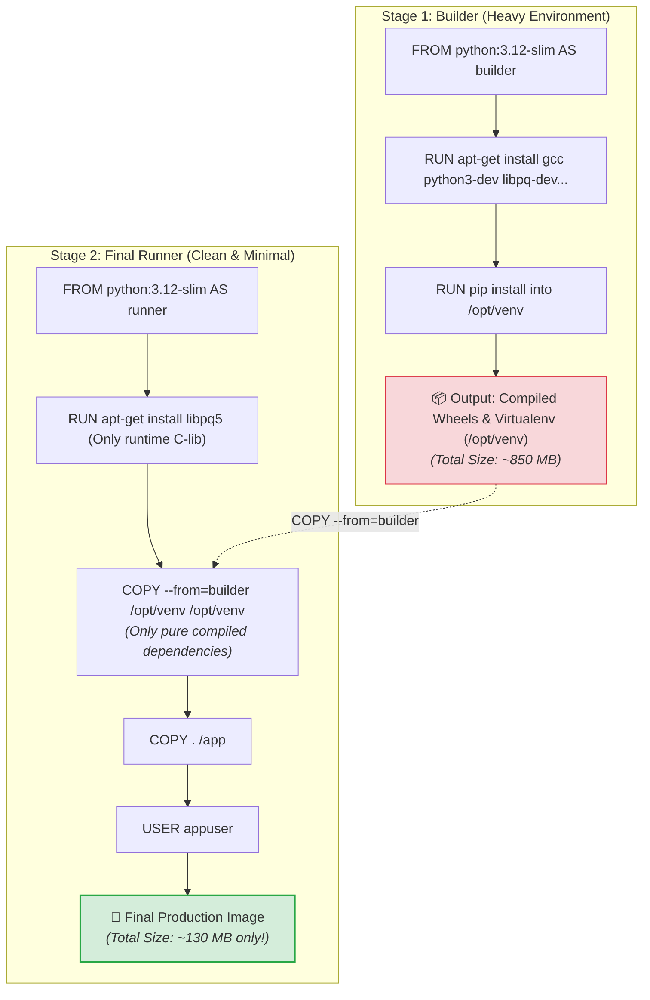

# 🚀 Multi-Stage Builds

## Multi-Stage Build কী? (What)

**Multi-Stage Build** হলো ডকারের এমন একটি শক্তিশালী ফিচার, যার মাধ্যমে একটি একক `Dockerfile`-এর ভেতরে একাধিক `FROM` নির্দেশিকা ব্যবহার করে অ্যাপ্লিকেশনের **বিল্ড এনভায়রনমেন্ট (Build Environment)** এবং **রানটাইম এনভায়রনমেন্ট (Runtime Environment)** কে সম্পূর্ণ আলাদা করা হয়।

সহজ ভাষায়: কোড কম্পাইল বা ডিপেনডেন্সি বিল্ড করার জন্য যত ভারী টুলস (যেমন `gcc`, `make`, `python3-dev`, `git`) দরকার হয়, সেগুলো প্রথম ধাপে ব্যবহার করে কেবল তৈরি হওয়া **চূড়ান্ত বাইনারি বা লাইব্রেরি ফাইলগুলো** দ্বিতীয় একটি অতি ক্ষুদ্র ও পরিচ্ছন্ন বেস ইমেজে কপি করে নেওয়া হয়। ফলে ভারী বিল্ড টুলসগুলো প্রথম স্টেজেই ফেলে দেওয়া যায় এবং ফাইনাল ইমেজটি অবিশ্বাস্যরকম ছোট ও নিরাপদ হয়।

:::info মেগা সাইজ রিডাকশন
মাল্টি-স্টেজ বিল্ড ব্যবহার করে সাধারণ ১ গিগাবাইটের একটি ভারী পাইথন/সি-বিল্ড ইমেজকে অনায়াসে **১০০-১২০ মেগাবাইটে (৮৫% ছোট)** নামিয়ে আনা যায়!
:::

---

## কেন Multi-Stage Build অপরিহার্য? (Why)

### সিঙ্গেল স্টেজ বনাম মাল্টি-স্টেজ বিল্ডের বাস্তব তুলনা

```
❌ সিঙ্গেল স্টেজ বিল্ড (Before):
   - PostgreSQL ড্রাইভার (`psycopg2`) বা `cryptography` বিল্ড করতে `gcc` ও `build-essential` ইনস্টল করতে হয়
   - ইনস্টল করা সি-কম্পাইলার ও হেডার ফাইলগুলো চিরতরে ইমেজের ভেতর রয়ে যায়
   - ইমেজের সাইজ ৮০০MB - ১.২GB হয়ে যায় (ডাউনলোড ও ডেপ্লয়মেন্ট অনেক ধীর)
   - ইমেজের ভেতরে কম্পাইলার ও প্যাকেজ টুল থাকায় হ্যাকারদের অ্যাটাক সারফেস (Attack Surface) অনেক বড় থাকে

✅ মাল্টি-স্টেজ বিল্ড (After):
   - বিল্ডার স্টেজে সব হেভি টুলস দিয়ে ডিপেনডেন্সি বিল্ড করা হয়
   - ফাইনাল স্টেজে শুধুমাত্র পিউর পাইথন ও ইনস্টল হওয়া প্যাকেজ ফোল্ডার কপি করা হয়
   - ইমেজের সাইজ নেমে আসে মাত্র ১০০-১৫০ মেগাবাইটে
   - প্রোডাকশন ইমেজে কোনো কম্পাইলার বা অপ্রয়োজনীয় বাইনারি থাকে না (সর্বোচ্চ সিকিউরিটি)
```

---

## Analogy — স্কাইস্ক্র্যাপার ও কমলার জুস তৈরির উপমা 🏢🍊

Multi-Stage Build বোঝার চমৎকার দুটি বাস্তব উপমা:

### ১. বহুতল ভবন নির্মাণ ও ভারা (Construction Scaffolding):
একটি গগনচুম্বী অট্টালিকা বানানোর সময় বাইরে বিশাল বাঁশ ও লোহার ভারা (Scaffolding), ক্রেন এবং মিক্সার মেশিন লাগানো থাকে। কিন্তু বিল্ডিং তৈরি শেষ হলে কি সেই ভারাগুলো সেখানে রেখে দেওয়া হয়? **না!** সেগুলো সরিয়ে ফেলা হয় যাতে সুন্দর ও পরিচ্ছন্ন বিল্ডিংটি সবার সামনে দৃশ্যমান হয়।

### ২. কমলার জুস মেকার (Orange Juicer):
- **Stage 1 (Builder):** আপনি জুসার মেশিনে আস্ত কমলা, খোসা ও বীজসহ দিলেন। জুসার মেশিন কমলার খোসা ও বর্জ্য ফিল্টার করে আলাদা করে ফেলল।
- **Stage 2 (Final):** আপনি শুধু এক গ্লাস বিশুদ্ধ মিষ্টি কমলার রস ঢেলে নিলেন। কমলার খোসা বা ময়লা ফলের ঝুড়িতেই ফেলে দিলেন।

---

## How it Works — Multi-Stage Build Architecture



---

## Hands-on: আমাদের NexGen AI প্রজেক্টের Multi-Stage Dockerfile

আমাদের **NexGen AI** (FastAPI + PostgreSQL + SQLAlchemy + asyncpg/psycopg2) এর জন্য একটি সম্পূর্ণ অপ্টিমাইজড মাল্টি-স্টেজ ডকারফাইল লিখি:

```dockerfile
# ===================================================
# 🏗️ STAGE 1: Build Environment (নাম: builder)
# ===================================================
FROM python:3.12-slim AS builder

# পাইথন বাফারিং বন্ধ
ENV PYTHONDONTWRITEBYTECODE=1 \
    PYTHONUNBUFFERED=1

WORKDIR /app

# সি-কম্পাইলার ও হেডার ফাইল ইনস্টল করি (PostgreSQL ড্রাইভারের জন্য)
RUN apt-get update && apt-get install -y --no-install-recommends \
    build-essential \
    libpq-dev \
    gcc \
    && rm -rf /var/lib/apt/lists/*

# একটি আইসোলেটেড ভার্চুয়াল এনভায়রনমেন্ট তৈরি করি
RUN python -m venv /opt/venv
ENV PATH="/opt/venv/bin:$PATH"

# ডিপেনডেন্সি কপি ও কম্পাইল ইনস্টল
COPY requirements.txt .
RUN pip install --no-cache-dir -r requirements.txt


# ===================================================
# 🚀 STAGE 2: Final Production Runtime (নাম: runner)
# ===================================================
FROM python:3.12-slim AS runner

# মেটাডেটা লেবেলিং
LABEL maintainer="Ashraful Islam" \
      version="1.0.0"

WORKDIR /app

# রানটাইমের জন্য শুধুমাত্র প্রয়োজনীয় হালকা সি-লাইব্রেরি (libpq) এবং curl
RUN apt-get update && apt-get install -y --no-install-recommends \
    libpq5 \
    curl \
    && rm -rf /var/lib/apt/lists/*

# 🌟 ম্যাজিক লাইন: প্রথম স্টেজ (builder) থেকে শুধুমাত্র প্রস্তুত virtualenv কপি করি
COPY --from=builder /opt/venv /opt/venv

# ভার্চুয়াল এনভায়রনমেন্টকে ডিফল্ট পাথে সেট করি
ENV PATH="/opt/venv/bin:$PATH" \
    PYTHONUNBUFFERED=1 \
    PORT=8000

# সিকিউরিটির জন্য নন-রুট ইউজার তৈরি
RUN addgroup --system appgroup && adduser --system --ingroup appgroup appuser

# প্রজেক্টের সোর্স কোড কপি ও পারমিশন সেট
COPY --chown=appuser:appgroup . /app

# নন-রুট ইউজারে সুইচ
USER appuser

EXPOSE 8000

# স্বয়ংক্রিয় স্বাস্থ্য পরীক্ষা
HEALTHCHECK --interval=30s --timeout=5s --start-period=5s --retries=3 \
  CMD curl -f http://localhost:8000/health || exit 1

# অ্যাপ্লিকেশন রান
CMD ["uvicorn", "main:app", "--host", "0.0.0.0", "--port", "8000"]
```

---

## বিল্ড ও সাইজ তুলনা (Real Benchmark) 📊

চলুন দুটি ইমেজ বিল্ড করে তাদের সাইজের বাস্তব পার্থক্য পরীক্ষা করি:

```bash
# ১. মাল্টি-স্টেজ ইমেজ বিল্ড করি
docker build -t nexgen-api:multistage .

# ২. শুধুমাত্র বিল্ডার স্টেজটি আলাদাভাবে বিল্ড করে সাইজ দেখি (--target builder)
docker build --target builder -t nexgen-api:builder-stage .
```

```bash
# উভয়ের সাইজ তুলনা করি
docker image ls --filter "reference=nexgen-api"
```

**বাস্তব Output:**
```text
REPOSITORY    TAG              IMAGE ID       CREATED          SIZE
nexgen-api    multistage       3b8a1c9e4f2d   10 seconds ago   134MB  ✅ (৮৪% ছোট!)
nexgen-api    builder-stage    9f1e2d3c4b5a   40 seconds ago   842MB  ❌ (ভারী বিল্ডার)
```

:::tip টার্গেট স্টেজ বিল্ড (`--target`)
`--target` ফ্ল্যাগ ব্যবহার করে আপনি একই ডকারফাইল থেকে টেস্ট এনভায়রনমেন্টের জন্য `builder` স্টেজ এবং প্রোডাকশনের জন্য ফাইনাল স্টেজ আলাদাভাবে বিল্ড করতে পারেন:
```bash
# টেস্টিং বা লিন্টিংয়ের জন্য বিল্ডার ইমেজ রান করা:
docker build --target builder -t nexgen-api:test .
```
:::

---

## Comparison Table — Single-Stage বনাম Multi-Stage Build

| বৈশিষ্ট্য | Single-Stage Build | Multi-Stage Build |
|---|---|---|
| **ইমেজ সাইজ** | ❌ অনেক বড় (৮০০MB - ১.৫GB) | 🌟 **অত্যন্ত ক্ষুদ্র (১০০ - ১৫০MB)** |
| **সিকিউরিটি ভালনারেবিলিটি** | ⚠️ বেশি (সি-কম্পাইলার, প্যাকেজ টুলস থাকে) | 🛡️ **সর্বোচ্চ (শুধুমাত্র প্রয়োজনীয় কোড থাকে)** |
| **ডিপ্লয়মেন্ট ও ডাউনলোড স্পিড** | ⏳ ধীরগতির (বড় সাইজ ডাউনলোড লাগে) | ⚡ **পলকের মধ্যে ডাউনলোড ও চালু হয়** |
| **সিআই/সিডি ব্যান্ডউইথ খরচ** | উচ্চ | অত্যন্ত সাশ্রয়ী |
| **ডকারফাইল জটিলতা** | খুব সাধারণ | কিছুটা কাঠামোগত কিন্তু চমৎকার সুশৃঙ্খল |
| **প্রোডাকশন রেকমেন্ডেশন** | ❌ অনুৎসাহিত | ⭐⭐⭐⭐⭐ **ইন্ডাস্ট্রি গোল্ড স্ট্যান্ডার্ড** |

---

## Common Mistakes — নতুনদের সাধারণ ভুল

### ১. পাথ (PATH) এনভায়রনমেন্ট সেট করতে ভুলে যাওয়া
❌ **ভুল:** `COPY --from=builder /opt/venv /opt/venv` করার পর `ENV PATH="/opt/venv/bin:$PATH"` সেট না করা। (এতে কন্টেইনার গ্লোবাল পাইথনে প্যাকেজ খুঁজতে গিয়ে `ModuleNotFoundError` দেবে)।
✅ **সঠিক:** সর্বদা ভার্চুয়াল এনভায়রনমেন্টের `bin` ডিরেক্টরিকে সিস্টেমে `PATH` এ যুক্ত করুন।

### ২. বিল্ডার থেকে পুরো রুট (`/`) ডিরেক্টরি কপি করা
❌ **ভুল:** `COPY --from=builder / /` করা (এতে প্রথম স্টেজের সব আবর্জনা আবার ফিরে আসবে এবং মাল্টি-স্টেজ অর্থহীন হয়ে যাবে)।
✅ **সঠিক:** শুধুমাত্র নির্দিষ্ট তৈরি হওয়া আর্টিফ্যাক্ট বা ফোল্ডার (যেমন `/opt/venv` বা `/app/dist`) কপি করুন।

### ৩. রানটাইম সি-লাইব্রেরি মিস করা
❌ **ভুল:** `psycopg2` এর জন্য রানটাইম লাইব্রেরি `libpq5` ইনস্টল না করে শুধু পাইথন প্যাকেজ কপি করা (এতে `libpq.so not found` এরর আসবে)।
✅ **সঠিক:** বিল্ডারের জন্য `libpq-dev` (ভারী হেডার) এবং রানারের জন্য শুধু `libpq5` (হালকা রানটাইম লাইব্রেরি) ইনস্টল করুন।

---

## Best Practices

1. **ভার্চুয়াল এনভায়রনমেন্ট প্যাটার্ন ব্যবহার করুন**: পাইথন প্রজেক্টে `/opt/venv` এ সব প্যাকেজ ইনস্টল করে ফাইনাল স্টেজে সেই ফোল্ডার কপি করা সবচেয়ে পরিচ্ছন্ন পদ্ধতি।
2. **প্রতিটি স্টেজের অর্থপূর্ণ নাম দিন**: `FROM ... AS builder`, `FROM ... AS runner`।
3. **টার্গেটেড বিল্ড দিয়ে টেস্ট অটোমেশন করুন**: সিআই পাইপলাইনে `docker build --target builder` দিয়ে ইউনিট টেস্ট এবং লিন্ট রান করুন।
4. **অব্যবহৃত ফাইল ডিলিট করুন**: প্রতিটি `apt-get` এর পর `rm -rf /var/lib/apt/lists/*` চালাতে ভুলবেন না।

---

## Interview Questions ও Answers

### ১. Docker Multi-Stage Build কী এবং এটি কোন সমস্যার সমাধান করে?

**উত্তর:** Multi-Stage Build হলো একটি একক ডকারফাইলে একাধিক `FROM` নির্দেশিকা ব্যবহার করে অ্যাপ্লিকেশনের বিল্ড পর্যায় এবং রানটাইম পর্যায়কে পৃথক করার আর্কিটেকচারাল প্যাটার্ন।
এটি মূলত দুটি বড় সমস্যার সমাধান করে:
১. **ইমেজ সাইজ অপ্টিমাইজেশন:** সোর্স কোড বিল্ড ও কম্পাইল করার জন্য প্রয়োজনীয় ভারী টুলস (যেমন `gcc`, `make`, `dev-headers`) ফাইনাল ইমেজে না নিয়ে শুধুমাত্র চূড়ান্ত কম্পাইল্ড বাইনারি কপি করা হয়। ফলে ইমেজের সাইজ ৮০-৯০% পর্যন্ত কমে যায়।
২. **নিরাপত্তা বৃদ্ধি:** প্রোডাকশন কন্টেইনারে কোনো কম্পাইলার বা অপ্রয়োজনীয় প্যাকেজ না থাকায় হ্যাকারদের আক্রমণের সুযোগ (Attack Surface) ব্যাপকভাবে হ্রাস পায়।

---

### ২. `COPY --from` নির্দেশিকা কীভাবে কাজ করে?

**উত্তর:** `COPY --from=<stage_name_or_index>` নির্দেশিকার মাধ্যমে বর্তমান স্টেজে পূর্ববর্তী কোনো বিল্ড স্টেজ (যেমন `builder`) অথবা কোনো বাহ্যিক ইমেজ থেকে সুনির্দিষ্ট ফাইল বা ডিরেক্টরি কপি করে আনা যায়। 
উদাহরণ:
```dockerfile
COPY --from=builder /opt/venv /opt/venv
```
এটি ডকার ইঞ্জিনকে নির্দেশ দেয় যে লোকাল হোস্ট থেকে ফাইল না নিয়ে `builder` নামের পূর্ববর্তী স্টেজের ফাইলসিস্টেমের `/opt/venv` ফোল্ডারটি বর্তমান স্টেজের `/opt/venv` ডিরেক্টরিতে পেস্ট করতে হবে।

---

### ৩. `docker build --target` ফ্ল্যাগের কাজ কী?

**উত্তর:** `--target` ফ্ল্যাগ দিয়ে ডকার ইঞ্জিনকে নির্দেশ দেওয়া হয় যে সম্পূর্ণ ডকারফাইল শেষ পর্যন্ত বিল্ড না করে নির্দিষ্ট একটি স্টেজে গিয়ে বিল্ড থামিয়ে দিতে হবে। 
উদাহরণস্বরূপ: একটি মাল্টি-স্টেজ ডকারফাইলে `builder`, `tester`, এবং `production` স্টেজ থাকলে, সিআই পাইপলাইনে টেস্ট রান করার জন্য `docker build --target tester .` চালিয়ে শুধু টেস্ট পর্যন্ত ইমেজ তৈরি করা যায়।

---

### ৪. পাইথন অ্যাপ্লিকেশনে মাল্টি-স্টেজ বিল্ড করার সর্বোত্তম উপায় কী?

**উত্তর:** পাইথন প্রজেক্টে সর্বোত্তম উপায় হলো **Python Virtualenv Pattern**:
১. **Builder স্টেজে:** একটি ভার্চুয়াল এনভায়রনমেন্ট তৈরি করা (`python -m venv /opt/venv`) এবং সমস্ত সি-ডিপেনডেন্সিসহ প্যাকেজগুলো ঐ ভার্চুয়াল এনভায়রনমেন্টে ইনস্টল করা।
২. **Runner স্টেজে:** সম্পূর্ণ ফ্রেশ মিনিমাল বেস ইমেজে শুধুমাত্র `/opt/venv` ডিরেক্টরিটি `COPY --from=builder` দিয়ে কপি করে আনা এবং `ENV PATH="/opt/venv/bin:$PATH"` সেট করে দেওয়া। এটি কোনো সি-কম্পাইলার ছাড়া একটি নিখুঁত ও ক্ষুদ্র প্রোডাকশন পাইথন ইমেজ তৈরি করে।

---

## Summary

| কনসেপ্ট | সিনট্যাক্স | ভূমিকা |
|---|---|---|
| **স্টেজ ঘোষণা** | `FROM ... AS builder` | নির্দিষ্ট স্টেজের নাম নির্ধারণ করে |
| **আর্টিফ্যাক্ট কপি** | `COPY --from=builder <src> <dest>` | আগের স্টেজ থেকে ফাইল বর্তমান স্টেজে আনে |
| **টার্গেট বিল্ড** | `docker build --target <stage>` | নির্দিষ্ট স্টেজ পর্যন্ত ইমেজ বিল্ড করে |
| **মূল সুবিধা** | সাইজ হ্রাস ও সর্বোচ্চ সিকিউরিটি | ভারী কম্পাইলার বাদ দিয়ে ফ্রেশ রানটাইম তৈরি |

---

## পরবর্তী ধাপ

আমরা সফলভাবে ডকার ইমেজ অপ্টিমাইজেশনের মাস্টারক্লাস শেষ করেছি। এবার আমরা প্রবেশ করব ডকারের অত্যন্ত গুরুত্বপূর্ণ সেকশনে — **ডেটা ও স্টোরেজ ম্যানেজমেন্ট**! পরবর্তী টপিক হলো **Docker Volumes** (`docker/volumes.md`) — যেখানে শিখব কন্টেইনার ডিলিট বা রিস্টার্ট হলেও কীভাবে আমাদের **PostgreSQL ডাটাবেজের সমস্ত ডেটা আজীবনের জন্য সুরক্ষিত ও পারসিস্টেন্ট (Persistent)** রাখতে হয়।
