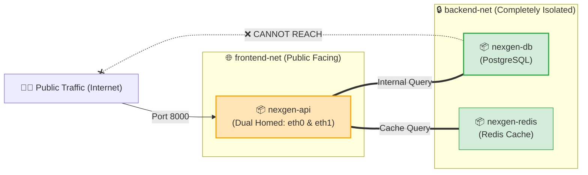

# 🛠️ Network Commands

## Network Commands কী? (What)

**Docker Network Commands** হলো Docker CLI-এর সেই সমস্ত সাব-কমান্ড যার মাধ্যমে ডকার ভার্চুয়াল নেটওয়ার্কগুলো তৈরি, পরিদর্শন, পরিচালনা এবং লাইভ কন্টেইনারে নেটওয়ার্ক ইন্টারফেস যুক্ত বা বিচ্ছিন্ন করা হয়।

এর মধ্যে প্রধান কাজগুলো হলো: কাস্টম সাবনেটসহ নেটওয়ার্ক তৈরি করা (`create`), লোকাল নেটওয়ার্কগুলোর তালিকা দেখা (`ls`), কোন কন্টেইনার কোন আইপিতে যুক্ত তা বিশ্লেষণ করা (`inspect`), **চলমান কন্টেইনারকে রিস্টার্ট না করেই লাইভ নতুন নেটওয়ার্কে কানেক্ট বা ডিসকানেক্ট করা (`connect` / `disconnect`)**, এবং অব্যবহৃত নেটওয়ার্ক পরিষ্কার করা (`rm` / `prune`)।

:::info নেটওয়ার্ক কমান্ড সিনট্যাক্স
```bash
docker network <COMMAND> [OPTIONS]
```
:::

---

## কেন Network Commands জানা দরকার? (Why)

```
❌ নেটওয়ার্ক কমান্ড না জানলে (Before):
   - কন্টেইনারের আইপি বা গেটওয়ে কী তা জানার উপায় থাকে না
   - রানিং কন্টেইনারকে অন্য নেটওয়ার্কে নিতে পুরো কন্টেইনার ডিলিট করে আবার রান করতে হয়
   - ফ্রন্টএন্ড এবং ডাটাবেজ একই আনসেগমেন্টেড নেটওয়ার্কে থাকায় সিকিউরিটি রিস্ক থাকে
   - অব্যবহৃত ভার্চুয়াল নেটওয়ার্ক জমে হোস্ট লিনাক্স ইন্টারফেসে কনফ্লিক্ট তৈরি করে

✅ নেটওয়ার্ক কমান্ডে দক্ষ হলে (After):
   - `docker network inspect` দিয়ে পলকের মধ্যে সব কন্টেইনারের আইপি ও ম্যাক অ্যাড্রেস অডিট করা যায়
   - `docker network connect` দিয়ে কন্টেইনার বন্ধ না করেই লাইভ নতুন নেটওয়ার্কে প্লাগ-ইন করা যায়
   - Network Segmentation প্যাটার্ন ব্যবহার করে এন্টারপ্রাইজ গ্রেড জিরো-ট্রাস্ট সিকিউরিটি দেওয়া যায়
   - `docker network prune` দিয়ে এক সেকেন্ডে সমস্ত পরিত্যক্ত ভার্চুয়াল নেটওয়ার্ক ক্লিন করা যায়
```

---

## Analogy — নেটওয়ার্ক প্যাচ প্যানেল ও সুইচবোর্ড অপারেটর 🎛️🔌

Network Commands-কে একটি **সার্ভার রুমের মডার্ন নেটওয়ার্ক প্যাচ প্যানেল (Patch Panel)**-এর সাথে তুলনা করা যায়:

- **`docker network create`** = সার্ভার র‍্যাকে একটি নতুন ২৪-পোর্টের গিগাবিট সুইচ স্থাপন করা।
- **`docker network inspect`** = সুইচের কোন পোর্টে কোন কম্পিউটারটি যুক্ত আছে এবং তার আইপি কত তা মনিটরে দেখা।
- **`docker network connect`** = সার্ভার বন্ধ না করেই একটি নতুন ইথারনেট প্যাচ ক্যাবল এনে চলমান সার্ভারের দ্বিতীয় নেটওয়ার্ক পোর্টে গুঁজে দেওয়া!
- **`docker network disconnect`** = সার্ভার থেকে ক্যাবলটি আলতো করে খুলে নেওয়া।
- **`docker network rm / prune`** = অব্যবহৃত পুরনো তার ও সুইচ বোর্ড ডাস্টবিনে ফেলে দেওয়া।

---

## Network Segmentation Architecture — মাল্টি-নেটওয়ার্ক প্যাটার্ন 🛡️

প্রোডাকশন লেভেলের সেরা সিকিউরিটি প্যাটার্ন হলো **Network Segmentation (নেটওয়ার্ক বিভাজন)**। 

একটি কন্টেইনার একই সাথে **একাধিক ডকার নেটওয়ার্কে** যুক্ত থাকতে পারে। আমাদের `nexgen-api` একই সাথে পাবলিক `frontend-net` এবং প্রাইভেট `backend-net` এ যুক্ত থাকবে, কিন্তু `nexgen-db` থাকবে শুধুমাত্র `backend-net` এ। ফলে কোনো বহিরাগত বা ফ্রন্টএন্ড হ্যাক হলেও ডাটাবেজে পৌঁছানো অসম্ভব!



---

## Hands-on: প্রয়োজনীয় সমস্ত Network Commands

আমাদের **NexGen AI** প্রজেক্ট দিয়ে বাস্তব কমান্ডগুলো ধাপে ধাপে শিখি:

### ১. কাস্টম সাবনেট ও গেটওয়ে সহ নেটওয়ার্ক তৈরি (`docker network create`)

```bash
# সাধারণ ব্রিজ নেটওয়ার্ক তৈরি
docker network create nexgen-frontend-net

# কাস্টম সাবনেট ও গেটওয়ে নির্ধারণ করে প্রাইভেট ডাটাবেজ নেটওয়ার্ক তৈরি
docker network create \
  --driver bridge \
  --subnet 172.28.0.0/16 \
  --gateway 172.28.0.1 \
  nexgen-backend-net
```

```bash
# নেটওয়ার্ক তালিকা দেখি
docker network ls
```

**বাস্তব Output:**
```text
NETWORK ID     NAME                   DRIVER    SCOPE
e3f2a1b4c5d6   bridge                 bridge    local
a1b2c3d4e5f6   nexgen-backend-net     bridge    local
7f8a9b0c1d2e   nexgen-frontend-net    bridge    local
```

---

### ২. নেটওয়ার্ক ইনস্পেক্ট করা (`docker network inspect`)

একটি নেটওয়ার্কে কোন কোন কন্টেইনার যুক্ত আছে, তাদের আইপি ও সাবনেট কী তা দেখার জন্য:

```bash
docker network inspect nexgen-backend-net
```

**বাস্তব JSON Output (সংক্ষিপ্ত অংশ):**
```json
[
    {
        "Name": "nexgen-backend-net",
        "Id": "a1b2c3d4e5f6...",
        "Scope": "local",
        "Driver": "bridge",
        "IPAM": {
            "Config": [
                {
                    "Subnet": "172.28.0.0/16",
                    "Gateway": "172.28.0.1"
                }
            ]
        },
        "Containers": {}
    }
]
```

:::tip সরাসরি সব কন্টেইনারের নাম ও আইপি বের করার প্রো-টিপ
```bash
docker network inspect --format '{{json .Containers}}' nexgen-backend-net
```
:::

---

### ৩. চলমান কন্টেইনারে লাইভ নেটওয়ার্ক কানেক্ট করা (`docker network connect`) ⚡

ধরি আমাদের `nexgen-api-app` কন্টেইনারটি শুরুতে শুধুমাত্র `nexgen-frontend-net` এ চালু করা হয়েছিল। এখন আমরা **কন্টেইনারটি বন্ধ না করেই** তাকে লাইভ `nexgen-backend-net` এ যুক্ত করব:

```bash
# সিনট্যাক্স: docker network connect [OPTIONS] <NETWORK> <CONTAINER>

docker network connect nexgen-backend-net nexgen-api-app
```

```bash
# ভেরিফাই করি কন্টেইনারটি এখন দুটি নেটওয়ার্কেই যুক্ত হয়েছে কিনা:
docker container inspect --format '{{range $net, $conf := .NetworkSettings.Networks}}{{$net}}: {{$conf.IPAddress}} | {{end}}' nexgen-api-app
```

**বাস্তব Output:**
```text
nexgen-frontend-net: 172.19.0.2 | nexgen-backend-net: 172.28.0.2 | 
```
*(অসাধারণ! আমাদের এপিআই কন্টেইনারটি এখন একই সাথে দুটি নেটওয়ার্কে সক্রিয় এবং দুটির সাথেই কথা বলতে পারছে!)*

---

### ৪. লাইভ নেটওয়ার্ক ডিসকানেক্ট করা (`docker network disconnect`)

যদি কোনো সার্ভিস থেকে কোনো নেটওয়ার্কের সংযোগ বিচ্ছিন্ন করতে চান:

```bash
# সিনট্যাক্স: docker network disconnect <NETWORK> <CONTAINER>

docker network disconnect nexgen-frontend-net nexgen-api-app
```

---

### ৫. নির্দিষ্ট নেটওয়ার্ক মুছে ফেলা (`docker network rm`)

```bash
# একক বা একাধিক নেটওয়ার্ক ডিলিট করা
docker network rm nexgen-frontend-net
```

**বাস্তব Output:**
```text
nexgen-frontend-net
```

:::danger নেটওয়ার্কে কন্টেইনার থাকলে ডিলিট হবে না
যদি কোনো কন্টেইনার ঐ নেটওয়ার্কে যুক্ত থাকে, তবে ডকার এরর দেবে: `network ... has active endpoints`.
সমাধান: আগে কন্টেইনার ডিসকানেক্ট বা ডিলিট করুন, তারপর নেটওয়ার্ক মুছুন।
:::

---

### ৬. সমস্ত অব্যবহৃত নেটওয়ার্ক ক্লিন করা (`docker network prune`)

কোনো কন্টেইনার ব্যবহার করছে না এমন সমস্ত পরিত্যক্ত নেটওয়ার্ক এক ক্লিকে সাফ করতে:

```bash
docker network prune -f
```

**বাস্তব Output:**
```text
Deleted Networks:
nexgen-frontend-net
test-network

Total reclaimed space: 0B
```

---

## Comparison Table — `run --network` বনাম `network connect`

| বৈশিষ্ট্য | `docker run --network <net>` | `docker network connect <net> <cont>` |
|---|---|---|
| **কখন ব্যবহৃত হয়** | কন্টেইনার প্রথমবার **তৈরি ও চালু করার সময়** | কন্টেইনার ইতিমধ্যে **চালু বা বন্ধ থাকা অবস্থায়** |
| **কন্টেইনারের অবস্থা** | নতুন কন্টেইনার জন্ম নেয় | রানিং কন্টেইনারে কোনো ডাউনটাইম ছাড়াই কার্যকর হয় |
| **নেটওয়ার্ক সংখ্যা** | শুরুতে মাত্র ১টি নেটওয়ার্কে যুক্ত হতে পারে | কন্টেইনারকে ২য়, ৩য় বা একাধিক নেটওয়ার্কে যুক্ত করতে ব্যবহৃত হয় |
| **ব্যবহারের ক্ষেত্র** | বেসিক কন্টেইনার সেটআপ | মাল্টি-নেটওয়ার্ক আর্কিটেকচার ও লাইভ কনফিগারেশন |

---

## Common Mistakes — নতুনদের সাধারণ ভুল

### ১. ডিফল্ট নেটওয়ার্কগুলো ডিলিট করার চেষ্টা করা
❌ **ভুল:** `docker network rm bridge host none` চালিয়ে ডকারের বিল্ট-ইন নেটওয়ার্ক ডিলিট করতে চাওয়া।
✅ **সঠিক:** ডকারের ডিফল্ট প্রি-ডিফাইন্ড নেটওয়ার্কগুলো সিস্টেমের অবিচ্ছেদ্য অংশ, এগুলো ডিলিট করা যায় না।

### ২. কন্টেইনারের একাধিক নেটওয়ার্কের আইপি কনফ্লিক্ট
❌ **ভুল:** ওভারল্যাপিং সাবনেট দিয়ে কাস্টম নেটওয়ার্ক তৈরি করা (যেমন দুটি নেটওয়ার্কেই `192.168.1.0/24` দেওয়া)।
✅ **সঠিক:** সবসময় ভিন্ন ভিন্ন সাবনেট রেঞ্জ ব্যবহার করুন (যেমন `172.28.0.0/16` এবং `172.29.0.0/16`)।

### ৩. একটি নেটওয়ার্ক থেকে অন্য নেটওয়ার্কের কন্টেইনারকে খোঁজা
❌ **ভুল:** `frontend-net` এর কন্টেইনার থেকে সরাসরি `backend-net` এর কন্টেইনারকে DNS দিয়ে পিং করা (নেটওয়ার্ক আলাদা থাকায় ডকার ডিএনএস একে চেনে না)।
✅ **সঠিক:** দুটি কন্টেইনারের কথা বলতে হলে তাদেরকে অন্তত **যেকোনো একটি অভিন্ন নেটওয়ার্কে** যুক্ত থাকতে হবে।

---

## Best Practices

1. **প্রোডাকশনে সাবনেট নির্দিষ্ট করে দিন**: `--subnet` ব্যবহার করলে আইপি রেঞ্জ আপনার সম্পূর্ণ নিয়ন্ত্রণে থাকে।
2. **ডাটাবেজকে সবসময় প্রাইভেট নেটওয়ার্কে রাখুন**: ফ্রন্টএন্ড ট্রাফিক থেকে ডাটাবেজ নেটওয়ার্ককে সম্পূর্ণ আলাদা রাখুন।
3. **নিয়মিত `docker network prune` চালান**: টেস্ট নেটওয়ার্কগুলো ক্লিন করে সিস্টেম হালকা রাখুন।
4. **ডকার কম্পোজ নেটওয়ার্কিং ব্যবহার করুন**: জটিল মাল্টি-নেটওয়ার্ক কনফিগারেশন `docker-compose.yml` এ লিখে স্বয়ংক্রিয় রাখুন।

---

## Interview Questions ও Answers

### ১. `docker network connect` কমান্ডের সবচেয়ে বড় প্রযুক্তিগত সুবিধা কী?

**উত্তর:** `docker network connect` কমান্ডের মাধ্যমে একটি চলমান কন্টেইনারকে **কোনো ডাউনটাইম বা রিস্টার্ট ছাড়াই** লাইভ অন্য একটি নতুন ডকার নেটওয়ার্কে সংযুক্ত করা যায়।
ডকার কার্নেল লেভেলে কন্টেইনারের নেটওয়ার্ক নেমস্পেসে সাথে সাথে একটি নতুন ভার্চুয়াল নেটওয়ার্ক ইন্টারফেস (যেমন `eth1`) ইনজেক্ট করে এবং নতুন নেটওয়ার্কের সাবনেট থেকে একটি আইপি বরাদ্দ করে। এটি মাল্টি-টায়ার সিকিউর আর্কিটেকচার বাস্তবায়নে অত্যন্ত কার্যকরী।

---

### ২. Docker Network Segmentation কী এবং কেন এটি সিকিউরিটির জন্য জরুরি?

**উত্তর:** Network Segmentation হলো একটি অ্যাপ্লিকেশনের বিভিন্ন অংশকে (যেমন পাবলিক ওয়েব সার্ভার, অ্যাপ্লিকেশন এপিআই, ব্যাকএন্ড ডাটাবেজ) আলাদা আলাদা বিচ্ছিন্ন ভার্চুয়াল ডকার নেটওয়ার্কে বিভক্ত করা।
এটি জরুরি কারণ:
- ফ্রন্টএন্ড ওয়েব সার্ভারটি যদি ইন্টারনেটের কোনো অ্যাটাকে কম্প্রোমাইজড বা হ্যাকডও হয়ে যায়, হ্যাকার সরাসরি ইন্টারনাল ডাটাবেজে ঢুকতে পারবে না; কারণ ডাটাবেজটি সম্পূর্ণ ভিন্ন একটি প্রাইভেট নেটওয়ার্কে অবস্থিত যার সাথে ফ্রন্টএন্ডের কোনো সরাসরি নেটওয়ার্ক কানেকশন নেই।

---

### ৩. `docker network inspect` কমান্ডে কী কী প্রধান তথ্য পাওয়া যায়?

**উত্তর:** `docker network inspect` কমান্ড একটি নেটওয়ার্কের সামগ্রিক কনফিগারেশনের JSON আউটপুট দেয়:
১. **IPAM (IP Address Management):** নেটওয়ার্কটির সাবনেট (Subnet) এবং গেটওয়ে (Gateway) আইপি।
২. **Containers Map:** এই নেটওয়ার্কে বর্তমানে যুক্ত সমস্ত কন্টেইনারের নাম, কন্টেইনার আইডি, নির্ধারিত IPv4/IPv6 আইপি অ্যাড্রেস এবং ম্যাক (MAC) অ্যাড্রেস।
৩. **Driver & Scope:** নেটওয়ার্কটি কোন ড্রাইভার (যেমন `bridge` বা `overlay`) দিয়ে চলছে এবং এর স্কোপ লোকাল নাকি সোয়ার্ম ক্লাস্টার।

---

### ৪. একই সাথে দুটি কন্টেইনার ভিন্ন ভিন্ন নেটওয়ার্কে থাকলে তারা কীভাবে যোগাযোগ করতে পারে?

**উত্তর:** যদি কন্টেইনার A থাকে `net-1` এ এবং কন্টেইনার B থাকে `net-2` এ, তবে তারা সরাসরি কোনোভাবেই যোগাযোগ করতে পারবে না।
যোগাযোগ স্থাপন করার দুটি উপায়:
১. `docker network connect net-1 container_B` চালিয়ে কন্টেইনার B-কেও `net-1` এ যুক্ত করে নেওয়া।
২. অথবা একটি নতুন কমন নেটওয়ার্ক (যেমন `shared-net`) বানিয়ে উভয় কন্টেইনারকে সেই নেটওয়ার্কে যুক্ত করা।

---

## Summary

| কমান্ড | সিনট্যাক্স উদাহরণ | কী কাজ করে |
|---|---|---|
| **তৈরি** | `docker network create --subnet ... <name>` | কাস্টম সাবনেটসহ নেটওয়ার্ক বানায় |
| **লিস্ট** | `docker network ls` | লোকাল সব নেটওয়ার্ক দেখে |
| **ইনস্পেক্ট** | `docker network inspect <name>` | আইপি ও যুক্ত কন্টেইনার তালিকা দেখে |
| **লাইভ কানেক্ট** | `docker network connect <net> <cont>` | চলমান কন্টেইনারে নেটওয়ার্ক যুক্ত করে |
| **ডিসকানেক্ট** | `docker network disconnect <net> <cont>` | কন্টেইনার থেকে নেটওয়ার্ক বিচ্ছিন্ন করে |
| **ডিলিট** | `docker network rm <name>` | নির্দিষ্ট নেটওয়ার্ক মুছে ফেলে |
| **ক্লিনআপ** | `docker network prune` | সমস্ত পরিত্যক্ত নেটওয়ার্ক সাফ করে |

---

## পরবর্তী ধাপ

আমরা সফলভাবে ডকার নেটওয়ার্কিং এবং কমান্ড লাইনে মাল্টি-সার্ভিস আর্কিটেকচার শিখে ফেলেছি। এবার আমরা প্রবেশ করছি ডকারের সবচেয়ে জনপ্রিয় ও প্রতীক্ষিত অংশে — **ডকার কম্পোজ (Docker Compose)**! 

পরবর্তী টপিক হলো **Docker Compose Basics** (`docker/compose-basics.md`) — যেখানে শিখব কীভাবে লম্বা লম্বা ২০টি ডকার কমান্ড বাদ দিয়ে মাত্র একটিমাত্র YAML ফাইলের মাধ্যমে আমাদের সম্পূর্ণ **NexGen AI (FastAPI + PostgreSQL + Volumes + Networks)** এক ক্লিকে পরিচালনা করতে হয়!
