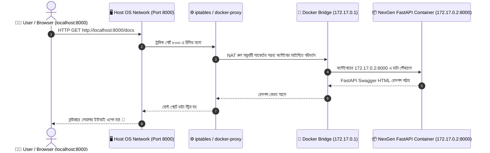
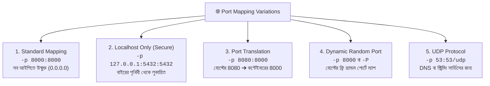

# 🌐 Port Mapping

## Port Mapping কী? (What)

**Port Mapping (পোর্ট ম্যাপিং বা Port Publishing)** হলো এমন একটি নেটওয়ার্কিং মেকানিজম, যার মাধ্যমে আপনার হোস্ট মেশিনের (Host Machine) একটি নির্দিষ্ট নেটওয়ার্ক পোর্টকে ডকার কন্টেইনারের ভেতরের একটি পোর্টের সাথে সরাসরি যুক্ত (Forward/Bridge) করে দেওয়া হয়।

সহজ ভাষায়: ডকার কন্টেইনারগুলো সম্পূর্ণ নিজস্ব একটি প্রাইভেট আইসোলেটেড নেটওয়ার্কে (`172.17.0.x` গোত্রের আইপিতে) চলে। বাইরে থেকে (যেমন আপনার ব্রাউজার, মোবাইল অ্যাপ বা ইন্টারনেট) সরাসরি কন্টেইনারের সেই প্রাইভেট আইপি দেখা যায় না। Port Mapping হোস্ট মেশিনে একটি প্রবেশদ্বার (Gateway) খুলে দেয়, যার ফলে `http://localhost:8000` এ রিকোয়েস্ট পাঠালে ডকার সেই ট্রাফিককে কন্টেইনারের ভেতরের অ্যাপ্লিকেশনে পৌঁছে দেয়।

:::info `-p` ফ্ল্যাগের মূল সিনট্যাক্স
```text
docker run -p [HOST_IP:][HOST_PORT]:<CONTAINER_PORT>[/PROTOCOL]
```
উদাহরণ: `docker run -p 8000:8000 python:3.12-slim`
- **প্রথম অংশ (বামে)**: `8000` = হোস্ট মেশিনের পোর্ট (যেখানে আপনি ব্রাউজারে হিট করবেন)।
- **দ্বিতীয় অংশ (ডানে)**: `8000` = কন্টেইনারের ভেতরের পোর্ট (যেখানে Uvicorn/FastAPI শুনছে)।
:::

---

## কেন Port Mapping অপরিহার্য? (Why)

```
❌ Port Mapping না করলে (Before):
   - কন্টেইনারে FastAPI বা PostgreSQL চলছে, কিন্তু ব্রাউজারে `localhost:8000` দিলে "Site can't be reached" দেখায়
   - কন্টেইনারের ভেতরের প্রাইভেট আইপি ম্যানুয়ালি খুঁজে কানেক্ট করতে হয় (যা অত্যন্ত জটিল ও অস্থির)
   - একই অ্যাপের ৩টি কপি একই মেশিনে চালানো যায় না (পোর্ট কনফ্লিক্ট হয়)

✅ Port Mapping সঠিকভাবে করলে (After):
   - ব্রাউজার, Postman বা যেকোনো ক্লায়েন্ট থেকে এক ক্লিকে এপিআই অ্যাক্সেস করা যায়
   - একই FastAPI অ্যাপের ৩টি আলাদা কন্টেইনার হোস্টের ৩টি ভিন্ন পোর্টে (`8001`, `8002`, `8003`) সমান্তরালে চালানো যায়
   - ডাটাবেজ পোর্ট শুধুমাত্র `127.0.0.1` (Localhost) এ বাইন্ড করে বহিরাগত হ্যাকারদের থেকে নিরাপদ রাখা যায়
```

---

## Analogy — অ্যাপার্টমেন্ট ও ইন্টারকমের উপমা 🏢📞

Port Mapping বোঝার সেরা উপমা হলো একটি **মাল্টি-স্টোরি অ্যাপার্টমেন্ট বিল্ডিং ও ইন্টারকম সিস্টেম**:

- **হোস্ট মেশিন** = পুরো অ্যাপার্টমেন্ট বিল্ডিংটির মূল গেট (যার একটি পাবলিক ঠিকানা আছে, যেমন: রোড নং ৫)।
- **Docker Container** = বিল্ডিংয়ের ভেতরে থাকা আলাদা আলাদা ফ্ল্যাট (যেমন: ফ্ল্যাট নং ১০১, ১০২)।
- **Container Port** = ফ্ল্যাটের ভেতরের দরজা (ফ্ল্যাট ১০১ এর ভেতরের পোর্ট হয়তো ৮০)।
- **Port Mapping (`-p 8080:80`)** = অ্যাপার্টমেন্টের রিসিপশন ইন্টারকমে বোতাম সেট করা — "কেউ বাইরে থেকে গেটের ৮০৮০ নম্বরে ডায়াল করলে কলটি সরাসরি ফ্ল্যাট ১০১ এর ৮০ নম্বর দরজায় ট্রান্সফার হবে।"

বাইরের ডেলিভারিম্যানকে ফ্ল্যাটের ভেতরে ঢুকতে হয় না; সে মেইন গেটের ৮০৮০ তে যোগাযোগ করলেই ফ্ল্যাটের মানুষ সাড়া দেয়।

---

## How it Works — iptables, NAT ও `docker-proxy`

যখন আপনি `-p 8000:8000` দিয়ে একটি কন্টেইনার রান করেন, ডকার ইঞ্জিন ব্যাকগ্রাউন্ডে দুটি গুরুত্বপূর্ণ কাজ করে:

1. **`docker-proxy` প্রসেস চালু করে**: এটি হোস্ট মেশিনের পোর্টে লিসেন করে এবং কোনো রিকোয়েস্ট আসলে তা কন্টেইনারের ভার্চুয়াল ইন্টারফেসে ফরোয়ার্ড করে।
2. **Linux `iptables` NAT (Network Address Translation) রুল যুক্ত করে**: হোস্ট কার্নেল লেভেলেই প্যাকেটগুলোকে ডকার ব্রিজ নেটওয়ার্কের (`docker0`) মাধ্যমে কন্টেইনারের প্রাইভেট আইপিতে রি-রুট করে দেয়।



---

## Port Mapping এর বিভিন্ন সিনট্যাক্স ও বৈচিত্র্য

ডকারে পোর্ট ম্যাপিং করার বেশ কয়েকটি ফ্লেভার রয়েছে:



---

## Hands-on: আমাদের প্রজেক্টে Port Mapping অনুশীলন

আমাদের **NexGen AI** এর FastAPI এপিআই এবং PostgreSQL ডাটাবেজ দিয়ে বিভিন্ন পোর্ট কনফিগারেশন বাস্তবে পরীক্ষা করি:

### ১. স্ট্যান্ডার্ড পোর্ট ম্যাপিং দিয়ে FastAPI রান করা

```bash
# আমাদের FastAPI কন্টেইনার রান করি (হোস্ট 8000 ➔ কন্টেইনার 8000)
docker container run -d \
  --name nexgen-api \
  -p 8000:8000 \
  python:3.12-slim \
  python3 -m http.server 8000
```
*(এখানে টেস্ট করার জন্য পাইথনের বিল্ট-ইন HTTP সার্ভার ৮০০০ পোর্টে চালাচ্ছি)*

```bash
# কন্টেইনারের পোর্ট ম্যাপিং ভেরিফাই করি
docker container port nexgen-api
```

**বাস্তব Output:**
```text
8000/tcp -> 0.0.0.0:8000
8000/tcp -> :::8000
```

```bash
# টার্মিনাল বা ব্রাউজার থেকে টেস্ট করি
curl http://localhost:8000
```

**Output:**
```html
<!DOCTYPE HTML>
<html lang="en">
<head><title>Directory listing for /</title></head>
...
```

---

### ২. পোর্ট ট্রান্সলেশন — একই অ্যাপের একাধিক কপি চালানো

ধরি আমাদের মেশিনে হোস্টের `8000` পোর্ট ইতিমধ্যে ব্যস্ত। আমরা কি আমাদের এপিআই চালাতে পারব? অবশ্যই! হোস্ট পোর্ট পরিবর্তন করে দিন:

```bash
# Instance 1: হোস্টের 8001 পোর্টে
docker container run -d --name nexgen-api-1 -p 8001:8000 python:3.12-slim python3 -m http.server 8000

# Instance 2: হোস্টের 8002 পোর্টে
docker container run -d --name nexgen-api-2 -p 8002:8000 python:3.12-slim python3 -m http.server 8000
```

```bash
# দুটি ইন্সট্যান্সই সক্রিয়ভাবে চলছে কিনা দেখি:
docker container ls --format "table {{.Names}}\t{{.Status}}\t{{.Ports}}"
```

**বাস্তব Output:**
```text
NAMES              STATUS          PORTS
nexgen-api-2       Up 5 seconds    0.0.0.0:8002->8000/tcp
nexgen-api-1       Up 15 seconds   0.0.0.0:8001->8000/tcp
```
*(দেখলেন? কন্টেইনারের ভেতরে সবাই ৮০০০ পোর্টে চলছে, কিন্তু হোস্টে তারা ৮০০১ ও ৮০০২ এ চমৎকারভাবে আইসোলেটেড!)*

---

### ৩. সিকিউর লোকালহোস্ট বাইন্ডিং (ডাটাবেজের জন্য আবশ্যক) 🔒

ডিফল্ট `-p 5432:5432` দিলে ডকার `0.0.0.0` (সমস্ত পাবলিক আইপি) তে পোর্ট এক্সপোজ করে দেয়। ফলে আপনার সার্ভারের পাবলিক আইপি জানা থাকলে যে কেউ ডাটাবেজ পোর্টে নক করতে পারে।

**নিরাপদ সমাধান:** শুধুমাত্র লোকালহোস্টে (`127.0.0.1`) ডাটাবেজ বাইন্ড করা:

```bash
# PostgreSQL শুধুমাত্র লোকালহোস্টে বাইন্ড করি
docker container run -d \
  --name nexgen-db-secure \
  -e POSTGRES_PASSWORD=supersecret \
  -p 127.0.0.1:5432:5432 \
  postgres:16-alpine
```

```bash
# পোর্ট চেক করি
docker container port nexgen-db-secure
```

**বাস্তব Output:**
```text
5432/tcp -> 127.0.0.1:5432
```
*(এখন আপনার সার্ভারের বাইরে থেকে কেউ সরাসরি ডাটাবেজে আক্রমণ করতে পারবে না। শুধুমাত্র সার্ভারের অভ্যন্তরীণ লোকালহোস্ট থেকেই কানেকশন গ্রহণ করা হবে।)*

---

### ৪. ডাইনামিক / র‍্যান্ডম পোর্ট ম্যাপিং (`-P` ও `-p <port>`)

যদি আপনি হোস্ট পোর্টের নম্বর নিয়ে মাথা ঘামাতে না চান এবং ডকারকে বলেন "হোস্টে যে পোর্ট খালি আছে সেখানে বসিয়ে দাও":

```bash
# হোস্ট পোর্ট উল্লেখ না করে শুধু কন্টেইনার পোর্ট (8000) দেওয়া
docker container run -d --name nexgen-dynamic -p 8000 python:3.12-slim python3 -m http.server 8000
```

```bash
docker container port nexgen-dynamic
```

**বাস্তব Output:**
```text
8000/tcp -> 0.0.0.0:32768
```
*(ডকার হোস্টের একটি ফ্রি হাই-রেঞ্জ পোর্ট `32768` স্বয়ংক্রিয়ভাবে বরাদ্দ করেছে! এখন `http://localhost:32768` এ হিট করলেই অ্যাপে ঢোকা যাবে।)*

---

## Comparison Table — `-p` বনাম `-P` বনাম `EXPOSE`

নতুন ডেভেলপারদের মধ্যে এই ৩টি বিষয় নিয়ে সবচেয়ে বেশি ভুল ধারণা থাকে:

| বৈশিষ্ট্য | `-p <host>:<container>` | `-P` (Publish All) | `EXPOSE` (Dockerfile) |
|---|---|---|---|
| **কোথায় ব্যবহৃত হয়** | `docker run` কমান্ডে | `docker run` কমান্ডে | `Dockerfile` ফাইলে |
| **আসল পোর্ট ওপেন করে?** | ✅ **হ্যাঁ, ১০০% বাস্তব পোর্ট ফরোয়ার্ড করে** | ✅ **হ্যাঁ, র‍্যান্ডম পোর্টে ওপেন করে** | ❌ **না, কোনো পোর্ট ওপেন করে না** |
| **হোস্ট পোর্ট কন্ট্রোল** | আপনি নিজে স্পেসিফিক পোর্ট ঠিক করেন | ডকার স্বয়ংক্রিয় র‍্যান্ডম পোর্ট দেয় | প্রযোজ্য নয় |
| **মূল উদ্দেশ্য** | ব্রাউজার/হোস্ট থেকে ট্রাফিক পাঠানো | টেস্টিংয়ে পোর্ট কনফ্লিক্ট এড়ানো | 📝 শুধু ডকুমেন্টেশন ও মেটাডেটা |

:::warning `EXPOSE` কোনো পোর্ট ওপেন করে না!
ডকারফাইলে `EXPOSE 8000` লেখার অর্থ এই নয় যে ব্রাউজারে `localhost:8000` এ অ্যাপ পাওয়া যাবে। `EXPOSE` হলো শুধুমাত্র ডেভেলপারদের বোঝার জন্য একটি **ডকুমেন্টেশন নোট**। বাইরে থেকে অ্যাক্সেস করতে হলে `docker run` করার সময় অবশ্যই **`-p` ফ্ল্যাগ দিতেই হবে**।
:::

---

## Troubleshooting — Port Conflicts (`bind: address already in use`)

ডকারে সবচেয়ে কমন এরর হলো পোর্ট কনফ্লিক্ট:

```text
docker: Error response from daemon: driver failed programming external connectivity on endpoint nexgen-api: 
Bind for 0.0.0.0:8000 failed: port is already allocated.
```

### কেন এই এরর আসে?
হোস্ট মেশিনে ইতিমধ্যে অন্য কোনো প্রোগ্রাম বা পূর্বের কোনো ডকার কন্টেইনার `8000` পোর্ট দখল করে রেখেছে।

### সমাধান করার ৩টি ধাপ:

#### ধাপ ১: কোন প্রসেস বা কন্টেইনার পোর্টটি দখল করে আছে তা বের করুন:
```bash
# লিনাক্স বা ম্যাক-এ:
sudo lsof -i :8000
# অথবা:
sudo netstat -tulpn | grep 8000

# উইন্ডোজ পাওয়ারশেলে:
Get-Process -Id (Get-NetTCPConnection -LocalPort 8000).OwningProcess
```

#### ধাপ ২: যদি কোনো পুরনো ডকার কন্টেইনার হয়, তাকে বন্ধ করুন:
```bash
# কোন কন্টেইনার ৮০০০ পোর্টে চলছে তা দেখা
docker ps --filter "publish=8000"

# কন্টেইনারটি বন্ধ করা
docker stop <container_name>
```

#### ধাপ ৩: অথবা নতুন কন্টেইনারের হোস্ট পোর্ট পরিবর্তন করে দিন:
```bash
docker run -p 8080:8000 python:3.12-slim ...
```

---

## Common Mistakes — নতুনদের সাধারণ ভুল

### ১. হোস্ট পোর্ট এবং কন্টেইনার পোর্ট উল্টো লেখা
❌ **ভুল:** `docker run -p 8000:80` দিয়ে ভাবা যে কন্টেইনারের ৮০ পোর্ট হোস্টে ৮০ তে চলছে।
✅ **সঠিক:** সূত্র মনে রাখুন: **`HOST : CONTAINER` (বাইরে : ভেতরে)**। প্রথমটি হোস্টের পোর্ট, দ্বিতীয়টি কন্টেইনারের পোর্ট।

### ২. Uvicorn বা FastAPI অ্যাপে `127.0.0.1` এ হোস্ট বাইন্ড করা
❌ **ভুল:** কন্টেইনারের ভেতরে FastAPI সার্ভার চালানোর সময় `uvicorn main:app --host 127.0.0.1` দেওয়া। (এতে কন্টেইনার শুধুমাত্র তার ভেতরের লোকাল লুপব্যাকে লিসেন করে, ফলে `-p 8000:8000` দিলেও বাইরে থেকে ট্রাফিক ঢুকতে পারে না)।
✅ **সঠিক:** কন্টেইনারের ভেতরে চলা যেকোনো সার্ভারকে সবসময় **`0.0.0.0`** তে বাইন্ড করতে হবে: `uvicorn main:app --host 0.0.0.0 --port 8000`।

### ৩. প্রোডাকশনে ডাটাবেজ পোর্ট পাবলিকলি উন্মুক্ত করে দেওয়া
❌ **ভুল:** প্রোডাকশন সার্ভারে `-p 5432:5432` দিয়ে ডাটাবেজ রান করা (ইন্টারনেটে পাসওয়ার্ড ব্রুটফোর্সের সুযোগ তৈরি হয়)।
✅ **সঠিক:** ডাটাবেজ যদি হোস্টের বাইরে থেকে অ্যাক্সেস করার দরকার না থাকে, তবে কোনো `-p` দেবেন না (ডকার নেটওয়ার্কের মাধ্যমে এপিআই কানেক্ট হবে) অথবা দিলে `-p 127.0.0.1:5432:5432` দিন।

---

## Best Practices

1. **কন্টেইনারের ভেতরের সার্ভারকে `0.0.0.0` তে লিসেন করান**: FastAPI/Uvicorn, Django, Node.js — যা-ই হোক না কেন, কন্টেইনারের ভেতরে হোস্ট সবসময় `0.0.0.0` রাখবেন।
2. **ডাটাবেজ পোর্ট বাইন্ডিংয়ে সতর্কতা**: ক্লাউড সার্ভারে ডাটাবেজের জন্য `-p 127.0.0.1:5432:5432` ব্যবহার করুন।
3. **কন্টেইনার পোর্ট ম্যাপিং দেখতে `docker port` ব্যবহার করুন**: কোন কন্টেইনার কোন পোর্টে ফরওয়ার্ড হয়েছে তা দ্রুত দেখতে `docker container port <name>` চালান।
4. **মাইক্রোসার্ভিসের পোর্ট ম্যাপিং ডকার কম্পোজে সংজ্ঞায়িত করুন**: একাধিক সার্ভিসের পোর্ট সংঘর্ষ এড়াতে ডকার কম্পোজ ফাইল ব্যবহার করা স্ট্যান্ডার্ড।

---

## Interview Questions ও Answers

### ১. Dockerfile-এর `EXPOSE` এবং `docker run -p` এর মধ্যে প্রযুক্তিগত পার্থক্য কী?

**উত্তর:** 
- `EXPOSE`: এটি কেবল একটি মেটাডেটা বা ডকুমেন্টেশন নির্দেশিকা। এটি ইমেজ তৈরিকারীর পক্ষ থেকে নির্দেশ করে যে কন্টেইনারটি রান করলে এর ভেতরে অ্যাপ্লিকেশনটি কোন পোর্টে চলবে (যেমন `EXPOSE 8000`)। এটি হোস্ট মেশিনের কোনো পোর্ট ওপেন করে না বা কোনো নেটওয়ার্ক ট্রাফিক রাউট করে না।
- `docker run -p`: এটি একটি সক্রিয় নেটওয়ার্কিং কমান্ড। এটি হোস্ট অপারেটিং সিস্টেমের কার্নেলে `iptables` রুল এবং `docker-proxy` প্রসেস সক্রিয় করে হোস্ট পোর্টের সাথে কন্টেইনার পোর্টের একটি বাস্তব দ্বিমুখী সংযোগ (Port Forwarding) তৈরি করে।

---

### ২. `0.0.0.0:8000:8000` এবং `127.0.0.1:8000:8000` এর মধ্যে নিরাপত্তার পার্থক্য কী?

**উত্তর:** 
- `0.0.0.0:8000:8000` (বা শুধু `-p 8000:8000`): এটি হোস্ট মেশিনের সমস্ত নেটওয়ার্ক ইন্টারফেসে (লোকালহোস্ট, প্রাইভেট ল্যান আইপি, এবং পাবলিক ইন্টারনেট আইপি) পোর্টটি উন্মুক্ত করে দেয়। ফলে ইন্টারনেটের যে কেউ আপনার সার্ভারের পাবলিক আইপি দিয়ে অ্যাপে ঢুকতে পারে।
- `127.0.0.1:8000:8000`: এটি শুধুমাত্র হোস্ট মেশিনের লোকাল লুপব্যাক ইন্টারফেসে পোর্টটি বাইন্ড করে। ফলে বাইরের ইন্টারনেট বা লোকাল নেটওয়ার্কের অন্য কম্পিউটার থেকে এই পোর্টে কোনোভাবেই প্রবেশ করা সম্ভব নয়; শুধুমাত্র ঐ নির্দিষ্ট হোস্ট সার্ভারের ভেতর থেকেই এটি অ্যাক্সেস করা যাবে।

---

### ৩. Docker কীভাবে হোস্টের রিকোয়েস্টকে কন্টেইনারের পোর্টে পৌঁছে দেয়?

**উত্তর:** ডকার মূলত দুটি মেকানিজম ব্যবহার করে:
১. **`iptables` NAT রুলস**: লিনাক্স কার্নেলের নেটফিল্টার ফ্রেমওয়ার্ক ব্যবহার করে হোস্ট পোর্টে আসা টিসিপি/ইউডিপি প্যাকেটগুলোর ডেস্টিনেশন আইপি ও পোর্ট পরিবর্তন করে কন্টেইনারের ভার্চুয়াল ইন্টারফেস আইপিতে রি-ডাইরেক্ট করে দেয়।
২. **`docker-proxy`**: ইউজার স্পেসে চলা একটি ছোট প্রক্সি প্রসেস যা হোস্ট পোর্টে লিসেন করে এবং প্যাকেটগুলোকে কন্টেইনারে ফরোয়ার্ড করে।

---

### ৪. কেন কন্টেইনারের ভেতরের সার্ভারকে `127.0.0.1` এর বদলে `0.0.0.0` তে রান করাতে হয়?

**উত্তর:** কন্টেইনারের নিজস্ব একটি আলাদা নেটওয়ার্ক নেমস্পেস থাকে। কন্টেইনারের ভেতরে `127.0.0.1` মানে শুধুই কন্টেইনারের নিজস্ব অভ্যন্তরীণ লুপব্যাক। যদি সার্ভারটি `127.0.0.1` এ লিসেন করে, তবে ডকার ব্রিজের ভার্চুয়াল নেটওয়ার্ক অ্যাডাপ্টার (`eth0`) থেকে আসা কোনো প্যাকেট সে গ্রহণ করবে না। কিন্তু `0.0.0.0` তে লিসেন করালে সার্ভারটি কন্টেইনারের যেকোনো নেটওয়ার্ক ইন্টারফেস থেকে আসা সমস্ত ট্রাফিক সানন্দে রিসিভ করে।

---

## Summary

| কনসেপ্ট | সিনট্যাক্স | বিবরণ |
|---|---|---|
| **স্ট্যান্ডার্ড ম্যাপিং** | `-p 8000:8000` | হোস্টের 8000 ➔ কন্টেইনারের 8000 (সবার জন্য উন্মুক্ত) |
| **পোর্ট পরিবর্তন** | `-p 8080:8000` | হোস্টের 8080 ➔ কন্টেইনারের 8000 |
| **লোকালহোস্ট বাইন্ড** | `-p 127.0.0.1:5432:5432` | শুধু হোস্টের ভেতর থেকে অ্যাক্সেসযোগ্য (সিকিউর) |
| **ডাইনামিক পোর্ট** | `-p 8000` বা `-P` | হোস্টের যেকোনো ফ্রি র‍্যান্ডম পোর্ট অ্যাসাইন করে |
| **ম্যাপিং চেক** | `docker port <name>` | কন্টেইনারের পোর্ট কনফিগারেশন দেখায় |
| **ভেতরের রুল** | `HOST:CONTAINER` | বামে হোস্ট পোর্ট, ডানে কন্টেইনার পোর্ট |

---

## পরবর্তী ধাপ

আমরা সফলভাবে ডকার পোর্ট ম্যাপিং এবং নেটওয়ার্ক ট্রাফিক রাউটিংয়ের আদ্যোপান্ত শিখে ফেলেছি। পরবর্তী টপিকে আমরা দেখব **Environment Variables** (`docker/env-vars.md`) — যেখানে শিখব কীভাবে হার্ডকোডিং ছাড়া ডকার কন্টেইনারে সিক্রেট কি, ডাটাবেজ পাসওয়ার্ড এবং কনফিগারেশন ইনজেক্ট করতে হয় (`-e`, `--env-file` ইত্যাদি)।
