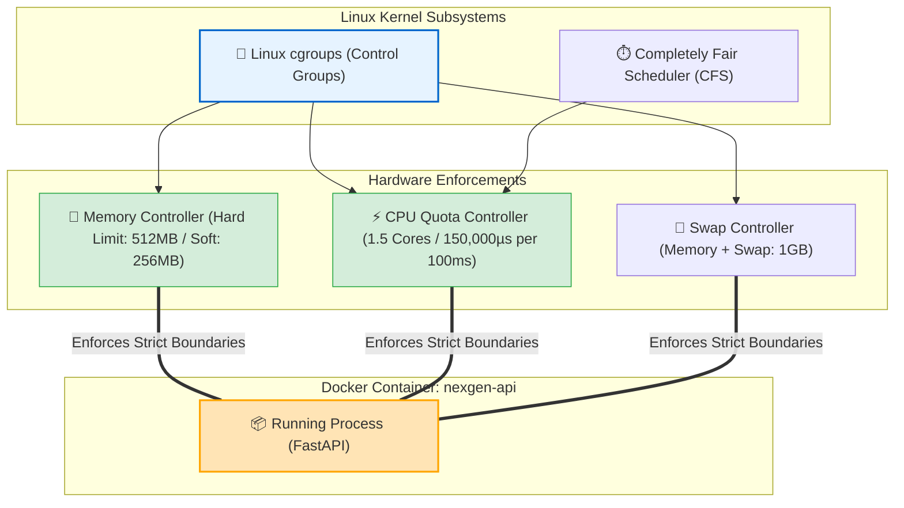

# ⚡ Resource Management

## Resource Management কী? (What)

**Docker Resource Management (রিসোর্স ব্যবস্থাপনা)** হলো লিনাক্স কার্নেলের **Control Groups (cgroups)** সাবসিস্টেম ব্যবহার করে একটি ডকার কন্টেইনার কতটুকু **CPU প্রসেসিং পাওয়ার, RAM মেমরি, Swap স্পেস এবং ডিস্ক I/O** ব্যবহার করতে পারবে তার সুনির্দিষ্ট সীমারেখা (Quota & Boundaries) নির্ধারণ ও নিয়ন্ত্রণ করার মেকানিজম।

সহজ ভাষায়: ডকার কন্টেইনারগুলো একই হোস্ট মেশিনের শেয়ার্ড হার্ডওয়্যার ব্যবহার করে। রিসোর্স ম্যানেজমেন্ট হলো একটি **ডিজিটাল পাওয়ার রেগুলেটর বা সার্কিট ব্রেকার**, যা নিশ্চিত করে যে একটিমাত্র মেমরি-লোভী কন্টেইনার যেন পুরো সার্ভারের সমস্ত র‍্যাম ও সিপিইউ দখল করে বাকি সার্ভিসগুলোকে অচল না করে দেয়।

:::info cgroups এর ভূমিকা
কন্টেইনার আইসোলেশনের জন্য যেমন **Namespaces** দায়ী, ঠিক তেমনি কন্টেইনারের রিসোর্স নিয়ন্ত্রণ করার জন্য কার্নেলের **cgroups (Control Groups)** প্রযুক্তি ব্যবহৃত হয়।
:::

---

## কেন Resource Management অপরিহার্য? (Why)

```
❌ রিসোর্স লিমিট ছাড়া প্রোডাকশনে কন্টেইনার চালালে (The Server Crash 💥):
   - ১টি এপিআই কন্টেইনারে মেমরি লিক হলো এবং সে হোস্টের ১৬ জিবি র‍্যামের সবটুকু খেয়ে নিল
   - কার্নেল প্যানিক করে পুরো ফিজিক্যাল সার্ভার রিস্টার্ট হয়ে গেল
   - ডাটাবেজ, ক্যাশ এবং সমস্ত গ্রাহকের লাইভ ট্রাফিক সম্পূর্ণ ডাউন! (Noisy Neighbor Disaster)

✅ রিসোর্স ম্যানেজমেন্ট কনফিগার করলে (Enterprise Stability 🛡️):
   - এপিআই কন্টেইনারকে ফিক্সড `512MB` মেমরি ক্যাপ দেওয়া হলো
   - মেমরি লিক হলেও শুধুমাত্র ঐ নির্দিষ্ট কন্টেইনারটি `Exit 137` খেয়ে রিস্টার্ট হবে, মূল হোস্ট সার্ভার বা ডাটাবেজের ১% ক্ষতিও হবে না!
   - ক্রিটিকাল ডাটাবেজের জন্য ২ কোর CPU এবং ২ জিবি র‍্যাম গ্যারান্টেড রিজার্ভ থাকবে
```

---

## Analogy — অ্যাপার্টমেন্টের বিদ্যুৎ মিটার ও মেইন সার্কিট ব্রেকার 🏢⚡

Resource Management-কে একটি **মাল্টি-ফ্যামিলি অ্যাপার্টমেন্টের ইলেকট্রিক মিটার ও মেইন সার্কিট ব্রেকার (Circuit Breaker)**-এর সাথে তুলনা করা যায়:

- **Host Machine** = পুরো অ্যাপার্টমেন্ট বিল্ডিংয়ের মূল বিদ্যুৎ গ্রিড।
- **Docker Containers** = আলাদা আলাদা ফ্ল্যাটের ভাড়াটিয়ারা (ফ্ল্যাট ১ = FastAPI, ফ্ল্যাট ২ = Database)।
- **Resource Limits (`--memory 512m`, `--cpus 1.0`)** = প্রতিটি ফ্ল্যাটের নিজস্ব ৫-অ্যাম্পিয়ার সার্কিট ব্রেকার।

ফ্ল্যাট ১ এর ভাড়াটিয়া যদি অতিরিক্ত হিটার চালিয়ে শর্ট সার্কিট করে, তবে শুধুমাত্র তার ফ্ল্যাটের ব্রেকারটি ট্রিপ (OOMKilled) করবে। পুরো বিল্ডিংয়ের বিদ্যুৎ কখনোই যাবে না!

---

## How it Works — cgroups ও CFS Scheduler আর্কিটেকচার 🔬



---

## ১. Memory Management (র‍্যাম ও সোয়াপ নিয়ন্ত্রণ) 💾

ডকারে মেমরি নিয়ন্ত্রণের প্রধান ফ্ল্যাগসমূহ:

### ক. Memory Hard Limit (`-m` বা `--memory`)
কন্টেইনারটি সর্বোচ্চ কতটুকু মেমরি বরাদ্দ পাবে। এটি অতিক্রম করলেই লিনাক্স কার্নেলের OOM Killer কন্টেইনারকে মেরে ফেলবে।
```bash
docker run -d --name api -m 512m nexgen-api:1.0.0
```

### খ. Memory Soft Limit / Reservation (`--memory-reservation`)
স্বাভাবিক অবস্থায় কন্টেইনারের জন্য এই পরিমাণ মেমরি সংরক্ষিত থাকে। হোস্ট মেশিনে মেমরি সংকট দেখা দিলে ডকার কন্টেইনারটিকে এই সীমার মধ্যে নামিয়ে আনে।
```bash
docker run -d --name api -m 512m --memory-reservation 256m nexgen-api:1.0.0
```

### গ. Swap Memory Limit (`--memory-swap`)
র‍্যামের সাথে ভার্চুয়াল ডিস্ক সোয়াপের মোট যোগফল নির্ধারণ করে।
```bash
# মোট মেমরি + সোয়াপ = ১ জিবি (যার মধ্যে ৫১২ এমবি র‍্যাম, ৫১২ এমবি সোয়াপ)
docker run -d -m 512m --memory-swap 1g nexgen-api:1.0.0

# সোয়াপ সম্পূর্ণ বন্ধ করতে (র‍্যাম এবং সোয়াপ সমান মান দেওয়া):
docker run -d -m 512m --memory-swap 512m nexgen-api:1.0.0
```

:::danger `--memory-swap` এর ফাঁদ!
`--memory-swap` মানে শুধু সোয়াপের সাইজ নয়; এটি **`Memory + Swap` এর সর্বমোট যোগফল**। অর্থাৎ `-m 512m --memory-swap 1g` দিলে সোয়াপের সাইজ হবে `1024MB - 512MB = 512MB`।
:::

---

## ২. CPU Management (প্রসেসিং পাওয়ার নিয়ন্ত্রণ) ⚡

### ক. CPU Quota (`--cpus`)
কন্টেইনারটি সর্বোচ্চ কয়টি কোর ব্যবহার করতে পারবে তা দশমিক সংখ্যায় নির্ধারণ করা:
```bash
# কন্টেইনার সর্বোচ্চ ১.৫টি CPU কোর ব্যবহার করতে পারবে
docker run -d --name api --cpus="1.5" nexgen-api:1.0.0

# কন্টেইনারকে আধা কোর (০.৫ কোর) দেওয়া
docker run -d --name worker --cpus="0.5" nexgen-worker:1.0.0
```

### খ. Core Pinning (`--cpuset-cpus`) 🎯
কন্টেইনারটিকে সুনির্দিষ্ট ফিজিক্যাল CPU কোরে ফিক্সড (Pin) করে দেওয়া:
```bash
# শুধুমাত্র কোর ০ এবং কোর ১ এ চলবে
docker run -d --name db --cpuset-cpus="0,1" postgres:16-alpine
```

### গ. CPU Shares / Relative Priority (`-c` বা `--cpu-shares`)
হোস্টে সিপিইউ চাপ বেশি থাকলে সার্ভিসের আপেক্ষিক অগ্রাধিকার নির্ধারণ করা (ডিফল্ট ভ্যালু: 1024):
```bash
# হাই-প্রায়োরিটি ডাটাবেজ (বেশি CPU সাইকেল পাবে)
docker run -d --name db --cpu-shares 1024 postgres:16-alpine

# লো-প্রায়োরিটি ব্যাকগ্রাউন্ড স্ক্রিপ্ট
docker run -d --name scraper --cpu-shares 512 scraper:latest
```

---

## ৩. Live Dynamic Resource Update (`docker update`) 🔄

ডকারের একটি দুর্দান্ত ক্ষমতা হলো— **কন্টেইনার বন্ধ বা রিস্টার্ট না করেই** রানিং কন্টেইনারের মেমরি বা সিপিইউ লাইভ বাড়িয়ে বা কমিয়ে দেওয়া যায়!

```bash
# সিনট্যাক্স: docker update [OPTIONS] CONTAINER [CONTAINER...]

# রানিং কন্টেইনারের মেমরি বাড়িয়ে ১ জিবি এবং সিপিইউ ২ কোর করা
docker update --memory 1024m --memory-reservation 512m --cpus 2.0 nexgen-api-prod
```

**বাস্তব Output:**
```text
nexgen-api-prod
```
*(জিরো ডাউনটাইমে কন্টেইনারের মেমরি দ্বিগুণ হয়ে গেল!)*

---

## Hands-on: আমাদের NexGen AI কন্টেইনারের রিসোর্স টেস্ট

```bash
# আমাদের সম্পূর্ণ সুরক্ষিত হার্ডেন্ড কন্টেইনার রান করি
docker container run -d \
  --name nexgen-api-hardened \
  -p 8000:8000 \
  -m 512m \
  --memory-reservation 256m \
  --cpus "1.0" \
  --cpuset-cpus "0" \
  nexgen-api:1.0.0
```

```bash
# রিয়েল-টাইম লাইভ ড্যাশবোর্ড দেখা
docker stats nexgen-api-hardened
```

**বাস্তব লাইভ ড্যাশবোর্ড Output:**
```text
CONTAINER ID   NAME                  CPU %     MEM USAGE / LIMIT   MEM %     NET I/O          BLOCK I/O
a1b2c3d4e5f6   nexgen-api-hardened   0.24%     58.3MiB / 512MiB    11.39%    1.5kB / 920B     0B / 0B
```

---

## Comparison Table — CPU ও Memory নিয়ন্ত্রণের সারসংক্ষেপ

| রিসোর্স টাইপ | ফ্ল্যাগ / অপশন | কী কাজ করে |
|---|---|---|
| **Memory Hard Limit** | `-m 512m` | সর্বোচ্চ মেমরি বাউন্ডারি (ক্রস করলে OOMKill) |
| **Memory Soft Limit** | `--memory-reservation 256m` | হোস্ট সংকটে পড়লে মেমরি সংকোচন সীমা |
| **Swap Limit** | `--memory-swap 1g` | মেমরি + সোয়াপের মোট যোগফল |
| **CPU Quota** | `--cpus 1.5` | কতগুলো কোরের সমপরিমাণ ক্ষমতা পাবে |
| **Core Pinning** | `--cpuset-cpus "0,2"` | নির্দিষ্ট ফিজিক্যাল কোরে প্রসেসকে লক করে |
| **CPU Priority** | `--cpu-shares 512` | সিপিইউ কনজেশনে আপেক্ষিক অগ্রাধিকার |
| **লাইভ আপডেট** | `docker update` | রানিং কন্টেইনারে লাইভ রিসোর্স পরিবর্তন |

---

## Common Mistakes — নতুনদের সাধারণ ভুল

### ১. `--memory-swap` এর মান মেমরির চেয়ে কম দেওয়া
❌ **ভুল:** `docker run -m 512m --memory-swap 256m ...` দেওয়া (সোয়াপ টোটাল মেমরির চেয়ে কম হতে পারে না, ডকার এরর দেবে)।
✅ **সঠিক:** সোয়াপ বন্ধ করতে মেমরির সমান দিন: `-m 512m --memory-swap 512m`।

### ২. ডাটাবেজে সিপিইউ লিমিট খুব কম দিয়ে রিকোয়েস্ট টাইমআউট করা
❌ **ভুল:** PostgreSQL ডাটাবেজে `--cpus 0.1` দেওয়া (জটিল কোয়েরি প্রসেস হতে ৫ সেকেন্ড লেগে এপিআই টাইমআউট হবে)।
✅ **সঠিক:** ডাটাবেজের জন্য সর্বদা পর্যাপ্ত কোর (যেমন `--cpus 2.0`) বরাদ্দ রাখুন।

### ৩. `docker stats` না দেখে অন্ধকারে লিমিট আন্দাজ করা
❌ **ভুল:** অ্যাপ্লিকেশন আসলে কত মেমরি নেয় তা না জেনেই আন্দাজে কম মেমরি লিমিট দিয়ে OOM ক্র্যাশ করানো।
✅ **সঠিক:** আগে `docker stats` দিয়ে পিক লোডে মেমরি পর্যবেক্ষণ করুন, তারপর তার চেয়ে ২০-৩০% বেশি বাফার রেখে লিমিট দিন।

---

## Best Practices

1. **প্রোডাকশন কন্টেইনারে সবসময় `-m` ও `--cpus` ব্যবহার করুন**: এটি সিস্টেম ক্র্যাশ থেকে সম্পূর্ণ সুরক্ষিত রাখে।
2. **ডাটাবেজে Memory Reservation দিন**: ডাটাবেজ যেন সর্বদা তার প্রয়োজনীয় বাফার মেমরি পেয়ে থাকে।
3. **লাইভ আপগ্রেডের জন্য `docker update` ব্যবহার করুন**: ট্রাফিক স্পাইক আসলে কন্টেইনার রিস্টার্ট ছাড়াই রিসোর্স বাড়ান।
4. **সিআই/সিডি অটোমেশনে কন্টেইনার স্ট্রেস টেস্ট করুন**: লোড টেস্টিংয়ের সময় মেমরি লিক পরীক্ষা করুন।

---

## Interview Questions ও Answers

### ১. Docker-এ cgroups (Control Groups) কীভাবে কন্টেইনারের রিসোর্স নিয়ন্ত্রণ করে?

**উত্তর:** লিনাক্স কার্নেলের cgroups হলো এমন একটি সাবসিস্টেম যা প্রসেসগুলোকে একটি হায়ারার্কিকাল গ্রুপে সাজিয়ে তাদের হার্ডওয়্যার রিসোর্স (CPU, Memory, Disk I/O, Network) ব্যবহার কঠোরভাবে নিয়ন্ত্রণ করে। 
ডকার যখন কোনো কন্টেইনার রান করে (যেমন `-m 512m`), ডকার ইঞ্জিন লিনাক্স কার্নেলে ঐ কন্টেইনারের জন্য একটি ডেডিকেটেড cgroup তৈরি করে এবং মেমরি কন্ট্রোলারের `memory.max` বা `memory.limit_in_bytes` ফাইলে ৫১২ এমবি লিখে দেয়। লিনাক্স কার্নেল তখন প্রতিটি মেমরি অ্যালোকেশন ট্র্যাক করে এবং কন্টেইনারটিকে তার সীমার ভেতর আটকে রাখে।

---

### ২. `--memory` (Hard Limit) এবং `--memory-reservation` (Soft Limit) এর মধ্যে পার্থক্য কী?

**উত্তর:** 
- **`--memory` (Hard Limit):** এটি কন্টেইনারের জন্য একটি অপরিবর্তনযোগ্য সর্বোচ্চ মেমরি ক্যাপ। কন্টেইনার এই সীমা স্পর্শ করার সাথে সাথে কার্নেল তাকে থামিয়ে দেয় এবং অতিরিক্ত মেমরি চাইলে তৎক্ষণাৎ OOM Killer সক্রিয় হয়ে কন্টেইনারের প্রসেসটি বন্ধ করে দেয়।
- **`--memory-reservation` (Soft Limit):** এটি একটি নমনীয় বা বাফার সীমা। হোস্ট সিস্টেমে পর্যাপ্ত মেমরি খালি থাকা পর্যন্ত কন্টেইনারটি সফট লিমিটের চেয়ে বেশি মেমরি ব্যবহার করতে পারে। কিন্তু যখনই হোস্ট মেশিনে সামগ্রিক মেমরি সংকট বা কনজেশন তৈরি হয়, লিনাক্স কার্নেল অগ্রাধিকার ভিত্তিতে এই কন্টেইনারের মেমরি কমিয়ে তার সফট লিমিটে নামিয়ে আনে।

---

### ৩. `docker update` কমান্ডের বাস্তব গুরুত্ব কী?

**উত্তর:** `docker update` কমান্ডের মাধ্যমে একটি সক্রিয় ও চলমান (Running) ডকার কন্টেইনারকে কোনো রিস্টার্ট বা ডাউনটাইম ছাড়াই লাইভ তার CPU, Memory, Swap বা Block I/O কোটা পরিবর্তন করা যায়। 
বাস্তব জীবনে ব্ল্যাক ফ্রাইডে বা বিশেষ ইভেন্টে যখন কোনো সার্ভিস বা ডাটাবেজে আকস্মিক বিপুল ট্রাফিক স্পাইক আসে, তখন সার্ভিস বন্ধ না করেই নিমেষে `docker update --cpus 4 --memory 8g <container>` দিয়ে তাৎক্ষণিক রিসোর্স স্কেলিং করা যায়।

---

### ৪. `--cpus="1.5"` ডকার কীভাবে লিনাক্স কার্নেল সিএফএস (CFS) শিডিউলারে হ্যান্ডল করে?

**উত্তর:** লিনাক্স কার্নেলের Completely Fair Scheduler (CFS) একটি নির্দিষ্ট টাইম পিরিয়ড (ডিফল্ট: ১০০,০০০ মাইক্রোসেকেন্ড বা ১০০ মিলিসেকেন্ড) ধরে প্রসেসকে সিপিইউ বরাদ্দ করে।
যখন `--cpus="1.5"` দেওয়া হয়, ডকার কার্নেলকে নির্দেশ দেয় যে প্রতি ১০০ মিলিসেকেন্ডের পিরিয়ডে এই কন্টেইনারটি সর্বমোট `1.5 x 100,000 = 150,000` মাইক্রোসেকেন্ড পরিমাণ CPU টাইম ব্যবহার করতে পারবে (তা সে একটি একক কোরে হোক বা একাধিক কোরে সমান্তরালে ভাগ হয়ে হোক)।

---

## Summary

| বিষয় | কমান্ড / মেথড | ভূমিকা |
|---|---|---|
| **র‍্যাম লিমিট** | `-m 512m` | হার্ড মেমরি বাউন্ডারি |
| **সফট মেমরি** | `--memory-reservation 256m` | হোস্টের মেমরি সংকটে সংকোচন সীমা |
| **সিপিইউ কোটা** | `--cpus 1.5` | প্রসেসর কোরের আনুপাতিক ক্ষমতা |
| **কোর পিন** | `--cpuset-cpus "0,1"` | নির্দিষ্ট ফিজিক্যাল সিপিইউতে লক করা |
| **লাইভ স্কেল** | `docker update` | রানিং কন্টেইনারে জিরো-ডাউনটাইম রিসোর্স পরিবর্তন |
| **মনিটর** | `docker stats` | লাইভ সিপিইউ ও মেমরি পর্যবেক্ষণ |

---

# 🎓 LEVEL 2: INTERMEDIATE সমাপ্ত! 🏆

**অসাধারণ ও অবিশ্বাস্য অর্জন!** আপনি সফলভাবে **Docker-এর Level 1 (Foundation) এবং Level 2 (Intermediate) এর সমস্ত ৩৫টি টপিক** সম্পূর্ণ গভীরভাবে সম্পন্ন করেছেন!

এখন আপনি:
- 📜 স্ক্র্যাচ থেকে প্রোডাকশন-রেডি এন্টারপ্রাইজ ডকারফাইল লিখতে পারেন
- 🚀 Multi-Stage Build দিয়ে ইমেজ সাইজ ৮৫% অপ্টিমাইজ করতে পারেন
- 💾 Docker Volumes এবং Live Bind Mounts (Hot-Reload) দিয়ে ডেটা ও ডেভেলপমেন্ট আর্কিটেকচার ডিজাইন করতে পারেন
- 🌐 User-Defined Bridge, Embedded DNS, এবং Network Segmentation দিয়ে কন্টেইনারদের সুরক্ষিতভাবে কানেক্ট করতে পারেন
- 🐙 Docker Compose দিয়ে সম্পূর্ণ মাল্টি-সার্ভিস স্ট্যাক (FastAPI + PostgreSQL + Redis + Nginx) এক ক্লিকে পরিচালনা ও স্কেল করতে পারেন
- 🩺 প্রোডাকশন লগিং ড্রাইভার্স, OOM ডিবাগিং এবং cgroups রিসোর্স ম্যানেজমেন্টে একজন সিনিয়র DevOps ইঞ্জিনিয়ারের মতো দক্ষ!

---

🎉 **আপনার ডকার কমপ্লিট মাস্টারক্লাস ডকুমেন্টেশন সম্পূর্ণ প্রস্তুত ও লাইভ!** 🚀
