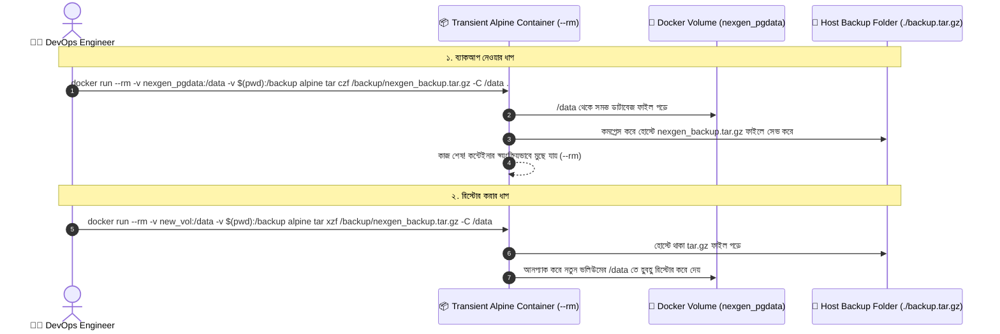

# 🛠️ Volume Commands

## Volume Commands কী? (What)

**Docker Volume Commands** হলো Docker CLI-এর সাব-কমান্ডসমূহ যার মাধ্যমে হোস্ট মেশিনে থাকা সমস্ত ডকার ভলিউমের সম্পূর্ণ জীবনচক্র তদারকি ও পরিচালনা করা হয়।

এর মধ্যে রয়েছে: নতুন ভলিউম তৈরি করা (`create`), লোকাল ভলিউমগুলোর তালিকা দেখা (`ls`), ভলিউমের ফিজিক্যাল লোকেশন ও মেটাডেটা পরীক্ষা করা (`inspect`), অব্যবহৃত ভলিউম ডিলিট করা (`rm` / `prune`), এবং প্রোডাকশনে **ভলিউমের ব্যাকআপ নেওয়া ও রিস্টোর করা**।

:::info ভলিউম কমান্ড সিনট্যাক্স
```bash
docker volume <COMMAND> [OPTIONS]
```
:::

---

## কেন Volume Commands নিখুঁতভাবে জানা দরকার? (Why)

```
❌ ভলিউম কমান্ড না জানলে (Before):
   - কন্টেইনার ডিলিট করলেও বেনামী ভলিউমগুলো জমে ডিস্কে ৫০-১০০ GB জায়গা নষ্ট করে
   - ডকার ভলিউমের আসল ডাটা হোস্টে ঠিক কোন ফোল্ডারে আছে তা বের করা যায় না
   - সার্ভার মাইগ্রেশন করার সময় ভলিউমের সম্পূর্ণ ফাইলসিস্টেম ব্যাকআপ নেওয়া যায় না
   - ইন-ইউজ ভলিউম ডিলিট করতে গিয়ে এরর খেয়ে বিভ্রান্ত হতে হয়

✅ ভলিউম কমান্ড ভালোভাবে জানলে (After):
   - `docker volume prune` দিয়ে সেকেন্ডে পরিত্যক্ত ভলিউম পরিষ্কার করে ডিস্ক খালি করা যায়
   - `docker volume inspect` দিয়ে মাউন্ট পয়েন্ট ও ড্রাইভারের নিখুঁত তথ্য পাওয়া যায়
   - ওয়ান-লাইনার টেম্পোরারি কন্টেইনার দিয়ে যেকোনো ভলিউম `.tar.gz` ফাইলে ব্যাকআপ ও রিস্টোর করা যায়
   - প্রোডাকশন লেভেলের স্টোরেজ অ্যাডমিনিস্ট্রেশন দক্ষতা অর্জিত হয়
```

---

## Analogy — ব্যাংকের লকার ও স্টোরেজ ভল্ট ইনভেন্টরি 🏦🔐

Volume Commands-কে একটি **বাণিজ্যিক ব্যাংকের সিকিউরিটি ভল্ট বা লকার সিস্টেম**-এর সাথে তুলনা করা যায়:

- **`docker volume create`** = ব্যাংকে একজন গ্রাহকের জন্য একটি নতুন সেফটি লকার বরাদ্দ করা।
- **`docker volume ls`** = ব্যাংকের রেজিস্ট্রারে মোট কতটি লকার সক্রিয় আছে তার তালিকা দেখা।
- **`docker volume inspect`** = লকারটি কত নম্বর রুমে এবং কোন র‍্যাকে ফিজিক্যালি অবস্থিত তা রেজিস্ট্রি খাতায় দেখা (`Mountpoint`)।
- **`docker volume prune`** = যেসব লকারের কোনো মালিক বা দাবিদার নেই, সেগুলো খুলে আবর্জনা পরিষ্কার করা।
- **Volume Backup** = লকারের সমস্ত মূল্যবান নথিপত্র একটি সুরক্ষিত ব্রিফকেসে ভরে জিপ লক করে অন্য ব্যাংকে স্থানান্তর করা।

---

## How it Works — Volume Backup & Restore মেকানিজম

ডকার ভলিউমের ডাটা যেহেতু হোস্টের প্রটেক্টেড ডিরেক্টরিতে থাকে, তাই প্রফেশনাল DevOps ইঞ্জিনিয়াররা একটি **টেম্পোরারি লাইটওয়েট অ্যালপাইন কন্টেইনার (Transient Worker Container)** মাউন্ট করে এক লাইনে ব্যাকআপ ও রিস্টোর করেন:



---

## Hands-on: প্রয়োজনীয় সমস্ত Volume Commands

আমাদের **NexGen AI** প্রজেক্টের ডাটাবেজ ভলিউম (`nexgen_pgdata`) নিয়ে সমস্ত কমান্ড বাস্তবে অনুশীলন করি:

### ১. কাস্টম ভলিউম তৈরি করা (`docker volume create`)

```bash
# আমাদের ডাটাবেজ ও মিডিয়া ফাইলের জন্য দুটি ভলিউম তৈরি করি
docker volume create nexgen_pgdata
docker volume create nexgen_media_uploads
```

**বাস্তব Output:**
```text
nexgen_pgdata
nexgen_media_uploads
```

---

### ২. ভলিউম তালিকা ও ফিল্টারিং (`docker volume ls`)

```bash
# লোকাল মেশিনের সমস্ত ভলিউম তালিকা দেখা
docker volume ls
```

**বাস্তব Output:**
```text
DRIVER    VOLUME NAME
local     nexgen_media_uploads
local     nexgen_pgdata
```

```bash
# কোনো কন্টেইনারের সাথে যুক্ত নেই এমন ড্যাংলিং (পরিত্যক্ত) ভলিউমগুলো ফিল্টার করা
docker volume ls --filter "dangling=true"
```

---

### ৩. ভলিউমের মেটাডেটা ও ফিজিক্যাল পাথ দেখা (`docker volume inspect`)

ভলিউমটি হোস্টের ঠিক কোন ডিরেক্টরিতে ডেটা সংরক্ষণ করছে তা জানতে:

```bash
docker volume inspect nexgen_pgdata
```

**বাস্তব Output:**
```json
[
    {
        "CreatedAt": "2024-07-24T12:00:00Z",
        "Driver": "local",
        "Labels": null,
        "Mountpoint": "/var/lib/docker/volumes/nexgen_pgdata/_data",
        "Name": "nexgen_pgdata",
        "Options": null,
        "Scope": "local"
    }
]
```

:::tip সরাসরি হোস্ট মাউন্ট পয়েন্ট বের করার শর্টকাট
```bash
docker volume inspect --format '{{ .Mountpoint }}' nexgen_pgdata
# Output: /var/lib/docker/volumes/nexgen_pgdata/_data
```
:::

---

### ৪. সম্পূর্ণ ভলিউম ব্যাকআপ নেওয়া (Production Backup Technique) 📦

একটি অস্থায়ী অ্যালপাইন কন্টেইনার ব্যবহার করে `nexgen_pgdata` ভলিউমের সমস্ত ফাইলকে একটি একক `nexgen_db_backup.tar.gz` ফাইলে কম্প্রেস করে লোকাল হোস্টে নিয়ে আসা:

```bash
# Linux / macOS:
docker run --rm \
  -v nexgen_pgdata:/volume-data:ro \
  -v $(pwd):/backup \
  alpine \
  tar -czvf /backup/nexgen_db_backup.tar.gz -C /volume-data .

# Windows PowerShell:
docker run --rm `
  -v nexgen_pgdata:/volume-data:ro `
  -v ${PWD}:/backup `
  alpine `
  tar -czvf /backup/nexgen_db_backup.tar.gz -C /volume-data .
```

**ফ্ল্যাগ ও কমান্ড ব্যাখ্যা:**
- `--rm`: কাজ শেষ হওয়ার সাথে সাথে অ্যালপাইন কন্টেইনারটি ডিলিট হয়ে যাবে।
- `-v nexgen_pgdata:/volume-data:ro`: আমাদের ডাটাবেজ ভলিউমটি রিড-অনলি (`:ro`) হিসেবে কন্টেইনারে মাউন্ট করা (যাতে ব্যাকআপের সময় ডাটা নষ্ট না হয়)।
- `-v $(pwd):/backup`: হোস্টের বর্তমান ফোল্ডারটিকে কন্টেইনারের `/backup` ফোল্ডারে মাউন্ট করা।
- `tar -czvf ...`: কন্টেইনারের ভেতরের সমস্ত ফাইলকে জিপ আর্কিভ করে ব্যাকআপ ফোল্ডারে সেভ করা।

```bash
# হোস্টে ব্যাকআপ ফাইলটি চেক করি
ls -lh nexgen_db_backup.tar.gz
# Output: -rw-r--r-- 1 user user 42M Jul 24 12:15 nexgen_db_backup.tar.gz
```

---

### ৫. ব্যাকআপ ফাইল থেকে ভলিউম রিস্টোর করা (Restore Technique) 🔄

ধরি আমরা একটি নতুন সার্ভারে এসেছি এবং আমাদের ব্যাকআপ ফাইল থেকে `nexgen_restored_db` নামের একটি নতুন ভলিউমে ডাটা ফিরিয়ে আনতে চাই:

```bash
# ১. নতুন ভলিউম তৈরি
docker volume create nexgen_restored_db

# ২. ব্যাকআপ ফাইল আনপ্যাক করে নতুন ভলিউমে রিস্টোর
docker run --rm \
  -v nexgen_restored_db:/volume-data \
  -v $(pwd):/backup \
  alpine \
  tar -xzvf /backup/nexgen_db_backup.tar.gz -C /volume-data
```

**বাস্তব Output:**
```text
./
./base/
./base/1/
./global/
./pg_wal/
...
```
*(ব্যাস! নতুন ভলিউমে সমস্ত ডাটাবেজ ফাইল নিখুঁতভাবে রিস্টোর হয়ে গেল। এখন এই ভলিউম দিয়ে নতুন PostgreSQL কন্টেইনার চালু করলেই সব ডাটা লাইভ পাওয়া যাবে!)*

---

### ৬. নির্দিষ্ট ভলিউম মুছে ফেলা (`docker volume rm`)

```bash
# নির্দিষ্ট একটি ভলিউম ডিলিট করা
docker volume rm nexgen_media_uploads
```

**বাস্তব Output:**
```text
nexgen_media_uploads
```

:::danger এরর আসলে করণীয়
যদি কোনো কন্টেইনার (এমনকি বন্ধ থাকা কন্টেইনারও) ভলিউমটি ব্যবহার করে থাকে, তবে ডকার এরর দেবে:
`volume is in use - [...]`.
সমাধান: আগে ঐ কন্টেইনারটি ডিলিট করুন (`docker rm <container>`), তারপর ভলিউম রিমুভ করুন।
:::

---

### ৭. সমস্ত অব্যবহৃত ভলিউম এক ক্লিকে পরিষ্কার করা (`docker volume prune`)

```bash
# কোনো কন্টেইনারে যুক্ত নেই এমন সমস্ত পরিত্যক্ত ভলিউম ডিলিট করা
docker volume prune
```

**বাস্তব Output:**
```text
WARNING! This will remove all local volumes not used by at least one container.
Are you sure you want to continue? [y/N] y
Deleted Volumes:
nexgen_media_uploads
3a4b5c6d7e8f... (anonymous volume)

Total reclaimed space: 1.45GB
```

---

## Comparison Table — Volume Backup বনাম Database Dump (`pg_dump`)

| বৈশিষ্ট্য | Docker Volume Tar Backup | Database SQL Dump (`pg_dump`) |
|---|---|---|
| **কী ব্যাকআপ হয়** | সম্পূর্ণ ফিজিক্যাল ফাইলসিস্টেম ও বাইনারি ডাটা | লজিক্যাল SQL স্ক্রিপ্ট (`INSERT/CREATE` স্টেটমেন্ট) |
| **গতি** | ⚡ অত্যন্ত দ্রুত (শুধুমাত্র ফাইল কপি হয়) | ⏳ বড় ডাটাবেজে ধীরগতির (টেবিল রিড করতে হয়) |
| **ডাটাবেজ ডাউন থাকা লাগে?** | কনসিস্টেন্সির জন্য ডাটাবেজ স্টপ করে নেওয়া ভালো | রানিং ডাটাবেজ থেকেই লাইভ ব্যাকআপ নেওয়া যায় |
| **ক্রস-ভার্সন মাইগ্রেশন** | ❌ জটিল (Postgres 14 এর বাইনারি Postgres 16 এ সরাসরি চলে না) | ✅ সহজ (SQL স্ক্রিপ্ট যেকোনো ভার্সনে এক্সিকিউট করা যায়) |
| **সেরা ক্ষেত্র** | সার্ভার ক্লোনিং ও সম্পূর্ণ ইনস্ট্যান্ট রিকভারি | রেগুলার ডেইলি ডাটাবেজ ব্যাকআপ |

---

## Common Mistakes — নতুনদের সাধারণ ভুল

### ১. অসাবধানতাবশত `docker volume prune` চালিয়ে দেওয়া
❌ **ভুল:** না বুঝে প্রোডাকশন সার্ভারে `volume prune` দিয়ে সাময়িকভাবে বন্ধ থাকা সার্ভিসের ভলিউম উড়িয়ে দেওয়া।
✅ **সঠিক:** প্রোডাকশনে কখনো গ্লোবাল প্রুন চালাবেন না। নির্দিষ্ট ভলিউম ধরে `docker volume rm <name>` করুন।

### ২. ডাটাবেজ রানিং থাকা অবস্থায় কাঁচা ভলিউম ফাইল কপি করা
❌ **ভুল:** ডাটাবেজ রাইট চলাকালীন ব্যাকআপ নেওয়া (ডাটা করাপ্ট হওয়ার ঝুঁকি থাকে)।
✅ **সঠিক:** ফাইলসিস্টেম ব্যাকআপ নেওয়ার আগে `docker stop` দিয়ে ডাটাবেজ থামিয়ে নিন অথবা লাইভ ব্যাকআপের জন্য `pg_dump` ব্যবহার করুন।

### ৩. বেনামী ভলিউম (Anonymous Volumes) জমিয়ে রাখা
❌ **ভুল:** কন্টেইনার রিমুভ করার সময় `-v` ফ্ল্যাগ না দেওয়া (ফলে বেনামী ভলিউম ডিস্কে পড়ে থাকে)।
✅ **সঠিক:** কন্টেইনার ডিলিট করার সময় তার সাথে যুক্ত বেনামী ভলিউমও সরাতে `docker rm -v <container>` ব্যবহার করুন।

---

## Best Practices

1. **নিয়মিত শিডিউলড ভলিউম ব্যাকআপ রাখুন**: দৈনিক ক্রনজব দিয়ে ভলিউম টারবল বানিয়ে ক্লাউড বা এসথ্রিতে (AWS S3) পুশ করুন।
2. **ভলিউম ইনস্পেক্ট করে মাউন্ট পাথ নিশ্চিত করুন**: প্রোডাকশনে ডিপ্লয় করার আগে `docker volume inspect` দিয়ে স্টোরেজ ড্রাইভার ও কনফিগারেশন চেক করুন।
3. **কন্টেইনার রিমুভে `-v` ফ্ল্যাগ অভ্যাস করুন**: যদি কোনো ওয়ান-টাইম কন্টেইনার বেনামী ভলিউম তৈরি করে, তবে `docker rm -v` দিলে ভলিউমটিও সাথে সাথে সাফ হয়ে যায়।

---

## Interview Questions ও Answers

### ১. Docker Volume ব্যাকআপ নেওয়ার স্ট্যান্ডার্ড উপায় কী?

**উত্তর:** ডকার ভলিউম ব্যাকআপ নেওয়ার স্ট্যান্ডার্ড উপায় হলো একটি **অস্থায়ী লাইটওয়েট কন্টেইনার প্যাটার্ন (Transient Container Pattern)** ব্যবহার করা:
১. একটি ছোট অ্যালপাইন কন্টেইনার চালু করা হয় এবং মূল ভলিউমটিকে রিড-অনলি (`:ro`) হিসেবে কন্টেইনারের একটি ডিরেক্টরিতে (যেমন `/data`) মাউন্ট করা হয়।
২. হোস্ট মেশিনের বর্তমান ডিরেক্টরিটিকে কন্টেইনারের `/backup` ডিরেক্টরিতে মাউন্ট করা হয়।
৩. কন্টেইনারের ভেতর লিনাক্স `tar` কমান্ড চালিয়ে `/data` এর সমস্ত ফাইল কম্প্রেস করে `/backup/backup.tar.gz` ফাইলে সংরক্ষণ করা হয়।
৪. কাজ শেষ হলে `--rm` ফ্ল্যাগের কারণে কন্টেইনারটি নিজে নিজেই ডিলিট হয়ে যায় এবং হোস্টে পারফেক্ট ব্যাকআপ ফাইল তৈরি হয়ে যায়।

---

### ২. `docker volume prune` কোন কোন ভলিউম ডিলিট করে?

**উত্তর:** `docker volume prune` লোকাল মেশিনে থাকা শুধুমাত্র সেই সমস্ত ভলিউম ডিলিট করে যেগুলোর সাথে বর্তমানে কোনো সক্রিয় (Running) বা বন্ধ (Stopped) কন্টেইনার যুক্ত নেই (এদের **Dangling Volumes** বলা হয়)। 
যেসব ভলিউম কোনো না কোনো কন্টেইনারের সাথে রেফারেন্স করা আছে, ডকার সেগুলোকে কখনোই প্রুন দিয়ে ডিলিট করে না।

---

### ৩. `docker volume inspect` কমান্ড থেকে কী কী গুরুত্বপূর্ণ মেটাডেটা পাওয়া যায়?

**উত্তর:** `docker volume inspect` কমান্ড একটি ভলিউমের বিস্তারিত JSON রিপোর্ট প্রদান করে, যার মধ্যে প্রধান তথ্যগুলো হলো:
- **`Mountpoint`**: হোস্ট অপারেটিং সিস্টেমের ফিজিক্যাল ডিস্কে ভলিউমটির আসল ডিরেক্টরি পাথ (যেমন `/var/lib/docker/volumes/nexgen_pgdata/_data`)।
- **`Driver`**: ভলিউমটি কোন ড্রাইভার দিয়ে তৈরি (ডিফল্ট: `local`)।
- **`CreatedAt`**: ভলিউমটি তৈরির সঠিক টাইমস্ট্যাম্প।
- **`Labels` ও `Options`**: ভলিউমে কোনো কাস্টম ক্লাউড প্লাগইন বা ড্রাইভার অপশন থাকলে তা।

---

### ৪. ডাটাবেজ মাইগ্রেশনের ক্ষেত্রে Volume Backup বনাম Logical SQL Dump এর সুবিধা-অসুবিধা কী?

**উত্তর:** 
- **Volume Tar Backup:** এটি সম্পূর্ণ ফিজিক্যাল ফাইল কপি করে। সুবিধা হলো এটি সেকেন্ডের মধ্যে ১০০ গিগাবাইট ডাটাও রিস্টোর করে ফেলতে পারে। কিন্তু অসুবিধা হলো এটি একই মেজর ভার্সনের ডাটাবেজ ছাড়া (যেমন Postgres 15 থেকে Postgres 16) সহজে চালানো যায় না।
- **Logical SQL Dump (`pg_dump`):** এটি ডাটাবেজের সমস্ত টেবিল ও ডাটাকে SQL স্ক্রিপ্ট আকারে এক্সপোর্ট করে। সুবিধা হলো এটি দিয়ে যেকোনো ওএস বা যেকোনো ডাটাবেজ ভার্সনে নির্বিঘ্নে মাইগ্রেশন করা যায়। কিন্তু অসুবিধা হলো বিশাল বড় ডাটাবেজে এটি রিস্টোর হতে অনেক সময় নেয়।

---

## Summary

| কমান্ড | সিনট্যাক্স উদাহরণ | কী কাজ করে |
|---|---|---|
| **তৈরি** | `docker volume create <name>` | নতুন ডকার ভলিউম বানায় |
| **লিস্ট** | `docker volume ls` | সমস্ত ভলিউমের তালিকা দেখে |
| **ড্যাংলিং লিস্ট** | `docker volume ls -f dangling=true` | অব্যবহৃত ভলিউম ফিল্টার করে |
| **ইনস্পেক্ট** | `docker volume inspect <name>` | ফিজিক্যাল মাউন্ট পয়েন্ট ও তথ্য দেখে |
| **ডিলিট** | `docker volume rm <name>` | নির্দিষ্ট ভলিউম মুছে ফেলে |
| **ক্লিনআপ** | `docker volume prune` | সমস্ত পরিত্যক্ত ভলিউম এক ক্লিকে সাফ করে |
| **ব্যাকআপ** | `docker run --rm -v vol:/d alpine tar ...` | ভলিউমকে tar.gz ফাইলে ব্যাকআপ করে |

---

## পরবর্তী ধাপ

আমরা সফলভাবে ডকার ভলিউম পরিচালনা ও প্রোডাকশন ব্যাকআপ শিখে ফেলেছি। পরবর্তী টপিকে আমরা দেখব ডকারের আরেকটি গুরুত্বপূর্ণ স্টোরেজ মেকানিজম — **Bind Mounts** (`docker/bind-mounts.md`) — যেখানে শিখব কীভাবে লোকাল সোর্স কোড ফোল্ডার সরাসরি কন্টেইনারে মাউন্ট করে **হট-রিলোড (Live Code Reloading)** এর মাধ্যমে লাইভ কোডিং করতে হয়।
