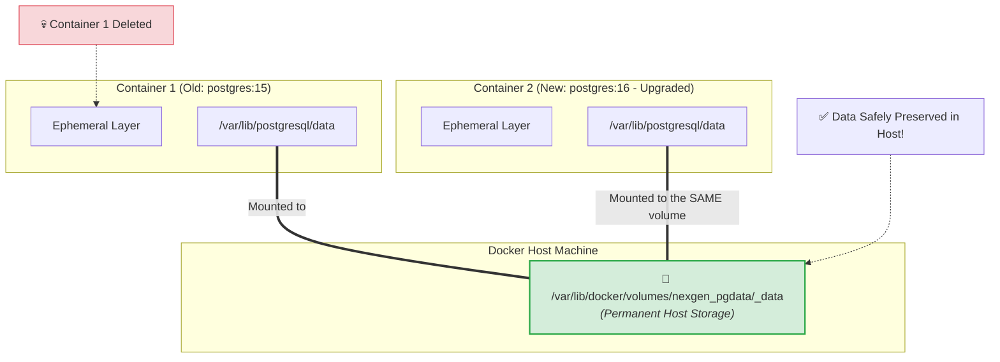
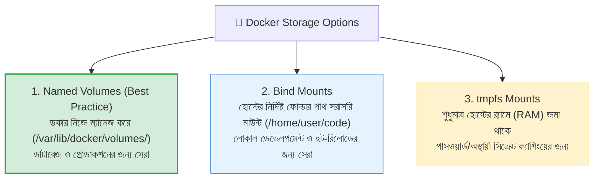

# 💾 Docker Volumes

## Docker Volume কী? (What)

**Docker Volume** হলো ডকার কন্টেইনারের জীবনচক্র থেকে সম্পূর্ণ স্বাধীন (Decoupled), ডকার ইঞ্জিন দ্বারা পরিচালিত একটি **স্থায়ী ডেটা স্টোরেজ মেকানিজম (Persistent Storage)**।

সহজ ভাষায়: ডকার কন্টেইনার বাই-ডিফল্ট ক্ষণস্থায়ী (Ephemeral) — অর্থাৎ কন্টেইনার ডিলিট করে দিলে তার ভেতরের সমস্ত ডেটা চিরতরে মুছে যায়। কিন্তু **Volume** ব্যবহার করলে আপনার ডেটা কন্টেইনারের ভেতরে সেভ না হয়ে হোস্ট মেশিনের একটি সুরক্ষিত জায়গায় সংরক্ষিত থাকে। ফলে কন্টেইনার ক্র্যাশ করুক, বন্ধ হোক বা ডিলিট করে নতুন ভার্সনে আপগ্রেড করা হোক— **আপনার ডাটাবেজের ১টি ডেটাও হারাবে না!**

:::info ভলিউম কোথায় জমা থাকে?
লিনাক্স হোস্ট সিস্টেমে ডকার ভলিউমগুলো মূলত ডকারের নিজস্ব সংরক্ষিত ডিরেক্টরি **`/var/lib/docker/volumes/`** এর ভেতরে ম্যানেজ করে।
:::

---

## কেন Docker Volume ডাটাবেজের জন্য আবশ্যক? (Why)

### ভলিউম ছাড়া বনাম ভলিউম সহ ডাটাবেজ চালানোর বাস্তব পরীক্ষা

```
❌ Volume ছাড়া ডাটাবেজ চালালে (Catastrophe 💥):
   1. আপনি `docker run postgres` চালিয়ে ১,০০০ ইউজারের ডাটাবেজ তৈরি করলেন
   2. নতুন এপিআই ভার্সন রিলিজের জন্য কন্টেইনার রিমুভ (`docker rm -f`) করলেন
   3. নতুন কন্টেইনার রান করলেন...
   4. 😱 ফলাফল: ডাটাবেজ সম্পূর্ণ ফাঁকা! সমস্ত ইউজারের ডেটা মুছে শেষ!

✅ Volume ব্যবহার করলে (Peace of Mind 🛡️):
   1. আপনি `-v pg_data:/var/lib/postgresql/data` দিয়ে ডাটাবেজ রান করলেন
   2. কন্টেইনার ডিলিট করে সম্পূর্ণ নতুন কন্টেইনার চালু করলেন
   3. 🚀 ফলাফল: নতুন কন্টেইনার ঐ একই `pg_data` ভলিউমে কানেক্ট হয়ে সমস্ত পুরনো ডেটা হুবহু অক্ষত পেয়ে গেল!
```

---

## Analogy — ল্যাপটপ ও পোর্টেবল এক্সটার্নাল এসএসডি (External SSD) 💻💾

Docker Volume-কে একটি **এক্সটার্নাল পোর্টেবল SSD হার্ডড্রাইভ বা পেনড্রাইভ**-এর সাথে তুলনা করা যায়:

- **Docker Container** = একটি ভাড়া করা ল্যাপটপ (যা যেকোনো সময় নষ্ট হতে পারে বা বদলে ফেলা লাগতে পারে)।
- **Container Writable Layer** = ল্যাপটপের টেম্পোরারি ডেক্সটপ (ল্যাপটপ ফেরত দিলে সব ফাইল মুছে যায়)।
- **Docker Volume** = আপনার নিজস্ব এক্সটার্নাল SSD ড্রাইভ (যাতে আপনার সমস্ত গুরুত্বপূর্ণ ডেটা রাখা আছে)।

ল্যাপটপটি নষ্ট হয়ে গেলে আপনি নতুন একটি ল্যাপটপ নিয়ে এসে শুধু ইউএসবি ক্যাবল দিয়ে আপনার SSD প্লাগ-ইন করেন — ব্যস, সমস্ত ফাইল আবার আগের মতোই অ্যাক্সেসযোগ্য!

---

## How it Works — Storage Drivers বনাম Volumes মেকানিজম

কন্টেইনারের ভেতরের সাধারণ ফাইলসিস্টেম চলে ডকারের **Overlay2 Storage Driver** এর মাধ্যমে (Copy-on-Write কৌশল), যা কিছুটা পারফরম্যান্স ওভারহেড তৈরি করে। 

কিন্তু **Volume** স্টোরেজ ড্রাইভারকে সম্পূর্ণ বাইপাস করে সরাসরি হোস্ট মেশিনের ডিস্ক I/O স্পিডে কাজ করে। ফলে ডাটাবেজ রিড/রাইট অত্যন্ত দ্রুত ও নেটিভ গতিতে সম্পন্ন হয়।



---

## ডকারের ৩ ধরনের স্টোরেজ মাউন্ট (Storage Types)

ডকারে প্রধানত ৩টি উপায়ে স্টোরেজ মাউন্ট করা যায়:



---

## Volume সিনট্যাক্স — `-v` বনাম `--mount`

ভলিউম মাউন্ট করার দুটি সিনট্যাক্স রয়েছে:

### ১. লিগ্যাসি শর্টকাট সিনট্যাক্স (`-v` বা `--volume`)
```bash
-v <VOLUME_NAME>:<CONTAINER_PATH>[:OPTIONS]
```
উদাহরণ: `-v nexgen_pgdata:/var/lib/postgresql/data:ro`

### ২. আধুনিক স্পষ্ট সিনট্যাক্স (`--mount`)
```bash
--mount type=volume,source=<VOLUME_NAME>,target=<CONTAINER_PATH>[,readonly]
```
উদাহরণ: `--mount type=volume,source=nexgen_pgdata,target=/var/lib/postgresql/data`

:::tip দুটিই সমান কার্যকর
`-v` সিনট্যাক্সটি সংক্ষিপ্ত ও দ্রুত লেখার জন্য অত্যন্ত জনপ্রিয়। অন্যদিকে `--mount` সিনট্যাক্সটি কিছুটা দীর্ঘ কিন্তু পড়তে খুব স্পষ্ট।
:::

---

## Hands-on: আমাদের NexGen AI ডাটাবেজে Volume এর জাদু পরীক্ষা 🧪

চলুন বাস্তবে প্রমাণ করি কীভাবে কন্টেইনার ডিলিট করার পরও ডকার ভলিউম ডেটা সুরক্ষিত রাখে:

### ধাপ ১: একটি নতুন Named Volume তৈরি করা

```bash
docker volume create nexgen_pgdata
```

```bash
# ভলিউমটি লিস্টে চেক করি
docker volume ls
```

**বাস্তব Output:**
```text
DRIVER    VOLUME NAME
local     nexgen_pgdata
```

---

### ধাপ ২: ভলিউম মাউন্ট করে PostgreSQL ডাটাবেজ চালু করা

```bash
docker container run -d \
  --name nexgen-db-v1 \
  -e POSTGRES_DB=nexgendb \
  -e POSTGRES_USER=postgres \
  -e POSTGRES_PASSWORD=mypassword \
  -v nexgen_pgdata:/var/lib/postgresql/data \
  -p 5432:5432 \
  postgres:16-alpine
```

---

### ধাপ ৩: ডাটাবেজে ঢুকে কিছু জরুরি ডাটা ইনসার্ট করা

```bash
# psql এ ঢুকে একটি টেবিল বানিয়ে ডাটা ইনসার্ট করি
docker exec -i nexgen-db-v1 psql -U postgres -d nexgendb << 'EOF'
CREATE TABLE ai_models (id SERIAL PRIMARY KEY, model_name VARCHAR(100), provider VARCHAR(50));
INSERT INTO ai_models (model_name, provider) VALUES ('GPT-4o', 'OpenAI'), ('Claude 3.5 Sonnet', 'Anthropic'), ('Gemini 1.5 Pro', 'Google');
SELECT * FROM ai_models;
EOF
```

**বাস্তব Output:**
```text
CREATE TABLE
INSERT 0 3
 id |    model_name     | provider  
----+-------------------+-----------
  1 | GPT-4o            | OpenAI
  2 | Claude 3.5 Sonnet | Anthropic
  3 | Gemini 1.5 Pro    | Google
(3 rows)
```

---

### ধাপ ৪: কন্টেইনারটিকে নির্দয়ভাবে ডিলিট করে দেওয়া! 💥

```bash
# রানিং কন্টেইনারটি ফোর্সফুলি মুছে ফেলি
docker container rm -f nexgen-db-v1
```

```bash
# ভেরিফাই করি কোনো কন্টেইনার চলছে কিনা
docker ps -a --filter "name=nexgen-db-v1"
# Output: সম্পূর্ণ খালি! কন্টেইনার মৃত।
```

---

### ধাপ ৫: সম্পূর্ণ নতুন কন্টেইনার চালু করে ডাটা রিকভারি টেস্ট 🎉

এবার আমরা সম্পূর্ণ নতুন নামের একটি কন্টেইনার (`nexgen-db-v2`) চালু করব একই ভলিউম মাউন্ট করে:

```bash
docker container run -d \
  --name nexgen-db-v2 \
  -e POSTGRES_DB=nexgendb \
  -e POSTGRES_USER=postgres \
  -e POSTGRES_PASSWORD=mypassword \
  -v nexgen_pgdata:/var/lib/postgresql/data \
  -p 5432:5432 \
  postgres:16-alpine
```

```bash
# নতুন কন্টেইনার থেকে পূর্বের ডাটা কুয়েরি করি
docker exec -i nexgen-db-v2 psql -U postgres -d nexgendb -c "SELECT * FROM ai_models;"
```

**বাস্তব Output:**
```text
 id |    model_name     | provider  
----+-------------------+-----------
  1 | GPT-4o            | OpenAI
  2 | Claude 3.5 Sonnet | Anthropic
  3 | Gemini 1.5 Pro    | Google
(3 rows)
```
*(ম্যাজিক! কন্টেইনার সম্পূর্ণ নতুন, কিন্তু পুরনো ৩টি রেকর্ডের একটি ডেটাও নষ্ট হয়নি! এটিই ডকার ভলিউমের আসল ক্ষমতা।)*

---

### ধাপ ৬: রিড-অনলি ভলিউম মাউন্ট করা (`:ro`)

যদি কোনো সার্ভিসকে শুধুমাত্র ডেটা পড়তে দিতে চান কিন্তু মডিফাই বা ডিলিট করার অনুমতি দিতে না চান (যেমন ব্যাকআপ সার্ভিস বা অ্যানালিটিক্স ইঞ্জিন):

```bash
# :ro ফ্ল্যাগ দিয়ে Read-Only মাউন্ট করা
docker run -d --name nexgen-analytics -v nexgen_pgdata:/data:ro alpine sleep 3600
```

---

## Comparison Table — Storage Types এর পূর্ণাঙ্গ তুলনা

| বৈশিষ্ট্য | Named Volume | Bind Mount | tmpfs Mount | Container Layer |
|---|---|---|---|---|
| **কোথায় সংরক্ষিত হয়** | `/var/lib/docker/volumes/` | হোস্টের যেকোনো ফোল্ডারে | হোস্টের র‍্যামে (RAM) | কন্টেইনারের মেমরিতে |
| **ডাটা পারসিস্টেন্স** | 🌟 **১০০% স্থায়ী** | 🌟 **১০০% স্থায়ী** | ❌ কন্টেইনার স্টপ হলে মুছে যায় | ❌ কন্টেইনার ডিলিট হলে মুছে যায় |
| **ম্যানেজ করে কে?** | ডকার ইঞ্জিন নিজে | হোস্ট অপারেটিং সিস্টেম | হোস্ট কার্নেল মেমরি | ডকার স্টোরেজ ড্রাইভার |
| **I/O পারফরম্যান্স** | ⚡ সর্বোচ্চ (নেটিভ স্পিড) | ⚡ উচ্চ | 🚀 বিদ্যুৎ গতি (RAM Speed) | ⚠️ ধীরগতির (Copy-on-Write) |
| **সেরা ব্যবহারের ক্ষেত্র** | ডাটাবেজ (Postgres, MySQL) | লোকাল কোড হট-রিলোড | সেনসিটিভ সিক্রেট / টেম্প বাফার | ওয়ান-টাইম লগ / টেম্প ফাইল |

---

## Common Mistakes — নতুনদের সাধারণ ভুল

### ১. ডাটাবেজের ভুল ইন্টারনাল পাথে ভলিউম মাউন্ট করা
❌ **ভুল:** PostgreSQL-এর জন্য `-v pg_data:/var/lib/postgresql` মাউন্ট করা (আসল ডাটা থাকে `/var/lib/postgresql/data` এর ভেতরে)।
✅ **সঠিক:** সবসময় অফিসিয়াল ইমেজ ডকুমেন্টের সঠিক ডাটা ডিরেক্টরি ব্যবহার করুন:
- PostgreSQL ➔ `/var/lib/postgresql/data`
- MySQL ➔ `/var/lib/mysql`
- MongoDB ➔ `/data/db`

### ২. কন্টেইনারের ভেতর ভলিউম মাউন্ট করে ভাবা যে ইমেজ পরিবর্তন হয়েছে
❌ **ভুল:** ভলিউমের ডেটা ডকার ইমেজের লেয়ারে সেভ হবে ভাবা।
✅ **সঠিক:** ভলিউম এবং ইমেজ সম্পূর্ণ আলাদা। ইমেজে কোনো ডাটা সেভ হয় না, সমস্ত রাইট অপারেশন সরাসরি হোস্টের ভলিউম ফোল্ডারে হয়।

### ৩. বেনামী ভলিউম (Anonymous Volumes) খেয়াল না করা
❌ **ভুল:** নাম ছাড়া শুধু `-v /var/lib/postgresql/data` দিলে ডকার দীর্ঘ হ্যাশ আইডির বেনামী ভলিউম বানায়, যা পরে খুঁজে পাওয়া কঠিন।
✅ **সঠিক:** সবসময় **Named Volume** ব্যবহার করুন (যেমন `nexgen_pgdata`)।

---

## Best Practices

1. **ডাটাবেজের জন্য সর্বদা Named Volumes ব্যবহার করুন**: প্রোডাকশনে ডাটাবেজ কন্টেইনারে ভলিউম ব্যবহার করা বাধ্যতামূলক।
2. **ভলিউমের নামে প্রজেক্ট প্রিফিক্স রাখুন**: যেমন `nexgen_db_data`, `nexgen_media_uploads`, `nexgen_redis_data`।
3. **নিয়মিত ভলিউম ব্যাকআপ নিন**: ক্রনজব দিয়ে ভলিউম ডিরেক্টরিকে ক্লাউড স্টোরেজে (AWS S3) ব্যাকআপ রাখুন।
4. **অপ্রয়োজনীয় ভলিউম ক্লিন করুন**: `docker volume prune` চালিয়ে পরিত্যক্ত ভলিউম মুছে ডিস্ক খালি করুন।

---

## Interview Questions ও Answers

### ১. Docker Volume কী এবং কন্টেইনারের Writable Layer-এর চেয়ে এটি কেন ডাটাবেজের জন্য শ্রেয়?

**উত্তর:** Docker Volume হলো ডকার ইঞ্জিন দ্বারা পরিচালিত হোস্ট ফাইলসিস্টেমের একটি বিশেষ স্টোরেজ অংশ যা কন্টেইনারের জীবনচক্রের ওপর নির্ভরশীল নয়।
ডাটাবেজের জন্য এটি শ্রেয় কারণ:
১. **ডাটা পারসিস্টেন্স:** কন্টেইনার ডিলিট বা আপগ্রেড করলেও ভলিউমের ডাটা আজীবন অক্ষত থাকে।
২. **উচ্চ I/O পারফরম্যান্স:** কন্টেইনারের Writable Layer কাজ করে Overlay2 স্টোরেজ ড্রাইভারের (Copy-on-Write) মাধ্যমে যা ডিস্ক রাইট স্পিড ধীর করে দেয়। ভলিউম স্টোরেজ ড্রাইভারকে বাইপাস করে সরাসরি হোস্ট ডিস্কে নেটিভ স্পিডে ডাটা লেখে।
৩. **শেয়ারিং ও ব্যাকআপ:** একই ভলিউম একাধিক কন্টেইনারের মধ্যে শেয়ার করা যায় এবং সহজে ব্যাকআপ নেওয়া যায়।

---

### ২. Named Volume এবং Anonymous Volume এর মধ্যে পার্থক্য কী?

**উত্তর:** 
- **Named Volume:** ব্যবহারকারী নিজে একটি নির্দিষ্ট অর্থপূর্ণ নাম দিয়ে তৈরি করে (যেমন `-v nexgen_data:/app/data`)। এটি `docker volume ls` এ স্পষ্ট দেখা যায় এবং পরবর্তীতে যেকোনো নতুন কন্টেইনারে এই নাম দিয়ে রি-ইউজ করা যায়।
- **Anonymous Volume:** যখন কোনো নির্দিষ্ট নাম না দিয়ে শুধু কন্টেইনারের পাথ মাউন্ট করা হয় (যেমন `-v /app/data`), ডকার স্বয়ংক্রিয়ভাবে ৬৪ ক্যারেক্টারের একটি জটিল র‍্যান্ডম হ্যাশ আইডি দিয়ে ভলিউম তৈরি করে। কন্টেইনার রিমুভ করার সময় `-v` ফ্ল্যাগ না দিলে এই বেনামী ভলিউমগুলো সিস্টেমে আবর্জনা হিসেবে পড়ে থাকে।

---

### ৩. Docker-এ `-v` এবং `--mount` ফ্ল্যাগের মধ্যে মূল পার্থক্য কী?

**উত্তর:** 
- `-v` (বা `--volume`): একটি সংক্ষিপ্ত সিনট্যাক্স যা কোলন দিয়ে ফিল্ড আলাদা করে (`name:destination:options`)। যদি নির্দেশিত ভলিউমটি হোস্টে আগে থেকে তৈরি না থাকে, তবে `-v` স্বয়ংক্রিয়ভাবে একটি নতুন ভলিউম তৈরি করে নেয়।
- `--mount`: একটি আধুনিক ও স্ট্রাকচার্ড কি-ভ্যালু সিনট্যাক্স (`type=volume,source=...,target=...`)। এটি পড়তে স্পষ্ট এবং সার্ভিস কনফিগারেশনে ত্রুটি থাকলে স্বয়ংক্রিয়ভাবে ফলব্যাক না করে স্পষ্ট এরর দেয়।

---

### ৪. কীভাবে একটি ডকার ভলিউম একাধিক কন্টেইনারের মধ্যে শেয়ার করা যায়?

**উত্তর:** একই ভলিউমকে একাধিক কন্টেইনার রান করার সময় `-v` দিয়ে মাউন্ট করলেই তারা একই স্টোরেজ শেয়ার করে।
উদাহরণস্বরূপ: আমাদের `nexgen-api` অ্যাপ্লিকেশন কন্টেইনার ব্যবহারকারীদের আপলোড করা প্রোফাইল ছবি একটি ভলিউমে (`-v uploads_data:/app/uploads`) সেভ করছে। 
এখন আমরা একটি Nginx ওয়েব সার্ভার বা ইমেজ প্রসেসিং কন্টেইনার রান করে একই ভলিউম রিড-অনলি হিসেবে মাউন্ট করতে পারি:
```bash
docker run -d --name nginx-server -v uploads_data:/usr/share/nginx/html/uploads:ro -p 80:80 nginx:alpine
```
এতে উভয় কন্টেইনার একই ফাইল অ্যাক্সেস করতে পারবে।

---

## Summary

| বিষয় | কমান্ড / সিনট্যাক্স | বিবরণ |
|---|---|---|
| **ভলিউম তৈরি** | `docker volume create <name>` | ডকার ম্যানেজড নতুন ভলিউম বানায় |
| **মাউন্ট করা** | `-v <name>:<container_path>` | কন্টেইনারে ভলিউম যুক্ত করে ডাটা পারসিস্ট করে |
| **রিড-অনলি মাউন্ট** | `-v <name>:<path>:ro` | কন্টেইনার শুধুমাত্র ডাটা পড়তে পারে, এডিট করতে পারে না |
| **ভলিউম তালিকা** | `docker volume ls` | লোকাল সব ভলিউম দেখে |
| **গোল্ডেন রুল** | ডাটাবেজে Volume বাধ্যতামূলক | কন্টেইনার ক্ষণস্থায়ী, ভলিউম চিরস্থায়ী |

---

## পরবর্তী ধাপ

আমরা সফলভাবে ডকার ভলিউমের মূল কনসেপ্ট এবং ডাটাবেজ পারসিস্টেন্স আয়ত্ত করে ফেলেছি। পরবর্তী টপিকে আমরা দেখব **Volume Commands** (`docker/volume-commands.md`) — যেখানে শিখব ভলিউম ইনস্পেকশন, ডিস্ক স্পেস অডিট, ড্রাইভ ব্যাকআপ এবং `docker volume prune` দিয়ে পরিত্যক্ত স্টোরেজ ক্লিন করার সমস্ত কমান্ড।
