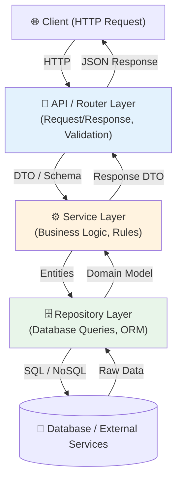

# Architecture Patterns & Project Structure 🏗️

## Architecture Patterns কী? (What)

**Architecture Pattern** হলো একটি সফটওয়্যার প্রজেক্টের ফাইল, ফোল্ডার এবং কোডের দায়িত্ব (Responsibility) সঠিকভাবে ভাগ করে সাজানোর নিয়ম বা অবকাঠামো।

ছোট প্রজেক্টে একটি মাত্র ফাইলে (`main.py`) সব কোড রাখা সহজ হলেও, এন্টারপ্রাইজ বা প্রফেশনাল প্রজেক্টে বিজনেস লজিক, ডাটাবেজ কোয়েরি, API রাউটিং এবং সিকিউরিটি আলাদা আলাদা স্তরে (Layers) ভাগ করতে হয়।

---

## কেন সঠিক Architecture প্রয়োজন? (Why)

```
❌ খারাপ Project Layout (Monolithic / Spaghetti Code):
   - ১টি ফাইলে ৫০০০ লাইন কোড তৈরি হয়
   - ডাটাবেজ বদলালে বা অন্য টিম যোগ দিলে কোড রিফ্যাক্টর করা অসম্ভব হয়ে পড়ে
   - Unit Testing করা অত্যন্ত কঠিন হয়ে যায়
   - বিজনেস লজিক এবং API এন্ট্রিপয়েন্ট একাকার হয়ে যায়

✅ Clean Layered Architecture:
   - Separation of Concerns — প্রতিটি ফাইলের নির্দিষ্ট দায়িত্ব থাকে
   - সহজে টেস্টিং করা যায় (Mocking সহজ হয়)
   - একাধিক ডেভেলপার একসাথে আলাদা ফোল্ডারে কাজ করতে পারে
   - প্রজেক্ট সহজে স্কেল (Scale) করা যায়
```

---

## Layered Architecture Diagram



---

## ১. Enterprise Modular Directory Structure

একটি বড় FastAPI প্রজেক্টের আদর্শ প্রোডাকশন-রেডি ফোল্ডার স্ট্রাকচার:

```
app/
├── api/                   # API / Router Layer
│   ├── v1/
│   │   ├── endpoints/
│   │   │   ├── auth.py
│   │   │   ├── users.py
│   │   │   └── products.py
│   │   └── api.py         # Main V1 Router aggregation
│   └── deps.py            # Global API Dependencies (get_db, current_user)
│
├── core/                  # System Configuration & Core Logic
│   ├── config.py          # Environment Variables (pydantic-settings)
│   ├── security.py        # Password Hashing, JWT Tokens
│   └── database.py        # SQLAlchemy Engine & SessionLocal
│
├── models/                # Database Models (SQLAlchemy / Tortoise / Beanie)
│   ├── user.py
│   └── product.py
│
├── schemas/               # Data Transfer Objects / Validation (Pydantic Models)
│   ├── user.py
│   └── product.py
│
├── repositories/          # Data Access Layer (Repository Pattern)
│   ├── base.py            # Generic Base Repository
│   ├── user.py
│   └── product.py
│
├── services/              # Business Logic Layer
│   ├── user_service.py
│   └── product_service.py
│
├── tests/                 # Unit & Integration Tests
│   ├── conftest.py
│   ├── test_api/
│   └── test_services/
│
└── main.py                # App Initialization & Middleware Setup
```

---

## ২. Repository Pattern (Data Access Layer)

Repository Pattern-এর কাজ হলো ডাটাবেজের সরাসরি কোয়েরি (SQLAlchemy Query) থেকে বিজনেস লজিককে আলাদা করা।

### Generic Base Repository (`app/repositories/base.py`)

```python
# app/repositories/base.py
from typing import Generic, TypeVar, Type, Optional, List
from sqlalchemy.orm import Session
from app.core.database import Base

ModelType = TypeVar("ModelType", bound=Base)

class BaseRepository(Generic[ModelType]):
    def __init__(self, model: Type[ModelType]):
        self.model = model

    def get_by_id(self, db: Session, id: int) -> Optional[ModelType]:
        return db.query(self.model).filter(self.model.id == id).first()

    def get_all(self, db: Session, skip: int = 0, limit: int = 100) -> List[ModelType]:
        return db.query(self.model).offset(skip).limit(limit).all()

    def create(self, db: Session, obj_in: dict) -> ModelType:
        db_obj = self.model(**obj_in)
        db.add(db_obj)
        db.commit()
        db.refresh(db_obj)
        return db_obj

    def delete(self, db: Session, id: int) -> bool:
        obj = self.get_by_id(db, id)
        if obj:
            db.delete(obj)
            db.commit()
            return True
        return False
```

### Specific User Repository (`app/repositories/user.py`)

```python
# app/repositories/user.py
from typing import Optional
from sqlalchemy.orm import Session
from app.repositories.base import BaseRepository
from app.models.user import User

class UserRepository(BaseRepository[User]):
    def __init__(self):
        super().__init__(User)

    def get_by_email(self, db: Session, email: str) -> Optional[User]:
        return db.query(User).filter(User.email == email).first()

    def get_by_username(self, db: Session, username: str) -> Optional[User]:
        return db.query(User).filter(User.username == username).first()

# Global Instance
user_repository = UserRepository()
```

---

## ৩. Service Layer (Business Logic Layer)

সার্ভিস লেয়ারে কেবল বিজনেস লজিক ও রুলস থাকবে। ডাটাবেজ অপারেশন চালানোর জন্য এটি Repository ব্যবহার করবে।

```python
# app/services/user_service.py
from sqlalchemy.orm import Session
from fastapi import HTTPException, status
from app.repositories.user import user_repository
from app.schemas.user import UserCreate, UserResponse
from app.core.security import get_password_hash

class UserService:
    def __init__(self):
        self.user_repo = user_repository

    def register_new_user(self, db: Session, user_in: UserCreate) -> UserResponse:
        # ১. বিজনেস লজিক: ইমেইল ইতোমধ্যে তৈরি আছে কিনা চেক করো
        if self.user_repo.get_by_email(db, email=user_in.email):
            raise HTTPException(
                status_code=status.HTTP_409_CONFLICT,
                detail="এই ইমেইলটি ইতিমধ্যে নিবন্ধিত হয়েছে।"
            )

        # ২. বিজনেস লজিক: পাসওয়ার্ড হ্যাশ করো
        hashed_password = get_password_hash(user_in.password)
        
        # ৩. ডাটাবেজে সেভ করতে ডিকশনারি প্রস্তুত করো
        user_data = user_in.model_dump()
        user_data["hashed_password"] = hashed_password
        del user_data["password"]

        # ৪. রেপোজিটরি কল করো
        new_user = self.user_repo.create(db, obj_in=user_data)
        return new_user

# Global Instance
user_service = UserService()
```

---

## ৪. API / Router Layer Integration

API Layer-এর কাজ হলো ইউজার থেকে রিকোয়েস্ট ইনপুট নেওয়া, ভ্যালিডেশন করা এবং সার্ভিস লেয়ারকে কল করে সঠিক HTTP Response ফেরত পাঠানো।

```python
# app/api/v1/endpoints/users.py
from fastapi import APIRouter, Depends, status
from sqlalchemy.orm import Session
from app.api.deps import get_db
from app.schemas.user import UserCreate, UserResponse
from app.services.user_service import user_service

router = APIRouter(prefix="/users", tags=["Users"])

@router.post("/", response_model=UserResponse, status_code=status.HTTP_201_CREATED)
def create_user(user_in: UserCreate, db: Session = Depends(get_db)):
    """
    API Layer: শুধুমাত্র Request গ্রহণ এবং Service Layer-এ পাস করার দায়িত্ব
    """
    return user_service.register_new_user(db=db, user_in=user_in)
```

---

## Comparison: Architecture Layer Responsibilities

| লেয়ার (Layer) | ফাইল ফোল্ডার | প্রধান দায়িত্ব | যেসব জিনিস থাকা নিষেধ |
|----------------|-------------|----------------|----------------------|
| **API Layer** | `app/api/endpoints/` | Route handling, Status code, Pydantic Schema injection | ❌ ডাটাবেজ কোয়েরি বা বিজনেস লজিক |
| **Service Layer** | `app/services/` | Business rules, Passwords, Payment processing | ❌ `HTTPException` ছাড়া HTTP Request/Response জানা |
| **Repository Layer**| `app/repositories/` | Direct SQL/ORM Queries (`filter`, `all`, `add`) | ❌ HTTP বা বিজনেস রুলস |
| **Model / Schema** | `app/models/`, `app/schemas/` | DB schema এবং Data validation definitions | ❌ কোনো এক্সিকিউটেবল বিজনেস লজিক |

---

## Common Mistakes ⚠️

::: danger ভুল ১: API Route-এর ভেতর সরাসরি ডাটাবেজ কোয়েরি ও বিজনেস লজিক লেখা
```python
# ❌ ভুল — API Layer-এ ডাটাবেজ কোয়েরি ও বিজনেসলজিক মিশ্রিত করা
@app.post("/users")
def create_user(user: UserSchema, db: Session = Depends(get_db)):
    # Direct DB Query
    if db.query(UserModel).filter_by(email=user.email).first():
        raise HTTPException(400, "Email exists")
    # Business Logic
    hashed = hash(user.password)
    new_user = UserModel(email=user.email, password=hashed)
    db.add(new_user)
    db.commit()
    return new_user
```
:::

::: danger ভুল ২: Circular Import করা
ফাইল সাজাতে গিয়ে `models.py` এ `schemas.py` ইম্পোর্ট করা এবং আবার `schemas.py` এ `models.py` ইম্পোর্ট করার মাধ্যমে সার্কুলার ইম্পোর্ট এরর তৈরি হতে পারে।
:::

::: warning ভুল ৩: Dependency Injection ব্যবহার না করে গ্লোবাল স্টেট তৈরি করা
সার্ভিস বা ডাটাবেজ তৈরি করার সময় FastAPI-র `Depends()` ব্যবহার না করে সরাসরি গ্লোবাল ইনস্ট্যান্স পাস করলে টেস্টিং করা কঠিন হয়ে পড়ে।
:::

---

## Best Practices ✨

- **Single Responsibility Principle (SRP):** প্রতিটি ফাইল এবং ফাংশনের কেবল একটি নির্দিষ্ট কাজ থাকা উচিত।
- **Abstract Layer (Repository):** ডাটাবেজ সংক্রান্ত সব কোড Repository-র পেছনে লুকাতে হবে।
- **Base Repository Class:** জেনেরিক CRUD অপারেশনগুলো (Create, Get by ID, Delete) একটি Base Class-এ রাখো যাতে কোড ডুপ্লিকেশন না হয়।
- **Clean Imports:** প্রজেক্টের রুট থেকে Absolute Import ব্যবহার করো (যেমন: `from app.core.config import settings`)।

---

## Interview Questions 🎯

**প্রশ্ন ১: FastAPI প্রজেক্টে Repository Pattern ব্যবহারের মূল সুবিধা কী?**

> **উত্তর:** Repository Pattern ব্যবহার করলে ডাটা এক্সেস লজিক (SQLAlchemy/MongoDB) থেকে বিজনেস লজিক আলাদা হয়। এর ফলে ভবিষ্যতে ডাটাবেজ পরিবর্তন করা (যেমন: SQLite থেকে PostgreSQL বা MongoDB) সহজ হয় এবং ডাটাবেজ কানেকশন ছাড়াই সার্ভিস লেয়ারের ইউনিট টেস্ট করা যায়।

**প্রশ্ন ২: API Layer এবং Service Layer-এর মধ্যে প্রধান পার্থক্য কী?**

> **উত্তর:** API Layer (Router) কেবল HTTP সংক্রান্ত বিষয়াদি (যেমন: Query Params, Headers, Cookies, Status Code) সামলায়। আর Service Layer কেবল অ্যাপ্লিকেশনের মূল বিজনেস লজিক এবং রুলস (যেমন: ডিসকাউন্ট ক্যালকুলেশন, পাসওয়ার্ড হ্যাশিং, ইমেইল পাঠানো) সামলায়।

**প্রশ্ন ৩: DTO (Data Transfer Object) হিসেবে FastAPI-তে কী ব্যবহৃত হয়?**

> **উত্তর:** FastAPI-তে Pydantic Model-কে DTO হিসেবে ব্যবহার করা হয়। এটি রিকোয়েস্ট ইনপুট ভ্যালিডেশন এবং রেসপন্স ডাটা ফিল্টার (প্রোটেক্ট) করার জন্য ব্যবহৃত হয়।

**প্রশ্ন ৪: সার্কুলার ইম্পোর্ট (Circular Import) কীভাবে এড়ানো যায়?**

> **উত্তর:** প্রজেক্ট লেয়ারগুলোকে নির্দিষ্ট ডিরেকশনে ডিপেন্ড করতে হবে: `Router -> Service -> Repository -> Model`। কখনোই নিচের লেয়ার উপরের লেয়ারকে ইম্পোর্ট করবে না। প্রয়োজনে Pydantic Forward References বা স্থানীয়ভাবে ফানশনের ভেতর ইম্পোর্ট করতে হবে।

---

## Summary 📋

- ✅ **Layered Architecture**: API -> Service -> Repository -> Database স্তরে কোড বিভক্ত করা হয়।
- ✅ **Repository Pattern**: ডাটাবেজ কোয়েরি আলাদা রাখার জন্য জেনেরিক বা স্পেসিফিক রেপোজিটরি ক্লাস ব্যবহার করা হয়।
- ✅ **Service Layer**: মূল বিজনেস লজিক আলাদা রাখা হয় যাতে কোড টেস্টিং ও রিইউজ সহজ হয়।
- ✅ **Modular Layout**: `app/api`, `app/core`, `app/models`, `app/services`, `app/repositories` ডিরেক্টরি অনুসরণ করা হয়।

---

## পরবর্তী ধাপ ➡️

Architecture Patterns শেখা শেষ হলো। পরের টপিকে তোমরা শিখবে **Deployment & DevOps** — Docker, Docker Compose, Nginx Reverse Proxy, SSL Certificate (Certbot), Systemd Service এবং Cloud Deployment (AWS/DigitalOcean)।
