# Best Practices & Enterprise Cheat Sheet 🏆

## পরিচিতি (Overview)

FastAPI দিয়ে একটি অ্যাপ্লিকেশন তৈরি করা সহজ হলেও, সেটিকে প্রোডাকশন-রেডি, উচ্চ-কার্যক্ষমতাসম্পন্ন এবং সিকিউর করা বেশ চ্যালেঞ্জিং। এই অধ্যায়ে আমরা সমগ্র কোর্সের সারসংক্ষেপ, **Production Readiness Checklist**, **Enterprise Best Practices**, **Anti-patterns** এবং একটি পূর্ণাঙ্গ **FastAPI Master Cheat Sheet** সংকলিত করেছি।

---

## Production Readiness Mindmap Architecture

```mermaid
graph TD
    Prod["🚀 Production Ready FastAPI App"]

    Sec["🔒 Security"]
    Perf["⚡ Performance"]
    Arch["🏗️ Architecture"]
    Qual["🧪 Code Quality & Tests"]
    DevOps["🐳 DevOps & Monitoring"]

    Prod --> Sec
    Prod --> Perf
    Prod --> Arch
    Prod --> Qual
    Prod --> DevOps

    Sec --> Sec1["• HTTPS / SSL Enforced"]
    Sec --> Sec2["• JWT + Bcrypt Hashing"]
    Sec --> Sec3["• Strict CORS & Security Headers"]

    Perf --> Perf1["• Async I/O (httpx, async db)"]
    Perf --> Perf2["• Redis Caching"]
    Perf --> Perf3["• Gunicorn + Uvicorn Workers"]

    Arch --> Arch1["• Layered Architecture (API/Service/Repo)"]
    Arch --> Arch2["• Pydantic V2 Models & DTOs"]

    Qual --> Qual1["• Pytest Unit & Integration Tests (>80% Coverage)"]
    Qual --> Qual2["• Static Type Checking (Mypy/Ruff)"]

    DevOps --> Dev1["• Docker Containerization"]
    DevOps --> Dev2["• Nginx Reverse Proxy"]
    DevOps --> Dev3["• Structured Logging & Health Check"]
```



---

## ১. Production Readiness Checklist 📋

তোমার FastAPI অ্যাপ্লিকেশনটি প্রোডাকশনে ডিপ্লয় করার আগে নিচের তালিকা অনুযায়ী প্রতিটি পয়েন্ট রিভিউ করো:

### 🔒 Security Audit
- [ ] `SECRET_KEY` এবং ডাটাবেজ পাসওয়ার্ড কোড থেকে সরিয়ে `.env` ফাইলে রাখা হয়েছে।
- [ ] পাসওয়ার্ড সংরক্ষণে `passlib[bcrypt]` ব্যবহার করা হয়েছে।
- [ ] `CORSMiddleware`-এ `allow_origins=["*"]`-এর বদলে নির্দিষ্ট ডোমেইন ডিক্লেয়ার করা হয়েছে।
- [ ] Swagger UI (`/docs`) প্রোডাকশনে বন্ধ করা হয়েছে অথবা অ্যাকসেস প্রটেক্ট করা হয়েছে।
- [ ] `X-Frame-Options`, `Content-Security-Policy` ইত্যাদি সিকিউরিটি হেডার ইনজেক্ট করা হয়েছে।
- [ ] API-তে Rate Limiting (যেমন: Slowapi) যুক্ত করা হয়েছে যাতে Brute-force আক্রমণ প্রতিরোধ করা যায়।

### ⚡ Performance Tuning
- [ ] ব্লকিং I/O বা Sync ফাংশন `async def`-এর ভেতর চালানো হয়নি।
- [ ] External HTTP কলের জন্য `requests`-এর বদলে `httpx` ব্যবহার করা হয়েছে।
- [ ] রিপিটিটিভ রিড ডাটার জন্য Redis Caching ব্যবহার করা হয়েছে।
- [ ] জেসন সি্রিয়ালাইজেশনের জন্য `orjson` ব্যবহার করা হয়েছে।
- [ ] Database Connection Pool-এর সাইজ এবং Timeout ঠিকমত টিউন করা হয়েছে।
- [ ] N+1 Query কমানোর জন্য SQLAlchemy-তে `joinedload()` ব্যবহার করা হয়েছে।

### 🏗️ Architecture & Code Quality
- [ ] API Router, Service Layer এবং Repository Layer আলাদা ফোল্ডারে ভাগ করা হয়েছে।
- [ ] ডাটা ইনপুট ও আউটপুট ফিল্টারিংয়ের জন্য Pydantic Schemas ব্যবহার করা হয়েছে।
- [ ] Unhandled Error আড়াল করতে Global Exception Handler ব্যবহার করা হয়েছে।
- [ ] Pytest দিয়ে টেস্ট কাভারেজ ৮০%-এর উপরে রাখা হয়েছে।
- [ ] Type Hinting (Mypy) ভুল মুক্ত রাখা হয়েছে।

---

## ২. Code Quality Tools (Ruff, Mypy & Pre-commit)

কোডের মান ঠিক রাখতে এবং টিম ওয়ার্কে স্টাইল ঠিক রাখতে এই টুলগুলো ব্যবহার করো:

```bash
# Linter & Formatter
pip install ruff mypy pre-commit
```

### Pyproject.toml Configuration

```toml
# pyproject.toml
[tool.ruff]
line-length = 88
target-version = "py311"
select = ["E", "F", "I", "N", "UP", "B"]
ignore = []

[tool.mypy]
python_version = "3.11"
strict = true
ignore_missing_imports = true
```

---

## ৩. Common Anti-Patterns & Solutions ⚠️

| Anti-Pattern (খারাপ চর্চা) | কারণ / সমস্যা | সঠিক সমাধান |
|-------------------------|-------------|-------------|
| **`async def` এ Blocking Code** | পুরো Event Loop থমকে যায় | `def` ব্যবহার করো অথবা Async Library ব্যবহার করো |
| **`app = FastAPI()` ১ ফাইলে** | কোড মেস হয়, টেস্ট করা কঠিন | `APIRouter` দিয়ে ফোল্ডার অনুযায়ী ভাগ করো |
| **Pass plain dictionary instead of Pydantic** | ডাটা ভ্যালিডেশন ভেঙে যায় | Pydantic BaseModel ব্যবহার করো |
| **Hardcoding DB credentials** | Git-এ দিলে প্যাসওয়ার্ড লিক হয় | `pydantic-settings` দিয়ে `.env` ব্যবহার করো |
| **`dict(model)` conversion** | Pydantic v2-তে অকার্যকর | `model.model_dump()` ব্যবহার করো |
| **Catching `Exception` silently** | আসল বাগ ধরা পড়ে না | নির্দিষ্ট Exception ধরো এবং Structured Log করো |

---

## ৪. FastAPI Master Cheat Sheet 📜

### 🚀 Basic Setup
```python
from fastapi import FastAPI
app = FastAPI(title="My API", version="1.0.0")
```

### 🛣️ Routing & Query/Path Params
```python
from fastapi import APIRouter, Path, Query

router = APIRouter(prefix="/users", tags=["Users"])

@router.get("/{id}")
def get_user(
    id: int = Path(ge=1),
    page: int = Query(default=1, ge=1)
):
    return {"id": id, "page": page}
```

### 📦 Pydantic V2 Models
```python
from pydantic import BaseModel, Field, field_validator

class UserCreate(BaseModel):
    username: str = Field(min_length=3)
    email: str

    @field_validator("username")
    @classmethod
    def check_username(cls, v: str) -> str:
        return v.lower().strip()
```

### 📤 Custom Response & Status Code
```python
from fastapi import status
from fastapi.responses import ORJSONResponse

@app.post("/items", status_code=status.HTTP_201_CREATED, response_class=ORJSONResponse)
def create_item():
    return {"status": "created"}
```

### 💉 Dependency Injection & DB Session
```python
from fastapi import Depends
from sqlalchemy.orm import Session

def get_db():
    db = SessionLocal()
    try:
        yield db
    finally:
        db.close()

@app.get("/items")
def list_items(db: Session = Depends(get_db)):
    return db.query(Item).all()
```

### 🔐 Security (JWT & Password Hash)
```python
from fastapi.security import OAuth2PasswordBearer
from passlib.context import CryptContext

pwd_context = CryptContext(schemes=["bcrypt"], deprecated="auto")
oauth2_scheme = OAuth2PasswordBearer(tokenUrl="/auth/login")

def hash_pass(password: str) -> str:
    return pwd_context.hash(password)
```

### 🚨 Exception Handling
```python
from fastapi import HTTPException, status

raise HTTPException(
    status_code=status.HTTP_404_NOT_FOUND,
    detail="Resource Not Found"
)
```

### 🧱 Middleware Setup
```python
from fastapi.middleware.cors import CORSMiddleware

app.add_middleware(
    CORSMiddleware,
    allow_origins=["https://yourdomain.com"],
    allow_credentials=True,
    allow_methods=["*"],
    allow_headers=["*"],
)
```

### 🧪 Pytest Testing
```python
from fastapi.testclient import TestClient

client = TestClient(app)

def test_read_root():
    res = client.get("/")
    assert res.status_code == 200
```

---

## কোর্স সমাপনী (Course Completion Note) 🎉

অভিনন্দন! 👏 তুমি সফলভাবে **FastAPI বাংলা সম্পূর্ণ গাইড**-এর মোট ১৮টি অধ্যায় সম্পূর্ণ করেছ।

beginner লেভেলের Basic Routing থেকে শুরু করে Pydantic Validation, Dependency Injection, JWT Security, SQLAlchemy ORM, Middlewares, Error Handling, Advanced Pydantic, Testing, Performance Optimization, WebSockets, Clean Architecture এবং Deployment — সব গুরুত্বপূর্ণ টপিক এখন তোমার আয়ত্তে।

### পরবর্তী করণীয়:
১. এই গাইডের নলেজ ব্যবহার করে একটি পূর্ণাঙ্গ **Real-World Project** (যেমন: E-Commerce Backend বা Real-time Messaging Platform) তৈরি করো।  
২. তোমার তৈরি প্রজেক্টটি GitHub-এ আপলোড করো।  
৩. যেকোনো সমস্যায় FastAPI-র অফিসিয়াল ডকুমেন্টেশন রেফার করো।

শুভকামনা তোমার ডেভেলপার যাত্রার জন্য! 🚀
