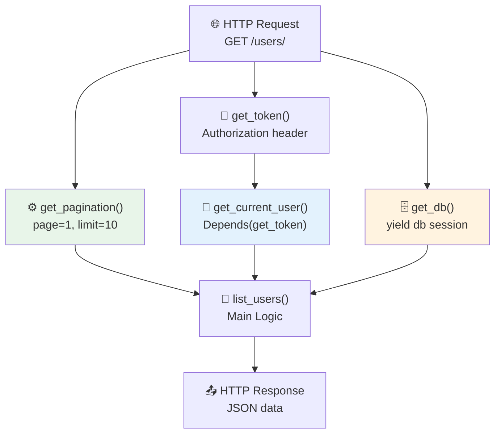
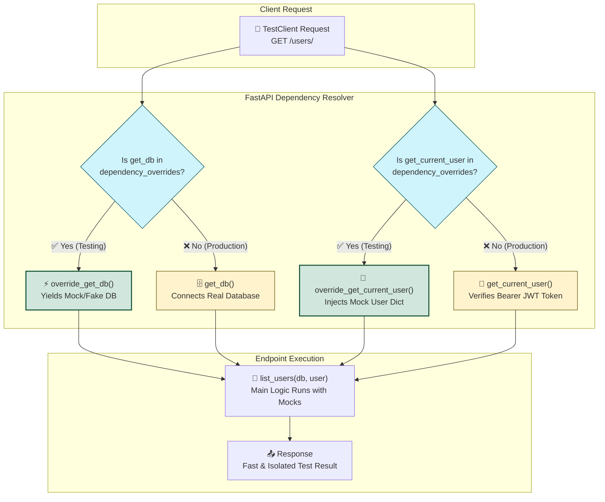

# Dependency Injection 💉

## Dependency Injection কী? (What)

**Dependency Injection (DI)** হলো এমন একটি design pattern যেখানে একটি function বা class-এর "দরকারী জিনিস" (dependencies) বাইরে থেকে inject করা হয় — নিজে তৈরি করে না।

FastAPI-তে এটি `Depends()` দিয়ে করা হয়। তুমি একটি function লিখবে, FastAPI সেটি **স্বয়ংক্রিয়ভাবে** endpoint call-এর আগে execute করবে এবং result inject করবে।

```
তোমার function চাই: database, current user, auth token, pagination...
FastAPI বলে: "আমি এনে দিচ্ছি, তুমি শুধু বলো কী চাও"
এটাই Dependency Injection।
```

---

## কেন Dependency Injection দরকার? (Why)

```python
# ❌ DI ছাড়া — প্রতি endpoint-এ একই code repeat
@app.get("/users/")
def list_users(page: int = 1, limit: int = 10):
    skip = (page - 1) * limit
    auth_header = request.headers.get("Authorization")    # repeat
    if not auth_header: raise HTTPException(401, ...)     # repeat
    token = auth_header.replace("Bearer ", "")            # repeat
    user = verify_token(token)                            # repeat
    db = SessionLocal()                                   # repeat
    try:
        result = db.query(User).offset(skip).limit(limit).all()  # main logic
    finally:
        db.close()                                        # repeat
    return result

@app.get("/products/")
def list_products(page: int = 1, limit: int = 10):
    skip = (page - 1) * limit
    # ↑ উপরের সব code আবার লিখতে হবে! ❌
```

```python
# ✅ DI দিয়ে — clean, reusable, testable
@app.get("/users/")
def list_users(
    pagination = Depends(get_pagination),    # reusable
    user = Depends(get_current_user),        # reusable
    db = Depends(get_db)                     # reusable
):
    return db.query(User).offset(pagination.skip).limit(pagination.limit).all()

@app.get("/products/")
def list_products(
    pagination = Depends(get_pagination),   # same dependency!
    user = Depends(get_current_user),       # same!
    db = Depends(get_db)                    # same!
):
    return db.query(Product).offset(pagination.skip).limit(pagination.limit).all()
```

---

## Dependency Flow Diagram



---

## ১. Simple Function Dependency

```python
from fastapi import FastAPI, Depends
from typing import Optional

app = FastAPI()

# ===== Pagination Dependency =====
def get_pagination(
    page: int = 1,
    limit: int = 10
) -> dict:
    """
    Common pagination — সব list endpoint-এ ব্যবহার করা যাবে।
    Query params: ?page=2&limit=20
    """
    if page < 1:
        page = 1
    if limit > 100:
        limit = 100   # সর্বোচ্চ ১০০ items

    skip = (page - 1) * limit
    return {"page": page, "limit": limit, "skip": skip}

# ===== Search Dependency =====
def get_search_params(
    q: Optional[str] = None,
    sort_by: str = "created_at",
    order: str = "desc"
) -> dict:
    """Common search parameters"""
    if order not in ("asc", "desc"):
        order = "desc"
    return {"q": q, "sort_by": sort_by, "order": order}

# ===== Endpoint-এ inject করা =====
@app.get("/users/", tags=["Users"])
def list_users(
    pagination: dict = Depends(get_pagination),
    search: dict = Depends(get_search_params)
):
    """
    GET /users/?page=2&limit=20&q=আরিফ&sort_by=name&order=asc
    
    pagination → get_pagination() স্বয়ংক্রিয়ভাবে call হয়
    search → get_search_params() স্বয়ংক্রিয়ভাবে call হয়
    """
    return {
        "pagination": pagination,
        "search": search,
        "users": []   # Real app: DB থেকে আনো
    }

@app.get("/products/", tags=["Products"])
def list_products(
    pagination: dict = Depends(get_pagination),  # Same dependency reuse!
    search: dict = Depends(get_search_params)    # Same!
):
    return {
        "pagination": pagination,
        "search": search,
        "products": []
    }
```

---

## ২. Class-Based Dependency

```python
from fastapi import Depends

class PaginationParams:
    """Class-based pagination dependency — আরও organized"""

    def __init__(
        self,
        page: int = 1,
        per_page: int = 10,
        sort_by: str = "id",
        order: str = "asc"
    ):
        # Validation
        self.page = max(1, page)                  # কমপক্ষে ১
        self.per_page = min(max(1, per_page), 100) # ১ থেকে ১০০ এর মধ্যে
        self.sort_by = sort_by
        self.order = order if order in ("asc", "desc") else "asc"
        self.skip = (self.page - 1) * self.per_page

    @property
    def as_dict(self) -> dict:
        return {
            "page": self.page,
            "per_page": self.per_page,
            "skip": self.skip,
            "sort_by": self.sort_by,
            "order": self.order
        }

class CommonFilters:
    """Common filter class"""
    def __init__(
        self,
        search: Optional[str] = None,
        is_active: bool = True,
        category: Optional[str] = None
    ):
        self.search = search
        self.is_active = is_active
        self.category = category

# Endpoint-এ class inject করা
@app.get("/articles/", tags=["Articles"])
def list_articles(
    pagination: PaginationParams = Depends(PaginationParams),
    filters: CommonFilters = Depends(CommonFilters)
):
    """
    Class-based dependencies
    GET /articles/?page=2&per_page=20&search=fastapi&is_active=true
    """
    return {
        "pagination": pagination.as_dict,
        "filters": {
            "search": filters.search,
            "is_active": filters.is_active,
            "category": filters.category
        },
        "articles": []
    }
```

---

## ৩. Nested Dependencies — Chain করা

```python
from fastapi import Depends, HTTPException, Header
from typing import Optional

# ===== Step 1: Token extract =====
def get_token(
    authorization: Optional[str] = Header(default=None, alias="Authorization")
) -> str:
    """
    Authorization header থেকে Bearer token বের করো।
    প্রতিটি request-এ এটি চলে।
    """
    if not authorization:
        raise HTTPException(
            status_code=401,
            detail="Authorization header দিতে হবে",
            headers={"WWW-Authenticate": "Bearer"}
        )
    if not authorization.startswith("Bearer "):
        raise HTTPException(
            status_code=401,
            detail="Bearer token format: 'Bearer <token>'"
        )
    return authorization.replace("Bearer ", "")

# ===== Step 2: Token verify → User পাও =====
# get_token dependency এর উপর নির্ভরশীল
def get_current_user(
    token: str = Depends(get_token)  # ← get_token এর উপর depend
) -> dict:
    """
    Token verify করো এবং user তথ্য return করো।
    get_token() আগে চলবে, তারপর এই function।
    """
    # Real app-এ JWT decode করবে
    # পরে security page-এ দেখাবো
    if token == "valid-token-123":
        return {
            "id": 1,
            "username": "আরিফ",
            "email": "arif@bd.com",
            "role": "user",
            "is_active": True
        }
    raise HTTPException(
        status_code=401,
        detail="Invalid token বা token expired"
    )

# ===== Step 3: Active user check =====
def get_active_user(
    current_user: dict = Depends(get_current_user)  # ← get_current_user এর উপর depend
) -> dict:
    """শুধু active user-দের allow করো"""
    if not current_user.get("is_active"):
        raise HTTPException(
            status_code=400,
            detail="Account নিষ্ক্রিয়। Support-এ যোগাযোগ করুন।"
        )
    return current_user

# ===== Step 4: Admin check =====
def get_admin_user(
    current_user: dict = Depends(get_active_user)  # ← get_active_user এর উপর depend
) -> dict:
    """শুধু admin role-এর user allow করো"""
    if current_user.get("role") != "admin":
        raise HTTPException(
            status_code=403,
            detail="এই কাজের জন্য Admin permission প্রয়োজন"
        )
    return current_user

# ===== Endpoints =====
@app.get("/users/me/", tags=["Users"])
def my_profile(current_user: dict = Depends(get_active_user)):
    """
    Dependency chain:
    get_token() → get_current_user() → get_active_user() → endpoint
    """
    return {
        "profile": current_user,
        "message": "তোমার profile"
    }

@app.get("/admin/dashboard/", tags=["Admin"])
def admin_dashboard(admin: dict = Depends(get_admin_user)):
    """
    Dependency chain:
    get_token() → get_current_user() → get_active_user() → get_admin_user() → endpoint
    """
    return {
        "admin": admin["username"],
        "dashboard": "Admin dashboard data",
        "stats": {"users": 1000, "revenue": "৳50,000"}
    }
```

::: tip Nested Dependency Chain
```
get_token()
    ↓ token string
get_current_user(token)
    ↓ user dict
get_active_user(user)
    ↓ active user dict
get_admin_user(user)
    ↓ admin user dict
endpoint(admin)
```
FastAPI এই পুরো chain স্বয়ংক্রিয়ভাবে সাজিয়ে চালায়।
:::

---

## ৪. Yield Dependencies — DB Session Management

```python
from sqlalchemy.orm import Session
from sqlalchemy import create_engine
from sqlalchemy.orm import sessionmaker

# Database setup (simplified)
engine = create_engine("sqlite:///./app.db")
SessionLocal = sessionmaker(autocommit=False, autoflush=False, bind=engine)

def get_db():
    """
    Database session dependency।

    ভিতরে কী হয়:
    1. DB session তৈরি হয় (yield-এর আগে)
    2. session endpoint-এ inject হয় (yield)
    3. Request শেষে finally block চলে → session close হয়

    এটি 'context manager pattern' এর মতো।
    """
    db = SessionLocal()     # ① Session তৈরি
    try:
        yield db            # ② Endpoint-এ inject হয়
    except Exception as e:
        db.rollback()       # ③ Error হলে rollback
        raise e
    finally:
        db.close()          # ④ সবসময় close — memory leak নেই

# Endpoint-এ DB session inject করা
@app.get("/users/", tags=["Users"])
def list_users_from_db(
    db: Session = Depends(get_db),
    current_user: dict = Depends(get_active_user)
):
    """
    DB session স্বয়ংক্রিয়ভাবে:
    - Open হবে (request শুরুতে)
    - Inject হবে (endpoint-এ)
    - Close হবে (request শেষে)
    """
    # db session ব্যবহার করো
    # users = db.query(User).all()
    return {"users": [], "requested_by": current_user["username"]}

@app.post("/users/", tags=["Users"], status_code=201)
def create_user_in_db(
    username: str,
    email: str,
    db: Session = Depends(get_db)
):
    """
    Multiple endpoints-এ same DB dependency —
    প্রতিটি request-এ আলাদা session তৈরি ও close হয়
    """
    # new_user = User(username=username, email=email)
    # db.add(new_user)
    # db.commit()
    # db.refresh(new_user)
    return {"message": "User তৈরি হয়েছে", "username": username}
```

---

## ৫. Global Dependencies — সব Endpoint-এ Apply

```python
from fastapi import FastAPI, Depends, Request
import time
import logging

logger = logging.getLogger(__name__)

# ===== Request Logging Dependency =====
async def log_request(request: Request):
    """প্রতিটি request log করো"""
    start = time.time()
    logger.info(f"→ {request.method} {request.url.path}")
    yield  # Request process হতে দাও
    duration = (time.time() - start) * 1000
    logger.info(f"← {request.method} {request.url.path} [{duration:.2f}ms]")

# ===== API Key Rate Limiter =====
async def verify_global_api_key(
    x_api_key: Optional[str] = Header(default=None, alias="X-API-Key")
):
    """Public API-তে API key require করো"""
    if not x_api_key:
        raise HTTPException(
            status_code=403,
            detail="X-API-Key header দিতে হবে"
        )

# App-wide global dependencies — সব endpoint-এ apply হবে
app = FastAPI(
    dependencies=[
        Depends(log_request),       # সব request log হবে
        # Depends(verify_global_api_key)  # সব endpoint-এ API key required করতে
    ]
)

# ===== Router-level Dependencies =====
admin_router = APIRouter(
    prefix="/admin",
    tags=["Admin 🔧"],
    dependencies=[Depends(get_admin_user)]  # এই router-এর সব endpoint-এ admin required
)

@admin_router.get("/users/")
def admin_list_users():
    """Admin automatically check হবে — আলাদা Depends() লাগবে না"""
    return {"users": []}

@admin_router.delete("/users/{user_id}")
def admin_delete_user(user_id: int):
    """এখানেও admin check হবে"""
    return {"deleted": user_id}

app.include_router(admin_router)
```

---

## ৬. Dependency with HTTPException

```python
from fastapi import Depends, HTTPException, Header
from datetime import datetime

def verify_api_key(
    x_api_key: str = Header(..., alias="X-API-Key")
) -> str:
    """API Key validate করো — invalid হলে 403"""
    valid_keys = {"sk-live-bd001", "sk-live-bd002", "sk-test-dev123"}
    if x_api_key not in valid_keys:
        raise HTTPException(
            status_code=403,
            detail={
                "message": "Invalid API Key",
                "hint": "X-API-Key header দিয়ে valid key পাঠাও"
            }
        )
    return x_api_key

def check_business_hours() -> bool:
    """Business hours check — সকাল ৮টা থেকে রাত ১০টা"""
    hour = datetime.now().hour
    if not (8 <= hour < 22):
        raise HTTPException(
            status_code=503,
            detail={
                "message": "Service শুধু সকাল ৮টা থেকে রাত ১০টা পর্যন্ত চালু",
                "current_time": datetime.now().strftime("%H:%M"),
                "opens_at": "08:00",
                "closes_at": "22:00"
            }
        )
    return True

def verify_subscription(
    api_key: str = Depends(verify_api_key)  # ← API key verify হবে আগে
) -> str:
    """Subscription active আছে কিনা check করো"""
    # Real app-এ DB check করবে
    active_subscriptions = {"sk-live-bd001", "sk-live-bd002"}
    if api_key not in active_subscriptions:
        raise HTTPException(
            status_code=402,  # 402 Payment Required
            detail="Subscription expired। Payment করো।"
        )
    return api_key

@app.post(
    "/sms/send/",
    tags=["SMS"],
    dependencies=[Depends(check_business_hours)]
)
def send_sms(
    phone: str,
    message: str,
    api_key: str = Depends(verify_subscription)
):
    """
    SMS পাঠাও — Business hours + valid subscription প্রয়োজন
    """
    return {
        "sent": True,
        "phone": phone,
        "message_length": len(message),
        "charged_to": api_key[:8] + "..."
    }
```

---

## ৭. Dependency Override — Testing-এ কাজে লাগে

### 📊 Dependency Override Flow Diagram




```python
# main.py
from fastapi import FastAPI, Depends

app = FastAPI()

def get_db():
    """Real database session"""
    db = SessionLocal()
    try:
        yield db
    finally:
        db.close()

def get_current_user():
    """Real auth"""
    # JWT token verify...
    return {"id": 1, "username": "real_user"}

# =======================
# test_main.py
from fastapi.testclient import TestClient
from main import app, get_db, get_current_user

# Fake DB — testing-এর জন্য
class FakeDB:
    def query(self, model):
        return self
    def all(self):
        return [{"id": 1, "name": "Test User"}]

def override_get_db():
    """Real DB-এর বদলে Fake DB"""
    yield FakeDB()

def override_get_current_user():
    """Real auth-এর বদলে fake user"""
    return {"id": 99, "username": "test_user", "role": "admin"}

# Override করো
app.dependency_overrides[get_db] = override_get_db
app.dependency_overrides[get_current_user] = override_get_current_user

client = TestClient(app)

def test_list_users():
    response = client.get("/users/")
    assert response.status_code == 200
    # Fake DB থেকে আসা data test করো

# Test শেষে override সরাও
app.dependency_overrides.clear()
```

---

## Dependency Types Comparison

| Type | কখন ব্যবহার | উদাহরণ |
|------|------------|---------|
| **Function** | Simple, stateless logic | Pagination, search params |
| **Class** | State + multiple methods লাগলে | Complex filters, settings |
| **Nested** | Dependencies-এর উপর depend | Auth chain |
| **Yield** | Resource lifecycle | DB session, file handle |
| **Global (App-level)** | সব endpoint-এ | Logging, rate limiting |
| **Global (Router-level)** | একটি router-এর সব | Admin auth |

---

## Common Mistakes ⚠️

::: danger ভুল ১: Depends() call করা — parentheses ভুল
```python
# ❌ ভুল — Depends-এ function call করা
@app.get("/users/")
def list_users(pagination = Depends(get_pagination())):  # ← () ভুল!
    ...
# এটি get_pagination() এর return value inject করবে, function নয়

# ✅ সঠিক — Function reference দাও, call করো না
@app.get("/users/")
def list_users(pagination = Depends(get_pagination)):   # ← () নেই
    ...
```
:::

::: danger ভুল ২: Yield dependency-তে return ব্যবহার
```python
# ❌ ভুল — return দিলে cleanup code চলবে না
def get_db():
    db = SessionLocal()
    return db    # ← DB কখনো close হবে না! Memory leak!

# ✅ সঠিক — yield ব্যবহার করো
def get_db():
    db = SessionLocal()
    try:
        yield db        # ← Request-এ এটি দেওয়া হবে
    finally:
        db.close()      # ← Request শেষে এটি চলবে
```
:::

::: warning ভুল ৩: Circular dependency তৈরি করা
```python
# ❌ ভুল — A depends on B, B depends on A → Infinite loop
def get_user(auth = Depends(get_auth)): ...
def get_auth(user = Depends(get_user)): ...    # ❌ Circular!

# ✅ সঠিক — Linear chain রাখো
def get_token(): ...
def get_current_user(token = Depends(get_token)): ...  # ✅ Linear
def get_admin(user = Depends(get_current_user)): ...   # ✅ Linear
```
:::

::: warning ভুল ৪: class-based dependency-তে `()` ভুলে যাওয়া
```python
class Pagination:
    def __init__(self, page: int = 1, limit: int = 10): ...

# ❌ ভুল
@app.get("/items/")
def list_items(p = Depends(Pagination)):   # Class reference — OK ✅ আসলে এটি ঠিকই আছে

# Class-based dependency দুইভাবে লেখা যায়:
@app.get("/items/")
def list_items(p: Pagination = Depends(Pagination)):   # ✅ Explicit
# অথবা
@app.get("/items/")
def list_items(p: Pagination = Depends()):   # ✅ Type hint থেকে auto-detect
```
:::

---

## Best Practices ✨

- **Reusable logic → Dependency বানাও** — auth, pagination, DB session কখনো endpoint-এ directly লিখবে না
- **Yield dependency DB session-এর জন্য** — `try/yield/finally` pattern অবশ্যই মানো
- **Nested chain ৩-৪ level পর্যন্ত রাখো** — বেশি হলে বুঝতে কঠিন হয়
- **Router-level global dependency** — Admin router-এ auth globally দাও
- **Testing-এ `dependency_overrides`** — Real DB/auth বদলে fake দাও
- **HTTPException dependency-তে raise করা যায়** — Error handling clean থাকে
- **Function নাম descriptive রাখো** — `get_db`, `get_current_user`, `get_admin_user`

---

## Interview Questions 🎯

**প্রশ্ন ১: FastAPI-তে Dependency Injection কীভাবে কাজ করে?**

> **উত্তর:** `Depends(func)` দিয়ে function parameter-এ dependency declare করলে FastAPI endpoint call করার আগে সেই function execute করে এবং result inject করে। Pydantic model-এর মতোই FastAPI এটি type hints থেকে বুঝে। Nested dependency থাকলে সঠিক order-এ সব execute করে।

**প্রশ্ন ২: `yield` dependency কেন দরকার? `return` দিলে কী সমস্যা?**

> **উত্তর:** `return` দিলে function শেষ হয়ে যায় এবং cleanup code (db.close(), file.close()) চালানোর সুযোগ থাকে না। `yield` দিলে FastAPI resource inject করে, request process করে, তারপর `finally` block চালায়। Database connection, file handle, external API session — এই ধরনের resource lifecycle management-এর জন্য `yield` অপরিহার্য।

**প্রশ্ন ৩: Global dependency এবং endpoint-level dependency-র পার্থক্য কী?**

> **উত্তর:** `FastAPI(dependencies=[...])` দিলে সব endpoint-এ apply হয় — logging, rate limiting-এর জন্য। `APIRouter(dependencies=[...])` দিলে শুধু সেই router-এর endpoint-এ apply হয় — admin auth-এর জন্য। Endpoint-level `Depends()` শুধু সেই নির্দিষ্ট endpoint-এ apply হয়।

**প্রশ্ন ৪: Testing-এ `dependency_overrides` কেন ব্যবহার করা হয়?**

> **উত্তর:** Testing-এ real database বা real authentication ব্যবহার করা সমস্যা — slow, side effects, external services needed। `app.dependency_overrides[real_dep] = fake_dep` দিয়ে real dependency-কে fake দিয়ে replace করা যায়। এতে tests fast, isolated এবং reliable হয়। Test শেষে `app.dependency_overrides.clear()` দিয়ে reset করতে হয়।

---

## Summary 📋

- ✅ `Depends(func)` → function-কে dependency হিসেবে inject করে
- ✅ **Function dependency** → simple, stateless logic (pagination, search)
- ✅ **Class dependency** → state + methods লাগলে
- ✅ **Nested dependency** → A → B → C chain
- ✅ **Yield dependency** → `try/yield/finally` → DB session, resource cleanup
- ✅ **App-level global** → `FastAPI(dependencies=[...])` → সব endpoint
- ✅ **Router-level global** → `APIRouter(dependencies=[...])` → specific router
- ✅ `dependency_overrides` → Testing-এ fake dependency inject করো
- ✅ `Depends(func)` — `func` reference দাও, `func()` call করো না

---

## পরবর্তী ধাপ ➡️

Dependency Injection শেখা হলো। এখন **Security & Auth** শিখবে — JWT token তৈরি, OAuth2PasswordBearer, bcrypt দিয়ে password hashing, login endpoint, protected routes, এবং refresh token — FastAPI-তে production-grade authentication।
