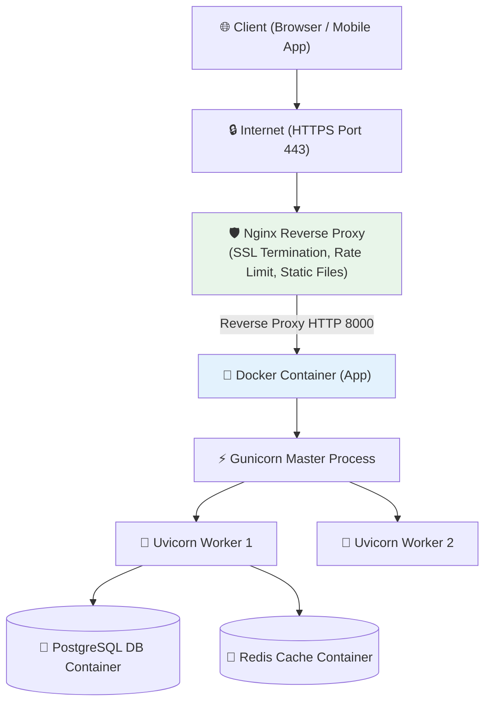

# Deployment & DevOps 🚀

## Deployment কী? (What)

**Deployment** হলো এমন একটি প্রক্রিয়া যার মাধ্যমে তোমার লোকাল মেশিনে (Laptop/PC) তৈরি করা FastAPI অ্যাপ্লিকেশনকে ইন্টারনেট বা প্রোডাকশন ক্লাউড সার্ভারে (যেমন: AWS, DigitalOcean, Hetzner) আপলোড ও কনফিগার করে সাধারণ ইউজারদের ব্যবহারের উপযোগী করা হয়।

প্রোডাকশনে FastAPI চালানোর জন্য কেবল `uvicorn main:app` চালানো যথেষ্ট নয়। নিরাপত্তার জন্য **Nginx Reverse Proxy**, কনটেইনারাইজেশনের জন্য **Docker**, প্রসেস ম্যানেজমেন্টের জন্য **Gunicorn/Systemd** এবং সিকিউরিটির জন্য **SSL (HTTPS)** কনফিগার করতে হয়।

---

## কেন প্রোডাকশন Deployment কনফিগারেশন দরকার? (Why)

```
❌ লোকাল ডেভলপমেন্ট রান (`uvicorn --reload`):
   - একক প্রসেসে (Single Thread) চলে — একের বেশি ইউজার রিকোয়েস্ট পাঠালে স্লো হয়ে যায়
   - HTTPS / SSL না থাকায় ডাটা প্লেইন টেক্সটে পাস হয় (অনিরাপদ)
   - সার্ভার রিস্টার্ট দিলে অ্যাপ বন্ধ হয়ে যায়
   - সিকিউরিটি হেডার এবং মেমোরি লিমিট থাকে না

✅ প্রোডাকশন ডিভলপমেন্ট (Docker + Nginx + Gunicorn):
   - Uvicorn/Gunicorn Workers-এর মাধ্যমে সব CPU Core ব্যবহার হয়
   - Nginx Reverse Proxy ডাটা কমপ্রেশন, স্ট্যাটিক ফাইল ও SSL (HTTPS) সামলায়
   - Docker-এর মাধ্যমে যেকোনো প্ল্যাটফর্মে একই এনভায়রনমেন্টে চলে
   - Crash করলে Systemd বা Docker রিস্টার্ট করে
```

---

## Production Deployment Architecture



---

## ১. Production Dockerfile তৈরি

প্রোডাকশন-রেডি, হালকা (Lightweight) এবং সিকিউর Docker Image তৈরি করতে **Multi-stage Build** অথবা Python Slim Base Image ব্যবহার করা উচিত।

```dockerfile
# Dockerfile

# 1. Base Image নির্বাচন করো (Lightweight Python 3.11)
FROM python:3.11-slim as builder

# 2. Environment Variables সেট করো
ENV PYTHONDONTWRITEBYTECODE=1 \
    PYTHONUNBUFFERED=1

# 3. Work Directory তৈরি করো
WORKDIR /app

# 4. সিস্টেম ডিপেন্ডেন্সি ইন্সটল করো (PostgreSQL/Build Tools)
RUN apt-get update && apt-get install -y --no-install-recommends \
    build-essential \
    libpq-dev \
    && rm -rf /var/lib/apt/lists/*

# 5. Requirements ফাইল কপি এবং প্যাকেজ ইন্সটল করো
COPY requirements.txt .
RUN pip install --no-cache-dir -r requirements.txt

# 6. সোর্স কোড কপি করো
COPY . .

# 7. Non-root ইউজার তৈরি ও সিকিউরিটি নিশ্চিত করো (Best Practice)
RUN useradd -m appuser && chown -R appuser:appuser /app
USER appuser

# 8. Port Expose করো
EXPOSE 8000

# 9. Gunicorn + Uvicorn Workers চালিয়ে অ্যাপ রান করো
CMD ["gunicorn", "app.main:app", "-w", "4", "-k", "uvicorn.workers.UvicornWorker", "-b", "0.0.0.0:8000"]
```

---

## ২. Docker Compose Configuration (FastAPI + PostgreSQL + Redis)

ডাটাবেজ, ক্যাশ এবং FastAPI ব্যাকএন্ড একসাথে চালানোর জন্য `docker-compose.yml` ফাইল ব্যবহার করা হয়।

```yaml
# docker-compose.yml
version: '3.8'

services:
  # 1. FastAPI Application
  web:
    build: .
    container_name: fastapi_web
    restart: always
    ports:
      - "8000:8000"
    env_file:
      - .env
    environment:
      - DATABASE_URL=postgresql://fastapi_user:secretpass@db:5432/fastapi_db
      - REDIS_URL=redis://redis:6379/0
    depends_on:
      - db
      - redis

  # 2. PostgreSQL Database
  db:
    image: postgres:15-alpine
    container_name: postgres_db
    restart: always
    environment:
      - POSTGRES_USER=fastapi_user
      - POSTGRES_PASSWORD=secretpass
      - POSTGRES_DB=fastapi_db
    volumes:
      - postgres_data:/var/lib/postgresql/data
    ports:
      - "5432:5432"

  # 3. Redis Cache
  redis:
    image: redis:7-alpine
    container_name: redis_cache
    restart: always
    ports:
      - "6379:6379"

volumes:
  postgres_data:
```

### Docker Compose কমান্ড:

```bash
# ব্যাকগ্রাউন্ডে সার্ভিসগুলো চালু করো
docker-compose up -d --build

# সার্ভিসের স্ট্যাটাস ও লগ দেখো
docker-compose ps
docker-compose logs -f web

# বন্ধ করো
docker-compose down
```

---

## ৩. Nginx Reverse Proxy & SSL (Certbot) Конфигурация

Nginx সরাসরি পোর্ট ৮০ (HTTP) ও ৪৪৩ (HTTPS) লিসেন করবে এবং অভ্যন্তরীণভাবে পোর্ট ৮০০০-এ রিকোয়েস্ট পাঠাবে।

### Nginx Configuration File (`/etc/nginx/sites-available/fastapi.conf`)

```nginx
server {
    listen 80;
    server_name api.yourdomain.com;

    # Certbot SSL Verification Path
    location /.well-known/acme-challenge/ {
        root /var/www/certbot;
    }

    # Redirect HTTP to HTTPS
    location / {
        return 301 https://$host$request_uri;
    }
}

server {
    listen 443 ssl http2;
    server_name api.yourdomain.com;

    # SSL Certificates (Certbot অটোমেটিক জেনারেট করবে)
    ssl_certificate /etc/letsencrypt/live/api.yourdomain.com/fullchain.pem;
    ssl_certificate_key /etc/letsencrypt/live/api.yourdomain.com/privkey.pem;

    # SSL Optimization
    ssl_protocols TLSv1.2 TLSv1.3;
    ssl_ciphers HIGH:!aNULL:!MD5;

    # Request Body Size Limit (ফাইল আপলোডের জন্য)
    client_max_body_size 20M;

    # FastAPI Application Reverse Proxy
    location / {
        proxy_pass http://127.0.0.1:8000;
        proxy_set_header Host $host;
        proxy_set_header X-Real-IP $remote_addr;
        proxy_set_header X-Forwarded-For $proxy_add_x_forwarded_for;
        proxy_set_header X-Forwarded-Proto $scheme;

        # WebSocket Support
        proxy_http_version 1.1;
        proxy_set_header Upgrade $http_upgrade;
        proxy_set_header Connection "upgrade";
    }
}
```

### Let's Encrypt SSL (Certbot) ইনস্টলেশন

```bash
# Certbot ইন্সটল করো
sudo apt install certbot python3-certbot-nginx

# অটোমেটিক ফ্রি SSL সার্টিফিকেট নাও
sudo certbot --nginx -d api.yourdomain.com
```

---

## ৪. Bare-Metal Deployment: Systemd Service Setup

Docker ছাড়া সরাসরি Linux Ubuntu সার্ভারে প্রসেস চালানোর জন্য Systemd Service তৈরি করতে হয়।

`/etc/systemd/system/fastapi.service` ফাইল তৈরি করো:

```ini
[Unit]
Description=FastAPI Gunicorn Application Service
After=network.target

[Service]
User=ubuntu
Group=www-data
WorkingDirectory=/home/ubuntu/my_fastapi_project
Environment="PATH=/home/ubuntu/my_fastapi_project/venv/bin"
EnvironmentFile=/home/ubuntu/my_fastapi_project/.env
ExecStart=/home/ubuntu/my_fastapi_project/venv/bin/gunicorn app.main:app -w 4 -k uvicorn.workers.UvicornWorker -b 127.0.0.1:8000

Restart=always
RestartSec=5

[Install]
WantedBy=multi-user.target
```

### Systemd Service কমান্ড:

```bash
# Systemd রিলোড করো
sudo systemctl daemon-reload

# সার্ভিস এনাবল ও স্টার্ট করো
sudo systemctl enable fastapi
sudo systemctl start fastapi

# স্ট্যাটাস চেক করো
sudo systemctl status fastapi
```

---

## Comparison: Deployment Environments

| মাধ্যম | সুবিধা | অসুবিধা | উপযুক্ত ব্যবহার |
|--------|--------|--------|----------------|
| **Docker Compose** | পোর্টেবল, একই সাথে DB সহ পরিবেশ তৈরি সহজ | কনটেইনারের মেমোরি হেডার | মাঝারি প্রজেক্ট / VPS Deployment |
| **Systemd Service** | কম মেমোরি খরচ, সরাসরি Linux OS-এ চলে | ডাটাবেজ আলাদা কনফিগার করতে হয় | Single VPS / Bare-Metal |
| **PaaS (Render / Railway)** | জিরো ডেভঅপস, এক ক্লিকে ডিপ্লয় | কাস্টম কনফিগারেশন সীমিত, খরচ বেশি | MVP / Prototypes / Small APIs |
| **Kubernetes (EKS / GKE)** | অটো-স্কেলিং, সেলফ-হিলিং, হাই-এভেলেবিলিটি | কনফিগারেশন এবং মেইনটেন্যান্স খুব জটিল | Large Scale Enterprise APIs |

---

## Common Mistakes ⚠️

::: danger ভুল ১: Production Environment-এ SECRET_KEY হার্ডকোড করে রাখা
`.env` ফাইল ভার্সন কন্ট্রোল (Git)-এ পুশ করা বা কোডের ভেতর SECRET_KEY বা DB Password হার্ডকোড করা একটি মারাত্মক সিকিউরিটি থ্রেট।
:::

::: danger ভুল ২: Docker Image-এ `root` ইউজার হিসেবে অ্যাপ্লিকেশন রান করা
Docker Container-এ ইউজার স্পেসিফাই না করলে রুট ইউজার হিসেবে অ্যাপ চলে। কনটেইনার হ্যাক হলে মূল সার্ভার ক্ষতিগ্রস্ত হতে পারে।
:::

::: warning ভুল ৩: Nginx-এ WebSocket Upgrade Header না দেওয়া
Nginx Reverse Proxy-তে `Upgrade` এবং `Connection` হেডার কনফিগার না করলে WebSocket সার্ভিস প্রক্সি পার হয়ে কাজ করবে না।
:::

---

## Best Practices ✨

- **Multi-stage Docker Build:** ইমেজ সাইজ ছোট রাখতে এবং অপ্রয়োজনীয় ফাইল সরাতে Multi-stage Dockerfile ব্যবহার করো।
- **Non-Root Docker User:** `RUN useradd -m appuser` দিয়ে নন-রুট ইউজারে অ্যাপ চালাও।
- **SSL Enforce:** HTTP (Port 80) কে অটোমেটিক HTTPS (Port 443)-এ রিডাইরেক্ট করো।
- **Health Check Endpoint:** AWS ALB বা Docker Swarm-এর জন্য অ্যাপের ভেতরে `/health` এন্ট্রিপয়েন্ট রাখো।
- **Environment Variables:** `pydantic-settings` দিয়ে শক্তিশালী এনভায়রনমেন্ট ভ্যালিডেশন মানো।

---

## Interview Questions 🎯

**প্রশ্ন ১: Nginx কে FastAPI-র সামনে Reverse Proxy হিসেবে কেন ব্যবহার করা হয়?**

> **উত্তর:** Nginx অত্যন্ত দ্রুতগতির ওয়েব সার্ভার। এটি SSL Termination (HTTPS ডিক্রিপশন), Static Files serve করা, Rate Limiting, DDoS প্রটেকশন, Response Compression (Gzip) এবং লোড ব্যালান্সিং সামলায়। ফলে FastAPI ব্যাকএন্ড কেবল মূল বিজনেস লজিকে মনোযোগ দিতে পারে।

**প্রশ্ন ২: Docker Container-এ `Gunicorn` এবং `Uvicorn` কীভাবে একসাথে কাজ করে?**

> **উত্তর:** Gunicorn কাজ করে প্রসেস ম্যানেজার (Master) হিসেবে যা একাধিক প্রসেস তৈরি ও মনিটর করে। আর Uvicorn কাজ করে Worker হিসেবে (Async ASGI execution)। `gunicorn -k uvicorn.workers.UvicornWorker` চালানোর ফলে Gunicorn-এর প্রসেস ম্যানেজমেন্ট এবং Uvicorn-এর দ্রুতগতির Async ক্ষমতা দুটো একসাথে পাওয়া যায়।

**প্রশ্ন ৩: Docker Image সাইজ কমানোর প্রধান উপায়গুলো কী কী?**

> **উত্তর:** ① `python:3.11-slim` বা `alpine` বেস ইমেজ ব্যবহার করা, ② Multi-stage Build মানা, ③ `.dockerignore` ফাইল দিয়ে `.git`, `__pycache__`, `venv` ফাইল বাদ দেওয়া এবং ④ `pip install --no-cache-dir` ব্যবহার করা।

**প্রশ্ন ৪: Let's Encrypt Certbot এর অটো-রিনিউয়াল কীভাবে কাজ করে?**

> **উত্তর:** Certbot ইন্সটল করার সাথে সাথে Linux Systemd-এ একটি টাইম ট্রিকার চালু হয় যা দিনে দুইবার চেক করে সার্টিফিকেটের মেয়াদ ৩০ দিনের কম আছে কিনা। থাকলে তা স্বয়ংক্রিয়ভাবে রিনিউ করে Nginx রিলোড করে।

---

## Summary 📋

- ✅ **Dockerization**: পোর্টেবল ও নিরাপদ এনভায়রনমেন্টের জন্য কাস্টম Dockerfile তৈরি করা হয়।
- ✅ **Docker Compose**: FastAPI, PostgreSQL এবং Redis একসাথে অরকেস্ট্রেট করা হয়।
- ✅ **Nginx Reverse Proxy**: SSL (Certbot) এনক্রিপশন ও সিকিউরিটি লেয়ার সামলাতে Nginx ব্যবহৃত হয়।
- ✅ **Systemd**: Bare-metal Linux সার্ভারে প্রসেস অটো-রিস্টার্ট নিশ্চিত করতে Systemd সার্ভিস কনফিগার করা হয়।

---

## পরবর্তী ধাপ ➡️

Deployment & DevOps শেখা শেষ হলো। এখন কোর্স সমাপনীর শেষ টপিকে তোমরা শিখবে **Best Practices & Enterprise Cheat Sheet** — Production Checklist, Code Quality, Security Audit, N+1 Query Fixes এবং FastAPI Master Cheat Sheet।
