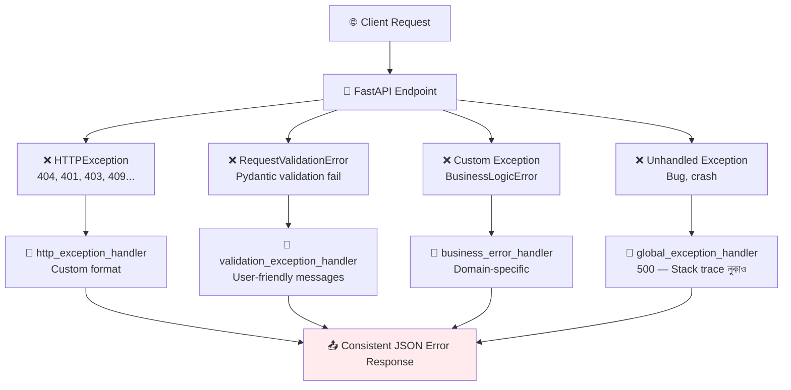

# Error Handling 🚨

## Error Handling কী? (What)

**Error Handling** মানে হলো — API-তে কোনো সমস্যা হলে client-কে সঠিক, meaningful, এবং consistent error message পাঠানো।

একটি professional API-তে error response সবসময় একই format-এ আসে — যেন client সহজে parse করতে পারে এবং সঠিক action নিতে পারে।

```json
// ✅ Professional consistent error format
{
    "success": false,
    "error": {
        "code": "USER_NOT_FOUND",
        "message": "ID 42 এর user পাওয়া যায়নি",
        "field": null,
        "status_code": 404
    },
    "request_id": "req-abc123"
}
```

---

## কেন সঠিক Error Handling দরকার? (Why)

```
❌ ভুল Error Handling:
   - Stack trace client-এ যায় → Security risk!
   - প্রতিটি endpoint ভিন্ন format-এ error দেয় → Client confused
   - 500 Internal Server Error সব কিছুতেই → Debugging কঠিন
   - Validation error: {"detail": [...]} → Frontend-এ parse কঠিন

✅ সঠিক Error Handling:
   - Consistent JSON format সব error-এ
   - Meaningful error message বাংলায়/ইংরেজিতে
   - Correct HTTP status code
   - Error code (USER_NOT_FOUND, INVALID_TOKEN)
   - Stack trace কখনো client-এ না
```

---

## Error Handling Flow



---

## ১. HTTPException — মৌলিক Error

```python
from fastapi import FastAPI, HTTPException, status
from pydantic import BaseModel
from typing import Optional

app = FastAPI()

# ===== Basic HTTPException =====
@app.get("/users/{user_id}")
def get_user(user_id: int):
    """
    HTTPException raise করলে FastAPI সুন্দর error response তৈরি করে।
    Default format: {"detail": "..."}
    """
    if user_id <= 0:
        raise HTTPException(
            status_code=status.HTTP_400_BAD_REQUEST,
            detail="User ID অবশ্যই positive integer হতে হবে"
        )

    users_db = {1: "আরিফ", 2: "নাফিসা"}
    user = users_db.get(user_id)

    if not user:
        raise HTTPException(
            status_code=status.HTTP_404_NOT_FOUND,
            detail=f"ID {user_id} এর user পাওয়া যায়নি"
        )

    return {"id": user_id, "name": user}

# ===== HTTPException with Headers =====
@app.get("/protected/")
def protected_route(token: Optional[str] = None):
    if not token:
        raise HTTPException(
            status_code=status.HTTP_401_UNAUTHORIZED,
            detail="Authentication token দিতে হবে",
            headers={
                "WWW-Authenticate": "Bearer",    # Standard auth header
                "X-Error-Code": "MISSING_TOKEN"
            }
        )
    return {"data": "protected data"}

# ===== Detail as dict — rich error info =====
@app.post("/orders/")
def create_order(product_id: int, quantity: int):
    inventory = {1: 5, 2: 0, 3: 100}
    stock = inventory.get(product_id, 0)

    if stock == 0:
        raise HTTPException(
            status_code=status.HTTP_409_CONFLICT,
            detail={
                "code": "OUT_OF_STOCK",
                "message": "পণ্যটি stock-এ নেই",
                "product_id": product_id,
                "available_stock": stock
            }
        )

    if quantity > stock:
        raise HTTPException(
            status_code=status.HTTP_422_UNPROCESSABLE_ENTITY,
            detail={
                "code": "INSUFFICIENT_STOCK",
                "message": f"শুধু {stock}টি পণ্য আছে, {quantity}টি চাওয়া হয়েছে",
                "requested": quantity,
                "available": stock
            }
        )

    return {"message": "Order তৈরি হয়েছে", "product_id": product_id, "quantity": quantity}
```

---

## ২. Custom Exception Classes

```python
# exceptions.py — Custom Exception সংজ্ঞায়িত করো

class AppException(Exception):
    """সব custom exception-এর base class"""

    def __init__(
        self,
        status_code: int,
        error_code: str,
        message: str,
        field: Optional[str] = None,
        extra: Optional[dict] = None
    ):
        self.status_code = status_code
        self.error_code = error_code
        self.message = message
        self.field = field
        self.extra = extra or {}
        super().__init__(message)

# ===== Specific Exception Classes =====

class NotFoundException(AppException):
    """Resource পাওয়া যায়নি — 404"""
    def __init__(self, resource: str, identifier):
        super().__init__(
            status_code=404,
            error_code="NOT_FOUND",
            message=f"{resource} পাওয়া যায়নি (ID: {identifier})"
        )

class AlreadyExistsException(AppException):
    """Duplicate resource — 409"""
    def __init__(self, resource: str, field: str, value: str):
        super().__init__(
            status_code=409,
            error_code="ALREADY_EXISTS",
            message=f"{resource} এর {field} '{value}' ইতিমধ্যে আছে",
            field=field
        )

class UnauthorizedException(AppException):
    """Authentication fail — 401"""
    def __init__(self, message: str = "Login প্রয়োজন"):
        super().__init__(
            status_code=401,
            error_code="UNAUTHORIZED",
            message=message
        )

class ForbiddenException(AppException):
    """Permission নেই — 403"""
    def __init__(self, message: str = "এই কাজের অনুমতি নেই"):
        super().__init__(
            status_code=403,
            error_code="FORBIDDEN",
            message=message
        )

class BusinessLogicException(AppException):
    """Business rule violation — 422"""
    def __init__(self, error_code: str, message: str, **kwargs):
        super().__init__(
            status_code=422,
            error_code=error_code,
            message=message,
            extra=kwargs
        )

# ব্যবহার
class InsufficientBalanceException(BusinessLogicException):
    def __init__(self, current: float, required: float):
        super().__init__(
            error_code="INSUFFICIENT_BALANCE",
            message=f"Balance অপর্যাপ্ত। প্রয়োজন: ৳{required:.2f}, আছে: ৳{current:.2f}",
            current_balance=current,
            required_amount=required
        )
```

---

## ৩. Consistent Error Response Model

```python
# error_schema.py
from pydantic import BaseModel
from typing import Optional, Any, List
from datetime import datetime

class ErrorDetail(BaseModel):
    """Single error detail"""
    code: str                          # Machine-readable error code
    message: str                       # Human-readable message
    field: Optional[str] = None        # কোন field-এ error (validation-এর জন্য)
    value: Optional[Any] = None        # কোন value problem করেছে

class ErrorResponse(BaseModel):
    """Standard API error response"""
    success: bool = False
    status_code: int
    errors: List[ErrorDetail]
    timestamp: datetime = datetime.utcnow()
    path: Optional[str] = None
    request_id: Optional[str] = None

def create_error_response(
    status_code: int,
    code: str,
    message: str,
    field: Optional[str] = None,
    path: Optional[str] = None,
    request_id: Optional[str] = None,
    extra_errors: Optional[List[dict]] = None
) -> dict:
    """Consistent error response তৈরির helper function"""
    errors = [{"code": code, "message": message, "field": field}]

    if extra_errors:
        errors.extend(extra_errors)

    return {
        "success": False,
        "status_code": status_code,
        "errors": errors,
        "timestamp": datetime.utcnow().isoformat(),
        "path": path,
        "request_id": request_id
    }
```

---

## ৪. Exception Handlers — Global Error Handling

```python
# main.py
from fastapi import FastAPI, Request, status
from fastapi.responses import JSONResponse
from fastapi.exceptions import RequestValidationError
from fastapi.exception_handlers import http_exception_handler as default_http_handler
from starlette.exceptions import HTTPException as StarletteHTTPException
from exceptions import AppException
from datetime import datetime
import logging
import traceback
import uuid

logger = logging.getLogger(__name__)
app = FastAPI()

# ===== Helper — Request ID পাও =====
def get_request_id(request: Request) -> str:
    return request.headers.get("X-Request-ID", str(uuid.uuid4())[:8])

# ===== ① HTTPException Handler — Custom Format =====
@app.exception_handler(StarletteHTTPException)
async def custom_http_exception_handler(request: Request, exc: StarletteHTTPException):
    """
    FastAPI-র default HTTPException handler override করো।
    Default: {"detail": "..."} → Custom: {"success": false, "errors": [...]}
    """
    request_id = get_request_id(request)

    # detail dict বা string হতে পারে
    if isinstance(exc.detail, dict):
        # Already structured — use as is
        error_code = exc.detail.get("code", "HTTP_ERROR")
        message = exc.detail.get("message", str(exc.detail))
    else:
        error_code = f"HTTP_{exc.status_code}"
        message = str(exc.detail)

    logger.warning(
        f"[{request_id}] HTTPException {exc.status_code}: {message} "
        f"| Path: {request.url.path}"
    )

    return JSONResponse(
        content={
            "success": False,
            "status_code": exc.status_code,
            "errors": [{"code": error_code, "message": message, "field": None}],
            "path": str(request.url.path),
            "request_id": request_id,
            "timestamp": datetime.utcnow().isoformat()
        },
        status_code=exc.status_code,
        headers=getattr(exc, "headers", None)
    )

# ===== ② Validation Error Handler =====
@app.exception_handler(RequestValidationError)
async def validation_exception_handler(request: Request, exc: RequestValidationError):
    """
    Pydantic validation error — user-friendly বাংলা message।
    Default: nested complex JSON → Custom: simple error list
    """
    request_id = get_request_id(request)

    errors = []
    for error in exc.errors():
        # Field path বের করো (body → name → field_name)
        loc = error.get("loc", [])
        field = ".".join(str(l) for l in loc if l not in ("body", "query", "path"))

        # Error type থেকে user-friendly message
        error_type = error.get("type", "")
        raw_msg = error.get("msg", "")
        value = error.get("input")

        # বাংলায় error messages
        friendly_messages = {
            "missing": f"'{field}' field দেওয়া আবশ্যক",
            "string_too_short": f"'{field}' কমপক্ষে {error.get('ctx', {}).get('min_length', '?')} অক্ষরের হতে হবে",
            "string_too_long": f"'{field}' সর্বোচ্চ {error.get('ctx', {}).get('max_length', '?')} অক্ষরের হতে পারবে",
            "int_parsing": f"'{field}' অবশ্যই একটি সংখ্যা হতে হবে",
            "float_parsing": f"'{field}' অবশ্যই একটি দশমিক সংখ্যা হতে হবে",
            "bool_parsing": f"'{field}' true/false হতে হবে",
            "greater_than": f"'{field}' {error.get('ctx', {}).get('gt', '?')} এর বেশি হতে হবে",
            "greater_than_equal": f"'{field}' কমপক্ষে {error.get('ctx', {}).get('ge', '?')} হতে হবে",
            "less_than": f"'{field}' {error.get('ctx', {}).get('lt', '?')} এর কম হতে হবে",
            "less_than_equal": f"'{field}' সর্বোচ্চ {error.get('ctx', {}).get('le', '?')} হতে পারবে",
            "string_pattern_mismatch": f"'{field}' সঠিক format-এ নয়",
            "value_error": raw_msg,
        }

        message = friendly_messages.get(error_type, raw_msg)

        errors.append({
            "code": "VALIDATION_ERROR",
            "message": message,
            "field": field if field else None,
            "value": str(value) if value is not None else None
        })

    logger.warning(
        f"[{request_id}] Validation Error: {len(errors)} errors "
        f"| Path: {request.url.path}"
    )

    return JSONResponse(
        content={
            "success": False,
            "status_code": 422,
            "errors": errors,
            "path": str(request.url.path),
            "request_id": request_id,
            "timestamp": datetime.utcnow().isoformat()
        },
        status_code=status.HTTP_422_UNPROCESSABLE_ENTITY
    )

# ===== ③ Custom AppException Handler =====
@app.exception_handler(AppException)
async def app_exception_handler(request: Request, exc: AppException):
    """সব custom AppException handle করো"""
    request_id = get_request_id(request)

    logger.warning(
        f"[{request_id}] AppException {exc.status_code} [{exc.error_code}]: "
        f"{exc.message} | Path: {request.url.path}"
    )

    error_detail = {
        "code": exc.error_code,
        "message": exc.message,
        "field": exc.field
    }
    if exc.extra:
        error_detail["extra"] = exc.extra

    return JSONResponse(
        content={
            "success": False,
            "status_code": exc.status_code,
            "errors": [error_detail],
            "path": str(request.url.path),
            "request_id": request_id,
            "timestamp": datetime.utcnow().isoformat()
        },
        status_code=exc.status_code
    )

# ===== ④ Global Unhandled Exception Handler — Last Resort =====
@app.exception_handler(Exception)
async def global_exception_handler(request: Request, exc: Exception):
    """
    সব unhandled exception এখানে আসবে।
    Stack trace log করো কিন্তু client-এ পাঠাবে না!
    """
    request_id = get_request_id(request)

    # Full error log করো — server-side debugging-এর জন্য
    logger.error(
        f"[{request_id}] Unhandled Exception: {type(exc).__name__}: {str(exc)}\n"
        f"Path: {request.url.path}\n"
        f"{traceback.format_exc()}"
    )

    # Client-এ শুধু generic message — stack trace না!
    return JSONResponse(
        content={
            "success": False,
            "status_code": 500,
            "errors": [{
                "code": "INTERNAL_SERVER_ERROR",
                "message": "Server-এ একটি সমস্যা হয়েছে। আবার চেষ্টা করুন।",
                "field": None
            }],
            "path": str(request.url.path),
            "request_id": request_id,
            "timestamp": datetime.utcnow().isoformat()
        },
        status_code=500
    )
```

---

## ৫. Endpoint-এ Custom Exception ব্যবহার

```python
from fastapi import Depends
from sqlalchemy.orm import Session
from exceptions import NotFoundException, AlreadyExistsException, InsufficientBalanceException
import crud

@app.get("/users/{user_id}", tags=["Users"])
def get_user(user_id: int, db: Session = Depends(get_db)):
    """Custom exception — clean endpoint code"""
    user = crud.get_user(db, user_id)
    if not user:
        raise NotFoundException("User", user_id)   # ← মাত্র একলাইন!
    return user

@app.post("/users/", tags=["Users"], status_code=201)
def create_user(user_data: UserCreate, db: Session = Depends(get_db)):
    # Duplicate email check
    if crud.get_user_by_email(db, user_data.email):
        raise AlreadyExistsException("User", "email", user_data.email)

    # Duplicate username check
    if crud.get_user_by_username(db, user_data.username):
        raise AlreadyExistsException("User", "username", user_data.username)

    return crud.create_user(db, user_data)

@app.post("/payments/", tags=["Payments"])
def process_payment(amount: float, user_id: int, db: Session = Depends(get_db)):
    user = crud.get_user(db, user_id)
    if not user:
        raise NotFoundException("User", user_id)

    user_balance = 500.0  # Real app-এ DB থেকে আনো
    if user_balance < amount:
        raise InsufficientBalanceException(
            current=user_balance,
            required=amount
        )

    return {"message": f"৳{amount:.2f} payment সফল", "new_balance": user_balance - amount}
```

---

## ৬. Endpoint-Level Error Response Documentation

```python
@app.get(
    "/products/{product_id}",
    response_model=ProductResponse,
    responses={
        200: {"description": "Product পাওয়া গেছে"},
        404: {
            "description": "Product পাওয়া যায়নি",
            "content": {
                "application/json": {
                    "example": {
                        "success": False,
                        "status_code": 404,
                        "errors": [{
                            "code": "NOT_FOUND",
                            "message": "Product পাওয়া যায়নি (ID: 99)",
                            "field": None
                        }]
                    }
                }
            }
        },
        422: {"description": "Validation Error — product_id integer হতে হবে"}
    }
)
def get_product(product_id: int, db: Session = Depends(get_db)):
    product = crud.get_product(db, product_id)
    if not product:
        raise NotFoundException("Product", product_id)
    return product
```

---

## ৭. Health Check Endpoint — সিস্টেম Status

```python
from fastapi import FastAPI
from fastapi.responses import JSONResponse
from sqlalchemy import text
from database import engine
import psutil   # pip install psutil

@app.get("/health", include_in_schema=False)
async def health_check():
    """
    System health check — Load balancer ব্যবহার করে।
    include_in_schema=False → Swagger-এ দেখাবে না
    """
    health_status = {"status": "healthy", "checks": {}}

    # Database check
    try:
        with engine.connect() as conn:
            conn.execute(text("SELECT 1"))
        health_status["checks"]["database"] = "✅ connected"
    except Exception as e:
        health_status["checks"]["database"] = f"❌ {str(e)}"
        health_status["status"] = "unhealthy"

    # Memory check
    memory = psutil.virtual_memory()
    health_status["checks"]["memory"] = {
        "total_gb": round(memory.total / (1024**3), 2),
        "used_percent": memory.percent,
        "status": "⚠️ high" if memory.percent > 90 else "✅ ok"
    }

    status_code = 200 if health_status["status"] == "healthy" else 503
    return JSONResponse(content=health_status, status_code=status_code)
```

---

## Error Code Reference

| Error Code | Status | কখন |
|-----------|--------|------|
| `NOT_FOUND` | 404 | Resource পাওয়া যায়নি |
| `ALREADY_EXISTS` | 409 | Duplicate data |
| `UNAUTHORIZED` | 401 | Login করোনি |
| `FORBIDDEN` | 403 | Permission নেই |
| `VALIDATION_ERROR` | 422 | Invalid input |
| `INSUFFICIENT_STOCK` | 422 | Stock শেষ |
| `INSUFFICIENT_BALANCE` | 422 | Balance কম |
| `RATE_LIMIT_EXCEEDED` | 429 | Too many requests |
| `SERVICE_UNAVAILABLE` | 503 | Server/DB down |
| `INTERNAL_SERVER_ERROR` | 500 | Unexpected bug |

---

## Common Mistakes ⚠️

::: danger ভুল ১: Stack trace client-এ পাঠানো
```python
# ❌ ভুল — Internal error details expose!
@app.exception_handler(Exception)
async def handler(request, exc):
    import traceback
    return JSONResponse({
        "error": str(exc),
        "traceback": traceback.format_exc()   # ← Security risk! DB structure, paths দেখা যাচ্ছে
    }, status_code=500)

# ✅ সঠিক — Log করো, client-এ generic message
@app.exception_handler(Exception)
async def handler(request, exc):
    logger.error(traceback.format_exc())   # Server-এ log
    return JSONResponse({
        "error": "Internal server error"    # Client-এ generic
    }, status_code=500)
```
:::

::: danger ভুল ২: সব Error-এ 200 OK পাঠানো
```python
# ❌ ভুল — HTTP status 200 কিন্তু error content!
@app.get("/users/{id}")
def get_user(id: int):
    user = db.get(id)
    if not user:
        return {"success": False, "error": "Not found"}  # status=200 ❌

# ✅ সঠিক — সঠিক HTTP status code ব্যবহার করো
@app.get("/users/{id}")
def get_user(id: int):
    user = db.get(id)
    if not user:
        raise HTTPException(status_code=404, detail="User পাওয়া যায়নি")  # ✅
```
:::

::: warning ভুল ৩: Exception handler-এ সঠিক Exception type না দেওয়া
```python
# ❌ ভুল — HTTPException থেকে ধরতে হলে StarletteHTTPException ব্যবহার করো
from fastapi import HTTPException

@app.exception_handler(HTTPException)   # ← FastAPI HTTPException
async def handler(request, exc):
    # শুধু FastAPI HTTPException ধরবে, Starlette-এর ধরবে না
    ...

# ✅ সঠিক — Starlette HTTPException উভয়কে ধরে
from starlette.exceptions import HTTPException as StarletteHTTPException

@app.exception_handler(StarletteHTTPException)   # ← সব HTTP exception
async def handler(request, exc):
    ...
```
:::

---

## Best Practices ✨

- **Consistent error format** — সব error-এ একই JSON structure (`success`, `errors`, `status_code`, `timestamp`)
- **Error codes ব্যবহার করো** — `NOT_FOUND`, `ALREADY_EXISTS` — machine-readable
- **Stack trace server-এ log করো, client-এ না** — Security critical
- **Custom Exception class hierarchy রাখো** — `AppException → NotFoundException → ...`
- **Validation error-কে user-friendly করো** — Pydantic-এর technical message বাংলায় translate করো
- **`StarletteHTTPException` ব্যবহার করো** — `HTTPException`-এর বদলে — সব HTTP error ধরবে
- **Request ID সব error-এ দাও** — Debugging-এ সহজ হয়
- **Health check endpoint রাখো** — DB, external services status monitor করো
- **Sentry/DataDog integrate করো** — Production error tracking-এর জন্য

---

## Interview Questions 🎯

**প্রশ্ন ১: FastAPI-তে `HTTPException` এবং custom exception-এর মধ্যে কোনটা কখন ব্যবহার করবো?**

> **উত্তর:** `HTTPException` simple cases-এ ব্যবহার করো — যখন শুধু status code ও message দরকার। Custom exception class তৈরি করো যখন: একই error বিভিন্ন জায়গায় raise হয়, error-এ extra data দরকার (current_balance, available_stock), business domain-specific error semantics আছে। Custom exception + global handler = clean, consistent code।

**প্রশ্ন ২: `RequestValidationError` কীভাবে handle করবো?**

> **উত্তর:** `@app.exception_handler(RequestValidationError)` দিয়ে override করো। Default Pydantic error technical ও verbose। Custom handler-এ `exc.errors()` loop করো, প্রতিটি error-এর `type`, `loc`, `msg` থেকে user-friendly message তৈরি করো। `loc` দিয়ে field name বের করো, `type` দিয়ে বাংলায় message দাও।

**প্রশ্ন ৩: Global exception handler (`Exception`) কেন দরকার?**

> **উত্তর:** Production-এ যেকোনো unexpected exception (DB connection drop, memory error, library bug) আসতে পারে। Global handler না থাকলে FastAPI ugly 500 response দেবে বা stack trace expose করবে। Global handler দিয়ে: ① Stack trace server-এ log করো ② Client-এ generic safe message দাও ③ Error tracking tool-এ (Sentry) পাঠাও।

**প্রশ্ন ৪: Error response-এ `request_id` কেন দরকার?**

> **উত্তর:** User report করলে বলে "error হয়েছে" — কিন্তু কোনটা? `request_id` দিলে user সেটি জানাতে পারে, developer সেই ID দিয়ে log-এ সেই exact request খুঁজে পায়। Distributed systems-এ একটি request অনেক service-এ যায় — একই `request_id` সব জায়গায় propagate করলে end-to-end trace করা যায় (distributed tracing)।

---

## Summary 📋

- ✅ `HTTPException(status_code=404, detail="...")` → Simple error raise করো
- ✅ `detail` হতে পারে `str` অথবা `dict` — rich error info-র জন্য dict দাও
- ✅ Custom Exception class: `AppException → NotFoundException → ...` hierarchy
- ✅ `@app.exception_handler(StarletteHTTPException)` → HTTP error format override
- ✅ `@app.exception_handler(RequestValidationError)` → Validation error বাংলায়
- ✅ `@app.exception_handler(AppException)` → Custom domain errors
- ✅ `@app.exception_handler(Exception)` → Global fallback — stack trace কখনো client-এ না
- ✅ Consistent format: `{success, status_code, errors, timestamp, path, request_id}`
- ✅ Error codes: `NOT_FOUND`, `ALREADY_EXISTS`, `VALIDATION_ERROR` — machine-readable
- ✅ Server-এ log করো, client-এ generic message দাও

---

## পরবর্তী ধাপ ➡️

Error Handling শেখা হলো — Level 2 Intermediate সম্পূর্ণ! এখন **Level 3 Advanced** শুরু হবে। **Pydantic Advanced** শিখবে — custom validators (`@field_validator`, `@model_validator`), computed fields, serializer decorators, model config, JSON schema customization এবং advanced patterns।
