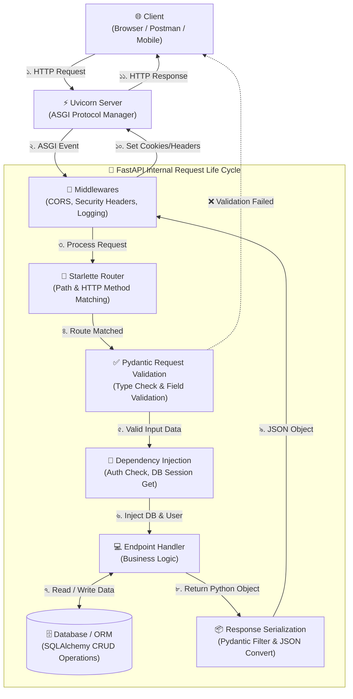

# FastAPI পরিচিতি 🚀

## FastAPI কী? (What)

**FastAPI** হলো Python-এর একটি আধুনিক, উচ্চ-কার্যক্ষমতাসম্পন্ন web framework যা API তৈরির জন্য বিশেষভাবে ডিজাইন করা হয়েছে। এটি Python 3.8+ এর **type hints** ব্যবহার করে এবং স্বয়ংক্রিয়ভাবে API documentation তৈরি করে।

FastAPI দুটি শক্তিশালী library-র উপর নির্মিত:
- **Starlette** — ASGI web framework (routing, middleware, WebSocket)
- **Pydantic** — Data validation ও serialization

> **ASGI** (Asynchronous Server Gateway Interface) হলো Python web server-এর আধুনিক standard, যা async/await সাপোর্ট করে।

---

## কেন FastAPI? (Why)

FastAPI ছাড়া যদি raw Python বা Flask ব্যবহার করো, তাহলে:

- ✗ প্রতিটি request-এর data manually validate করতে হবে
- ✗ API documentation নিজে লিখতে হবে (Swagger/ReDoc)
- ✗ Type error runtime-এ ধরা পড়বে, আগে না
- ✗ Async support জটিল বা অনুপস্থিত

FastAPI দিয়ে এই সব সমস্যা **automatically** সমাধান হয়।

---

## Framework তুলনা

| বৈশিষ্ট্য | FastAPI | Flask | Django REST |
|-----------|:-------:|:-----:|:-----------:|
| **পারফরম্যান্স** | ⚡⚡⚡⚡⚡ | ⚡⚡⚡ | ⚡⚡⚡ |
| **Auto Documentation** | ✅ Built-in | ❌ Manual | ⚠️ 3rd party |
| **Type Validation** | ✅ Pydantic | ❌ Manual | ✅ Serializer |
| **Async/Await** | ✅ Native | ⚠️ Plugin | ⚠️ Limited |
| **WebSocket** | ✅ Built-in | ❌ | ❌ |
| **Learning Curve** | সহজ-মাঝারি | সহজ | কঠিন |
| **Production Ready** | ✅ | ✅ | ✅ |
| **Creator** | Sebastián Ramírez | Armin Ronacher | Django Software Foundation |
| **বড় ব্যবহারকারী** | Netflix, Uber, Microsoft | Pinterest, LinkedIn | Instagram, Disqus |

---

## System Architecture & API Life Cycle 🔄

FastAPI-তে একটি HTTP Request আসার পর থেকে Client-এ Response ফিরে যাওয়া পর্যন্ত সম্পূর্ণ জীবনচক্র (Life Cycle) নিচে ডায়াগ্রামের মাধ্যমে দেখানো হলো:



### 📍 API Life Cycle-এর ধাপসমূহ:

1. **Client Request:** ক্লায়েন্ট (Browser/Mobile App) কোনো HTTP রিকোয়েস্ট পাঠায়।
2. **ASGI Server (Uvicorn):** Uvicorn সার্ভার রিকোয়েস্ট গ্রহণ করে FastAPI অ্যাপে পাঠায়।
3. **Middlewares:** CORS, Security Headers, Request Logging ইত্যাদি মধ্যবর্তী লেয়ারে প্রসেস হয়।
4. **Router:** Starlette Router সঠিক URL path ও HTTP method (GET/POST/PUT/DELETE) ম্যাচ করে।
5. **Pydantic Request Validation:** ইনপুট ডেটার টাইপ ও ফরম্যাট চেক করা হয়। ভুল থাকলে সাথে সাথে `422 Unprocessable Entity` এরর ক্লায়েন্টে ফেরত যায়।
6. **Dependency Injection:** `Depends()` দিয়ে Auth Check, DB Session হ্যান্ডেল করা হয়।
7. **Endpoint & Database:** বিজনেস লজিক এক্সিকিউট হয় এবং প্রয়োজনে ডাটাবেজে CRUD অপারেশন চালানো হয়।
8. **Response Serialization:** `response_model` দিয়ে গোপন তথ্য (যেমন পাসওয়ার্ড) বাদ দিয়ে ডেটা ফিল্টার এবং JSON-এ কনভার্ট করা হয়।
9. **Final Response:** প্রস্তুতকৃত JSON রেসপন্স ক্লায়েন্টের কাছে ফেরত পাঠানো হয়।

---

## Installation (ইন্সটলেশন)

### ধাপ ১: Python version চেক করো

```bash
python --version
# Python 3.8 বা তার বেশি থাকতে হবে
```

### ধাপ ২: Virtual Environment তৈরি করো

```bash
# Virtual environment তৈরি (recommended)
python -m venv venv

# Activate করো (Windows)
venv\Scripts\activate

# Activate করো (Linux/Mac)
source venv/bin/activate
```

### ধাপ ৩: FastAPI ইন্সটল করো

```bash
# Minimum installation
pip install fastapi uvicorn

# সব optional dependencies সহ (recommended for development)
pip install "fastapi[all]"
# এতে পাবে: uvicorn, pydantic, httpx, python-multipart, email-validator ইত্যাদি
```

::: tip কোনটা ইন্সটল করবো?
শেখার সময় `pip install "fastapi[all]"` দিয়ে শুরু করো। Production-এ শুধু দরকারী packages আলাদাভাবে ইন্সটল করো।
:::

---

## প্রথম Hello World অ্যাপ

`main.py` নামে একটি ফাইল তৈরি করো:

```python
# main.py

from fastapi import FastAPI  # FastAPI class import করো

# FastAPI application instance তৈরি করো
# এই 'app' object-ই তোমার পুরো API
app = FastAPI(
    title="আমার প্রথম API",                    # Swagger UI-তে দেখাবে
    description="বাংলায় FastAPI শেখার শুরু",   # API-এর বিবরণ
    version="1.0.0"                             # API version
)

# @app.get("/") — এটি একটি decorator
# মানে: যখন কেউ GET method-এ "/" URL-এ request করবে, এই function call হবে
@app.get("/")
def read_root():
    # Python dict return করো — FastAPI স্বয়ংক্রিয়ভাবে JSON-এ convert করবে
    return {"message": "হ্যালো, বাংলাদেশ! 🇧🇩"}

# আরেকটি endpoint — /items/{item_id}
# {item_id} হলো path parameter — URL-এর অংশ হিসেবে আসে
@app.get("/items/{item_id}")
def read_item(item_id: int, q: str = None):
    # item_id: int — FastAPI নিশ্চিত করবে এটি integer
    # q: str = None — optional query parameter (default None)
    return {
        "item_id": item_id,
        "query": q
    }

# নতুন item তৈরির endpoint — POST method
@app.post("/items/")
def create_item(name: str, price: float):
    return {
        "message": f"'{name}' item তৈরি হয়েছে",
        "price": f"৳{price:.2f}"
    }
```

---

## অ্যাপ চালানো (Uvicorn দিয়ে)

```bash
# মূল command
uvicorn main:app --reload

# ব্যাখ্যা:
# main     → main.py ফাইল
# app      → main.py-এর ভেতরে app = FastAPI() variable
# --reload → কোড পরিবর্তন হলে server স্বয়ংক্রিয়ভাবে restart হবে
```

Terminal-এ এই output দেখবে:

```
INFO:     Uvicorn running on http://127.0.0.1:8000 (Press CTRL+C to quit)
INFO:     Started reloader process [28720]
INFO:     Started server process [28722]
INFO:     Waiting for application startup.
INFO:     Application startup complete.
```

::: warning `--reload` কখন ব্যবহার করবে?
`--reload` শুধুমাত্র **development** এ ব্যবহার করো। Production-এ এটি **কখনো** দিবে না — performance খারাপ হয় এবং security risk আছে।
:::

---

## API পরীক্ষা করার উপায়

সার্ভার চালু হলে এই URL গুলোতে যাও:

| URL | কী পাবে |
|-----|---------|
| `http://127.0.0.1:8000/` | `{"message": "হ্যালো, বাংলাদেশ! 🇧🇩"}` |
| `http://127.0.0.1:8000/items/42` | `{"item_id": 42, "query": null}` |
| `http://127.0.0.1:8000/items/42?q=test` | `{"item_id": 42, "query": "test"}` |
| `http://127.0.0.1:8000/docs` | 🔥 Swagger UI — Interactive docs |
| `http://127.0.0.1:8000/redoc` | 📄 ReDoc — Alternative docs |
| `http://127.0.0.1:8000/openapi.json` | Raw OpenAPI schema (JSON) |

---

## Swagger UI — স্বয়ংক্রিয় Documentation

FastAPI-এর সবচেয়ে আকর্ষণীয় feature হলো `/docs`। এখানে যাও এবং দেখবে:

```
✅ সব endpoint তালিকা
✅ প্রতিটি endpoint-এর parameters
✅ Browser থেকেই API test করার সুবিধা
✅ Request/Response schema
✅ কোনো extra code না লিখেই এই সব পাচ্ছো!
```

---

## সম্পূর্ণ উদাহরণ — একটু বড় App

```python
# main.py — আরও সমৃদ্ধ উদাহরণ
from fastapi import FastAPI
from pydantic import BaseModel   # Data validation-এর জন্য
from typing import Optional      # Optional field-এর জন্য

app = FastAPI(
    title="Student Management API",
    description="""
    ## ছাত্রছাত্রী পরিচালনার API

    এই API দিয়ে তুমি পারবে:
    * ছাত্রের তথ্য যোগ করতে
    * ছাত্রের তথ্য দেখতে
    * ছাত্রের তালিকা পেতে
    """,
    version="1.0.0"
)

# Pydantic model — ডেটার structure সংজ্ঞায়িত করে
# এটি দিয়ে FastAPI জানে request body-তে কী আসবে
class Student(BaseModel):
    name: str               # অবশ্যই দিতে হবে
    age: int                # অবশ্যই দিতে হবে
    department: str         # অবশ্যই দিতে হবে
    gpa: float = 0.0        # Optional, default 0.0
    is_active: bool = True  # Optional, default True

# In-memory database (শুধু শেখার জন্য)
students_db = {}
student_id_counter = 1

@app.get("/", tags=["Root"])
def root():
    """API চালু আছে কিনা check করো"""
    return {
        "status": "✅ API চালু আছে",
        "docs": "http://127.0.0.1:8000/docs"
    }

@app.post("/students/", tags=["Students"], status_code=201)
def create_student(student: Student):
    """নতুন ছাত্র যোগ করো"""
    global student_id_counter
    student_dict = student.model_dump()   # Pydantic model → dict
    student_dict["id"] = student_id_counter
    students_db[student_id_counter] = student_dict
    student_id_counter += 1
    return {
        "message": "ছাত্র যোগ করা হয়েছে ✅",
        "student": student_dict
    }

@app.get("/students/", tags=["Students"])
def list_students():
    """সব ছাত্রের তালিকা"""
    return {
        "total": len(students_db),
        "students": list(students_db.values())
    }

@app.get("/students/{student_id}", tags=["Students"])
def get_student(student_id: int):
    """নির্দিষ্ট ছাত্রের তথ্য"""
    student = students_db.get(student_id)
    if not student:
        return {"error": f"ID {student_id} এর ছাত্র পাওয়া যায়নি"}
    return student
```

---

## Common Mistakes (নতুনরা যেসব ভুল করে)

::: danger ভুল ১: `app` না বানিয়েই decorator ব্যবহার
```python
# ❌ ভুল — app তৈরির আগেই decorator
@app.get("/")
def root():
    return {}

app = FastAPI()  # এটি পরে আসছে — Error হবে!
```

```python
# ✅ সঠিক — আগে app তৈরি করো
app = FastAPI()

@app.get("/")
def root():
    return {}
```
:::

::: danger ভুল ২: uvicorn command ভুল লেখা
```bash
# ❌ ভুল
uvicorn app:main --reload     # file:variable উল্টো
uvicorn main.py:app --reload  # .py extension দেওয়া যাবে না

# ✅ সঠিক
uvicorn main:app --reload     # filename (without .py) : variable name
```
:::

::: warning ভুল ৩: Virtual Environment ছাড়া ইন্সটল
```bash
# ❌ ভুল — global Python-এ ইন্সটল করা
pip install fastapi uvicorn

# ✅ সঠিক — আগে venv activate করো
python -m venv venv
venv\Scripts\activate   # Windows
pip install fastapi uvicorn
```
:::

---

## Best Practices ✨

- **সবসময় virtual environment ব্যবহার করো** — project-এর dependencies আলাদা রাখতে
- **`app = FastAPI(title=..., description=..., version=...)` দিয়ে শুরু করো** — documentation সুন্দর হবে
- **`--reload` শুধু development-এ** — production-এ কখনো না
- **Type hints সবসময় দাও** — `def func(name: str, age: int)` — FastAPI এবং editor উভয়ই এটি ব্যবহার করে
- **`requirements.txt` রাখো** — `pip freeze > requirements.txt` দিয়ে তৈরি করো
- **`.env` ফাইল ব্যবহার করো** — secret keys, database URLs কোডে লিখবে না

---

## Interview Questions 🎯

**প্রশ্ন ১: FastAPI কোন দুটি library-র উপর নির্মিত?**

> **উত্তর:** FastAPI নির্মিত হয়েছে **Starlette** (ASGI routing ও middleware) এবং **Pydantic** (data validation ও serialization) এর উপর।

**প্রশ্ন ২: FastAPI-এ ASGI এবং WSGI-এর পার্থক্য কী?**

> **উত্তর:** WSGI (Flask, Django) synchronous — একটি request process হওয়ার সময় অন্য কাজ করতে পারে না। ASGI (FastAPI, Starlette) asynchronous — একটি request-এর I/O wait-এর সময় অন্য request handle করতে পারে। তাই FastAPI অনেক বেশি concurrent request handle করতে পারে।

**প্রশ্ন ৩: FastAPI-এ Swagger UI কীভাবে পাওয়া যায়?**

> **উত্তর:** FastAPI স্বয়ংক্রিয়ভাবে OpenAPI schema তৈরি করে। `/docs`-এ Swagger UI এবং `/redoc`-এ ReDoc পাওয়া যায়। কোনো extra code লিখতে হয় না।

**প্রশ্ন ৪: `uvicorn main:app --reload` command-এর প্রতিটি অংশ কী বোঝায়?**

> **উত্তর:**
> - `uvicorn` → ASGI server
> - `main` → `main.py` ফাইল (extension ছাড়া)
> - `app` → সেই ফাইলে `app = FastAPI()` variable
> - `--reload` → কোড পরিবর্তনে automatic restart (শুধু development-এ)

---

## Summary 📋

- ✅ FastAPI = Starlette + Pydantic — Python-এর সবচেয়ে দ্রুত web framework
- ✅ Type hints দিয়েই validation, documentation, editor support পাওয়া যায়
- ✅ `pip install "fastapi[all]"` দিয়ে ইন্সটল করো
- ✅ `uvicorn main:app --reload` দিয়ে সার্ভার চালাও
- ✅ `/docs`-এ Swagger UI, `/redoc`-এ ReDoc — কোনো extra কোড ছাড়াই
- ✅ Flask-এর চেয়ে দ্রুত, Django REST-এর চেয়ে সহজ
- ✅ Netflix, Uber, Microsoft — বড় কোম্পানি Production-এ ব্যবহার করে

---

## পরবর্তী ধাপ ➡️

এখন FastAPI-এর মূল ধারণা বুঝেছো। পরের topic-এ শিখবে **Routing & Endpoints** — কিভাবে GET, POST, PUT, DELETE তৈরি করতে হয়, APIRouter দিয়ে কোড organize করতে হয়, এবং prefix/tags ব্যবহার করতে হয়।
