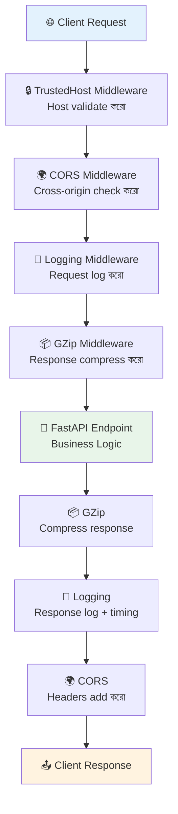

# Middlewares 🧱

## Middleware কী? (What)

**Middleware** হলো এমন একটি layer যা প্রতিটি **request আসার পরে** এবং **response যাওয়ার আগে** চলে। এটি Endpoint function-এর আগে/পরে extra logic execute করে।

একটি middleware তিনটি কাজ করতে পারে:
1. **Request আসার আগে** — Logging, Auth check, Rate limit
2. **Response যাওয়ার আগে** — Header add করা, Compression, Logging
3. **উভয়ক্ষেত্রে** — Processing time মাপা, Error tracking

```
Client Request
    ↓
[Middleware 1] → [Middleware 2] → [Middleware 3]
    ↓
Endpoint Function
    ↓
[Middleware 3] ← [Middleware 2] ← [Middleware 1]
    ↑
Client Response
```

---

## কেন Middleware দরকার? (Why)

```
❌ Middleware ছাড়া:
   - প্রতিটি endpoint-এ CORS manually handle করতে হবে
   - Logging সব endpoint-এ আলাদাভাবে লিখতে হবে
   - Response compress করার কোড সব জায়গায় repeat করতে হবে
   - Timing/monitoring সব endpoint-এ আলাদা করতে হবে

✅ Middleware দিয়ে:
   - একবার লিখলে সব endpoint-এ apply হয়
   - Cross-cutting concerns আলাদা রাখা যায়
   - Code clean ও DRY (Don't Repeat Yourself)
```

---

## Middleware Execution Flow



---

## ১. CORSMiddleware — সবচেয়ে গুরুত্বপূর্ণ

**CORS** (Cross-Origin Resource Sharing) — Browser security feature। একটি origin থেকে অন্য origin-এর API call করলে browser block করে। CORSMiddleware এই restriction নিয়ন্ত্রণ করে।

```python
from fastapi import FastAPI
from fastapi.middleware.cors import CORSMiddleware

app = FastAPI()

# ===== Development Configuration =====
app.add_middleware(
    CORSMiddleware,

    # কোন origins থেকে request allow করবে
    allow_origins=[
        "http://localhost:3000",      # React dev server
        "http://localhost:5173",      # Vite dev server
        "http://127.0.0.1:3000",
    ],

    # Credentials (cookies, Authorization headers) allow করবে কিনা
    allow_credentials=True,

    # কোন HTTP methods allow করবে
    allow_methods=["GET", "POST", "PUT", "PATCH", "DELETE", "OPTIONS"],

    # কোন request headers allow করবে
    allow_headers=[
        "Authorization",
        "Content-Type",
        "Accept",
        "X-Requested-With",
        "X-API-Key",
    ],

    # Browser কতক্ষণ preflight response cache করবে (seconds)
    max_age=600   # ১০ মিনিট
)

# ===== Production Configuration =====
# Production-এ specific origin দাও — * দিলে সব allow হয় (dangerous!)
PRODUCTION_ORIGINS = [
    "https://myapp.com",
    "https://www.myapp.com",
    "https://admin.myapp.com",
]

# ===== Development-এ সব allow (শুধু dev!) =====
# allow_origins=["*"]   ← Production-এ কখনো না!
```

::: danger allow_origins=["*"] Production-এ ব্যবহার করো না
`*` দিলে যেকোনো website তোমার API call করতে পারবে। Credentials (cookies) সহ request-এ `*` কাজই করে না। Always specific origins দাও।
:::

---

## ২. Custom Middleware — @app.middleware("http")

```python
from fastapi import FastAPI, Request
from fastapi.responses import JSONResponse
import time
import logging
import uuid

app = FastAPI()
logger = logging.getLogger("uvicorn.access")

# ===== Request Timing + Logging Middleware =====
@app.middleware("http")
async def log_and_time_requests(request: Request, call_next):
    """
    প্রতিটি request এর:
    - Unique ID assign করো
    - Processing time measure করো
    - Request ও response log করো
    - Custom headers যোগ করো
    """
    # ① Request আসার সময়
    request_id = str(uuid.uuid4())[:8]   # Unique ID
    start_time = time.time()

    # Request info log করো
    logger.info(
        f"[{request_id}] ▶ {request.method} {request.url.path} "
        f"| Client: {request.client.host}"
    )

    # ② Endpoint চালাও
    try:
        response = await call_next(request)   # ← Endpoint call হবে এখানে
    except Exception as e:
        logger.error(f"[{request_id}] ❌ Unhandled error: {str(e)}")
        return JSONResponse(
            content={"error": "Internal server error", "request_id": request_id},
            status_code=500
        )

    # ③ Response যাওয়ার সময়
    process_time = (time.time() - start_time) * 1000   # milliseconds

    # Custom headers যোগ করো
    response.headers["X-Request-ID"] = request_id
    response.headers["X-Process-Time"] = f"{process_time:.2f}ms"

    # Response log করো
    logger.info(
        f"[{request_id}] ◀ {response.status_code} "
        f"| Time: {process_time:.2f}ms"
    )

    return response
```

---

## ৩. Rate Limiting Middleware

```python
from fastapi import Request
from fastapi.responses import JSONResponse
from collections import defaultdict
import time

# Simple in-memory rate limiter (Production-এ Redis ব্যবহার করো)
request_counts = defaultdict(list)

RATE_LIMIT = 100        # প্রতি মিনিটে সর্বোচ্চ ১০০ request
RATE_WINDOW = 60        # ৬০ seconds window

@app.middleware("http")
async def rate_limit_middleware(request: Request, call_next):
    """
    IP-based rate limiting।
    Production-এ slowapi অথবা Redis ব্যবহার করো।
    """
    client_ip = request.client.host
    now = time.time()

    # পুরনো requests সরাও (window-এর বাইরে)
    request_counts[client_ip] = [
        req_time for req_time in request_counts[client_ip]
        if now - req_time < RATE_WINDOW
    ]

    # Rate limit check করো
    if len(request_counts[client_ip]) >= RATE_LIMIT:
        return JSONResponse(
            content={
                "error": "Too Many Requests",
                "message": f"প্রতি {RATE_WINDOW} সেকেন্ডে সর্বোচ্চ {RATE_LIMIT}টি request",
                "retry_after": int(RATE_WINDOW - (now - request_counts[client_ip][0]))
            },
            status_code=429,
            headers={
                "Retry-After": str(RATE_WINDOW),
                "X-RateLimit-Limit": str(RATE_LIMIT),
                "X-RateLimit-Remaining": "0"
            }
        )

    # Request count যোগ করো
    request_counts[client_ip].append(now)

    response = await call_next(request)

    # Rate limit info headers যোগ করো
    remaining = RATE_LIMIT - len(request_counts[client_ip])
    response.headers["X-RateLimit-Limit"] = str(RATE_LIMIT)
    response.headers["X-RateLimit-Remaining"] = str(remaining)

    return response
```

---

## ৪. Security Headers Middleware

```python
@app.middleware("http")
async def add_security_headers(request: Request, call_next):
    """
    Security headers যোগ করো — সব response-এ।
    এই headers browser-কে বিভিন্ন attack থেকে রক্ষা করে।
    """
    response = await call_next(request)

    # XSS Protection
    response.headers["X-Content-Type-Options"] = "nosniff"
    response.headers["X-Frame-Options"] = "DENY"   # Clickjacking protection
    response.headers["X-XSS-Protection"] = "1; mode=block"

    # HTTPS enforce করো (HSTS)
    response.headers["Strict-Transport-Security"] = "max-age=31536000; includeSubDomains"

    # Content Security Policy
    response.headers["Content-Security-Policy"] = (
        "default-src 'self'; "
        "script-src 'self' 'unsafe-inline'; "
        "style-src 'self' 'unsafe-inline' fonts.googleapis.com; "
        "font-src 'self' fonts.gstatic.com;"
    )

    # Referrer Policy
    response.headers["Referrer-Policy"] = "strict-origin-when-cross-origin"

    return response
```

---

## ৫. Database Health Check Middleware

```python
from fastapi import Request
from fastapi.responses import JSONResponse
from sqlalchemy import text

@app.middleware("http")
async def db_health_check_middleware(request: Request, call_next):
    """
    Database connection check করো।
    DB down থাকলে সুন্দর error দাও।
    """
    # Health check endpoint-এ DB check skip করো
    if request.url.path in ["/health", "/", "/docs", "/redoc", "/openapi.json"]:
        return await call_next(request)

    # DB connection check করো
    try:
        # DB query test করো
        from database import engine
        with engine.connect() as conn:
            conn.execute(text("SELECT 1"))
    except Exception:
        return JSONResponse(
            content={
                "error": "Database সংযোগ সমস্যা",
                "message": "Database unavailable। কিছুক্ষণ পরে আবার চেষ্টা করুন।"
            },
            status_code=503
        )

    return await call_next(request)
```

---

## ৬. GZipMiddleware — Response Compression

```python
from fastapi.middleware.gzip import GZipMiddleware

app = FastAPI()

# GZip compression — large responses compress হবে
app.add_middleware(
    GZipMiddleware,
    minimum_size=1000   # কমপক্ষে ১০০০ bytes হলে compress করবে
                        # ছোট responses compress করা লাভজনক না
)

# Test করো:
# curl -H "Accept-Encoding: gzip" http://localhost:8000/large-data
# Response size অনেক কমে যাবে

@app.get("/large-data")
def large_data():
    """এই response GZip দিয়ে compress হবে"""
    return {"data": "A" * 10000}  # বড় response
```

---

## ৭. TrustedHostMiddleware — Host Validation

```python
from fastapi.middleware.trustedhost import TrustedHostMiddleware

app = FastAPI()

# শুধু এই hosts-এর requests accept করবে
app.add_middleware(
    TrustedHostMiddleware,
    allowed_hosts=[
        "myapp.com",
        "*.myapp.com",      # Wildcard — সব subdomain
        "localhost",         # Local development
        "127.0.0.1",
    ]
)

# অন্য host থেকে request আসলে → 400 Bad Request
# Host: evil.com → ❌ Blocked
# Host: myapp.com → ✅ Allowed
```

---

## ৮. BaseHTTPMiddleware দিয়ে Class-based Middleware

```python
from starlette.middleware.base import BaseHTTPMiddleware
from starlette.requests import Request
from starlette.responses import Response
import time

class TimingMiddleware(BaseHTTPMiddleware):
    """
    Class-based middleware — আরও structured।
    `dispatch` method override করতে হয়।
    """

    def __init__(self, app, slow_threshold_ms: float = 1000.0):
        super().__init__(app)
        self.slow_threshold = slow_threshold_ms   # ১ সেকেন্ডের বেশি হলে warning

    async def dispatch(self, request: Request, call_next) -> Response:
        start = time.perf_counter()

        response = await call_next(request)

        duration = (time.perf_counter() - start) * 1000
        response.headers["X-Response-Time"] = f"{duration:.1f}ms"

        if duration > self.slow_threshold:
            import logging
            logging.warning(
                f"⚠️ Slow request: {request.method} {request.url.path} "
                f"took {duration:.1f}ms (threshold: {self.slow_threshold}ms)"
            )

        return response

class MaintenanceMiddleware(BaseHTTPMiddleware):
    """Maintenance mode middleware"""

    def __init__(self, app, maintenance_mode: bool = False):
        super().__init__(app)
        self.maintenance_mode = maintenance_mode

    async def dispatch(self, request: Request, call_next) -> Response:
        # Health check সবসময় allow করো
        if request.url.path == "/health":
            return await call_next(request)

        if self.maintenance_mode:
            from fastapi.responses import JSONResponse
            return JSONResponse(
                content={
                    "message": "🔧 API maintenance চলছে। কিছুক্ষণ পরে আবার চেষ্টা করুন।",
                    "status": "maintenance"
                },
                status_code=503,
                headers={"Retry-After": "3600"}
            )

        return await call_next(request)

# App-এ যোগ করো
import os

app.add_middleware(TimingMiddleware, slow_threshold_ms=500.0)
app.add_middleware(
    MaintenanceMiddleware,
    maintenance_mode=os.getenv("MAINTENANCE_MODE", "false").lower() == "true"
)
```

---

## ৯. সব Middleware একসাথে — সঠিক Order

```python
from fastapi import FastAPI
from fastapi.middleware.cors import CORSMiddleware
from fastapi.middleware.gzip import GZipMiddleware
from fastapi.middleware.trustedhost import TrustedHostMiddleware
import os

app = FastAPI(title="Production API")

# ===== Middleware যোগ করার Order গুরুত্বপূর্ণ! =====
# Middleware নিচ থেকে উপরে execute হয়
# শেষে যোগ করা → প্রথমে execute হয়

# ① TrustedHost — সবার আগে host check (বাইরের threat block)
app.add_middleware(
    TrustedHostMiddleware,
    allowed_hosts=["myapp.com", "*.myapp.com", "localhost", "127.0.0.1"]
)

# ② CORS — Origin check করো
app.add_middleware(
    CORSMiddleware,
    allow_origins=["https://myapp.com", "http://localhost:3000"],
    allow_credentials=True,
    allow_methods=["*"],
    allow_headers=["*"]
)

# ③ Security Headers — সব response-এ security headers
app.add_middleware(SecurityHeadersMiddleware)   # Custom class

# ④ Rate Limiting — abuse prevent করো
app.add_middleware(RateLimitMiddleware, limit=100, window=60)

# ⑤ Logging + Timing — সব request/response track করো
app.add_middleware(LoggingMiddleware)

# ⑥ GZip — Response compress করো (সবার শেষে)
app.add_middleware(GZipMiddleware, minimum_size=1000)

# Execution order (request-এ):
# GZip → Logging → RateLimit → Security → CORS → TrustedHost → Endpoint
# Response-এ ঠিক উল্টো order
```

::: warning Middleware Order
Middleware যোগ করার order গুরুত্বপূর্ণ! `add_middleware()` যে order-এ call হয় তার বিপরীতে execute হয় (LIFO — Last In, First Out)। সবার শেষে যোগ করা middleware সবার আগে request পায়।
:::

---

## Middleware vs Dependency — কোনটা কখন?

| বৈশিষ্ট্য | Middleware | Dependency |
|-----------|-----------|-----------|
| **Apply হয়** | সব route-এ | Specific route-এ |
| **Access করতে পারে** | Request, Response | Request only |
| **Exception handle** | কঠিন | সহজ (HTTPException) |
| **ব্যবহার** | Logging, CORS, Compression | Auth, DB session, Pagination |
| **Performance** | Overhead কম | Overhead কম |
| **Testing** | কঠিন | সহজ (override) |

---

## Common Mistakes ⚠️

::: danger ভুল ১: Middleware-এ `await call_next()` না করা
```python
# ❌ ভুল — call_next() ছাড়া request কখনো endpoint-এ পৌঁছাবে না
@app.middleware("http")
async def my_middleware(request: Request, call_next):
    logging.info("Request আসলো")
    # call_next(request) করা হয়নি! Endpoint never called!
    return JSONResponse({"error": "middleware blocked"}, status_code=500)

# ✅ সঠিক
@app.middleware("http")
async def my_middleware(request: Request, call_next):
    logging.info("Request আসলো")
    response = await call_next(request)   # ← অবশ্যই await করো
    logging.info("Response যাচ্ছে")
    return response
```
:::

::: danger ভুল ২: Production-এ allow_origins=["*"] + credentials
```python
# ❌ ভুল — Browser এটি reject করবে (CORS spec)
app.add_middleware(
    CORSMiddleware,
    allow_origins=["*"],
    allow_credentials=True   # ← credentials=True + "*" = Error!
)

# ✅ সঠিক — Specific origins দাও
app.add_middleware(
    CORSMiddleware,
    allow_origins=["https://myapp.com"],
    allow_credentials=True
)
```
:::

::: warning ভুল ৩: Middleware-এ Endpoint-এর exception handle করতে না পারা
```python
# ❌ ভুল — HTTPException middleware-এ catch হবে না এভাবে
@app.middleware("http")
async def middleware(request: Request, call_next):
    try:
        response = await call_next(request)
        return response
    except HTTPException as e:    # ← HTTPException এখানে আসে না!
        return JSONResponse({"error": str(e)}, status_code=e.status_code)

# ✅ সঠিক — Exception handler ব্যবহার করো (পরের page-এ দেখাবো)
from fastapi import HTTPException
from fastapi.exceptions import RequestValidationError

@app.exception_handler(HTTPException)
async def http_exception_handler(request, exc):
    return JSONResponse({"error": exc.detail}, status_code=exc.status_code)
```
:::

---

## Best Practices ✨

- **CORS সবসময় specific origins দাও** — `*` শুধু public read-only API-তে
- **Middleware-এ সবসময় `await call_next(request)` করো** — ভুললে request block হয়
- **Order মনে রাখো** — শেষে যোগ করা প্রথমে execute হয় (LIFO)
- **Rate limiting-এ Redis ব্যবহার করো** — In-memory শুধু single instance-এ কাজ করে
- **Security headers সবসময় দাও** — X-Frame-Options, X-Content-Type-Options, HSTS
- **GZip শুধু text response-এ** — Already compressed (image, video) compress করার দরকার নেই
- **Logging middleware-এ request body read করো না** — Body একবারই read হয়
- **Maintenance mode env variable থেকে নিয়ন্ত্রণ করো** — Code change ছাড়াই on/off করা যাবে

---

## Interview Questions 🎯

**প্রশ্ন ১: Middleware এবং Dependency Injection-এর পার্থক্য কী?**

> **উত্তর:** Middleware **সব** route-এ automatically apply হয় এবং request ও response উভয়কে intercept করতে পারে — Logging, CORS, Compression-এর জন্য। Dependency শুধু **specific** route-এ apply হয় এবং শুধু request-এ access করতে পারে — Auth, DB session, Pagination-এর জন্য। Exception handling Dependency-তে সহজ (HTTPException), Middleware-এ জটিল।

**প্রশ্ন ২: CORSMiddleware কীভাবে কাজ করে?**

> **উত্তর:** Browser যখন cross-origin request করে (যেমন localhost:3000 থেকে localhost:8000), আগে **OPTIONS preflight request** পাঠায়। CORSMiddleware এই request-এ `Access-Control-Allow-Origin`, `Access-Control-Allow-Methods`, `Access-Control-Allow-Headers` headers সহ response দেয়। Browser এই headers দেখে সিদ্ধান্ত নেয় actual request পাঠাবে কিনা।

**প্রশ্ন ৩: Middleware-এ `call_next()` এর ভূমিকা কী?**

> **উত্তর:** `call_next(request)` হলো "পরের layer চালাও" — এটি পরের middleware বা finally endpoint call করে। `await call_next(request)` ছাড়া request কখনো endpoint-এ পৌঁছাবে না। এটি middleware chain-এর central mechanism — প্রতিটি middleware `call_next` call করে chain continue করে।

**প্রশ্ন ৪: `@app.middleware("http")` এবং `BaseHTTPMiddleware`-এর পার্থক্য কী?**

> **উত্তর:** `@app.middleware("http")` হলো simple decorator approach — quick custom middleware-এর জন্য। `BaseHTTPMiddleware` হলো class-based approach — constructor দিয়ে configuration দেওয়া যায়, reusable ও testable। Complex middleware-এ `BaseHTTPMiddleware` ভালো। তবে উভয়ই response body streaming-এ সমস্যা করতে পারে — সেক্ষেত্রে raw ASGI middleware ব্যবহার করো।

---

## Summary 📋

- ✅ Middleware = প্রতিটি request আসা ও response যাওয়ার আগে চলে
- ✅ `CORSMiddleware` → Cross-origin request allow/block করো — Production-এ specific origins দাও
- ✅ `@app.middleware("http")` → Custom middleware — `await call_next(request)` অবশ্যই করো
- ✅ `GZipMiddleware` → Response compress করো (`minimum_size=1000`)
- ✅ `TrustedHostMiddleware` → Invalid host থেকে request block করো
- ✅ `BaseHTTPMiddleware` → Class-based middleware — configurable, reusable
- ✅ Middleware order: শেষে যোগ করা **প্রথমে** execute হয় (LIFO)
- ✅ Logging + Timing → Request ID, processing time, status code track করো
- ✅ Security headers → X-Frame-Options, HSTS, CSP — সব response-এ দাও

---

## পরবর্তী ধাপ ➡️

Middlewares শেখা হলো। এখন **Error Handling** শিখবে — `HTTPException`, custom exception handlers, `RequestValidationError` override, global exception handler, এবং consistent error response format কিভাবে তৈরি করতে হয়।
