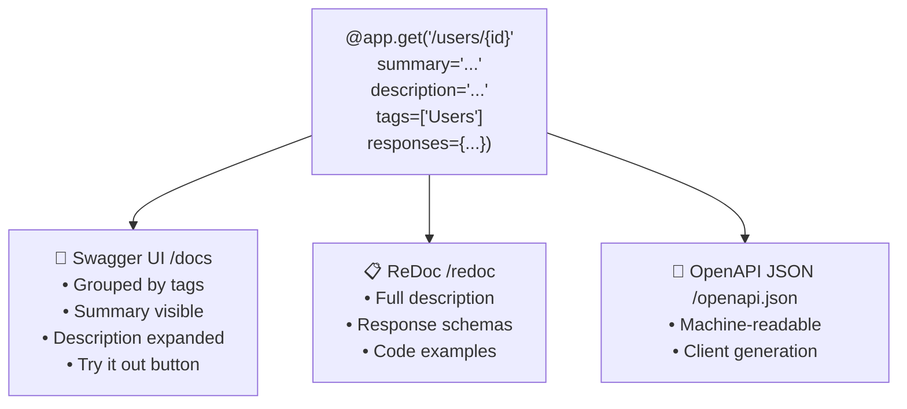

# Path Configuration ⚙️

## Path Configuration কী? (What)

FastAPI-তে **Path Configuration** মানে হলো প্রতিটি endpoint-এর জন্য অতিরিক্ত metadata যোগ করা। এই metadata Swagger UI-তে দেখা যায় এবং API documentation সমৃদ্ধ করে।

Path configuration-এর মূল tools:
- `summary` — সংক্ষিপ্ত বিবরণ (Swagger header-এ)
- `description` — বিস্তারিত বিবরণ (Markdown support)
- `tags` — গ্রুপিং করতে
- `deprecated=True` — পুরনো endpoint চিহ্নিত করতে
- `operation_id` — Unique identifier
- `include_in_schema=False` — Swagger থেকে লুকাতে
- `responses` — সব possible response document করতে

---

## কেন Path Configuration দরকার? (Why)

```
❌ Configuration ছাড়া API:
   - Swagger UI-তে সব endpoint একরকম দেখায়
   - Developer বুঝতে পারে না কোন endpoint কী করে
   - Client code generation ঠিকমতো কাজ করে না
   - Deprecated endpoint কোনটা বোঝা যায় না

✅ সঠিক Configuration-সহ API:
   - Professional, self-documenting API
   - Swagger-এ সুন্দর গ্রুপ, description, examples
   - API consumers সহজে বুঝতে পারে
   - Team collaboration সহজ হয়
```

---

## Path Configuration Flow



---

## summary ও description

```python
from fastapi import FastAPI
from pydantic import BaseModel

app = FastAPI()

class UserResponse(BaseModel):
    id: int
    username: str
    email: str

@app.get(
    "/users/{user_id}",

    # ===== summary =====
    # Swagger UI-তে endpoint title হিসেবে দেখায়
    # default হলো function নাম → get_user_by_id
    summary="নির্দিষ্ট User এর তথ্য আনো",

    # ===== description =====
    # Swagger UI-তে বিস্তারিত বিবরণ — Markdown support করে!
    description="""
## ব্যবহার

নির্দিষ্ট `user_id` দিয়ে user এর সম্পূর্ণ profile তথ্য আনো।

## প্রয়োজনীয়তা
- Valid `user_id` দিতে হবে (positive integer)
- Authorization token থাকতে হবে

## উদাহরণ
```
GET /users/42
Authorization: Bearer eyJhbGci...
```

## সম্ভাব্য Errors
- `404` — User পাওয়া যায়নি
- `401` — Token নেই বা expired
""",
    response_model=UserResponse,
    tags=["Users 👤"]
)
def get_user_by_id(user_id: int):
    """
    Docstring-ও description হিসেবে কাজ করে।
    কিন্তু decorator-এ description দিলে সেটি priority পায়।
    """
    return UserResponse(id=user_id, username="আরিফ", email="arif@bd.com")
```

---

## tags — Swagger-এ Grouping

```python
# Tags দিয়ে endpoint গুলো logical group-এ সাজানো যায়

# ===== Users Group =====
@app.get("/users/", tags=["Users 👤"])
def list_users(): return []

@app.post("/users/", tags=["Users 👤"], status_code=201)
def create_user(): return {}

@app.get("/users/{id}", tags=["Users 👤"])
def get_user(id: int): return {}

@app.delete("/users/{id}", tags=["Users 👤"])
def delete_user(id: int): return {}

# ===== Products Group =====
@app.get("/products/", tags=["Products 📦"])
def list_products(): return []

@app.post("/products/", tags=["Products 📦"])
def create_product(): return {}

# ===== Orders Group =====
@app.get("/orders/", tags=["Orders 🛒"])
def list_orders(): return []

# ===== Admin Group =====
@app.get("/admin/stats", tags=["Admin 🔧"])
def admin_stats(): return {}

# ===== Multiple Tags (একটি endpoint একাধিক group-এ) =====
@app.get("/users/{user_id}/orders/", tags=["Users 👤", "Orders 🛒"])
def get_user_orders(user_id: int):
    """এই endpoint দুটো group-এ দেখাবে"""
    return []
```

### App-level Tag Descriptions

```python
# App তৈরিতে tag descriptions দাও — Swagger-এ সুন্দর দেখায়
app = FastAPI(
    title="E-Commerce API 🛒",
    description="বাংলাদেশের জন্য সম্পূর্ণ E-Commerce API",
    openapi_tags=[
        {
            "name": "Users 👤",
            "description": "User registration, login, profile management"
        },
        {
            "name": "Products 📦",
            "description": "Product listing, search, CRUD operations",
            "externalDocs": {
                "description": "Product API Documentation",
                "url": "https://docs.example.com/products"
            }
        },
        {
            "name": "Orders 🛒",
            "description": "Order creation, tracking, history"
        },
        {
            "name": "Admin 🔧",
            "description": "Admin-only operations. Requires admin role."
        }
    ]
)
```

---

## deprecated=True — পুরনো Endpoint চিহ্নিত করা

```python
# ===== Deprecated endpoint =====
@app.get(
    "/api/v1/users/",
    tags=["Users 👤"],
    deprecated=True,    # Swagger-এ strikethrough দিয়ে দেখাবে
    summary="[DEPRECATED] User তালিকা — v1"
)
def list_users_v1():
    """
    ⚠️ এই endpoint deprecated। `/api/v2/users/` ব্যবহার করুন।

    **Removal Date:** ২০২৫ সালের জানুয়ারি
    """
    return {
        "warning": "⚠️ এই endpoint শীঘ্রই বন্ধ হবে",
        "migrate_to": "/api/v2/users/",
        "users": []
    }

# ===== নতুন endpoint (v2) =====
@app.get(
    "/api/v2/users/",
    tags=["Users 👤"],
    summary="User তালিকা — v2 ✨"
)
def list_users_v2():
    """নতুন, উন্নত version — pagination, filtering সহ"""
    return {"users": [], "total": 0, "version": "v2"}
```

---

## operation_id — Unique Identifier

`operation_id` API client generation-এ ব্যবহার হয় (TypeScript, Python SDK তৈরিতে):

```python
# ===== Explicit operation_id =====
@app.get(
    "/users/",
    operation_id="listAllUsers",        # camelCase convention
    tags=["Users 👤"],
    summary="সব User এর তালিকা"
)
def list_users():
    return []

@app.post(
    "/users/",
    operation_id="createNewUser",
    tags=["Users 👤"]
)
def create_user():
    return {}

@app.get(
    "/users/{user_id}",
    operation_id="getUserById",
    tags=["Users 👤"]
)
def get_user(user_id: int):
    return {}

@app.put(
    "/users/{user_id}",
    operation_id="updateUser",
    tags=["Users 👤"]
)
def update_user(user_id: int):
    return {}

@app.delete(
    "/users/{user_id}",
    operation_id="deleteUser",
    tags=["Users 👤"]
)
def delete_user(user_id: int):
    return {}
```

::: tip operation_id কেন দরকার?
TypeScript client বা Python SDK generate করার সময় `operation_id` function নাম হিসেবে ব্যবহার হয়:
```typescript
// Generated TypeScript code
await api.listAllUsers();
await api.createNewUser(data);
await api.getUserById(42);
```
:::

---

## include_in_schema=False — Swagger থেকে লুকানো

```python
# ===== Internal endpoints লুকানো =====

# Internal health check — Swagger-এ দেখাবে না
@app.get("/internal/health", include_in_schema=False)
def internal_health():
    """
    Load balancer health check।
    Swagger-এ দেখানো প্রয়োজন নেই।
    """
    return {"status": "healthy", "db": "connected"}

# Debug endpoint — শুধু development-এ
@app.get("/debug/config", include_in_schema=False)
def debug_config():
    """Development debug — production-এ disable করো"""
    import os
    return {
        "env": os.getenv("ENVIRONMENT", "development"),
        "debug": True
    }

# Admin internal route
@app.post("/admin/internal/clear-cache", include_in_schema=False)
def clear_cache():
    """Internal cache clear — external docs-এ দেখানো নিরাপদ না"""
    return {"cleared": True}

# Webhook receiver — external Swagger-এ expose না করাই ভালো
@app.post("/webhooks/stripe", include_in_schema=False)
async def stripe_webhook():
    """Stripe payment webhook"""
    return {"received": True}
```

---

## responses — Detailed Response Documentation

```python
from pydantic import BaseModel
from fastapi import FastAPI, HTTPException

app = FastAPI()

class UserResponse(BaseModel):
    id: int
    username: str
    email: str

class ErrorDetail(BaseModel):
    message: str
    code: str
    field: str = None

@app.get(
    "/users/{user_id}",
    response_model=UserResponse,
    tags=["Users 👤"],
    summary="User তথ্য আনো",
    responses={
        # ===== Success Response =====
        200: {
            "description": "User সফলভাবে পাওয়া গেছে",
            "content": {
                "application/json": {
                    "example": {
                        "id": 1,
                        "username": "আরিফ_হোসেন",
                        "email": "arif@example.com"
                    }
                }
            }
        },
        # ===== Error Responses =====
        404: {
            "description": "User পাওয়া যায়নি",
            "content": {
                "application/json": {
                    "example": {
                        "message": "User পাওয়া যায়নি",
                        "code": "USER_NOT_FOUND"
                    }
                }
            }
        },
        401: {
            "description": "Authentication token নেই বা invalid",
            "content": {
                "application/json": {
                    "example": {"detail": "Not authenticated"}
                }
            }
        },
        403: {
            "description": "এই user-এর তথ্য দেখার permission নেই",
            "content": {
                "application/json": {
                    "example": {
                        "message": "Access denied",
                        "code": "FORBIDDEN"
                    }
                }
            }
        }
    }
)
def get_user_detailed(user_id: int):
    """সব possible response documented — Swagger-এ সুন্দর দেখাবে"""
    if user_id <= 0:
        raise HTTPException(status_code=404, detail="User পাওয়া যায়নি")
    return UserResponse(id=user_id, username="আরিফ", email="arif@bd.com")
```

---

## সম্পূর্ণ App Configuration — Real-world Example

```python
from fastapi import FastAPI
from pydantic import BaseModel
from typing import Optional

# ===== App-level Metadata =====
app = FastAPI(
    title="NextGen API 🚀",
    description="""
## বাংলাদেশের Developer দের জন্য API

এই API দিয়ে তুমি পারবে:
* **User** management
* **Product** catalog
* **Order** processing
* **Payment** integration

## Authentication
```
Authorization: Bearer <your_jwt_token>
```

## Rate Limiting
প্রতি মিনিটে সর্বোচ্চ **100 requests**।
    """,
    version="2.0.0",
    terms_of_service="https://example.com/terms",
    contact={
        "name": "Support Team",
        "url": "https://support.example.com",
        "email": "support@example.com"
    },
    license_info={
        "name": "MIT",
        "url": "https://opensource.org/licenses/MIT"
    },
    openapi_url="/api/openapi.json",   # Custom OpenAPI URL
    docs_url="/api/docs",              # Custom Swagger URL
    redoc_url="/api/redoc"             # Custom ReDoc URL
)

# ===== Versioned Router with full config =====
from fastapi import APIRouter

users_router = APIRouter(prefix="/api/v2/users", tags=["Users 👤"])
products_router = APIRouter(prefix="/api/v2/products", tags=["Products 📦"])

class UserCreate(BaseModel):
    username: str
    email: str

class UserResponse(BaseModel):
    id: int
    username: str
    email: str

@users_router.post(
    "/",
    summary="নতুন User তৈরি করো",
    description="""
নতুন user account তৈরি করো।

**Validation Rules:**
- `username`: 3-50 characters, alphanumeric
- `email`: valid email format
- `password`: minimum 8 characters
    """,
    response_model=UserResponse,
    status_code=201,
    operation_id="createUser_v2",
    responses={
        201: {"description": "User সফলভাবে তৈরি হয়েছে"},
        409: {"description": "Email ইতিমধ্যে registered"},
        422: {"description": "Validation error"}
    }
)
def create_user(user: UserCreate):
    return UserResponse(id=1, **user.model_dump())

@users_router.get(
    "/me",
    summary="আমার Profile দেখো",
    operation_id="getMyProfile",
    response_model=UserResponse
)
def get_my_profile():
    """Current logged-in user এর profile"""
    return UserResponse(id=1, username="ashraf", email="ashraf@bd.com")

app.include_router(users_router)
app.include_router(products_router)
```

---

## Configuration Reference Table

| Parameter | Type | Default | কাজ |
|-----------|------|---------|-----|
| `summary` | `str` | function নাম | Swagger header title |
| `description` | `str` | docstring | বিস্তারিত বিবরণ (Markdown) |
| `tags` | `List[str]` | `[]` | Swagger grouping |
| `deprecated` | `bool` | `False` | পুরনো endpoint চিহ্নিত |
| `operation_id` | `str` | auto-generated | Unique API identifier |
| `include_in_schema` | `bool` | `True` | Swagger-এ দেখাবে কিনা |
| `responses` | `dict` | `{}` | Additional response docs |
| `response_model` | Pydantic model | `None` | Response schema ও filter |
| `status_code` | `int` | `200` | Default success status |
| `response_class` | Response class | `JSONResponse` | Response type |

---

## Common Mistakes ⚠️

::: danger ভুল ১: description-এ Markdown না জেনে plain text দেওয়া
```python
# ❌ সুযোগ নষ্ট — Markdown ব্যবহার করোনি
@app.get("/users/", description="All users list. Requires authentication. Returns 404 if empty.")
def list_users(): ...

# ✅ সঠিক — Markdown দিয়ে সুন্দর documentation
@app.get(
    "/users/",
    description="""
## User List

সব registered user এর তালিকা।

**Requirements:**
- Bearer token দিতে হবে
- Admin role থাকতে হবে

**Returns:** `200` সফল | `401` unauth | `403` forbidden
    """
)
def list_users(): ...
```
:::

::: warning ভুল ২: Duplicate operation_id
```python
# ❌ ভুল — একই operation_id দুটো endpoint-এ
@app.get("/v1/users/", operation_id="getUsers")
def list_users_v1(): ...

@app.get("/v2/users/", operation_id="getUsers")   # ❌ Duplicate!
def list_users_v2(): ...
# Client generation ভেঙে যাবে

# ✅ সঠিক — Unique operation_id
@app.get("/v1/users/", operation_id="getUsers_v1")
def list_users_v1(): ...

@app.get("/v2/users/", operation_id="getUsers_v2")
def list_users_v2(): ...
```
:::

::: warning ভুল ৩: include_in_schema=False ভুলে internal endpoint expose করা
```python
# ❌ ভুল — Admin token, DB stats publicly documented
@app.get("/admin/db-stats")   # Swagger-এ দেখা যাচ্ছে!
def db_stats():
    return {"connections": 50, "slow_queries": ["SELECT * FROM users..."]}

# ✅ সঠিক
@app.get("/admin/db-stats", include_in_schema=False)
def db_stats():
    return {"connections": 50}
```
:::

---

## Best Practices ✨

- **সব public endpoint-এ `summary` দাও** — function নাম যথেষ্ট না
- **`description`-এ Markdown ব্যবহার করো** — headers, bold, code block দিয়ে সুন্দর করো
- **`tags` সবসময় দাও** — group ছাড়া Swagger chaotic দেখায়
- **`operation_id` দাও** — SDK generation করলে অবশ্যই, convention: `verbNoun` (camelCase)
- **Deprecated endpoint-এ migration guide দাও** — কোন নতুন endpoint ব্যবহার করবে বলো
- **Internal endpoint-এ `include_in_schema=False`** — debug, health, webhook লুকাও
- **`responses` dict-এ সব possible error document করো** — API consumer-কে জানাও
- **App-level `openapi_tags`** দিয়ে tag description দাও — professional look

---

## Interview Questions 🎯

**প্রশ্ন ১: `summary` এবং `description` এর পার্থক্য কী?**

> **উত্তর:** `summary` হলো সংক্ষিপ্ত একলাইনের বিবরণ যা Swagger UI-তে endpoint list-এ দেখায়। `description` হলো বিস্তারিত বিবরণ যা Markdown support করে এবং endpoint expand করলে দেখায়। না দিলে `summary`-এর default হলো function name, `description`-এর default হলো docstring।

**প্রশ্ন ২: `deprecated=True` দিলে কী হয়? Endpoint কি বন্ধ হয়ে যায়?**

> **উত্তর:** না, `deprecated=True` শুধু Swagger UI-তে endpoint-কে **strikethrough** দিয়ে "Deprecated" চিহ্নিত করে। Endpoint কাজ করতে থাকে। এটি developers-কে জানায় যে এই endpoint আর use করা উচিত নয়। আসলে বন্ধ করতে হলে code মুছতে হবে।

**প্রশ্ন ৩: `include_in_schema=False` এবং endpoint delete করার পার্থক্য কী?**

> **উত্তর:** `include_in_schema=False` দিলে endpoint এখনো কাজ করে কিন্তু Swagger/OpenAPI schema-তে দেখায় না। Delete করলে endpoint আর কাজ করে না। Internal tools, health checks, webhooks-এর জন্য `include_in_schema=False` ব্যবহার করা হয় — external client documentation থেকে লুকাতে।

**প্রশ্ন ৪: `operation_id` কেন দরকার এবং auto-generated ID-তে সমস্যা কী?**

> **উত্তর:** FastAPI auto-generate করা `operation_id` হয় ugly এবং inconsistent — যেমন `get_user_users__user_id__get`। Client SDK generate করলে এই ugly নাম function নাম হয়। Explicit `operation_id="getUserById"` দিলে generated code সুন্দর ও predictable হয়। Team-এ convention: `verbNounVersion` — `createUser`, `listProducts`, `getUserById_v2`।

---

## Summary 📋

- ✅ `summary="..."` → Swagger list-এ দেখায়, function নামের চেয়ে ভালো
- ✅ `description="""..."""` → Markdown support — headers, bold, code block লেখো
- ✅ `tags=["Users 👤"]` → Swagger grouping — সব endpoint logical group-এ
- ✅ `deprecated=True` → Endpoint কাজ করে কিন্তু "deprecated" চিহ্নিত হয়
- ✅ `operation_id="verbNoun"` → SDK generation-এ সুন্দর function name
- ✅ `include_in_schema=False` → Internal/debug/webhook endpoint লুকাও
- ✅ `responses={404: {...}}` → সব possible response Swagger-এ document করো
- ✅ App-level `openapi_tags` → tag descriptions, external docs link

---

## পরবর্তী ধাপ ➡️

Path Configuration শেখা হলো। এখন **Dependency Injection** শিখবে — FastAPI-এর সবচেয়ে শক্তিশালী feature। `Depends()` দিয়ে reusable logic তৈরি, class-based dependencies, nested dependencies, yield দিয়ে database session management — সব কিছু।
