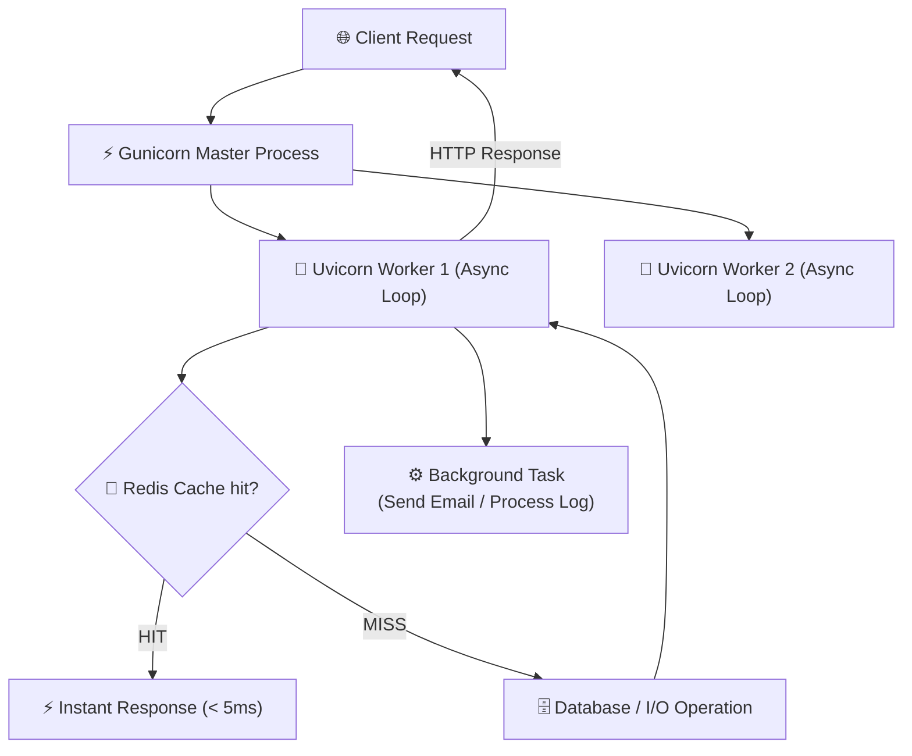

# Performance Optimization ⚡

## Performance Optimization কী? (What)

**Performance Optimization** হলো এমন কিছু কৌশল ও স্ট্যান্ডার্ড চর্চা যার মাধ্যমে FastAPI অ্যাপ্লিকেশনের Response Time কমিয়ে আনা যায়, কম সিস্টেম রিসোর্সে (CPU/RAM) প্রতি সেকেন্ডে হাজার হাজার রিকোয়েস্ট (High Throughput / Concurrency) হ্যান্ডেল করা যায়।

FastAPI স্বয়ংক্রিয়ভাবেই অত্যন্ত দ্রুতগতিসম্পন্ন (Starlette ও Pydantic-এর কারণে)। তবে সঠিক Async প্যাটার্ন, Caching, Background Tasks এবং Production Server Configuration না জানা থাকলে পারফর্ম্যান্স আশঙ্কাজনকভাবে কমে যেতে পারে।

---

## কেন Performance Optimization দরকার? (Why)

```
❌ Optimizations ছাড়া API:
   - Synchronous Blocking Code-এর কারণে একটি রিকোয়েস্টের জন্য অন্য সব রিকোয়েস্ট আটকে থাকে
   - বারবার ডাটাবেজ কোয়েরি চলায় DB Server Overloaded হয়ে পড়ে
   - ইমেইল পাঠানো বা ফাইল প্রসেসিং করতে ইউজারকে ৫-১০ সেকেন্ড অপেক্ষা করতে হয়
   - Server-এর CPU 100% হিট করে এবং Crash করে

✅ Optimized API:
   - Non-blocking Asynchronous I/O এর ফলে হাজার হাজার কনকারেন্ট ইউজার হ্যান্ডেল হয়
   - Caching (Redis) ব্যবহারের ফলে 90% ডাটাবেজ লোড কমে যায়
   - Background Tasks ব্যবহারের ফলে ইউজার Instant Response পায় (যেমন: < 50ms)
   - Multiple Worker Process-এর কারণে মাল্টি-কোর CPU-র পুরো ক্ষমতা ব্যবহার হয়
```

---

## System Performance Flow Architecture



---

## ১. Async/Await বনাম Sync (def vs async def)

FastAPI-তে কনকারেন্সি বোঝার সবচেয়ে গুরুত্বপূর্ণ বিষয় হলো `def` এবং `async def`-এর সঠিক ব্যবহার।

```python
import asyncio
import time
from fastapi import FastAPI

app = FastAPI()

# ❌ ভুল ব্যবহার: async def-এর ভেতরে blocking (sync) কোড লেখা
@app.get("/bad-async")
async def bad_async():
    time.sleep(3)  # ⚠️ এটি পুরো Event Loop-কে BLOCK করে দেবে! অন্য কোনো রিকোয়েস্ট প্রসেস হবে না!
    return {"message": "এটি খারাপ async কোড"}

# ✅ সঠিক ব্যবহার 1: Pure Async Network / I/O Call
@app.get("/good-async")
async def good_async():
    await asyncio.sleep(3)  # ✅ Non-blocking wait, Event loop অন্য কাজ করতে পারে
    return {"message": "এটি সঠিক async কোড"}

# ✅ সঠিক ব্যবহার 2: Sync / Blocking CPU Call (FastAPI এটিকে Thread Pool-এ পাঠায়)
@app.get("/sync-blocking")
def sync_blocking():
    time.sleep(3)  # ✅ FastAPI এই ফানশনকে আলাদা Thread-এ চালায়, Event loop ফ্রি থাকে
    return {"message": "এটি থ্রেড পুলে চলা Sync কোড"}
```

::: danger মারাত্মক ভুল: `async def`-এর ভেতর Sync IO ব্যবহার
যদি তুমি ফানশনকে `async def` বানাও কিন্তু তার ভেতর Sync Database Call (যেমন সাধারণ SQLAlchemy), `requests.get()`, বা `time.sleep()` ব্যবহার করো — তবে তা **পুরো সার্ভারকে ব্লক** করে দেবে!
:::

### কখন কোনটা ব্যবহার করবে?

| কাজের ধরন | উদাহরণ | সঠিক ফানশন টাইপ |
|-----------|--------|----------------|
| **Async I/O** | Async SQLAlchemy, HTTPX, Async Redis | `async def` |
| **Sync I/O / DB** | Standard SQLAlchemy, `requests` library | `def` (FastAPI থ্রেডপুলে চালাবে) |
| **CPU Bound** | Image Processing, ML Model Inference, Heavy Calculation | `def` অথবা `ProcessPoolExecutor` |

---

## ২. Background Tasks (`BackgroundTasks`)

যখন কোনো কাজ শেষ হতে সময় লাগে (যেমন: Email পাঠানো, PDF তৈরি, Audit Log তৈরি), কিন্তু ইউজারের Response-এর জন্য অপেক্ষা করার দরকার নেই, তখন `BackgroundTasks` ব্যবহার করতে হয়।

```python
from fastapi import FastAPI, BackgroundTasks
import time

app = FastAPI()

def send_welcome_email(email: str, name: str):
    """ভারী কাজ — যা ব্যাকগ্রাউন্ডে চলবে"""
    print(f"📧 Sending email to {email}...")
    time.sleep(5)  # 5 সেকেন্ড সময় লাগবে
    print(f"✅ Email sent to {name}!")

@app.post("/register")
def register_user(name: str, email: str, background_tasks: BackgroundTasks):
    # ১. ডাটাবেজে ইউজার সেভ করো (সিমুলেশন)
    user_data = {"name": name, "email": email}
    
    # ২. ব্যাকগ্রাউন্ড টাস্ক রেজিস্টার করো
    background_tasks.add_task(send_welcome_email, email=email, name=name)
    
    # ৩. ইউজার সাথে সাথে Response পাবে (৫ সেকেন্ড অপেক্ষা করতে হবে না)
    return {
        "message": "রেজিস্ট্রেশন সফল হয়েছে! আপনার ইমেইলে নোটিফিকেশন পাঠানো হচ্ছে।",
        "user": user_data
    }
```

---

## ৩. Redis Caching — ডাটাবেজ লোড কমানো

বারবার একই ডাটা ডাটাবেজ থেকে রিড না করে ইন-মেমোরি ক্যাশ (Redis) ব্যবহার করলে রেসপন্স টাইম ৫০০ms থেকে কমিয়ে ২ms-এ আনা সম্ভব।

```bash
pip install redis aioredis
```

```python
from fastapi import FastAPI
import redis.asyncio as aioredis
import json
import asyncio

app = FastAPI()

# Redis Connection Pool
redis = aioredis.from_url("redis://localhost:6379", encoding="utf8", decode_responses=True)

@app.get("/products/{product_id}")
async def get_product(product_id: int):
    cache_key = f"product:{product_id}"
    
    # 1. আগে Redis Cache-এ ডাটা আছে কিনা দেখো
    cached_data = await redis.get(cache_key)
    if cached_data:
        print("⚡ Cache HIT — Redis থেকে রিড করা হয়েছে")
        return json.loads(cached_data)
    
    print("🐢 Cache MISS — Database থেকে রিড করা হচ্ছে")
    # 2. সিমুলেটেড ডাটাবেজ কোয়েরি (ধীরে কাজ করে)
    await asyncio.sleep(2)
    product = {
        "id": product_id,
        "name": f"স্মার্টফোন মডেল {product_id}",
        "price": 25000,
        "stock": 10
    }
    
    # 3. ডাটা ক্যাশে ৩৬০ সেকেন্ডের (৬ মিনিট) জন্য সেভ করো
    await redis.set(cache_key, json.dumps(product), ex=360)
    
    return product
```

---

## ৪. Gunicorn + Uvicorn Workers Configuration

ডেভলপমেন্টে আমরা `uvicorn main:app --reload` চালাই যা একটি মাত্র প্রসেসে (Single-core) চলে। কিন্তু প্রোডাকশন সার্ভারে সব CPU Core ব্যবহার করতে **Gunicorn** সার্ভারের সাথে **Uvicorn Worker Class** ব্যবহার করতে হয়।

```bash
pip install gunicorn uvicorn
```

### Production Deployment Command

```bash
gunicorn main:app \
  --workers 4 \
  --worker-class uvicorn.workers.UvicornWorker \
  --bind 0.0.0.0:8000 \
  --timeout 120 \
  --access-logfile -
```

::: tip কতগুলো Workers ব্যবহার করবে?
Worker গণনার আদর্শ সূত্র হলো:
$$\text{Workers} = (2 \times \text{Number of CPU Cores}) + 1$$
উদাহরণস্বরূপ: ৪-কোর CPU সার্ভারের জন্য `(2 * 4) + 1 = 9` টি Worker চালানো উচিত।
:::

---

## ৫. Response Compression (GZip) & JSON Response Speedup

বড় সাইজের JSON ডাটা পাঠানোর সময় ডাটা কমপ্রেস (Compress) করলে নেটওয়ার্ক ব্যান্ডউইথ বাঁচে এবং ট্রান্সফার স্পিড বাড়ে।

এছাড়াও স্ট্যান্ডার্ড `json` মডিউলের বদলে **`orjson`** (Rust ভিত্তিক ultra-fast JSON library) ব্যবহার করলে জেসন সি্রিয়ালাইজেশন ২ থেকে ৫ গুণ দ্রুত হয়।

```bash
pip install orjson
```

```python
from fastapi import FastAPI
from fastapi.responses import ORJSONResponse
from fastapi.middleware.gzip import GZipMiddleware

# ORJSONResponse দিয়ে ইনস্ট্যান্স তৈরি
app = FastAPI(default_response_class=ORJSONResponse)

# ১০০০ বাইটের বেশি রেসপন্স অটোমেটিক গিজিপ কমপ্রেস হবে
app.add_middleware(GZipMiddleware, minimum_size=1000)

@app.get("/fast-large-data")
def get_large_data():
    # 50,000 অবজেক্ট খুব দ্রুত ORJSON দিয়ে প্রসেস ও কমপ্রেস হবে
    data = [{"id": i, "title": f"Item {i}", "active": True} for i in range(50000)]
    return {"total": len(data), "items": data}
```

---

## Comparison: Caching & Performance Options

| টেকনিক | ব্যবহারের ক্ষেত্র | লেটেন্সি (Latency) কমার পরিমাণ |
|--------|------------------|-----------------------------|
| **Async I/O** | Concurrent Database / Network API Call | কনকারেন্সি ১০গুণ বাড়ে |
| **Redis Cache** | বারবার রিড হওয়া অবজেক্ট (Product Catalog, Settings) | 90% - 98% দ্রুততর (< 5ms) |
| **Background Tasks** | Email, Audit Logging, Report Generation | Instant UX (0ms wait) |
| **`orjson` Response** | বড় JSON Payload ট্রানজিশন | 2x - 5x ফাস্ট সি্রিয়ালাইজেশন |
| **Gzip Compression** | বড় টেক্সট বা বিশাল জেসন | ব্যান্ডউইথ খরচ 70% কমায় |

---

## Common Mistakes ⚠️

::: danger ভুল ১: `async def`-এর মধ্যে `requests.get()` ব্যবহার করা
```python
# ❌ ভুল — requests সিঙ্ক্রোনাস এবং এটি পুরো ইভেন্ট লুপকে ব্লক করে
@app.get("/fetch")
async def fetch_data():
    import requests
    res = requests.get("https://api.example.com/data") # ❌ Blocking!

# ✅ সঠিক — httpx.AsyncClient ব্যবহার করা
@app.get("/fetch")
async def fetch_data():
    import httpx
    async with httpx.AsyncClient() as client:
        res = await client.get("https://api.example.com/data") # ✅ Non-blocking
```
:::

::: danger ভুল ২: ডাটাবেজ কানেকশন পুল লিক হওয়া
কানেকশন পুল ঠিকমত ম্যানেজ না করলে বা প্রতি রিকোয়েস্টে নতুন Engine তৈরি করলে কানেকশন লিমিট শেষ হয়ে সার্ভার ক্র্যাশ করতে পারে।
:::

::: warning ভুল ৩: Production-এ `--reload` অন রাখা
প্রোডাকশন সার্ভারে `--reload` ফ্ল্যাগ ব্যবহার করলে মেমোরি খরচ বাড়ে এবং পারফর্ম্যান্স অনেক কমে যায়।
:::

---

## Best Practices ✨

- **`orjson` ব্যবহার করো:** উচ্চ পারফর্ম্যান্সের জন্য default response class হিসেবে `ORJSONResponse` ব্যবহার করো।
- **DB Connection Pooling:** SQLAlchemy-তে `pool_size` এবং `max_overflow` সঠিকভাবে কনফিগার করো।
- **Non-blocking Client:** External HTTP কলের জন্য `requests`-এর বদলে `httpx` ব্যবহার করো।
- **Redis Integration:** যেসব ডাটা সচরাচর পরিবর্তন হয় না তা ডাটাবেজ থেকে না এনে Redis-এ ক্যাশ করো।
- **Gunicorn Workers:** Production-এ CPU cores অনুযায়ী একাধিক Uvicorn worker ব্যবহার করো।

---

## Interview Questions 🎯

**প্রশ্ন ১: FastAPI কেন Flask বা Django-র চেয়ে পারফর্ম্যান্সে অনেক এগিয়ে?**

> **উত্তর:** FastAPI নির্মিত হয়েছে **Starlette** (যা একটি ASGI ফ্রেমওয়ার্ক) এবং **Pydantic**-এর উপর। এটি Python-এর `asyncio` ভিত্তিক ইভেন্ট লুপ ব্যবহার করে Non-blocking Async I/O নিশ্চিত করে। এছাড়া Pydantic v2 ব্যাকএন্ডে **Rust** ভাষা ব্যবহার করায় ডাটা ভ্যালিডেশন অত্যন্ত দ্রুত হয়।

**প্রশ্ন ২: `async def` বনাম সাধারণ `def` ব্যবহারের প্রধান নিয়মটি কী?**

> **উত্তর:** যদি ফাংশনের ভেতরে ব্যবহৃত লাইব্রেরি Async সমর্থন করে (যেমন: `await asyncio.sleep()`, Async SQLAlchemy, HTTPX), তবে `async def` ব্যবহার করতে হবে। আর যদি লাইব্রেরি সিঙ্ক্রোনাস বা ব্লকিং হয় (যেমন: standard `requests`, `time.sleep()`), তবে সাধারণ `def` ব্যবহার করা উচিত, যাতে FastAPI সেটিকে আলাদা Worker Thread-এ সম্পাদন করতে পারে।

**প্রশ্ন ৩: Production-এ Uvicorn একা চালানোর বদলে Gunicorn + Uvicorn Worker কেন ব্যবহার করা হয়?**

> **উত্তর:** Uvicorn একটি ASGI ওয়েব সার্ভার যা সিঙ্গেল প্রসেসে (Single Core) চলে। আধুনিক সার্ভারে একাধিক CPU Core থাকে। Gunicorn একটি প্রসেস ম্যানেজার হিসেবে কাজ করে একাধিক Uvicorn Worker স্পন করে প্রতিটি CPU Core-এর সর্বোচ্চ ব্যবহার নিশ্চিত করে এবং প্রসেস ক্র্যাশ করলে রিস্টার্ট করে।

**প্রশ্ন ৪: BackgroundTasks এবং Celery-র মধ্যে পার্থক্য কী?**

> **উত্তর:** FastAPI-র `BackgroundTasks` ইন-মেমোরিতে বর্তমান অ্যাপ প্রসেসের ভেতরেই কাজ সম্পন্ন করে। ছোটখাটো কাজ যেমন ইমেইল পাঠানো বা লগ রাখার জন্য এটি উপযুক্ত। তবে বিশাল কাজ (যেমন ভিডিও প্রসেসিং, হেভি ডাটা মাইগ্রেশন) বা রিস্টার্ট হলেও কাজ সুরক্ষিত রাখার জন্য **Celery** (যা Redis/RabbitMQ ভিত্তিক Message Broker) ব্যবহার করা উচিত।

---

## Summary 📋

- ✅ **Async I/O**: `async/await` সঠিকভাবে ব্যবহার করে Concurrent throughput বাড়ানো হয়।
- ✅ **Background Tasks**: দীর্ঘস্থায়ী কাজ ব্যাকগ্রাউন্ডে পাঠিয়ে ইউজারকে Instant Response দেওয়া হয়।
- ✅ **Redis Caching**: ডাটাবেজের ওপর চাপ কমিয়ে মিলিসেকেন্ডের কম সময়ে রেসপন্স নিশ্চিত করা হয়।
- ✅ **Gunicorn Workers**: Production-এ বহু-কোর CPU-র জন্য `gunicorn -k uvicorn.workers.UvicornWorker` চালানো হয়।
- ✅ **ORJSONResponse**: ফাস্টার জেসন সি্রিয়ালাইজেশনের জন্য `orjson` ব্যবহার করা হয়।

---

## পরবর্তী ধাপ ➡️

Performance Optimization শেখা শেষ হলো। পরের টপিকে তোমরা শিখবে **WebSockets** — Real-time bidirectional communication, Connection Manager, Chat Application, Broadcast messaging এবং Authentication।
