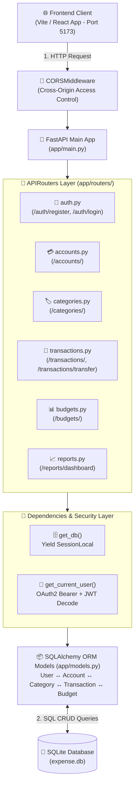

# Real-World Capstone Project — Expense Tracker API 💰

## প্রজেক্ট পরিচিতি (Project Overview)

এই অধ্যায়ে আমরা তোমার পিসিতে থাকা **Expense Tracker API** (`D:\Django_The_Last_Hope_Phitron\Expense-Tracker\backend`) প্রজেক্টটির **প্রতিটি ফাইল, ফানশন এবং কোডের লাইন-বাই-লাইন** গভীর আলোচনা করবো।

এতক্ষণ কোর্সে আমরা যেসব তত্ত্ব ও ধারণা শিখেছি (Routing, Pydantic v2, Dependency Injection, Bcrypt, PyJWT Auth, SQLAlchemy ORM, Middlewares, SQL Aggregations), এই প্রজেক্টটিতে তার প্রতিটি জিনিসের বাস্তবায়ন রয়েছে।

---

## 🏗️ Project System Architecture & Data Flow



---

## 📁 প্রজেক্ট মডিউল নির্দেশিকা (Module Directory)

| মডিউল / ফাইল | দায়িত্ব (Responsibility) | FastAPI টপিকস |
|-------------|------------------------|--------------|
| **`app/main.py`** | অ্যাপ ইনস্ট্যান্স, CORS এবং রাউটার যুক্ত করা | `FastAPI()`, `CORSMiddleware`, `include_router()` |
| **`app/database.py`** | ডাটাবেজ কনেকশন ও সেশন তৈরি | `create_engine()`, `sessionmaker()`, `declarative_base()` |
| **`app/models.py`** | ডাটাবেজ টেবিল স্কিমা ও রিলেশনশিপ | SQLAlchemy `Column`, `ForeignKey`, `relationship`, `Enum` |
| **`app/schemas.py`** | ইনপুট ভ্যালিডেশন ও আউটপুট ফিল্টারিং | Pydantic `BaseModel`, `EmailStr`, `Field`, `from_attributes` |
| **`app/auth.py`** | পাসওয়ার্ড হ্যাশিং ও JWT টোকেন জেনারেশন | `bcrypt.hashpw()`, `jwt.encode()`, `datetime.utcnow()` |
| **`app/dependencies.py`** | ডিপেন্ডেন্সি ইনজেকশন ও অথ চেকিং | `Depends()`, `OAuth2PasswordBearer`, `yield db` |
| **`app/routers/`** | মডিউলার এন্ট্রিপয়েন্ট ও বিজনেস লজিক | `APIRouter()`, `HTTPException`, SQL `func.sum()` |

---

## Module 1: Entry Point & CORS Setup (`app/main.py`)

`main.py` হলো পুরো অ্যাপ্লিকেশনের এন্ট্রি পয়েন্ট। এখানে অ্যাপ ইনস্ট্যান্স তৈরি, টেবিল জেনারেট, CORS মিডলওয়্যার এবং রাউটার ইনক্লুড করা হয়।

```python
# app/main.py
from fastapi import FastAPI
from fastapi.middleware.cors import CORSMiddleware
from .database import engine, Base
from .routers import auth, users, categories, accounts, transactions, budgets, reports

# ১. ডাটাবেজ টেবিলগুলো স্বয়ংক্রিয়ভাবে তৈরি করো (যদি আগে না থাকে)
Base.metadata.create_all(bind=engine)

# ২. FastAPI Application Instance তৈরি
app = FastAPI(
    title="Expense Tracker API",
    description="Pocket Hisaab clone backend",
    version="1.0.0"
)

# ৩. CORS Middleware যুক্তকরণ — ফ্রন্টএন্ড (React/Vite) থেকে API কলের অনুমতি দিতে
app.add_middleware(
    CORSMiddleware,
    allow_origins=[
        "http://localhost:5173",   # Vite default port
        "http://localhost:3000",   # React default port
        "http://127.0.0.1:5173",
        "http://127.0.0.1:3000",
        "*"                        # Development-এর জন্য সব Origin allow
    ],
    allow_credentials=True,        # Cookies & Auth Header allow করতে
    allow_methods=["*"],           # GET, POST, PUT, DELETE সব allow
    allow_headers=["*"],           # সব HTTP Header allow
)

# ৪. সব APIRouter ইনক্লুড করা
app.include_router(auth.router)
app.include_router(users.router)
app.include_router(categories.router)
app.include_router(accounts.router)
app.include_router(transactions.router)
app.include_router(budgets.router)
app.include_router(reports.router)

@app.get("/")
def root():
    return {"message": "Expense Tracker API", "docs": "/docs"}
```

### 💡 কোড ব্যাখ্যা (Key Concepts):
- **`Base.metadata.create_all(bind=engine)`**: SQLAlchemy মডেলগুলোতে সংজ্ঞায়িত সব টেবিল ডাইনামিকালি তৈরি করে।
- **`CORSMiddleware`**: ব্রাউজার সিকিউরিটি ব্লক (CORS Error) ঠেকাতে ডিক্লেয়ার করা হয়েছে। `allow_credentials=True` এর ফলে `Authorization: Bearer <token>` হেডার ফ্রন্টএন্ড থেকে রেসপন্সে পাঠাতে সমস্যা হয় না।
- **`app.include_router(...)`**: বিশাল কোডবেসকে মডিউলার রাখার জন্য ছোট ছোট রাউটার আলাদা ফাইলে লিখে একসাথে যুক্ত করা হয়েছে।

---

## Module 2: Database Connection (`app/database.py`)

```python
# app/database.py
from sqlalchemy import create_engine
from sqlalchemy.ext.declarative import declarative_base
from sqlalchemy.orm import sessionmaker

# ১. SQLite ডাটাবেজ ফাইল লোকেশন
SQLALCHEMY_DATABASE_URL = "sqlite:///./expense.db"

# ২. SQLAlchemy Engine তৈরি (SQLite থ্রেড সেফটির জন্য check_same_thread=False)
engine = create_engine(SQLALCHEMY_DATABASE_URL, connect_args={"check_same_thread": False})

# ৩. Database Session Factory তৈরি
SessionLocal = sessionmaker(autocommit=False, autoflush=False, bind=engine)

# ৪. Base Class তৈরি যা থেকে সব ORM Model inherit করবে
Base = declarative_base()
```

### 💡 কোড ব্যাখ্যা:
- **`connect_args={"check_same_thread": False}`**: SQLite ডিফল্টভাবে কেবল একটি থ্রেডে কাজ করে। FastAPI একাধিক কনকারেন্ট থ্রেডে কাজ করায় এই সেটিংটি প্রয়োজন।
- **`autocommit=False, autoflush=False`**: ডেটা সেভ করতে ডেভেলপারকে স্পষ্ট করে `db.commit()` লিখতে হয়, যাতে ডাটাবেজ ট্রানজেকশন কন্ট্রোল নির্ভুল থাকে।

---

## Module 3: Database Models & Relationships (`app/models.py`)

এখানে ডাটাবেজ টেবিলগুলোর গঠন, সম্পর্ক (Relationships) এবং ইউনিক কনস্ট্রেইন্ট ডিফাইন করা হয়েছে।

```python
# app/models.py
from sqlalchemy import Column, Integer, String, Float, DateTime, Date, Enum, ForeignKey, UniqueConstraint
from sqlalchemy.orm import relationship
from datetime import datetime
from .database import Base
import enum

# ===== Python Enums — নির্দিষ্ট মান সীমাবদ্ধ করতে =====
class TransactionType(str, enum.Enum):
    INCOME = "income"
    EXPENSE = "expense"

class AccountType(str, enum.Enum):
    CASH = "cash"
    BANK = "bank"
    CREDIT_CARD = "credit_card"
    MOBILE_BANKING = "mobile_banking"

# ===== User Model =====
class User(Base):
    __tablename__ = "users"

    id = Column(Integer, primary_key=True, index=True)
    name = Column(String, nullable=False)
    email = Column(String, unique=True, index=True, nullable=False)
    hashed_password = Column(String, nullable=False)
    currency = Column(String, default="BDT")
    created_at = Column(DateTime, default=datetime.utcnow)

    # One-to-Many Relationships
    # User ডিলিট হলে তার সাথে যুক্ত সব Account, Category, Transaction অটোমেটিক ডিলিট হবে (cascade)
    accounts = relationship("Account", back_populates="user", cascade="all, delete-orphan")
    categories = relationship("Category", back_populates="user", cascade="all, delete-orphan")
    transactions = relationship("Transaction", back_populates="user", cascade="all, delete-orphan")
    budgets = relationship("Budget", back_populates="user", cascade="all, delete-orphan")

# ===== Account Model =====
class Account(Base):
    __tablename__ = "accounts"

    id = Column(Integer, primary_key=True, index=True)
    user_id = Column(Integer, ForeignKey("users.id"), nullable=False)  # Foreign Key
    name = Column(String(50), nullable=False)
    type = Column(Enum(AccountType), nullable=False)
    balance = Column(Float, default=0.0)
    currency = Column(String(3), default="BDT")

    # Reverse Relationship
    user = relationship("User", back_populates="accounts")
    transactions = relationship("Transaction", back_populates="account")

    # Composite Unique Constraint: একই ইউজারের একটির বেশি একই নামের অ্যাকাউন্ট হতে পারবে না
    __table_args__ = (UniqueConstraint('user_id', 'name'),)

# ===== Transaction Model =====
class Transaction(Base):
    __tablename__ = "transactions"

    id = Column(Integer, primary_key=True, index=True)
    user_id = Column(Integer, ForeignKey("users.id"), nullable=False)
    account_id = Column(Integer, ForeignKey("accounts.id"), nullable=False)
    category_id = Column(Integer, ForeignKey("categories.id"), nullable=True)
    amount = Column(Float, nullable=False)
    type = Column(Enum(TransactionType), nullable=False)
    description = Column(String(255))
    date = Column(Date, nullable=False)
    created_at = Column(DateTime, default=datetime.utcnow)
    
    # ট্রান্সফারের ক্ষেত্রে জোড়া কাস্টম আইডি রাখার জন্য
    transfer_id = Column(Integer, nullable=True, index=True)

    user = relationship("User", back_populates="transactions")
    account = relationship("Account", back_populates="transactions")
    category = relationship("Category", back_populates="transactions")
```

### 💡 কোড ব্যাখ্যা:
- **`Enum(AccountType)`**: ডাটাবেজের কলামে শুধু নির্ধারিত মানগুলো (`cash`, `bank`, `credit_card`, `mobile_banking`) গ্রহণ করবে।
- **`cascade="all, delete-orphan"`**: ডাটাবেজ ক্লিনলিনেসের জন্য অত্যন্ত গুরুত্বপূর্ণ। কোনো ইউজার অ্যাকাউন্ট ডিলিট করলে তার অধীনে থাকা চাইল্ড রেকর্ডগুলো অর্ফান (Orphan) হিসেবে ডাটাবেজে পড়ে থাকবে না।
- **`UniqueConstraint('user_id', 'name')`**: একজন ইউজারের ক্ষেত্রে অ্যাকাউন্টের নাম ইউনিক রাখা নিশ্চিত করে (যেমন: User 1 দুটি "Bkash" তৈরি করতে পারবে না, কিন্তু User 2 নিজের "Bkash" বানাতে পারবে)।

---

## Module 4: Pydantic Schemas (`app/schemas.py`)

Pydantic ইনপুট ভ্যালিডেশন এবং আউটপুট ডেটা ফিল্টারিং (DTO) নিশ্চিত করে।

```python
# app/schemas.py
from pydantic import BaseModel, EmailStr, Field
from datetime import datetime, date
from typing import Optional, List
from enum import Enum

# ===== User Schemas =====
class UserBase(BaseModel):
    name: str
    email: EmailStr  # Pydantic-এর অটোমেটিক Email format check

class UserCreate(UserBase):
    password: str    # ইনপুটে পাসওয়ার্ড লাগবে

class UserOut(UserBase):
    id: int
    currency: str
    created_at: datetime

    class Config:
        orm_mode = True  # ORM Object -> Pydantic Dict Convert

class Token(BaseModel):
    access_token: str
    token_type: str = "bearer"

# ===== Account Schemas =====
class AccountBase(BaseModel):
    name: str
    type: str  # cash, bank, credit_card, mobile_banking
    balance: Optional[float] = 0.0
    currency: Optional[str] = "BDT"

class AccountCreate(AccountBase):
    pass

class AccountOut(AccountBase):
    id: int
    user_id: int

    class Config:
        orm_mode = True

# ===== Transaction Schemas =====
class TransactionBase(BaseModel):
    account_id: int
    category_id: int
    amount: float = Field(gt=0)  # পরিমাণ অবশ্যই ০ এর বেশি হতে হবে
    type: str                    # income / expense
    description: Optional[str] = None
    date: date

class TransactionCreate(TransactionBase):
    pass

class TransactionOut(TransactionBase):
    id: int
    user_id: int
    created_at: datetime
    account: Optional[AccountOut] = None
    category: Optional[CategoryOut] = None
    transfer_id: Optional[int] = None

    model_config = {"from_attributes": True} # Pydantic v2 syntax
```

### 💡 কোড ব্যাখ্যা:
- **`UserOut` বনাম `UserCreate`**: `UserCreate`-এ পাসওয়ার্ড ফিল্ড থাকলেও `UserOut`-এ পাসওয়ার্ড নেই। এর ফলে API রেসপন্সে হ্যশ করা পাসওয়ার্ডও কখনো ক্লায়েন্টে লিক হবে না।
- **`Field(gt=0)`**: ট্রানজেকশনে নেগেটিভ বা শূন্য টাকা দেওয়া রোধ করতে ভ্যালিডেশন নিয়ম বসানো হয়েছে।
- **`from_attributes = True` / `orm_mode = True`**: SQLAlchemy অবজেক্টকে সরাসরি Pydantic জেসনে রূপান্তর করার অনুমতি দেয়।

---

## Module 5: Security, Hashing & JWT Auth (`app/auth.py`)

নিরাপদে পাসওয়ার্ড হ্যাশ করা এবং JWT টোকেন ইস্যু করার লজিক:

```python
# app/auth.py
from datetime import datetime, timedelta
from typing import Optional
from jose import JWTError, jwt
import bcrypt
import os
from dotenv import load_dotenv

load_dotenv()

SECRET_KEY = os.getenv("SECRET_KEY", "your-secret-key-here")
ALGORITHM = "HS256"
ACCESS_TOKEN_EXPIRE_MINUTES = 30

# ===== Bcrypt Password Hashing =====
def _truncate_to_72_bytes(password: str) -> bytes:
    """Bcrypt-এর ৭২ বাইট লিমিট মেনে UTF-8 এ রূপান্তর"""
    encoded = password.encode('utf-8')
    return encoded[:72] if len(encoded) > 72 else encoded

def get_password_hash(password: str) -> str:
    """পাসওয়ার্ড হ্যশ তৈরি করো"""
    pwd_bytes = _truncate_to_72_bytes(password)
    salt = bcrypt.gensalt()
    hashed = bcrypt.hashpw(pwd_bytes, salt)
    return hashed.decode('utf-8')

def verify_password(plain_password: str, hashed_password: str) -> bool:
    """পাসওয়ার্ড মিলিয়ে দেখো"""
    pwd_bytes = _truncate_to_72_bytes(plain_password)
    return bcrypt.checkpw(pwd_bytes, hashed_password.encode('utf-8'))

# ===== JWT Token Generator =====
def create_access_token(data: dict, expires_delta: Optional[timedelta] = None):
    to_encode = data.copy()
    expire = datetime.utcnow() + (expires_delta or timedelta(minutes=ACCESS_TOKEN_EXPIRE_MINUTES))
    to_encode.update({"exp": expire})
    encoded_jwt = jwt.encode(to_encode, SECRET_KEY, algorithm=ALGORITHM)
    return encoded_jwt
```

---

## Module 6: Dependency Injection System (`app/dependencies.py`)

সব এন্ট্রিপয়েন্টে ডাটাবেজ সেশন এবং সিকিউর ইউজার ইনজেক্ট করতে এই ফাইলটি ব্যবহৃত হয়েছে।

```python
# app/dependencies.py
from fastapi import Depends, HTTPException, status
from fastapi.security import OAuth2PasswordBearer
from jose import JWTError, jwt
from sqlalchemy.orm import Session
from .database import SessionLocal
from . import models, auth

# OAuth2 Scheme — Header থেকে Bearer token টানে
oauth2_scheme = OAuth2PasswordBearer(tokenUrl="auth/login")

# 1. Database Generator Dependency
def get_db():
    db = SessionLocal()
    try:
        yield db
    finally:
        db.close()  # রিকোয়েস্ট শেষে সেশন নিশ্চিতভাবে ক্লোজ হবে

# 2. Authentication Dependency Chain
async def get_current_user(token: str = Depends(oauth2_scheme), db: Session = Depends(get_db)):
    credentials_exception = HTTPException(
        status_code=status.HTTP_401_UNAUTHORIZED,
        detail="ক্রিডেনশিয়াল ভ্যালিড করা সম্ভব হয়নি",
        headers={"WWW-Authenticate": "Bearer"},
    )
    try:
        # JWT Token Decode করো
        payload = jwt.decode(token, auth.SECRET_KEY, algorithms=[auth.ALGORITHM])
        email: str = payload.get("sub")
        if email is None:
            raise credentials_exception
    except JWTError:
        raise credentials_exception

    # ডাটাবেজ থেকে বর্তমান ইউজার তুলে আনো
    user = db.query(models.User).filter(models.User.email == email).first()
    if user is None:
        raise credentials_exception
    return user
```

### 💡 কোড ব্যাখ্যা:
- **`yield db`**: রিকোয়েস্টের শুরুতে সেশন তৈরি করে এন্ট্রিপয়েন্টে পাস করে, এবং রেসপন্স শেষ হওয়া মাত্রই `finally` ব্লকে সেশন ক্লোজ করে মেমোরি লিক ঠেকায়।
- **`get_current_user` Dependency Chain**: টোকেন যাচাই করা, ইমেইল এক্সট্র্যাক্ট করা এবং ডাটাবেজ থেকে বর্তমান ইউজার অবজেক্ট সরাসরি এন্ট্রিপয়েন্ট ফাংশনে ইনজেক্ট করার পুরো কাজ এটি একলাইনে সম্পন্ন করে।

---

## Module 7: Core Routers & Business Logic

### A. Authentication Router (`app/routers/auth.py`)

```python
# app/routers/auth.py
from fastapi import APIRouter, Depends, HTTPException, status
from sqlalchemy.orm import Session
from .. import schemas, models, auth, dependencies

router = APIRouter(prefix="/auth", tags=["auth"])

# ===== Signup Endpoint =====
@router.post("/register", response_model=schemas.UserOut)
def register(user: schemas.UserCreate, db: Session = Depends(dependencies.get_db)):
    # ১. একই ইমেইলে একাধিক একাউন্ট চেক
    existing = db.query(models.User).filter(models.User.email == user.email).first()
    if existing:
        raise HTTPException(status_code=400, detail="ইমেইলটি ইতিপূর্বে নিবন্ধিত হয়েছে")
    
    # ২. পাসওয়ার্ড হ্যশ করো এবং সেভ করো
    hashed = auth.get_password_hash(user.password)
    new_user = models.User(name=user.name, email=user.email, hashed_password=hashed)
    db.add(new_user)
    db.commit()
    db.refresh(new_user)
    return new_user

# ===== Login Endpoint =====
@router.post("/login", response_model=schemas.Token)
def login(user: schemas.UserLogin, db: Session = Depends(dependencies.get_db)):
    db_user = db.query(models.User).filter(models.User.email == user.email).first()
    if not db_user or not auth.verify_password(user.password, db_user.hashed_password):
        raise HTTPException(status_code=401, detail="ভুল ইমেইল বা পাসওয়ার্ড")
    
    # JWT Access Token তৈরি
    access_token = auth.create_access_token(data={"sub": db_user.email})
    return {"access_token": access_token, "token_type": "bearer"}
```

---

### B. Accounts Router (`app/routers/accounts.py`)

```python
# app/routers/accounts.py
from fastapi import APIRouter, Depends, HTTPException
from sqlalchemy.orm import Session
from typing import List
from .. import schemas, models, dependencies

router = APIRouter(prefix="/accounts", tags=["accounts"])

# ===== Create Account =====
@router.post("/", response_model=schemas.AccountOut)
def create_account(
    account: schemas.AccountCreate,
    db: Session = Depends(dependencies.get_db),
    current_user: models.User = Depends(dependencies.get_current_user)
):
    # ইউজার আইডি ও নাম মিলিয়ে ডুপ্লিকেট অ্যাকাউন্ট চেক
    existing = db.query(models.Account).filter(
        models.Account.user_id == current_user.id,
        models.Account.name == account.name
    ).first()
    if existing:
        raise HTTPException(status_code=400, detail="একই নামে অ্যাকাউন্ট ইতিমধ্যে রয়েছে")

    new_account = models.Account(
        user_id=current_user.id,
        **account.model_dump()
    )
    db.add(new_account)
    db.commit()
    db.refresh(new_account)
    return new_account

# ===== Get All Accounts =====
@router.get("/", response_model=List[schemas.AccountOut])
def get_accounts(
    db: Session = Depends(dependencies.get_db),
    current_user: models.User = Depends(dependencies.get_current_user)
):
    # শুধুমাত্র লগইন করা ইউজারের অ্যাকাউন্টগুলো নিয়ে আসা
    return db.query(models.Account).filter(models.Account.user_id == current_user.id).all()
```

---

### C. Transactions & Transfer Engine (`app/routers/transactions.py`)

এই ফাইলেই মূল ফিন্যান্সিয়াল লজিক রয়েছে — যেখানে আয় ও ব্যয়ের ওপর ভিত্তি করে অ্যাকাউন্টের ব্যালেন্স অটোমেটিক আপডেট হয় এবং ২টি অ্যাকাউন্টের মধ্যে টাকা ট্রান্সফার করা যায়।

```python
# app/routers/transactions.py
from fastapi import APIRouter, Depends, HTTPException, Query
from sqlalchemy.orm import Session
from typing import List, Optional
from datetime import date
import time, random
from .. import schemas, models, dependencies

router = APIRouter(prefix="/transactions", tags=["transactions"])

# ===== 1. Single Income/Expense Transaction =====
@router.post("/", response_model=schemas.TransactionOut)
def create_transaction(
    transaction: schemas.TransactionCreate,
    db: Session = Depends(dependencies.get_db),
    current_user: models.User = Depends(dependencies.get_current_user)
):
    # অ্যাকাউন্টটির মালিক এই ইউজার কিনা নিশ্চিতকরণ
    account = db.query(models.Account).filter(
        models.Account.id == transaction.account_id,
        models.Account.user_id == current_user.id
    ).first()
    if not account:
        raise HTTPException(status_code=404, detail="অ্যাকাউন্ট পাওয়া যায়নি")

    # নতুন লেনদেন তৈরি
    new_transaction = models.Transaction(
        user_id=current_user.id,
        **transaction.model_dump()
    )
    db.add(new_transaction)

    # 💡 বিজনেসলজিক: টাইপ অনুযায়ী অ্যাকাউন্টের ব্যালেন্স অটো-আপডেট
    if transaction.type == schemas.TransactionType.INCOME:
        account.balance += transaction.amount
    else:  # EXPENSE
        account.balance -= transaction.amount

    db.commit()
    db.refresh(new_transaction)
    return new_transaction

# ===== 2. Account-to-Account Money Transfer =====
@router.post("/transfer")
def transfer_money(
    transfer: schemas.TransferCreate,
    db: Session = Depends(dependencies.get_db),
    current_user: models.User = Depends(dependencies.get_current_user)
):
    """
    ১টি অ্যাকাউন্ট থেকে অন্য অ্যাকাউন্টে টাকা পাঠানোর লজিক:
    - Source Account থেকে টাকা কমবে (Expense Transaction)
    - Destination Account-এ টাকা বাড়বে (Income Transaction)
    - উভয় লেনদেনে একই transfer_id থাকবে
    """
    from_acc = db.query(models.Account).filter(
        models.Account.id == transfer.from_account_id,
        models.Account.user_id == current_user.id
    ).first()
    to_acc = db.query(models.Account).filter(
        models.Account.id == transfer.to_account_id,
        models.Account.user_id == current_user.id
    ).first()

    if not from_acc or not to_acc:
        raise HTTPException(status_code=404, detail="উৎস বা গন্তব্য অ্যাকাউন্ট সঠিক নয়")

    if from_acc.balance < transfer.amount:
        raise HTTPException(status_code=400, detail="অ্যাকাউন্টে পর্যাপ্ত ব্যালেন্স নেই")

    # Unique Transfer ID তৈরি
    transfer_group_id = int(time.time() * 1000) + random.randint(100, 999)

    # ১. Source Account থেকে Expense তৈরি
    out_txn = models.Transaction(
        user_id=current_user.id,
        account_id=from_acc.id,
        category_id=transfer.category_id,
        amount=transfer.amount,
        type=models.TransactionType.EXPENSE,
        description=f"Transfer to {to_acc.name}: {transfer.description or ''}",
        date=transfer.date,
        transfer_id=transfer_group_id
    )
    from_acc.balance -= transfer.amount

    # ২. Destination Account-এ Income তৈরি
    in_txn = models.Transaction(
        user_id=current_user.id,
        account_id=to_acc.id,
        category_id=transfer.category_id,
        amount=transfer.amount,
        type=models.TransactionType.INCOME,
        description=f"Transfer from {from_acc.name}: {transfer.description or ''}",
        date=transfer.date,
        transfer_id=transfer_group_id
    )
    to_acc.balance += transfer.amount

    db.add(out_txn)
    db.add(in_txn)
    db.commit()

    return {"message": "টাকা স্থানান্তর সফল হয়েছে", "transfer_id": transfer_group_id}

# ===== 3. List Transactions with Query Validation =====
@router.get("/", response_model=List[schemas.TransactionOut])
def get_transactions(
    start_date: Optional[date] = None,
    end_date: Optional[date] = None,
    limit: int = Query(50, ge=1, le=200),  # সর্বনিম্ন ১, সর্বোচ্চ ২০০ টি
    offset: int = Query(0, ge=0),
    db: Session = Depends(dependencies.get_db),
    current_user: models.User = Depends(dependencies.get_current_user)
):
    query = db.query(models.Transaction).filter(models.Transaction.user_id == current_user.id)

    if start_date:
        query = query.filter(models.Transaction.date >= start_date)
    if end_date:
        query = query.filter(models.Transaction.date <= end_date)

    return query.order_by(models.Transaction.date.desc()).offset(offset).limit(limit).all()
```

---

### D. Analytics & Dashboard Reports Router (`app/routers/reports.py`)

এই ফাইলে SQL Aggregate ফানশন (`func.sum`) এবং `group_by` ব্যবহার করে জটিল আর্থিক রিপোর্ট তৈরি করা হয়েছে।

```python
# app/routers/reports.py
from fastapi import APIRouter, Depends, Query, HTTPException
from sqlalchemy.orm import Session
from sqlalchemy import func
from datetime import date, timedelta
from typing import Optional
from .. import models, dependencies

router = APIRouter(prefix="/reports", tags=["reports"])

@router.get("/dashboard")
def get_dashboard(
    month: Optional[int] = Query(None, ge=1, le=12),
    year: Optional[int] = Query(None, ge=2000),
    db: Session = Depends(dependencies.get_db),
    current_user: models.User = Depends(dependencies.get_current_user)
):
    today = date.today()
    month = month or today.month
    year = year or today.year
    start_date = date(year, month, 1)

    # ১. মোট ইনকাম হিসাব (SQL Sum)
    total_income = db.query(func.sum(models.Transaction.amount)).filter(
        models.Transaction.user_id == current_user.id,
        models.Transaction.type == "income",
        models.Transaction.date >= start_date
    ).scalar() or 0.0

    # ২. মোট এক্সপেন্স হিসাব (SQL Sum)
    total_expense = db.query(func.sum(models.Transaction.amount)).filter(
        models.Transaction.user_id == current_user.id,
        models.Transaction.type == "expense",
        models.Transaction.date >= start_date
    ).scalar() or 0.0

    # ৩. ক্যাটাগরি অনুযায়ী ব্যয়ের শতাংশ (SQL Group By Query)
    category_spending = db.query(
        models.Category.name,
        func.sum(models.Transaction.amount).label('total')
    ).join(
        models.Transaction, models.Transaction.category_id == models.Category.id
    ).filter(
        models.Transaction.user_id == current_user.id,
        models.Transaction.type == "expense",
        models.Transaction.date >= start_date
    ).group_by(models.Category.name).all()

    total_exp = total_expense if total_expense > 0 else 1
    spending = [
        {
            "category_name": cat.name,
            "total": float(cat.total),
            "percentage": round((float(cat.total) / total_exp) * 100, 2)
        }
        for cat in category_spending
    ]

    return {
        "total_income": total_income,
        "total_expense": total_expense,
        "net_savings": total_income - total_expense,
        "spending_by_category": spending
    }
```

---

## লোকালি প্রজেক্টটি টেস্ট করার সহজ নির্দেশিকা

তোমার পিসির লোকাল প্রজেক্টটি চালাতে নিচের ৩টি কমান্ড কমান্ড প্রম্পটে দাও:

```bash
# ১. প্রজেক্ট ফোল্ডারে যাও
cd D:\Django_The_Last_Hope_Phitron\Expense-Tracker\backend

# ২. Virtual Environment চালু করো (Windows)
venv\Scripts\activate

# ৩. FastAPI ডেভেলপমেন্ট সার্ভার চালু করো
uvicorn app.main:app --reload
```

ব্রাউজারে যাও: `http://127.0.0.1:8000/docs` — এখানে সম্পূর্ণ স্বয়ংক্রিয় Swagger UI ইন্টারফেস দেখতে পাবে এবং সবকটি এন্ট্রিপয়েন্ট টেস্ট করতে পারবে।

---

## প্রজেক্ট থেকে শেখা মূল বিষয়সমূহ (Summary)

- ✅ **Modular Routing**: `APIRouter(prefix=...)` দিয়ে বিশালাকার প্রজেক্টকে পরিষ্কার মডিউলে ভাগ করা যায়।
- ✅ **Automatic Data Schema Protection**: Pydantic models ও `orm_mode = True` ব্যবহারে হ্যশ করা পাসওয়ার্ড বা অপ্রয়োজনীয় ফিল্ড রেসপন্সে যায় না।
- ✅ **Atomic Balance Updates**: লেনদেন তৈরির সাথেই ডাটাবেজের রিলেটেড একাউন্টের ব্যালেন্স স্বয়ংক্রিয়ভাবে সিঙ্ক হয়।
- ✅ **Clean Dependency Pattern**: `get_db` সেশন লিকেজ রোধ করে এবং `get_current_user` নিশ্চিত করে প্রতিটি ডাটা কেবল নির্দিষ্ট ইউজারের কাছেই পৌঁছাবে (Data Privacy)।
