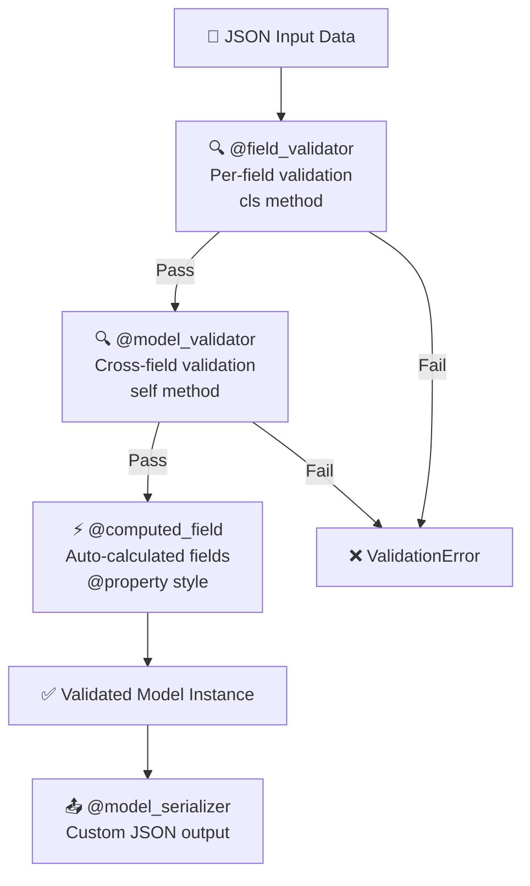

# Pydantic Advanced 🔬

## Pydantic Advanced কী? (What)

Basic Pydantic-এ শিখেছিলে `BaseModel`, `Field()`, simple validation। কিন্তু real-world app-এ আরও জটিল validation দরকার:

- Email format check করা
- দুটো field-এর মধ্যে সম্পর্ক (password == confirm_password)
- একটি field থেকে আরেকটি automatically calculate করা
- Custom type তৈরি করা (BDPhone, TakaAmount)
- JSON output customize করা

এই সব Pydantic v2-এর Advanced features দিয়ে করা যায়।

---

## কেন Advanced Pydantic দরকার? (Why)

```python
# ❌ Basic validation — অনেক কিছু miss হয়
class User(BaseModel):
    email: str          # "notanemail" → valid! (ভুল)
    phone: str          # "abc" → valid! (ভুল)
    password: str
    confirm: str        # password == confirm check হয় না!
    age: int            # -5 → valid! (ভুল)

# ✅ Advanced validation — সব checked
class User(BaseModel):
    email: EmailStr                     # ← format validate
    phone: str
    password: str = Field(min_length=8)
    confirm: str

    @field_validator("phone")
    @classmethod
    def validate_bd_phone(cls, v):
        if not v.startswith(("017", "018", "019", "016", "015", "013")):
            raise ValueError("বাংলাদেশী phone number হতে হবে")
        return v

    @model_validator(mode="after")
    def check_passwords_match(self):
        if self.password != self.confirm:
            raise ValueError("Password মিলছে না")
        return self
```

---

## Advanced Validation Flow



---

## ১. @field_validator — Field-level Custom Validation

```python
from pydantic import BaseModel, Field, field_validator
from typing import Optional
import re

class UserRegistration(BaseModel):
    username: str
    email: str
    phone: str
    age: int
    website: Optional[str] = None
    national_id: str   # NID — ১০ বা ১৭ সংখ্যা

    # ===== String transform =====
    @field_validator("username")
    @classmethod
    def validate_username(cls, v: str) -> str:
        """
        username validate করো এবং transform করো।
        
        @classmethod → self-এর বদলে cls ব্যবহার করে
        return করা value model-এ store হবে
        """
        v = v.strip()   # Leading/trailing space সরাও

        if len(v) < 3:
            raise ValueError("Username কমপক্ষে ৩ অক্ষরের হতে হবে")

        if not re.match(r"^[a-zA-Z0-9_]+$", v):
            raise ValueError("Username-এ শুধু letters, numbers, underscore থাকতে পারবে")

        return v.lower()   # সবসময় lowercase-এ store করো

    # ===== Format validation =====
    @field_validator("email")
    @classmethod
    def validate_email(cls, v: str) -> str:
        """Email format validate করো"""
        v = v.strip().lower()
        email_pattern = r"^[a-zA-Z0-9._%+-]+@[a-zA-Z0-9.-]+\.[a-zA-Z]{2,}$"
        if not re.match(email_pattern, v):
            raise ValueError(f"'{v}' সঠিক email format নয়")
        return v

    # ===== Bangladesh phone validation =====
    @field_validator("phone")
    @classmethod
    def validate_bd_phone(cls, v: str) -> str:
        """বাংলাদেশী phone number validate করো"""
        # Spaces, dashes, +880 prefix সরাও
        clean = re.sub(r"[\s\-\+]", "", v)
        if clean.startswith("880"):
            clean = "0" + clean[3:]

        bd_prefixes = ("013", "014", "015", "016", "017", "018", "019")
        if not clean.startswith(bd_prefixes):
            raise ValueError("বাংলাদেশী mobile number হতে হবে (017/018/019...)")

        if len(clean) != 11:
            raise ValueError("Phone number ঠিক ১১ সংখ্যার হতে হবে")

        if not clean.isdigit():
            raise ValueError("Phone number-এ শুধু সংখ্যা থাকবে")

        return clean   # Clean format-এ store

    # ===== Range validation =====
    @field_validator("age")
    @classmethod
    def validate_age(cls, v: int) -> int:
        """বয়স ১৮-১২০ এর মধ্যে হতে হবে"""
        if v < 18:
            raise ValueError(f"বয়স কমপক্ষে ১৮ বছর হতে হবে (দেওয়া হয়েছে: {v})")
        if v > 120:
            raise ValueError(f"বয়স ১২০ এর বেশি হতে পারবে না (দেওয়া হয়েছে: {v})")
        return v

    # ===== Optional field URL validation =====
    @field_validator("website")
    @classmethod
    def validate_website(cls, v: Optional[str]) -> Optional[str]:
        """Website URL validate করো — None হলে skip করো"""
        if v is None:
            return v
        v = v.strip()
        if not v.startswith(("http://", "https://")):
            v = "https://" + v   # Prefix যোগ করো
        return v

    # ===== Bangladesh NID validation =====
    @field_validator("national_id")
    @classmethod
    def validate_nid(cls, v: str) -> str:
        """NID — ১০ বা ১৭ সংখ্যা"""
        clean = re.sub(r"\s", "", v)
        if not clean.isdigit():
            raise ValueError("NID-এ শুধু সংখ্যা থাকবে")
        if len(clean) not in (10, 17):
            raise ValueError("NID ১০ বা ১৭ সংখ্যার হতে হবে")
        return clean

# Test করো
user = UserRegistration(
    username="  Ashraf_2024  ",   # space সরে lowercase হবে → "ashraf_2024"
    email="ASHRAF@GMAIL.COM",     # lowercase হবে → "ashraf@gmail.com"
    phone="+8801711234567",       # clean হবে → "01711234567"
    age=25,
    website="mysite.com",         # prefix যোগ → "https://mysite.com"
    national_id="1234567890"
)
print(user.username)   # ashraf_2024
print(user.phone)      # 01711234567
print(user.website)    # https://mysite.com
```

---

## ২. @model_validator — Cross-field Validation

```python
from pydantic import BaseModel, model_validator, field_validator
from typing import Optional
from datetime import date

class PasswordChangeRequest(BaseModel):
    current_password: str
    new_password: str
    confirm_password: str

    @field_validator("new_password")
    @classmethod
    def validate_password_strength(cls, v: str) -> str:
        """Password strength check করো"""
        errors = []
        if len(v) < 8:
            errors.append("কমপক্ষে ৮ অক্ষর হতে হবে")
        if not any(c.isupper() for c in v):
            errors.append("কমপক্ষে একটি capital letter থাকতে হবে")
        if not any(c.isdigit() for c in v):
            errors.append("কমপক্ষে একটি সংখ্যা থাকতে হবে")
        if not any(c in "!@#$%^&*()_+-=[]{}|;:,.<>?" for c in v):
            errors.append("কমপক্ষে একটি special character থাকতে হবে (!@#$...)")
        if errors:
            raise ValueError(f"Password শর্ত পূরণ করেনি: {', '.join(errors)}")
        return v

    # mode="after" → সব field validate হওয়ার পরে চলবে
    @model_validator(mode="after")
    def validate_passwords_match(self) -> "PasswordChangeRequest":
        """নতুন password দুটো মিলছে কিনা check করো"""
        if self.new_password != self.confirm_password:
            raise ValueError("নতুন password এবং confirm password মিলছে না")

        if self.current_password == self.new_password:
            raise ValueError("নতুন password পুরনো password-এর মতো হতে পারবে না")

        return self   # ← model instance return করতে হবে

class HotelBooking(BaseModel):
    """Check-in/check-out validation"""
    hotel_id: int
    room_type: str
    check_in: date
    check_out: date
    guests: int
    special_requests: Optional[str] = None

    # mode="before" → data parse হওয়ার আগে চলবে (raw dict-এ)
    @model_validator(mode="before")
    @classmethod
    def normalize_dates(cls, values: dict) -> dict:
        """String dates কে date object-এ convert করো"""
        # Raw data transform করো
        if isinstance(values.get("room_type"), str):
            values["room_type"] = values["room_type"].lower().strip()
        return values

    @model_validator(mode="after")
    def validate_booking_dates(self) -> "HotelBooking":
        """Check-in check-out logic validate করো"""
        today = date.today()

        if self.check_in < today:
            raise ValueError("Check-in date অতীতে হতে পারবে না")

        if self.check_out <= self.check_in:
            raise ValueError("Check-out date অবশ্যই check-in-এর পরে হতে হবে")

        nights = (self.check_out - self.check_in).days
        if nights > 30:
            raise ValueError(f"সর্বোচ্চ ৩০ রাত বুকিং করা যাবে ({nights} রাত দেওয়া হয়েছে)")

        if self.guests < 1:
            raise ValueError("কমপক্ষে ১ জন অতিথি থাকতে হবে")

        return self
```

---

## ৩. @computed_field — Auto-calculated Fields

```python
from pydantic import BaseModel, computed_field, Field
from typing import Optional
import math

class Product(BaseModel):
    name: str
    price: float = Field(gt=0)
    discount_percent: float = Field(default=0, ge=0, le=100)
    quantity: int = Field(ge=0)
    weight_kg: Optional[float] = None

    # ===== computed_field — automatically calculate করো =====
    @computed_field
    @property
    def discounted_price(self) -> float:
        """ছাড়ের পরে দাম"""
        return round(self.price * (1 - self.discount_percent / 100), 2)

    @computed_field
    @property
    def discount_amount(self) -> float:
        """ছাড়ের পরিমাণ"""
        return round(self.price - self.discounted_price, 2)

    @computed_field
    @property
    def total_value(self) -> float:
        """মোট stock মূল্য"""
        return round(self.discounted_price * self.quantity, 2)

    @computed_field
    @property
    def in_stock(self) -> bool:
        """Stock আছে কিনা"""
        return self.quantity > 0

    @computed_field
    @property
    def shipping_category(self) -> str:
        """ওজন অনুযায়ী shipping category"""
        if self.weight_kg is None:
            return "digital"
        elif self.weight_kg <= 0.5:
            return "light"
        elif self.weight_kg <= 5:
            return "medium"
        else:
            return "heavy"

class UserProfile(BaseModel):
    first_name: str
    last_name: str
    birth_year: int

    @computed_field
    @property
    def full_name(self) -> str:
        return f"{self.first_name} {self.last_name}"

    @computed_field
    @property
    def age(self) -> int:
        from datetime import date
        return date.today().year - self.birth_year

    @computed_field
    @property
    def initials(self) -> str:
        return f"{self.first_name[0].upper()}.{self.last_name[0].upper()}."

# ব্যবহার
product = Product(name="Laptop", price=80000, discount_percent=10, quantity=5, weight_kg=2.5)
print(product.discounted_price)   # 72000.0
print(product.discount_amount)    # 8000.0
print(product.total_value)        # 360000.0
print(product.in_stock)           # True
print(product.shipping_category)  # "medium"
print(product.model_dump())       # computed fields-ও include হবে!
```

---

## ৪. Custom Types — Reusable Validation

```python
from pydantic import BaseModel
from typing import Annotated
from pydantic.functional_validators import AfterValidator, BeforeValidator
import re

# ===== Custom Type দিয়ে — Annotated =====

def validate_bd_phone(v: str) -> str:
    """BD phone validator — reusable"""
    clean = re.sub(r"[\s\-\+]", "", v)
    if clean.startswith("880"):
        clean = "0" + clean[3:]
    if not clean.startswith(("013","014","015","016","017","018","019")):
        raise ValueError("বাংলাদেশী mobile number হতে হবে")
    if len(clean) != 11 or not clean.isdigit():
        raise ValueError("Phone number ১১ সংখ্যার হতে হবে")
    return clean

def validate_postal_code(v: str) -> str:
    """Bangladesh postal code — 4 digits"""
    clean = v.strip()
    if not re.match(r"^\d{4}$", clean):
        raise ValueError("Postal code ৪ সংখ্যার হতে হবে")
    return clean

def validate_taka_amount(v: float) -> float:
    """Taka amount — positive, max 2 decimal"""
    if v < 0:
        raise ValueError("পরিমাণ ঋণাত্মক হতে পারবে না")
    return round(v, 2)

def to_uppercase(v: str) -> str:
    """Before validator — input uppercase করো"""
    return v.upper().strip() if isinstance(v, str) else v

# Custom Types define করো
BDPhone = Annotated[str, AfterValidator(validate_bd_phone)]
PostalCode = Annotated[str, AfterValidator(validate_postal_code)]
TakaAmount = Annotated[float, AfterValidator(validate_taka_amount)]
UpperStr = Annotated[str, BeforeValidator(to_uppercase)]

# এখন এই custom types যেকোনো model-এ ব্যবহার করো!
class Customer(BaseModel):
    name: str
    phone: BDPhone              # ← custom type
    billing_zip: PostalCode     # ← custom type

class Order(BaseModel):
    product_id: int
    amount: TakaAmount          # ← custom type
    code: UpperStr              # ← uppercase করে নেবে

class Staff(BaseModel):
    employee_id: UpperStr       # ← একই type, অন্য model-এ
    phone: BDPhone              # ← একই validator

# ব্যবহার
customer = Customer(name="আরিফ", phone="+8801711234567", billing_zip="1216")
print(customer.phone)        # 01711234567

order = Order(product_id=1, amount=1234.567, code="abc-xyz")
print(order.amount)          # 1234.57
print(order.code)            # ABC-XYZ
```

---

## ৫. Discriminated Unions — Smart Type Selection

```python
from pydantic import BaseModel, Field
from typing import Literal, Union, Annotated

# ===== Payment method — different types =====

class CashPayment(BaseModel):
    type: Literal["cash"] = "cash"   # ← discriminator field
    amount: float
    received_by: str

class CardPayment(BaseModel):
    type: Literal["card"] = "card"
    amount: float
    card_number: str = Field(pattern=r"^\d{4}-\d{4}-\d{4}-\d{4}$")
    expiry: str
    cvv: str = Field(min_length=3, max_length=4)

class MobilePayment(BaseModel):
    type: Literal["bkash", "nagad", "rocket"]  # ← multiple literals
    amount: float
    mobile_number: str
    transaction_id: str

# Discriminated Union — type field দিয়ে কোন model use করবে বোঝে
PaymentMethod = Annotated[
    Union[CashPayment, CardPayment, MobilePayment],
    Field(discriminator="type")
]

class PurchaseOrder(BaseModel):
    order_id: int
    items: list
    payment: PaymentMethod   # ← যেকোনো payment type accept করবে

# ব্যবহার
order1 = PurchaseOrder(
    order_id=1,
    items=[{"name": "Laptop", "price": 80000}],
    payment={"type": "bkash", "amount": 80000, "mobile_number": "01711234567", "transaction_id": "TXN123"}
)
print(type(order1.payment).__name__)  # MobilePayment

order2 = PurchaseOrder(
    order_id=2,
    items=[],
    payment={"type": "cash", "amount": 5000, "received_by": "কাশেম মিয়া"}
)
print(type(order2.payment).__name__)  # CashPayment
```

---

## ৬. model_config — Model Configuration

```python
from pydantic import BaseModel, ConfigDict, Field
from datetime import datetime

class APIResponse(BaseModel):
    model_config = ConfigDict(
        # ORM mode — SQLAlchemy object থেকে convert করতে
        from_attributes=True,

        # Extra fields allow করবে কিনা
        # "ignore" → extra fields চুপ করে ignore করো
        # "forbid" → extra field আসলে error দাও
        # "allow" → extra fields accept করো
        extra="ignore",

        # String-এ whitespace trim করো
        str_strip_whitespace=True,

        # str → int auto coerce করবে কিনা
        coerce_numbers_to_str=False,

        # Frozen — instance তৈরির পরে change করা যাবে না
        frozen=False,

        # JSON schema title
        title="API Response Model",

        # Field alias থেকে populate করতে
        populate_by_name=True,

        # Validate defaults কিনা
        validate_default=True,
    )

    id: int
    name: str
    created_at: datetime = Field(default_factory=datetime.utcnow)

class ImmutablePoint(BaseModel):
    """frozen=True — তৈরির পরে change করা যাবে না"""
    model_config = ConfigDict(frozen=True)

    x: float
    y: float

    @computed_field
    @property
    def distance_from_origin(self) -> float:
        return round((self.x**2 + self.y**2)**0.5, 4)

point = ImmutablePoint(x=3.0, y=4.0)
print(point.distance_from_origin)  # 5.0
# point.x = 5.0  ← ❌ Error! frozen=True
```

---

## ৭. JSON Alias — Field Name Mapping

```python
from pydantic import BaseModel, Field, field_serializer
from datetime import datetime

class ExternalAPIResponse(BaseModel):
    """External API-র snake_case response → camelCase"""
    model_config = ConfigDict(populate_by_name=True)

    user_id: int = Field(alias="userId")        # JSON: "userId" → Python: user_id
    full_name: str = Field(alias="fullName")    # JSON: "fullName" → Python: full_name
    is_active: bool = Field(alias="isActive")   # JSON: "isActive" → Python: is_active
    created_at: datetime = Field(alias="createdAt")

    # Custom serializer — Output format নিয়ন্ত্রণ
    @field_serializer("created_at")
    def serialize_datetime(self, value: datetime) -> str:
        return value.strftime("%Y-%m-%d %H:%M:%S")

# JSON input (camelCase)
data = {
    "userId": 1,
    "fullName": "আরিফ হোসেন",
    "isActive": True,
    "createdAt": "2024-01-15T10:30:00"
}
user = ExternalAPIResponse(**data)
print(user.user_id)    # 1 (snake_case দিয়ে access)
print(user.full_name)  # আরিফ হোসেন

# Alias দিয়ে serialize
print(user.model_dump(by_alias=True))
# {"userId": 1, "fullName": "আরিফ হোসেন", "isActive": True, "createdAt": "2024-01-15 10:30:00"}
```

---

## ৮. Complete Real-World Example — E-commerce Product

```python
from pydantic import (
    BaseModel, Field, field_validator, model_validator,
    computed_field, ConfigDict
)
from typing import Optional, List, Annotated
from pydantic.functional_validators import AfterValidator
from datetime import datetime
import re

# Custom types
def validate_sku(v: str) -> str:
    if not re.match(r"^[A-Z]{3}-\d{4}-[A-Z]{2}$", v):
        raise ValueError("SKU format: ABC-1234-XY")
    return v

SKU = Annotated[str, AfterValidator(validate_sku)]

class ProductImage(BaseModel):
    url: str
    alt: str
    is_primary: bool = False

class ProductVariant(BaseModel):
    color: str
    size: str
    additional_price: float = 0.0
    stock: int = 0

class ProductCreate(BaseModel):
    model_config = ConfigDict(
        str_strip_whitespace=True,
        extra="ignore"
    )

    name: str = Field(min_length=3, max_length=200)
    sku: SKU
    description: str = Field(min_length=20)
    base_price: float = Field(gt=0)
    discount_percent: float = Field(default=0, ge=0, le=80)  # max 80% discount
    category: str
    brand: Optional[str] = None
    tags: List[str] = Field(default_factory=list, max_length=10)
    images: List[ProductImage] = Field(default_factory=list, max_length=10)
    variants: List[ProductVariant] = Field(default_factory=list)
    is_available: bool = True

    @field_validator("tags", mode="before")
    @classmethod
    def clean_tags(cls, v: list) -> list:
        """Tags lowercase + unique + strip করো"""
        return list(set(tag.lower().strip() for tag in v if tag.strip()))

    @field_validator("images")
    @classmethod
    def validate_primary_image(cls, v: List[ProductImage]) -> List[ProductImage]:
        """কমপক্ষে একটি primary image থাকতে হবে"""
        if v and not any(img.is_primary for img in v):
            v[0].is_primary = True  # প্রথমটিকে primary করো
        return v

    @model_validator(mode="after")
    def validate_product_logic(self) -> "ProductCreate":
        """Business rule — বিশেষ validation"""
        # বড় discount-এ brand mandatory
        if self.discount_percent > 50 and not self.brand:
            raise ValueError("৫০% এর বেশি discount-এ brand নাম দিতে হবে")

        # Variant থাকলে কমপক্ষে একটিতে stock থাকতে হবে
        if self.variants and not any(v.stock > 0 for v in self.variants):
            raise ValueError("কমপক্ষে একটি variant-এ stock থাকতে হবে")

        return self

    @computed_field
    @property
    def final_price(self) -> float:
        return round(self.base_price * (1 - self.discount_percent / 100), 2)

    @computed_field
    @property
    def total_stock(self) -> int:
        if not self.variants:
            return 0
        return sum(v.stock for v in self.variants)

    @computed_field
    @property
    def slug(self) -> str:
        """URL-friendly name"""
        name = self.name.lower()
        name = re.sub(r"[^\w\s-]", "", name)
        return re.sub(r"[\s_]+", "-", name).strip("-")
```

---

## Common Mistakes ⚠️

::: danger ভুল ১: @field_validator-এ @classmethod ভুলে যাওয়া
```python
# ❌ ভুল — @classmethod ছাড়া Pydantic v2-তে error
class User(BaseModel):
    name: str

    @field_validator("name")
    def validate_name(cls, v):   # ❌ @classmethod decorator নেই!
        return v.strip()

# ✅ সঠিক
class User(BaseModel):
    name: str

    @field_validator("name")
    @classmethod               # ← অবশ্যই দিতে হবে
    def validate_name(cls, v: str) -> str:
        return v.strip()
```
:::

::: danger ভুল ২: @model_validator(mode="after")-এ self return না করা
```python
# ❌ ভুল — return নেই!
@model_validator(mode="after")
def check(self) -> "Model":
    if self.a != self.b:
        raise ValueError("মিলছে না")
    # return self ← ভুলে গেছে! None return হবে

# ✅ সঠিক
@model_validator(mode="after")
def check(self) -> "Model":
    if self.a != self.b:
        raise ValueError("মিলছে না")
    return self   # ← অবশ্যই self return করো
```
:::

::: warning ভুল ৩: computed_field-এ @property ভুলে যাওয়া
```python
# ❌ ভুল — @property ছাড়া computed_field কাজ করে না
class Product(BaseModel):
    price: float

    @computed_field
    def discounted(self) -> float:    # ← @property নেই!
        return self.price * 0.9

# ✅ সঠিক
class Product(BaseModel):
    price: float

    @computed_field
    @property                          # ← অবশ্যই দিতে হবে
    def discounted(self) -> float:
        return self.price * 0.9
```
:::

---

## Best Practices ✨

- **@field_validator** → একটি field-এর validation | **@model_validator** → cross-field validation
- **Custom types** (`Annotated[str, AfterValidator(...)]`) → reusable validators — same validation একাধিক model-এ
- **mode="before"** → raw data transform (string → date) | **mode="after"** → validated data check
- **@computed_field** → DB-তে store হয় না কিন্তু response-এ থাকে — `model_dump()`-এ include হয়
- **`ConfigDict(from_attributes=True)`** → SQLAlchemy ORM object থেকে convert করতে সবসময়
- **Validator-এ ValueError raise করো** — Pydantic এটি ধরে `ValidationError`-এ convert করে
- **Return transformed value** — validator-এ transform করলে অবশ্যই return করো, না হলে None হবে

---

## Interview Questions 🎯

**প্রশ্ন ১: `@field_validator` এবং `@model_validator`-এর পার্থক্য কী?**

> **উত্তর:** `@field_validator("field_name")` একটি নির্দিষ্ট field validate করে — সেই field-এর value পায় এবং transformed value return করতে পারে। `@model_validator` পুরো model instance validate করে — `mode="after"` দিলে সব field validate হওয়ার পরে `self` পায়, cross-field validation (password == confirm) করতে পারে।

**প্রশ্ন ২: `@computed_field` কী? Database-এ store হয় কিনা?**

> **উত্তর:** `@computed_field` হলো `@property`-এর মতো — অন্য fields থেকে automatically calculate হয়। Database-এ store হয় না (Column নয়)। কিন্তু `model_dump()` এবং JSON response-এ include হয়। যেমন `first_name + last_name → full_name`, `price - discount → final_price`।

**প্রশ্ন ৩: Discriminated Union কেন দরকার? Normal Union থেকে কীভাবে আলাদা?**

> **উত্তর:** Normal `Union[A, B, C]`-এ Pydantic প্রতিটি type try করে match খোঁজে — slow এবং ambiguous। Discriminated Union-এ `discriminator="type"` field দিলে Pydantic সরাসরি সেই field-এর value দিয়ে correct type বেছে নেয় — fast, clear। `Literal["cash"]`, `Literal["card"]` দিয়ে type field define করতে হয়।

**প্রশ্ন ৪: `mode="before"` এবং `mode="after"` validator-এর পার্থক্য কী?**

> **উত্তর:** `mode="before"` → raw input data transform করে (Pydantic parse করার আগে)। Dict পায়, type coercion হওয়ার আগে — string to date convert, field rename করতে কাজে লাগে। `mode="after"` → সব field parse ও validate হওয়ার পরে চলে — model instance (`self`) পায়, cross-field validation-এর জন্য।

---

## Summary 📋

- ✅ `@field_validator("field")` + `@classmethod` → per-field custom validation
- ✅ `@model_validator(mode="after")` → cross-field validation, `return self` দিতে হবে
- ✅ `@computed_field` + `@property` → auto-calculated fields, `model_dump()`-এ আসে
- ✅ `Annotated[str, AfterValidator(func)]` → reusable custom types (BDPhone, TakaAmount)
- ✅ `Literal["cash", "card"]` + `discriminator` → smart union type selection
- ✅ `model_config = ConfigDict(...)` → extra, from_attributes, frozen, str_strip
- ✅ `Field(alias="userId")` → JSON field name mapping (camelCase ↔ snake_case)
- ✅ Validator-এ `ValueError` raise করো, transform করলে return করো

---

## পরবর্তী ধাপ ➡️

Pydantic Advanced শেখা হলো। এখন **Testing** শিখবে — `TestClient` দিয়ে endpoint test, `pytest` fixtures, `dependency_overrides` দিয়ে DB/auth mock, async tests এবং coverage report।
