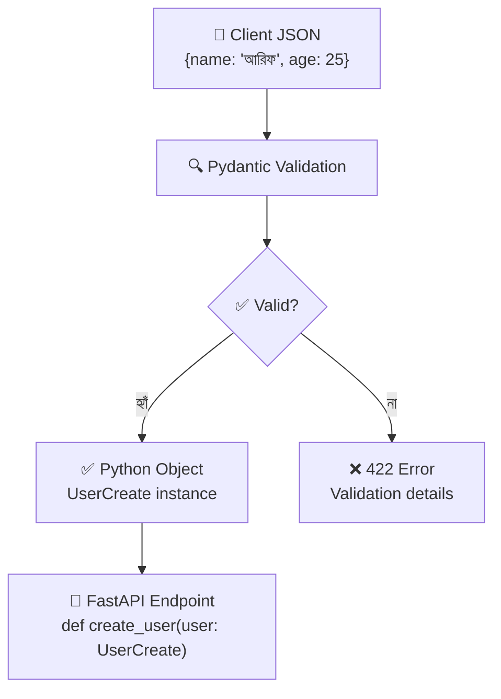

# Pydantic Models 📦

## Pydantic কী? (What)

**Pydantic** হলো Python-এর একটি data validation ও parsing library। এটি Python type hints ব্যবহার করে runtime-এ data validate করে এবং error message তৈরি করে।

FastAPI-তে Pydantic তিনটি কাজ করে:
1. **Request body** validate করে (POST/PUT-এ আসা JSON data)
2. **Response** serialize করে (Python object → JSON)
3. **Settings** manage করে (environment variables)

> Pydantic v2 (২০২৩ সালে release) **Rust**-এ লেখা `pydantic-core` ব্যবহার করে — তাই v1 এর চেয়ে ৫-৫০গুণ দ্রুত।

---

## কেন Pydantic? (Why)

Pydantic ছাড়া data validation manually করতে হতো:

```python
# ❌ Pydantic ছাড়া — এভাবে করতে হতো
@app.post("/users/")
async def create_user(request: Request):
    data = await request.json()

    # প্রতিটি field manually check করো
    if "name" not in data:
        return {"error": "name field দরকার"}
    if not isinstance(data["name"], str):
        return {"error": "name হতে হবে string"}
    if len(data["name"]) < 2:
        return {"error": "name কমপক্ষে 2 অক্ষর হতে হবে"}
    if "age" not in data:
        return {"error": "age field দরকার"}
    # ... আরো ১০০ লাইন validation code
```

```python
# ✅ Pydantic দিয়ে — মাত্র কয়েক লাইনে সব validation
class UserCreate(BaseModel):
    name: str = Field(min_length=2)
    age: int = Field(ge=0, le=150)

@app.post("/users/")
def create_user(user: UserCreate):
    # data স্বয়ংক্রিয়ভাবে validated!
    return user
```

---

## Pydantic কীভাবে কাজ করে



---

## BaseModel — মূল ধারণা

```python
# models.py
from pydantic import BaseModel

# BaseModel থেকে inherit করে model তৈরি করো
class Student(BaseModel):
    name: str       # required — না দিলে error
    age: int        # required — string দিলে int-এ convert করার চেষ্টা করবে
    gpa: float      # required
    is_active: bool # required

# ব্যবহার
student = Student(name="আরিফ", age=22, gpa=3.8, is_active=True)
print(student.name)     # আরিফ
print(student.age)      # 22
print(student.model_dump())  # {'name': 'আরিফ', 'age': 22, 'gpa': 3.8, 'is_active': True}
```

---

## সব Field Types

```python
from pydantic import BaseModel
from typing import List, Dict, Tuple, Set, Optional, Any, Union
from datetime import datetime, date
from uuid import UUID

class AllTypesExample(BaseModel):
    # ===== Basic Types =====
    name: str               # স্ট্রিং
    age: int                # পূর্ণসংখ্যা
    salary: float           # দশমিক
    is_employed: bool       # True/False

    # ===== Collection Types =====
    skills: List[str]               # ["Python", "FastAPI"]
    scores: List[int]               # [95, 87, 92]
    profile: Dict[str, str]         # {"city": "Dhaka"}
    coordinates: Tuple[float, float] # (23.8, 90.4) — fixed length
    tags: Set[str]                  # unique values only {"python", "web"}

    # ===== Nested Types =====
    nested_list: List[List[int]]    # [[1,2], [3,4]]
    nested_dict: Dict[str, List[str]]  # {"python": ["fastapi", "django"]}

    # ===== Special Types =====
    created_at: datetime    # "2024-01-15T10:30:00"
    birth_date: date        # "2000-05-20"
    user_id: UUID           # "123e4567-e89b-12d3-a456-426614174000"
    anything: Any           # যেকোনো type

    # ===== Union — একাধিক type =====
    id_or_name: Union[int, str]   # 42 অথবা "user42" দুটোই চলবে
```

---

## Optional Fields এবং Default Values

```python
from pydantic import BaseModel
from typing import Optional
from datetime import datetime

class UserProfile(BaseModel):
    # ===== Required fields (অবশ্যই দিতে হবে) =====
    username: str      # None দিলে error
    email: str         # None দিলে error

    # ===== Optional — None হতে পারে =====
    bio: Optional[str] = None          # না দিলে None
    avatar_url: Optional[str] = None   # না দিলে None
    phone: Optional[str] = None        # না দিলে None

    # ===== Default values =====
    role: str = "user"          # না দিলে "user"
    is_verified: bool = False   # না দিলে False
    post_count: int = 0         # না দিলে 0
    joined_at: datetime = datetime.now()  # না দিলে এখনকার সময়

# ব্যবহার — শুধু required fields দিয়ে
user1 = UserProfile(username="ashraf", email="ashraf@bd.com")
print(user1.bio)        # None
print(user1.role)       # "user"
print(user1.is_verified)  # False

# সব field দিয়ে
user2 = UserProfile(
    username="nafisa",
    email="nafisa@bd.com",
    bio="Python developer 🐍",
    role="admin",
    is_verified=True
)
```

::: tip `Optional[str]` vs `str = None`
- `Optional[str] = None` → field `None` হতে পারে, default `None`
- `str = "default"` → field required নয়, কিন্তু `None` হতে পারবে না
- `Optional[str]` → field `None` হতে পারে, কিন্তু **দিতে হবে** (default নেই)

সবচেয়ে সাধারণ pattern: `Optional[str] = None`
:::

---

## Field() — বিস্তারিত Validation

`Field()` দিয়ে আরও specific validation করা যায়:

```python
from pydantic import BaseModel, Field
from typing import Optional

class Product(BaseModel):
    # ===== String Validation =====
    name: str = Field(
        min_length=2,           # কমপক্ষে ২ অক্ষর
        max_length=100,         # সর্বোচ্চ ১০০ অক্ষর
        description="পণ্যের নাম",  # Swagger-এ দেখাবে
        examples=["স্মার্টফোন", "ল্যাপটপ"]  # Swagger example
    )

    # ===== Number Validation =====
    price: float = Field(
        gt=0,           # greater than 0 (0 চলবে না)
        lt=10_000_000,  # less than 1 crore
        description="দাম (টাকায়)"
    )

    discount: float = Field(
        ge=0,    # greater than or equal 0 (0 চলবে)
        le=100,  # less than or equal 100
        default=0.0
    )

    quantity: int = Field(
        ge=1,           # কমপক্ষে ১টি
        le=10000,       # সর্বোচ্চ ১০০০০টি
        default=1
    )

    # ===== Pattern (Regex) Validation =====
    sku: str = Field(
        pattern=r"^[A-Z]{3}-\d{4}$",  # Format: ABC-1234
        description="SKU কোড — Format: ABC-1234",
        examples=["ELC-1234", "CLO-5678"]
    )

    # ===== Required (no default) =====
    category: str = Field(
        ...,    # ... মানে required (Ellipsis)
        description="পণ্যের category"
    )

    # ===== Optional with validation =====
    weight_kg: Optional[float] = Field(
        default=None,
        gt=0,
        le=1000,
        description="ওজন (কেজিতে)"
    )
```

### Field() validator summary:

| Validator | মানে | ব্যবহার |
|-----------|------|---------|
| `min_length` | ন্যূনতম দৈর্ঘ্য | String |
| `max_length` | সর্বোচ্চ দৈর্ঘ্য | String |
| `pattern` | Regex pattern | String |
| `gt` | greater than (>) | Number |
| `ge` | greater than or equal (≥) | Number |
| `lt` | less than (<) | Number |
| `le` | less than or equal (≤) | Number |
| `multiple_of` | এর গুণিতক হতে হবে | Number |
| `min_items` | ন্যূনতম items | List |
| `max_items` | সর্বোচ্চ items | List |

---

## Nested Models — Model-এর মধ্যে Model

```python
from pydantic import BaseModel, Field
from typing import List, Optional

# ছোট model — Address
class Address(BaseModel):
    street: str          # রাস্তার নাম
    city: str            # শহর
    district: str        # জেলা
    postal_code: str     # পোস্টাল কোড
    country: str = "বাংলাদেশ"  # Default দেশ

# আরেকটি ছোট model — Contact
class ContactPerson(BaseModel):
    name: str
    phone: str
    relation: str        # সম্পর্ক (ভাই, বোন, বাবা ইত্যাদি)

# মূল Customer model — nested models ব্যবহার করে
class Customer(BaseModel):
    id: Optional[int] = None
    name: str = Field(min_length=2, max_length=100)
    email: str

    # ===== Nested single model =====
    address: Address             # একটি ঠিকানা — অবশ্যই দিতে হবে

    # ===== Nested model list =====
    emergency_contacts: List[ContactPerson] = []  # একাধিক পরিচিতি

    # ===== Optional nested model =====
    billing_address: Optional[Address] = None  # ভিন্ন billing address থাকলে

# ব্যবহার
customer = Customer(
    name="আরিফ হোসেন",
    email="arif@example.com",
    address=Address(
        street="মিরপুর-১২, ব্লক-ই, রোড-৫",
        city="ঢাকা",
        district="ঢাকা",
        postal_code="1216"
    ),
    emergency_contacts=[
        ContactPerson(name="করিম উদ্দিন", phone="01711111111", relation="বাবা"),
        ContactPerson(name="রহিমা বেগম", phone="01722222222", relation="মা"),
    ]
)

# JSON-এ convert
print(customer.model_dump_json(indent=2))
```

### FastAPI-তে Nested Model Request:

```json
POST /customers/
{
    "name": "আরিফ হোসেন",
    "email": "arif@example.com",
    "address": {
        "street": "মিরপুর-১২",
        "city": "ঢাকা",
        "district": "ঢাকা",
        "postal_code": "1216"
    },
    "emergency_contacts": [
        {"name": "করিম", "phone": "017XXXXXXXX", "relation": "বাবা"}
    ]
}
```

---

## Model Inheritance — Model থেকে Model

```python
from pydantic import BaseModel
from typing import Optional
from datetime import datetime

# ===== Base Model — Common fields =====
class BaseEntity(BaseModel):
    """সব model-এর common fields"""
    id: Optional[int] = None
    created_at: Optional[datetime] = None
    updated_at: Optional[datetime] = None

# ===== User Create — password সহ =====
class UserCreate(BaseModel):
    """নতুন user তৈরির জন্য — password লাগবে"""
    username: str
    email: str
    password: str           # Raw password (hash করে DB-তে রাখবো)
    full_name: Optional[str] = None

# ===== User Response — password ছাড়া =====
class UserResponse(BaseEntity):
    """Client-কে পাঠানোর জন্য — password নেই"""
    username: str
    email: str
    full_name: Optional[str] = None
    is_active: bool = True

    class Config:
        from_attributes = True  # SQLAlchemy ORM object → Pydantic convert করতে

# ===== User Update — সব field Optional =====
class UserUpdate(BaseModel):
    """আংশিক update-এর জন্য — সব field Optional"""
    username: Optional[str] = None
    email: Optional[str] = None
    full_name: Optional[str] = None
    password: Optional[str] = None

# ===== Admin User — extra fields =====
class AdminUser(UserResponse):
    """Admin-দের জন্য — extra fields"""
    role: str = "admin"
    permissions: list[str] = []
    can_delete: bool = True

# FastAPI-তে ব্যবহার
from fastapi import FastAPI
app = FastAPI()

@app.post("/users/", response_model=UserResponse, status_code=201)
def create_user(user: UserCreate):
    """
    Request: UserCreate (password সহ)
    Response: UserResponse (password ছাড়া) ← response_model এটি নিশ্চিত করে
    """
    # DB-তে save করার simulation
    return UserResponse(
        id=1,
        username=user.username,
        email=user.email,
        full_name=user.full_name
    )
```

---

## Model Methods — কাজের tools

```python
from pydantic import BaseModel
from typing import Optional

class Item(BaseModel):
    name: str
    price: float
    description: Optional[str] = None
    tax: float = 0.0

item = Item(name="পেন্সিল", price=5.0)

# ===== model_dump() — dict-এ convert =====
print(item.model_dump())
# {'name': 'পেন্সিল', 'price': 5.0, 'description': None, 'tax': 0.0}

# None values বাদ দাও
print(item.model_dump(exclude_none=True))
# {'name': 'পেন্সিল', 'price': 5.0, 'tax': 0.0}

# নির্দিষ্ট field বাদ দাও
print(item.model_dump(exclude={"tax"}))
# {'name': 'পেন্সিল', 'price': 5.0, 'description': None}

# শুধু নির্দিষ্ট field রাখো
print(item.model_dump(include={"name", "price"}))
# {'name': 'পেন্সিল', 'price': 5.0}

# ===== model_dump_json() — JSON string-এ convert =====
print(item.model_dump_json())
# '{"name":"পেন্সিল","price":5.0,"description":null,"tax":0.0}'

print(item.model_dump_json(indent=2))
# সুন্দরভাবে formatted JSON

# ===== model_copy() — copy তৈরি =====
item2 = item.model_copy(update={"price": 10.0})  # price বদলে copy
print(item2.price)   # 10.0
print(item.price)    # 5.0 — original অপরিবর্তিত

# ===== model_validate() — dict থেকে model তৈরি =====
data = {"name": "খাতা", "price": 20.0}
item3 = Item.model_validate(data)
print(item3.name)   # খাতা
```

---

## Common Mistakes ⚠️

::: danger ভুল ১: Type mismatch বুঝতে না পারা
```python
class User(BaseModel):
    age: int

# ❌ এটি কাজ করবে? না করবে?
user = User(age="25")    # "25" string, কিন্তু int চাই
```
**উত্তর:** Pydantic "25" কে `int` 25-এ **convert** করবে। কিন্তু:
```python
user = User(age="abc")   # ❌ Error — "abc" কে int-এ convert করা যাবে না
```
:::

::: danger ভুল ২: `model_dump()` না জেনে dict-এ convert করা
```python
class Item(BaseModel):
    name: str
    price: float

item = Item(name="test", price=10.0)

# ❌ ভুল পদ্ধতি
item_dict = dict(item)      # পুরনো পদ্ধতি, deprecated
item_dict = item.__dict__   # internal, reliable না

# ✅ সঠিক পদ্ধতি
item_dict = item.model_dump()   # Pydantic v2 এর সঠিক পদ্ধতি
```
:::

::: warning ভুল ৩: `Optional` মানে মনে করা "না দিলেও চলবে"
```python
from typing import Optional

class User(BaseModel):
    phone: Optional[str]   # ❌ এটি required! None দিতে হবে কিন্তু বাদ দেওয়া যাবে না

# সঠিকভাবে optional করতে হলে:
class User(BaseModel):
    phone: Optional[str] = None   # ✅ এখন বাদ দেওয়া যাবে
```
:::

::: warning ভুল ৪: response_model না দেওয়া
```python
class UserInDB(BaseModel):
    username: str
    hashed_password: str   # গোপন তথ্য!

# ❌ ভুল — password response-এ চলে যাবে
@app.get("/users/me")
def get_me() -> UserInDB:
    return UserInDB(username="ashraf", hashed_password="$2b$secret")

# ✅ সঠিক — response_model দাও
class UserPublic(BaseModel):
    username: str

@app.get("/users/me", response_model=UserPublic)
def get_me():
    db_user = UserInDB(username="ashraf", hashed_password="$2b$secret")
    return db_user   # FastAPI শুধু UserPublic fields পাঠাবে
```
:::

---

## Best Practices ✨

- **Create / Response / Update আলাদা model রাখো** — `UserCreate`, `UserResponse`, `UserUpdate` pattern অনুসরণ করো
- **`response_model` সবসময় দাও** — sensitive data (password, tokens) কখনো expose না হওয়া নিশ্চিত হয়
- **Field description ও examples দাও** — Swagger UI আরও কার্যকর হয়
- **Nested model ব্যবহার করো** — complex data structure-কে manageable রাখো
- **`Optional[X] = None` pattern মানো** — `Optional[X]` alone না লিখে default দাও
- **`Config.from_attributes = True` দাও** — SQLAlchemy ORM object থেকে সহজে convert হবে
- **`model_dump(exclude_none=True)`** — PATCH operation-এ None field বাদ দিতে

---

## Interview Questions 🎯

**প্রশ্ন ১: Pydantic-এ `Optional[str]` এবং `Optional[str] = None` এর পার্থক্য কী?**

> **উত্তর:** `Optional[str]` মানে field-টি `str` অথবা `None` হতে পারে, কিন্তু **অবশ্যই** দিতে হবে। `Optional[str] = None` মানে দিতে না হলেও চলবে, default হবে `None`। FastAPI/Pydantic-এ প্রায় সবসময় `Optional[str] = None` pattern ব্যবহার করা উচিত।

**প্রশ্ন ২: `model_dump()` এ `exclude_none=True` কেন ব্যবহার করা হয়?**

> **উত্তর:** PATCH operation-এ user শুধু পরিবর্তিত field পাঠায়, বাকি field `None` থাকে। `model_dump(exclude_none=True)` দিয়ে `None` field গুলো বাদ দিলে শুধু পরিবর্তিত field দিয়ে database update করা যায়। না করলে `None` দিয়ে existing data overwrite হয়ে যাবে।

**প্রশ্ন ৩: কেন Create, Response, Update-এর জন্য আলাদা Pydantic model রাখা উচিত?**

> **উত্তর:** `UserCreate`-এ password থাকে (DB-তে save করতে হবে), `UserResponse`-এ password থাকবে না (client-এ পাঠানো যাবে না), `UserUpdate`-এ সব field Optional (partial update)। একটি model দিয়ে সব করতে গেলে security leak বা logic error হবে।

**প্রশ্ন ৪: Pydantic v2 কেন v1 এর চেয়ে দ্রুত?**

> **উত্তর:** Pydantic v2 `pydantic-core` ব্যবহার করে যা **Rust**-এ লেখা। Pure Python v1 এর তুলনায় ৫-৫০ গুণ দ্রুত validation করতে পারে। FastAPI 0.100+ থেকে Pydantic v2 default।

---

## Summary 📋

- ✅ `BaseModel` থেকে inherit করে data model তৈরি করো
- ✅ `str`, `int`, `float`, `bool`, `List`, `Dict`, `Optional` — সব type support করে
- ✅ `Optional[X] = None` → field optional করার সঠিক পদ্ধতি
- ✅ `Field(min_length=2, gt=0, pattern=r"...")` → custom validation
- ✅ Nested models → complex structure manageable রাখে
- ✅ `UserCreate` / `UserResponse` / `UserUpdate` — তিনটি আলাদা model pattern
- ✅ `model_dump()` → dict | `model_dump_json()` → JSON string
- ✅ `model_dump(exclude_none=True)` → PATCH-এর জন্য None বাদ দাও
- ✅ `Config.from_attributes = True` → ORM object → Pydantic convert

---

## পরবর্তী ধাপ ➡️

Pydantic Models শেখা হলো। এরপর **Response Handling** শিখবে — `response_model` কিভাবে কাজ করে, JSONResponse, HTMLResponse, RedirectResponse, FileResponse ব্যবহার, HTTP status codes এবং custom response headers পাঠানো।
