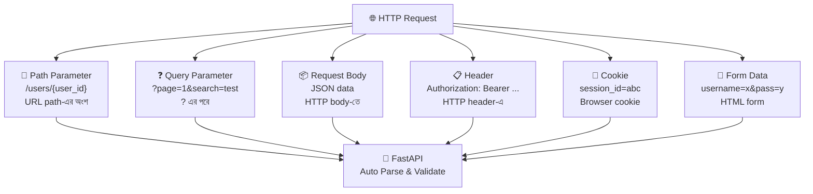

# Request Data 📥

## Request Data কী? (What)

Client যখন API-তে request পাঠায়, সে বিভিন্নভাবে data পাঠাতে পারে:

| Data Source | কোথায় থাকে | উদাহরণ |
|-------------|-----------|---------|
| **Path Parameter** | URL path-এ | `/users/42` → `42` |
| **Query Parameter** | URL `?` এর পরে | `/items/?page=2&limit=10` |
| **Request Body** | HTTP body-তে | `{"name": "আরিফ", "age": 25}` |
| **Header** | HTTP headers-এ | `Authorization: Bearer token123` |
| **Cookie** | Browser cookie-তে | `session_id=abc123` |
| **Form Data** | HTML form-এ | `username=ashraf&password=123` |

FastAPI এই সব ধরনের data **type hints** দিয়েই handle করে — আলাদা parsing code লিখতে হয় না।

---

## কেন সঠিকভাবে Request Data Handle করবো? (Why)

```
❌ ভুলভাবে:
   - URL-এ sensitive data (password) পাঠানো → Server log-এ দেখা যায়
   - Body-তে যা আসা উচিত তা query-তে পাঠানো → API design ভুল
   - Validation না করলে → SQL injection, type error, crash

✅ সঠিকভাবে:
   - সঠিক জায়গায় সঠিক data → Professional API design
   - FastAPI type hints দিয়ে auto-validate → নিরাপদ
   - Swagger UI-তে সঠিক documentation → ব্যবহারকারী বুঝতে পারে
```

---

## Request Data Flow Diagram



---

## ১. Path Parameters — URL-এর অংশ

```python
from fastapi import FastAPI, Path
from enum import Enum
from typing import Optional

app = FastAPI()

# ===== Simple Path Parameter =====
@app.get("/users/{user_id}")
def get_user(user_id: int):
    """
    URL: GET /users/42
    user_id = 42 (str "42" → int 42 auto-convert)
    
    user_id: int → FastAPI নিশ্চিত করে এটি integer
    /users/abc দিলে 422 error আসবে
    """
    return {"user_id": user_id}

# ===== Path Validation দিয়ে =====
@app.get("/products/{product_id}")
def get_product(
    product_id: int = Path(
        ge=1,                       # 0 বা negative হবে না
        le=99999,                   # 5 digit পর্যন্ত
        description="Product ID",
        examples=[1, 100, 9999]
    )
):
    """Path parameter-এ validation"""
    return {"product_id": product_id}

# ===== Multiple Path Parameters =====
@app.get("/departments/{dept_id}/employees/{emp_id}")
def get_employee(dept_id: int, emp_id: int):
    """
    URL: GET /departments/5/employees/12
    dept_id = 5, emp_id = 12
    """
    return {"department": dept_id, "employee": emp_id}

# ===== Enum দিয়ে Valid Values নিশ্চিত করা =====
class Season(str, Enum):
    summer = "summer"       # গ্রীষ্ম
    rainy = "rainy"         # বর্ষা
    winter = "winter"       # শীত

@app.get("/weather/{season}")
def get_weather(season: Season):
    """
    URL: GET /weather/summer ✅
    URL: GET /weather/spring ❌ (404 — valid না)
    
    Enum দিলে শুধু defined values accept হবে
    """
    messages = {
        Season.summer: "গরমের মৌসুম — ৩৫°C+",
        Season.rainy: "বর্ষাকাল — বৃষ্টির দিন",
        Season.winter: "শীতকাল — ১০-১৫°C"
    }
    return {"season": season, "description": messages[season]}

# ===== File Path Parameter =====
@app.get("/files/{file_path:path}")
def get_file(file_path: str):
    """
    URL: GET /files/documents/2024/report.pdf
    file_path = "documents/2024/report.pdf"
    
    :path → slash সহ পুরো path accept করে
    """
    return {"file_path": file_path}
```

---

## ২. Query Parameters — URL-এর ? এর পরে

```python
from fastapi import FastAPI, Query
from typing import Optional, List

app = FastAPI()

# ===== Simple Query Parameters =====
@app.get("/items/")
def list_items(
    # Required query parameter (default নেই)
    category: str,
    # Optional — default আছে
    page: int = 1,
    limit: int = 10,
    # Optional — None হতে পারে
    search: Optional[str] = None,
    # Boolean
    in_stock: bool = True
):
    """
    GET /items/?category=electronics&page=2&limit=5&search=phone&in_stock=true
    
    category  → required (না দিলে 422 error)
    page      → optional (default=1)
    search    → optional (default=None)
    in_stock  → optional (default=True)
    """
    return {
        "category": category,
        "page": page,
        "limit": limit,
        "search": search,
        "in_stock": in_stock
    }

# ===== Query Validation দিয়ে =====
@app.get("/search/")
def search_items(
    q: str = Query(
        min_length=2,           # কমপক্ষে ২ অক্ষর
        max_length=50,          # সর্বোচ্চ ৫০ অক্ষর
        description="Search term",
        examples=["laptop", "phone"]
    ),
    page: int = Query(default=1, ge=1, description="Page number"),
    per_page: int = Query(default=10, ge=1, le=100, description="Items per page"),
    sort_by: str = Query(
        default="created_at",
        pattern="^(created_at|price|name)$",  # শুধু এই তিনটি valid
        description="Sort field"
    ),
    order: str = Query(
        default="desc",
        pattern="^(asc|desc)$"
    )
):
    """
    GET /search/?q=phone&page=1&per_page=20&sort_by=price&order=asc
    """
    skip = (page - 1) * per_page
    return {
        "query": q,
        "page": page,
        "per_page": per_page,
        "skip": skip,
        "sort_by": sort_by,
        "order": order
    }

# ===== List Query Parameter =====
@app.get("/filter/")
def filter_by_tags(
    tags: List[str] = Query(default=[])
):
    """
    GET /filter/?tags=python&tags=fastapi&tags=web
    tags = ["python", "fastapi", "web"]
    
    একই parameter একাধিকবার দিলে list হয়
    """
    return {"selected_tags": tags, "count": len(tags)}

# ===== Optional আর Deprecated query param =====
@app.get("/articles/")
def list_articles(
    page: int = 1,
    limit: int = 10,
    # Deprecated parameter — পুরনো, ব্যবহার না করতে বলা হচ্ছে
    offset: Optional[int] = Query(
        default=None,
        deprecated=True,          # Swagger-এ strikethrough দেখাবে
        description="⚠️ Deprecated: page ব্যবহার করো"
    )
):
    return {"page": page, "limit": limit}
```

---

## ৩. Request Body — JSON Data

```python
from pydantic import BaseModel, Field
from typing import Optional

class CreateOrderRequest(BaseModel):
    """POST /orders/ এর জন্য request body"""
    product_id: int = Field(ge=1)
    quantity: int = Field(ge=1, le=100)
    shipping_address: str = Field(min_length=10)
    notes: Optional[str] = Field(default=None, max_length=500)
    priority: str = Field(
        default="normal",
        pattern="^(normal|express|overnight)$"
    )

@app.post("/orders/", status_code=201)
def create_order(order: CreateOrderRequest):
    """
    POST /orders/
    Content-Type: application/json
    
    Body (JSON):
    {
        "product_id": 42,
        "quantity": 3,
        "shipping_address": "ঢাকা, মিরপুর-১২",
        "notes": "সাবধানে পাঠাবেন",
        "priority": "express"
    }
    """
    return {
        "message": "Order তৈরি হয়েছে ✅",
        "order_id": 1001,
        "details": order.model_dump()
    }
```

---

## ৪. Path + Query + Body একসাথে

```python
from pydantic import BaseModel
from typing import Optional

class UpdateProductRequest(BaseModel):
    name: Optional[str] = None
    price: Optional[float] = None
    description: Optional[str] = None

@app.put("/products/{product_id}")
def update_product(
    # Path parameter — URL থেকে আসে
    product_id: int,

    # Query parameters — ? এর পরে আসে
    notify_seller: bool = False,
    reason: Optional[str] = None,

    # Request body — JSON body থেকে আসে
    update_data: UpdateProductRequest = None
):
    """
    PUT /products/42?notify_seller=true&reason=price_correction
    
    Body:
    {"name": "নতুন নাম", "price": 1500.0}
    
    FastAPI স্বয়ংক্রিয়ভাবে:
    - product_id → path থেকে
    - notify_seller, reason → query থেকে
    - update_data → body থেকে
    """
    return {
        "product_id": product_id,          # path থেকে
        "notify_seller": notify_seller,    # query থেকে
        "reason": reason,                  # query থেকে
        "changes": update_data.model_dump(exclude_none=True) if update_data else {}
    }
```

::: tip FastAPI কীভাবে বোঝে কোথা থেকে আসছে?
FastAPI নিজেই বুঝতে পারে:
- `int`, `str` এবং URL-এ `{param}` আছে → **Path parameter**
- `int`, `str` এবং URL-এ নেই → **Query parameter**
- Pydantic `BaseModel` → **Request Body**
- `Header()`, `Cookie()`, `Form()` explicitly দেওয়া → সেই type
:::

---

## ৫. Header Parameters

```python
from fastapi import Header
from typing import Optional

@app.get("/profile/")
def get_profile(
    # Header name-এ underscore দিলে FastAPI hyphen-এও match করে
    # x_api_key → X-API-Key header
    authorization: Optional[str] = Header(default=None),
    x_request_id: Optional[str] = Header(default=None),
    user_agent: Optional[str] = Header(default=None),
    accept_language: Optional[str] = Header(default=None)
):
    """
    Request Headers:
    Authorization: Bearer eyJhbGci...
    X-Request-ID: req-123-abc
    User-Agent: Mozilla/5.0
    Accept-Language: bn-BD, bn
    """
    return {
        "has_auth": authorization is not None,
        "request_id": x_request_id,
        "browser": user_agent,
        "language": accept_language
    }

# API Key Header validation
@app.get("/api/data")
def get_api_data(
    x_api_key: str = Header(
        ...,                        # required — না দিলে 422
        alias="X-API-Key",          # exact header name
        description="API Key for authentication"
    )
):
    """
    Header: X-API-Key: your-secret-key
    """
    valid_keys = {"key-bd-001", "key-bd-002"}
    if x_api_key not in valid_keys:
        from fastapi import HTTPException
        raise HTTPException(status_code=403, detail="Invalid API Key")
    return {"message": "API Key valid ✅", "data": "secret data"}
```

---

## ৬. Cookie Parameters

```python
from fastapi import Cookie
from typing import Optional

@app.get("/me/")
def get_current_session(
    session_id: Optional[str] = Cookie(default=None),
    user_preferences: Optional[str] = Cookie(default=None),
    theme: Optional[str] = Cookie(default="light")
):
    """
    Browser Cookies:
    session_id=abc123
    user_preferences={"lang":"bn","timezone":"Asia/Dhaka"}
    theme=dark
    """
    if not session_id:
        return {"logged_in": False, "message": "Login করো প্রথমে"}

    return {
        "logged_in": True,
        "session_id": session_id[:8] + "...",  # security: পুরো দেখাবো না
        "theme": theme
    }

# Cookie set করা
from fastapi.responses import JSONResponse

@app.post("/login/")
def login(username: str, password: str):
    """Login করে cookie set করো"""
    # Validation (simplified)
    if username == "ashraf" and password == "secret":
        response = JSONResponse(content={"message": "Login সফল ✅"})

        # Secure cookie set করো
        response.set_cookie(
            key="session_id",
            value="unique-session-abc123",
            max_age=3600,           # ১ ঘণ্টা
            httponly=True,          # JavaScript access করতে পারবে না (XSS protection)
            secure=True,            # শুধু HTTPS-এ যাবে
            samesite="lax"          # CSRF protection
        )
        return response
    return JSONResponse(
        content={"error": "ভুল username/password"},
        status_code=401
    )
```

---

## ৭. Form Data

```python
from fastapi import Form, File, UploadFile
from typing import List

# Form Data receive করতে এই package লাগবে:
# pip install python-multipart

@app.post("/login-form/")
def login_with_form(
    username: str = Form(...),          # required form field
    password: str = Form(...),          # required form field
    remember_me: bool = Form(False)     # optional, default False
):
    """
    Content-Type: application/x-www-form-urlencoded
    
    Form Fields:
    username=ashraf
    password=secret123
    remember_me=true
    """
    # HTML form থেকে data
    if username == "ashraf" and password == "secret123":
        return {
            "message": "Login সফল ✅",
            "username": username,
            "remember_me": remember_me
        }
    return {"error": "ভুল credentials"}

# File Upload
@app.post("/upload/profile-picture/")
async def upload_profile_pic(
    file: UploadFile = File(...),
    username: str = Form(...)
):
    """
    Content-Type: multipart/form-data
    
    file: image file
    username: text field
    """
    # File validation
    allowed_types = {"image/jpeg", "image/png", "image/webp"}
    if file.content_type not in allowed_types:
        from fastapi import HTTPException
        raise HTTPException(
            status_code=400,
            detail="শুধু JPEG, PNG, WebP ছবি upload করা যাবে"
        )

    # File size check (max 5MB)
    content = await file.read()
    if len(content) > 5 * 1024 * 1024:
        raise HTTPException(status_code=400, detail="ছবি ৫MB-এর বেশি হতে পারবে না")

    # Save করো
    save_path = f"uploads/{username}_{file.filename}"
    with open(save_path, "wb") as f:
        f.write(content)

    return {
        "message": "Profile picture upload হয়েছে ✅",
        "filename": file.filename,
        "size_kb": len(content) / 1024,
        "content_type": file.content_type,
        "saved_as": save_path
    }

# Multiple Files Upload
@app.post("/upload/documents/")
async def upload_multiple_docs(
    files: List[UploadFile] = File(...),
    category: str = Form(default="general")
):
    """একসাথে একাধিক ফাইল upload"""
    results = []
    for file in files:
        content = await file.read()
        results.append({
            "filename": file.filename,
            "size_kb": round(len(content) / 1024, 2),
            "type": file.content_type
        })

    return {
        "uploaded": len(results),
        "category": category,
        "files": results
    }
```

---

## Complete Example — সব একসাথে

```python
from fastapi import FastAPI, Path, Query, Header, Cookie, Form, File, UploadFile
from pydantic import BaseModel, Field
from typing import Optional

app = FastAPI()

class ProductFilter(BaseModel):
    min_price: Optional[float] = None
    max_price: Optional[float] = None

@app.post("/shops/{shop_id}/products/search/")
async def search_shop_products(
    # Path parameter
    shop_id: int = Path(ge=1, description="Shop ID"),

    # Query parameters
    page: int = Query(default=1, ge=1),
    limit: int = Query(default=10, ge=1, le=50),
    in_stock: bool = Query(default=True),

    # Request body
    filters: Optional[ProductFilter] = None,

    # Header
    x_api_key: Optional[str] = Header(default=None, alias="X-API-Key"),

    # Cookie
    user_session: Optional[str] = Cookie(default=None)
):
    """
    সব ধরনের data একই endpoint-এ — Real-world complex example
    """
    return {
        "shop_id": shop_id,
        "pagination": {"page": page, "limit": limit},
        "filters": filters.model_dump() if filters else {},
        "in_stock": in_stock,
        "authenticated": x_api_key is not None,
        "has_session": user_session is not None
    }
```

---

## Common Mistakes ⚠️

::: danger ভুল ১: URL-এ sensitive data পাঠানো
```python
# ❌ ভুল — password URL-এ দেখা যাচ্ছে
# GET /login?username=ashraf&password=secret123
@app.get("/login")
def login(username: str, password: str):
    ...
# Server log, browser history, proxy-তে দেখা যাবে!

# ✅ সঠিক — POST + Form Data বা Body ব্যবহার করো
@app.post("/login")
def login(username: str = Form(...), password: str = Form(...)):
    ...
```
:::

::: danger ভুল ২: `python-multipart` না থাকলে Form চলবে না
```bash
# ❌ Form upload করতে গেলে এই error আসবে:
# "Form data requires python-multipart to be installed"

# ✅ আগে install করো
pip install python-multipart
```
:::

::: warning ভুল ৩: Header underscore/hyphen confusion
```python
# ❌ Header নাম ভুল বুঝে
# Header: X-API-Key
@app.get("/data")
def get_data(x_api_key: str = Header(...)):
    # FastAPI underscore → hyphen convert করে, কাজ করবে ✅
    # কিন্তু exact match চাইলে alias ব্যবহার করো

# ✅ explicit alias দাও
@app.get("/data")
def get_data(api_key: str = Header(..., alias="X-API-Key")):
    ...
```
:::

::: warning ভুল ৪: বড় ফাইল পুরো memory-তে read করা
```python
# ❌ ভুল — পুরো ফাইল memory-তে
content = await file.read()   # 1GB ফাইল হলে 1GB memory নেবে

# ✅ সঠিক — chunk করে পড়ো
with open(save_path, "wb") as f:
    while chunk := await file.read(1024 * 1024):  # ১MB chunk
        f.write(chunk)
```
:::

---

## Best Practices ✨

- **Sensitive data (password, token) কখনো query parameter-এ দিবে না** — URL log হয়
- **File upload-এ সবসময় type ও size validation করো** — malicious file থেকে রক্ষা
- **`python-multipart` install করো** — form/file upload-এর আগে
- **Path parameter-এ `Path()` দিয়ে validation করো** — `ge=1` দিলে negative ID আসবে না
- **Query parameter-এ `Query()` দিয়ে validation করো** — pagination সীমা নির্ধারণ করো
- **Header-এ `alias` দাও** — exact header name-এর জন্য (X-API-Key)
- **Cookie-এ `httponly=True, secure=True`** — XSS ও HTTPS enforce করো

---

## Interview Questions 🎯

**প্রশ্ন ১: FastAPI কিভাবে বুঝতে পারে parameter path থেকে আসছে নাকি query থেকে?**

> **উত্তর:** FastAPI check করে URL template-এ `{param_name}` আছে কিনা। থাকলে → path parameter। না থাকলে এবং Pydantic model না হলে → query parameter। Pydantic BaseModel হলে → request body। `Header()`, `Cookie()`, `Form()` explicitly দিলে সেই type।

**প্রশ্ন ২: Form data এবং JSON body-এর পার্থক্য কী?**

> **উত্তর:** Form data `Content-Type: application/x-www-form-urlencoded` বা `multipart/form-data` ব্যবহার করে — HTML form সাধারণত এভাবে পাঠায়। JSON body `Content-Type: application/json` ব্যবহার করে — JavaScript/mobile app এভাবে পাঠায়। একই endpoint-এ Form এবং JSON body দুটো একসাথে থাকতে পারে না।

**প্রশ্ন ৩: `List[str] = Query(default=[])` দিয়ে কিভাবে একাধিক value পাঠানো যায়?**

> **উত্তর:** URL-এ একই parameter একাধিকবার দিতে হয়: `?tags=python&tags=fastapi&tags=web`। FastAPI এগুলো collect করে `["python", "fastapi", "web"]` list বানায়। `Query(default=[])` না দিলে কোনো value না দেওয়ায় error আসবে।

**প্রশ্ন ৪: Cookie-এ `httponly=True` কেন দেওয়া উচিত?**

> **উত্তর:** `httponly=True` দিলে JavaScript `document.cookie` দিয়ে cookie পড়তে পারে না। এটি **XSS (Cross-Site Scripting)** attack থেকে রক্ষা করে। কোনো malicious script inject হলেও session cookie steal করতে পারবে না। Session cookie সবসময় `httponly=True, secure=True` দিয়ে set করা উচিত।

---

## Summary 📋

- ✅ **Path parameter** → URL-এ `{id}` → `def func(id: int)` — type validate হয়
- ✅ **Query parameter** → `?page=1&limit=10` → function default argument হিসেবে
- ✅ **Request Body** → Pydantic `BaseModel` → JSON auto-parse হয়
- ✅ **Path + Query + Body** → একই endpoint-এ mix করা যায়, FastAPI নিজেই বোঝে
- ✅ **Header** → `Header()` দিয়ে — underscore → hyphen convert হয়
- ✅ **Cookie** → `Cookie()` দিয়ে — set করতে `response.set_cookie()`
- ✅ **Form Data** → `Form()` দিয়ে — `pip install python-multipart` দরকার
- ✅ **File Upload** → `UploadFile` দিয়ে — type, size validation করো
- ✅ Sensitive data (password) কখনো query parameter-এ না — Form/Body ব্যবহার করো

---

## পরবর্তী ধাপ ➡️

Request Data শেখা হলো। এখন Level 2 — Intermediate শুরু হবে। **Path Configuration** শিখবে — endpoint-এ summary, description, operation_id, tags, deprecated, include_in_schema কিভাবে ব্যবহার করতে হয় এবং Swagger UI-কে কিভাবে সমৃদ্ধ করতে হয়।
