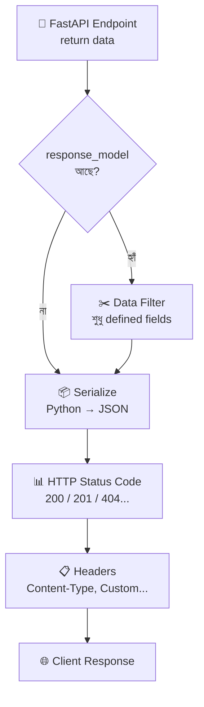
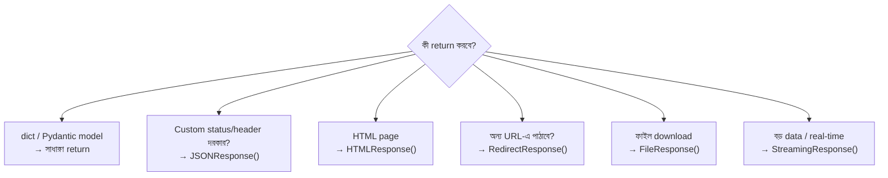

# Response Handling 📤

## Response Handling কী? (What)

FastAPI-তে **Response Handling** মানে হলো — client-কে কী ধরনের data, কোন format-এ, কোন HTTP status code সহ পাঠাবো তা নিয়ন্ত্রণ করা।

শুধু `return {"data": "something"}` লিখলেই FastAPI JSON response পাঠায়। কিন্তু real-world app-এ দরকার হয়:
- নির্দিষ্ট HTTP status code (200, 201, 404...)
- Custom headers (Cache-Control, X-Custom-Header)
- HTML page, PDF ফাইল, বা image
- Redirect অন্য URL-এ
- Streaming data (বড় ফাইল)

---

## কেন সঠিক Response দরকার? (Why)

```
❌ ভুল response → Client confused হয়
   - User তৈরি হলো, কিন্তু 200 দিলে (201 দেওয়া উচিত)
   - Password response-এ গেলো (response_model ব্যবহার করোনি)
   - Error হলো, কিন্তু 200 দিলে (client মনে করবে সফল)

✅ সঠিক response → API professional হয়
   - সঠিক status code → client সঠিক সিদ্ধান্ত নিতে পারে
   - response_model → sensitive data লুকানো
   - Proper headers → caching, CORS, security
```

---

## Response Flow Diagram



---

## response_model — সবচেয়ে গুরুত্বপূর্ণ feature

```python
from fastapi import FastAPI
from pydantic import BaseModel
from typing import List, Optional

app = FastAPI()

# DB model — sensitive data আছে
class UserInDB(BaseModel):
    id: int
    username: str
    email: str
    hashed_password: str    # ⚠️ গোপন — client-কে দেওয়া যাবে না
    is_admin: bool

# Public response model — password নেই
class UserPublic(BaseModel):
    id: int
    username: str
    email: str

# Fake DB
fake_users = [
    UserInDB(id=1, username="ashraf", email="a@bd.com",
             hashed_password="$2b$secret_hash", is_admin=True),
    UserInDB(id=2, username="nafisa", email="n@bd.com",
             hashed_password="$2b$another_hash", is_admin=False),
]

# ✅ response_model=UserPublic → password কখনো যাবে না
@app.get("/users/{user_id}", response_model=UserPublic)
def get_user(user_id: int):
    """response_model নিশ্চিত করে শুধু id, username, email যাবে"""
    user = fake_users[user_id - 1]
    return user    # UserInDB return করলেও, response হবে UserPublic format-এ

# List response
@app.get("/users/", response_model=List[UserPublic])
def list_users():
    """List[UserPublic] → প্রতিটি user-এ password নেই"""
    return fake_users
```

### response_model_exclude_unset — শুধু set করা fields

```python
class ItemResponse(BaseModel):
    name: str
    description: Optional[str] = None
    price: Optional[float] = None
    tax: Optional[float] = None

@app.get(
    "/items/{item_id}",
    response_model=ItemResponse,
    response_model_exclude_unset=True   # ← এটি যোগ করো
)
def get_item(item_id: int):
    # শুধু name set করা আছে
    item = ItemResponse(name="পেন্সিল")

    # response_model_exclude_unset=True হলে:
    # ✅ {"name": "পেন্সিল"}
    # description, price, tax — null/None হলেও response-এ আসবে না

    # response_model_exclude_unset=False (default) হলে:
    # {"name": "পেন্সিল", "description": null, "price": null, "tax": null}

    return item

# আরো options
@app.get("/items/full/{item_id}", response_model=ItemResponse,
         response_model_exclude_none=True,    # None values বাদ
         response_model_exclude={"tax"})      # specific field বাদ
def get_item_full(item_id: int):
    return ItemResponse(name="খাতা", price=25.0)
```

---

## HTTP Status Codes

```python
from fastapi import FastAPI, status
from pydantic import BaseModel

app = FastAPI()

class Item(BaseModel):
    name: str
    price: float

# 201 Created — নতুন resource তৈরি
@app.post("/items/", status_code=status.HTTP_201_CREATED)
def create_item(item: Item):
    return {"message": "তৈরি হয়েছে", "item": item}

# 202 Accepted — background-এ process হবে
@app.post("/reports/generate/", status_code=status.HTTP_202_ACCEPTED)
def generate_report():
    return {"message": "Report তৈরি হচ্ছে, সময় লাগবে..."}

# 204 No Content — মুছে ফেলার পর কিছু return নেই
@app.delete("/items/{item_id}", status_code=status.HTTP_204_NO_CONTENT)
def delete_item(item_id: int):
    # কিছু return করো না — 204 মানেই "No Content"
    pass
```

### গুরুত্বপূর্ণ Status Codes Table

| Code | নাম | কখন ব্যবহার করবে |
|------|-----|-----------------|
| **200** | OK | সফল GET, PUT, PATCH |
| **201** | Created | POST — নতুন resource তৈরি |
| **202** | Accepted | Background task শুরু হয়েছে |
| **204** | No Content | DELETE সফল, body নেই |
| **301** | Moved Permanently | Permanent redirect |
| **302** | Found | Temporary redirect |
| **304** | Not Modified | Cache valid — নতুন data নেই |
| **400** | Bad Request | ভুল request data |
| **401** | Unauthorized | Login করোনি |
| **403** | Forbidden | Permission নেই |
| **404** | Not Found | Resource পাওয়া যায়নি |
| **409** | Conflict | Duplicate data (email already exists) |
| **422** | Unprocessable Entity | Pydantic validation failed |
| **429** | Too Many Requests | Rate limit পার হয়েছে |
| **500** | Internal Server Error | Server-এ bug |
| **503** | Service Unavailable | Server overloaded / maintenance |

---

## JSONResponse — Custom JSON Response

```python
from fastapi.responses import JSONResponse
from fastapi import FastAPI

app = FastAPI()

@app.get("/custom-response")
def custom_json():
    """Custom status code ও headers সহ JSON"""
    return JSONResponse(
        content={
            "status": "success",
            "message": "ডেটা পাওয়া গেছে",
            "data": {"name": "FastAPI", "version": "0.100+"}
        },
        status_code=200,
        headers={
            "X-Custom-Header": "my-value",
            "X-API-Version": "1.0"
        }
    )

@app.get("/conditional-response")
def conditional(include_debug: bool = False):
    """Condition অনুযায়ী আলাদা response"""
    base_data = {"result": "data", "status": "ok"}

    if include_debug:
        base_data["debug"] = {
            "server": "uvicorn",
            "python": "3.11"
        }
        return JSONResponse(content=base_data, status_code=200)

    return base_data  # সাধারণ dict return করলে FastAPI JSONResponse বানায়
```

---

## HTMLResponse — HTML Page পাঠানো

```python
from fastapi.responses import HTMLResponse

@app.get("/page", response_class=HTMLResponse)
def get_html_page():
    """সুন্দর HTML page return করো"""
    html_content = """
    <!DOCTYPE html>
    <html lang="bn">
    <head>
        <meta charset="UTF-8">
        <meta name="viewport" content="width=device-width, initial-scale=1.0">
        <title>FastAPI থেকে HTML</title>
        <style>
            body {
                font-family: 'Hind Siliguri', Arial, sans-serif;
                background: linear-gradient(135deg, #667eea, #764ba2);
                color: white;
                display: flex;
                justify-content: center;
                align-items: center;
                min-height: 100vh;
                margin: 0;
            }
            .card {
                background: rgba(255,255,255,0.1);
                padding: 2rem;
                border-radius: 1rem;
                text-align: center;
                backdrop-filter: blur(10px);
            }
        </style>
    </head>
    <body>
        <div class="card">
            <h1>🚀 FastAPI থেকে HTML!</h1>
            <p>এটি FastAPI দিয়ে serve করা HTML page।</p>
            <a href="/docs" style="color: #ffd700;">API Docs দেখো →</a>
        </div>
    </body>
    </html>
    """
    return HTMLResponse(content=html_content, status_code=200)
```

---

## RedirectResponse — Redirect করা

```python
from fastapi.responses import RedirectResponse
from fastapi import FastAPI

app = FastAPI()

# Permanent redirect (301) — পুরনো URL → নতুন URL
@app.get("/old-api/users")
def old_users_redirect():
    """পুরনো endpoint নতুনতে redirect"""
    return RedirectResponse(
        url="/api/v2/users",
        status_code=301    # 301 = Permanent
    )

# Temporary redirect (302)
@app.get("/dashboard")
def dashboard():
    """Login না থাকলে login page-এ redirect"""
    is_logged_in = False  # Normally session/token check

    if not is_logged_in:
        return RedirectResponse(url="/login", status_code=302)

    return {"message": "Dashboard content"}

# Login page
@app.get("/login", response_class=HTMLResponse)
def login_page():
    return HTMLResponse("<h1>Login Page</h1>")

# Short URL redirect
url_db = {
    "gh": "https://github.com/ashraf1600",
    "yt": "https://youtube.com/@riponahmed2201"
}

@app.get("/go/{short_code}")
def short_url(short_code: str):
    """Short URL redirect"""
    url = url_db.get(short_code)
    if not url:
        return JSONResponse(
            content={"error": "Short URL পাওয়া যায়নি"},
            status_code=404
        )
    return RedirectResponse(url=url, status_code=302)
```

---

## FileResponse — ফাইল Download

```python
from fastapi.responses import FileResponse
from fastapi import FastAPI, HTTPException
import os

app = FastAPI()

@app.get("/download/report")
def download_pdf_report():
    """PDF report download করো"""
    file_path = "reports/monthly_report.pdf"

    # ফাইল আছে কিনা check করো
    if not os.path.exists(file_path):
        raise HTTPException(status_code=404, detail="Report পাওয়া যায়নি")

    return FileResponse(
        path=file_path,
        filename="monthly_report.pdf",    # Download dialog-এ এই নামে দেখাবে
        media_type="application/pdf"      # MIME type
    )

@app.get("/download/image/{name}")
def download_image(name: str):
    """Image download করো"""
    allowed_extensions = {".jpg", ".jpeg", ".png", ".webp"}
    ext = os.path.splitext(name)[1].lower()

    if ext not in allowed_extensions:
        raise HTTPException(status_code=400, detail="শুধু JPG, PNG, WebP ফাইল চলবে")

    return FileResponse(
        path=f"images/{name}",
        media_type=f"image/{ext.strip('.')}"
    )

@app.get("/download/csv")
def download_csv():
    """CSV data download করো"""
    # Dynamic CSV তৈরি করো
    import csv
    import io

    output = io.StringIO()
    writer = csv.writer(output)
    writer.writerow(["নাম", "বয়স", "শহর"])
    writer.writerow(["আরিফ", "25", "ঢাকা"])
    writer.writerow(["নাফিসা", "23", "চট্টগ্রাম"])

    # File-এ save করো
    with open("temp_export.csv", "w", encoding="utf-8-sig", newline="") as f:
        f.write(output.getvalue())

    return FileResponse(
        path="temp_export.csv",
        filename="students.csv",
        media_type="text/csv"
    )
```

---

## StreamingResponse — বড় Data Stream

```python
from fastapi.responses import StreamingResponse
import asyncio

@app.get("/stream/large-data")
def stream_large_data():
    """বড় data chunks-এ পাঠাও — memory efficient"""

    def generate():
        """Generator — একটু একটু করে data দেয়"""
        for i in range(1, 10001):
            # প্রতিটি row একটু একটু করে পাঠাও
            yield f"Row {i}: ডেটা লাইন — {i * 2}\n"

    return StreamingResponse(
        generate(),
        media_type="text/plain",
        headers={
            "Content-Disposition": "attachment; filename=large_data.txt"
        }
    )

@app.get("/stream/real-time")
async def stream_real_time():
    """Real-time data stream (Server-Sent Events concept)"""

    async def event_generator():
        for i in range(10):
            await asyncio.sleep(1)  # প্রতি সেকেন্ডে একটি event
            yield f"data: {{\"count\": {i}, \"message\": \"update {i}\"}}\n\n"

    return StreamingResponse(
        event_generator(),
        media_type="text/event-stream",
        headers={
            "Cache-Control": "no-cache",
            "Connection": "keep-alive"
        }
    )
```

---

## Custom Response Headers

```python
from fastapi import FastAPI, Response
from fastapi.responses import JSONResponse

app = FastAPI()

# Response object inject করে header যোগ
@app.get("/items/{item_id}")
def get_item_with_headers(item_id: int, response: Response):
    """Response object inject করে header যোগ করো"""
    # Custom headers
    response.headers["X-Item-ID"] = str(item_id)
    response.headers["X-Rate-Limit-Remaining"] = "99"

    # Cache header — browser ১ ঘণ্টা cache করবে
    response.headers["Cache-Control"] = "public, max-age=3600"
    response.headers["ETag"] = f"item-{item_id}-v1"

    return {"item_id": item_id, "name": "পণ্যের নাম"}

# Security headers যোগ করা
@app.get("/secure/data")
def secure_data(response: Response):
    """Security headers সহ response"""
    response.headers["X-Content-Type-Options"] = "nosniff"
    response.headers["X-Frame-Options"] = "DENY"
    response.headers["Strict-Transport-Security"] = "max-age=31536000"

    return {"data": "secure content"}
```

---

## Response Type Selection Guide



---

## Common Mistakes ⚠️

::: danger ভুল ১: response_model না দিয়ে sensitive data expose করা
```python
class User(BaseModel):
    username: str
    password: str   # ⚠️ sensitive!

# ❌ ভুল — password response-এ যাবে
@app.get("/users/{id}")
def get_user(id: int) -> User:
    return User(username="ashraf", password="secret123")

# ✅ সঠিক — আলাদা response model
class UserOut(BaseModel):
    username: str

@app.get("/users/{id}", response_model=UserOut)
def get_user(id: int):
    return User(username="ashraf", password="secret123")
    # password বাদ যাবে স্বয়ংক্রিয়ভাবে
```
:::

::: danger ভুল ২: DELETE-এ 204 কিন্তু কিছু return করা
```python
# ❌ ভুল — 204 No Content কিন্তু body আছে
@app.delete("/items/{id}", status_code=204)
def delete_item(id: int):
    return {"message": "মুছে ফেলা হয়েছে"}  # ❌ 204-এ body থাকা উচিত না
```

```python
# ✅ সঠিক — 204 মানে কোনো body নেই
@app.delete("/items/{id}", status_code=204)
def delete_item(id: int):
    # database থেকে মুছো
    pass  # কিছু return করো না

# অথবা 200 use করো যদি message পাঠাতে চাও
@app.delete("/items/{id}", status_code=200)
def delete_item(id: int):
    return {"message": "মুছে ফেলা হয়েছে ✅"}
```
:::

::: warning ভুল ৩: `response_class` না দিয়ে HTMLResponse return করা
```python
# ❌ ভুল — response_class না দিলে Swagger ভুল schema দেখায়
@app.get("/page")
def get_page():
    return HTMLResponse("<h1>Hello</h1>")

# ✅ সঠিক
@app.get("/page", response_class=HTMLResponse)
def get_page():
    return HTMLResponse("<h1>Hello</h1>")
```
:::

---

## Best Practices ✨

- **সবসময় `response_model` দাও** — sensitive field কখনো expose হবে না
- **সঠিক `status_code` দাও** — POST→201, DELETE→204, GET→200
- **Error response-এ সঠিক code দাও** — 404 (not found), 400 (bad input), 401 (unauth), 403 (forbidden)
- **`response_model_exclude_unset=True`** — sparse data পাঠানোর সময় null field বাদ দাও
- **বড় ফাইলে `StreamingResponse`** — পুরো file memory-তে না রেখে stream করো
- **Cache headers যোগ করো** — static data-তে `Cache-Control` header দাও
- **Security headers যোগ করো** — production app-এ `X-Frame-Options`, `X-Content-Type-Options` দাও

---

## Interview Questions 🎯

**প্রশ্ন ১: `response_model` কীভাবে sensitive data protect করে?**

> **উত্তর:** FastAPI endpoint যখন data return করে, `response_model` দেওয়া থাকলে FastAPI সেই model-এর defined fields-এর বাইরে কোনো data পাঠায় না। যেমন `UserInDB`-তে `hashed_password` থাকলেও, `response_model=UserPublic` দিলে password response-এ যাবে না — FastAPI automatically filter করে।

**প্রশ্ন ২: `FileResponse` এবং `StreamingResponse`-এর পার্থক্য কী?**

> **উত্তর:** `FileResponse` disk-এ থাকা একটি file পাঠায় — FastAPI পুরো file পড়ে তারপর পাঠায়। `StreamingResponse` একটি generator/iterator থেকে data chunks-এ পাঠায় — পুরো data memory-তে না রেখেই বড় file বা real-time data stream করা যায়। বড় file-এর জন্য `StreamingResponse` memory-efficient।

**প্রশ্ন ৩: HTTP 401 এবং 403-এর পার্থক্য কী?**

> **উত্তর:** `401 Unauthorized` মানে user **authenticate হয়নি** — login করেনি বা token নেই। `403 Forbidden` মানে user authenticate হয়েছে কিন্তু সেই resource access করার **permission নেই**। যেমন: login না করলে 401, login করেছে কিন্তু admin content access করতে গেলে 403।

**প্রশ্ন ৪: `response_model_exclude_unset=True` কখন ব্যবহার করবো?**

> **উত্তর:** যখন partial data পাঠাতে চাই — যেমন PATCH response-এ শুধু updated fields দেখাতে। এটি না দিলে সব `Optional` field `null` হিসেবে response-এ আসে, client confused হয়। `exclude_unset=True` দিলে শুধু explicitly set করা fields response-এ যায়।

---

## Summary 📋

- ✅ `response_model=UserPublic` → sensitive data filter হয়, password/token expose হয় না
- ✅ `response_model_exclude_unset=True` → শুধু set করা fields যায়
- ✅ `status_code=201` POST-এ, `status_code=204` DELETE-এ
- ✅ `JSONResponse()` → custom status code ও headers সহ JSON
- ✅ `HTMLResponse()` → HTML page পাঠাতে (`response_class=HTMLResponse` দিতে হবে)
- ✅ `RedirectResponse(url=..., status_code=301/302)` → URL redirect
- ✅ `FileResponse(path=..., filename=..., media_type=...)` → ফাইল download
- ✅ `StreamingResponse(generator, media_type=...)` → বড় data / real-time stream
- ✅ `response: Response` inject করে custom headers যোগ করা যায়

---

## পরবর্তী ধাপ ➡️

Response handling শেখা হলো। এখন **Request Data** শিখবে — Path parameters, Query parameters, Request Body, Header, Cookie এবং Form data কিভাবে handle করতে হয়, এবং কিভাবে একসাথে path + query + body mix করতে হয়।
