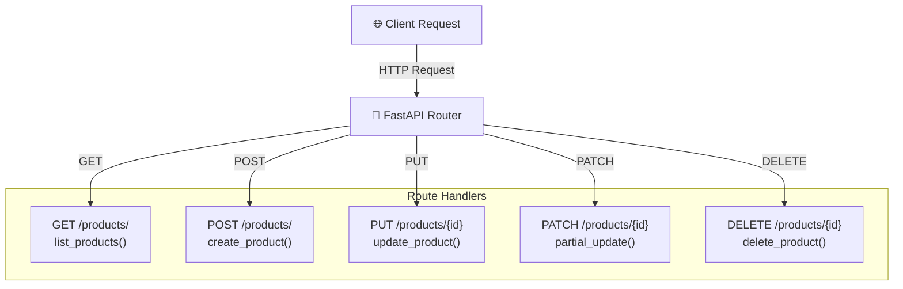

# Routing & Endpoints 🛣️

## Routing কী? (What)

**Routing** মানে হলো — কোন URL-এ কোন function call হবে তা নির্ধারণ করা। যখন কোনো client একটি HTTP request পাঠায়, FastAPI সেই request-এর **URL** এবং **HTTP method** দেখে সঠিক function-এ পাঠায়।

যেমন: `GET /users/` এলে `list_users()` function চলবে, `POST /users/` এলে `create_user()` চলবে।

---

## কেন সঠিক Routing দরকার? (Why)

Routing ছাড়া API তৈরি করা অসম্ভব। কিন্তু শুধু কাজ করলেই হবে না — সঠিক routing structure না থাকলে:

- ✗ কোড দ্রুত messy হয়ে যায়
- ✗ বড় প্রজেক্টে একটি ফাইলে হাজার লাইন জমে যায়
- ✗ Team members বুঝতে পারে না কোথায় কী আছে
- ✗ Testing কঠিন হয়ে পড়ে

সমাধান: **APIRouter** দিয়ে routes গুলো আলাদা ফাইলে ভাগ করা।

---

## HTTP Methods — পরিচয়

| HTTP Method | Decorator | কাজ | উদাহরণ |
|-------------|-----------|-----|---------|
| **GET** | `@app.get()` | ডেটা পড়া (Read) | সব user দেখো |
| **POST** | `@app.post()` | নতুন ডেটা তৈরি (Create) | নতুন user যোগ করো |
| **PUT** | `@app.put()` | সম্পূর্ণ আপডেট (Replace) | পুরো user info বদলাও |
| **PATCH** | `@app.patch()` | আংশিক আপডেট (Partial) | শুধু email বদলাও |
| **DELETE** | `@app.delete()` | ডেটা মুছা (Delete) | user মুছো |

---

## Request Flow Diagram



---

## Basic Routing — সব HTTP Methods

```python
# main.py
from fastapi import FastAPI
from pydantic import BaseModel
from typing import Optional

app = FastAPI(title="Product API")

# ----- Pydantic Models -----
class ProductCreate(BaseModel):
    name: str           # পণ্যের নাম
    price: float        # দাম
    stock: int = 0      # মজুদ (default 0)

class ProductUpdate(BaseModel):
    name: Optional[str] = None    # Optional — না দিলেও চলবে
    price: Optional[float] = None
    stock: Optional[int] = None

# Fake database (শেখার উদ্দেশ্যে)
products_db = {
    1: {"id": 1, "name": "পেন্সিল", "price": 5.0, "stock": 100},
    2: {"id": 2, "name": "খাতা", "price": 25.0, "stock": 50},
}
next_id = 3

# ============ GET ============
@app.get("/products/", tags=["Products"])
def list_products():
    """সব পণ্যের তালিকা — GET /products/"""
    return {
        "total": len(products_db),
        "products": list(products_db.values())
    }

@app.get("/products/{product_id}", tags=["Products"])
def get_product(product_id: int):
    """নির্দিষ্ট পণ্য দেখো — GET /products/1"""
    product = products_db.get(product_id)
    if not product:
        # Error handling পরে শিখবে, এখন সহজ উদাহরণ
        return {"error": f"ID {product_id} এর পণ্য পাওয়া যায়নি"}
    return product

# ============ POST ============
@app.post("/products/", tags=["Products"], status_code=201)
def create_product(product: ProductCreate):
    """নতুন পণ্য তৈরি করো — POST /products/
    
    status_code=201 → Resource তৈরি হলে 201 Created response দাও
    """
    global next_id

    # Pydantic model → Python dict
    product_dict = product.model_dump()
    product_dict["id"] = next_id          # ID যোগ করো
    products_db[next_id] = product_dict   # Database-এ save করো
    next_id += 1

    return {
        "message": "পণ্য তৈরি হয়েছে ✅",
        "product": product_dict
    }

# ============ PUT ============
@app.put("/products/{product_id}", tags=["Products"])
def update_product(product_id: int, product: ProductCreate):
    """পণ্য সম্পূর্ণ আপডেট করো — PUT /products/1
    
    PUT = পুরো object replace করো
    সব field দিতে হবে, না দিলে default value যাবে
    """
    if product_id not in products_db:
        return {"error": "পণ্য পাওয়া যায়নি"}

    updated = product.model_dump()
    updated["id"] = product_id            # ID অপরিবর্তিত রাখো
    products_db[product_id] = updated     # পুরো replace

    return {"message": "পণ্য আপডেট হয়েছে ✅", "product": updated}

# ============ PATCH ============
@app.patch("/products/{product_id}", tags=["Products"])
def partial_update_product(product_id: int, product: ProductUpdate):
    """পণ্য আংশিক আপডেট করো — PATCH /products/1
    
    PATCH = শুধু দেওয়া field গুলো update করো
    বাকি field অপরিবর্তিত থাকবে
    """
    if product_id not in products_db:
        return {"error": "পণ্য পাওয়া যায়নি"}

    existing = products_db[product_id].copy()  # বর্তমান ডেটা

    # শুধু যেসব field দেওয়া হয়েছে সেগুলো update করো
    update_data = product.model_dump(exclude_none=True)  # None বাদ দাও
    existing.update(update_data)
    products_db[product_id] = existing

    return {"message": "পণ্য আংশিক আপডেট হয়েছে ✅", "product": existing}

# ============ DELETE ============
@app.delete("/products/{product_id}", tags=["Products"], status_code=200)
def delete_product(product_id: int):
    """পণ্য মুছো — DELETE /products/1"""
    if product_id not in products_db:
        return {"error": "পণ্য পাওয়া যায়নি"}

    deleted = products_db.pop(product_id)  # মুছে ফেলো এবং return করো
    return {"message": f"'{deleted['name']}' মুছে ফেলা হয়েছে ✅"}
```

---

## APIRouter — কোড Organize করা

বড় প্রজেক্টে সব route এক ফাইলে রাখলে chaos হয়। **APIRouter** দিয়ে routes আলাদা ফাইলে ভাগ করো:

### Project Structure

```
my_api/
├── main.py              ← App entry point
├── routers/
│   ├── __init__.py      ← Empty file (Python package হিসেবে চিনতে)
│   ├── users.py         ← User-related routes
│   ├── posts.py         ← Post-related routes
│   └── products.py      ← Product-related routes
└── models/
    └── schemas.py       ← Pydantic models
```

---

### Router তৈরি — routers/users.py

```python
# routers/users.py
from fastapi import APIRouter
from pydantic import BaseModel
from typing import Optional, List

# APIRouter তৈরি করো
router = APIRouter(
    prefix="/users",      # সব route /users দিয়ে শুরু হবে
                          # যেমন: /users/, /users/{id}, /users/me
    tags=["Users 👤"],    # Swagger UI-তে এই group নামে দেখাবে
    responses={           # এই router-এর সব endpoint-এ common responses
        404: {"description": "User পাওয়া যায়নি"},
    }
)

class UserCreate(BaseModel):
    name: str
    email: str
    age: int

class UserResponse(BaseModel):
    id: int
    name: str
    email: str
    age: int

# Fake database
users_db = {
    1: {"id": 1, "name": "আরিফ হোসেন", "email": "arif@bd.com", "age": 25},
    2: {"id": 2, "name": "নাফিসা আক্তার", "email": "nafisa@bd.com", "age": 23},
}

# prefix="/users" থাকায় আসল URL হবে: GET /users/
@router.get("/", response_model=List[UserResponse])
def list_users():
    """সব user এর তালিকা"""
    return list(users_db.values())

# আসল URL: GET /users/{user_id}
@router.get("/{user_id}", response_model=UserResponse)
def get_user(user_id: int):
    """নির্দিষ্ট user এর তথ্য"""
    user = users_db.get(user_id)
    if not user:
        from fastapi import HTTPException
        raise HTTPException(status_code=404, detail="User পাওয়া যায়নি")
    return user

# আসল URL: POST /users/
@router.post("/", response_model=UserResponse, status_code=201)
def create_user(user: UserCreate):
    """নতুন user তৈরি করো"""
    new_id = max(users_db.keys()) + 1
    new_user = {"id": new_id, **user.model_dump()}
    users_db[new_id] = new_user
    return new_user

# আসল URL: DELETE /users/{user_id}
@router.delete("/{user_id}")
def delete_user(user_id: int):
    """User মুছে ফেলো"""
    if user_id not in users_db:
        from fastapi import HTTPException
        raise HTTPException(status_code=404, detail="User পাওয়া যায়নি")
    deleted = users_db.pop(user_id)
    return {"message": f"'{deleted['name']}' মুছে ফেলা হয়েছে"}
```

---

### আরেকটি Router — routers/posts.py

```python
# routers/posts.py
from fastapi import APIRouter
from pydantic import BaseModel
from typing import Optional, List

router = APIRouter(
    prefix="/posts",
    tags=["Posts 📝"]
)

class PostCreate(BaseModel):
    title: str
    content: str
    author_id: int
    is_published: bool = False   # Default: draft হিসেবে save হবে

posts_db = []

@router.get("/")
def list_posts(published_only: bool = False):
    """সব post — optional: শুধু published দেখো
    
    GET /posts/
    GET /posts/?published_only=true
    """
    if published_only:
        return [p for p in posts_db if p["is_published"]]
    return posts_db

@router.post("/", status_code=201)
def create_post(post: PostCreate):
    """নতুন post তৈরি করো"""
    post_dict = post.model_dump()
    post_dict["id"] = len(posts_db) + 1
    posts_db.append(post_dict)
    return {"message": "Post তৈরি হয়েছে", "post": post_dict}

@router.patch("/{post_id}/publish")
def publish_post(post_id: int):
    """Post publish করো — PATCH /posts/1/publish"""
    for post in posts_db:
        if post["id"] == post_id:
            post["is_published"] = True
            return {"message": "Post publish হয়েছে ✅", "post": post}
    return {"error": "Post পাওয়া যায়নি"}
```

---

### Main App — সব Router একসাথে

```python
# main.py
from fastapi import FastAPI
from routers import users, posts    # Router files import করো

app = FastAPI(
    title="Blog API 📝",
    description="User এবং Post পরিচালনার API",
    version="1.0.0"
)

# ===== Routers include করো =====
app.include_router(users.router)   # /users/ prefix router
app.include_router(posts.router)   # /posts/ prefix router

# Root endpoint
@app.get("/", tags=["Root 🏠"])
def root():
    return {
        "api": "Blog API",
        "version": "1.0.0",
        "endpoints": {
            "users": "/users/",
            "posts": "/posts/",
            "docs": "/docs"
        }
    }
```

এখন সব endpoint:

```
GET    /                    → Root info
GET    /users/              → সব user
GET    /users/{id}          → নির্দিষ্ট user
POST   /users/              → user তৈরি
DELETE /users/{id}          → user মুছো
GET    /posts/              → সব post
POST   /posts/              → post তৈরি
PATCH  /posts/{id}/publish  → post publish করো
```

---

## Multiple Router — E-commerce উদাহরণ

```python
# main.py — বড় প্রজেক্টের উদাহরণ
from fastapi import FastAPI, Depends
from routers import products, orders, users, payments, admin

app = FastAPI(title="E-commerce API 🛒")

# সাধারণ routers
app.include_router(users.router)
app.include_router(products.router)

# Additional prefix main.py থেকেও দেওয়া যায়
app.include_router(
    orders.router,
    prefix="/api/v1",          # /api/v1/orders/
    tags=["Orders 📦"]
)

# Versioned API
app.include_router(
    payments.router,
    prefix="/api/v1"           # /api/v1/payments/
)

# Admin router — আলাদা prefix
app.include_router(
    admin.router,
    prefix="/admin",           # /admin/dashboard, /admin/users
    tags=["Admin 🔧"],
    # Admin-এ auth dependency পরে যোগ হবে
    # dependencies=[Depends(get_admin_user)]
)
```

---

## Async Route — কখন দরকার?

```python
import asyncio
from fastapi import FastAPI

app = FastAPI()

# ✅ Async route — I/O bound কাজে ব্যবহার করো
# Database query, external API call, file read/write
@app.get("/async-example")
async def async_route():
    """
    async def → FastAPI এটি non-blocking ভাবে চালাবে
    অনেক user একসাথে request করলেও একজন আরেকজনকে block করবে না
    """
    await asyncio.sleep(1)    # Simulated DB call
    return {"type": "async", "data": "ডেটা এসেছে"}

# ✅ Sync route — CPU bound কাজে ব্যবহার করো
# Math calculation, image processing, ML inference
@app.get("/sync-example")
def sync_route():
    """
    সাধারণ def → FastAPI thread pool-এ চালাবে
    CPU-intensive কাজের জন্য এটি সঠিক
    """
    result = sum(range(1000000))  # CPU কাজ
    return {"type": "sync", "result": result}
```

::: tip Async vs Sync — কোনটা ব্যবহার করবে?
| কাজের ধরন | সঠিক choice |
|-----------|------------|
| Database query (SQLAlchemy) | `async def` |
| External HTTP API call | `async def` |
| File read/write | `async def` |
| ML model inference | `def` (sync) |
| Image/video processing | `def` (sync) |
| Simple math | `def` (sync) |

যদি নিশ্চিত না থাকো — `async def` দিয়ে শুরু করো।
:::

---

## Common Mistakes ⚠️

::: danger ভুল ১: Route Order ভুল
```python
# ❌ ভুল — /users/me এর আগে /users/{user_id} আসলে সমস্যা
@app.get("/users/{user_id}")   # এটি আগে থাকলে "me" কে user_id মনে করবে
def get_user(user_id: str): ...

@app.get("/users/me")          # এটি কখনো match হবে না!
def get_current_user(): ...
```

```python
# ✅ সঠিক — Specific route আগে রাখো
@app.get("/users/me")          # আগে specific route
def get_current_user(): ...

@app.get("/users/{user_id}")   # পরে dynamic route
def get_user(user_id: str): ...
```
:::

::: danger ভুল ২: Router include করতে ভুলে যাওয়া
```python
# ❌ ভুল — router তৈরি করলে কিন্তু include না করলে কাজ করবে না
from routers import users
# app.include_router(users.router) ← ভুলে গেছে!

@app.get("/")
def root(): ...
# /users/ endpoint কাজ করবে না!
```

```python
# ✅ সঠিক
from routers import users
app.include_router(users.router)  # এটি অবশ্যই করতে হবে
```
:::

::: warning ভুল ৩: PUT এবং PATCH-এর পার্থক্য না বোঝা
```python
# ❌ ভুল — PATCH-এ সব field mandatory করা
@app.patch("/users/{id}")
def update(id: int, name: str, email: str, age: int):  # সব required
    ...  # এটি PUT-এর মতো আচরণ করছে, PATCH না

# ✅ সঠিক — PATCH-এ সব field Optional
class UserPatch(BaseModel):
    name: Optional[str] = None   # Optional
    email: Optional[str] = None  # Optional
    age: Optional[int] = None    # Optional

@app.patch("/users/{id}")
def update(id: int, data: UserPatch):
    # model_dump(exclude_none=True) দিয়ে None বাদ দাও
    updates = data.model_dump(exclude_none=True)
    ...
```
:::

---

## Best Practices ✨

- **APIRouter সবসময় ব্যবহার করো** — এমনকি ছোট প্রজেক্টেও, ভবিষ্যতে বড় হবে
- **`prefix` এবং `tags` দাও** — Swagger UI সুন্দর হয় এবং কোড বোঝা সহজ হয়
- **HTTP method সঠিকভাবে ব্যবহার করো** — GET পড়ার জন্য, POST তৈরির জন্য, PUT/PATCH আপডেটের জন্য, DELETE মুছার জন্য
- **Specific route আগে রাখো** — `/users/me` → `/users/{id}` এই order মেনো
- **`status_code` দাও** — POST → 201, DELETE → 204, GET → 200 (default)
- **Response model দাও** — `response_model=UserResponse` — sensitive data expose হবে না
- **Router file ছোট রাখো** — একটি router-এ ১০-১৫ এর বেশি endpoint হলে আরও ভাগ করো

---

## Interview Questions 🎯

**প্রশ্ন ১: FastAPI-তে PUT এবং PATCH-এর পার্থক্য কী?**

> **উত্তর:** PUT মানে পুরো resource replace করা — সব field দিতে হয়। PATCH মানে আংশিক update — শুধু পরিবর্তিত field দিলেই হয়। FastAPI-তে PATCH-এর জন্য Pydantic model-এ সব field `Optional` রাখতে হয় এবং `model_dump(exclude_none=True)` ব্যবহার করতে হয়।

**প্রশ্ন ২: APIRouter কেন ব্যবহার করা উচিত?**

> **উত্তর:** APIRouter ব্যবহার করলে routes আলাদা ফাইলে ভাগ করা যায়, `prefix` দিয়ে URL namespace আলাদা রাখা যায়, `tags` দিয়ে Swagger-এ গ্রুপ করা যায়, এবং common `responses` বা `dependencies` router-level-এ apply করা যায়। বড় প্রজেক্টে maintainability অনেক বাড়ে।

**প্রশ্ন ৩: Route order কেন গুরুত্বপূর্ণ?**

> **উত্তর:** FastAPI routes top-to-bottom match করে। যদি `/users/{user_id}` আগে থাকে এবং `/users/me` পরে থাকে, তাহলে `/users/me` request-এ `user_id = "me"` হিসেবে ধরা হবে — `/users/me` কখনো match হবে না। তাই specific routes সবসময় dynamic routes-এর আগে রাখতে হবে।

**প্রশ্ন ৪: FastAPI-তে async def এবং def-এর মধ্যে কোনটা ব্যবহার করবো?**

> **উত্তর:** I/O-bound কাজে (database, HTTP calls, file I/O) `async def` ব্যবহার করো — এটি non-blocking এবং অনেক concurrent request handle করতে পারে। CPU-bound কাজে (ML inference, image processing) সাধারণ `def` ব্যবহার করো — FastAPI এটি thread pool-এ চালায়।

---

## Summary 📋

- ✅ `@app.get()`, `@app.post()`, `@app.put()`, `@app.patch()`, `@app.delete()` — পাঁচটি HTTP method
- ✅ **PUT** = সব field replace করো | **PATCH** = শুধু পরিবর্তিত field আপডেট করো
- ✅ **APIRouter** = routes আলাদা ফাইলে ভাগ করার tool
- ✅ `prefix="/users"` → সব route `/users` দিয়ে শুরু হবে
- ✅ `tags=["Users"]` → Swagger UI-তে সুন্দর group
- ✅ `app.include_router(users.router)` — অবশ্যই করতে হবে
- ✅ Specific route → Dynamic route এই order মানো
- ✅ I/O কাজে `async def`, CPU কাজে `def`

---

## পরবর্তী ধাপ ➡️

Routing শেখা হয়েছে। এখন **Pydantic Models** শিখবে — কিভাবে request data validate করতে হয়, Field() দিয়ে custom validation করতে হয়, nested model তৈরি করতে হয় এবং model inheritance ব্যবহার করতে হয়।
